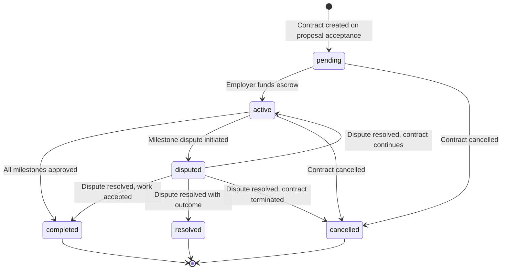
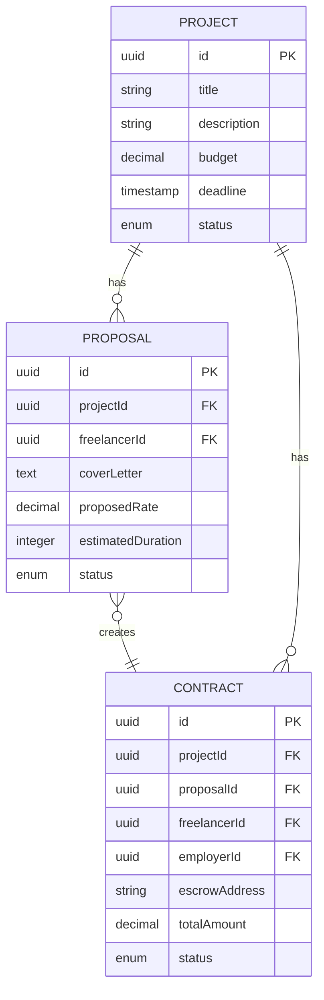
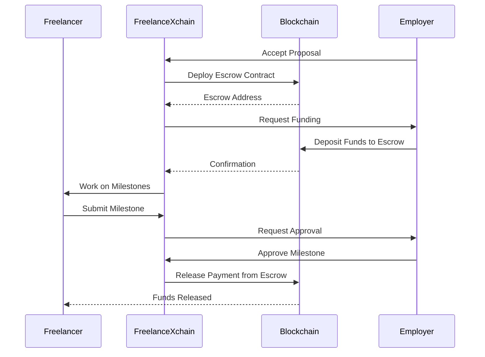

# Contract API

## Table of Contents

1. [Introduction](#introduction)
2. [API Endpoints](#api-endpoints)
   - [List User Contracts](#list-user-contracts)
   - [Get Contract Details](#get-contract-details)
   - [Fund Contract Escrow](#fund-contract-escrow)
   - [Get Contract Funding Info](#get-contract-funding-info)
   - [Cancel Contract](#cancel-contract)
   - [List Contract Disputes](#list-contract-disputes)
3. [Contract Schema](#contract-schema)
4. [Contract Status Lifecycle](#contract-status-lifecycle)
5. [Relationships Between Contracts, Proposals, and Projects](#relationships-between-contracts-proposals-and-projects)
6. [Blockchain Escrow Integration](#blockchain-escrow-integration)
7. [Client Implementation Examples](#client-implementation-examples)
8. [Error Handling](#error-handling)

## Introduction

The Contract API provides access to contract data and lifecycle management within the FreelanceXchain system. Contracts are created when a proposal is accepted and represent formal agreements between freelancers and employers for project work. This API allows users to retrieve their contract history, view detailed contract information, fund escrow, cancel pending contracts, and view associated disputes. All endpoints require JWT authentication, with contract creation handled through the proposal acceptance workflow.

## API Endpoints

### List User Contracts

Retrieves all contracts for the authenticated user (as either freelancer or employer).

**HTTP Method**: GET  
**URL Pattern**: `/api/contracts`  
**Authentication**: JWT (Bearer token)  
**Parameters**:

- `limit` (integer, optional): Number of results per page (default: 20)
- `continuationToken` (string, optional): Token for pagination

**Response**:

```json
{
  "items": [
    {
      "id": "string",
      "projectId": "string",
      "proposalId": "string",
      "freelancerId": "string",
      "employerId": "string",
      "escrowAddress": "string",
      "baseAmount": number,
      "rushFee": number,
      "totalAmount": number,
      "status": "active",
      "createdAt": "string",
      "updatedAt": "string"
    }
  ],
  "hasMore": boolean,
  "continuationToken": "string"
}
```

**Status Codes**:

- 200: Contracts retrieved successfully
- 401: Unauthorized (missing or invalid JWT)

### Get Contract Details

Retrieves details of a specific contract.

**HTTP Method**: GET  
**URL Pattern**: `/api/contracts/{id}`  
**Authentication**: JWT (Bearer token)  
**Path Parameters**:

- `id` (string, required): Contract ID (UUID)

**Response**:

```json
{
  "id": "string",
  "projectId": "string",
  "proposalId": "string",
  "freelancerId": "string",
  "employerId": "string",
  "escrowAddress": "string",
  "baseAmount": number,
  "rushFee": number,
  "totalAmount": number,
  "status": "active",
  "title": "string",
  "description": "string",
  "startDate": "string",
  "endDate": "string",
  "milestones": [],
  "createdAt": "string",
  "updatedAt": "string"
}
```

**Status Codes**:

- 200: Contract retrieved successfully
- 400: Invalid UUID format
- 401: Unauthorized (missing or invalid JWT)
- 403: Forbidden (user is not the freelancer, employer, or admin)
- 404: Contract not found

### Fund Contract Escrow

Deploys and funds the escrow for a pending contract, activating it. Only the employer can fund the escrow. If the contract is already active and funded, returns a success response indicating no action was needed. Requires KYC verification.

**HTTP Method**: POST  
**URL Pattern**: `/api/contracts/{id}/fund`  
**Authentication**: JWT (Bearer token), KYC verified  
**Path Parameters**:

- `id` (string, required): Contract ID (UUID)

**Request Body** (optional):

```json
{
  "escrowAddress": "string",
  "transactionHash": "string"
}
```

- `escrowAddress` (string, optional): Pre-deployed escrow address from the frontend (MetaMask flow)
- `transactionHash` (string, optional): Transaction hash of the frontend-deployed escrow

If no `escrowAddress` is provided in the request body, the server deploys the escrow contract itself using the employer and freelancer wallet addresses.

**Response** (success):

```json
{
  "message": "Contract funded and activated",
  "escrowAddress": "string",
  "contractStatus": "active"
}
```

**Response** (already funded):

```json
{
  "message": "Contract already funded and active",
  "escrowAddress": "string",
  "contractStatus": "active"
}
```

**Status Codes**:

- 200: Escrow funded and contract activated (or already funded)
- 400: Contract not in pending status, missing wallet addresses, or associated project not found
- 401: Unauthorized (missing or invalid JWT)
- 403: Forbidden (only the employer can fund the escrow)
- 404: Contract not found

### Get Contract Funding Info

Returns the data needed by the frontend to deploy the escrow contract via MetaMask. Only the employer can access this endpoint. Includes milestone amounts converted to wei, wallet addresses, and the platform wallet address.

**HTTP Method**: GET  
**URL Pattern**: `/api/contracts/{id}/fund-info`  
**Authentication**: JWT (Bearer token)  
**Path Parameters**:

- `id` (string, required): Contract ID (UUID)

**Response**:

```json
{
  "contractId": "string",
  "freelancerWallet": "string",
  "platformWallet": "string",
  "milestoneAmounts": ["string"],
  "milestoneDescriptions": ["string"],
  "totalAmount": "string"
}
```

**Field Descriptions**:

- `contractId`: The contract ID
- `freelancerWallet`: Freelancer's blockchain wallet address
- `platformWallet`: Platform's wallet address (used as arbiter for milestone approvals)
- `milestoneAmounts`: Array of milestone amounts in wei (strings)
- `milestoneDescriptions`: Array of milestone titles
- `totalAmount`: Total contract amount in wei (string)

**Status Codes**:

- 200: Funding info retrieved successfully
- 400: Missing wallet addresses or associated project not found
- 401: Unauthorized (missing or invalid JWT)
- 403: Forbidden (only the employer can view fund info)
- 404: Contract not found

### Cancel Contract

Cancels a contract that is still in pending status. Requires KYC verification. Only parties to the contract (freelancer or employer) can cancel it.

**HTTP Method**: POST  
**URL Pattern**: `/api/contracts/{id}/cancel`  
**Authentication**: JWT (Bearer token), KYC verified  
**Path Parameters**:

- `id` (string, required): Contract ID (UUID)

**Response**:

```json
{
  "message": "Contract cancelled successfully"
}
```

**Status Codes**:

- 200: Contract cancelled successfully
- 400: Contract cannot be cancelled (not in pending status)
- 401: Unauthorized (missing or invalid JWT)
- 403: Forbidden (user is not authorized to cancel this contract)
- 404: Contract not found

### List Contract Disputes

Retrieves all disputes associated with a contract. Only parties to the contract (freelancer or employer) can view disputes.

**HTTP Method**: GET  
**URL Pattern**: `/api/contracts/{contractId}/disputes`  
**Authentication**: JWT (Bearer token)  
**Path Parameters**:

- `contractId` (string, required): Contract ID (UUID)

**Response**:

```json
[
  {
    "id": "string",
    "contractId": "string",
    "initiatorId": "string",
    "reason": "string",
    "status": "string",
    "resolution": "string",
    "createdAt": "string",
    "updatedAt": "string"
  }
]
```

**Status Codes**:

- 200: Disputes retrieved successfully
- 401: Unauthorized (missing or invalid JWT)
- 403: Forbidden (user is not authorized to view disputes for this contract)
- 404: Contract not found

## Contract Schema

The contract object represents a formal agreement between a freelancer and employer for project work. Contracts are created when a proposal is accepted and contain references to the associated project, proposal, and parties involved.

```json
{
  "id": "string",
  "projectId": "string",
  "proposalId": "string",
  "freelancerId": "string",
  "employerId": "string",
  "escrowAddress": "string",
  "baseAmount": number,
  "rushFee": number,
  "totalAmount": number,
  "status": "active",
  "title": "string",
  "description": "string",
  "startDate": "string",
  "endDate": "string",
  "milestones": [],
  "createdAt": "string",
  "updatedAt": "string"
}
```

**Field Descriptions**:

- `id`: Unique identifier for the contract (UUID)
- `projectId`: Reference to the associated project
- `proposalId`: Reference to the accepted proposal that created this contract
- `freelancerId`: ID of the freelancer party
- `employerId`: ID of the employer party
- `escrowAddress`: Blockchain address of the escrow contract holding funds
- `baseAmount`: Base contract amount before rush fees (in ETH)
- `rushFee`: Additional fee for rush delivery (in ETH, 0 if standard timeline)
- `totalAmount`: Total contract value in ETH (baseAmount + rushFee). The server converts this to wei when interacting with the blockchain escrow contract.
- `status`: Current status of the contract (pending, active, completed, disputed, resolved, cancelled)
- `title`: Optional contract title (typically derived from the associated project)
- `description`: Optional contract description
- `startDate`: Optional contract start date
- `endDate`: Optional contract end date
- `milestones`: Optional array of milestone objects
- `createdAt`: Timestamp when the contract was created
- `updatedAt`: Timestamp when the contract was last updated

## Contract Status Lifecycle

Contracts progress through a defined status lifecycle that governs their state transitions. The valid statuses are: `pending`, `active`, `completed`, `disputed`, `resolved`, and `cancelled`.



**State Transition Rules**:

- From `pending`: Can transition to `active` (via funding) or `cancelled`
- From `active`: Can transition to `completed`, `disputed`, or `cancelled`
- From `disputed`: Can transition to `active`, `completed`, `resolved`, or `cancelled`
- From `completed`: No further transitions allowed
- From `resolved`: No further transitions allowed
- From `cancelled`: No further transitions allowed

## Relationships Between Contracts, Proposals, and Projects

Contracts are created through a workflow that begins with project creation, followed by proposal submission, and finalized by proposal acceptance. This creates a hierarchical relationship between these entities.



**Workflow**:

1. Employer creates a project
2. Freelancer submits a proposal for the project
3. Employer accepts the proposal
4. System automatically creates a contract linked to the project and accepted proposal
5. Contract status is set to `pending` until the employer funds the escrow, then it transitions to `active`

## Blockchain Escrow Integration

Each contract is linked to a blockchain escrow address where funds are held securely. The escrow contract manages fund release according to milestone completion.



**Key Points**:

- Escrow address is stored in the contract's `escrowAddress` field
- Funds are deposited by the employer to the escrow address
- Payments are released to the freelancer upon milestone approval
- The escrow contract ensures funds are only released according to agreed terms

## Client Implementation Examples

### Retrieve User's Contract History

```javascript
// Example using fetch API
async function getUserContracts(limit = 20, continuationToken = null) {
  const url = new URL('/api/contracts', API_BASE_URL);
  if (limit) url.searchParams.append('limit', limit);
  if (continuationToken) url.searchParams.append('continuationToken', continuationToken);

  const response = await fetch(url, {
    method: 'GET',
    headers: {
      'Authorization': `Bearer ${jwtToken}`,
      'Content-Type': 'application/json'
    }
  });

  if (!response.ok) {
    throw new Error(`HTTP error! status: ${response.status}`);
  }

  return await response.json();
}

// Usage
const contractsData = await getUserContracts(10);
console.log('Contracts:', contractsData.items);
console.log('Has more:', contractsData.hasMore);
```

### Display Specific Contract Details

```javascript
// Example using async/await
async function getContractDetails(contractId) {
  const response = await fetch(`/api/contracts/${contractId}`, {
    method: 'GET',
    headers: {
      'Authorization': `Bearer ${jwtToken}`,
      'Content-Type': 'application/json'
    }
  });

  if (!response.ok) {
    if (response.status === 404) {
      throw new Error('Contract not found');
    }
    throw new Error(`Failed to fetch contract: ${response.status}`);
  }

  return await response.json();
}

// Usage
try {
  const contract = await getContractDetails('a1b2c3d4-e5f6-7890-g1h2-i3j4k5l6m7n8');
  displayContract(contract);
} catch (error) {
  console.error('Error fetching contract:', error.message);
}
```

## Error Handling

The Contract API follows a consistent error response format for all endpoints.

**Error Response Format**:

```json
{
  "error": {
    "code": "string",
    "message": "string"
  },
  "timestamp": "string",
  "requestId": "string"
}
```

**Common Error Codes**:

- `AUTH_UNAUTHORIZED`: User not authenticated (401)
- `UNAUTHORIZED`: User not authorized to perform this action (403)
- `FORBIDDEN`: User lacks permission for this resource (403)
- `NOT_FOUND`: Contract not found (404)
- `INVALID_UUID_FORMAT`: Invalid UUID format (400)
- `INVALID_STATUS`: Contract is not in the required status for this operation (400)
- `INVALID_STATUS_TRANSITION`: The requested status change is not allowed (400)
- `ESCROW_FAILED`: Failed to initialize escrow contract (500)
- `ACTIVATION_FAILED`: Escrow funded but contract activation failed (500)
- `CANCEL_FAILED`: Failed to cancel contract (400)
- `PROJECT_NOT_FOUND`: Associated project not found (400)
- `INTERNAL_ERROR`: Internal server error (500)

All error responses include a timestamp and request ID for debugging purposes.

---

[← Back to API Reference](README.md)
