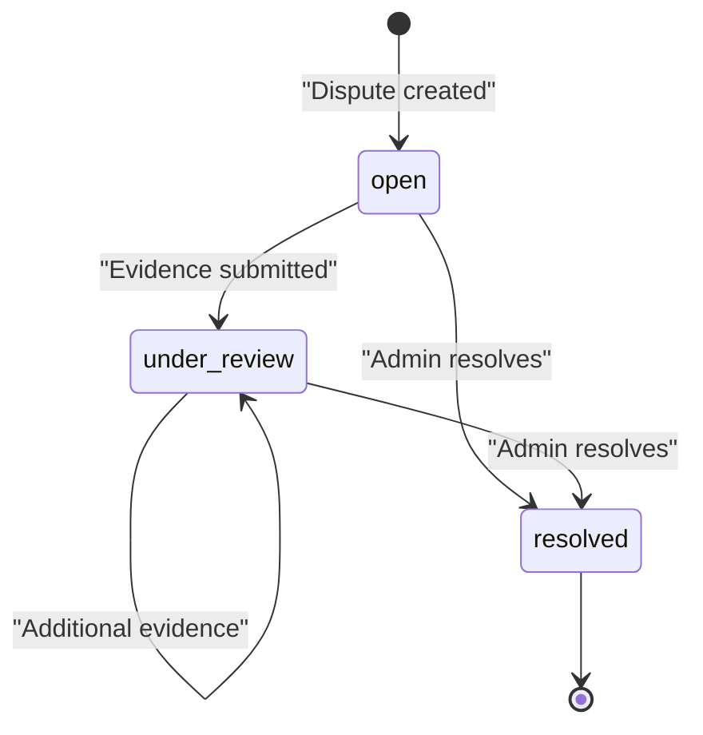

# Dispute API

API for creating, viewing, submitting evidence to, and resolving disputes on the FreelanceXchain platform. All protected endpoints require a `Bearer <JWT>` token in the `Authorization` header.

## Table of Contents

- [Authentication](#authentication)
- [Endpoints](#endpoints)
  - [POST /api/disputes](#post-apidisputes)
  - [GET /api/disputes/{disputeId}](#get-apidisputesdisputeid)
  - [POST /api/disputes/{disputeId}/evidence](#post-apidisputesdisputeidevidence)
  - [POST /api/disputes/{disputeId}/resolve](#post-apidisputesdisputeresolve)
  - [GET /api/contracts/{contractId}/disputes](#get-apicontractcontractiddisputes)
- [Schemas](#schemas)
- [Dispute Status Lifecycle](#dispute-status-lifecycle)
- [Resolution Outcomes](#resolution-outcomes)

## Authentication

All endpoints require a valid Bearer JWT. Role-based access:

| Action | Allowed Roles |
|---|---|
| Create dispute | Contract party (employer or freelancer) |
| Submit evidence | Contract party (employer or freelancer) |
| Resolve dispute | Admin only |
| View dispute(s) | Contract party (employer or freelancer) |

## Endpoints

### POST /api/disputes

Create a new dispute against a milestone.

**Auth:** JWT required, contract party

**Request Body:**

| Field | Type | Required | Description |
|---|---|---|---|
| contractId | string (UUID) | Yes | Contract containing the milestone |
| milestoneId | string (UUID) | Yes | Milestone being disputed |
| reason | string | Yes | Non-empty explanation |

**Response:**

| Status | Description |
|---|---|
| 201 | Dispute created. Returns `Dispute` object. |
| 400 | Validation error (missing/invalid fields) |
| 401 | Missing or invalid JWT |
| 403 | User is not a contract party |
| 404 | Contract or milestone not found |
| 409 | Milestone already disputed, approved, or duplicate active dispute |

**Behavior:**

- Validates contract and milestone existence.
- Ensures milestone is not already disputed or approved.
- Prevents duplicate active disputes per milestone.
- Sets status to `open`, updates milestone/contract status to `disputed`.
- Records dispute on blockchain and notifies both parties.

---

### GET /api/disputes/{disputeId}

Retrieve a single dispute by ID.

**Auth:** JWT required, contract party

**Path Parameters:**

| Param | Type | Description |
|---|---|---|
| disputeId | string (UUID) | Dispute ID |

**Response:**

| Status | Description |
|---|---|
| 200 | Returns `Dispute` object |
| 400 | Invalid UUID format |
| 401 | Missing or invalid JWT |
| 404 | Dispute not found |

---

### POST /api/disputes/{disputeId}/evidence

Submit evidence to an open or under_review dispute.

**Auth:** JWT required, contract party

**Path Parameters:**

| Param | Type | Description |
|---|---|---|
| disputeId | string (UUID) | Dispute ID |

**Request Body:**

| Field | Type | Required | Description |
|---|---|---|---|
| type | string | Yes | One of: `text`, `file`, `link` |
| content | string | Yes | Non-empty evidence content |

**Response:**

| Status | Description |
|---|---|
| 200 | Updated `Dispute` object with appended evidence |
| 400 | Validation error or dispute already resolved |
| 401 | Missing or invalid JWT |
| 403 | User is not a contract party |
| 404 | Dispute not found |

**Behavior:**

- Rejects if dispute status is `resolved`.
- Verifies submitter is a contract party.
- Appends evidence; transitions status from `open` to `under_review` if applicable.
- Records evidence hash on blockchain.

---

### POST /api/disputes/{disputeId}/resolve

Resolve a dispute (admin only).

**Auth:** JWT required, role=admin

**Path Parameters:**

| Param | Type | Description |
|---|---|---|
| disputeId | string (UUID) | Dispute ID |

**Request Body:**

| Field | Type | Required | Description |
|---|---|---|---|
| decision | string | Yes | One of: `freelancer_favor`, `employer_favor`, `split` |
| reasoning | string | Yes | Non-empty explanation of the decision |

**Response:**

| Status | Description |
|---|---|
| 200 | Updated `Dispute` with status `resolved` and `resolution` populated |
| 400 | Validation error, invalid decision, or dispute already resolved |
| 401 | Missing or invalid JWT |
| 403 | User is not an admin |
| 404 | Dispute not found |

**Behavior:**

- Validates resolver has admin role.
- Rejects if dispute is already resolved.
- Records resolution on blockchain.
- Executes financial outcome based on decision (see [Resolution Outcomes](#resolution-outcomes)).
- Notifies both parties.

---

### GET /api/contracts/{contractId}/disputes

List all disputes for a contract.

**Auth:** JWT required, contract party

**Path Parameters:**

| Param | Type | Description |
|---|---|---|
| contractId | string (UUID) | Contract ID |

**Response:**

| Status | Description |
|---|---|
| 200 | Array of `Dispute` objects, ordered by `createdAt` descending |
| 400 | Invalid UUID format |
| 401 | Missing or invalid JWT |
| 403 | User is not a contract party |
| 404 | Contract not found |

## Schemas

### Dispute

| Field | Type | Description |
|---|---|---|
| id | string (UUID) | Unique dispute ID |
| contractId | string (UUID) | Associated contract |
| milestoneId | string (UUID) | Associated milestone |
| initiatorId | string (UUID) | User who created the dispute |
| reason | string | Dispute reason |
| evidence | Evidence[] | Submitted evidence items |
| status | string | `open`, `under_review`, or `resolved` |
| resolution | DisputeResolution \| null | Null until resolved |
| createdAt | string (ISO 8601) | Creation timestamp |
| updatedAt | string (ISO 8601) | Last update timestamp |

### Evidence

| Field | Type | Description |
|---|---|---|
| id | string (UUID) | Evidence item ID |
| submitterId | string (UUID) | User who submitted it |
| type | string | `text`, `file`, or `link` |
| content | string | Evidence content |
| submittedAt | string (ISO 8601) | Submission timestamp |

### DisputeResolution

| Field | Type | Description |
|---|---|---|
| decision | string | `freelancer_favor`, `employer_favor`, or `split` |
| reasoning | string | Admin's explanation |
| resolvedBy | string (UUID) | Admin who resolved |
| resolvedAt | string (ISO 8601) | Resolution timestamp |

## Dispute Status Lifecycle

- **open** -- Initial state on creation.
- **under_review** -- Set automatically when evidence is submitted to an `open` dispute.
- **resolved** -- Set by admin resolution. No further evidence accepted.

## Resolution Outcomes

| Decision | Fund Action | Milestone Status |
|---|---|---|
| `freelancer_favor` | Payment released to freelancer | `approved` |
| `employer_favor` | Payment refunded to employer | `pending` |
| `split` | No automatic transfer (partial release handled separately) | `approved` |

All outcomes are recorded immutably on the blockchain via the DisputeResolution smart contract.

---

[Back to API Reference](README.md)
