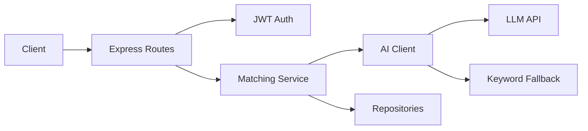

# AI Matching API

The AI Matching API provides skill-based recommendations and analysis for the FreelanceXchain platform. All endpoints require JWT Bearer authentication and use AI-powered matching with keyword-based fallback when AI is unavailable.

## Table of Contents

- [Architecture](#architecture)
- [Authentication](#authentication)
- [Rate Limiting](#rate-limiting)
- [Endpoints](#endpoints)
  - [GET /api/matching/projects](#get-aimatchingprojects)
  - [GET /api/matching/freelancers/:projectId](#get-aimatchingfreelancersprojectid)
  - [POST /api/matching/extract-skills](#post-aimatchingextract-skills)
  - [GET /api/matching/skill-gaps](#get-aimatchingskill-gaps)
- [Schemas](#schemas)
- [Error Handling](#error-handling)
- [Configuration](#configuration)

## Architecture

The system uses a layered approach: Express routes handle HTTP requests with JWT validation, a matching service orchestrates business logic, an AI client communicates with the LLM API, and repositories manage data access. When AI is unavailable, the service falls back to keyword-based matching.



## Authentication

All endpoints require a Bearer token in the Authorization header:

```
Authorization: Bearer <jwt_token>
```

The auth middleware validates the token and attaches user context (userId, email, role) to the request.

## Rate Limiting

- General API: 100 requests per minute per client IP
- Exceeding the limit returns `429 Too Many Requests` with a `Retry-After` header

## Endpoints

### GET /api/matching/projects

Retrieve AI-powered project recommendations for the authenticated freelancer.

**Query Parameters:**

| Parameter | Type | Default | Range | Description |
|-----------|------|---------|-------|-------------|
| limit | integer | 10 | 1-50 | Maximum recommendations to return |

**Response:** `200 OK` - Array of ProjectRecommendation objects

```json
[
  {
    "projectId": "string",
    "matchScore": 92,
    "matchedSkills": ["React", "Node.js"],
    "missingSkills": ["GraphQL"],
    "reasoning": "High match on frontend/backend stack; missing specialized GraphQL skill."
  }
]
```

**Errors:**

- `401 Unauthorized` - Invalid or missing token
- `404 Not Found` - Freelancer profile not found
- `400 Bad Request` - Invalid limit parameter

---

### GET /api/matching/freelancers/:projectId

Retrieve AI-powered freelancer recommendations for a project.

**Path Parameters:**

| Parameter | Type | Description |
|-----------|------|-------------|
| projectId | string (UUID) | Project identifier |

**Query Parameters:**

| Parameter | Type | Default | Range | Description |
|-----------|------|---------|-------|-------------|
| limit | integer | 10 | 1-50 | Maximum recommendations to return |

**Response:** `200 OK` - Array of FreelancerRecommendation objects

```json
[
  {
    "freelancerId": "string",
    "matchScore": 87,
    "reputationScore": 65,
    "combinedScore": 76,
    "matchedSkills": ["React", "Node.js"],
    "reasoning": "Strong alignment on frontend/backend stack."
  }
]
```

**Scoring:** `combinedScore = floor(matchScore × 0.7 + reputationScore × 0.3)`

**Errors:**

- `400 Bad Request` - Invalid UUID or limit
- `401 Unauthorized` - Invalid or missing token
- `404 Not Found` - Project not found

---

### POST /api/matching/extract-skills

Extract skills from text and map them to the platform taxonomy.

**Request Body:**

```json
{
  "text": "Looking for a developer with React, Node.js, and PostgreSQL experience"
}
```

**Response:** `200 OK` - Array of ExtractedSkill objects

```json
[
  { "skillId": "<uuid>", "skillName": "React", "confidence": 0.92 },
  { "skillId": "<uuid>", "skillName": "Node.js", "confidence": 0.88 }
]
```

**Errors:**

- `400 Bad Request` - Missing or invalid text
- `401 Unauthorized` - Invalid or missing token

---

### GET /api/matching/skill-gaps

Analyze freelancer skills and suggest improvements based on market demand.

**Response:** `200 OK` - SkillGapAnalysis object

```json
{
  "currentSkills": ["React", "TypeScript", "Node.js"],
  "recommendedSkills": ["GraphQL", "Docker", "AWS"],
  "marketDemand": [
    { "skillName": "GraphQL", "demandLevel": "high" },
    { "skillName": "Docker", "demandLevel": "medium" }
  ],
  "reasoning": "Based on current skills and market trends, consider upskilling in GraphQL and AWS."
}
```

**Errors:**

- `401 Unauthorized` - Invalid or missing token
- `404 Not Found` - Freelancer profile not found

## Schemas

### ProjectRecommendation

| Field | Type | Description |
|-------|------|-------------|
| projectId | string | Project identifier |
| matchScore | number (0-100) | Skill match percentage |
| matchedSkills | string[] | Skills that match requirements |
| missingSkills | string[] | Required skills the freelancer lacks |
| reasoning | string | AI explanation of the score |

### FreelancerRecommendation

| Field | Type | Description |
|-------|------|-------------|
| freelancerId | string | Freelancer identifier |
| matchScore | number (0-100) | Skill match percentage |
| reputationScore | number (0-100) | Blockchain-verified reputation |
| combinedScore | number (0-100) | Weighted combination (70% skill, 30% reputation) |
| matchedSkills | string[] | Skills that match requirements |
| reasoning | string | AI explanation of the score |

### ExtractedSkill

| Field | Type | Description |
|-------|------|-------------|
| skillId | string | Skill identifier from taxonomy |
| skillName | string | Human-readable skill name |
| confidence | number (0-1) | Extraction confidence level |

### SkillGapAnalysis

| Field | Type | Description |
|-------|------|-------------|
| currentSkills | string[] | Freelancer's current skills |
| recommendedSkills | string[] | Skills to learn |
| marketDemand | array | `{ skillName: string, demandLevel: "high" \| "medium" \| "low" }` |
| reasoning | string | AI explanation of recommendations |

### SkillInfo (AI Input)

| Field | Type | Description |
|-------|------|-------------|
| skillId | string | Skill identifier |
| skillName | string | Human-readable skill name |
| categoryId | string | Skill category identifier |
| yearsOfExperience | number | Years of experience |

## Error Handling

| Status | Cause | Resolution |
|--------|-------|------------|
| 400 | Invalid parameters | Check parameter types and ranges |
| 401 | Missing/invalid token | Ensure Bearer token is valid and not expired |
| 404 | Resource not found | Create required profile or verify project exists |
| 429 | Rate limit exceeded | Respect Retry-After header |
| 5xx | AI service unavailable | Service falls back to keyword matching automatically |

## Configuration

| Variable | Description |
|----------|-------------|
| LLM_API_KEY | LLM API key for AI features |
| LLM_API_URL | LLM API base URL |
| JWT_SECRET | Secret for JWT signing |
| APPWRITE_URL | Appwrite connection URL |
| APPWRITE_ANON_KEY | Appwrite anonymous key |

## Fallback Behavior

When AI is unavailable or fails:

- **Project/Freelancer recommendations:** Uses keyword-based skill matching
- **Skill extraction:** Uses keyword-based extraction against active skills
- **Skill gap analysis:** Returns basic analysis with empty recommendations

The system ensures service availability even without AI configuration.

---

[← Back to API Reference](README.md)
