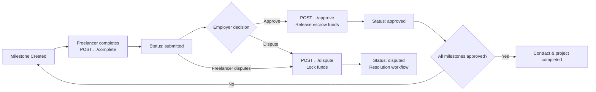

# Payment API

API endpoints for milestone completion, approval, dispute creation, and contract payment status in the FreelanceXchain system. All endpoints require JWT Bearer authentication and validate UUID parameters.

## Table of Contents

- [Endpoints](#endpoints)
  - [Complete Milestone](#post-apipaymentsmilestonesmilestoneidcomplete)
  - [Approve Milestone](#post-apipaymentsmilestonesmilestoneidapprove)
  - [Dispute Milestone](#post-apipaymentsmilestonesmilestoneiddispute)
  - [Contract Payment Status](#get-apipaymentscontractscontractidstatus)
- [Schemas](#schemas)
- [Error Codes](#error-codes)
- [Payment Flow](#payment-flow)

Base URL: `http://localhost:7860/api`
Interactive docs: `http://localhost:7860/api-docs`

## Endpoints

### POST /api/payments/milestones/{milestoneId}/complete

Freelancer marks a milestone as complete. The system updates the milestone status to `submitted`, records the event on the blockchain milestone registry, and notifies the employer.

| | |
|---|---|
| **Auth** | Bearer JWT |
| **Access** | Freelancer associated with the contract |

**Path Parameters**

| Name | Type | Required | Description |
|------|------|----------|-------------|
| milestoneId | UUID | Yes | ID of the milestone to complete |

**Query Parameters**

| Name | Type | Required | Description |
|------|------|----------|-------------|
| contractId | UUID | Yes | ID of the contract containing the milestone |

**Request Body** -- None

**Response `200`** -- MilestoneCompletionResult

```json
{
  "milestoneId": "string",
  "status": "submitted",
  "notificationSent": true
}
```

---

### POST /api/payments/milestones/{milestoneId}/approve

Employer approves a completed milestone. Releases funds from the blockchain escrow, updates milestone status to `approved`, and notifies the freelancer. If all milestones are approved, marks the contract and project as completed and finalizes the agreement on-chain.

| | |
|---|---|
| **Auth** | Bearer JWT |
| **Access** | Employer associated with the contract |

**Path Parameters**

| Name | Type | Required | Description |
|------|------|----------|-------------|
| milestoneId | UUID | Yes | ID of the milestone to approve |

**Query Parameters**

| Name | Type | Required | Description |
|------|------|----------|-------------|
| contractId | UUID | Yes | ID of the contract containing the milestone |

**Request Body** -- None

**Response `200`** -- MilestoneApprovalResult

```json
{
  "milestoneId": "string",
  "status": "approved",
  "paymentReleased": true,
  "transactionHash": "string (optional)",
  "contractCompleted": false
}
```

---

### POST /api/payments/milestones/{milestoneId}/dispute

Either party (freelancer or employer) disputes a milestone. This locks the associated escrow funds, creates a dispute record, and notifies both parties. A milestone cannot be disputed if it is already approved or already under dispute.

| | |
|---|---|
| **Auth** | Bearer JWT |
| **Access** | Freelancer or employer associated with the contract |

**Path Parameters**

| Name | Type | Required | Description |
|------|------|----------|-------------|
| milestoneId | UUID | Yes | ID of the milestone to dispute |

**Query Parameters**

| Name | Type | Required | Description |
|------|------|----------|-------------|
| contractId | UUID | Yes | ID of the contract containing the milestone |

**Request Body**

```json
{
  "reason": "string (required)"
}
```

**Response `200`** -- MilestoneDisputeResult

```json
{
  "milestoneId": "string",
  "status": "disputed",
  "disputeId": "string",
  "disputeCreated": true
}
```

---

### GET /api/payments/contracts/{contractId}/status

Retrieves detailed payment status for a contract, including escrow address, aggregate amounts, and individual milestone statuses. Aggregates off-chain data (project budget and milestone statuses) with on-chain metadata (escrow address).

| | |
|---|---|
| **Auth** | Bearer JWT |
| **Access** | Freelancer or employer associated with the contract |

**Path Parameters**

| Name | Type | Required | Description |
|------|------|----------|-------------|
| contractId | UUID | Yes | ID of the contract to query |

**Query Parameters** -- None

**Request Body** -- None

**Response `200`** -- ContractPaymentStatus

```json
{
  "contractId": "string",
  "escrowAddress": "string",
  "totalAmount": 10000,
  "releasedAmount": 5000,
  "pendingAmount": 5000,
  "milestones": [
    {
      "id": "string",
      "title": "string",
      "amount": 5000,
      "status": "approved"
    }
  ],
  "contractStatus": "active"
}
```

## Schemas

### MilestoneCompletionResult

| Field | Type | Description |
|-------|------|-------------|
| milestoneId | string | UUID of the milestone |
| status | "submitted" | Updated milestone status |
| notificationSent | boolean | Whether the employer was notified |

### MilestoneApprovalResult

| Field | Type | Description |
|-------|------|-------------|
| milestoneId | string | UUID of the milestone |
| status | "approved" | Updated milestone status |
| paymentReleased | boolean | Whether escrow funds were released |
| transactionHash | string? | Blockchain transaction hash (if release succeeded) |
| contractCompleted | boolean | Whether all milestones are now approved |

### MilestoneDisputeResult

| Field | Type | Description |
|-------|------|-------------|
| milestoneId | string | UUID of the milestone |
| status | "disputed" | Updated milestone status |
| disputeId | string | UUID of the created dispute record |
| disputeCreated | boolean | Whether the dispute was created |

### ContractPaymentStatus

| Field | Type | Description |
|-------|------|-------------|
| contractId | string | UUID of the contract |
| escrowAddress | string | On-chain escrow contract address |
| totalAmount | number | Total project budget |
| releasedAmount | number | Sum of approved milestone amounts |
| pendingAmount | number | totalAmount minus releasedAmount |
| milestones | array | Each entry: `{ id, title, amount, status }` |
| contractStatus | string | One of: active, completed, disputed, cancelled |

### Milestone Status Values

`pending` | `in_progress` | `submitted` | `approved` | `disputed`

## Error Codes

All endpoints return standard error responses. Service error codes are mapped to HTTP status codes as follows:

| Status | Meaning | Common Causes |
|--------|---------|---------------|
| **400** | Bad Request | Invalid UUID format, missing required parameter (`contractId`, `reason`) |
| **401** | Unauthorized | Missing or invalid Authorization header / expired JWT |
| **403** | Forbidden | User is not a party to the contract or not the correct role (e.g., non-employer approving) |
| **404** | Not Found | Contract, project, or milestone not found |

## Payment Flow

The milestone payment lifecycle flows through three stages:

1. **Completion** -- The freelancer calls `POST .../complete`. The milestone status becomes `submitted`, and the employer is notified.
2. **Approval** -- The employer calls `POST .../approve`. Escrow funds are released to the freelancer, the milestone status becomes `approved`, and the transaction is recorded on-chain. When all milestones are approved, the contract and project are marked completed and the agreement is finalized on-chain.
3. **Dispute (optional)** -- Either party calls `POST .../dispute` with a reason. Funds are locked, a dispute record is created, and both parties are notified. The dispute enters a resolution workflow where funds may be released to the freelancer, refunded to the employer, or split.



Blockchain integration points: milestone submissions and approvals are recorded on the milestone registry; escrow funds are managed through the escrow contract service; disputes are tracked on the dispute registry.

---

[Back to API Reference](README.md)
