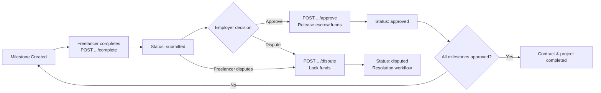

# Payment API

API endpoints for milestone completion, approval, dispute creation, contract payment status, and the payments log in the FreelanceXchain system. All endpoints require JWT Bearer authentication and validate UUID parameters.

## Table of Contents

- [Endpoints](#endpoints)
  - [Complete Milestone](#post-apipaymentsmilestonesmilestoneidcomplete)
  - [Approve Milestone](#post-apipaymentsmilestonesmilestoneidapprove)
  - [Dispute Milestone](#post-apipaymentsmilestonesmilestoneiddispute)
  - [Contract Payment Status](#get-apipaymentscontractscontractidstatus)
  - [Contract Payment History](#get-apipaymentscontractscontractidhistory)
  - [My Payments](#get-apipaymentsme)
  - [Payment Summary](#get-apipaymentssummary)
- [Schemas](#schemas)
- [Error Codes](#error-codes)
- [Payment Flow](#payment-flow)

Base URL: `http://localhost:7860/api`
Interactive docs: `http://localhost:7860/api-docs`

## Endpoints

### POST /api/payments/milestones/{milestoneId}/complete

Freelancer marks a milestone as complete. The system updates the milestone status to `submitted`, records the event on the blockchain milestone registry, and notifies the employer.

| | |
| --- | --- |
| **Auth** | Bearer JWT |
| **Access** | Freelancer associated with the contract |

**Path Parameters**

| Name | Type | Required | Description |
|------|------|----------|-------------|
| milestoneId | UUID | Yes | ID of the milestone to complete |

**Query Parameters**

| Name | Type | Required | Description |
|------|------|----------|-------------|
| contractId | UUID | Yes | ID of the contract containing the milestone |

**Request Body** -- None

**Response `200`** -- MilestoneCompletionResult

```json
{
  "milestoneId": "string",
  "status": "submitted",
  "notificationSent": true
}
```

---

### POST /api/payments/milestones/{milestoneId}/approve

Employer approves a completed milestone. Releases funds from the blockchain escrow, updates milestone status to `approved`, and notifies the freelancer. If all milestones are approved, marks the contract and project as completed and finalizes the agreement on-chain.

| | |
| --- | --- |
| **Auth** | Bearer JWT |
| **Access** | Employer associated with the contract |

**Path Parameters**

| Name | Type | Required | Description |
|------|------|----------|-------------|
| milestoneId | UUID | Yes | ID of the milestone to approve |

**Query Parameters**

| Name | Type | Required | Description |
|------|------|----------|-------------|
| contractId | UUID | Yes | ID of the contract containing the milestone |

**Request Body** -- None

**Response `200`** -- MilestoneApprovalResult

```json
{
  "milestoneId": "string",
  "status": "approved",
  "paymentReleased": true,
  "transactionHash": "string (optional)",
  "contractCompleted": false
}
```

---

### POST /api/payments/milestones/{milestoneId}/dispute

Either party (freelancer or employer) disputes a milestone. This locks the associated escrow funds, creates a dispute record, and notifies both parties. A milestone cannot be disputed if it is already approved or already under dispute.

| | |
| --- | --- |
| **Auth** | Bearer JWT |
| **Access** | Freelancer or employer associated with the contract |

**Path Parameters**

| Name | Type | Required | Description |
|------|------|----------|-------------|
| milestoneId | UUID | Yes | ID of the milestone to dispute |

**Query Parameters**

| Name | Type | Required | Description |
|------|------|----------|-------------|
| contractId | UUID | Yes | ID of the contract containing the milestone |

**Request Body**

```json
{
  "reason": "string (required)"
}
```

**Response `200`** -- MilestoneDisputeResult

```json
{
  "milestoneId": "string",
  "status": "disputed",
  "disputeId": "string",
  "disputeCreated": true
}
```

---

### GET /api/payments/contracts/{contractId}/status

Retrieves detailed payment status for a contract, including escrow address, aggregate amounts, and individual milestone statuses. Aggregates off-chain data (project budget and milestone statuses) with on-chain metadata (escrow address).

| | |
| --- | --- |
| **Auth** | Bearer JWT |
| **Access** | Freelancer or employer associated with the contract |

**Path Parameters**

| Name | Type | Required | Description |
|------|------|----------|-------------|
| contractId | UUID | Yes | ID of the contract to query |

**Query Parameters** -- None

**Request Body** -- None

**Response `200`** -- ContractPaymentStatus

```json
{
  "contractId": "string",
  "escrowAddress": "string",
  "totalAmount": 10000,
  "releasedAmount": 5000,
  "pendingAmount": 5000,
  "milestones": [
    {
      "id": "string",
      "title": "string",
      "amount": 5000,
      "status": "approved"
    }
  ],
  "contractStatus": "active"
}
```

---

### GET /api/payments/contracts/{contractId}/history

Retrieves the payments log for a contract — every ledger money movement (escrow deposit, milestone release, refund, dispute resolution, rush fee), newest first. Each record is written by the money path that moved the funds, so the log is the reconcilable audit trail for the contract's escrow.

| | |
| --- | --- |
| **Auth** | Bearer JWT |
| **Access** | Freelancer or employer associated with the contract, or an admin |

**Path Parameters**

| Name | Type | Required | Description |
|------|------|----------|-------------|
| contractId | UUID | Yes | ID of the contract whose payments log to fetch |

**Query Parameters** -- None

**Request Body** -- None

**Response `200`** -- PaymentHistoryResponse

```json
{
  "contractId": "string",
  "items": [
    {
      "id": "string",
      "milestoneId": "string | null",
      "payerId": "string",
      "payeeId": "string",
      "amount": 5000,
      "currency": "ETH",
      "txHash": "string | null",
      "status": "completed",
      "paymentType": "milestone_release",
      "createdAt": "2026-01-01T00:00:00.000Z"
    }
  ]
}
```

`paymentType` is one of: `escrow_deposit` (funding), `milestone_release` (approval payout),
`refund` (money returned to the employer), `dispute_resolution` (arbiter payout, one record
per payee), `rush_fee` (direct upgrade fee transfer).

---

### GET /api/payments/me

Retrieves every payment where the authenticated user is the **payer** (money out) or **payee** (money in), across all of their contracts, newest first. Paginated with `limit`/`offset`; each item includes the `contractId` so the log can be traced back to the contract it belongs to.

| | |
| --- | --- |
| **Auth** | Bearer JWT |
| **Access** | Authenticated user (their own payments only) |

**Path Parameters** -- None

**Query Parameters**

| Name | Type | Required | Description |
|------|------|----------|-------------|
| limit | integer | No | Max records to return, 1–100 (default `20`) |
| offset | integer | No | Number of records to skip for pagination (default `0`) |

**Request Body** -- None

**Response `200`** -- MyPaymentsResponse

```json
{
  "items": [
    {
      "id": "string",
      "contractId": "string",
      "milestoneId": "string | null",
      "payerId": "string",
      "payeeId": "string",
      "amount": 5000,
      "currency": "ETH",
      "txHash": "string | null",
      "status": "completed",
      "paymentType": "milestone_release",
      "createdAt": "2026-01-01T00:00:00.000Z"
    }
  ],
  "total": 42,
  "hasMore": true,
  "totalEarnings": 7500,
  "totalSpent": 2500
}
```

`total` is the count of the user's payments matching the query; `hasMore` is `true` when
the page is full and more records exist after `offset + limit`. `totalEarnings` and
`totalSpent` are lifetime summaries over all of the user's **completed** records, independent
of pagination, in ETH units (`milestone_release` amounts, stored as wei, are normalized).
They count every record type that moves money between the parties — milestone releases,
refunds, **dispute-resolution legs** (each payee gets its own leg), and **rush fees** — and
exclude `escrow_deposit` records (the escrow-funding trace: the payee never actually
receives it, and its disposition is captured by the release/refund/dispute legs, so counting
it would double-count). They are best-effort: a totals query failure yields `null` (not `0`),
so the UI can show "unavailable" rather than a misleading zero.

---

### GET /api/payments/summary

Lightweight widget endpoint: lifetime `totalEarnings`/`totalSpent` for the authenticated
user, without the itemized log. `available` is `false` when either totals query failed, so
a dashboard widget can render an explicit unavailable state instead of a misleading zero
(the failing totals are `null` in that case).

The summary is cached per user for 60 seconds (the totals scan every completed payment
record, so the endpoint doesn't re-scan on every poll). Only available results are cached
— a failed or unavailable summary is re-fetched on the next request.

| | |
| --- | --- |
| **Auth** | Bearer JWT |
| **Access** | Authenticated user (their own totals only) |

**Path Parameters** -- None

**Query Parameters** -- None

**Request Body** -- None

**Response `200`** -- PaymentSummaryResponse

```json
{
  "totalEarnings": 7500,
  "totalSpent": 2500,
  "available": true
}
```

```json
{
  "totalEarnings": null,
  "totalSpent": null,
  "available": false
}
```

---

## Schemas

### MilestoneCompletionResult

| Field | Type | Description |
| ------- | ------ | ------------- |
| milestoneId | string | UUID of the milestone |
| status | "submitted" | Updated milestone status |
| notificationSent | boolean | Whether the employer was notified |

### MilestoneApprovalResult

| Field | Type | Description |
| ------- | ------ | ------------- |
| milestoneId | string | UUID of the milestone |
| status | "approved" | Updated milestone status |
| paymentReleased | boolean | Whether escrow funds were released |
| transactionHash | string? | Blockchain transaction hash (if release succeeded) |
| contractCompleted | boolean | Whether all milestones are now approved |

### MilestoneDisputeResult

| Field | Type | Description |
| ------- | ------ | ------------- |
| milestoneId | string | UUID of the milestone |
| status | "disputed" | Updated milestone status |
| disputeId | string | UUID of the created dispute record |
| disputeCreated | boolean | Whether the dispute was created |

### ContractPaymentStatus

| Field | Type | Description |
| ------- | ------ | ------------- |
| contractId | string | UUID of the contract |
| escrowAddress | string | On-chain escrow contract address |
| totalAmount | number | Total project budget |
| releasedAmount | number | Sum of approved milestone amounts |
| pendingAmount | number | totalAmount minus releasedAmount |
| milestones | array | Each entry: `{ id, title, amount, status }` |
| contractStatus | string | One of: active, completed, disputed, cancelled |

### PaymentHistoryRecord

A single entry in a contract's payments log. Every ledger money movement writes one (see [ADR-004](../architecture/adr/ADR-004-money-path-audit.md)).

| Field | Type | Description |
| ------- | ------ | ------------- |
| id | string | Payment record ID |
| milestoneId | string? | UUID of the milestone the record relates to (null for deposits) |
| payerId | string | User who paid (money out) |
| payeeId | string | User who received (money in) |
| amount | number | Amount in the record's currency |
| currency | string | Currency of the amount (e.g. `ETH`) |
| txHash | string? | Blockchain transaction hash (null when the record has no tx, e.g. an idempotent-retry refund) |
| status | string | One of: pending, processing, completed, failed, refunded |
| paymentType | string | One of: escrow_deposit, milestone_release, refund, dispute_resolution, rush_fee |
| createdAt | string | ISO timestamp |

### PaymentHistoryResponse

| Field | Type | Description |
| ------- | ------ | ------------- |
| contractId | string | UUID of the contract |
| items | array | `PaymentHistoryRecord[]`, newest first |

### MyPaymentsResponse

| Field | Type | Description |
| ------- | ------ | ------------- |
| items | array | `PaymentHistoryRecord` + `contractId`, newest first |
| total | number | Total records matching the user (payer or payee) |
| hasMore | boolean | Whether more records exist past `offset + limit` |
| totalEarnings | number \| null | Lifetime completed payments received (payee), ETH units — excludes `escrow_deposit`; includes releases, refunds, dispute legs, rush fees; `null` when the totals query failed |
| totalSpent | number \| null | Lifetime completed payments made (payer), ETH units — excludes `escrow_deposit`; includes releases, refunds, dispute legs, rush fees; `null` when the totals query failed |

### PaymentSummaryResponse

| Field | Type | Description |
| ------- | ------ | ------------- |
| totalEarnings | number \| null | Lifetime completed payments received (payee), ETH units; `null` when the query failed |
| totalSpent | number \| null | Lifetime completed payments made (payer), ETH units; `null` when the query failed |
| available | boolean | `false` when either totals query failed — render "unavailable", not a zero |

### Milestone Status Values

`pending` | `in_progress` | `submitted` | `approved` | `disputed`

## Error Codes

All endpoints return standard error responses. Service error codes are mapped to HTTP status codes as follows:

| Status | Meaning | Common Causes |
| -------- | --------- | --------------- |
| **400** | Bad Request | Invalid UUID format, missing required parameter (`contractId`, `reason`), invalid `limit`/`offset` on `/payments/me`, payment-log fetch failure |
| **401** | Unauthorized | Missing or invalid Authorization header / expired JWT |
| **403** | Forbidden | User is not a party to the contract or not the correct role (e.g., non-employer approving) |
| **404** | Not Found | Contract, project, or milestone not found |

## Payment Flow

The milestone payment lifecycle flows through three stages:

1. **Completion** -- The freelancer calls `POST .../complete`. The milestone status becomes `submitted`, and the employer is notified.
2. **Approval** -- The employer calls `POST .../approve`. Escrow funds are released to the freelancer, the milestone status becomes `approved`, and the transaction is recorded on-chain. When all milestones are approved, the contract and project are marked completed and the agreement is finalized on-chain.
3. **Dispute (optional)** -- Either party calls `POST .../dispute` with a reason. Funds are locked, a dispute record is created, and both parties are notified. The dispute enters a resolution workflow where funds may be released to the freelancer, refunded to the employer, or split.



Blockchain integration points: milestone submissions and approvals are recorded on the milestone registry; escrow funds are managed through the escrow contract service; disputes are tracked on the dispute registry.

---

[Back to API Reference](README.md)
