# Proposal API

## Table of Contents
1. [Introduction](#introduction)
2. [Project Structure](#project-structure)
3. [Core Components](#core-components)
4. [Architecture Overview](#architecture-overview)
5. [Detailed Component Analysis](#detailed-component-analysis)
6. [Dependency Analysis](#dependency-analysis)
7. [Performance Considerations](#performance-considerations)
8. [Troubleshooting Guide](#troubleshooting-guide)
9. [Conclusion](#conclusion)

## Introduction
This document describes the GET /api/projects/{id}/proposals endpoint used to retrieve all proposals submitted for a given project. It explains the authentication and authorization requirements, pagination behavior, and the response structure. It also documents the 403 Forbidden response when a user attempts to access proposals for a project they do not own.

## Project Structure
The endpoint is implemented in the projects route module and orchestrated by the proposal service and repository layers. The Swagger/OpenAPI specification defines the endpoint’s parameters and response schema.

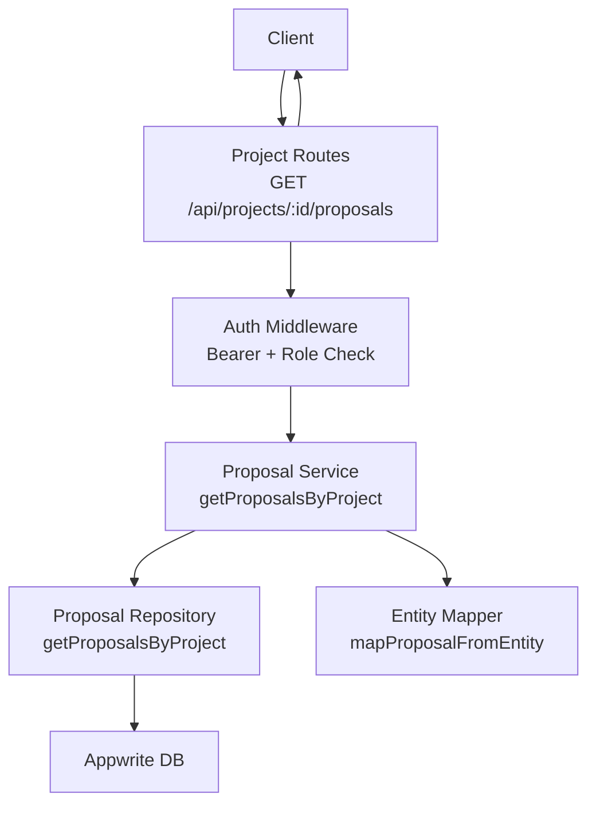

## Core Components
- Endpoint: GET /api/projects/{id}/proposals
- Authentication: Requires a valid Bearer token
- Authorization: Employer role required; caller must own the project
- Pagination: limit and continuationToken query parameters
- Response: items array of proposals, hasMore flag, and continuationToken

Key implementation references:
- Route handler and validation: [project-routes.ts](file://src/routes/project-routes.ts#L575-L683)
- Service method: [proposal-service.ts](file://src/services/proposal-service.ts#L141-L163)
- Repository method: [proposal-repository.ts](file://src/repositories/proposal-repository.ts#L39-L58)
- Pagination model: [base-repository.ts](file://src/repositories/base-repository.ts#L1-L17)
- Proposal model: [entity-mapper.ts](file://src/utils/entity-mapper.ts#L252-L279)

## Architecture Overview
The request flow for retrieving proposals for a project:

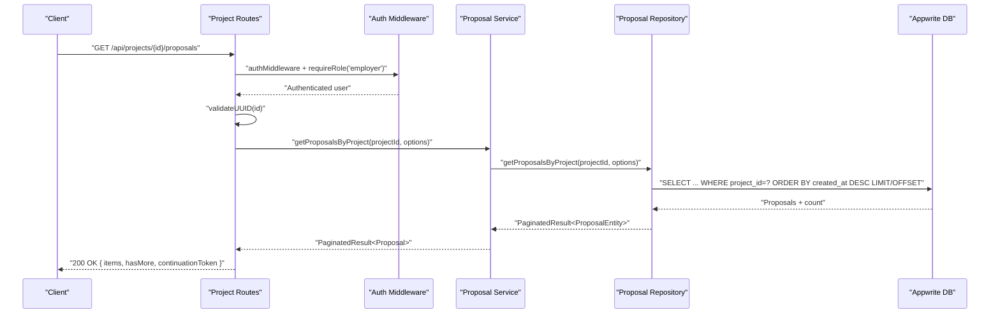

## Detailed Component Analysis

### Endpoint Definition and Behavior
- Path: /api/projects/{id}/proposals
- Method: GET
- Authentication: Bearer token required
- Authorization: Employer role required; endpoint verifies the requesting employer owns the project
- Parameters:
  - Path: id (UUID)
  - Query: limit (integer, default depends on route), continuationToken (string)
- Response body:
  - items: array of Proposal objects
  - hasMore: boolean indicating if more pages exist
  - continuationToken: string for subsequent pages (Swagger schema defines PaginationMeta with totalCount, pageSize, hasMore, continuationToken)

Implementation references:
- Route and validation: [project-routes.ts](file://src/routes/project-routes.ts#L575-L683)
- Swagger schema for Proposal: [swagger.ts](file://src/config/swagger.ts#L139-L152)
- Swagger PaginationMeta: [swagger.ts](file://src/config/swagger.ts#L215-L223)

### Authentication and Authorization
- Bearer token validation occurs via authMiddleware
- Role enforcement ensures only employers can access this endpoint
- Ownership verification checks that the logged-in employer is the project owner

References:
- Auth middleware: [auth-middleware.ts](file://src/middleware/auth-middleware.ts#L1-L101)
- Employer role enforcement: [project-routes.ts](file://src/routes/project-routes.ts#L628-L683)

### Pagination
- Query parameters:
  - limit: number of items per page (defaults to 20 in route)
  - continuationToken: token for fetching the next page
- Repository-level pagination uses limit/offset under the hood
- Response includes hasMore and continuationToken for client-side pagination

References:
- Route pagination handling: [project-routes.ts](file://src/routes/project-routes.ts#L628-L683)
- Base repository pagination model: [base-repository.ts](file://src/repositories/base-repository.ts#L1-L17)
- Repository query with limit/offset: [proposal-repository.ts](file://src/repositories/proposal-repository.ts#L39-L58)

### Response Structure
- items: array of Proposal objects
- hasMore: boolean
- continuationToken: string

Proposal model fields:
- id, projectId, freelancerId, coverLetter, proposedRate, estimatedDuration, status, createdAt, updatedAt

References:
- Proposal schema: [swagger.ts](file://src/config/swagger.ts#L139-L152)
- Proposal entity mapping: [entity-mapper.ts](file://src/utils/entity-mapper.ts#L252-L279)

### Example Response
The endpoint returns an object with:
- items: array of Proposal entries
- hasMore: boolean
- continuationToken: string

Note: The repository returns total count; the route returns items, hasMore, and continuationToken. The Swagger PaginationMeta schema documents totalCount, pageSize, hasMore, continuationToken.

References:
- Route returns paginated result: [project-routes.ts](file://src/routes/project-routes.ts#L668-L681)
- Service maps to Proposal: [proposal-service.ts](file://src/services/proposal-service.ts#L141-L163)
- Proposal schema: [swagger.ts](file://src/config/swagger.ts#L139-L152)

### Error Handling
- 401 Unauthorized: Missing or invalid Bearer token
- 403 Forbidden: Attempting to access proposals for a project owned by another employer
- 404 Not Found: Project not found or proposals not found
- 400 Bad Request: Invalid UUID format (validated by middleware)

References:
- Auth middleware errors: [auth-middleware.ts](file://src/middleware/auth-middleware.ts#L1-L101)
- Ownership check and 403: [project-routes.ts](file://src/routes/project-routes.ts#L644-L662)
- Project not found: [project-routes.ts](file://src/routes/project-routes.ts#L645-L653)
- Service-level not found: [proposal-service.ts](file://src/services/proposal-service.ts#L141-L163)

## Dependency Analysis
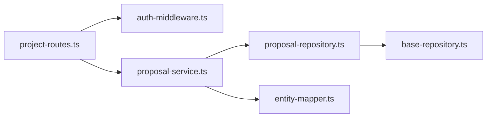

## Performance Considerations
- Pagination defaults to 20 items per page; adjust limit as needed to balance responsiveness and payload size.
- The repository uses OFFSET/LIMIT for pagination; consider indexing on project_id and created_at for optimal query performance.
- The endpoint sorts by created_at descending; ensure appropriate indexes exist for efficient ordering.

[No sources needed since this section provides general guidance]

## Troubleshooting Guide
Common issues and resolutions:
- 401 Unauthorized: Ensure Authorization header includes a valid Bearer token.
- 403 Forbidden: Only the employer who owns the project can list its proposals.
- 404 Not Found: Project ID may be invalid or the project does not exist.
- Invalid UUID: Confirm the id path parameter is a valid UUID.

References:
- Auth middleware behavior: [auth-middleware.ts](file://src/middleware/auth-middleware.ts#L1-L101)
- Ownership verification: [project-routes.ts](file://src/routes/project-routes.ts#L644-L662)
- Project not found: [project-routes.ts](file://src/routes/project-routes.ts#L645-L653)

## Conclusion
The GET /api/projects/{id}/proposals endpoint securely lists all proposals for a project with robust authentication, role-based authorization, and pagination. Employers can retrieve proposals for their own projects, and clients can paginate using limit and continuationToken. The response structure aligns with the Swagger schema for proposals and pagination metadata.

---

## Proposal API

## Table of Contents
1. [Introduction](#introduction)
2. [Project Structure](#project-structure)
3. [Core Components](#core-components)
4. [Architecture Overview](#architecture-overview)
5. [Detailed Component Analysis](#detailed-component-analysis)
6. [Dependency Analysis](#dependency-analysis)
7. [Performance Considerations](#performance-considerations)
8. [Troubleshooting Guide](#troubleshooting-guide)
9. [Conclusion](#conclusion)
10. [Appendices](#appendices)

## Introduction
This document provides comprehensive API documentation for the proposal system in the FreelanceXchain platform. It covers all endpoints for submitting, retrieving, and managing proposals, including acceptance and withdrawal workflows. It also documents authentication requirements (JWT), role-based access controls, validation rules, and the proposal status lifecycle (pending, accepted, rejected, withdrawn). Client implementation examples are included to show how to submit a proposal and handle the contract creation response when a proposal is accepted.

## Project Structure
The proposal system spans routing, service, repository, and mapping layers, plus Swagger definitions and authentication middleware.

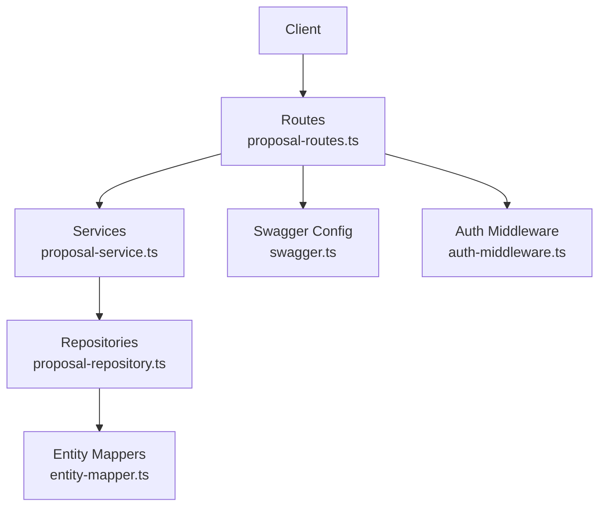

## Core Components
- Routes define HTTP endpoints, request/response schemas, and apply authentication and role checks.
- Services encapsulate business logic, enforce status rules, and orchestrate repository operations and blockchain interactions.
- Repositories abstract persistence and expose typed CRUD operations.
- Entity mappers convert between database entities and API models.
- Swagger defines OpenAPI schemas for Proposal and Contract types.
- Auth middleware validates JWT and enforces role-based access.

## Architecture Overview
The proposal API follows a layered architecture:
- HTTP layer: Express routes
- Application layer: Service functions
- Persistence layer: Appwrite repository
- Mapping layer: Entity mappers
- Security layer: JWT auth and role checks

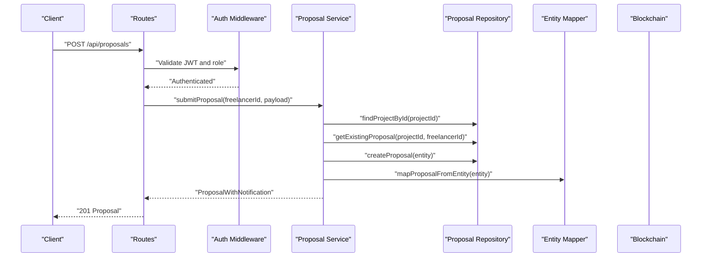

## Detailed Component Analysis

### Authentication and Authorization
- All protected endpoints require a Bearer token in the Authorization header.
- The auth middleware validates the token format and decodes user identity and role.
- Role checks restrict endpoints to freelancers or employers as indicated below.

Key behaviors:
- Missing or malformed Authorization header yields 401.
- Invalid/expired token yields 401 with specific error code.
- Missing role yields 403.

### Proposal Model and Schemas
Proposal schema includes:
- id, projectId, freelancerId
- coverLetter, proposedRate, estimatedDuration
- status: pending, accepted, rejected, withdrawn
- createdAt, updatedAt

Contract schema includes:
- id, projectId, proposalId, freelancerId, employerId
- escrowAddress, totalAmount
- status: active, completed, disputed, cancelled
- createdAt, updatedAt

These schemas are defined in Swagger and used across responses.

### Endpoints

#### Submit Proposal
- Method: POST
- URL: /api/proposals
- Authentication: JWT required; role: freelancer
- Request body:
  - projectId (string, UUID)
  - coverLetter (string, min length 10)
  - proposedRate (number, >= 1)
  - estimatedDuration (number, >= 1)
- Responses:
  - 201: Proposal created
  - 400: Validation error
  - 401: Unauthorized
  - 404: Project not found
  - 409: Duplicate proposal

Validation rules enforced:
- projectId must be a valid UUID
- coverLetter must be at least 10 characters
- proposedRate must be at least 1
- estimatedDuration must be at least 1 day
- Project must be open
- No duplicate proposal from the same freelancer for the same project

Success response includes the created Proposal.

#### Get Proposal by ID
- Method: GET
- URL: /api/proposals/{id}
- Authentication: JWT required
- Path parameter: id (UUID)
- Responses:
  - 200: Proposal
  - 400: Invalid UUID format
  - 401: Unauthorized
  - 404: Proposal not found

#### Get My Proposals (Freelancer)
- Method: GET
- URL: /api/proposals/freelancer/me
- Authentication: JWT required; role: freelancer
- Responses:
  - 200: Array of Proposal
  - 401: Unauthorized

#### Accept Proposal
- Method: POST
- URL: /api/proposals/{id}/accept
- Authentication: JWT required; role: employer
- Path parameter: id (UUID)
- Responses:
  - 200: { proposal: Proposal, contract: Contract }
  - 400: Invalid proposal status or UUID format
  - 401: Unauthorized
  - 403: Unauthenticated or unauthorized
  - 404: Proposal not found

Behavior:
- Validates proposal is pending
- Verifies employer owns the associated project
- Updates proposal status to accepted
- Creates a Contract entity linked to the proposal and project
- Attempts to create and sign a blockchain agreement (best-effort)
- Updates project status to in_progress
- Sends notification to freelancer

#### Reject Proposal
- Method: POST
- URL: /api/proposals/{id}/reject
- Authentication: JWT required; role: employer
- Path parameter: id (UUID)
- Responses:
  - 200: Proposal (status: rejected)
  - 400: Invalid proposal status or UUID format
  - 401: Unauthorized
  - 403: Unauthenticated or unauthorized
  - 404: Proposal not found

Behavior:
- Validates proposal is pending
- Verifies employer owns the associated project
- Updates proposal status to rejected
- Sends notification to freelancer

#### Withdraw Proposal
- Method: POST
- URL: /api/proposals/{id}/withdraw
- Authentication: JWT required; role: freelancer
- Path parameter: id (UUID)
- Responses:
  - 200: Proposal (status: withdrawn)
  - 400: Invalid proposal status or UUID format
  - 401: Unauthorized
  - 403: Unauthenticated or unauthorized
  - 404: Proposal not found

Behavior:
- Validates proposal is pending
- Ensures freelancer owns the proposal
- Updates proposal status to withdrawn

### Proposal Status Lifecycle
- pending: Initial state after submission
- accepted: Employer accepted the proposal; contract created
- rejected: Employer rejected the proposal
- withdrawn: Freelancer withdrew a pending proposal

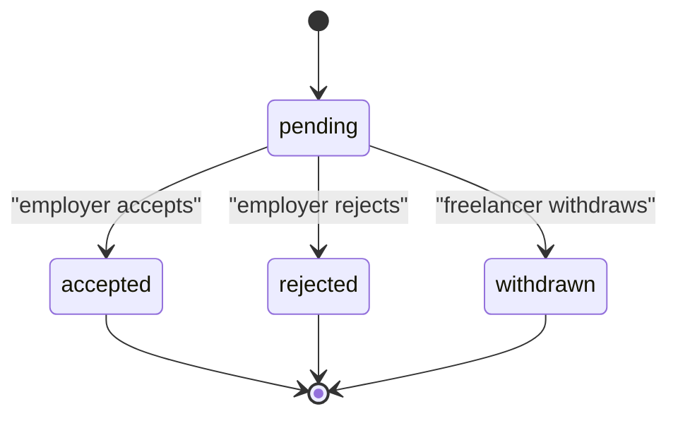

### Role-Based Access Controls
- Submit Proposal: freelancer only
- Accept/Reject Proposal: employer only
- Withdraw Proposal: freelancer only
- Get Proposal Details: authenticated user
- Get My Proposals: freelancer only

### Validation Rules
- projectId: required, valid UUID
- coverLetter: required, min length 10
- proposedRate: required, numeric, >= 1
- estimatedDuration: required, numeric, >= 1 day
- Project must be open for submissions
- Duplicate proposal per freelancer per project is not allowed

### Client Implementation Examples

#### Example: Submit a Proposal
- Endpoint: POST /api/proposals
- Headers: Authorization: Bearer <JWT>, Content-Type: application/json
- Request body:
  - projectId: UUID
  - coverLetter: string (>= 10 chars)
  - proposedRate: number (>= 1)
  - estimatedDuration: number (>= 1)
- Expected responses:
  - 201: Created Proposal
  - 400: Validation error
  - 401: Unauthorized
  - 404: Project not found
  - 409: Duplicate proposal

#### Example: Handle Contract Creation on Accept
- Endpoint: POST /api/proposals/{id}/accept
- Expected response:
  - proposal: Proposal (status: accepted)
  - contract: Contract (with contract details)
- Client should:
  - Store the returned contract metadata
  - Track contract status transitions
  - Proceed with milestone workflows as per contract terms

## Dependency Analysis

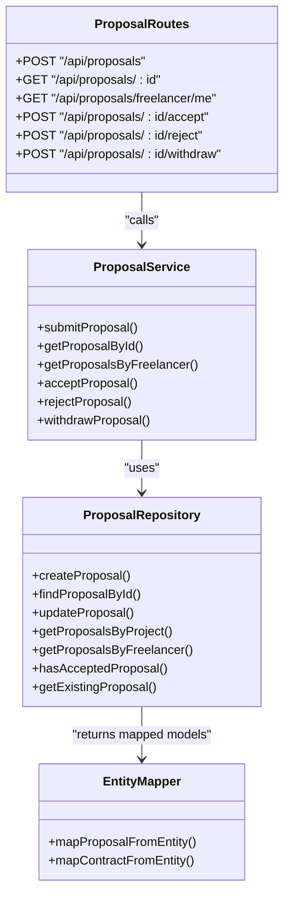

## Performance Considerations
- Pagination is supported for listing proposals by project via repository methods; consider using limit/offset for large datasets.
- Accept/Reject/Withdraw operations perform a small number of database writes and a blockchain operation (best-effort); network latency may impact response time.
- Ensure clients cache frequently accessed Proposal and Contract details to reduce repeated requests.

[No sources needed since this section provides general guidance]

## Troubleshooting Guide
Common issues and resolutions:
- 400 Validation Error: Review request body fields (UUID format, lengths, numeric bounds).
- 401 Unauthorized: Ensure Authorization header is present and contains a valid Bearer token.
- 403 Forbidden: Confirm the user’s role matches the endpoint requirement.
- 404 Not Found: Verify resource IDs exist (project, proposal).
- 409 Conflict (Duplicate Proposal): A proposal already exists for the same freelancer and project.

## Conclusion
The proposal system provides a robust, role-aware API for freelancers to submit proposals and for employers to manage them. It enforces strong validation, maintains clear status transitions, and integrates with contract and blockchain workflows upon acceptance. Clients should implement proper JWT handling, adhere to validation rules, and expect contract creation on successful acceptance.

[No sources needed since this section summarizes without analyzing specific files]

## Appendices

### API Definitions

- Base URL: http://localhost:7860/api
- Interactive docs: http://localhost:7860/api-docs
- Authentication: Bearer token in Authorization header

### Proposal Schema
- Fields: id, projectId, freelancerId, coverLetter, proposedRate, estimatedDuration, status, createdAt, updatedAt

### Contract Schema
- Fields: id, projectId, proposalId, freelancerId, employerId, escrowAddress, totalAmount, status, createdAt, updatedAt

---

## Proposal Acceptance

## Table of Contents
1. [Introduction](#introduction)
2. [Project Structure](#project-structure)
3. [Core Components](#core-components)
4. [Architecture Overview](#architecture-overview)
5. [Detailed Component Analysis](#detailed-component-analysis)
6. [Dependency Analysis](#dependency-analysis)
7. [Performance Considerations](#performance-considerations)
8. [Troubleshooting Guide](#troubleshooting-guide)
9. [Conclusion](#conclusion)

## Introduction
This document provides API documentation for the proposal acceptance endpoint in the FreelanceXchain system. It covers the POST /api/proposals/{id}/accept endpoint that enables employers to accept a freelancer’s proposal. Upon acceptance, the system updates the proposal status to accepted and automatically creates a new contract via the contract service, initiating the escrow process. The response includes both the updated Proposal object and the newly created Contract object. The document outlines authentication via JWT, role-based restrictions, validation rules, and error handling behavior.

## Project Structure
The proposal acceptance flow spans routing, middleware, service, repository, and model layers, plus blockchain integration for escrow creation.

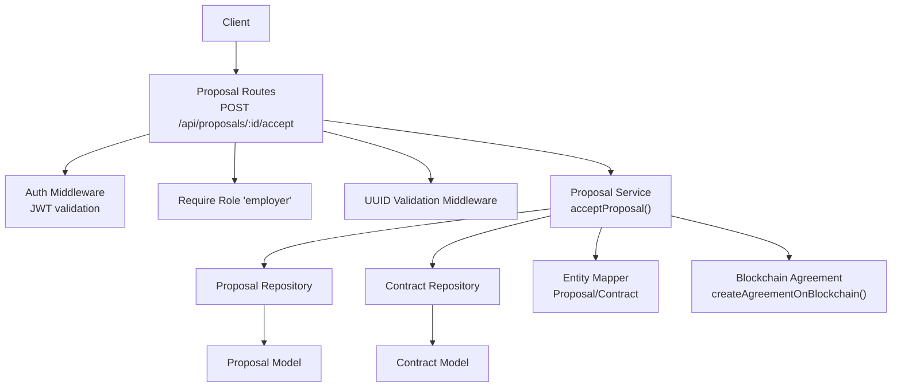

## Core Components
- Route handler enforces JWT authentication, employer role, and UUID path parameter validation.
- Service orchestrates proposal acceptance, status update, contract creation, blockchain agreement, and project status update.
- Repositories persist proposal and contract entities.
- Entity mapper converts database entities to API models.
- Blockchain integration creates and signs an agreement on-chain.

Key behaviors:
- Acceptance requires proposal status to be pending.
- Only the project owner (employer) can accept a proposal.
- On success, returns both the updated proposal and the newly created contract.

## Architecture Overview
The endpoint follows a layered architecture:
- HTTP layer: Express route with middleware.
- Application layer: Proposal service encapsulates business logic.
- Persistence layer: Repositories for proposal and contract.
- Mapping layer: Entity mapper for DTO conversion.
- Integration layer: Blockchain agreement creation.

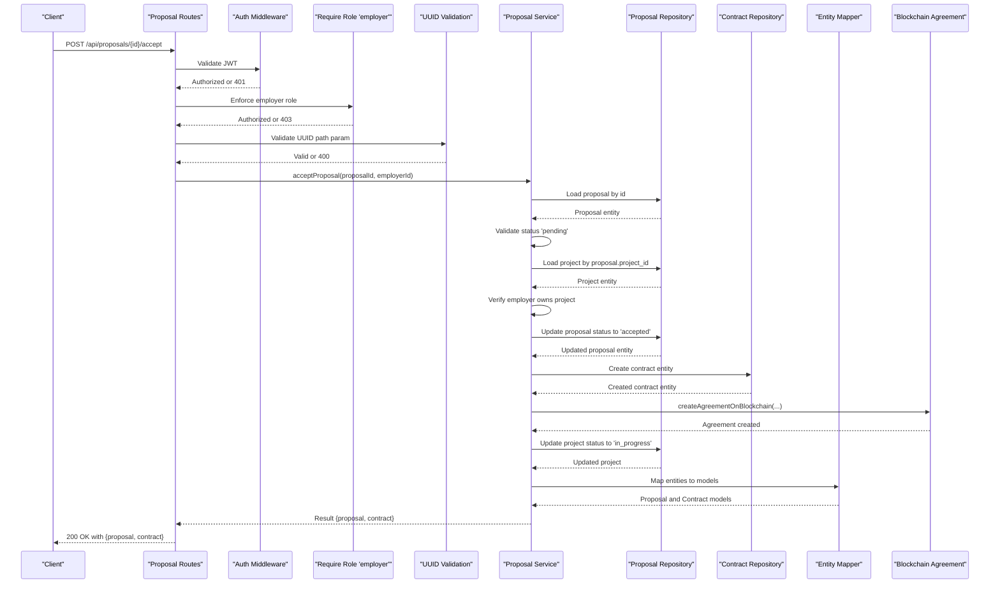

## Detailed Component Analysis

### Endpoint Definition
- Method: POST
- URL: /api/proposals/{id}/accept
- Path parameter: id (UUID)
- Authentication: Bearer JWT
- Roles: employer only
- Validation: UUID format enforced

Response schema:
- proposal: Proposal model
- contract: Contract model

Status codes:
- 200: Success
- 400: Invalid UUID format or invalid status
- 401: Unauthorized
- 403: Insufficient permissions
- 404: Proposal not found

Practical example:
- An employer calls the endpoint with a valid JWT and a proposal UUID.
- On success, the response includes the updated Proposal (status accepted) and the newly created Contract (with initial status active and empty escrow address pending blockchain initialization).

Validation checks:
- Proposal must exist and be pending.
- Only the project owner (employer) can accept.
- Path parameter must be a valid UUID.

### Route Handler Behavior
- Uses authMiddleware to validate JWT.
- Uses requireRole('employer') to restrict access.
- Uses validateUUID() to enforce UUID path parameter format.
- Calls acceptProposal(service) and returns combined result.

Error mapping:
- NOT_FOUND -> 404
- UNAUTHORIZED -> 403
- Otherwise -> 400

### Service Logic: acceptProposal
- Loads proposal by ID; returns NOT_FOUND if absent.
- Ensures proposal status is pending; otherwise INVALID_STATUS.
- Loads project and verifies employer ownership; returns UNAUTHORIZED if mismatch.
- Updates proposal status to accepted.
- Creates a new contract with:
  - project_id from proposal
  - proposal_id from proposal
  - freelancer_id and employer_id from proposal and project
  - total_amount from project budget
  - status active
  - escrow_address initially empty
- Attempts to create and sign a blockchain agreement (employer creates, freelancer auto-signs).
- Updates project status to in_progress.
- Returns { proposal, contract } mapped to models.

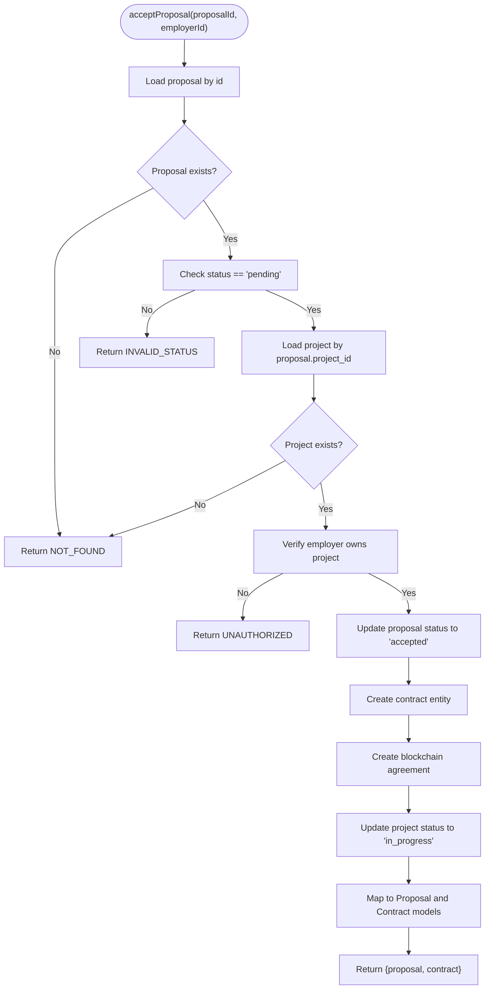

### Data Models and Mapping
- Proposal model fields include id, projectId, freelancerId, coverLetter, proposedRate, estimatedDuration, status, createdAt, updatedAt.
- Contract model fields include id, projectId, proposalId, freelancerId, employerId, escrowAddress, totalAmount, status, createdAt, updatedAt.
- Entity mapper converts repository entities to API models.

### Blockchain Integration
- On successful acceptance, the service attempts to create an agreement on the blockchain using the employer and freelancer wallet addresses and project terms.
- The freelancer auto-signs the agreement after acceptance.
- The contract’s escrow_address remains empty until the escrow is initialized externally.

### Contract Service Context
- The contract service provides additional operations (e.g., updating status transitions, setting escrow address, retrieving contracts by proposalId).
- These operations complement the acceptance flow by enabling subsequent contract lifecycle management.

## Dependency Analysis
The endpoint depends on:
- Route handler for authentication, role enforcement, and UUID validation.
- Proposal service for business logic.
- Repositories for persistence.
- Entity mapper for model conversion.
- Blockchain service for agreement creation.

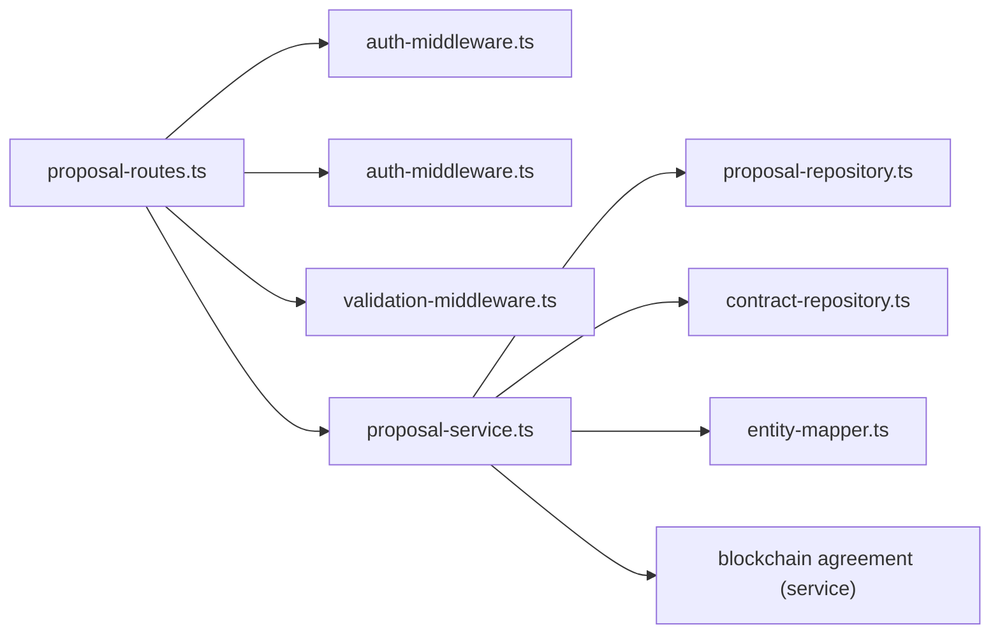

## Performance Considerations
- Minimizing database round-trips: The service performs a small fixed number of reads/writes per acceptance.
- Asynchronous blockchain operations: Agreement creation is attempted asynchronously; failures are logged and do not block the HTTP response.
- Caching: No caching is implemented in the acceptance flow; keep in mind that repeated acceptance attempts for the same proposal should be prevented by the pending status check.

[No sources needed since this section provides general guidance]

## Troubleshooting Guide
Common issues and resolutions:
- 401 Unauthorized: Ensure a valid Bearer token is included in the Authorization header.
- 403 Forbidden: Confirm the user has the employer role and owns the project associated with the proposal.
- 400 Bad Request: Verify the proposal ID is a valid UUID and the proposal status is pending.
- 404 Not Found: The proposal may not exist or the project may have been deleted.
- Blockchain failure: Agreement creation errors are logged and do not prevent contract creation; initialize escrow separately if needed.

## Conclusion
The POST /api/proposals/{id}/accept endpoint provides a robust, role-restricted mechanism for employers to accept proposals. It enforces strict validation, updates statuses atomically, creates contracts, and initiates blockchain agreements. The response returns both the updated proposal and the new contract, enabling downstream escrow initialization and milestone management.

---

## Proposal Rejection

## Table of Contents
1. [Introduction](#introduction)
2. [Project Structure](#project-structure)
3. [Core Components](#core-components)
4. [Architecture Overview](#architecture-overview)
5. [Detailed Component Analysis](#detailed-component-analysis)
6. [Dependency Analysis](#dependency-analysis)
7. [Performance Considerations](#performance-considerations)
8. [Troubleshooting Guide](#troubleshooting-guide)
9. [Conclusion](#conclusion)

## Introduction
This document describes the POST /api/proposals/{id}/reject endpoint used by employers to reject a proposal. It covers the HTTP method, URL structure with UUID path parameter, authentication and role-based access control, workflow behavior, response schema, and status codes. It also explains backend validations that ensure only the project owner can reject proposals and only pending proposals can be rejected, along with the notification trigger that informs the freelancer.

## Project Structure
The proposal rejection endpoint is implemented as part of the proposals feature module:
- Route handler: defines the endpoint, applies middleware, and delegates to the service layer
- Service layer: enforces business rules, updates the proposal, and triggers notifications
- Middleware: authentication and role checks, plus UUID validation for path parameters
- Repositories and mappers: persistence and model mapping
- Notification service: creates a “proposal_rejected” notification for the freelancer

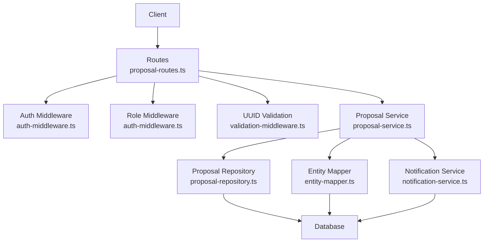

## Core Components
- Endpoint definition: POST /api/proposals/{id}/reject
- Authentication: Bearer JWT token required
- Authorization: Only users with role “employer”
- Path parameter validation: {id} must be a valid UUID
- Business logic: Reject a pending proposal and send a notification to the freelancer
- Response: Updated Proposal object

## Architecture Overview
The rejection workflow spans route handling, middleware enforcement, service logic, and persistence/notification layers.

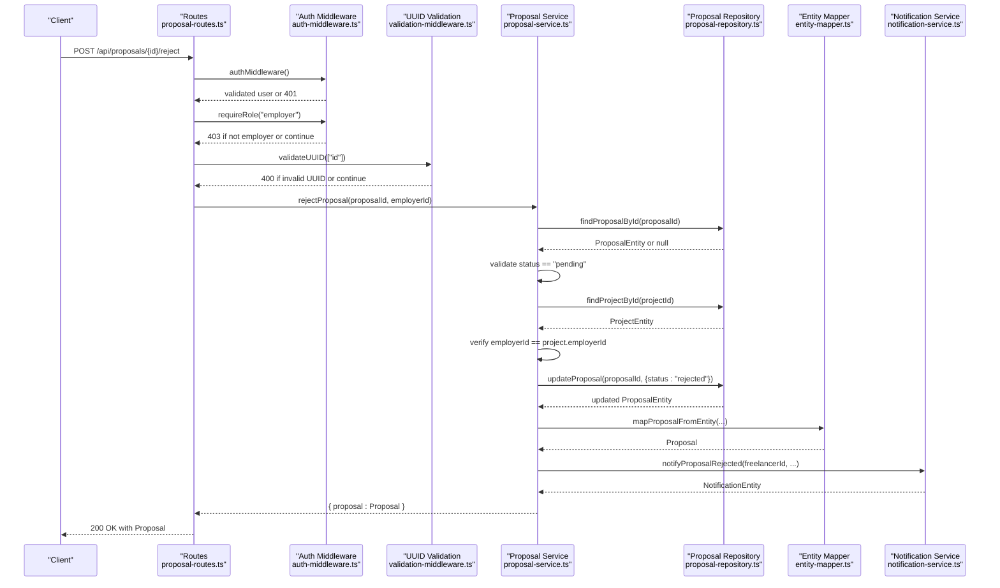

## Detailed Component Analysis

### Endpoint Definition
- Method: POST
- URL: /api/proposals/{id}/reject
- Path parameter: id (UUID)
- Authentication: Bearer JWT token required
- Authorization: employer role required
- Body: not used for rejection (no request body)
- Response: 200 OK with the updated Proposal object

### Authentication and Authorization
- Authentication middleware validates the Authorization header format and verifies the JWT token. On failure, returns 401 with an error payload.
- Role middleware ensures the authenticated user has role “employer”. On failure, returns 403 with an error payload.

### UUID Validation
- The route applies UUID validation for the path parameter {id}. If invalid, returns 400 with a validation error payload.

### Business Logic and Workflow
- Load proposal by ID; return 404 if not found.
- Ensure proposal status is “pending”; otherwise return 400 with an error indicating invalid state.
- Load project by proposal’s project_id; return 404 if not found.
- Verify that the employerId equals the project’s employerId; otherwise return 403 with unauthorized error.
- Update proposal status to “rejected”.
- Map the updated entity to the Proposal model.
- Create a notification of type “proposal_rejected” for the freelancer.
- Return the updated Proposal object with 200 OK.

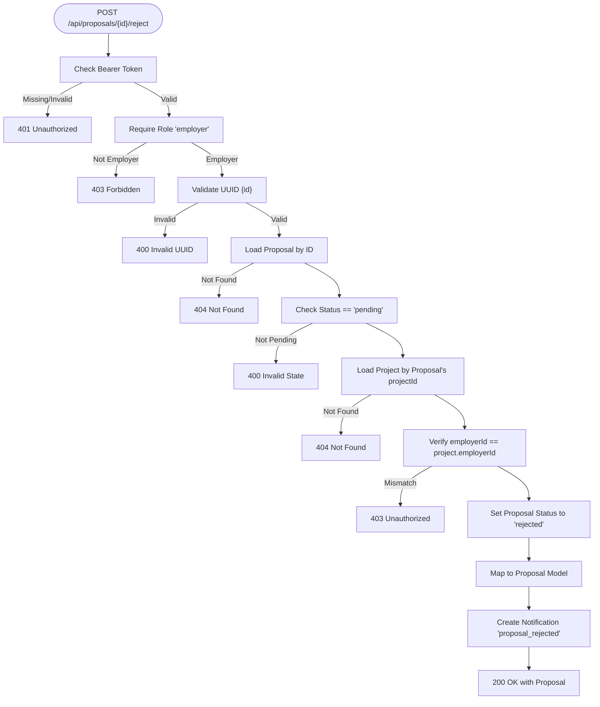

### Response Schema
- Success response: 200 OK with the updated Proposal object
- Error responses:
  - 400 Bad Request: invalid UUID format or invalid proposal state
  - 401 Unauthorized: missing or invalid Bearer token
  - 403 Forbidden: insufficient permissions (not employer) or unauthorized action (not project owner)
  - 404 Not Found: proposal or project not found

The Proposal object includes:
- id: string (UUID)
- projectId: string (UUID)
- freelancerId: string (UUID)
- coverLetter: string
- proposedRate: number
- estimatedDuration: number
- status: one of pending, accepted, rejected, withdrawn
- createdAt: string (ISO 8601)
- updatedAt: string (ISO 8601)

### Example Scenario
Scenario: An employer rejects a proposal because the freelancer’s skills do not match the project requirements.
- The employer calls POST /api/proposals/{proposalId}/reject with a valid JWT token and role “employer”.
- The system verifies the proposal is pending and owned by the employer.
- The proposal status is updated to “rejected”.
- A notification of type “proposal_rejected” is created for the freelancer.
- The endpoint returns 200 OK with the updated Proposal object.

## Dependency Analysis
- Route depends on:
  - auth-middleware for JWT validation and role checks
  - validation-middleware for UUID parameter validation
  - proposal-service for business logic
- proposal-service depends on:
  - proposal-repository for persistence
  - entity-mapper for model conversion
  - notification-service for creating notifications
- proposal-repository depends on Appwrite client and the proposals table
- notification-service depends on notification-repository and Appwrite

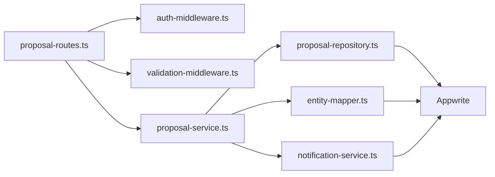

## Performance Considerations
- The endpoint performs two database reads (proposal and project) and one write (proposal update). These are lightweight operations suitable for typical load.
- UUID validation occurs before any database calls, reducing unnecessary database traffic on malformed requests.
- Notification creation is performed synchronously in the service layer; consider offloading to a queue if high throughput is anticipated.

[No sources needed since this section provides general guidance]

## Troubleshooting Guide
Common issues and resolutions:
- 400 Invalid UUID: Ensure the {id} path parameter is a valid UUID.
- 400 Invalid State: The proposal must be in “pending” status to be rejected.
- 401 Unauthorized: Confirm the Authorization header is present and contains a valid Bearer token.
- 403 Forbidden: The authenticated user must have role “employer” and must own the project containing the proposal.
- 404 Not Found: The proposal or project does not exist.

Validation and error handling are centralized in the route handlers and middleware, returning structured error payloads with timestamps and request IDs.

## Conclusion
The POST /api/proposals/{id}/reject endpoint provides a secure and robust mechanism for employers to reject proposals. It enforces JWT authentication, role-based access control, UUID parameter validation, and strict business rules (only pending proposals, only project owners). On success, it returns the updated Proposal object and triggers a notification for the freelancer. The implementation is modular, testable, and aligned with the broader system architecture.

---

## Proposal Retrieval

## Table of Contents
1. [Introduction](#introduction)
2. [Project Structure](#project-structure)
3. [Core Components](#core-components)
4. [Architecture Overview](#architecture-overview)
5. [Detailed Component Analysis](#detailed-component-analysis)
6. [Dependency Analysis](#dependency-analysis)
7. [Performance Considerations](#performance-considerations)
8. [Troubleshooting Guide](#troubleshooting-guide)
9. [Conclusion](#conclusion)

## Introduction
This document describes the proposal retrieval endpoints in the FreelanceXchain system. It covers:
- Two GET endpoints: retrieving a specific proposal by UUID and retrieving all proposals submitted by the authenticated freelancer.
- Authentication and authorization requirements.
- Response schemas aligned with the Proposal model.
- Access control rules and error responses.
- Usage examples for an employer viewing a proposal and a freelancer checking their submission history.
- How the service layer validates ownership and permissions before returning data.

## Project Structure
The proposal retrieval endpoints are implemented in the routing layer and backed by a service layer that interacts with repositories and uses entity mappers to produce the Proposal model.

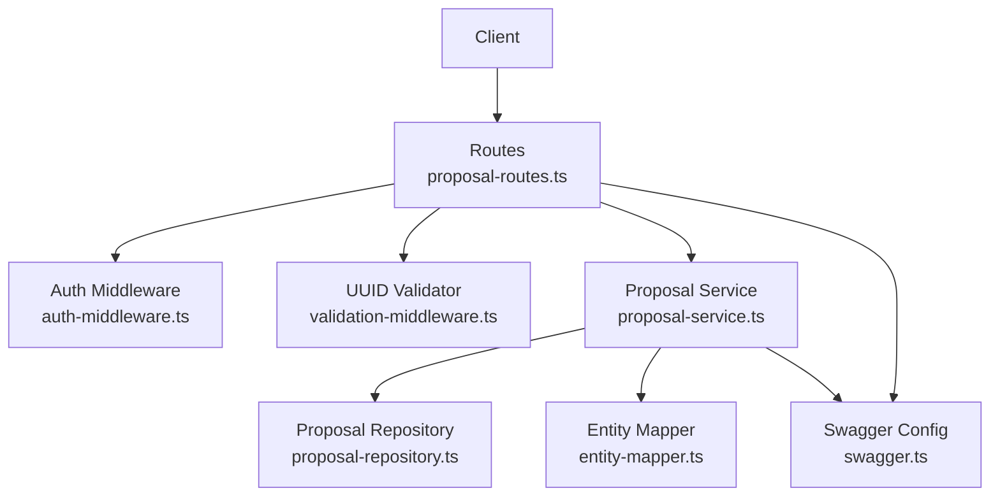

## Core Components
- Route handlers for proposal retrieval:
  - GET /api/proposals/{id}
  - GET /api/proposals/freelancer/me
- Service layer functions:
  - getProposalById
  - getProposalsByFreelancer
- Repository for proposal persistence:
  - findProposalById
  - getProposalsByFreelancer
- Entity mapper for Proposal model:
  - mapProposalFromEntity
- Authentication and authorization:
  - authMiddleware
  - requireRole('freelancer')
- UUID validation:
  - validateUUID middleware and isValidUUID

## Architecture Overview
The retrieval flow follows a layered architecture: route handler -> middleware -> service -> repository -> mapper -> response.

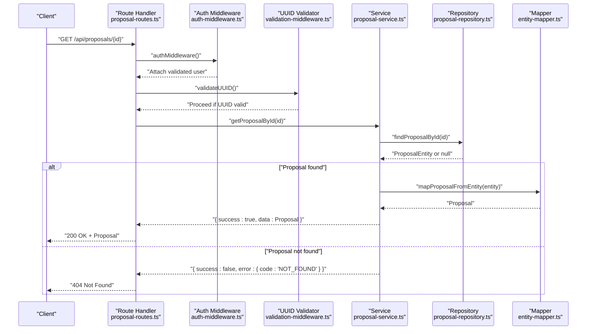

## Detailed Component Analysis

### Endpoint: GET /api/proposals/{id}
- Method: GET
- URL Pattern: /api/proposals/{id}
- Path Parameters:
  - id: string, format: uuid
- Authentication:
  - Requires a valid Bearer JWT token via authMiddleware.
- Authorization:
  - Any authenticated user can view a proposal if they have access. The route itself does not enforce role restrictions; however, the service layer checks for existence and returns a NOT_FOUND error if absent.
- Response Schema:
  - 200 OK: Proposal object aligned with the Proposal model.
  - 400 Bad Request: Returned when the UUID parameter fails validation.
  - 401 Unauthorized: Missing or invalid Authorization header.
  - 404 Not Found: Proposal not found.
- Error Responses:
  - 400: Invalid UUID format.
  - 404: Proposal not found.
- Usage Example:
  - An employer retrieves a specific proposal to review details before deciding whether to accept or reject it.

Access control note:
- The route does not restrict roles; any authenticated user can call this endpoint. Ownership checks are enforced at the service level by verifying existence and returning errors accordingly.

### Endpoint: GET /api/proposals/freelancer/me
- Method: GET
- URL Pattern: /api/proposals/freelancer/me
- Authentication:
  - Requires a valid Bearer JWT token via authMiddleware.
- Authorization:
  - Role requirement: freelancer. Only freelancers can access their own proposal list.
- Response Schema:
  - 200 OK: Array of Proposal objects aligned with the Proposal model.
  - 401 Unauthorized: Missing or invalid Authorization header.
  - 403 Forbidden: Insufficient permissions (non-freelancer).
- Error Responses:
  - 401: Authentication required.
  - 403: Insufficient permissions.
- Usage Example:
  - A freelancer checks their submission history and current status of proposals across projects.

Access control note:
- The route enforces requireRole('freelancer'), ensuring only freelancers can access their own submissions.

### Proposal Model
The Proposal model used in responses is defined in the entity mapper and Swagger components.

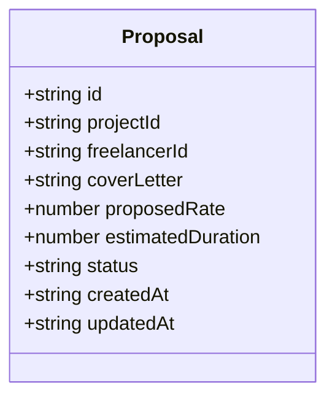

### Service Layer Ownership and Permission Validation
- getProposalById:
  - Fetches proposal by ID from the repository.
  - Returns NOT_FOUND if the proposal does not exist.
  - Does not enforce ownership; any authenticated user can retrieve a proposal if it exists.
- getProposalsByFreelancer:
  - Fetches proposals by freelancerId from the repository.
  - Returns all proposals submitted by the authenticated freelancer.
  - Ownership is implicitly enforced by passing the authenticated user’s ID as the freelancerId filter.

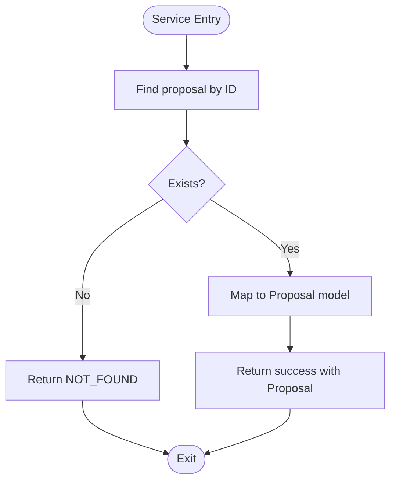

## Dependency Analysis
The retrieval endpoints depend on middleware for authentication and UUID validation, and on the service/repository layers for data access and mapping.

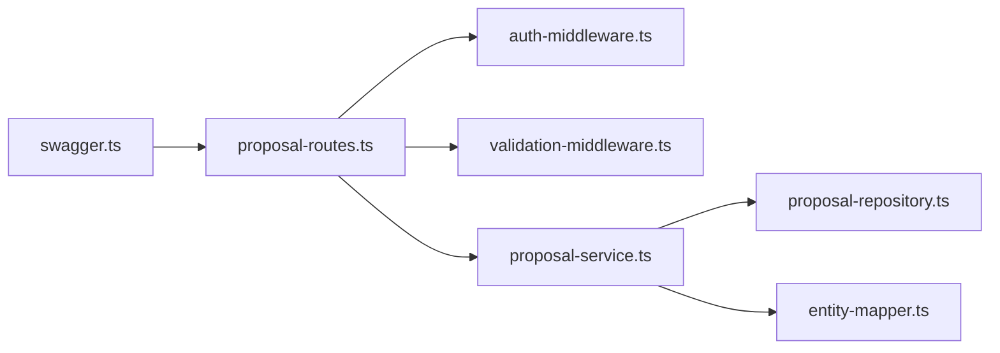

## Performance Considerations
- The freelancer proposal list endpoint returns all proposals ordered by creation time. Depending on the number of proposals, consider pagination in future enhancements.
- UUID validation occurs at the route level; keep the validation middleware lightweight and reuse the existing UUID validator.

## Troubleshooting Guide
Common issues and resolutions:
- 400 Bad Request (UUID invalid):
  - Cause: The id path parameter is not a valid UUID.
  - Resolution: Ensure the UUID is correctly formatted and passed in the path.
- 401 Unauthorized:
  - Cause: Missing or invalid Authorization header.
  - Resolution: Include a valid Bearer token in the Authorization header.
- 403 Forbidden:
  - Cause: Non-freelancer attempting to access /api/proposals/freelancer/me.
  - Resolution: Ensure the caller has the freelancer role.
- 404 Not Found:
  - Cause: Proposal does not exist for the given id.
  - Resolution: Verify the proposal id and that the proposal belongs to a project.

## Conclusion
The proposal retrieval endpoints provide authenticated access to proposal details and freelancer submission histories. The system enforces JWT-based authentication and role-based access for the freelancer list endpoint. UUID validation ensures robust input handling. The service layer focuses on data retrieval and mapping, returning standardized error responses aligned with the project’s error schema.

---

## Proposal Submission

## Table of Contents
1. [Introduction](#introduction)
2. [Project Structure](#project-structure)
3. [Core Components](#core-components)
4. [Architecture Overview](#architecture-overview)
5. [Detailed Component Analysis](#detailed-component-analysis)
6. [Dependency Analysis](#dependency-analysis)
7. [Performance Considerations](#performance-considerations)
8. [Troubleshooting Guide](#troubleshooting-guide)
9. [Conclusion](#conclusion)
10. [Appendices](#appendices)

## Introduction
This document provides comprehensive API documentation for the proposal submission endpoint in the FreelanceXchain system. It covers the POST /api/proposals endpoint, including HTTP method, URL pattern, request body schema, authentication via JWT, role-based access control, validation rules, response schema, and status codes. It also explains how the service layer interacts with the database through the proposal repository and triggers relevant notifications.

## Project Structure
The proposal submission feature spans routing, middleware, service, repository, and documentation layers:
- Routes define the endpoint and apply middleware.
- Middleware enforces JWT authentication and role checks.
- Service orchestrates business logic, validation, repository interactions, and notifications.
- Repository abstracts database operations.
- Swagger and API docs define schemas and responses.

```mermaid
graph TB
Client["Client"] --> Routes["Routes<br/>proposal-routes.ts"]
Routes --> AuthMW["Auth Middleware<br/>auth-middleware.ts"]
Routes --> Service["Proposal Service<br/>proposal-service.ts"]
Service --> Repo["Proposal Repository<br/>proposal-repository.ts"]
Service --> NotifSvc["Notification Service<br/>notification-service.ts"]
NotifSvc --> NotifRepo["Notification Repository<br/>notification-repository.ts"]
Swagger["Swagger Config<br/>swagger.ts"] --- Docs["API Docs<br/>API-DOCUMENTATION.md"]
```

## Core Components
- Endpoint: POST /api/proposals
- Authentication: Bearer JWT token required
- Role-based Access Control: Only users with role "freelancer" can submit proposals
- Request Body Schema:
  - projectId: string (UUID)
  - coverLetter: string (minimum length 10)
  - proposedRate: number (minimum 1)
  - estimatedDuration: number (minimum 1 day)
- Response Schema: Proposal model
- Status Codes:
  - 201 Created on success
  - 400 Bad Request for validation errors
  - 401 Unauthorized for missing/invalid token
  - 404 Not Found when project is not found
  - 409 Conflict for duplicate proposals

## Architecture Overview
The proposal submission flow integrates route validation, middleware enforcement, service orchestration, repository persistence, and notification dispatch.

```mermaid
sequenceDiagram
participant C as "Client"
participant R as "Routes<br/>proposal-routes.ts"
participant M as "Auth Middleware<br/>auth-middleware.ts"
participant S as "Proposal Service<br/>proposal-service.ts"
participant P as "Proposal Repository<br/>proposal-repository.ts"
participant N as "Notification Service<br/>notification-service.ts"
participant NR as "Notification Repository<br/>notification-repository.ts"
C->>R : "POST /api/proposals" with JWT
R->>M : "authMiddleware + requireRole('freelancer')"
M-->>R : "validated user info"
R->>S : "submitProposal(userId, payload)"
S->>P : "findProjectById(projectId)"
P-->>S : "ProjectEntity or null"
S->>S : "check project status and duplicates"
S->>P : "createProposal(entity)"
P-->>S : "ProposalEntity"
S->>N : "notify employer (proposal_received)"
N->>NR : "createNotification(notification)"
NR-->>N : "NotificationEntity"
S-->>R : "{proposal, notification}"
R-->>C : "201 {proposal}"
```

## Detailed Component Analysis

### Endpoint Definition and Validation
- HTTP Method: POST
- URL Pattern: /api/proposals
- Authentication: Bearer token mandatory; enforced by authMiddleware
- Role Requirement: requireRole('freelancer')
- Request Body Validation:
  - projectId: required string and valid UUID
  - coverLetter: required string with minimum length 10
  - proposedRate: required number ≥ 1
  - estimatedDuration: required number ≥ 1 day
- Response: 201 with Proposal model on success; otherwise error responses with standardized shape

### Service Layer: submitProposal
Responsibilities:
- Validate project existence and open status
- Prevent duplicate proposals per freelancer per project
- Persist proposal with status "pending"
- Emit notification for employer ("proposal_received")

Key behaviors:
- Project existence checked via projectRepository
- Duplicate check via proposalRepository.getExistingProposal
- Proposal creation via proposalRepository.createProposal
- Notification creation via notification-service helper

### Repository Layer: ProposalRepository
- Provides createProposal, findProposalById, updateProposal
- Supports duplicate detection and project-scoped queries
- Uses Appwrite client with explicit error handling

### Response Schema: Proposal Model
The Proposal model includes:
- id, projectId, freelancerId
- coverLetter, proposedRate, estimatedDuration
- status (pending, accepted, rejected, withdrawn)
- createdAt, updatedAt

Swagger and API docs define the schema and enums.

### Real-World Example
Submitting a proposal for a web development project:
- projectId: UUID of the target project
- coverLetter: "I am a skilled frontend developer with 5+ years of experience building responsive web applications..."
- proposedRate: 50 (representing USD per hour)
- estimatedDuration: 14 (days)

Expected outcome:
- 201 Created with the created Proposal object
- Employer receives a "proposal_received" notification

### Status Codes
- 201 Created: Successful proposal submission
- 400 Bad Request: Validation errors (missing/invalid fields)
- 401 Unauthorized: Missing or invalid Bearer token
- 404 Not Found: Project not found
- 409 Conflict: Duplicate proposal for the same project by the same freelancer

### Validation Flow
```mermaid
flowchart TD
Start(["Request Received"]) --> CheckAuth["Check Bearer Token"]
CheckAuth --> AuthOK{"Authenticated?"}
AuthOK --> |No| Return401["Return 401 Unauthorized"]
AuthOK --> |Yes| ValidateFields["Validate Fields:<br/>projectId, coverLetter,<br/>proposedRate, estimatedDuration"]
ValidateFields --> Valid{"All Valid?"}
Valid --> |No| Return400["Return 400 Validation Error"]
Valid --> |Yes| CheckProject["Check Project Exists and Open"]
CheckProject --> ProjectOK{"Project OK?"}
ProjectOK --> |No| Return404["Return 404 Not Found"]
ProjectOK --> CheckDup["Check Duplicate Proposal"]
CheckDup --> Dup{"Duplicate?"}
Dup --> |Yes| Return409["Return 409 Conflict"]
Dup --> |No| CreateProposal["Persist Proposal"]
CreateProposal --> Notify["Notify Employer"]
Notify --> Return201["Return 201 Created"]
```

## Dependency Analysis
- Routes depend on auth middleware and proposal service
- Service depends on proposal repository, project repository, user repository, and notification service
- Repositories depend on Appwrite client and shared base repository
- Swagger defines schemas consumed by routes and docs

```mermaid
graph LR
Routes["proposal-routes.ts"] --> Auth["auth-middleware.ts"]
Routes --> Service["proposal-service.ts"]
Service --> Repo["proposal-repository.ts"]
Service --> NotifSvc["notification-service.ts"]
NotifSvc --> NotifRepo["notification-repository.ts"]
Swagger["swagger.ts"] --- Docs["API-DOCUMENTATION.md"]
```

## Performance Considerations
- Input validation occurs before database calls to minimize unnecessary operations.
- Repository methods encapsulate Appwrite queries; ensure indexes exist on project_id and freelancer_id for efficient duplicate checks.
- Notification creation is lightweight; ensure database indexing on user_id for notification retrieval.
- Consider caching project metadata if frequently accessed during proposal submissions.

[No sources needed since this section provides general guidance]

## Troubleshooting Guide
Common issues and resolutions:
- 401 Unauthorized: Ensure Authorization header includes a valid Bearer token. Verify token expiration and format.
- 403 Forbidden: Confirm the user role is "freelancer".
- 400 Validation Error: Check that projectId is a valid UUID, coverLetter is at least 10 characters, proposedRate and estimatedDuration are ≥ 1.
- 404 Not Found: The project ID may not exist or is closed for proposals.
- 409 Conflict: The freelancer has already submitted a proposal for this project.

## Conclusion
The proposal submission endpoint enforces strict authentication and role-based access control, validates request payloads, prevents duplicate submissions, persists proposals, and notifies employers. The service layer cleanly separates concerns between validation, persistence, and notifications, while the repository layer abstracts database operations.

[No sources needed since this section summarizes without analyzing specific files]

## Appendices

### API Reference: POST /api/proposals
- Authentication: Bearer JWT
- Roles: freelancer
- Request Body:
  - projectId: string (UUID)
  - coverLetter: string (≥10 chars)
  - proposedRate: number (≥1)
  - estimatedDuration: number (≥1)
- Responses:
  - 201: Proposal object
  - 400: Validation error
  - 401: Unauthorized
  - 404: Project not found
  - 409: Duplicate proposal

---

## Proposal with Employer History API

## Table of Contents
1. [Introduction](#introduction)
2. [Endpoint Specification](#endpoint-specification)
3. [Architecture Overview](#architecture-overview)
4. [Request Flow](#request-flow)
5. [Response Schema](#response-schema)
6. [Authorization Rules](#authorization-rules)
7. [Use Cases](#use-cases)
8. [Error Handling](#error-handling)
9. [Performance Considerations](#performance-considerations)
10. [Client Implementation Examples](#client-implementation-examples)

## Introduction

This endpoint allows freelancers to view proposal details along with the employer's track record, including completed projects count, average rating, and company information. This transparency helps freelancers make informed decisions about which proposals to pursue.

**Key Features:**
- View employer's completed project count
- See employer's average rating from previous freelancers
- Access employer's company information
- Freelancer-only access for privacy protection

## Endpoint Specification

### HTTP Method and URL
```
GET /api/proposals/{id}/with-employer-history
```

### Authentication
- **Required:** Yes
- **Type:** JWT Bearer Token
- **Role:** Freelancer only

### Path Parameters
| Parameter | Type | Required | Description |
|-----------|------|----------|-------------|
| id | UUID | Yes | Proposal ID |

### Headers
```http
Authorization: Bearer {jwt_token}
Content-Type: application/json
```

## Architecture Overview

```mermaid
graph TB
    Client["Client<br/>(Freelancer)"]
    Router["Proposal Routes<br/>GET /api/proposals/:id/with-employer-history"]
    AuthMW["Auth Middleware<br/>JWT validation"]
    RoleMW["Require Role 'freelancer'"]
    Service["Proposal Service<br/>getProposalWithEmployerHistory()"]
    ProposalRepo["Proposal Repository"]
    ProjectRepo["Project Repository"]
    ContractRepo["Contract Repository"]
    ReviewRepo["Review Repository"]
    EmployerRepo["Employer Profile Repository"]
    
    Client --> Router
    Router --> AuthMW
    AuthMW --> RoleMW
    RoleMW --> Service
    Service --> ProposalRepo
    Service --> ProjectRepo
    Service --> ContractRepo
    Service --> ReviewRepo
    Service --> EmployerRepo
```

## Request Flow

```mermaid
sequenceDiagram
    participant F as "Freelancer"
    participant R as "Routes"
    participant A as "Auth Middleware"
    participant S as "Proposal Service"
    participant PR as "Proposal Repo"
    participant PJ as "Project Repo"
    participant CR as "Contract Repo"
    participant RR as "Review Repo"
    participant ER as "Employer Repo"
    
    F->>R: GET /api/proposals/{id}/with-employer-history
    R->>A: Validate JWT & role
    A-->>R: Authenticated (freelancer)
    R->>S: getProposalWithEmployerHistory(id)
    S->>PR: findProposalById(id)
    PR-->>S: Proposal entity
    S->>PJ: findProjectById(projectId)
    PJ-->>S: Project entity
    S->>CR: getContractsByEmployer(employerId)
    CR-->>S: All contracts
    Note over S: Filter completed contracts
    S->>RR: getAverageRating(employerId)
    RR-->>S: {average, count}
    S->>ER: getProfileByUserId(employerId)
    ER-->>S: Employer profile
    S-->>R: Combined data
    R->>R: Verify freelancer owns proposal
    R-->>F: 200 OK with employer history
```

## Response Schema

### Success Response (200 OK)

```json
{
  "proposal": {
    "id": "550e8400-e29b-41d4-a716-446655440000",
    "projectId": "660e8400-e29b-41d4-a716-446655440000",
    "freelancerId": "770e8400-e29b-41d4-a716-446655440000",
    "coverLetter": null,
    "attachments": [
      {
        "url": "https://storage.appwrite.co/...",
        "filename": "portfolio.pdf",
        "size": 1024000,
        "mimeType": "application/pdf"
      }
    ],
    "proposedRate": 5000,
    "estimatedDuration": 30,
    "tags": ["web-development", "react", "nodejs"],
    "status": "pending",
    "createdAt": "2026-03-12T10:00:00Z",
    "updatedAt": "2026-03-12T10:00:00Z"
  },
  "project": {
    "id": "660e8400-e29b-41d4-a716-446655440000",
    "title": "E-commerce Website Development",
    "description": "Build a modern e-commerce platform with React and Node.js",
    "employerId": "880e8400-e29b-41d4-a716-446655440000",
    "budget": 5000,
    "deadline": "2026-04-30",
    "status": "open",
    "milestones": [
      {
        "title": "Frontend Development",
        "amount": 2500,
        "dueDate": "2026-04-15"
      },
      {
        "title": "Backend Integration",
        "amount": 2500,
        "dueDate": "2026-04-30"
      }
    ]
  },
  "employerHistory": {
    "completedProjectsCount": 15,
    "averageRating": 4.7,
    "reviewCount": 12,
    "companyName": "Tech Solutions Inc.",
    "industry": "Technology"
  }
}
```

### Field Descriptions

#### employerHistory Object

| Field | Type | Description |
|-------|------|-------------|
| completedProjectsCount | number | Total number of completed contracts by this employer |
| averageRating | number | Average rating from all reviews (0-5, rounded to 1 decimal) |
| reviewCount | number | Total number of reviews received |
| companyName | string | Employer's company name |
| industry | string | Employer's industry/sector |

## Authorization Rules

### Access Control
1. **Freelancer Role Required:** Only users with 'freelancer' role can access this endpoint
2. **Proposal Ownership:** Freelancer must be the one who submitted the proposal
3. **No Employer Access:** Employers cannot view their own history through this endpoint
4. **No Admin Override:** Even admins cannot access this freelancer-specific feature

### Authorization Flow
```typescript
// 1. JWT validation (authMiddleware)
// 2. Role check (requireRole('freelancer'))
// 3. Ownership verification
if (result.data.proposal.freelancerId !== userId) {
  return 403 Forbidden
}
```

## Use Cases

### 1. Assessing Employer Reliability
**Scenario:** Freelancer receives multiple proposals and wants to prioritize reliable employers

**Decision Factors:**
- `completedProjectsCount > 10` → Experienced employer
- `completedProjectsCount === 0` → New employer (higher risk)
- `averageRating >= 4.5` → Highly rated employer

**Example:**
```javascript
if (employerHistory.completedProjectsCount >= 10 && 
    employerHistory.averageRating >= 4.5) {
  // High priority - reliable employer
  priorityLevel = 'HIGH';
} else if (employerHistory.completedProjectsCount === 0) {
  // New employer - proceed with caution
  priorityLevel = 'LOW';
}
```

### 2. Risk Assessment
**Scenario:** Freelancer evaluates payment risk before accepting proposal

**Risk Indicators:**
- Low rating (`< 3.0`) → Payment issues or difficult client
- No completed projects → Unproven track record
- High rating (`>= 4.5`) + many projects → Safe bet

### 3. Company Verification
**Scenario:** Freelancer verifies legitimacy of employer

**Verification Steps:**
1. Check company name matches project description
2. Verify industry alignment with project type
3. Cross-reference with external sources if needed

## Error Handling

### Error Responses

#### 400 Bad Request
```json
{
  "error": {
    "code": "VALIDATION_ERROR",
    "message": "Invalid UUID format"
  },
  "timestamp": "2026-03-12T10:00:00Z",
  "requestId": "req-123"
}
```

#### 401 Unauthorized
```json
{
  "error": {
    "code": "AUTH_UNAUTHORIZED",
    "message": "User not authenticated"
  },
  "timestamp": "2026-03-12T10:00:00Z",
  "requestId": "req-123"
}
```

#### 403 Forbidden
```json
{
  "error": {
    "code": "UNAUTHORIZED",
    "message": "You are not authorized to view this proposal"
  },
  "timestamp": "2026-03-12T10:00:00Z",
  "requestId": "req-123"
}
```

#### 404 Not Found
```json
{
  "error": {
    "code": "NOT_FOUND",
    "message": "Proposal not found"
  },
  "timestamp": "2026-03-12T10:00:00Z",
  "requestId": "req-123"
}
```

#### 500 Internal Server Error
```json
{
  "error": "Failed to fetch proposal with employer history"
}
```

## Performance Considerations

### Database Queries
The endpoint executes multiple queries:
1. `findProposalById()` - Single row lookup (indexed)
2. `findProjectById()` - Single row lookup (indexed)
3. `getContractsByEmployer()` - Multiple rows (filtered by employer_id)
4. `getAverageRating()` - Aggregation query on reviews table
5. `getProfileByUserId()` - Single row lookup (indexed)

### Optimization Strategies

#### 1. Caching
```typescript
// Cache employer history for 1 hour
const cacheKey = `employer-history:${employerId}`;
const cached = await cache.get(cacheKey);
if (cached) return cached;

// ... fetch from database ...

await cache.set(cacheKey, employerHistory, 3600); // 1 hour TTL
```

#### 2. Parallel Queries
```typescript
// Execute independent queries in parallel
const [contracts, rating, profile] = await Promise.all([
  contractRepository.getContractsByEmployer(employerId),
  ReviewRepository.getAverageRating(employerId),
  employerProfileRepository.getProfileByUserId(employerId)
]);
```

#### 3. Database Indexing
Ensure indexes exist on:
- `contracts.employer_id`
- `reviews.reviewee_id`
- `employer_profiles.user_id`

### Expected Response Time
- **Without caching:** 200-500ms
- **With caching:** 50-100ms
- **Under load:** May increase to 1-2s

## Client Implementation Examples

### JavaScript/TypeScript (Fetch API)

```typescript
async function getProposalWithEmployerHistory(
  proposalId: string, 
  token: string
): Promise<ProposalWithEmployerHistory> {
  const response = await fetch(
    `https://api.freelancexchain.com/api/proposals/${proposalId}/with-employer-history`,
    {
      method: 'GET',
      headers: {
        'Authorization': `Bearer ${token}`,
        'Content-Type': 'application/json'
      }
    }
  );

  if (!response.ok) {
    const error = await response.json();
    throw new Error(error.error.message);
  }

  return await response.json();
}

// Usage
try {
  const data = await getProposalWithEmployerHistory(
    '550e8400-e29b-41d4-a716-446655440000',
    userToken
  );
  
  console.log(`Employer: ${data.employerHistory.companyName}`);
  console.log(`Rating: ${data.employerHistory.averageRating}/5`);
  console.log(`Completed: ${data.employerHistory.completedProjectsCount} projects`);
  
  // Risk assessment
  if (data.employerHistory.averageRating >= 4.5) {
    console.log('✓ Highly rated employer');
  }
} catch (error) {
  console.error('Failed to fetch proposal:', error);
}
```

### React Component Example

```tsx
import { useState, useEffect } from 'react';

interface EmployerHistory {
  completedProjectsCount: number;
  averageRating: number;
  reviewCount: number;
  companyName: string;
  industry: string;
}

function ProposalDetailWithHistory({ proposalId }: { proposalId: string }) {
  const [data, setData] = useState<any>(null);
  const [loading, setLoading] = useState(true);
  const [error, setError] = useState<string | null>(null);

  useEffect(() => {
    async function fetchData() {
      try {
        const token = localStorage.getItem('authToken');
        const response = await fetch(
          `/api/proposals/${proposalId}/with-employer-history`,
          {
            headers: { 'Authorization': `Bearer ${token}` }
          }
        );
        
        if (!response.ok) throw new Error('Failed to fetch');
        
        const result = await response.json();
        setData(result);
      } catch (err) {
        setError(err.message);
      } finally {
        setLoading(false);
      }
    }
    
    fetchData();
  }, [proposalId]);

  if (loading) return <div>Loading...</div>;
  if (error) return <div>Error: {error}</div>;
  if (!data) return null;

  const { proposal, project, employerHistory } = data;

  return (
    <div className="proposal-detail">
      <h2>{project.title}</h2>
      
      <div className="employer-info">
        <h3>Employer Information</h3>
        <p><strong>Company:</strong> {employerHistory.companyName}</p>
        <p><strong>Industry:</strong> {employerHistory.industry}</p>
        
        <div className="employer-stats">
          <div className="stat">
            <span className="label">Rating</span>
            <span className="value">
              {employerHistory.averageRating.toFixed(1)} / 5.0
              {employerHistory.averageRating >= 4.5 && ' ⭐'}
            </span>
            <span className="count">
              ({employerHistory.reviewCount} reviews)
            </span>
          </div>
          
          <div className="stat">
            <span className="label">Completed Projects</span>
            <span className="value">
              {employerHistory.completedProjectsCount}
            </span>
          </div>
        </div>
        
        {employerHistory.completedProjectsCount === 0 && (
          <div className="warning">
            ⚠️ This is a new employer with no completed projects yet
          </div>
        )}
        
        {employerHistory.averageRating < 3.0 && (
          <div className="warning">
            ⚠️ This employer has a low rating. Proceed with caution.
          </div>
        )}
      </div>
      
      <div className="proposal-details">
        <h3>Your Proposal</h3>
        <p><strong>Rate:</strong> ${proposal.proposedRate}</p>
        <p><strong>Duration:</strong> {proposal.estimatedDuration} days</p>
        <p><strong>Status:</strong> {proposal.status}</p>
      </div>
    </div>
  );
}
```

### Python Example

```python
import requests
from typing import Dict, Any

def get_proposal_with_employer_history(
    proposal_id: str, 
    token: str
) -> Dict[str, Any]:
    """
    Fetch proposal with employer history
    
    Args:
        proposal_id: UUID of the proposal
        token: JWT authentication token
        
    Returns:
        Dictionary containing proposal, project, and employer history
        
    Raises:
        requests.HTTPError: If request fails
    """
    url = f"https://api.freelancexchain.com/api/proposals/{proposal_id}/with-employer-history"
    headers = {
        "Authorization": f"Bearer {token}",
        "Content-Type": "application/json"
    }
    
    response = requests.get(url, headers=headers)
    response.raise_for_status()
    
    return response.json()

## Usage
try:
    data = get_proposal_with_employer_history(
        proposal_id="550e8400-e29b-41d4-a716-446655440000",
        token=user_token
    )
    
    employer = data["employerHistory"]
    
    print(f"Employer: {employer['companyName']}")
    print(f"Rating: {employer['averageRating']}/5 ({employer['reviewCount']} reviews)")
    print(f"Completed Projects: {employer['completedProjectsCount']}")
    
    # Risk assessment
    if employer["averageRating"] >= 4.5 and employer["completedProjectsCount"] >= 10:
        print("✓ Highly reliable employer")
    elif employer["completedProjectsCount"] == 0:
        print("⚠ New employer - no track record")
        
except requests.HTTPError as e:
    print(f"Error: {e.response.json()['error']['message']}")
```

## Conclusion

The Proposal with Employer History endpoint provides freelancers with critical transparency into employer reliability and track record. By exposing completed project counts, average ratings, and company information, it enables informed decision-making and reduces risk for freelancers. The endpoint follows security best practices with role-based access control and ownership verification, ensuring that only authorized freelancers can view employer history for their own proposals.

**Key Takeaways:**
- Freelancer-only access for privacy protection
- Multiple database queries optimized with parallel execution
- Caching recommended for frequently accessed employer data
- Clear risk indicators help freelancers assess opportunities
- Comprehensive error handling for robust client integration

---

## Proposal Withdrawal

## Table of Contents
1. [Introduction](#introduction)
2. [Project Structure](#project-structure)
3. [Core Components](#core-components)
4. [Architecture Overview](#architecture-overview)
5. [Detailed Component Analysis](#detailed-component-analysis)
6. [Dependency Analysis](#dependency-analysis)
7. [Performance Considerations](#performance-considerations)
8. [Troubleshooting Guide](#troubleshooting-guide)
9. [Conclusion](#conclusion)

## Introduction
This document describes the POST /api/proposals/{id}/withdraw endpoint that enables freelancers to withdraw their pending proposals. It covers the HTTP method, URL pattern, authentication and authorization requirements, state transition rules, response schema, and error handling behavior. It also includes a practical use case and validation logic that prevents withdrawal of proposals that are already accepted, rejected, or withdrawn, and ensures ownership by the requesting freelancer.

## Project Structure
The proposal withdrawal feature spans routing, middleware, service, and repository layers:
- Route handler enforces JWT authentication, role checks, and UUID parameter validation.
- Service layer performs business validation and updates the proposal status.
- Repository layer persists the change to the database.
- Swagger defines the endpoint’s OpenAPI specification and response schema.

```mermaid
graph TB
Client["Client"] --> Routes["Routes<br/>proposal-routes.ts"]
Routes --> AuthMW["Auth Middleware<br/>auth-middleware.ts"]
Routes --> RoleMW["Role Middleware<br/>requireRole('freelancer')"]
Routes --> UUIDMW["UUID Validation<br/>validation-middleware.ts"]
Routes --> Service["Service<br/>proposal-service.ts"]
Service --> Repo["Repository<br/>proposal-repository.ts"]
Repo --> DB["Database"]
Service --> Swagger["Swagger Spec<br/>swagger.ts"]
```

## Core Components
- Endpoint: POST /api/proposals/{id}/withdraw
- Authentication: JWT via Authorization: Bearer <token>
- Authorization: Requires role 'freelancer'
- Path parameter: id must be a valid UUID
- Business rule: Only proposals with status 'pending' can be withdrawn; successful withdrawal sets status to 'withdrawn'
- Ownership: Only the freelancer who submitted the proposal can withdraw it
- Response: Updated Proposal object

HTTP status codes:
- 200 OK: Proposal successfully withdrawn
- 400 Bad Request: Invalid UUID format or invalid state transition
- 401 Unauthorized: Missing/invalid/expired JWT or missing/invalid Authorization header
- 403 Forbidden: Insufficient permissions (non-freelancer)
- 404 Not Found: Proposal not found

## Architecture Overview
The endpoint follows a layered architecture:
- Route layer validates JWT, role, and UUID format.
- Service layer enforces business rules (ownership and status).
- Repository layer updates the proposal record.
- Swagger documents the response schema.

```mermaid
sequenceDiagram
participant C as "Client"
participant R as "Route Handler<br/>proposal-routes.ts"
participant A as "Auth Middleware<br/>auth-middleware.ts"
participant RM as "Role Middleware<br/>requireRole('freelancer')"
participant UM as "UUID Middleware<br/>validation-middleware.ts"
participant S as "Service<br/>proposal-service.ts"
participant P as "Repository<br/>proposal-repository.ts"
participant D as "Database"
C->>R : POST /api/proposals/{id}/withdraw
R->>A : Validate Authorization header and JWT
A-->>R : Validated user or error
R->>RM : Check role 'freelancer'
RM-->>R : Allowed or 403
R->>UM : Validate path param 'id' as UUID
UM-->>R : Valid or 400
R->>S : withdrawProposal(proposalId, freelancerId)
S->>P : findProposalById(proposalId)
P-->>S : ProposalEntity or null
alt Proposal not found
S-->>R : { success : false, error : NOT_FOUND }
R-->>C : 404 Not Found
else Proposal found
S->>P : updateProposal(proposalId, { status : 'withdrawn' })
P-->>S : Updated ProposalEntity
S-->>R : { success : true, data : Proposal }
R-->>C : 200 OK + Proposal
end
```

## Detailed Component Analysis

### Endpoint Definition and Behavior
- Method: POST
- URL: /api/proposals/{id}/withdraw
- Path parameter: id (UUID)
- Authentication: Bearer JWT
- Authorization: Role must be 'freelancer'
- Validation: UUID format enforced by middleware
- Business logic:
  - Only proposals with status 'pending' can be withdrawn
  - Only the freelancer who owns the proposal can withdraw it
  - On success, status transitions to 'withdrawn'

Response schema:
- Returns the updated Proposal object with fields: id, projectId, freelancerId, coverLetter, proposedRate, estimatedDuration, status, createdAt, updatedAt.

Status codes:
- 200: Successful withdrawal
- 400: Invalid UUID format or invalid state transition
- 401: Unauthorized (missing/invalid/expired token)
- 403: Permission denied (not a freelancer)
- 404: Proposal not found

### Validation and Authorization Flow
```mermaid
flowchart TD
Start(["Request received"]) --> CheckAuth["Check Authorization header"]
CheckAuth --> AuthOK{"JWT valid?"}
AuthOK --> |No| Return401["Return 401 Unauthorized"]
AuthOK --> |Yes| CheckRole["Check role 'freelancer'"]
CheckRole --> RoleOK{"Role is 'freelancer'?"}
RoleOK --> |No| Return403["Return 403 Forbidden"]
RoleOK --> |Yes| CheckUUID["Validate UUID param 'id'"]
CheckUUID --> UUIDOK{"UUID valid?"}
UUIDOK --> |No| Return400["Return 400 Bad Request"]
UUIDOK --> |Yes| CallService["Call withdrawProposal()"]
CallService --> End(["Handled by service"])
```

### Service Layer Logic
The service enforces:
- Proposal existence
- Ownership verification (freelancer_id equals caller)
- Status validation (must be 'pending')
- Update to 'withdrawn'

```mermaid
flowchart TD
SStart(["Service: withdrawProposal"]) --> Find["Find proposal by id"]
Find --> Found{"Exists?"}
Found --> |No| NotFound["Return NOT_FOUND"]
Found --> |Yes| Owner["Verify freelancer_id equals caller"]
Owner --> OwnerOK{"Owner?"}
OwnerOK --> |No| Unauth["Return UNAUTHORIZED"]
OwnerOK --> |Yes| Status["Check status == 'pending'"]
Status --> StatusOK{"Status is 'pending'?"}
StatusOK --> |No| Invalid["Return INVALID_STATUS"]
StatusOK --> |Yes| Update["Update status to 'withdrawn'"]
Update --> Success["Return updated Proposal"]
```

### Use Case: Withdraw After Accepting Another Project
Scenario:
- A freelancer submits Proposal A and later accepts a competing Proposal B for the same project.
- The freelancer decides to withdraw Proposal A while keeping Proposal B active.
- Steps:
  1. Ensure Proposal A exists and is still 'pending'.
  2. Authenticate with JWT and confirm role 'freelancer'.
  3. Call POST /api/proposals/{proposalAId}/withdraw.
  4. Server validates UUID, ownership, and status.
  5. Server updates Proposal A status to 'withdrawn'.
  6. Client receives 200 OK with the updated Proposal A.

Constraints:
- Proposal A must be 'pending' and owned by the freelancer.
- Proposal B’s acceptance does not affect the withdrawal of Proposal A; the withdrawal is independent.

## Dependency Analysis
```mermaid
graph LR
Routes["proposal-routes.ts"] --> Auth["auth-middleware.ts"]
Routes --> Role["requireRole('freelancer')"]
Routes --> UUID["validateUUID()"]
Routes --> Service["proposal-service.ts"]
Service --> Repo["proposal-repository.ts"]
Repo --> Model["proposal.ts"]
Routes --> Swagger["swagger.ts"]
```

## Performance Considerations
- The endpoint performs two database reads: one to fetch the proposal and one to update it. Both are simple indexed lookups by id.
- No heavy computations are involved; performance is primarily bound by database latency.
- Consider adding database-level constraints to prevent concurrent conflicting updates if needed.

[No sources needed since this section provides general guidance]

## Troubleshooting Guide
Common issues and resolutions:
- 400 Bad Request
  - Cause: Invalid UUID format in path parameter.
  - Resolution: Ensure id is a valid UUID.
- 401 Unauthorized
  - Cause: Missing Authorization header, invalid token format, or expired token.
  - Resolution: Provide a valid Bearer token in the Authorization header.
- 403 Forbidden
  - Cause: Caller is not authenticated as a freelancer.
  - Resolution: Authenticate with a freelancer account.
- 404 Not Found
  - Cause: Proposal does not exist.
  - Resolution: Verify the proposal id.
- 400 Invalid state transition
  - Cause: Proposal status is not 'pending'.
  - Resolution: Only 'pending' proposals can be withdrawn.

Validation logic highlights:
- UUID enforcement occurs at route level.
- Ownership and status checks occur in the service layer.
- Role enforcement occurs at route level.

## Conclusion
The POST /api/proposals/{id}/withdraw endpoint provides a controlled mechanism for freelancers to withdraw pending proposals. It enforces JWT authentication, role-based authorization, UUID parameter validation, and strict business rules around ownership and status. The response returns the updated Proposal object, and the endpoint adheres to standard HTTP status codes for clear client-side handling.

---

[← Back to API Reference](README.md)
