# Architecture

# AI-Powered Matching System

## Table of Contents
1. [Introduction](#introduction)
2. [Project Structure](#project-structure)
3. [Core Components](#core-components)
4. [Architecture Overview](#architecture-overview)
5. [Detailed Component Analysis](#detailed-component-analysis)
6. [Dependency Analysis](#dependency-analysis)
7. [Performance Considerations](#performance-considerations)
8. [Troubleshooting Guide](#troubleshooting-guide)
9. [Conclusion](#conclusion)
10. [Appendices](#appendices)

## Introduction
This document explains the AI-powered skill matching system in FreelanceXchain. The platform integrates Google Gemini-compatible LLM APIs to extract skills from project descriptions and freelancer profiles, compute compatibility scores, and generate intelligent recommendations. It also includes an AI assistant that enhances user interactions through natural language processing for proposals, project descriptions, and dispute analysis. The system emphasizes robust error handling, fallbacks, and performance characteristics such as retries, timeouts, and rate limiting.

## Project Structure
The AI matching system spans configuration, client, service, routes, and supporting utilities:

- Configuration: LLM API keys and URLs are loaded from environment variables.
- AI Client: Communicates with the external LLM API, manages retries, timeouts, and response parsing.
- Matching Service: Orchestrates skill matching, skill extraction, and skill gap analysis with AI-backed and keyword-based fallbacks.
- AI Assistant: Generates content and analyses for proposals, project descriptions, and disputes.
- Routes: Exposes REST endpoints for recommendations, skill extraction, and gap analysis.
- Supporting Services and Utilities: Skill taxonomy retrieval, entity mapping, and rate limiting.

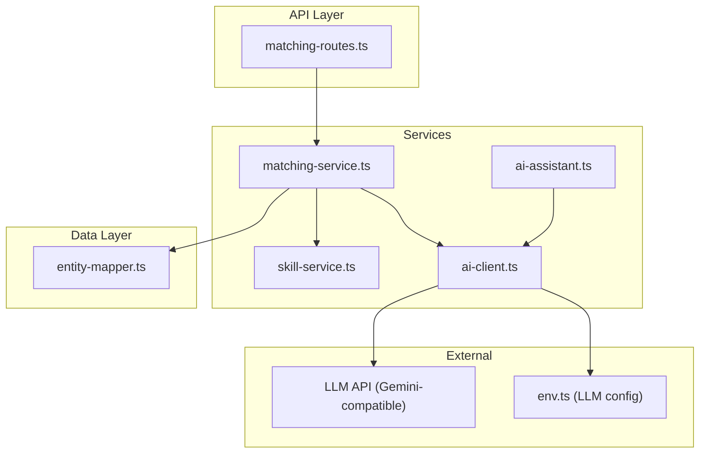
```mermaid
graph TB
subgraph "API Layer"
R["matching-routes.ts"]
end
subgraph "Services"
MS["matching-service.ts"]
AC["ai-client.ts"]
AA["ai-assistant.ts"]
SS["skill-service.ts"]
end
subgraph "Data Layer"
EM["entity-mapper.ts"]
end
subgraph "External"
CFG["env.ts (LLM config)"]
LLM["LLM API (Gemini-compatible)"]
end
R --> MS
MS --> AC
MS --> SS
MS --> EM
AA --> AC
AC --> CFG
AC --> LLM
```

## Core Components
- AI Client: Sends prompts to the LLM API, parses JSON responses, and provides robust error handling with exponential backoff and timeouts.
- Matching Service: Computes skill match scores, extracts skills from text, and performs skill gap analysis with AI-backed and keyword-based fallbacks.
- AI Assistant: Generates tailored proposals, improves project descriptions, and analyzes disputes using AI.
- Routes: Expose endpoints for project and freelancer recommendations, skill extraction, and skill gap analysis.
- Configuration: Loads LLM API key and base URL from environment variables.

## Architecture Overview
The AI matching system integrates with external LLM APIs and internal services:

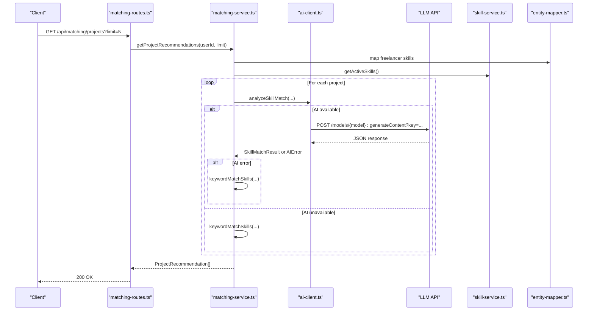
```mermaid
sequenceDiagram
participant Client as "Client"
participant Routes as "matching-routes.ts"
participant Service as "matching-service.ts"
participant ClientLLM as "ai-client.ts"
participant LLM as "LLM API"
participant Skills as "skill-service.ts"
participant Mapper as "entity-mapper.ts"
Client->>Routes : GET /api/matching/projects?limit=N
Routes->>Service : getProjectRecommendations(userId, limit)
Service->>Mapper : map freelancer skills
Service->>Skills : getActiveSkills()
loop For each project
Service->>ClientLLM : analyzeSkillMatch(...)
alt AI available
ClientLLM->>LLM : POST /models/{model} : generateContent?key=...
LLM-->>ClientLLM : JSON response
ClientLLM-->>Service : SkillMatchResult or AIError
alt AI error
Service->>Service : keywordMatchSkills(...)
end
else AI unavailable
Service->>Service : keywordMatchSkills(...)
end
end
Service-->>Routes : ProjectRecommendation[]
Routes-->>Client : 200 OK
```

## Detailed Component Analysis

### AI Client: External LLM Communication
Responsibilities:
- Build and send LLM requests with generation configuration.
- Manage retries with exponential backoff for transient errors and rate limits.
- Enforce request timeouts and handle aborts.
- Extract and parse JSON responses, tolerating markdown code blocks.
- Provide fallbacks for skill extraction and matching when AI is unavailable.

Key behaviors:
- Availability check using configured LLM API key and base URL.
- Retry logic for HTTP 5xx and 429, plus network/abort errors.
- Timeout handling to prevent hanging requests.
- JSON parsing with markdown fence stripping.
- Fallback keyword-based matching and extraction when AI is unavailable.

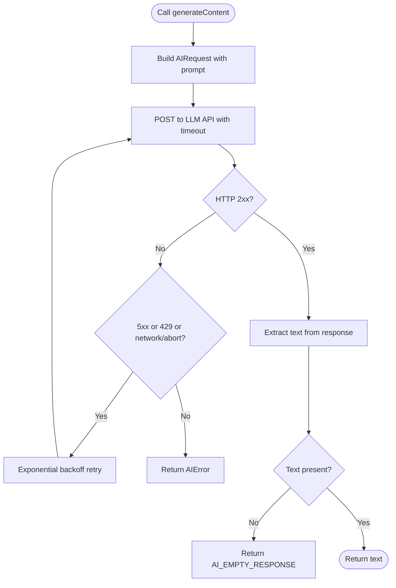
```mermaid
flowchart TD
Start(["Call generateContent"]) --> Build["Build AIRequest with prompt"]
Build --> Send["POST to LLM API with timeout"]
Send --> RespOK{"HTTP 2xx?"}
RespOK --> |No| Retryable{"5xx or 429 or network/abort?"}
Retryable --> |Yes| Backoff["Exponential backoff retry"]
Backoff --> Send
Retryable --> |No| ErrorResp["Return AIError"]
RespOK --> |Yes| Parse["Extract text from response"]
Parse --> HasText{"Text present?"}
HasText --> |No| EmptyErr["Return AI_EMPTY_RESPONSE"]
HasText --> |Yes| Done(["Return text"])
```

### Matching Service: Compatibility and Recommendations
Responsibilities:
- Compute AI-driven skill match scores between freelancers and projects.
- Extract skills from raw text using AI or keyword fallback.
- Analyze skill gaps for freelancers using AI when available.
- Combine AI match scores with reputation weighting for freelancer recommendations.
- Provide keyword-based fallbacks when AI is unavailable.

Recommendation algorithms:
- Project recommendations: Rank projects by AI match score; fallback to keyword matching if AI fails.
- Freelancer recommendations: Rank by combined score (match × weight + reputation × weight).
- Skill extraction: Map extracted skills to taxonomy; validate skill IDs.
- Skill gap analysis: Generate recommendations and market demand signals when AI is available.

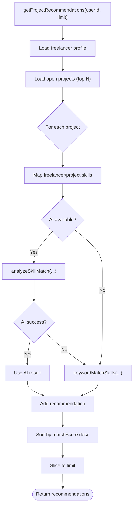
```mermaid
flowchart TD
A["getProjectRecommendations(userId, limit)"] --> LoadProf["Load freelancer profile"]
LoadProf --> LoadProj["Load open projects (top N)"]
LoadProj --> ForEachProj{"For each project"}
ForEachProj --> MapSkills["Map freelancer/project skills"]
MapSkills --> AIEnabled{"AI available?"}
AIEnabled --> |Yes| CallAI["analyzeSkillMatch(...)"]
CallAI --> AIRes{"AI success?"}
AIRes --> |Yes| UseAI["Use AI result"]
AIRes --> |No| Keyword["keywordMatchSkills(...)"]
AIEnabled --> |No| Keyword
UseAI --> AddRec["Add recommendation"]
Keyword --> AddRec
AddRec --> Sort["Sort by matchScore desc"]
Sort --> Slice["Slice to limit"]
Slice --> Done(["Return recommendations"])
```

### AI Assistant: Natural Language Enhancements
Responsibilities:
- Generate compelling proposal cover letters with suggested rates and durations.
- Improve project descriptions with suggested milestones and tips.
- Analyze disputes and propose resolutions with confidence and fairness metrics.

Implementation:
- Uses prompt templates with dynamic variable substitution.
- Parses AI JSON responses and validates ranges for numeric fields.
- Falls back to structured errors when AI is unavailable.

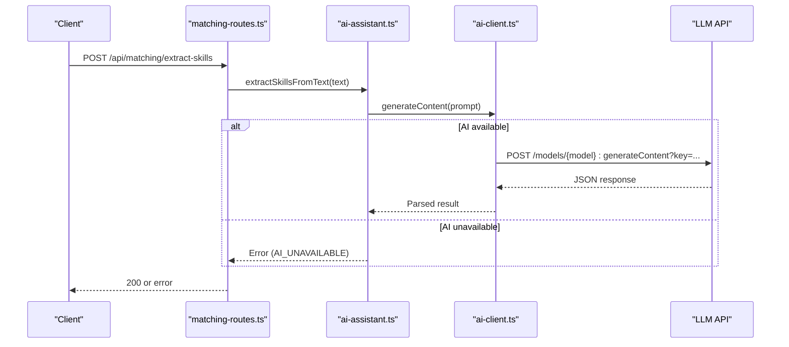
```mermaid
sequenceDiagram
participant Client as "Client"
participant Routes as "matching-routes.ts"
participant Assistant as "ai-assistant.ts"
participant ClientLLM as "ai-client.ts"
participant LLM as "LLM API"
Client->>Routes : POST /api/matching/extract-skills
Routes->>Assistant : extractSkillsFromText(text)
Assistant->>ClientLLM : generateContent(prompt)
alt AI available
ClientLLM->>LLM : POST /models/{model} : generateContent?key=...
LLM-->>ClientLLM : JSON response
ClientLLM-->>Assistant : Parsed result
else AI unavailable
Assistant-->>Routes : Error (AI_UNAVAILABLE)
end
Routes-->>Client : 200 or error
```

### Routes: API Surface for AI Matching
Endpoints:
- GET /api/matching/projects: Returns project recommendations for a freelancer.
- GET /api/matching/freelancers/{projectId}: Returns freelancer recommendations for a project.
- POST /api/matching/extract-skills: Extracts skills from text using AI or keyword fallback.
- GET /api/matching/skill-gaps: Analyzes skill gaps for a freelancer.

Validation and error handling:
- Parameter validation and rate-limiting middleware.
- Structured error responses with codes and messages.
- Request ID propagation for observability.

## Dependency Analysis
The AI matching system exhibits clear separation of concerns:

- Routes depend on Matching Service for business logic.
- Matching Service depends on AI Client for LLM interactions and Skill Service for taxonomy data.
- AI Client depends on Configuration for LLM API credentials and on the LLM API itself.
- Matching Service uses Entity Mapper for profile and project skill conversions.

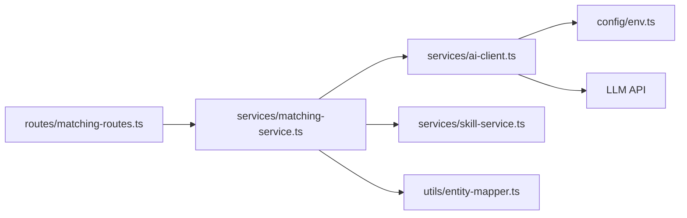
```mermaid
graph LR
Routes["routes/matching-routes.ts"] --> MS["services/matching-service.ts"]
MS --> AC["services/ai-client.ts"]
MS --> SS["services/skill-service.ts"]
MS --> EM["utils/entity-mapper.ts"]
AC --> CFG["config/env.ts"]
AC --> LLM["LLM API"]
```

## Performance Considerations
- API Rate Limits:
  - Global API rate limiter restricts general request volume.
  - Authentication attempts are rate-limited separately.
  - Sensitive operations have stricter limits.
- Request Timeouts:
  - AI requests enforce a fixed timeout to prevent long-hanging calls.
- Retries:
  - Exponential backoff for transient errors and rate limits.
- Fallback Mechanisms:
  - Keyword-based matching and extraction when AI is unavailable.
  - Basic skill gap analysis without AI when LLM is not configured.
- Caching Strategies:
  - No explicit caching for AI responses is implemented in the current codebase.
  - Consider caching skill extraction results and frequently accessed taxonomy data to reduce LLM calls and latency.

## Troubleshooting Guide
Common issues and resolutions:
- AI Unavailable:
  - Cause: Missing LLM API key or base URL.
  - Resolution: Configure LLM_API_KEY and LLM_API_URL in environment variables.
- AI HTTP Errors:
  - Cause: External API errors or rate limits.
  - Resolution: Inspect error code; AI client retries automatically for retryable conditions.
- Network Errors:
  - Cause: Timeouts or aborted requests.
  - Resolution: Verify network connectivity and retry; adjust timeout if necessary.
- Parsing Errors:
  - Cause: Non-JSON or malformed AI responses.
  - Resolution: AI client strips markdown fences; ensure prompts return valid JSON.
- Keyword Fallback:
  - Behavior: When AI fails, the system falls back to keyword-based matching/extraction.
- Skill Gap Analysis:
  - Behavior: Without AI, returns basic analysis with guidance to configure LLM.

Operational checks:
- Confirm environment variables for LLM configuration.
- Validate that the LLM API accepts the configured model and key.
- Monitor rate-limit responses and adjust client-side throttling.

## Conclusion
The AI-powered matching system in FreelanceXchain integrates Google Gemini-compatible LLM APIs to enhance skill matching, extraction, and gap analysis. It provides robust fallbacks, structured error handling, and clear separation of concerns across routes, services, and clients. With rate limiting and timeouts, the system balances reliability and responsiveness. Extending caching strategies for taxonomy and extraction results would further improve performance and reduce LLM usage costs.

## Appendices

### Prompt Templates Used
- Skill Match Prompt Template: Guides the model to return a JSON object containing matchScore, matchedSkills, missingSkills, and reasoning.
- Skill Extraction Prompt Template: Guides extraction of skills from text mapped to the platform’s taxonomy with confidence scores.
- Skill Gap Prompt Template: Requests recommendations and market demand signals for skill improvement.
- AI Assistant Prompt Templates:
  - Proposal Writer: Generates cover letters, suggested rates, estimated durations, and key points.
  - Project Description Generator: Produces improved descriptions, suggested milestones, and tips.
  - Dispute Analyzer: Summarizes disputes, lists supporting points, suggests resolution, and provides confidence and fairness metrics.

These templates define the expected JSON schema for parsing and ensure consistent AI outputs across the system.

---

# API Endpoints Reference

## Table of Contents
1. [Introduction](#introduction)
2. [Authentication Endpoints](#authentication-endpoints)
3. [Projects Endpoints](#projects-endpoints)
4. [Proposals Endpoints](#proposals-endpoints)
5. [Contracts Endpoints](#contracts-endpoints)
6. [Payments Endpoints](#payments-endpoints)
7. [Disputes Endpoints](#disputes-endpoints)
8. [Notifications Endpoints](#notifications-endpoints)
9. [KYC Endpoints](#kyc-endpoints)
10. [Matching Endpoints](#matching-endpoints)
11. [Search Endpoints](#search-endpoints)
12. [Error Handling](#error-handling)
13. [Rate Limiting Policies](#rate-limiting-policies)
14. [Client Implementation Examples](#client-implementation-examples)
15. [Versioning Strategy](#versioning-strategy)

## Introduction
This document provides comprehensive API documentation for the FreelanceXchain system, a decentralized freelance marketplace with AI skill matching and blockchain payments. The API follows RESTful principles and uses JWT for authentication. All endpoints are versioned through the base URL path `/api` and return JSON responses.

The API is organized into logical groups based on functionality:
- **Authentication**: User registration, login, and token management
- **Projects**: Project creation, management, and discovery
- **Proposals**: Freelancer submissions for projects
- **Contracts**: Agreement management between parties
- **Payments**: Milestone-based payment processing
- **Disputes**: Conflict resolution for payment issues
- **Notifications**: Real-time communication between users
- **KYC**: Identity verification and compliance
- **Matching**: AI-powered skill and project recommendations
- **Search**: Filtering and discovery of projects and freelancers

All endpoints require authentication via JWT bearer tokens, except for public endpoints like health checks and OAuth initiation. The API uses consistent error response formats and implements rate limiting to prevent abuse.

## Authentication Endpoints

The authentication system provides standard user registration and login functionality with JWT token management. It also supports OAuth integration with external providers (Google, GitHub, Azure, LinkedIn) through Supabase.

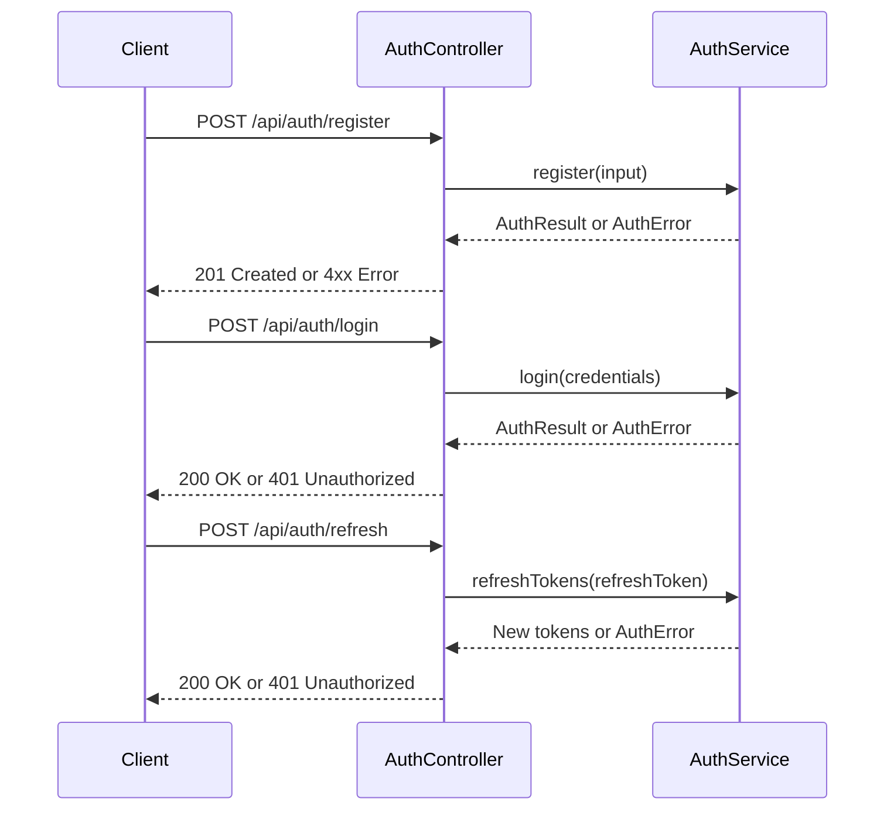
```mermaid
sequenceDiagram
participant Client
participant AuthController
participant AuthService
Client->>AuthController : POST /api/auth/register
AuthController->>AuthService : register(input)
AuthService-->>AuthController : AuthResult or AuthError
AuthController-->>Client : 201 Created or 4xx Error
Client->>AuthController : POST /api/auth/login
AuthController->>AuthService : login(credentials)
AuthService-->>AuthController : AuthResult or AuthError
AuthController-->>Client : 200 OK or 401 Unauthorized
Client->>AuthController : POST /api/auth/refresh
AuthController->>AuthService : refreshTokens(refreshToken)
AuthService-->>AuthController : New tokens or AuthError
AuthController-->>Client : 200 OK or 401 Unauthorized
```

### User Registration
Registers a new user account and returns authentication tokens.

**HTTP Method**: `POST`  
**URL Pattern**: `/api/auth/register`  
**Authentication Required**: No  
**Rate Limit**: 10 attempts per 15 minutes

**Request Body**:
```json
{
  "email": "user@example.com",
  "password": "securePassword123",
  "role": "freelancer",
  "name": "John Doe",
  "walletAddress": "0x742d35Cc6634C0532925a3b8D4C0cD1111111111"
}
```

**Response (201 Created)**:
```json
{
  "user": {
    "id": "uuid",
    "email": "user@example.com",
    "role": "freelancer",
    "walletAddress": "0x742d35Cc6634C0532925a3b8D4C0cD1111111111",
    "createdAt": "2023-01-01T00:00:00Z",
    "updatedAt": "2023-01-01T00:00:00Z"
  },
  "accessToken": "jwt-token",
  "refreshToken": "refresh-token"
}
```

**Error Codes**:
- `400`: Validation error (invalid email, weak password, etc.)
- `409`: Email already registered

### User Login
Authenticates a user and returns JWT tokens.

**HTTP Method**: `POST`  
**URL Pattern**: `/api/auth/login`  
**Authentication Required**: No  
**Rate Limit**: 10 attempts per 15 minutes

**Request Body**:
```json
{
  "email": "user@example.com",
  "password": "securePassword123"
}
```

**Response (200 OK)**:
```json
{
  "user": {
    "id": "uuid",
    "email": "user@example.com",
    "role": "freelancer",
    "walletAddress": "0x742d35Cc6634C0532925a3b8D4C0cD1111111111",
    "createdAt": "2023-01-01T00:00:00Z",
    "updatedAt": "2023-01-01T00:00:00Z"
  },
  "accessToken": "jwt-token",
  "refreshToken": "refresh-token"
}
```

**Error Codes**:
- `400`: Validation error
- `401`: Invalid credentials

### Token Refresh
Uses a refresh token to obtain new access and refresh tokens.

**HTTP Method**: `POST`  
**URL Pattern**: `/api/auth/refresh`  
**Authentication Required**: No  
**Rate Limit**: 10 attempts per 15 minutes

**Request Body**:
```json
{
  "refreshToken": "refresh-token"
}
```

**Response (200 OK)**:
```json
{
  "user": {
    "id": "uuid",
    "email": "user@example.com",
    "role": "freelancer",
    "walletAddress": "0x742d35Cc6634C0532925a3b8D4C0cD1111111111",
    "createdAt": "2023-01-01T00:00:00Z",
    "updatedAt": "2023-01-01T00:00:00Z"
  },
  "accessToken": "new-jwt-token",
  "refreshToken": "new-refresh-token"
}
```

**Error Codes**:
- `400`: Validation error
- `401`: Invalid or expired refresh token

### OAuth Integration
Supports OAuth login with external providers. The flow involves redirecting to the provider, handling the callback, and exchanging the authorization code for tokens.

**HTTP Method**: `GET`  
**URL Pattern**: `/api/auth/oauth/:provider`  
**Authentication Required**: No  
**Supported Providers**: `google`, `github`, `azure`, `linkedin`

**Response**: 302 redirect to the OAuth provider

## Projects Endpoints

The projects endpoints allow employers to create, manage, and discover projects. Projects represent work opportunities that freelancers can apply to with proposals.

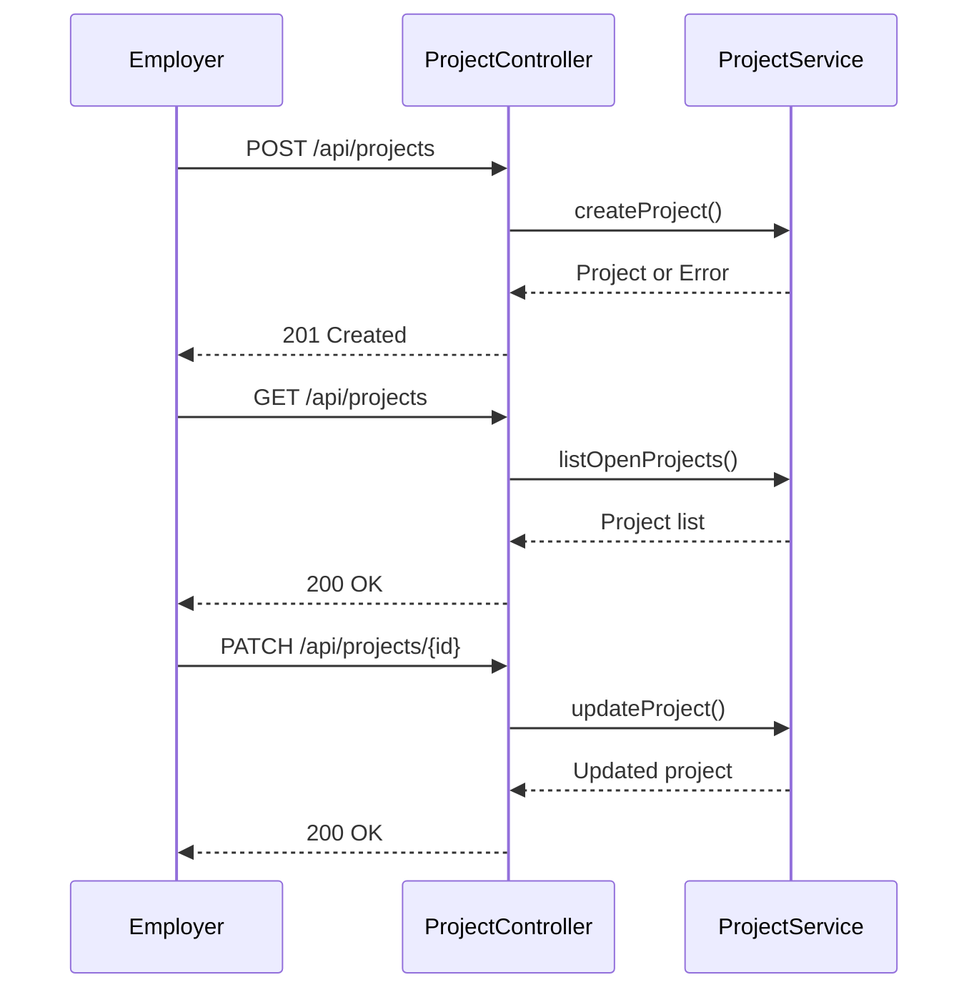
```mermaid
sequenceDiagram
participant Employer
participant ProjectController
participant ProjectService
Employer->>ProjectController : POST /api/projects
ProjectController->>ProjectService : createProject()
ProjectService-->>ProjectController : Project or Error
ProjectController-->>Employer : 201 Created
Employer->>ProjectController : GET /api/projects
ProjectController->>ProjectService : listOpenProjects()
ProjectService-->>ProjectController : Project list
ProjectController-->>Employer : 200 OK
Employer->>ProjectController : PATCH /api/projects/{id}
ProjectController->>ProjectService : updateProject()
ProjectService-->>ProjectController : Updated project
ProjectController-->>Employer : 200 OK
```

### Create Project
Creates a new project (employer only).

**HTTP Method**: `POST`  
**URL Pattern**: `/api/projects`  
**Authentication Required**: Yes (Bearer JWT)  
**Required Role**: `employer`  
**Rate Limit**: 100 requests per minute

**Request Body**:
```json
{
  "title": "Web Development Project",
  "description": "Need a full-stack developer for a React and Node.js application",
  "requiredSkills": [
    {
      "skillId": "uuid",
      "yearsOfExperience": 3
    }
  ],
  "budget": 5000,
  "deadline": "2023-12-31T00:00:00Z"
}
```

**Response (201 Created)**:
```json
{
  "id": "uuid",
  "employerId": "uuid",
  "title": "Web Development Project",
  "description": "Need a full-stack developer for a React and Node.js application",
  "requiredSkills": [
    {
      "skillId": "uuid",
      "skillName": "React",
      "categoryId": "uuid",
      "yearsOfExperience": 3
    }
  ],
  "budget": 5000,
  "deadline": "2023-12-31T00:00:00Z",
  "status": "draft",
  "milestones": [],
  "createdAt": "2023-01-01T00:00:00Z",
  "updatedAt": "2023-01-01T00:00:00Z"
}
```

**Error Codes**:
- `400`: Validation error
- `401`: Unauthorized
- `409`: Project locked (has accepted proposals)

### Get Project Details
Retrieves details of a specific project.

**HTTP Method**: `GET`  
**URL Pattern**: `/api/projects/{id}`  
**Authentication Required**: No  
**Rate Limit**: 100 requests per minute

**Response (200 OK)**:
```json
{
  "id": "uuid",
  "employerId": "uuid",
  "title": "Web Development Project",
  "description": "Need a full-stack developer for a React and Node.js application",
  "requiredSkills": [
    {
      "skillId": "uuid",
      "skillName": "React",
      "categoryId": "uuid",
      "yearsOfExperience": 3
    }
  ],
  "budget": 5000,
  "deadline": "2023-12-31T00:00:00Z",
  "status": "open",
  "milestones": [
    {
      "id": "uuid",
      "title": "Initial Design",
      "description": "Create wireframes and UI design",
      "amount": 1000,
      "dueDate": "2023-06-30T00:00:00Z",
      "status": "pending"
    }
  ],
  "createdAt": "2023-01-01T00:00:00Z",
  "updatedAt": "2023-01-01T00:00:00Z"
}
```

**Error Codes**:
- `400`: Invalid UUID format
- `404`: Project not found

### Update Project
Updates an existing project (employer only, project must not have accepted proposals).

**HTTP Method**: `PATCH`  
**URL Pattern**: `/api/projects/{id}`  
**Authentication Required**: Yes (Bearer JWT)  
**Required Role**: `employer`  
**Rate Limit**: 100 requests per minute

**Request Body**:
```json
{
  "title": "Updated Project Title",
  "description": "Updated project description",
  "budget": 6000,
  "status": "open"
}
```

**Response (200 OK)**:
Returns the updated project object in the same format as GET.

**Error Codes**:
- `400`: Validation error
- `401`: Unauthorized
- `404`: Project not found
- `409`: Project locked (has accepted proposals)

### List Projects with Filters
Retrieves a list of open projects with optional filters.

**HTTP Method**: `GET`  
**URL Pattern**: `/api/projects`  
**Authentication Required**: No  
**Rate Limit**: 100 requests per minute

**Query Parameters**:
- `keyword`: Search keyword for title/description
- `skills`: Comma-separated skill IDs
- `minBudget`: Minimum budget filter
- `maxBudget`: Maximum budget filter
- `limit`: Number of results per page (default: 20)
- `continuationToken`: Token for pagination

**Response (200 OK)**:
```json
{
  "items": [
    {
      "id": "uuid",
      "employerId": "uuid",
      "title": "Web Development Project",
      "description": "Need a full-stack developer for a React and Node.js application",
      "requiredSkills": [
        {
          "skillId": "uuid",
          "skillName": "React",
          "categoryId": "uuid",
          "yearsOfExperience": 3
        }
      ],
      "budget": 5000,
      "deadline": "2023-12-31T00:00:00Z",
      "status": "open",
      "milestones": [],
      "createdAt": "2023-01-01T00:00:00Z",
      "updatedAt": "2023-01-01T00:00:00Z"
    }
  ],
  "hasMore": true,
  "continuationToken": "next-page-token"
}
```

### Add Milestones to Project
Sets milestones for a project (employer only, milestone amounts must sum to budget).

**HTTP Method**: `POST`  
**URL Pattern**: `/api/projects/{id}/milestones`  
**Authentication Required**: Yes (Bearer JWT)  
**Required Role**: `employer`  
**Rate Limit**: 100 requests per minute

**Request Body**:
```json
{
  "milestones": [
    {
      "title": "Initial Design",
      "description": "Create wireframes and UI design",
      "amount": 1000,
      "dueDate": "2023-06-30T00:00:00Z"
    },
    {
      "title": "Frontend Development",
      "description": "Implement React components",
      "amount": 2000,
      "dueDate": "2023-07-31T00:00:00Z"
    }
  ]
}
```

**Response (200 OK)**:
Returns the updated project object with milestones.

**Error Codes**:
- `400`: Validation error, milestone sum mismatch
- `401`: Unauthorized
- `404`: Project not found
- `409`: Project locked (has accepted proposals)

### List Proposals for Project
Retrieves all proposals for a specific project (employer only).

**HTTP Method**: `GET`  
**URL Pattern**: `/api/projects/{id}/proposals`  
**Authentication Required**: Yes (Bearer JWT)  
**Required Role**: `employer`  
**Rate Limit**: 100 requests per minute

**Query Parameters**:
- `limit`: Number of results per page (default: 20)
- `continuationToken`: Token for pagination

**Response (200 OK)**:
```json
{
  "items": [
    {
      "id": "uuid",
      "projectId": "uuid",
      "freelancerId": "uuid",
      "coverLetter": "I'm excited to work on this project...",
      "proposedRate": 50,
      "estimatedDuration": 30,
      "status": "pending",
      "createdAt": "2023-01-01T00:00:00Z",
      "updatedAt": "2023-01-01T00:00:00Z"
    }
  ],
  "hasMore": false,
  "continuationToken": null
}
```

**Error Codes**:
- `400`: Invalid UUID format
- `401`: Unauthorized
- `404`: Project not found
- `403`: Forbidden (not project owner)

## Proposals Endpoints

The proposals endpoints allow freelancers to submit proposals for projects and employers to manage them. Proposals represent a freelancer's application to work on a project.

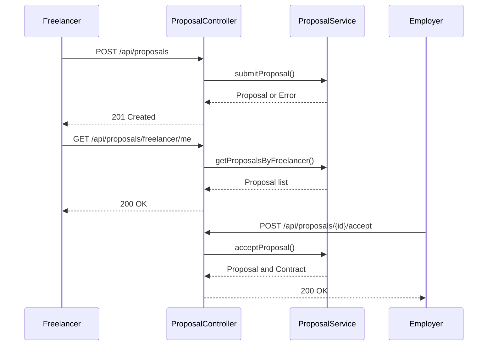
```mermaid
sequenceDiagram
participant Freelancer
participant ProposalController
participant ProposalService
Freelancer->>ProposalController : POST /api/proposals
ProposalController->>ProposalService : submitProposal()
ProposalService-->>ProposalController : Proposal or Error
ProposalController-->>Freelancer : 201 Created
Freelancer->>ProposalController : GET /api/proposals/freelancer/me
ProposalController->>ProposalService : getProposalsByFreelancer()
ProposalService-->>ProposalController : Proposal list
ProposalController-->>Freelancer : 200 OK
Employer->>ProposalController : POST /api/proposals/{id}/accept
ProposalController->>ProposalService : acceptProposal()
ProposalService-->>ProposalController : Proposal and Contract
ProposalController-->>Employer : 200 OK
```

### Submit Proposal
Submit a proposal for a project (freelancer only).

**HTTP Method**: `POST`  
**URL Pattern**: `/api/proposals`  
**Authentication Required**: Yes (Bearer JWT)  
**Required Role**: `freelancer`  
**Rate Limit**: 100 requests per minute

**Request Body**:
```json
{
  "projectId": "uuid",
  "coverLetter": "I'm excited to work on this project because...",
  "proposedRate": 50,
  "estimatedDuration": 30
}
```

**Response (201 Created)**:
```json
{
  "id": "uuid",
  "projectId": "uuid",
  "freelancerId": "uuid",
  "coverLetter": "I'm excited to work on this project because...",
  "proposedRate": 50,
  "estimatedDuration": 30,
  "status": "pending",
  "createdAt": "2023-01-01T00:00:00Z",
  "updatedAt": "2023-01-01T00:00:00Z"
}
```

**Error Codes**:
- `400`: Validation error
- `401`: Unauthorized
- `404`: Project not found
- `409`: Duplicate proposal

### Get Proposal Details
Retrieves details of a specific proposal.

**HTTP Method**: `GET`  
**URL Pattern**: `/api/proposals/{id}`  
**Authentication Required**: Yes (Bearer JWT)  
**Rate Limit**: 100 requests per minute

**Response (200 OK)**:
Returns the proposal object in the same format as POST.

**Error Codes**:
- `400`: Invalid UUID format
- `401`: Unauthorized
- `404`: Proposal not found

### Get My Proposals
Retrieves all proposals submitted by the authenticated freelancer.

**HTTP Method**: `GET`  
**URL Pattern**: `/api/proposals/freelancer/me`  
**Authentication Required**: Yes (Bearer JWT)  
**Required Role**: `freelancer`  
**Rate Limit**: 100 requests per minute

**Response (200 OK)**:
```json
[
  {
    "id": "uuid",
    "projectId": "uuid",
    "freelancerId": "uuid",
    "coverLetter": "I'm excited to work on this project because...",
    "proposedRate": 50,
    "estimatedDuration": 30,
    "status": "pending",
    "createdAt": "2023-01-01T00:00:00Z",
    "updatedAt": "2023-01-01T00:00:00Z"
  }
]
```

**Error Codes**:
- `401`: Unauthorized

### Accept Proposal
Accept a proposal and create a contract (employer only).

**HTTP Method**: `POST`  
**URL Pattern**: `/api/proposals/{id}/accept`  
**Authentication Required**: Yes (Bearer JWT)  
**Required Role**: `employer`  
**Rate Limit**: 100 requests per minute

**Response (200 OK)**:
```json
{
  "proposal": {
    "id": "uuid",
    "projectId": "uuid",
    "freelancerId": "uuid",
    "coverLetter": "I'm excited to work on this project because...",
    "proposedRate": 50,
    "estimatedDuration": 30,
    "status": "accepted",
    "createdAt": "2023-01-01T00:00:00Z",
    "updatedAt": "2023-01-01T00:00:00Z"
  },
  "contract": {
    "id": "uuid",
    "projectId": "uuid",
    "proposalId": "uuid",
    "freelancerId": "uuid",
    "employerId": "uuid",
    "escrowAddress": "0x742d35Cc6634C0532925a3b8D4C0cD1111111111",
    "totalAmount": 1500,
    "status": "active",
    "createdAt": "2023-01-01T00:00:00Z",
    "updatedAt": "2023-01-01T00:00:00Z"
  }
}
```

**Error Codes**:
- `400`: Invalid proposal status
- `401`: Unauthorized
- `404`: Proposal not found
- `403`: Forbidden (not project owner)

### Reject Proposal
Reject a proposal (employer only).

**HTTP Method**: `POST`  
**URL Pattern**: `/api/proposals/{id}/reject`  
**Authentication Required**: Yes (Bearer JWT)  
**Required Role**: `employer`  
**Rate Limit**: 100 requests per minute

**Response (200 OK)**:
Returns the rejected proposal object.

**Error Codes**:
- `400`: Invalid proposal status
- `401`: Unauthorized
- `404`: Proposal not found
- `403`: Forbidden (not project owner)

### Withdraw Proposal
Withdraw a pending proposal (freelancer only).

**HTTP Method**: `POST`  
**URL Pattern**: `/api/proposals/{id}/withdraw`  
**Authentication Required**: Yes (Bearer JWT)  
**Required Role**: `freelancer`  
**Rate Limit**: 100 requests per minute

**Response (200 OK)**:
Returns the withdrawn proposal object.

**Error Codes**:
- `400`: Invalid proposal status
- `401`: Unauthorized
- `404`: Proposal not found
- `403`: Forbidden (not proposal owner)

## Contracts Endpoints

The contracts endpoints allow users to retrieve contract information. Contracts represent formal agreements between employers and freelancers for project work.

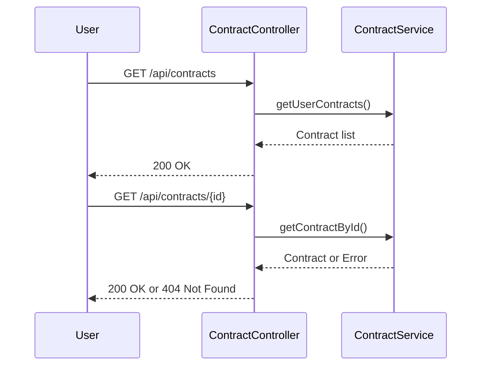
```mermaid
sequenceDiagram
participant User
participant ContractController
participant ContractService
User->>ContractController : GET /api/contracts
ContractController->>ContractService : getUserContracts()
ContractService-->>ContractController : Contract list
ContractController-->>User : 200 OK
User->>ContractController : GET /api/contracts/{id}
ContractController->>ContractService : getContractById()
ContractService-->>ContractController : Contract or Error
ContractController-->>User : 200 OK or 404 Not Found
```

### List User's Contracts
Retrieves all contracts for the authenticated user (as freelancer or employer).

**HTTP Method**: `GET`  
**URL Pattern**: `/api/contracts`  
**Authentication Required**: Yes (Bearer JWT)  
**Rate Limit**: 100 requests per minute

**Query Parameters**:
- `limit`: Number of results per page (default: 20)
- `continuationToken`: Token for pagination

**Response (200 OK)**:
```json
{
  "items": [
    {
      "id": "uuid",
      "projectId": "uuid",
      "proposalId": "uuid",
      "freelancerId": "uuid",
      "employerId": "uuid",
      "escrowAddress": "0x742d35Cc6634C0532925a3b8D4C0cD1111111111",
      "totalAmount": 1500,
      "status": "active",
      "createdAt": "2023-01-01T00:00:00Z",
      "updatedAt": "2023-01-01T00:00:00Z"
    }
  ],
  "hasMore": false,
  "continuationToken": null
}
```

**Error Codes**:
- `401`: Unauthorized

### Get Contract Details
Retrieves details of a specific contract.

**HTTP Method**: `GET`  
**URL Pattern**: `/api/contracts/{id}`  
**Authentication Required**: Yes (Bearer JWT)  
**Rate Limit**: 100 requests per minute

**Response (200 OK)**:
Returns the contract object in the same format as above.

**Error Codes**:
- `400`: Invalid UUID format
- `401`: Unauthorized
- `404`: Contract not found

## Payments Endpoints

The payments endpoints handle milestone-based payment processing, including completion requests, approvals, disputes, and status checks.

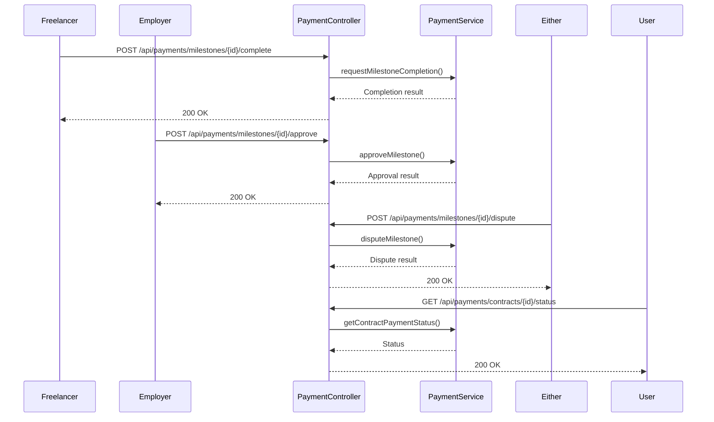
```mermaid
sequenceDiagram
participant Freelancer
participant Employer
participant PaymentController
participant PaymentService
Freelancer->>PaymentController : POST /api/payments/milestones/{id}/complete
PaymentController->>PaymentService : requestMilestoneCompletion()
PaymentService-->>PaymentController : Completion result
PaymentController-->>Freelancer : 200 OK
Employer->>PaymentController : POST /api/payments/milestones/{id}/approve
PaymentController->>PaymentService : approveMilestone()
PaymentService-->>PaymentController : Approval result
PaymentController-->>Employer : 200 OK
Either->>PaymentController : POST /api/payments/milestones/{id}/dispute
PaymentController->>PaymentService : disputeMilestone()
PaymentService-->>PaymentController : Dispute result
PaymentController-->>Either : 200 OK
User->>PaymentController : GET /api/payments/contracts/{id}/status
PaymentController->>PaymentService : getContractPaymentStatus()
PaymentService-->>PaymentController : Status
PaymentController-->>User : 200 OK
```

### Mark Milestone as Complete
Freelancer marks a milestone as complete, triggering employer notification.

**HTTP Method**: `POST`  
**URL Pattern**: `/api/payments/milestones/{milestoneId}/complete`  
**Authentication Required**: Yes (Bearer JWT)  
**Rate Limit**: 100 requests per minute

**Query Parameters**:
- `contractId`: The contract ID (UUID)

**Response (200 OK)**:
```json
{
  "milestoneId": "uuid",
  "status": "submitted",
  "notificationSent": true
}
```

**Error Codes**:
- `400`: Invalid request
- `401`: Unauthorized
- `404`: Contract or milestone not found
- `403`: Forbidden (not freelancer on contract)

### Approve Milestone Completion
Employer approves milestone completion, triggering payment release.

**HTTP Method**: `POST`  
**URL Pattern**: `/api/payments/milestones/{milestoneId}/approve`  
**Authentication Required**: Yes (Bearer JWT)  
**Rate Limit**: 100 requests per minute

**Query Parameters**:
- `contractId`: The contract ID (UUID)

**Response (200 OK)**:
```json
{
  "milestoneId": "uuid",
  "status": "approved",
  "paymentReleased": true,
  "transactionHash": "0xabc123...",
  "contractCompleted": false
}
```

**Error Codes**:
- `400`: Invalid request
- `401`: Unauthorized
- `404`: Contract or milestone not found
- `403`: Forbidden (not employer on contract)

### Dispute Milestone
Either party disputes a milestone, locking funds and creating a dispute record.

**HTTP Method**: `POST`  
**URL Pattern**: `/api/payments/milestones/{milestoneId}/dispute`  
**Authentication Required**: Yes (Bearer JWT)  
**Rate Limit**: 100 requests per minute

**Query Parameters**:
- `contractId`: The contract ID (UUID)

**Request Body**:
```json
{
  "reason": "The work delivered does not meet the requirements specified in the milestone."
}
```

**Response (200 OK)**:
```json
{
  "milestoneId": "uuid",
  "status": "disputed",
  "disputeId": "uuid",
  "disputeCreated": true
}
```

**Error Codes**:
- `400`: Invalid request
- `401`: Unauthorized
- `404`: Contract or milestone not found

### Get Contract Payment Status
Get detailed payment status for a contract including milestone statuses.

**HTTP Method**: `GET`  
**URL Pattern**: `/api/payments/contracts/{contractId}/status`  
**Authentication Required**: Yes (Bearer JWT)  
**Rate Limit**: 100 requests per minute

**Response (200 OK)**:
```json
{
  "contractId": "uuid",
  "escrowAddress": "0x742d35Cc6634C0532925a3b8D4C0cD1111111111",
  "totalAmount": 1500,
  "releasedAmount": 500,
  "pendingAmount": 1000,
  "milestones": [
    {
      "id": "uuid",
      "title": "Initial Design",
      "amount": 500,
      "status": "approved"
    },
    {
      "id": "uuid",
      "title": "Frontend Development",
      "amount": 1000,
      "status": "submitted"
    }
  ],
  "contractStatus": "in_progress"
}
```

**Error Codes**:
- `400`: Invalid UUID format
- `401`: Unauthorized
- `404`: Contract not found

## Disputes Endpoints

The disputes endpoints handle conflict resolution for payment issues, including dispute creation, evidence submission, and resolution by administrators.

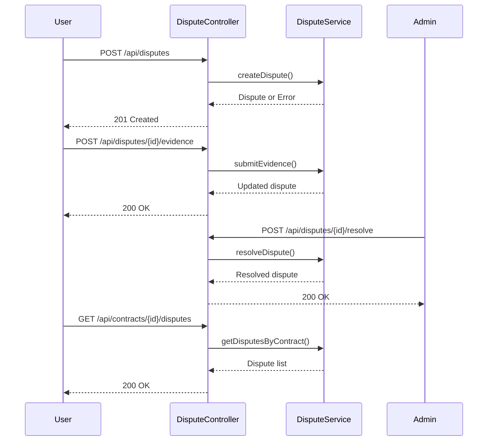
```mermaid
sequenceDiagram
participant User
participant DisputeController
participant DisputeService
User->>DisputeController : POST /api/disputes
DisputeController->>DisputeService : createDispute()
DisputeService-->>DisputeController : Dispute or Error
DisputeController-->>User : 201 Created
User->>DisputeController : POST /api/disputes/{id}/evidence
DisputeController->>DisputeService : submitEvidence()
DisputeService-->>DisputeController : Updated dispute
DisputeController-->>User : 200 OK
Admin->>DisputeController : POST /api/disputes/{id}/resolve
DisputeController->>DisputeService : resolveDispute()
DisputeService-->>DisputeController : Resolved dispute
DisputeController-->>Admin : 200 OK
User->>DisputeController : GET /api/contracts/{id}/disputes
DisputeController->>DisputeService : getDisputesByContract()
DisputeService-->>DisputeController : Dispute list
DisputeController-->>User : 200 OK
```

### Create Dispute
Create a dispute for a milestone, locking associated funds.

**HTTP Method**: `POST`  
**URL Pattern**: `/api/disputes`  
**Authentication Required**: Yes (Bearer JWT)  
**Rate Limit**: 100 requests per minute

**Request Body**:
```json
{
  "contractId": "uuid",
  "milestoneId": "uuid",
  "reason": "The work delivered does not meet the requirements specified in the milestone."
}
```

**Response (201 Created)**:
```json
{
  "id": "uuid",
  "contractId": "uuid",
  "milestoneId": "uuid",
  "initiatorId": "uuid",
  "reason": "The work delivered does not meet the requirements specified in the milestone.",
  "evidence": [],
  "status": "open",
  "createdAt": "2023-01-01T00:00:00Z",
  "updatedAt": "2023-01-01T00:00:00Z"
}
```

**Error Codes**:
- `400`: Validation error
- `401`: Unauthorized
- `403`: User not authorized to create dispute
- `404`: Contract or milestone not found
- `409`: Milestone already disputed

### Get Dispute Details
Get details of a specific dispute.

**HTTP Method**: `GET`  
**URL Pattern**: `/api/disputes/{disputeId}`  
**Authentication Required**: Yes (Bearer JWT)  
**Rate Limit**: 100 requests per minute

**Response (200 OK)**:
Returns the dispute object in the same format as POST.

**Error Codes**:
- `400`: Invalid UUID format
- `401`: Unauthorized
- `404`: Dispute not found

### Submit Evidence for Dispute
Submit evidence to support a dispute case.

**HTTP Method**: `POST`  
**URL Pattern**: `/api/disputes/{disputeId}/evidence`  
**Authentication Required**: Yes (Bearer JWT)  
**Rate Limit**: 100 requests per minute

**Request Body**:
```json
{
  "type": "text",
  "content": "The delivered code does not compile and fails to meet the requirements outlined in the milestone description."
}
```

**Response (200 OK)**:
Returns the updated dispute object with the new evidence.

**Error Codes**:
- `400`: Validation error
- `401`: Unauthorized
- `403`: User not authorized to submit evidence
- `404`: Dispute not found

### Resolve Dispute
Admin resolves a dispute, triggering payment based on decision.

**HTTP Method**: `POST`  
**URL Pattern**: `/api/disputes/{disputeId}/resolve`  
**Authentication Required**: Yes (Bearer JWT)  
**Required Role**: `admin`  
**Rate Limit**: 100 requests per minute

**Request Body**:
```json
{
  "decision": "freelancer_favor",
  "reasoning": "After reviewing the evidence, the freelancer has completed the work as specified in the milestone requirements."
}
```

**Response (200 OK)**:
Returns the resolved dispute object with resolution details.

**Error Codes**:
- `400`: Validation error
- `401`: Unauthorized
- `403`: Only administrators can resolve disputes
- `404`: Dispute not found

### List Disputes for Contract
Get all disputes associated with a contract.

**HTTP Method**: `GET`  
**URL Pattern**: `/api/contracts/{contractId}/disputes`  
**Authentication Required**: Yes (Bearer JWT)  
**Rate Limit**: 100 requests per minute

**Response (200 OK)**:
```json
[
  {
    "id": "uuid",
    "contractId": "uuid",
    "milestoneId": "uuid",
    "initiatorId": "uuid",
    "reason": "The work delivered does not meet the requirements specified in the milestone.",
    "evidence": [],
    "status": "resolved",
    "resolution": {
      "decision": "freelancer_favor",
      "reasoning": "After reviewing the evidence, the freelancer has completed the work as specified in the milestone requirements.",
      "resolvedBy": "uuid",
      "resolvedAt": "2023-01-02T00:00:00Z"
    },
    "createdAt": "2023-01-01T00:00:00Z",
    "updatedAt": "2023-01-02T00:00:00Z"
  }
]
```

**Error Codes**:
- `400`: Invalid UUID format
- `401`: Unauthorized
- `403`: User not authorized to view disputes
- `404`: Contract not found

## Notifications Endpoints

The notifications endpoints allow users to manage their notifications, including retrieving, marking as read, and getting unread counts.

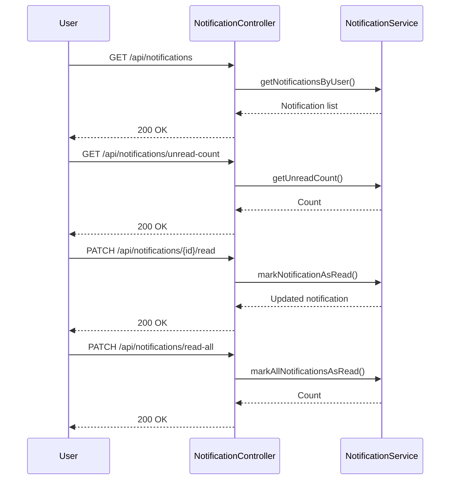
```mermaid
sequenceDiagram
participant User
participant NotificationController
participant NotificationService
User->>NotificationController : GET /api/notifications
NotificationController->>NotificationService : getNotificationsByUser()
NotificationService-->>NotificationController : Notification list
NotificationController-->>User : 200 OK
User->>NotificationController : GET /api/notifications/unread-count
NotificationController->>NotificationService : getUnreadCount()
NotificationService-->>NotificationController : Count
NotificationController-->>User : 200 OK
User->>NotificationController : PATCH /api/notifications/{id}/read
NotificationController->>NotificationService : markNotificationAsRead()
NotificationService-->>NotificationController : Updated notification
NotificationController-->>User : 200 OK
User->>NotificationController : PATCH /api/notifications/read-all
NotificationController->>NotificationService : markAllNotificationsAsRead()
NotificationService-->>NotificationController : Count
NotificationController-->>User : 200 OK
```

### Get User Notifications
Retrieves all notifications for the authenticated user, sorted by creation time (newest first).

**HTTP Method**: `GET`  
**URL Pattern**: `/api/notifications`  
**Authentication Required**: Yes (Bearer JWT)  
**Rate Limit**: 100 requests per minute

**Query Parameters**:
- `maxItemCount`: Maximum number of notifications to return (1-100)
- `continuationToken`: Token for pagination

**Response (200 OK)**:
```json
{
  "items": [
    {
      "id": "uuid",
      "userId": "uuid",
      "type": "proposal_received",
      "title": "New Proposal Received",
      "message": "You have received a new proposal for your project 'Web Development Project'.",
      "data": {
        "projectId": "uuid",
        "proposalId": "uuid",
        "freelancerId": "uuid"
      },
      "isRead": false,
      "createdAt": "2023-01-01T00:00:00Z"
    }
  ],
  "continuationToken": "next-page-token",
  "hasMore": true
}
```

**Error Codes**:
- `401`: Unauthorized

### Get Unread Notification Count
Returns the count of unread notifications for the authenticated user.

**HTTP Method**: `GET`  
**URL Pattern**: `/api/notifications/unread-count`  
**Authentication Required**: Yes (Bearer JWT)  
**Rate Limit**: 100 requests per minute

**Response (200 OK)**:
```json
{
  "count": 5
}
```

**Error Codes**:
- `401`: Unauthorized

### Mark Notification as Read
Marks a specific notification as read.

**HTTP Method**: `PATCH`  
**URL Pattern**: `/api/notifications/{id}/read`  
**Authentication Required**: Yes (Bearer JWT)  
**Rate Limit**: 100 requests per minute

**Response (200 OK)**:
Returns the updated notification object with `isRead: true`.

**Error Codes**:
- `400`: Invalid UUID format
- `401`: Unauthorized
- `404`: Notification not found
- `403`: Forbidden (not notification owner)

### Mark All Notifications as Read
Marks all notifications for the authenticated user as read.

**HTTP Method**: `PATCH`  
**URL Pattern**: `/api/notifications/read-all`  
**Authentication Required**: Yes (Bearer JWT)  
**Rate Limit**: 100 requests per minute

**Response (200 OK)**:
```json
{
  "count": 5
}
```

**Error Codes**:
- `401`: Unauthorized

## KYC Endpoints

The KYC endpoints handle identity verification and compliance, including submission, review, and status checking.

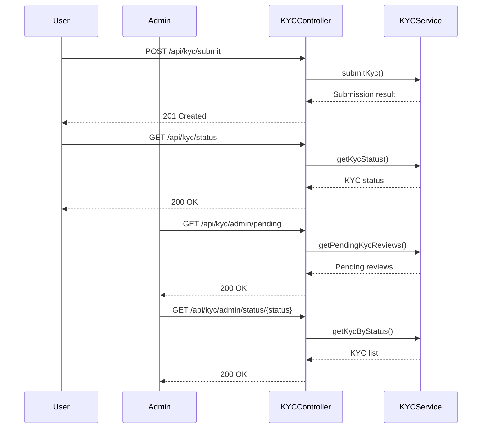
```mermaid
sequenceDiagram
participant User
participant Admin
participant KYCController
participant KYCService
User->>KYCController : POST /api/kyc/submit
KYCController->>KYCService : submitKyc()
KYCService-->>KYCController : Submission result
KYCController-->>User : 201 Created
User->>KYCController : GET /api/kyc/status
KYCController->>KYCService : getKycStatus()
KYCService-->>KYCController : KYC status
KYCController-->>User : 200 OK
Admin->>KYCController : GET /api/kyc/admin/pending
KYCController->>KYCService : getPendingKycReviews()
KYCService-->>KYCController : Pending reviews
KYCController-->>Admin : 200 OK
Admin->>KYCController : GET /api/kyc/admin/status/{status}
KYCController->>KYCService : getKycByStatus()
KYCService-->>KYCController : KYC list
KYCController-->>Admin : 200 OK
```

### Get Supported Countries for KYC
Returns list of countries with their KYC requirements.

**HTTP Method**: `GET`  
**URL Pattern**: `/api/kyc/countries`  
**Authentication Required**: No  
**Rate Limit**: 100 requests per minute

**Response (200 OK)**:
```json
[
  {
    "code": "US",
    "name": "United States",
    "supportedDocuments": ["passport", "national_id", "drivers_license"],
    "requiresLiveness": true,
    "requiresAddressProof": true,
    "tier": "standard"
  }
]
```

### Get KYC Requirements for Country
Get KYC requirements for a specific country.

**HTTP Method**: `GET`  
**URL Pattern**: `/api/kyc/countries/{countryCode}`  
**Authentication Required**: No  
**Rate Limit**: 100 requests per minute

**Response (200 OK)**:
Returns the country requirements object in the same format as above.

**Error Codes**:
- `404`: Country not supported

### Get Current User's KYC Status
Get the current user's KYC verification status.

**HTTP Method**: `GET`  
**URL Pattern**: `/api/kyc/status`  
**Authentication Required**: Yes (Bearer JWT)  
**Rate Limit**: 100 requests per minute

**Response (200 OK)**:
```json
{
  "id": "uuid",
  "userId": "uuid",
  "status": "approved",
  "tier": "standard",
  "firstName": "John",
  "lastName": "Doe",
  "nationality": "US",
  "address": {
    "addressLine1": "123 Main St",
    "city": "New York",
    "country": "United States",
    "countryCode": "US"
  },
  "documents": [
    {
      "type": "passport",
      "documentNumber": "P12345678",
      "issuingCountry": "US",
      "frontImageUrl": "https://example.com/passport.jpg"
    }
  ],
  "livenessCheck": {
    "id": "uuid",
    "sessionId": "uuid",
    "status": "passed",
    "confidenceScore": 0.95,
    "challenges": [
      {
        "type": "blink",
        "completed": true,
        "timestamp": "2023-01-01T00:00:00Z"
      }
    ],
    "expiresAt": "2023-01-02T00:00:00Z"
  },
  "faceMatchScore": 0.92,
  "faceMatchStatus": "matched",
  "amlScreeningStatus": "clear",
  "riskLevel": "low"
}
```

**Error Codes**:
- `401`: Unauthorized
- `404`: No KYC verification found

### Submit KYC Verification
Submit identity documents and personal information for international KYC verification.

**HTTP Method**: `POST`  
**URL Pattern**: `/api/kyc/submit`  
**Authentication Required**: Yes (Bearer JWT)  
**Rate Limit**: 100 requests per minute

**Request Body**:
```json
{
  "firstName": "John",
  "lastName": "Doe",
  "dateOfBirth": "1980-01-01",
  "nationality": "US",
  "address": {
    "addressLine1": "123 Main St",
    "city": "New York",
    "country": "United States",
    "countryCode": "US"
  },
  "document": {
    "type": "passport",
    "documentNumber": "P12345678",
    "issuingCountry": "US",
    "frontImageUrl": "https://example.com/passport.jpg"
  },
  "selfieImageUrl": "https://example.com/selfie.jpg",
  "tier": "standard"
}
```

**Response (201 Created)**:
Returns the created KYC verification object.

**Error Codes**:
- `400`: Validation error
- `409`: KYC already pending or approved

### Create Face Liveness Session
Initiates a liveness check session with random challenges.

**HTTP Method**: `POST`  
**URL Pattern**: `/api/kyc/liveness/session`  
**Authentication Required**: Yes (Bearer JWT)  
**Rate Limit**: 100 requests per minute

**Request Body**:
```json
{
  "challenges": ["blink", "smile", "turn_left"]
}
```

**Response (201 Created)**:
```json
{
  "id": "uuid",
  "sessionId": "uuid",
  "status": "pending",
  "challenges": [
    {
      "type": "blink",
      "completed": false,
      "timestamp": null
    }
  ],
  "expiresAt": "2023-01-02T00:00:00Z"
}
```

**Error Codes**:
- `400`: KYC not found or already approved

### Get Current Liveness Session
Get the current liveness session.

**HTTP Method**: `GET`  
**URL Pattern**: `/api/kyc/liveness/session`  
**Authentication Required**: Yes (Bearer JWT)  
**Rate Limit**: 100 requests per minute

**Response (200 OK)**:
Returns the current liveness session object.

**Error Codes**:
- `401`: Unauthorized
- `404`: No active liveness session

### Submit Liveness Verification Results
Submit captured frames and challenge results for liveness verification.

**HTTP Method**: `POST`  
**URL Pattern**: `/api/kyc/liveness/verify`  
**Authentication Required**: Yes (Bearer JWT)  
**Rate Limit**: 100 requests per minute

**Request Body**:
```json
{
  "sessionId": "uuid",
  "capturedFrames": ["base64-image-1", "base64-image-2"],
  "challengeResults": [
    {
      "type": "blink",
      "completed": true,
      "timestamp": "2023-01-01T00:00:00Z"
    }
  ]
}
```

**Response (200 OK)**:
Returns the updated liveness check object.

**Error Codes**:
- `400`: Validation error

### Verify Face Match
Verify face match between selfie and document.

**HTTP Method**: `POST`  
**URL Pattern**: `/api/kyc/face-match`  
**Authentication Required**: Yes (Bearer JWT)  
**Rate Limit**: 100 requests per minute

**Request Body**:
```json
{
  "selfieImageUrl": "https://example.com/selfie.jpg",
  "documentImageUrl": "https://example.com/passport.jpg"
}
```

**Response (200 OK)**:
```json
{
  "matched": true,
  "score": 0.92
}
```

**Error Codes**:
- `400`: Validation error

### Add Additional Document
Add an additional document to KYC verification.

**HTTP Method**: `POST`  
**URL Pattern**: `/api/kyc/documents`  
**Authentication Required**: Yes (Bearer JWT)  
**Rate Limit**: 100 requests per minute

**Request Body**:
```json
{
  "type": "utility_bill",
  "documentNumber": "UB123456",
  "issuingCountry": "US",
  "frontImageUrl": "https://example.com/bill.jpg"
}
```

**Response (200 OK)**:
Returns the updated KYC verification object.

**Error Codes**:
- `400`: Validation error

### Get Pending KYC Reviews
Get pending KYC reviews (Admin only).

**HTTP Method**: `GET`  
**URL Pattern**: `/api/kyc/admin/pending`  
**Authentication Required**: Yes (Bearer JWT)  
**Required Role**: `admin`  
**Rate Limit**: 100 requests per minute

**Response (200 OK)**:
```json
[
  {
    "id": "uuid",
    "userId": "uuid",
    "status": "submitted",
    "firstName": "John",
    "lastName": "Doe",
    "nationality": "US"
  }
]
```

### Get KYC Verifications by Status
Get KYC verifications by status (Admin only).

**HTTP Method**: `GET`  
**URL Pattern**: `/api/kyc/admin/status/{status}`  
**Authentication Required**: Yes (Bearer JWT)  
**Required Role**: `admin`  
**Rate Limit**: 100 requests per minute

**Response (200 OK)**:
Returns a list of KYC verifications with the specified status.

**Error Codes**:
- `400`: Invalid status

## Matching Endpoints

The matching endpoints provide AI-powered recommendations for projects and freelancers, as well as skill extraction and gap analysis.

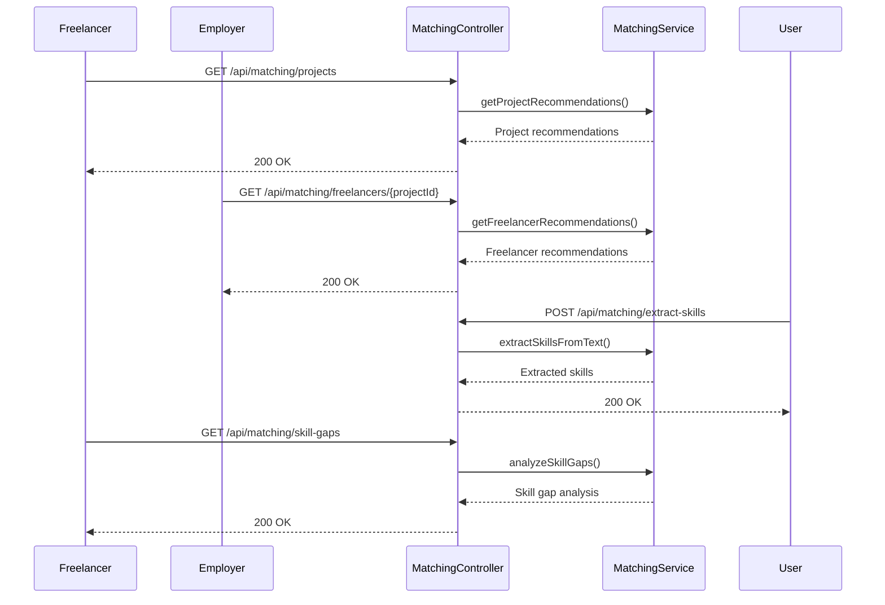
```mermaid
sequenceDiagram
participant Freelancer
participant Employer
participant MatchingController
participant MatchingService
Freelancer->>MatchingController : GET /api/matching/projects
MatchingController->>MatchingService : getProjectRecommendations()
MatchingService-->>MatchingController : Project recommendations
MatchingController-->>Freelancer : 200 OK
Employer->>MatchingController : GET /api/matching/freelancers/{projectId}
MatchingController->>MatchingService : getFreelancerRecommendations()
MatchingService-->>MatchingController : Freelancer recommendations
MatchingController-->>Employer : 200 OK
User->>MatchingController : POST /api/matching/extract-skills
MatchingController->>MatchingService : extractSkillsFromText()
MatchingService-->>MatchingController : Extracted skills
MatchingController-->>User : 200 OK
Freelancer->>MatchingController : GET /api/matching/skill-gaps
MatchingController->>MatchingService : analyzeSkillGaps()
MatchingService-->>MatchingController : Skill gap analysis
MatchingController-->>Freelancer : 200 OK
```

### Get Project Recommendations
Returns AI-powered project recommendations for a freelancer, ranked by match score.

**HTTP Method**: `GET`  
**URL Pattern**: `/api/matching/projects`  
**Authentication Required**: Yes (Bearer JWT)  
**Rate Limit**: 100 requests per minute

**Query Parameters**:
- `limit`: Maximum number of recommendations to return (default: 10, max: 50)

**Response (200 OK)**:
```json
[
  {
    "projectId": "uuid",
    "matchScore": 95,
    "matchedSkills": ["React", "Node.js", "TypeScript"],
    "missingSkills": ["GraphQL"],
    "reasoning": "You have strong experience in React and Node.js which are required for this project. Consider learning GraphQL to improve your match score."
  }
]
```

**Error Codes**:
- `401`: Unauthorized
- `404`: Freelancer profile not found

### Get Freelancer Recommendations
Returns AI-powered freelancer recommendations for a project, ranked by combined skill and reputation score.

**HTTP Method**: `GET`  
**URL Pattern**: `/api/matching/freelancers/{projectId}`  
**Authentication Required**: Yes (Bearer JWT)  
**Rate Limit**: 100 requests per minute

**Query Parameters**:
- `limit`: Maximum number of recommendations to return (default: 10, max: 50)

**Response (200 OK)**:
```json
[
  {
    "freelancerId": "uuid",
    "matchScore": 90,
    "reputationScore": 4.8,
    "combinedScore": 92,
    "matchedSkills": ["React", "Node.js", "TypeScript"],
    "reasoning": "This freelancer has excellent skills in React and Node.js with a strong reputation score. They have completed similar projects successfully."
  }
]
```

**Error Codes**:
- `400`: Invalid UUID format
- `401`: Unauthorized
- `404`: Project not found

### Extract Skills from Text
Uses AI to extract and map skills from text to the platform taxonomy.

**HTTP Method**: `POST`  
**URL Pattern**: `/api/matching/extract-skills`  
**Authentication Required**: Yes (Bearer JWT)  
**Rate Limit**: 100 requests per minute

**Request Body**:
```json
{
  "text": "I have 5 years of experience with React, Node.js, and MongoDB. I'm also familiar with Docker and Kubernetes."
}
```

**Response (200 OK)**:
```json
[
  {
    "skillId": "uuid",
    "skillName": "React",
    "confidence": 0.98
  },
  {
    "skillId": "uuid",
    "skillName": "Node.js",
    "confidence": 0.97
  },
  {
    "skillId": "uuid",
    "skillName": "MongoDB",
    "confidence": 0.95
  }
]
```

**Error Codes**:
- `400`: Validation error
- `401`: Unauthorized

### Analyze Skill Gaps
Uses AI to analyze a freelancer's skills and suggest improvements based on market demand.

**HTTP Method**: `GET`  
**URL Pattern**: `/api/matching/skill-gaps`  
**Authentication Required**: Yes (Bearer JWT)  
**Rate Limit**: 100 requests per minute

**Response (200 OK)**:
```json
{
  "currentSkills": ["React", "Node.js", "JavaScript"],
  "recommendedSkills": ["TypeScript", "GraphQL", "Next.js"],
  "marketDemand": [
    {
      "skillName": "TypeScript",
      "demandLevel": "high"
    },
    {
      "skillName": "GraphQL",
      "demandLevel": "medium"
    }
  ],
  "reasoning": "Your skills in React and Node.js are strong, but adding TypeScript would make you more competitive as it's in high demand. GraphQL is also valuable for modern API development."
}
```

**Error Codes**:
- `401`: Unauthorized
- `404`: Freelancer profile not found

## Search Endpoints

The search endpoints provide filtering and discovery capabilities for projects and freelancers.

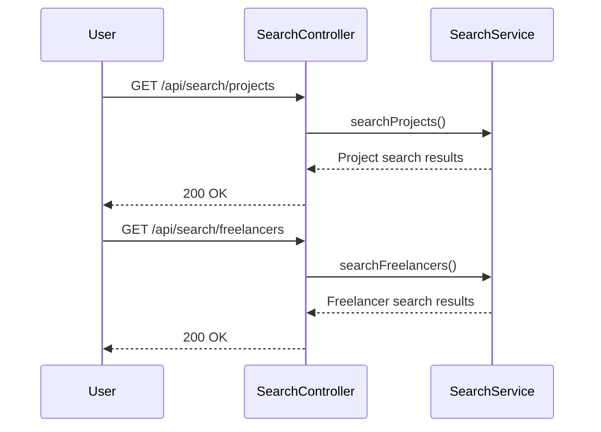
```mermaid
sequenceDiagram
participant User
participant SearchController
participant SearchService
User->>SearchController : GET /api/search/projects
SearchController->>SearchService : searchProjects()
SearchService-->>SearchController : Project search results
SearchController-->>User : 200 OK
User->>SearchController : GET /api/search/freelancers
SearchController->>SearchService : searchFreelancers()
SearchService-->>SearchController : Freelancer search results
SearchController-->>User : 200 OK
```

### Search Projects
Search for projects with keyword, skill, and budget filters.

**HTTP Method**: `GET`  
**URL Pattern**: `/api/search/projects`  
**Authentication Required**: No  
**Rate Limit**: 100 requests per minute

**Query Parameters**:
- `keyword`: Search keyword for title/description
- `skills`: Comma-separated skill IDs to filter by
- `minBudget`: Minimum budget filter
- `maxBudget`: Maximum budget filter
- `pageSize`: Number of results per page (default: 20, max: 100)
- `continuationToken`: Token for pagination

**Response (200 OK)**:
```json
{
  "items": [
    {
      "id": "uuid",
      "employerId": "uuid",
      "title": "Web Development Project",
      "description": "Need a full-stack developer for a React and Node.js application",
      "requiredSkills": [
        {
          "skillId": "uuid",
          "skillName": "React",
          "categoryId": "uuid",
          "yearsOfExperience": 3
        }
      ],
      "budget": 5000,
      "deadline": "2023-12-31T00:00:00Z",
      "status": "open",
      "milestones": [],
      "createdAt": "2023-01-01T00:00:00Z",
      "updatedAt": "2023-01-01T00:00:00Z"
    }
  ],
  "metadata": {
    "pageSize": 20,
    "hasMore": true,
    "continuationToken": "next-page-token"
  }
}
```

**Error Codes**:
- `400`: Invalid request parameters

### Search Freelancers
Search for freelancers with keyword and skill filters.

**HTTP Method**: `GET`  
**URL Pattern**: `/api/search/freelancers`  
**Authentication Required**: No  
**Rate Limit**: 100 requests per minute

**Query Parameters**:
- `keyword`: Search keyword for bio
- `skills`: Comma-separated skill IDs to filter by
- `pageSize`: Number of results per page (default: 20, max: 100)
- `continuationToken`: Token for pagination

**Response (200 OK)**:
```json
{
  "items": [
    {
      "id": "uuid",
      "userId": "uuid",
      "bio": "Full-stack developer with 5 years of experience in React and Node.js",
      "hourlyRate": 50,
      "skills": [
        {
          "skillId": "uuid",
          "skillName": "React",
          "categoryId": "uuid",
          "yearsOfExperience": 5
        }
      ],
      "experience": [
        {
          "id": "uuid",
          "title": "Senior Developer",
          "company": "Tech Company",
          "description": "Led development of web applications",
          "startDate": "2018-01-01",
          "endDate": null
        }
      ],
      "availability": "available",
      "createdAt": "2023-01-01T00:00:00Z",
      "updatedAt": "2023-01-01T00:00:00Z"
    }
  ],
  "metadata": {
    "pageSize": 20,
    "hasMore": true,
    "continuationToken": "next-page-token"
  }
}
```

**Error Codes**:
- `400`: Invalid request parameters

## Error Handling

The API uses a consistent error response format across all endpoints. Error responses include a standardized structure with error code, message, timestamp, and request ID for debugging.

**Error Response Format**:
```json
{
  "error": {
    "code": "string",
    "message": "string",
    "details": [
      {
        "field": "string",
        "message": "string",
        "value": {}
      }
    ]
  },
  "timestamp": "2023-01-01T00:00:00Z",
  "requestId": "uuid"
}
```

### Common Error Codes

| Error Code | HTTP Status | Description |
|------------|-------------|-------------|
| `VALIDATION_ERROR` | 400 | Request data failed validation |
| `AUTH_MISSING_TOKEN` | 401 | Authorization header is required |
| `AUTH_INVALID_FORMAT` | 401 | Authorization header must be in format: Bearer <token> |
| `AUTH_TOKEN_EXPIRED` | 401 | JWT token has expired |
| `AUTH_INVALID_TOKEN` | 401 | Invalid JWT token |
| `AUTH_UNAUTHORIZED` | 401 | Authentication required |
| `AUTH_FORBIDDEN` | 403 | Insufficient permissions |
| `NOT_FOUND` | 404 | Resource not found |
| `RATE_LIMIT_EXCEEDED` | 429 | Too many requests, please try again later |

### Error Response Examples

**Validation Error**:
```json
{
  "error": {
    "code": "VALIDATION_ERROR",
    "message": "Invalid request data",
    "details": [
      {
        "field": "email",
        "message": "Valid email is required"
      },
      {
        "field": "password",
        "message": "Password must contain at least 8 characters"
      }
    ]
  },
  "timestamp": "2023-01-01T00:00:00Z",
  "requestId": "uuid"
}
```

**Authentication Error**:
```json
{
  "error": {
    "code": "AUTH_INVALID_CREDENTIALS",
    "message": "Invalid email or password"
  },
  "timestamp": "2023-01-01T00:00:00Z",
  "requestId": "uuid"
}
```

**Not Found Error**:
```json
{
  "error": {
    "code": "NOT_FOUND",
    "message": "Project not found"
  },
  "timestamp": "2023-01-01T00:00:00Z",
  "requestId": "uuid"
}
```

**Rate Limit Exceeded**:
```json
{
  "error": {
    "code": "RATE_LIMIT_EXCEEDED",
    "message": "Too many requests, please try again later"
  },
  "retryAfter": 45,
  "timestamp": "2023-01-01T00:00:00Z",
  "requestId": "uuid"
}
```

## Rate Limiting Policies

The API implements rate limiting to prevent abuse and ensure fair usage. Different endpoints have different rate limits based on their sensitivity and usage patterns.

### Rate Limiter Configuration

The rate limiting is implemented through the `rate-limiter.ts` middleware with three preset configurations:

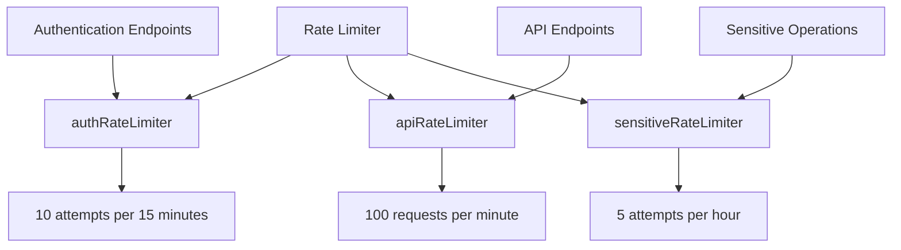
```mermaid
flowchart TD
A[Rate Limiter] --> B[authRateLimiter]
A --> C[apiRateLimiter]
A --> D[sensitiveRateLimiter]
B --> E["10 attempts per 15 minutes"]
C --> F["100 requests per minute"]
D --> G["5 attempts per hour"]
H[Authentication Endpoints] --> B
I[API Endpoints] --> C
J[Sensitive Operations] --> D
```

### Rate Limiting Rules

| Endpoint Group | Rate Limit | Window | Description |
|----------------|------------|--------|-------------|
| Authentication | 10 attempts | 15 minutes | Applies to login, registration, and token refresh |
| API Endpoints | 100 requests | 1 minute | Applies to all authenticated API endpoints |
| Sensitive Operations | 5 attempts | 1 hour | Applies to sensitive operations like KYC submission |

### Rate Limit Headers

When a rate limit is exceeded, the API returns a `429 Too Many Requests` response with the following headers:

- `Retry-After`: Number of seconds to wait before making another request
- `X-RateLimit-Limit`: The maximum number of requests in the rate limit window
- `X-RateLimit-Remaining`: The number of requests remaining in the current window
- `X-RateLimit-Reset`: The time at which the current rate limit window resets

### Rate Limit Response

When the rate limit is exceeded, the API returns:

**HTTP Status**: `429 Too Many Requests`  
**Response Body**:
```json
{
  "error": {
    "code": "RATE_LIMIT_EXCEEDED",
    "message": "Too many requests, please try again later"
  },
  "retryAfter": 45,
  "timestamp": "2023-01-01T00:00:00Z",
  "requestId": "uuid"
}
```

## Client Implementation Examples

This section provides examples of how to implement client-side code for common operations using JavaScript/TypeScript.

### User Login Example

```typescript
async function login(email: string, password: string): Promise<AuthResult> {
  const response = await fetch('/api/auth/login', {
    method: 'POST',
    headers: {
      'Content-Type': 'application/json',
    },
    body: JSON.stringify({ email, password }),
  });

  if (!response.ok) {
    const error = await response.json();
    throw new Error(error.error.message);
  }

  return response.json();
}

// Usage
try {
  const authResult = await login('user@example.com', 'password123');
  // Store tokens for future requests
  localStorage.setItem('accessToken', authResult.accessToken);
  localStorage.setItem('refreshToken', authResult.refreshToken);
} catch (error) {
  console.error('Login failed:', error.message);
}
```

### Project Creation Example

```typescript
async function createProject(projectData: ProjectInput): Promise<Project> {
  const accessToken = localStorage.getItem('accessToken');
  
  const response = await fetch('/api/projects', {
    method: 'POST',
    headers: {
      'Content-Type': 'application/json',
      'Authorization': `Bearer ${accessToken}`,
    },
    body: JSON.stringify(projectData),
  });

  if (!response.ok) {
    const error = await response.json();
    throw new Error(error.error.message);
  }

  return response.json();
}

// Usage
try {
  const newProject = await createProject({
    title: 'Web Development Project',
    description: 'Need a full-stack developer for a React and Node.js application',
    requiredSkills: [{ skillId: 'uuid', yearsOfExperience: 3 }],
    budget: 5000,
    deadline: '2023-12-31T00:00:00Z',
  });
  console.log('Project created:', newProject);
} catch (error) {
  console.error('Project creation failed:', error.message);
}
```

### Proposal Submission Example

```typescript
async function submitProposal(proposalData: ProposalInput): Promise<Proposal> {
  const accessToken = localStorage.getItem('accessToken');
  
  const response = await fetch('/api/proposals', {
    method: 'POST',
    headers: {
      'Content-Type': 'application/json',
      'Authorization': `Bearer ${accessToken}`,
    },
    body: JSON.stringify(proposalData),
  });

  if (!response.ok) {
    const error = await response.json();
    throw new Error(error.error.message);
  }

  return response.json();
}

// Usage
try {
  const proposal = await submitProposal({
    projectId: 'uuid',
    coverLetter: 'I have extensive experience with React and Node.js...',
    proposedRate: 50,
    estimatedDuration: 30,
  });
  console.log('Proposal submitted:', proposal);
} catch (error) {
  console.error('Proposal submission failed:', error.message);
}
```

### Contract Initiation Example

```typescript
async function acceptProposal(proposalId: string): Promise<ContractResult> {
  const accessToken = localStorage.getItem('accessToken');
  
  const response = await fetch(`/api/proposals/${proposalId}/accept`, {
    method: 'POST',
    headers: {
      'Authorization': `Bearer ${accessToken}`,
    },
  });

  if (!response.ok) {
    const error = await response.json();
    throw new Error(error.error.message);
  }

  return response.json();
}

// Usage
try {
  const result = await acceptProposal('proposal-uuid');
  console.log('Contract created:', result.contract);
  console.log('Proposal accepted:', result.proposal);
} catch (error) {
  console.error('Contract initiation failed:', error.message);
}
```

### Payment Release Example

```typescript
async function approveMilestone(milestoneId: string, contractId: string): Promise<MilestoneApprovalResult> {
  const accessToken = localStorage.getItem('accessToken');
  
  const response = await fetch(`/api/payments/milestones/${milestoneId}/approve?contractId=${contractId}`, {
    method: 'POST',
    headers: {
      'Authorization': `Bearer ${accessToken}`,
    },
  });

  if (!response.ok) {
    const error = await response.json();
    throw new Error(error.error.message);
  }

  return response.json();
}

// Usage
try {
  const result = await approveMilestone('milestone-uuid', 'contract-uuid');
  console.log('Payment released:', result.paymentReleased);
  console.log('Transaction hash:', result.transactionHash);
} catch (error) {
  console.error('Payment release failed:', error.message);
}
```

### Handling Authentication Headers

```typescript
// Function to create authenticated API requests
async function apiRequest<T>(url: string, options: RequestInit = {}): Promise<T> {
  // Get access token from storage
  const accessToken = localStorage.getItem('accessToken');
  
  // Add authorization header
  const headers = {
    'Content-Type': 'application/json',
    'Authorization': `Bearer ${accessToken}`,
    ...options.headers,
  };

  const config: RequestInit = {
    ...options,
    headers,
  };

  const response = await fetch(url, config);

  // Handle token expiration
  if (response.status === 401) {
    const error = await response.json();
    if (error.error.code === 'AUTH_TOKEN_EXPIRED') {
      // Try to refresh token
      const refreshed = await refreshTokens();
      if (refreshed) {
        // Retry request with new token
        return apiRequest<T>(url, options);
      } else {
        // Redirect to login
        window.location.href = '/login';
        throw new Error('Authentication required');
      }
    }
  }

  if (!response.ok) {
    const error = await response.json();
    throw new Error(error.error.message);
  }

  return response.json();
}

// Usage
try {
  const projects = await apiRequest<Project[]>('/api/projects');
  console.log('Projects:', projects);
} catch (error) {
  console.error('API request failed:', error.message);
}
```

### Parsing Responses

```typescript
// Generic function to handle API responses
function handleApiResponse<T>(response: Response): Promise<T> {
  return response.json().then(data => {
    // Check for error structure
    if (data.error && data.error.code) {
      throw new Error(data.error.message);
    }
    return data as T;
  });
}

// Usage with fetch
fetch('/api/projects')
  .then(handleApiResponse<Project[]>)
  .then(projects => {
    console.log('Projects:', projects);
  })
  .catch(error => {
    console.error('Failed to fetch projects:', error.message);
  });
```

## Versioning Strategy

The FreelanceXchain API implements a versioning strategy to ensure backward compatibility and smooth transitions between API versions.

### Base URL Versioning

The API uses base URL versioning with the `/api` prefix. This approach provides a clear and consistent way to identify the API version:

```
https://api.freelancexchain.com/api/v1/projects
https://api.freelancexchain.com/api/v1/proposals
```

Currently, the system uses a single version (`/api`) which serves as version 1. Future versions will be implemented as `/api/v2`, `/api/v3`, etc.

### Backward Compatibility

The API maintains backward compatibility through the following practices:

1. **No Breaking Changes in Minor Versions**: Minor version updates (e.g., 1.1, 1.2) only add new features and endpoints without modifying existing ones.

2. **Deprecation Policy**: When an endpoint or field needs to be removed, it is first marked as deprecated with a warning in the response headers:
   ```
   Deprecation: true
   Sunset: Wed, 31 Dec 2023 23:59:59 GMT
   ```

3. **Field Addition**: New optional fields can be added to response objects without breaking existing clients.

4. **Query Parameter Evolution**: New query parameters can be added to existing endpoints without affecting clients that don't use them.

### Migration Path

When a new major version is released, the following migration path is provided:

1. **Parallel Operation**: Both versions operate simultaneously for a minimum of 6 months.

2. **Documentation**: Comprehensive migration guides are provided in the API documentation.

3. **Monitoring**: Usage of deprecated endpoints is monitored to identify clients that need to migrate.

4. **Notification**: Registered developers receive email notifications about upcoming deprecations.

### Example Version Transition

**Version 1 (Current)**:
```
GET /api/projects
Response: { id, title, description, budget, status }
```

**Version 2 (Future)**:
```
GET /api/v2/projects
Response: { id, title, description, budget, status, createdAt, updatedAt }
```

During the transition period:
- `/api/projects` continues to work (v1)
- `/api/v2/projects` is available (v2)
- Both endpoints are documented

---

# Middleware & Interceptors

## Table of Contents
1. [Introduction](#introduction)
2. [Middleware Execution Order](#middleware-execution-order)
3. [Authentication Middleware](#authentication-middleware)
4. [Validation Middleware](#validation-middleware)
5. [Error Handling Middleware](#error-handling-middleware)
6. [Request Logger Middleware](#request-logger-middleware)
7. [Security Middleware](#security-middleware)
8. [Rate Limiter Middleware](#rate-limiter-middleware)
9. [Custom Middleware Creation](#custom-middleware-creation)
10. [Performance Implications](#performance-implications)
11. [Best Practices](#best-practices)

## Introduction
The middleware layer in FreelanceXchain's Express.js application forms a critical component of the request processing pipeline, providing essential functionality for security, validation, error handling, and observability. This document details the role and implementation of each middleware component, their execution order, and how they contribute to the overall reliability and security of the platform. The middleware architecture follows a layered approach, with security and logging middleware applied globally, while authentication, validation, and rate limiting are applied at both global and route-specific levels.

## Middleware Execution Order
The middleware execution order in FreelanceXchain follows a specific sequence to ensure proper request processing and error handling. The order is established in the `app.ts` file, where middleware is applied to the Express application in a deliberate sequence:

1. **Security middleware** - Applied first to ensure all requests are subject to security headers, request ID generation, and HTTPS enforcement
2. **Body parsing middleware** - Processes incoming request bodies before any other middleware needs to access them
3. **CORS middleware** - Handles cross-origin resource sharing policies
4. **Request logging middleware** - Logs incoming requests before processing begins
5. **API routes** - Route-specific middleware and handlers
6. **Error handling middleware** - Applied last to catch and process any errors from previous middleware or route handlers

This execution order ensures that security measures are in place before any processing occurs, request logging captures all incoming requests, and error handling can catch exceptions from any part of the request processing pipeline.

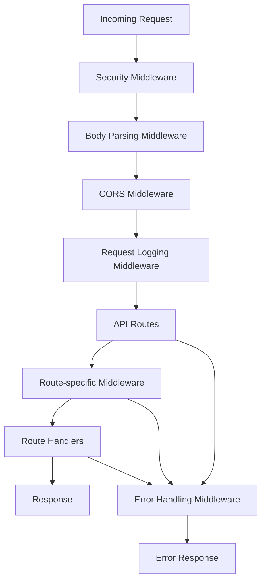
```mermaid
flowchart TD
A[Incoming Request] --> B[Security Middleware]
B --> C[Body Parsing Middleware]
C --> D[CORS Middleware]
D --> E[Request Logging Middleware]
E --> F[API Routes]
F --> G[Route-specific Middleware]
G --> H[Route Handlers]
H --> I[Response]
F --> J[Error Handling Middleware]
G --> J
H --> J
J --> K[Error Response]
```

## Authentication Middleware
The authentication middleware in FreelanceXchain provides JWT verification and role-based access control for protected routes. The middleware consists of two main components: `authMiddleware` for JWT token validation and `requireRole` for role-based access control.

The `authMiddleware` function validates JWT tokens from the Authorization header, checking for proper format and verifying the token's validity through the authentication service. If the token is valid, the user's information is attached to the request object for use by subsequent middleware and route handlers. If the token is invalid or missing, appropriate error responses are returned with standardized error codes.

The `requireRole` function implements role-based access control by checking if the authenticated user has the required role for a specific route. It can be configured to require one or more roles, providing flexible access control for different user types (freelancer, employer, admin).

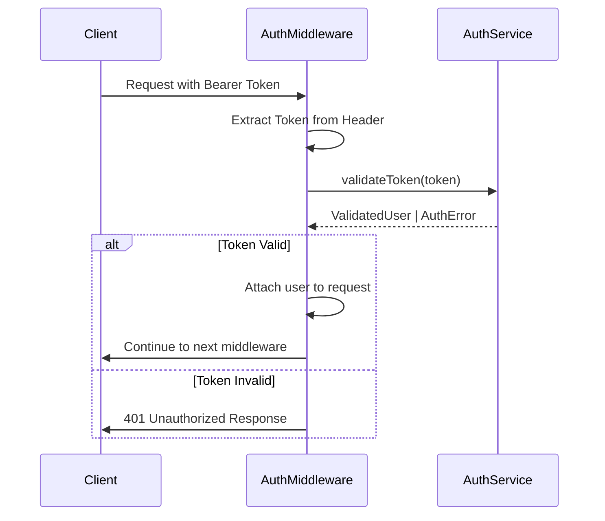
```mermaid
sequenceDiagram
participant Client
participant AuthMiddleware
participant AuthService
Client->>AuthMiddleware : Request with Bearer Token
AuthMiddleware->>AuthMiddleware : Extract Token from Header
AuthMiddleware->>AuthService : validateToken(token)
AuthService-->>AuthMiddleware : ValidatedUser | AuthError
alt Token Valid
AuthMiddleware->>AuthMiddleware : Attach user to request
AuthMiddleware->>Client : Continue to next middleware
else Token Invalid
AuthMiddleware->>Client : 401 Unauthorized Response
end
```

## Validation Middleware
The validation middleware in FreelanceXchain provides comprehensive request schema checking using a custom JSON schema-based validation system. Unlike external libraries like Joi or Zod, the application implements its own validation framework that supports validation of request body, parameters, and query strings against predefined schemas.

The middleware exports a `validate` function that takes a `RequestSchema` object defining the expected structure of the request data. The schema can specify validation rules for strings (min/max length, patterns, formats), numbers (min/max values), arrays (min/max items), and objects (required properties). The validation system also handles type coercion for query parameters, converting string values to appropriate types (numbers, booleans, arrays) based on the schema definition.

The middleware exports numerous predefined schemas for different API endpoints, covering authentication, profile management, project creation, proposal submission, and other functionality. These schemas are organized by feature area and can be imported and used directly in route definitions.

```mermaid
flowchart TD
A[Incoming Request] --> B[Validation Middleware]
B --> C{Validate Body?}
C --> |Yes| D[Validate Body Against Schema]
C --> |No| E{Validate Params?}
D --> E
E --> |Yes| F[Validate Params Against Schema]
E --> |No| G{Validate Query?}
F --> G
G --> |Yes| H[Convert Query Types]
H --> I[Validate Query Against Schema]
G --> |No| J[All Valid?]
I --> J
J --> |Yes| K[Call next() Middleware]
J --> |No| L[Return 400 Response]
```

## Error Handling Middleware
The error handling middleware provides centralized exception processing for the entire application. It catches errors thrown by route handlers and other middleware, standardizing the error response format across the API.

The middleware uses a custom `AppError` class that extends the built-in Error class, adding properties for error code, HTTP status code, and validation details. This allows for consistent error handling and response formatting. The middleware also includes a collection of factory functions for common error types, making it easy to create standardized errors throughout the application.

When an error occurs, the middleware checks if it's an instance of `AppError`. If so, it returns a response with the appropriate status code and error details. For unexpected errors, it logs the error and returns a generic 500 Internal Server Error response to prevent exposing implementation details to clients.

```mermaid
sequenceDiagram
participant RouteHandler
participant ErrorHandler
participant Client
RouteHandler->>ErrorHandler : Throw Error
ErrorHandler->>ErrorHandler : Check if AppError
alt Is AppError
ErrorHandler->>Client : Return Error Response with Code and Details
else Unexpected Error
ErrorHandler->>ErrorHandler : Log Error
ErrorHandler->>Client : Return 500 Response
end
```

## Request Logger Middleware
The request logger middleware generates audit trails for all incoming requests and outgoing responses. It creates structured JSON logs that include request and response details, enabling monitoring, debugging, and security auditing.

The middleware attaches a unique request ID to each request, either using an existing ID from the `X-Request-ID` header or generating a new UUID. This ID is included in both request and response logs, allowing for easy correlation of related log entries. The request log includes the HTTP method, path, query parameters, and timestamp, while the response log includes the status code, duration, and timestamp.

The logging is implemented using Node.js console output with JSON.stringify, creating structured logs that can be easily parsed by log aggregation systems. The middleware uses the `res.on('finish')` event to ensure response logging occurs after the response has been sent to the client.

## Security Middleware
The security middleware implements multiple layers of protection to enhance the application's security posture. It consists of several components that work together to protect against common web vulnerabilities.

The middleware uses Helmet.js to set various HTTP security headers, including Content Security Policy (CSP), XSS filter, HSTS, and others. The CSP is configured to allow content only from trusted sources, preventing XSS attacks. The middleware also includes request ID generation, HTTPS enforcement in production, and CORS configuration with restricted origins.

The security middleware is applied first in the middleware chain to ensure all requests are subject to these security measures before any processing occurs. The CORS configuration includes origin validation with support for wildcard subdomains and development-time warnings for unknown origins.

```mermaid
flowchart TD
A[Incoming Request] --> B[Security Headers]
B --> C[Request ID Middleware]
C --> D[HTTPS Enforcement]
D --> E[CORS Middleware]
E --> F[Next Middleware]
subgraph Security Measures
B --> B1[Content Security Policy]
B --> B2[XSS Filter]
B --> B3[HSTS]
B --> B4[Frameguard]
C --> C1[Request ID Generation]
D --> D1[HTTP to HTTPS Redirect]
E --> E1[Origin Validation]
end
```

## Rate Limiter Middleware
The rate limiter middleware prevents abuse of the API by limiting the number of requests a client can make within a specified time window. It implements a memory-based rate limiting system using a Map to store request counts and reset times for each client.

The middleware provides three preset rate limiters:
- `authRateLimiter`: Limits authentication attempts to 10 per 15 minutes
- `apiRateLimiter`: Limits API requests to 100 per minute
- `sensitiveRateLimiter`: Limits sensitive operations to 5 per hour

The rate limiter identifies clients using the IP address from the `X-Forwarded-For` header (for requests behind proxies) or the direct IP address. When a client exceeds the rate limit, the middleware returns a 429 Too Many Requests response with a Retry-After header indicating when the client can try again.

The rate limiter is applied to authentication routes to prevent brute force attacks and can be applied to other sensitive endpoints as needed.

```mermaid
flowchart TD
A[Incoming Request] --> B[Rate Limiter]
B --> C{Client Exceeds Limit?}
C --> |No| D[Increment Request Count]
D --> E[Call next() Middleware]
C --> |Yes| F[Set Retry-After Header]
F --> G[Return 429 Response]
```

## Custom Middleware Creation
Creating custom middleware in FreelanceXchain follows the standard Express.js middleware pattern. Middleware functions take three parameters: request, response, and next, and can perform any processing before calling next() to continue the middleware chain.

To create custom middleware, developers should:
1. Define a function that accepts Request, Response, and NextFunction parameters
2. Perform the desired processing (validation, logging, transformation, etc.)
3. Call next() to continue the chain, or send a response to terminate it
4. Export the middleware function for use in routes

Custom middleware can be route-specific or added to the global middleware chain in app.ts. The middleware system is designed to be extensible, allowing new middleware to be added without modifying existing code.

## Performance Implications
The middleware chaining in FreelanceXchain has several performance implications that should be considered:

1. **Execution Overhead**: Each middleware function adds processing time to the request-response cycle. The current implementation has minimal overhead as most middleware performs simple operations.

2. **Memory Usage**: The rate limiter stores request counts in memory, which could become significant under high load. For production deployments with high traffic, consider using Redis for distributed rate limiting.

3. **Error Propagation**: The centralized error handling middleware ensures consistent error responses but adds a small overhead for error checking.

4. **Security vs. Performance**: Security middleware like Helmet adds HTTP headers that increase response size slightly but provide significant security benefits.

5. **Validation Performance**: The custom validation system is efficient for typical use cases but could be optimized with schema compilation for frequently accessed endpoints.

The middleware order is optimized to minimize unnecessary processing - security and logging occur early, while more expensive operations like authentication and validation occur only when necessary.

## Best Practices
The middleware implementation in FreelanceXchain follows several best practices for Express.js applications:

1. **Standardized Error Handling**: Use the centralized error handling middleware for all errors to ensure consistent response formats.

2. **Security First**: Apply security middleware at the beginning of the middleware chain to protect all routes.

3. **Reusable Validation Schemas**: Define validation schemas in the validation middleware and reuse them across routes to maintain consistency.

4. **Proper Error Propagation**: Always call next() with errors rather than sending responses directly from middleware unless terminating the request.

5. **Request ID Tracking**: Use the request ID for correlating logs and debugging issues across distributed systems.

6. **Rate Limiting Sensitive Endpoints**: Apply rate limiting to authentication and other sensitive endpoints to prevent abuse.

7. **Minimal Middleware**: Only use necessary middleware for each route to reduce processing overhead.

8. **Clear Separation of Concerns**: Each middleware should have a single responsibility (authentication, validation, logging, etc.).

9. **Consistent Response Formats**: Use standardized response formats for success and error cases across the API.

10. **Development vs. Production**: Configure middleware appropriately for different environments (e.g., CORS warnings in development, strict enforcement in production).

---

# Data Models & ORM Mapping

## Table of Contents
1. [Introduction](#introduction)
2. [Core Data Models](#core-data-models)
3. [Entity-Relationship Diagram](#entity-relationship-diagram)
4. [Model Field Definitions](#model-field-definitions)
5. [Data Validation and Constraints](#data-validation-and-constraints)
6. [Repository Pattern Implementation](#repository-pattern-implementation)
7. [Sample Data Records](#sample-data-records)
8. [Conclusion](#conclusion)

## Introduction
The FreelanceXchain platform implements a comprehensive data model to support its decentralized freelance marketplace. This documentation details the core entities, their relationships, and the ORM mapping between TypeScript models and PostgreSQL schema. The system is built on Supabase, leveraging PostgreSQL for data persistence with Row Level Security (RLS) for access control. The architecture follows a repository pattern, separating data access logic from business logic and providing a clean interface for database operations.

## Core Data Models
The FreelanceXchain platform consists of several interconnected data models that represent the core entities of the freelance marketplace. These models include User, Project, Proposal, Contract, Dispute, KYC, Notification, and supporting entities for skills management. The models are implemented in TypeScript with corresponding PostgreSQL tables, and the system uses a repository pattern to abstract database operations.

The User model serves as the foundation, with role-based access control distinguishing between freelancers, employers, and administrators. Users can have either a FreelancerProfile or EmployerProfile, which contain role-specific information. Projects are created by employers and can receive proposals from freelancers. When a proposal is accepted, a Contract is created, which governs the work relationship and payment terms. The system supports milestone-based payments with escrow functionality, and includes mechanisms for dispute resolution, KYC verification, and notifications.

## Entity-Relationship Diagram
```mermaid
erDiagram
users {
uuid id PK
varchar email UK
varchar password_hash
varchar role
varchar wallet_address
timestamptz created_at
timestamptz updated_at
}
freelancer_profiles {
uuid id PK
uuid user_id FK
text bio
decimal hourly_rate
jsonb skills
jsonb experience
varchar availability
timestamptz created_at
timestamptz updated_at
}
employer_profiles {
uuid id PK
uuid user_id FK
varchar company_name
text description
varchar industry
timestamptz created_at
timestamptz updated_at
}
projects {
uuid id PK
uuid employer_id FK
varchar title
text description
jsonb required_skills
decimal budget
timestamptz deadline
varchar status
jsonb milestones
timestamptz created_at
timestamptz updated_at
}
proposals {
uuid id PK
uuid project_id FK
uuid freelancer_id FK
text cover_letter
decimal proposed_rate
integer estimated_duration
varchar status
timestamptz created_at
timestamptz updated_at
}
contracts {
uuid id PK
uuid project_id FK
uuid proposal_id FK
uuid freelancer_id FK
uuid employer_id FK
varchar escrow_address
decimal total_amount
varchar status
timestamptz created_at
timestamptz updated_at
}
disputes {
uuid id PK
uuid contract_id FK
varchar milestone_id
uuid initiator_id FK
text reason
jsonb evidence
varchar status
jsonb resolution
timestamptz created_at
timestamptz updated_at
}
kyc_verifications {
uuid id PK
uuid user_id FK
varchar status
integer tier
varchar first_name
varchar middle_name
varchar last_name
date date_of_birth
varchar nationality
jsonb address
jsonb documents
jsonb liveness_check
timestamptz submitted_at
timestamptz reviewed_at
timestamptz created_at
timestamptz updated_at
}
notifications {
uuid id PK
uuid user_id FK
varchar type
varchar title
text message
jsonb data
boolean is_read
timestamptz created_at
timestamptz updated_at
}
skills {
uuid id PK
uuid category_id FK
varchar name
text description
boolean is_active
timestamptz created_at
timestamptz updated_at
}
skill_categories {
uuid id PK
varchar name
text description
boolean is_active
timestamptz created_at
timestamptz updated_at
}
reviews {
uuid id PK
uuid contract_id FK
uuid reviewer_id FK
uuid reviewee_id FK
integer rating
text comment
varchar reviewer_role
timestamptz created_at
timestamptz updated_at
}
messages {
uuid id PK
uuid contract_id FK
uuid sender_id FK
text content
boolean is_read
timestamptz created_at
timestamptz updated_at
}
payments {
uuid id PK
uuid contract_id FK
varchar milestone_id
uuid payer_id FK
uuid payee_id FK
decimal amount
varchar currency
varchar tx_hash
varchar status
varchar payment_type
timestamptz created_at
timestamptz updated_at
}
users ||--o{ freelancer_profiles : "1:1"
users ||--o{ employer_profiles : "1:1"
users ||--o{ projects : "1:N"
users ||--o{ proposals : "1:N"
users ||--o{ contracts : "1:N"
users ||--o{ disputes : "1:N"
users ||--o{ kyc_verifications : "1:1"
users ||--o{ notifications : "1:N"
users ||--o{ reviews : "reviewer"
users ||--o{ reviews : "reviewee"
users ||--o{ messages : "sender"
projects ||--o{ proposals : "1:N"
projects ||--o{ contracts : "1:1"
projects ||--o{ disputes : "via contract"
projects ||--o{ messages : "via contract"
projects ||--o{ payments : "via contract"
projects ||--o{ reviews : "via contract"
proposals ||--o{ contracts : "1:1"
contracts ||--o{ disputes : "1:N"
contracts ||--o{ messages : "1:N"
contracts ||--o{ payments : "1:N"
contracts ||--o{ reviews : "1:1"
skill_categories ||--o{ skills : "1:N"
```

## Model Field Definitions
This section details the field definitions for each core model in the FreelanceXchain platform, including data types, relationships, and constraints as implemented in both TypeScript models and PostgreSQL schema.

### User Model
The User model represents platform participants with role-based access control. Users can be freelancers, employers, or administrators.

**Application Model (TypeScript)**
```typescript
type User = {
  id: string;
  email: string;
  passwordHash: string;
  role: 'freelancer' | 'employer' | 'admin';
  walletAddress: string;
  createdAt: string;
  updatedAt: string;
}
```

**Database Schema (PostgreSQL)**
```sql
CREATE TABLE users (
  id UUID PRIMARY KEY DEFAULT uuid_generate_v4(),
  email VARCHAR(255) UNIQUE NOT NULL,
  password_hash VARCHAR(255) NOT NULL,
  role VARCHAR(20) NOT NULL CHECK (role IN ('freelancer', 'employer', 'admin')),
  wallet_address VARCHAR(255) DEFAULT '',
  name VARCHAR(255) DEFAULT '',
  created_at TIMESTAMPTZ DEFAULT NOW(),
  updated_at TIMESTAMPTZ DEFAULT NOW()
);
```

**Relationships**
- One-to-one with FreelancerProfile (user_id reference)
- One-to-one with EmployerProfile (user_id reference)
- One-to-many with Projects (employer_id reference)
- One-to-many with Proposals (freelancer_id reference)
- One-to-many with Contracts (freelancer_id and employer_id references)
- One-to-one with KYCVerification (user_id reference)
- One-to-many with Notifications (user_id reference)

### Project Model
The Project model represents freelance jobs posted by employers, containing details about the work, required skills, budget, and milestones.

**Application Model (TypeScript)**
```typescript
type Project = {
  id: string;
  employerId: string;
  title: string;
  description: string;
  requiredSkills: ProjectSkillReference[];
  budget: number;
  deadline: string;
  status: ProjectStatus;
  milestones: Milestone[];
  createdAt: string;
  updatedAt: string;
}
```

**Database Schema (PostgreSQL)**
```sql
CREATE TABLE projects (
  id UUID PRIMARY KEY DEFAULT uuid_generate_v4(),
  employer_id UUID REFERENCES users(id) ON DELETE CASCADE,
  title VARCHAR(255) NOT NULL,
  description TEXT,
  required_skills JSONB DEFAULT '[]',
  budget DECIMAL(12, 2) DEFAULT 0,
  deadline TIMESTAMPTZ,
  status VARCHAR(20) DEFAULT 'draft' CHECK (status IN ('draft', 'open', 'in_progress', 'completed', 'cancelled')),
  milestones JSONB DEFAULT '[]',
  created_at TIMESTAMPTZ DEFAULT NOW(),
  updated_at TIMESTAMPTZ DEFAULT NOW()
);
```

**Relationships**
- Many-to-one with User (employer_id reference)
- One-to-many with Proposals (project_id reference)
- One-to-one with Contract (project_id reference)
- One-to-many with Disputes (via contract)
- One-to-many with Messages (via contract)
- One-to-many with Payments (via contract)
- One-to-many with Reviews (via contract)

### Proposal Model
The Proposal model represents a freelancer's bid on a project, including their cover letter, proposed rate, and estimated duration.

**Application Model (TypeScript)**
```typescript
type Proposal = {
  id: string;
  projectId: string;
  freelancerId: string;
  coverLetter: string;
  proposedRate: number;
  estimatedDuration: number;
  status: ProposalStatus;
  createdAt: string;
  updatedAt: string;
}
```

**Database Schema (PostgreSQL)**
```sql
CREATE TABLE proposals (
  id UUID PRIMARY KEY DEFAULT uuid_generate_v4(),
  project_id UUID REFERENCES projects(id) ON DELETE CASCADE,
  freelancer_id UUID REFERENCES users(id) ON DELETE CASCADE,
  cover_letter TEXT,
  proposed_rate DECIMAL(10, 2) DEFAULT 0,
  estimated_duration INTEGER DEFAULT 0,
  status VARCHAR(20) DEFAULT 'pending' CHECK (status IN ('pending', 'accepted', 'rejected', 'withdrawn')),
  created_at TIMESTAMPTZ DEFAULT NOW(),
  updated_at TIMESTAMPTZ DEFAULT NOW(),
  UNIQUE(project_id, freelancer_id)
);
```

**Relationships**
- Many-to-one with Project (project_id reference)
- Many-to-one with User (freelancer_id reference)
- One-to-one with Contract (proposal_id reference)

### Contract Model
The Contract model represents an agreement between a freelancer and employer for a specific project, including escrow details and payment terms.

**Application Model (TypeScript)**
```typescript
type Contract = {
  id: string;
  projectId: string;
  proposalId: string;
  freelancerId: string;
  employerId: string;
  escrowAddress: string;
  totalAmount: number;
  status: ContractStatus;
  createdAt: string;
  updatedAt: string;
}
```

**Database Schema (PostgreSQL)**
```sql
CREATE TABLE contracts (
  id UUID PRIMARY KEY DEFAULT uuid_generate_v4(),
  project_id UUID REFERENCES projects(id) ON DELETE CASCADE,
  proposal_id UUID REFERENCES proposals(id) ON DELETE CASCADE,
  freelancer_id UUID REFERENCES users(id) ON DELETE CASCADE,
  employer_id UUID REFERENCES users(id) ON DELETE CASCADE,
  escrow_address VARCHAR(255),
  total_amount DECIMAL(12, 2) DEFAULT 0,
  status VARCHAR(20) DEFAULT 'active' CHECK (status IN ('active', 'completed', 'disputed', 'cancelled')),
  created_at TIMESTAMPTZ DEFAULT NOW(),
  updated_at TIMESTAMPTZ DEFAULT NOW()
);
```

**Relationships**
- Many-to-one with Project (project_id reference)
- Many-to-one with Proposal (proposal_id reference)
- Many-to-one with User (freelancer_id and employer_id references)
- One-to-many with Disputes (contract_id reference)
- One-to-many with Messages (contract_id reference)
- One-to-many with Payments (contract_id reference)
- One-to-one with Reviews (contract_id reference)

### Dispute Model
The Dispute model handles conflict resolution between parties, with evidence submission and resolution tracking.

**Application Model (TypeScript)**
```typescript
type Dispute = {
  id: string;
  contractId: string;
  milestoneId: string;
  initiatorId: string;
  reason: string;
  evidence: Evidence[];
  status: DisputeStatus;
  resolution: DisputeResolution | null;
  createdAt: string;
  updatedAt: string;
}
```

**Database Schema (PostgreSQL)**
```sql
CREATE TABLE disputes (
  id UUID PRIMARY KEY DEFAULT uuid_generate_v4(),
  contract_id UUID REFERENCES contracts(id) ON DELETE CASCADE,
  milestone_id VARCHAR(255),
  initiator_id UUID REFERENCES users(id) ON DELETE CASCADE,
  reason TEXT,
  evidence JSONB DEFAULT '[]',
  status VARCHAR(20) DEFAULT 'open' CHECK (status IN ('open', 'under_review', 'resolved')),
  resolution JSONB,
  created_at TIMESTAMPTZ DEFAULT NOW(),
  updated_at TIMESTAMPTZ DEFAULT NOW()
);
```

**Relationships**
- Many-to-one with Contract (contract_id reference)
- Many-to-one with User (initiator_id reference)

### KYC Model
The KYC model manages identity verification for users, supporting tiered verification levels with document submission and liveness checks.

**Application Model (TypeScript)**
```typescript
type KycVerification = {
  id: string;
  userId: string;
  status: KycStatus;
  tier: KycTier;
  firstName: string;
  middleName?: string;
  lastName: string;
  dateOfBirth: string;
  nationality: string;
  address: InternationalAddress;
  documents: KycDocument[];
  livenessCheck?: LivenessCheck;
  submittedAt?: string;
  reviewedAt?: string;
  rejectionReason?: string;
  createdAt: string;
  updatedAt: string;
}
```

**Database Schema (PostgreSQL)**
```sql
CREATE TABLE kyc_verifications (
  id UUID PRIMARY KEY DEFAULT uuid_generate_v4(),
  user_id UUID REFERENCES users(id) ON DELETE CASCADE,
  status VARCHAR(20) DEFAULT 'pending' CHECK (status IN ('pending', 'submitted', 'under_review', 'approved', 'rejected')),
  tier INTEGER DEFAULT 1,
  first_name VARCHAR(255),
  middle_name VARCHAR(255),
  last_name VARCHAR(255),
  date_of_birth DATE,
  nationality VARCHAR(100),
  address JSONB DEFAULT '{}',
  documents JSONB DEFAULT '[]',
  liveness_check JSONB,
  submitted_at TIMESTAMPTZ,
  reviewed_at TIMESTAMPTZ,
  rejection_reason TEXT,
  created_at TIMESTAMPTZ DEFAULT NOW(),
  updated_at TIMESTAMPTZ DEFAULT NOW()
);
```

**Relationships**
- One-to-one with User (user_id reference)

### Notification Model
The Notification model handles system messages and alerts for users, supporting various notification types.

**Application Model (TypeScript)**
```typescript
type Notification = {
  id: string;
  userId: string;
  type: NotificationType;
  title: string;
  message: string;
  data: Record<string, unknown>;
  isRead: boolean;
  createdAt: string;
}
```

**Database Schema (PostgreSQL)**
```sql
CREATE TABLE notifications (
  id UUID PRIMARY KEY DEFAULT uuid_generate_v4(),
  user_id UUID REFERENCES users(id) ON DELETE CASCADE,
  type VARCHAR(50) NOT NULL,
  title VARCHAR(255) NOT NULL,
  message TEXT,
  data JSONB DEFAULT '{}',
  is_read BOOLEAN DEFAULT false,
  created_at TIMESTAMPTZ DEFAULT NOW(),
  updated_at TIMESTAMPTZ DEFAULT NOW()
);
```

**Relationships**
- Many-to-one with User (user_id reference)

## Data Validation and Constraints
The FreelanceXchain platform implements comprehensive data validation and constraints at both the application and database levels to ensure data integrity and consistency.

### Primary and Foreign Keys
The system uses UUIDs as primary keys for all entities, generated using PostgreSQL's uuid_generate_v4() function. Foreign key constraints are implemented with ON DELETE CASCADE to maintain referential integrity. For example, when a user is deleted, their associated profiles, projects, proposals, and other related records are automatically removed.

### Check Constraints
Several tables implement check constraints to enforce valid data values:
- Users table: role must be 'freelancer', 'employer', or 'admin'
- Projects table: status must be 'draft', 'open', 'in_progress', 'completed', or 'cancelled'
- Proposals table: status must be 'pending', 'accepted', 'rejected', or 'withdrawn'
- Contracts table: status must be 'active', 'completed', 'disputed', or 'cancelled'
- Disputes table: status must be 'open', 'under_review', or 'resolved'
- KYC verifications table: status must be 'pending', 'submitted', 'under_review', 'approved', or 'rejected'

### Unique Constraints
Unique constraints are implemented to prevent duplicate records:
- Users table: email must be unique
- FreelancerProfiles table: user_id must be unique (one profile per freelancer)
- EmployerProfiles table: user_id must be unique (one profile per employer)
- Proposals table: combination of project_id and freelancer_id must be unique (one proposal per freelancer per project)

### Indexes for Query Performance
The system includes numerous indexes to optimize query performance:
- Indexes on foreign key columns (user_id, project_id, contract_id, etc.)
- Indexes on frequently queried fields (email, status, is_read)
- Composite indexes for common query patterns
- These indexes ensure efficient retrieval of data for user profiles, project listings, contract histories, and notification feeds.

## Repository Pattern Implementation
The FreelanceXchain platform implements a repository pattern to abstract database operations and provide a clean interface between the application logic and data persistence layer.

### Base Repository
The BaseRepository class provides common CRUD operations and pagination functionality that are inherited by specific repository implementations. It handles connection management, error handling, and common query patterns.

```typescript
export class BaseRepository<T extends BaseEntity> {
  protected tableName: TableName;
  protected client: SupabaseClient | null = null;

  constructor(tableName: TableName) {
    this.tableName = tableName;
  }

  async create(item: Omit<T, 'created_at' | 'updated_at'>): Promise<T> { /* implementation */ }
  async getById(id: string): Promise<T | null> { /* implementation */ }
  async update(id: string, updates: Partial<T>): Promise<T | null> { /* implementation */ }
  async delete(id: string): Promise<boolean> { /* implementation */ }
  async queryPaginated(options?: QueryOptions): Promise<PaginatedResult<T>> { /* implementation */ }
}
```

### Specific Repository Implementations
Each entity has a dedicated repository class that extends the BaseRepository and provides entity-specific methods:

- UserRepository: getUserByEmail, emailExists
- ProjectRepository: getProjectsByEmployer, getAllOpenProjects, searchProjects
- ContractRepository: getContractsByFreelancer, getContractsByEmployer, getUserContracts
- DisputeRepository: getDisputesByContract, getDisputesByStatus
- NotificationRepository: getUnreadNotificationsByUser, markAllAsRead, getUnreadCount

### Entity Mapping
The system uses an entity mapper to convert between database entities (snake_case) and application models (camelCase). This separation allows the application to use idiomatic TypeScript naming conventions while maintaining compatibility with the PostgreSQL schema.

```typescript
export function mapUserFromEntity(entity: UserEntity): User {
  return {
    id: entity.id,
    email: entity.email,
    passwordHash: entity.password_hash,
    role: entity.role,
    walletAddress: entity.wallet_address,
    createdAt: entity.created_at,
    updatedAt: entity.updated_at,
  };
}
```

The repository pattern provides several benefits:
- Separation of concerns between data access and business logic
- Testability through dependency injection
- Consistent error handling and logging
- Reusable query patterns and pagination
- Type safety through TypeScript generics

## Sample Data Records
This section provides sample data records for each core model to demonstrate practical usage and illustrate the structure of the data.

### Sample User Record
```json
{
  "id": "a1b2c3d4-e5f6-7890-g1h2-i3j4k5l6m7n8",
  "email": "john.doe@example.com",
  "passwordHash": "$2b$10$abcdefghijklmnopqrstuvwxyz1234567890",
  "role": "freelancer",
  "walletAddress": "0x1234567890abcdef1234567890abcdef12345678",
  "createdAt": "2023-01-15T10:30:00.000Z",
  "updatedAt": "2023-01-15T10:30:00.000Z"
}
```

### Sample Project Record
```json
{
  "id": "b2c3d4e5-f6g7-8901-h2i3-j4k5l6m7n8o9",
  "employerId": "a1b2c3d4-e5f6-7890-g1h2-i3j4k5l6m7n8",
  "title": "Develop React Frontend for E-commerce Platform",
  "description": "Create a responsive React frontend for an e-commerce platform with product listings, shopping cart, and checkout functionality.",
  "requiredSkills": [
    {
      "skillId": "c3d4e5f6-g7h8-9012-i3j4-k5l6m7n8o9p0",
      "skillName": "React",
      "categoryId": "d4e5f6g7-h8i9-0123-j4k5-l6m7n8o9p0q1"
    },
    {
      "skillId": "e5f6g7h8-i9j0-1234-k5l6-m7n8o9p0q1r2",
      "skillName": "TypeScript",
      "categoryId": "d4e5f6g7-h8i9-0123-j4k5-l6m7n8o9p0q1"
    }
  ],
  "budget": 5000,
  "deadline": "2023-04-15T00:00:00.000Z",
  "status": "open",
  "milestones": [
    {
      "id": "f6g7h8i9-j0k1-2345-l6m7-n8o9p0q1r2s3",
      "title": "Design and Setup",
      "description": "Complete UI/UX design and project setup",
      "amount": 1000,
      "dueDate": "2023-02-15T00:00:00.000Z",
      "status": "pending"
    },
    {
      "id": "g7h8i9j0-k1l2-3456-m7n8-o9p0q1r2s3t4",
      "title": "Core Functionality",
      "description": "Implement product listings and shopping cart",
      "amount": 2500,
      "dueDate": "2023-03-15T00:00:00.000Z",
      "status": "pending"
    },
    {
      "id": "h8i9j0k1-l2m3-4567-n8o9-p0q1r2s3t4u5",
      "title": "Checkout and Testing",
      "description": "Implement checkout process and conduct testing",
      "amount": 1500,
      "dueDate": "2023-04-15T00:00:00.000Z",
      "status": "pending"
    }
  ],
  "createdAt": "2023-01-15T11:00:00.000Z",
  "updatedAt": "2023-01-15T11:00:00.000Z"
}
```

### Sample Proposal Record
```json
{
  "id": "c3d4e5f6-g7h8-9012-i3j4-k5l6m7n8o9p0",
  "projectId": "b2c3d4e5-f6g7-8901-h2i3-j4k5l6m7n8o9",
  "freelancerId": "a1b2c3d4-e5f6-7890-g1h2-i3j4k5l6m7n8",
  "coverLetter": "Dear Employer, I'm excited to apply for this React development project. With 5 years of experience in React and TypeScript, I've built several e-commerce platforms with similar requirements...",
  "proposedRate": 4500,
  "estimatedDuration": 90,
  "status": "pending",
  "createdAt": "2023-01-16T09:30:00.000Z",
  "updatedAt": "2023-01-16T09:30:00.000Z"
}
```

### Sample Contract Record
```json
{
  "id": "d4e5f6g7-h8i9-0123-j4k5-l6m7n8o9p0q1",
  "projectId": "b2c3d4e5-f6g7-8901-h2i3-j4k5l6m7n8o9",
  "proposalId": "c3d4e5f6-g7h8-9012-i3j4-k5l6m7n8o9p0",
  "freelancerId": "a1b2c3d4-e5f6-7890-g1h2-i3j4k5l6m7n8",
  "employerId": "a1b2c3d4-e5f6-7890-g1h2-i3j4k5l6m7n8",
  "escrowAddress": "0x8765432109876543210987654321098765432109",
  "totalAmount": 4500,
  "status": "active",
  "createdAt": "2023-01-17T14:00:00.000Z",
  "updatedAt": "2023-01-17T14:00:00.000Z"
}
```

### Sample Dispute Record
```json
{
  "id": "e5f6g7h8-i9j0-1234-k5l6-m7n8o9p0q1r2",
  "contractId": "d4e5f6g7-h8i9-0123-j4k5-l6m7n8o9p0q1",
  "milestoneId": "g7h8i9j0-k1l2-3456-m7n8-o9p0q1r2s3t4",
  "initiatorId": "a1b2c3d4-e5f6-7890-g1h2-i3j4k5l6m7n8",
  "reason": "The freelancer has not delivered the core functionality by the agreed deadline despite multiple reminders.",
  "evidence": [
    {
      "id": "f6g7h8i9-j0k1-2345-l6m7-n8o9p0q1r2s3",
      "submitterId": "a1b2c3d4-e5f6-7890-g1h2-i3j4k5l6m7n8",
      "type": "link",
      "content": "https://github.com/example/project/commits",
      "submittedAt": "2023-03-20T10:00:00.000Z"
    },
    {
      "id": "g7h8i9j0-k1l2-3456-m7n8-o9p0q1r2s3t4",
      "submitterId": "a1b2c3d4-e5f6-7890-g1h2-i3j4k5l6m7n8",
      "type": "text",
      "content": "Email thread showing communication with the freelancer about the delayed delivery.",
      "submittedAt": "2023-03-20T10:05:00.000Z"
    }
  ],
  "status": "open",
  "resolution": null,
  "createdAt": "2023-03-20T10:00:00.000Z",
  "updatedAt": "2023-03-20T10:00:00.000Z"
}
```

### Sample KYC Verification Record
```json
{
  "id": "f6g7h8i9-j0k1-2345-l6m7-n8o9p0q1r2s3",
  "userId": "a1b2c3d4-e5f6-7890-g1h2-i3j4k5l6m7n8",
  "status": "approved",
  "tier": "standard",
  "firstName": "John",
  "middleName": "Michael",
  "lastName": "Doe",
  "dateOfBirth": "1990-05-15",
  "nationality": "US",
  "address": {
    "addressLine1": "123 Main Street",
    "city": "New York",
    "stateProvince": "NY",
    "postalCode": "10001",
    "country": "United States",
    "countryCode": "US"
  },
  "documents": [
    {
      "id": "g7h8i9j0-k1l2-3456-m7n8-o9p0q1r2s3t4",
      "type": "passport",
      "documentNumber": "P12345678",
      "issuingCountry": "US",
      "issueDate": "2020-01-15",
      "expiryDate": "2030-01-15",
      "frontImageUrl": "https://example.com/images/passport-front.jpg",
      "verificationStatus": "verified",
      "uploadedAt": "2023-01-10T08:00:00.000Z"
    }
  ],
  "livenessCheck": {
    "id": "h8i9j0k1-l2m3-4567-n8o9-p0q1r2s3t4u5",
    "sessionId": "sess_1234567890",
    "status": "passed",
    "confidenceScore": 0.95,
    "challenges": [
      {
        "type": "blink",
        "completed": true,
        "timestamp": "2023-01-10T08:05:00.000Z"
      },
      {
        "type": "smile",
        "completed": true,
        "timestamp": "2023-01-10T08:05:05.000Z"
      }
    ],
    "capturedFrames": [
      "https://example.com/images/frame1.jpg",
      "https://example.com/images/frame2.jpg"
    ],
    "completedAt": "2023-01-10T08:05:10.000Z",
    "expiresAt": "2024-01-10T08:05:10.000Z",
    "createdAt": "2023-01-10T08:05:00.000Z"
  },
  "submittedAt": "2023-01-10T08:00:00.000Z",
  "reviewedAt": "2023-01-11T09:30:00.000Z",
  "createdAt": "2023-01-10T08:00:00.000Z",
  "updatedAt": "2023-01-11T09:30:00.000Z"
}
```

### Sample Notification Record
```json
{
  "id": "g7h8i9j0-k1l2-3456-m7n8-o9p0q1r2s3t4",
  "userId": "a1b2c3d4-e5f6-7890-g1h2-i3j4k5l6m7n8",
  "type": "proposal_received",
  "title": "New Proposal for Your Project",
  "message": "You have received a new proposal from Jane Smith for your project 'Develop React Frontend for E-commerce Platform'.",
  "data": {
    "projectId": "b2c3d4e5-f6g7-8901-h2i3-j4k5l6m7n8o9",
    "proposalId": "c3d4e5f6-g7h8-9012-i3j4-k5l6m7n8o9p0",
    "freelancerId": "b2c3d4e5-f6g7-8901-h2i3-j4k5l6m7n8o9",
    "proposedRate": 4500
  },
  "isRead": false,
  "createdAt": "2023-01-16T09:30:00.000Z"
}
```

## Conclusion
The FreelanceXchain platform features a robust and well-structured data model that supports a comprehensive freelance marketplace with role-based access, project management, contract execution, dispute resolution, and identity verification. The system effectively combines TypeScript models with PostgreSQL schema to ensure data integrity and performance, while the repository pattern provides a clean abstraction layer for database operations.

Key strengths of the data model include:
- Comprehensive entity relationships that accurately represent the freelance marketplace ecosystem
- Strong data validation and constraints at both application and database levels
- Efficient indexing strategy for optimal query performance
- Clear separation between database entities (snake_case) and application models (camelCase)
- Extensible design that supports future enhancements

The implementation demonstrates best practices in data modeling, with attention to data integrity, security (through RLS), and performance. The repository pattern enables maintainable and testable code, while the entity mapper facilitates seamless conversion between different data representations. This architecture provides a solid foundation for the platform's core functionality and future growth.

---

# Business Logic Layer

## Table of Contents
1. [Introduction](#introduction)
2. [Service Layer Architecture](#service-layer-architecture)
3. [Authentication Service](#authentication-service)
4. [Project Management Service](#project-management-service)
5. [Proposal Handling Service](#proposal-handling-service)
6. [Contract Service](#contract-service)
7. [Payment Processing Service](#payment-processing-service)
8. [Dispute Resolution Service](#dispute-resolution-service)
9. [Reputation Management Service](#reputation-management-service)
10. [KYC Verification Service](#kyc-verification-service)
11. [AI Matching Service](#ai-matching-service)
12. [Notification Service](#notification-service)
13. [Blockchain Integration Services](#blockchain-integration-services)
14. [Service Orchestration and Workflows](#service-orchestration-and-workflows)
15. [Error Handling and Validation](#error-handling-and-validation)
16. [Conclusion](#conclusion)

## Introduction
The FreelanceXchain business logic layer implements a comprehensive Service Layer pattern that encapsulates domain-specific logic for managing freelance marketplace operations. This documentation provides a detailed analysis of the service architecture, focusing on how each service class handles specific domain concerns including authentication, project management, proposal handling, contract execution, payment processing, dispute resolution, reputation management, AI matching, notifications, and KYC verification. The services coordinate between API routes, data repositories, and external systems such as blockchain clients and AI services, creating a robust and scalable architecture for the platform.

## Service Layer Architecture
The business logic layer follows a clean, modular Service Layer pattern where each service class is responsible for a specific domain area. Services are designed with clear interfaces that expose methods for business operations, returning standardized result types that include success status and either data or error information. This pattern ensures separation of concerns, making the codebase maintainable and testable. Services coordinate with API routes through controllers, interact with data repositories for persistence, and integrate with external systems like blockchain clients and AI services for enhanced functionality.

```mermaid
graph TD
A[API Routes] --> B[Service Layer]
B --> C[Data Repositories]
B --> D[Blockchain Clients]
B --> E[AI Services]
B --> F[External Systems]
C --> G[Database]
D --> H[Blockchain Network]
E --> I[LLM API]
subgraph "Service Layer"
B1[Authentication Service]
B2[Project Service]
B3[Proposal Service]
B4[Contract Service]
B5[Payment Service]
B6[Dispute Service]
B7[Reputation Service]
B8[KYC Service]
B9[Matching Service]
B10[Notification Service]
end
B --> B1
B --> B2
B --> B3
B --> B4
B --> B5
B --> B6
B --> B7
B --> B8
B --> B9
B --> B10
```

## Authentication Service
The authentication service handles user registration, login, token management, and OAuth integration. It validates credentials against Supabase Auth and maintains user profiles in the public.users table. The service implements password strength requirements and handles email verification workflows. For OAuth users, it facilitates role selection and wallet address association during registration. The service returns standardized AuthResult objects containing user information and tokens, or AuthError objects when operations fail.

## Project Management Service
The project service manages the lifecycle of freelance projects, from creation to deletion. It validates project inputs, ensures skill requirements reference active skills, and enforces business rules such as preventing modifications to projects with accepted proposals. The service supports milestone management, requiring that milestone amounts sum to the total project budget. It provides comprehensive search and filtering capabilities, allowing users to find projects by keyword, skills, budget range, and status. The service returns ProjectServiceResult objects that encapsulate operation outcomes.

## Proposal Handling Service
The proposal service manages the submission, acceptance, and rejection of proposals for freelance projects. It prevents duplicate proposals and ensures only employers can accept or reject proposals for their projects. When a proposal is accepted, the service creates a contract, updates the project status to "in_progress", and triggers blockchain operations to create and sign the agreement. The service returns ProposalServiceResult objects and includes notification data to inform users of proposal status changes.

## Contract Service
The contract service provides operations for retrieving and updating contract information. It implements strict status transition rules, preventing invalid state changes (e.g., cannot transition from "completed" to any other status). The service manages the relationship between contracts and their associated proposals, projects, and users. It returns ContractServiceResult objects and supports pagination for retrieving user contracts. The service acts as an intermediary between business operations and the underlying data persistence layer.

## Payment Processing Service
The payment service handles milestone-based payment workflows, including completion requests, approvals, disputes, and contract completion. It coordinates with the escrow contract service to release payments and with the milestone registry to record completion events on-chain. The service implements idempotency considerations and transaction management, ensuring consistent state across database and blockchain systems. It provides detailed payment status information and supports the complete lifecycle of milestone payments from request to final settlement.

```mermaid
sequenceDiagram
participant Freelancer
participant PaymentService
participant EscrowContract
participant Blockchain
participant Employer
Freelancer->>PaymentService : requestMilestoneCompletion()
PaymentService->>PaymentService : Validate milestone status
PaymentService->>Blockchain : submitMilestoneToRegistry()
PaymentService->>Employer : notifyMilestoneSubmitted()
PaymentService-->>Freelancer : Milestone submitted
Employer->>PaymentService : approveMilestone()
PaymentService->>EscrowContract : releaseMilestone()
EscrowContract->>Blockchain : Execute payment transaction
Blockchain-->>EscrowContract : Transaction receipt
EscrowContract-->>PaymentService : Payment released
PaymentService->>Blockchain : approveMilestoneOnRegistry()
PaymentService->>Freelancer : notifyMilestoneApproved()
PaymentService->>Freelancer : notifyPaymentReleased()
PaymentService-->>Employer : Approval confirmed
```

## Dispute Resolution Service
The dispute service manages the creation, evidence submission, and resolution of disputes related to project milestones. It enforces business rules such as preventing disputes on approved milestones and ensuring only contract parties can initiate disputes. When a dispute is resolved, the service coordinates with the escrow contract to release or refund funds based on the resolution decision. The service records all dispute activities on-chain for transparency and immutability. It returns DisputeServiceResult objects and supports admin operations for dispute resolution.

## Reputation Management Service
The reputation service handles the submission and retrieval of ratings for completed contracts. It validates ratings (1-5 scale), prevents self-rating, and checks for duplicate ratings. The service computes reputation scores using time-decayed weighting, giving more recent ratings higher influence. It integrates with the blockchain to store ratings immutably and provides work history functionality that shows a user's completed contracts and received ratings. The service returns ReputationServiceResult objects and supports serialization/deserialization of reputation records.

## KYC Verification Service
The KYC service manages the identity verification process for platform users. It supports document verification, liveness checks, and face matching to ensure user identities are authentic. The service integrates with blockchain to record verification status and supports tiered verification levels based on country requirements. It provides functionality for administrators to review and approve/reject KYC submissions. The service validates country-specific requirements and ensures compliance with regulatory standards.

## AI Matching Service
The AI matching service provides skill-based recommendations between freelancers and projects. It uses AI-powered analysis when available, falling back to keyword matching when AI services are unavailable. The service calculates match scores based on skill relevance and can analyze skill gaps to recommend development areas for freelancers. It supports both project recommendations for freelancers and freelancer recommendations for projects, with the latter incorporating reputation scores into the ranking algorithm.

## Notification Service
The notification service manages user notifications for various platform events. It supports different notification types such as proposal submissions, milestone updates, and dispute resolutions. The service provides CRUD operations for notifications with pagination support and allows users to mark notifications as read individually or in bulk. It includes helper functions for creating specific notification types with appropriate messaging and data payloads.

## Blockchain Integration Services
The blockchain integration services provide a bridge between the application and blockchain networks. The blockchain client handles transaction submission, status polling, and serialization. The escrow contract service manages fund holding and release for project milestones. The agreement contract service stores contract terms and signatures on-chain for immutability. The reputation contract service records ratings on-chain, and the dispute registry maintains dispute records. These services simulate blockchain interactions in development and connect to real networks in production.

```mermaid
classDiagram
class BlockchainClient {
+submitTransaction()
+pollTransactionStatus()
+serializeTransaction()
+deserializeTransaction()
}
class EscrowContract {
+deployEscrow()
+depositToEscrow()
+releaseMilestone()
+refundMilestone()
}
class AgreementContract {
+createAgreementOnBlockchain()
+signAgreement()
+completeAgreement()
+disputeAgreement()
}
class ReputationContract {
+submitRatingToBlockchain()
+getRatingsFromBlockchain()
+computeAggregateScore()
}
class DisputeRegistry {
+createDisputeOnBlockchain()
+updateDisputeEvidence()
+resolveDisputeOnBlockchain()
}
BlockchainClient <|-- EscrowContract
BlockchainClient <|-- AgreementContract
BlockchainClient <|-- ReputationContract
BlockchainClient <|-- DisputeRegistry
EscrowContract --> AgreementContract
EscrowContract --> ReputationContract
```

## Service Orchestration and Workflows
Services in FreelanceXchain are orchestrated to handle complex workflows that span multiple domains. The most critical workflow is the project-to-contract conversion, which involves coordination between the proposal service, contract service, payment service, and blockchain integration services. When a proposal is accepted, multiple services are invoked in sequence to create the contract, deploy the escrow, initialize payment processing, and update related entities. This orchestration ensures data consistency and provides a seamless user experience.

```mermaid
flowchart TD
A[Proposal Accepted] --> B[Create Contract]
B --> C[Deploy Escrow Contract]
C --> D[Initialize Payment Service]
D --> E[Update Project Status]
E --> F[Create Blockchain Agreement]
F --> G[Sign Agreement]
G --> H[Notify Parties]
H --> I[Workflow Complete]
style A fill:#f9f,stroke:#333
style I fill:#bbf,stroke:#333
```

## Error Handling and Validation
The service layer implements comprehensive error handling and validation strategies. Each service returns standardized result types that include success status and either data or error information. Validation occurs at multiple levels, including input validation, business rule validation, and authorization checks. Services use specific error codes and messages to communicate failure reasons to clients. The architecture supports transaction management, ensuring data consistency across operations, and implements idempotency considerations for critical operations to prevent duplicate processing.

## Conclusion
The business logic layer of FreelanceXchain demonstrates a well-structured Service Layer pattern implementation that effectively encapsulates domain logic for a complex freelance marketplace. Each service class has clear responsibilities and interfaces, enabling maintainability and testability. The architecture successfully coordinates between API routes, data repositories, and external systems like blockchain clients and AI services. Key workflows such as project-to-contract conversion are properly orchestrated, with appropriate transaction management and error handling. The service layer provides a robust foundation for the platform's core functionality while maintaining flexibility for future enhancements.

---

# Database Schema Design

## Table of Contents
1. [Introduction](#introduction)
2. [Core Tables](#core-tables)
3. [Entity-Relationship Diagram](#entity-relationship-diagram)
4. [Indexing Strategy](#indexing-strategy)
5. [Row Level Security Policies](#row-level-security-policies)
6. [Data Seeding Process](#data-seeding-process)
7. [Database Performance Considerations](#database-performance-considerations)
8. [Conclusion](#conclusion)

## Introduction

The FreelanceXchain platform utilizes a Supabase PostgreSQL database to store all application data, providing a robust foundation for the blockchain-based freelance marketplace. The database schema is designed to support key features including user management, project lifecycle, contract execution, payment processing, and dispute resolution. This document provides comprehensive documentation of the database schema, detailing all tables, their relationships, indexing strategy, security policies, and performance considerations.

The schema implements a relational model with UUID primary keys for all tables, ensuring global uniqueness and preventing enumeration attacks. JSONB columns are strategically used for flexible data storage where schema flexibility is required, such as storing skills, experience, and milestone data. Row Level Security (RLS) is enabled on all tables to enforce data access controls based on user roles and ownership, providing a secure multi-tenant environment.

## Core Tables

### Users Table
The `users` table serves as the central identity management system for the platform, storing core user information and authentication data. Each user is assigned a role that determines their permissions and access to platform features.

**Table: users**
| Column | Type | Constraints | Description |
|-------|------|-------------|-------------|
| id | UUID | PRIMARY KEY, DEFAULT uuid_generate_v4() | Unique identifier for the user |
| email | VARCHAR(255) | UNIQUE, NOT NULL | User's email address used for authentication |
| password_hash | VARCHAR(255) | NOT NULL | Hashed password for secure authentication |
| role | VARCHAR(20) | NOT NULL, CHECK constraint | User role: freelancer, employer, or admin |
| wallet_address | VARCHAR(255) | DEFAULT '' | Blockchain wallet address for transactions |
| name | VARCHAR(255) | DEFAULT '' | User's display name |
| created_at | TIMESTAMPTZ | DEFAULT NOW() | Timestamp of record creation |
| updated_at | TIMESTAMPTZ | DEFAULT NOW() | Timestamp of last record update |

### Skill Categories and Skills Tables
The `skill_categories` and `skills` tables form a hierarchical taxonomy of professional skills, enabling AI-powered matching between freelancers and projects. This two-level hierarchy allows for organized skill classification while maintaining flexibility for future expansion.

**Table: skill_categories**
| Column | Type | Constraints | Description |
|-------|------|-------------|-------------|
| id | UUID | PRIMARY KEY, DEFAULT uuid_generate_v4() | Unique identifier for the category |
| name | VARCHAR(255) | NOT NULL | Name of the skill category |
| description | TEXT | | Detailed description of the category |
| is_active | BOOLEAN | DEFAULT true | Flag indicating if category is active |
| created_at | TIMESTAMPTZ | DEFAULT NOW() | Timestamp of record creation |
| updated_at | TIMESTAMPTZ | DEFAULT NOW() | Timestamp of last record update |

**Table: skills**
| Column | Type | Constraints | Description |
|-------|------|-------------|-------------|
| id | UUID | PRIMARY KEY, DEFAULT uuid_generate_v4() | Unique identifier for the skill |
| category_id | UUID | REFERENCES skill_categories(id) ON DELETE CASCADE | Foreign key to parent category |
| name | VARCHAR(255) | NOT NULL | Name of the skill |
| description | TEXT | | Detailed description of the skill |
| is_active | BOOLEAN | DEFAULT true | Flag indicating if skill is active |
| created_at | TIMESTAMPTZ | DEFAULT NOW() | Timestamp of record creation |
| updated_at | TIMESTAMPTZ | DEFAULT NOW() | Timestamp of last record update |

### Freelancer and Employer Profiles Tables
The `freelancer_profiles` and `employer_profiles` tables store detailed information about platform participants, extending the basic user data with role-specific attributes. These profiles are essential for the matching algorithm and user discovery features.

**Table: freelancer_profiles**
| Column | Type | Constraints | Description |
|-------|------|-------------|-------------|
| id | UUID | PRIMARY KEY, DEFAULT uuid_generate_v4() | Unique identifier for the profile |
| user_id | UUID | UNIQUE, REFERENCES users(id) ON DELETE CASCADE | Foreign key to associated user |
| bio | TEXT | | Freelancer's biography and introduction |
| hourly_rate | DECIMAL(10, 2) | DEFAULT 0 | Preferred hourly rate for work |
| skills | JSONB | DEFAULT '[]' | Array of skills with experience level |
| experience | JSONB | DEFAULT '[]' | Array of work experience entries |
| availability | VARCHAR(20) | DEFAULT 'available', CHECK constraint | Current availability status |
| created_at | TIMESTAMPTZ | DEFAULT NOW() | Timestamp of record creation |
| updated_at | TIMESTAMPTZ | DEFAULT NOW() | Timestamp of last record update |

**Table: employer_profiles**
| Column | Type | Constraints | Description |
|-------|------|-------------|-------------|
| id | UUID | PRIMARY KEY, DEFAULT uuid_generate_v4() | Unique identifier for the profile |
| user_id | UUID | UNIQUE, REFERENCES users(id) ON DELETE CASCADE | Foreign key to associated user |
| company_name | VARCHAR(255) | | Name of the employer's company |
| description | TEXT | | Company description and background |
| industry | VARCHAR(255) | | Industry sector of the company |
| created_at | TIMESTAMPTZ | DEFAULT NOW() | Timestamp of record creation |
| updated_at | TIMESTAMPTZ | DEFAULT NOW() | Timestamp of last record update |

### Projects, Proposals, and Contracts Tables
These interconnected tables manage the core workflow of the platform, from project creation through proposal submission to contract execution. They form the foundation of the freelance engagement lifecycle.

**Table: projects**
| Column | Type | Constraints | Description |
|-------|------|-------------|-------------|
| id | UUID | PRIMARY KEY, DEFAULT uuid_generate_v4() | Unique identifier for the project |
| employer_id | UUID | REFERENCES users(id) ON DELETE CASCADE | Foreign key to creating employer |
| title | VARCHAR(255) | NOT NULL | Project title |
| description | TEXT | | Detailed project description |
| required_skills | JSONB | DEFAULT '[]' | Array of required skills for the project |
| budget | DECIMAL(12, 2) | DEFAULT 0 | Project budget in ETH |
| deadline | TIMESTAMPTZ | | Project completion deadline |
| status | VARCHAR(20) | DEFAULT 'draft', CHECK constraint | Current project status |
| milestones | JSONB | DEFAULT '[]' | Array of project milestones |
| created_at | TIMESTAMPTZ | DEFAULT NOW() | Timestamp of record creation |
| updated_at | TIMESTAMPTZ | DEFAULT NOW() | Timestamp of last record update |

**Table: proposals**
| Column | Type | Constraints | Description |
|-------|------|-------------|-------------|
| id | UUID | PRIMARY KEY, DEFAULT uuid_generate_v4() | Unique identifier for the proposal |
| project_id | UUID | REFERENCES projects(id) ON DELETE CASCADE | Foreign key to target project |
| freelancer_id | UUID | REFERENCES users(id) ON DELETE CASCADE | Foreign key to submitting freelancer |
| cover_letter | TEXT | | Proposal cover letter |
| proposed_rate | DECIMAL(10, 2) | DEFAULT 0 | Rate proposed by freelancer |
| estimated_duration | INTEGER | DEFAULT 0 | Estimated completion time in days |
| status | VARCHAR(20) | DEFAULT 'pending', CHECK constraint | Current proposal status |
| created_at | TIMESTAMPTZ | DEFAULT NOW() | Timestamp of record creation |
| updated_at | TIMESTAMPTZ | DEFAULT NOW() | Timestamp of last record update |
| UNIQUE(project_id, freelancer_id) | | | Prevents duplicate proposals |

**Table: contracts**
| Column | Type | Constraints | Description |
|-------|------|-------------|-------------|
| id | UUID | PRIMARY KEY, DEFAULT uuid_generate_v4() | Unique identifier for the contract |
| project_id | UUID | REFERENCES projects(id) ON DELETE CASCADE | Foreign key to source project |
| proposal_id | UUID | REFERENCES proposals(id) ON DELETE CASCADE | Foreign key to accepted proposal |
| freelancer_id | UUID | REFERENCES users(id) ON DELETE CASCADE | Foreign key to contracted freelancer |
| employer_id | UUID | REFERENCES users(id) ON DELETE CASCADE | Foreign key to contracting employer |
| escrow_address | VARCHAR(255) | | Blockchain address for escrow funds |
| total_amount | DECIMAL(12, 2) | DEFAULT 0 | Total contract value in ETH |
| status | VARCHAR(20) | DEFAULT 'active', CHECK constraint | Current contract status |
| created_at | TIMESTAMPTZ | DEFAULT NOW() | Timestamp of record creation |
| updated_at | TIMESTAMPTZ | DEFAULT NOW() | Timestamp of last record update |

### Disputes, Payments, and Reviews Tables
These tables handle post-contract activities including dispute resolution, payment processing, and reputation management. They ensure transparency and accountability in all transactions.

**Table: disputes**
| Column | Type | Constraints | Description |
|-------|------|-------------|-------------|
| id | UUID | PRIMARY KEY, DEFAULT uuid_generate_v4() | Unique identifier for the dispute |
| contract_id | UUID | REFERENCES contracts(id) ON DELETE CASCADE | Foreign key to disputed contract |
| milestone_id | VARCHAR(255) | | Identifier of disputed milestone |
| initiator_id | UUID | REFERENCES users(id) ON DELETE CASCADE | Foreign key to user initiating dispute |
| reason | TEXT | | Detailed reason for the dispute |
| evidence | JSONB | DEFAULT '[]' | Array of evidence supporting the dispute |
| status | VARCHAR(20) | DEFAULT 'open', CHECK constraint | Current dispute status |
| resolution | JSONB | | Resolution details when resolved |
| created_at | TIMESTAMPTZ | DEFAULT NOW() | Timestamp of record creation |
| updated_at | TIMESTAMPTZ | DEFAULT NOW() | Timestamp of last record update |

**Table: payments**
| Column | Type | Constraints | Description |
|-------|------|-------------|-------------|
| id | UUID | PRIMARY KEY, DEFAULT uuid_generate_v4() | Unique identifier for the payment |
| contract_id | UUID | REFERENCES contracts(id) ON DELETE CASCADE | Foreign key to associated contract |
| milestone_id | VARCHAR(255) | | Identifier of milestone being paid |
| payer_id | UUID | REFERENCES users(id) ON DELETE CASCADE | Foreign key to user making payment |
| payee_id | UUID | REFERENCES users(id) ON DELETE CASCADE | Foreign key to user receiving payment |
| amount | DECIMAL(12, 2) | NOT NULL | Payment amount in ETH |
| currency | VARCHAR(10) | DEFAULT 'ETH' | Cryptocurrency used for payment |
| tx_hash | VARCHAR(255) | | Blockchain transaction hash |
| status | VARCHAR(20) | DEFAULT 'pending', CHECK constraint | Current payment status |
| payment_type | VARCHAR(20) | NOT NULL, CHECK constraint | Type of payment transaction |
| created_at | TIMESTAMPTZ | DEFAULT NOW() | Timestamp of record creation |
| updated_at | TIMESTAMPTZ | DEFAULT NOW() | Timestamp of last record update |

**Table: reviews**
| Column | Type | Constraints | Description |
|-------|------|-------------|-------------|
| id | UUID | PRIMARY KEY, DEFAULT uuid_generate_v4() | Unique identifier for the review |
| contract_id | UUID | REFERENCES contracts(id) ON DELETE CASCADE | Foreign key to reviewed contract |
| reviewer_id | UUID | REFERENCES users(id) ON DELETE CASCADE | Foreign key to user writing review |
| reviewee_id | UUID | REFERENCES users(id) ON DELETE CASCADE | Foreign key to user being reviewed |
| rating | INTEGER | NOT NULL, CHECK constraint (1-5) | Numerical rating (1-5 stars) |
| comment | TEXT | | Written feedback |
| reviewer_role | VARCHAR(20) | NOT NULL, CHECK constraint | Role of reviewer (freelancer/employer) |
| created_at | TIMESTAMPTZ | DEFAULT NOW() | Timestamp of record creation |
| updated_at | TIMESTAMPTZ | DEFAULT NOW() | Timestamp of last record update |
| UNIQUE(contract_id, reviewer_id) | | | Prevents duplicate reviews |

### Notifications and Messages Tables
These tables support communication and engagement features, ensuring users are informed of important events and can communicate with each other.

**Table: notifications**
| Column | Type | Constraints | Description |
|-------|------|-------------|-------------|
| id | UUID | PRIMARY KEY, DEFAULT uuid_generate_v4() | Unique identifier for the notification |
| user_id | UUID | REFERENCES users(id) ON DELETE CASCADE | Foreign key to recipient user |
| type | VARCHAR(50) | NOT NULL | Type of notification |
| title | VARCHAR(255) | NOT NULL | Notification title |
| message | TEXT | | Detailed notification message |
| data | JSONB | DEFAULT '{}' | Additional data payload |
| is_read | BOOLEAN | DEFAULT false | Read status indicator |
| created_at | TIMESTAMPTZ | DEFAULT NOW() | Timestamp of record creation |
| updated_at | TIMESTAMPTZ | DEFAULT NOW() | Timestamp of last record update |

**Table: messages**
| Column | Type | Constraints | Description |
|-------|------|-------------|-------------|
| id | UUID | PRIMARY KEY, DEFAULT uuid_generate_v4() | Unique identifier for the message |
| contract_id | UUID | REFERENCES contracts(id) ON DELETE CASCADE | Foreign key to related contract |
| sender_id | UUID | REFERENCES users(id) ON DELETE CASCADE | Foreign key to message sender |
| content | TEXT | NOT NULL | Message content |
| is_read | BOOLEAN | DEFAULT false | Read status indicator |
| created_at | TIMESTAMPTZ | DEFAULT NOW() | Timestamp of record creation |
| updated_at | TIMESTAMPTZ | DEFAULT NOW() | Timestamp of last record update |

### KYC Verifications Table
The `kyc_verifications` table manages the Know Your Customer (KYC) process, ensuring compliance with financial regulations and enhancing platform security.

**Table: kyc_verifications**
| Column | Type | Constraints | Description |
|-------|------|-------------|-------------|
| id | UUID | PRIMARY KEY, DEFAULT uuid_generate_v4() | Unique identifier for the verification |
| user_id | UUID | REFERENCES users(id) ON DELETE CASCADE | Foreign key to verified user |
| status | VARCHAR(20) | DEFAULT 'pending', CHECK constraint | Current verification status |
| tier | INTEGER | DEFAULT 1 | Verification tier level |
| first_name | VARCHAR(255) | | User's first name |
| middle_name | VARCHAR(255) | | User's middle name |
| last_name | VARCHAR(255) | | User's last name |
| date_of_birth | DATE | | User's date of birth |
| place_of_birth | VARCHAR(255) | | User's place of birth |
| nationality | VARCHAR(100) | | User's nationality |
| secondary_nationality | VARCHAR(100) | | User's secondary nationality |
| tax_residence_country | VARCHAR(100) | | User's tax residence country |
| tax_identification_number | VARCHAR(100) | | User's tax ID number |
| address | JSONB | DEFAULT '{}' | User's residential address |
| documents | JSONB | DEFAULT '[]' | Array of submitted document references |
| liveness_check | JSONB | | Liveness verification data |
| submitted_at | TIMESTAMPTZ | | Timestamp of submission |
| reviewed_at | TIMESTAMPTZ | | Timestamp of review completion |
| reviewed_by | UUID | REFERENCES users(id) | Foreign key to reviewing admin |
| rejection_reason | TEXT | | Reason for rejection if applicable |
| created_at | TIMESTAMPTZ | DEFAULT NOW() | Timestamp of record creation |
| updated_at | TIMESTAMPTZ | DEFAULT NOW() | Timestamp of last record update |

## Entity-Relationship Diagram

```mermaid
erDiagram
users {
uuid id PK
string email UK
string password_hash
string role
string wallet_address
string name
timestamp created_at
timestamp updated_at
}
skill_categories {
uuid id PK
string name
text description
boolean is_active
timestamp created_at
timestamp updated_at
}
skills {
uuid id PK
uuid category_id FK
string name
text description
boolean is_active
timestamp created_at
timestamp updated_at
}
freelancer_profiles {
uuid id PK
uuid user_id UK, FK
text bio
decimal hourly_rate
jsonb skills
jsonb experience
string availability
timestamp created_at
timestamp updated_at
}
employer_profiles {
uuid id PK
uuid user_id UK, FK
string company_name
text description
string industry
timestamp created_at
timestamp updated_at
}
projects {
uuid id PK
uuid employer_id FK
string title
text description
jsonb required_skills
decimal budget
timestamp deadline
string status
jsonb milestones
timestamp created_at
timestamp updated_at
}
proposals {
uuid id PK
uuid project_id FK
uuid freelancer_id FK
text cover_letter
decimal proposed_rate
integer estimated_duration
string status
timestamp created_at
timestamp updated_at
}
contracts {
uuid id PK
uuid project_id FK
uuid proposal_id FK
uuid freelancer_id FK
uuid employer_id FK
string escrow_address
decimal total_amount
string status
timestamp created_at
timestamp updated_at
}
disputes {
uuid id PK
uuid contract_id FK
string milestone_id
uuid initiator_id FK
text reason
jsonb evidence
string status
jsonb resolution
timestamp created_at
timestamp updated_at
}
payments {
uuid id PK
uuid contract_id FK
string milestone_id
uuid payer_id FK
uuid payee_id FK
decimal amount
string currency
string tx_hash
string status
string payment_type
timestamp created_at
timestamp updated_at
}
reviews {
uuid id PK
uuid contract_id FK
uuid reviewer_id FK
uuid reviewee_id FK
integer rating
text comment
string reviewer_role
timestamp created_at
timestamp updated_at
}
notifications {
uuid id PK
uuid user_id FK
string type
string title
text message
jsonb data
boolean is_read
timestamp created_at
timestamp updated_at
}
messages {
uuid id PK
uuid contract_id FK
uuid sender_id FK
text content
boolean is_read
timestamp created_at
timestamp updated_at
}
kyc_verifications {
uuid id PK
uuid user_id FK
string status
integer tier
string first_name
string middle_name
string last_name
date date_of_birth
string place_of_birth
string nationality
string secondary_nationality
string tax_residence_country
string tax_identification_number
jsonb address
jsonb documents
jsonb liveness_check
timestamp submitted_at
timestamp reviewed_at
uuid reviewed_by FK
text rejection_reason
timestamp created_at
timestamp updated_at
}
users ||--o{ freelancer_profiles : "1:1"
users ||--o{ employer_profiles : "1:1"
users ||--o{ kyc_verifications : "1:1"
users ||--o{ notifications : "1:M"
users ||--o{ messages : "sent"
users ||--o{ reviews : "wrote"
users ||--o{ disputes : "initiated"
users }|--o{ payments : "made"
users }|--o{ payments : "received"
users }|--o{ proposals : "submitted"
users }|--o{ projects : "created"
users }|--o{ contracts : "employed"
users }|--o{ contracts : "contracted"
users }|--o{ kyc_verifications : "reviewed"
skill_categories ||--o{ skills : "1:M"
skills }|--o{ freelancer_profiles : "references"
skills }|--o{ projects : "required"
projects ||--o{ proposals : "has"
projects ||--o{ contracts : "resulted in"
projects ||--o{ disputes : "related to"
projects ||--o{ payments : "related to"
proposals ||--o{ contracts : "accepted as"
contracts ||--o{ disputes : "has"
contracts ||--o{ payments : "has"
contracts ||--o{ reviews : "has"
contracts ||--o{ messages : "has"
```

## Indexing Strategy

The database implements a comprehensive indexing strategy to optimize query performance for frequently accessed data patterns. Indexes are created on foreign key columns, status fields, and other commonly queried attributes to ensure efficient data retrieval.

```mermaid
graph TD
A[Indexing Strategy] --> B[Foreign Key Indexes]
A --> C[Status Indexes]
A --> D[User-Specific Indexes]
A --> E[Composite Indexes]
B --> B1[idx_freelancer_profiles_user_id]
B --> B2[idx_employer_profiles_user_id]
B --> B3[idx_projects_employer_id]
B --> B4[idx_proposals_project_id]
B --> B5[idx_proposals_freelancer_id]
B --> B6[idx_contracts_freelancer_id]
B --> B7[idx_contracts_employer_id]
B --> B8[idx_disputes_contract_id]
B --> B9[idx_notifications_user_id]
B --> B10[idx_kyc_user_id]
B --> B11[idx_skills_category_id]
B --> B12[idx_reviews_contract_id]
B --> B13[idx_reviews_reviewee_id]
B --> B14[idx_messages_contract_id]
B --> B15[idx_messages_sender_id]
B --> B16[idx_payments_contract_id]
B --> B17[idx_payments_payer_id]
B --> B18[idx_payments_payee_id]
C --> C1[idx_projects_status]
C --> C2[idx_notifications_is_read]
D --> D1[idx_users_email]
E --> E1[UNIQUE(project_id, freelancer_id)]
E --> E2[UNIQUE(contract_id, reviewer_id)]
```

The indexing strategy focuses on several key areas:

1. **Foreign Key Indexes**: All foreign key columns are indexed to optimize JOIN operations and ensure referential integrity checks are performed efficiently.

2. **Status Indexes**: Status columns are indexed to enable fast filtering of records by their current state (e.g., open projects, pending proposals).

3. **User-Specific Indexes**: User-related columns are indexed to support personalized queries, such as retrieving all notifications for a specific user.

4. **Composite Indexes**: Unique constraints are implemented as composite indexes to prevent duplicate entries in critical relationships.

The most critical indexes for query optimization include:
- `idx_users_email` for user authentication and lookup
- `idx_projects_status` for filtering projects by status (especially 'open' projects)
- `idx_skills_category_id` for retrieving all skills within a specific category
- `idx_proposals_project_id` for finding all proposals for a given project

## Row Level Security Policies

Row Level Security (RLS) is enabled on all tables to enforce data access controls based on user roles and ownership. This ensures that users can only access data they are authorized to view or modify, providing a secure multi-tenant environment.

```mermaid
graph TD
A[RLS Policies] --> B[Public Read Policies]
A --> C[Service Role Policies]
A --> D[Future Custom Policies]
B --> B1["Allow public read on skill_categories"]
B --> B2["Allow public read on skills"]
B --> B3["Allow public read on open projects"]
C --> C1["Service role full access users"]
C --> C2["Service role full access freelancer_profiles"]
C --> C3["Service role full access employer_profiles"]
C --> C4["Service role full access projects"]
C --> C5["Service role full access proposals"]
C --> C6["Service role full access contracts"]
C --> C7["Service role full access disputes"]
C --> C8["Service role full access notifications"]
C --> C9["Service role full access kyc_verifications"]
C --> C10["Service role full access skills"]
C --> C11["Service role full access skill_categories"]
C --> C12["Service role full access reviews"]
C --> C13["Service role full access messages"]
C --> C14["Service role full access payments"]
D --> D1[Custom policies for user-owned data]
D --> D2[Role-based access controls]
```

The current RLS policy implementation includes:

1. **Public Read Policies**: Certain data is made publicly accessible to support platform functionality:
   - Skill categories and skills can be read by anyone to enable skill selection and display
   - Open projects can be viewed by all users to facilitate discovery

2. **Service Role Policies**: A service role with full access to all tables is established for backend operations:
   - The application backend can perform all CRUD operations on all tables
   - This enables the API to manage data on behalf of users while maintaining security

3. **Future Custom Policies**: The current implementation provides a foundation for more granular policies:
   - User-owned data (profiles, notifications) will be accessible only to the owner
   - Contract-related data will be accessible only to the involved parties
   - Administrative functions will be restricted to users with appropriate roles

The RLS policies are implemented using PostgreSQL's native Row Level Security feature, which evaluates policies for every row accessed by a query. This ensures that unauthorized data access is prevented at the database level, providing a robust security boundary.

## Data Seeding Process

The initial skill categories and skills are seeded into the database using the `seed-skills.sql` script. This process establishes the foundational taxonomy used for AI-powered matching and user profile management.

```mermaid
flowchart TD
A[Start Seeding Process] --> B[Insert Skill Categories]
B --> C[Insert Web Development Skills]
C --> D[Insert Mobile Development Skills]
D --> E[Insert Data Science Skills]
E --> F[Insert DevOps Skills]
F --> G[Insert Design Skills]
G --> H[Insert Blockchain Skills]
H --> I[Verify Data Integrity]
I --> J[End Seeding Process]
style A fill:#f9f,stroke:#333
style J fill:#f9f,stroke:#333
```

The seeding process follows these steps:

1. **Insert Skill Categories**: Six core skill categories are inserted with predefined UUIDs:
   - Web Development
   - Mobile Development
   - Data Science
   - DevOps
   - Design
   - Blockchain

2. **Insert Skills by Category**: Skills are inserted for each category, establishing the relationship through the `category_id` foreign key:
   - Web Development: TypeScript, JavaScript, React, Node.js, Vue.js, Angular, Next.js, Express.js, HTML/CSS, Tailwind CSS
   - Mobile Development: React Native, Flutter, Swift, Kotlin
   - Data Science: Python, Machine Learning, TensorFlow, SQL
   - DevOps: Docker, Kubernetes, AWS, CI/CD
   - Design: Figma, UI/UX Design, Adobe XD
   - Blockchain: Solidity, Ethereum, Web3.js, Hardhat

3. **Handle Conflicts**: The `ON CONFLICT (id) DO NOTHING` clause ensures that the seeding process is idempotent, preventing errors if the script is run multiple times.

4. **Verify Data Integrity**: A verification query confirms that all categories and their associated skills have been correctly inserted.

The predefined UUIDs ensure consistency across different environments (development, staging, production) and prevent issues with foreign key references in application code that may reference specific skill IDs.

## Database Performance Considerations

The database schema and configuration are optimized for performance in a high-traffic freelance marketplace environment. Several strategies are employed to ensure responsive queries and efficient data processing.

### Connection Pooling
The application utilizes Supabase's built-in connection pooling to manage database connections efficiently. This reduces the overhead of establishing new connections for each request and prevents connection exhaustion under high load.

### Query Optimization
The indexing strategy (documented in the Indexing Strategy section) is designed to optimize the most common query patterns, particularly:
- User authentication and profile retrieval
- Project discovery and filtering
- Contract and payment history lookup
- Notification retrieval

### Data Modeling Choices
Several data modeling decisions contribute to performance:
- **UUID Primary Keys**: While slightly larger than integer keys, UUIDs provide global uniqueness and prevent enumeration attacks.
- **JSONB Columns**: Used for flexible data storage where schema evolution is expected, such as skills, experience, and milestone data. These columns are indexed when necessary for querying.
- **Appropriate Data Types**: Numeric values use DECIMAL types for precise financial calculations, while timestamps use TIMESTAMPTZ for timezone-aware storage.

### Future Optimization Opportunities
Potential performance improvements include:
- **Partial Indexes**: Creating indexes on subsets of data (e.g., only active skills) to reduce index size
- **Materialized Views**: For complex queries that aggregate data across multiple tables
- **Partitioning**: For tables that are expected to grow very large, such as notifications and payments

### Monitoring and Maintenance
Regular database maintenance should include:
- Monitoring query performance using Supabase's analytics tools
- Reviewing and optimizing slow queries
- Updating table statistics to ensure optimal query planning
- Managing index bloat and vacuuming tables as needed

## Conclusion

The FreelanceXchain database schema provides a robust foundation for a blockchain-based freelance marketplace with AI-powered skill matching. The relational model effectively captures the complex relationships between users, projects, contracts, and payments, while incorporating modern database features like JSONB storage and Row Level Security.

Key strengths of the schema design include:
- Comprehensive data model covering all aspects of the freelance lifecycle
- Strategic use of UUIDs for global uniqueness and security
- Flexible JSONB columns for evolving data requirements
- Robust security through Row Level Security policies
- Optimized indexing for common query patterns

The schema is well-positioned to support the platform's growth and evolving requirements, with clear pathways for future enhancements such as more granular RLS policies, advanced indexing strategies, and performance optimizations. By combining relational integrity with flexible NoSQL-like features, the database strikes an effective balance between structure and adaptability.