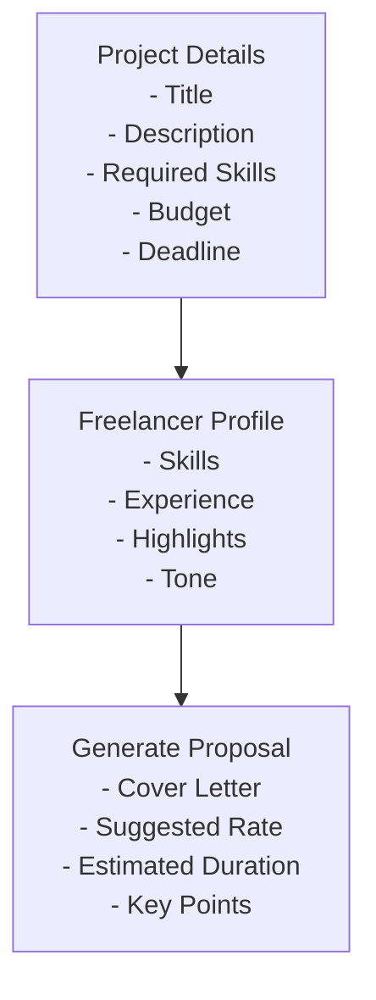
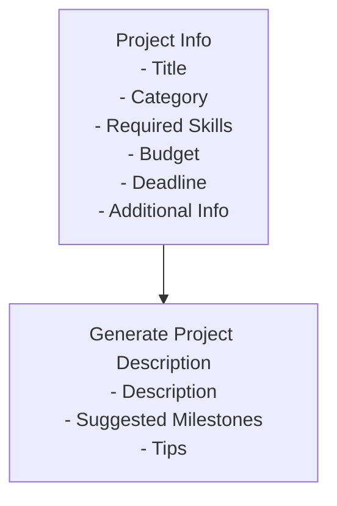
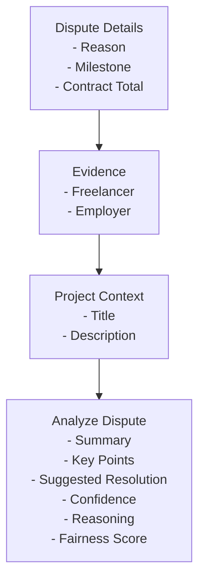

# AI Assistant

<cite>
**Referenced Files in This Document**   
- [ai-assistant.ts](file://src/services/ai-assistant.ts)
- [ai-client.ts](file://src/services/ai-client.ts)
- [ai-types.ts](file://src/services/ai-types.ts)
- [project-repository.ts](file://src/repositories/project-repository.ts)
- [freelancer-profile-repository.ts](file://src/repositories/freelancer-profile-repository.ts)
- [dispute-repository.ts](file://src/repositories/dispute-repository.ts)
- [contract-repository.ts](file://src/repositories/contract-repository.ts)
- [entity-mapper.ts](file://src/utils/entity-mapper.ts)
- [env.ts](file://src/config/env.ts)
</cite>

## Table of Contents
1. [Introduction](#introduction)
2. [Core Functions](#core-functions)
3. [Contextual Data Retrieval](#contextual-data-retrieval)
4. [Prompt Templates](#prompt-templates)
5. [Response Parsing and Validation](#response-parsing-and-validation)
6. [Error Handling](#error-handling)
7. [Extensibility](#extensibility)

## Introduction

The AI Assistant service in FreelanceXchain enhances user productivity by leveraging artificial intelligence to generate high-quality content for proposals, project descriptions, and dispute analysis. This service acts as a smart assistant that helps freelancers create compelling cover letters, assists employers in crafting detailed project posts, and provides objective recommendations for dispute resolution. The AI Assistant integrates with various repositories to retrieve contextual data and creates comprehensive prompts for the AI client, ensuring that the generated content is relevant and personalized.

**Section sources**
- [ai-assistant.ts](file://src/services/ai-assistant.ts#L1-L390)

## Core Functions

The AI Assistant service provides three main functions: `generateProposal`, `generateProjectDescription`, and `analyzeDispute`. Each function is designed to address specific needs within the FreelanceXchain platform, enhancing the user experience by automating content creation and analysis.

### generateProposal

The `generateProposal` function helps freelancers create personalized cover letters for project applications. It retrieves project details and freelancer profile information to generate a compelling proposal that highlights the freelancer's skills and experience. The function accepts input parameters such as `projectId`, `freelancerId`, optional highlights, and tone preferences. It then constructs a prompt using the `PROPOSAL_WRITER_PROMPT` template, which includes project details, freelancer skills, and other relevant information. The AI client processes this prompt and returns a structured JSON response containing the cover letter, suggested rate, estimated duration, and key points.

**Section sources**
- [ai-assistant.ts](file://src/services/ai-assistant.ts#L186-L244)

### generateProjectDescription

The `generateProjectDescription` function assists employers in creating detailed project posts. It takes input parameters such as project title, category, required skills, budget, deadline, and additional information. Using the `PROJECT_DESCRIPTION_PROMPT` template, the function constructs a prompt that guides the AI client to generate a clear and detailed project description, suggested milestones, and tips for attracting better proposals. The output is a structured JSON response containing the project description, milestone suggestions, and employer tips.

**Section sources**
- [ai-assistant.ts](file://src/services/ai-assistant.ts#L249-L285)

### analyzeDispute

The `analyzeDispute` function provides objective recommendations for dispute resolution. It retrieves dispute details, contract information, and project context to analyze the dispute fairly. The function uses the `DISPUTE_ANALYSIS_PROMPT` template to create a comprehensive prompt that includes the dispute reason, milestone details, evidence from both parties, and project context. The AI client processes this prompt and returns a structured JSON response with a summary, key points from both sides, suggested resolution, confidence level, reasoning, and fairness score.

**Section sources**
- [ai-assistant.ts](file://src/services/ai-assistant.ts#L290-L382)

## Contextual Data Retrieval

The AI Assistant service retrieves contextual data from various repositories to create comprehensive prompts for the AI client. This ensures that the generated content is relevant and personalized to the specific use case.

### Project Repository

The `projectRepository` is used to retrieve project details such as title, description, required skills, budget, deadline, and milestones. This information is essential for generating proposals and project descriptions. The repository provides methods to find projects by ID, employer, status, skills, budget range, and keyword search.

**Section sources**
- [project-repository.ts](file://src/repositories/project-repository.ts#L1-L191)

### Freelancer Profile Repository

The `freelancerProfileRepository` retrieves freelancer profile information, including bio, hourly rate, skills, experience, and availability. This data is used to personalize proposals and highlight the freelancer's strengths. The repository offers methods to get profiles by user ID, skill, availability, and keyword search.

**Section sources**
- [freelancer-profile-repository.ts](file://src/repositories/freelancer-profile-repository.ts#L1-L122)

### Dispute Repository

The `disputeRepository` retrieves dispute details, including the reason, evidence, status, and resolution. This information is crucial for analyzing disputes and providing fair recommendations. The repository provides methods to find disputes by ID, contract, milestone, status, and initiator.

**Section sources**
- [dispute-repository.ts](file://src/repositories/dispute-repository.ts#L1-L136)

### Contract Repository

The `contractRepository` retrieves contract information, such as project ID, proposal ID, freelancer and employer IDs, escrow address, total amount, and status. This data is used in dispute analysis to understand the contractual context of the dispute.

**Section sources**
- [contract-repository.ts](file://src/repositories/contract-repository.ts#L1-L139)

## Prompt Templates

The AI Assistant service uses predefined prompt templates to guide the AI client in generating structured and relevant content. These templates are designed to include all necessary contextual data and specify the expected output format.

### Proposal Writer Prompt

The `PROPOSAL_WRITER_PROMPT` template is used to generate personalized cover letters for freelancers. It includes placeholders for project details, freelancer profile information, and tone preferences. The template instructs the AI client to generate a cover letter, suggested rate, estimated duration, and key points.



**Diagram sources**
- [ai-assistant.ts](file://src/services/ai-assistant.ts#L71-L101)

### Project Description Prompt

The `PROJECT_DESCRIPTION_PROMPT` template helps employers create detailed project posts. It includes placeholders for project title, category, required skills, budget, deadline, and additional information. The template guides the AI client to generate a project description, suggested milestones, and tips for attracting better proposals.



**Diagram sources**
- [ai-assistant.ts](file://src/services/ai-assistant.ts#L103-L127)

### Dispute Analysis Prompt

The `DISPUTE_ANALYSIS_PROMPT` template is used to analyze disputes and suggest resolutions. It includes placeholders for dispute details, evidence from both parties, and project context. The template instructs the AI client to provide a summary, key points from both sides, suggested resolution, confidence level, reasoning, and fairness score.



**Diagram sources**
- [ai-assistant.ts](file://src/services/ai-assistant.ts#L129-L166)

## Response Parsing and Validation

The AI Assistant service includes robust response parsing and validation to ensure that the AI client's output is structured and reliable. The `parseJsonResponse` function is used to extract and validate JSON data from the AI client's response.

### JSON Parsing

The `parseJsonResponse` function handles various response formats, including markdown code blocks. It removes any surrounding markdown syntax and attempts to parse the response as JSON. If parsing fails, the function returns null, indicating an error.

```mermaid
flowchart TD
A["AI Client Response"] --> B{"Starts with '
```json'?}
    B -->|Yes| C["Remove '```json'"]
    B -->|No| D{"Starts with '```'?}
    D -->|Yes| E["Remove '```'"]
    D -->|No| F["Trim Response"]
    C --> G["Remove '```' if present"]
    E --> G
    G --> H["Trim Response"]
    H --> I["Parse JSON"]
    I --> J{"Parse Success?"}
    J -->|Yes| K["Return Parsed JSON"]
    J -->|No| L["Return Null"]
```

**Diagram sources**
- [ai-assistant.ts](file://src/services/ai-assistant.ts#L171-L181)
- [ai-client.ts](file://src/services/ai-client.ts#L187-L205)

### Response Validation

After parsing the JSON response, the AI Assistant service validates and normalizes the data to ensure it meets the expected structure and constraints. For example, numerical values are clamped to valid ranges, and missing fields are populated with default values. This ensures that the output is consistent and reliable.

**Section sources**
- [ai-assistant.ts](file://src/services/ai-assistant.ts#L369-L381)

## Error Handling

The AI Assistant service includes comprehensive error handling to manage various failure scenarios, such as missing profiles, AI service unavailability, and parsing errors.

### AI Service Availability

The `isAIAvailable` function checks if the AI service is configured by verifying the presence of the API key in the environment variables. If the AI service is not available, the AI Assistant functions return an error with the code `AI_UNAVAILABLE`.

**Section sources**
- [ai-client.ts](file://src/services/ai-client.ts#L79-L81)
- [env.ts](file://src/config/env.ts#L59-L62)

### Missing Data

If the required data, such as project details or freelancer profiles, is not found, the AI Assistant functions return an error with appropriate codes such as `PROJECT_NOT_FOUND` or `PROFILE_NOT_FOUND`. This ensures that users are informed about missing data and can take corrective actions.

**Section sources**
- [ai-assistant.ts](file://src/services/ai-assistant.ts#L197-L203)
- [ai-assistant.ts](file://src/services/ai-assistant.ts#L207-L213)

### Parsing Errors

If the AI client's response cannot be parsed as valid JSON, the AI Assistant service returns an error with the code `PARSE_ERROR`. This ensures that malformed responses are handled gracefully and do not disrupt the user experience.

**Section sources**
- [ai-assistant.ts](file://src/services/ai-assistant.ts#L235-L241)
- [ai-client.ts](file://src/services/ai-client.ts#L187-L205)

## Extensibility

The AI Assistant service is designed to be extensible, allowing for the addition of new capabilities by creating additional prompt templates and analysis functions.

### Adding New Prompt Templates

To add a new capability, developers can create a new prompt template with placeholders for the required contextual data. The template should specify the expected output format and guide the AI client to generate the desired content.

### Creating New Analysis Functions

New analysis functions can be created by following the pattern of existing functions. The function should retrieve the necessary data from the repositories, construct a prompt using the new template, call the AI client, and parse the response. Error handling and validation should be included to ensure reliability.

**Section sources**
- [ai-assistant.ts](file://src/services/ai-assistant.ts#L186-L382)