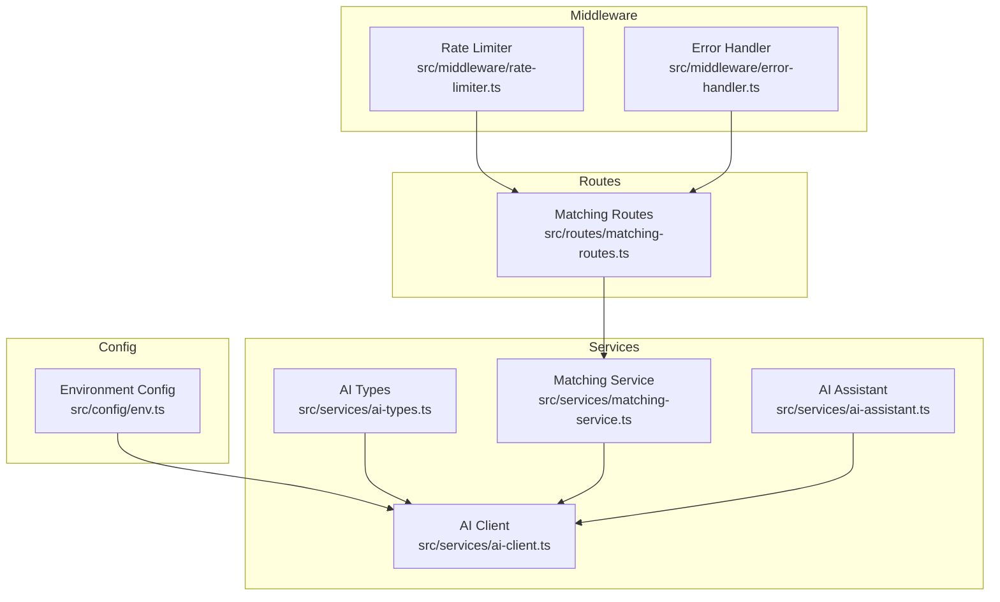
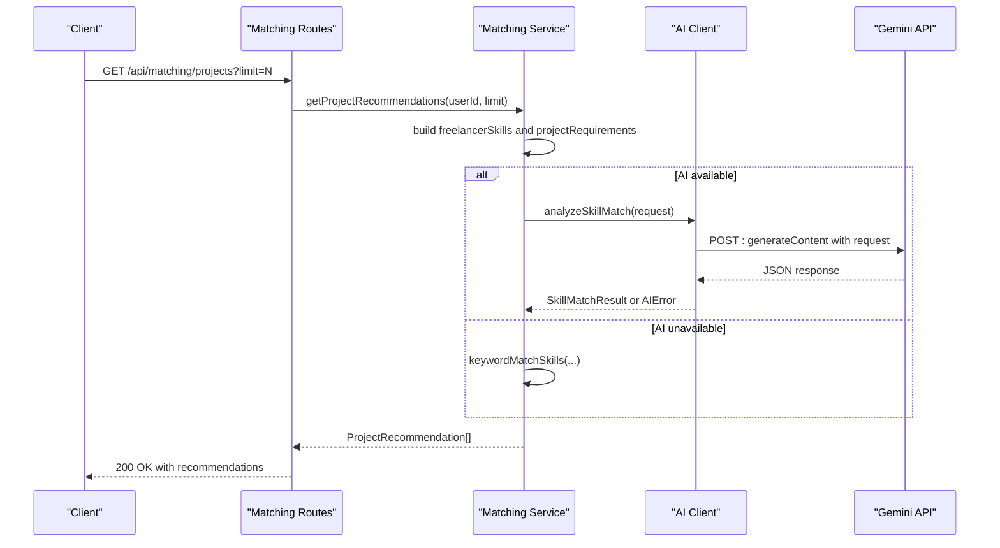
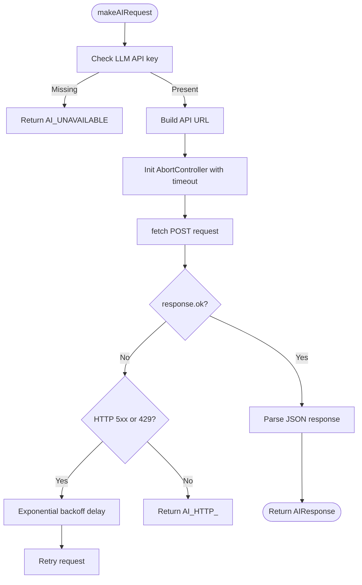
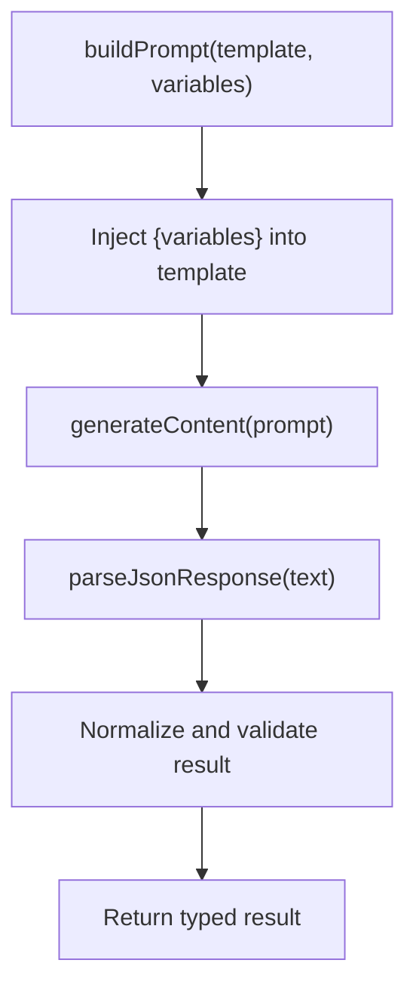
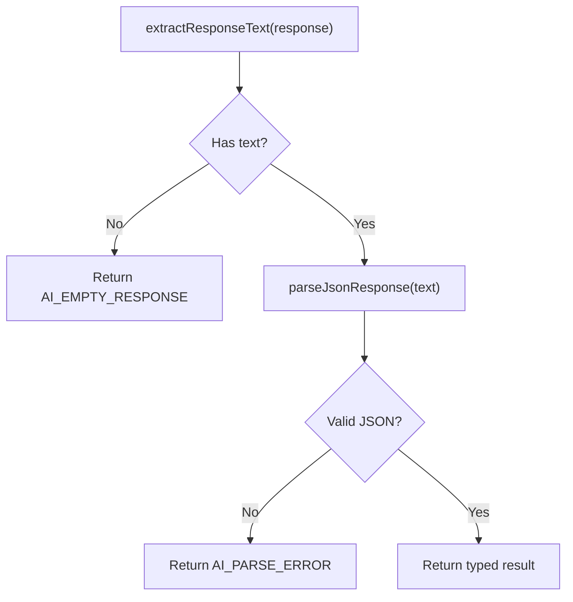
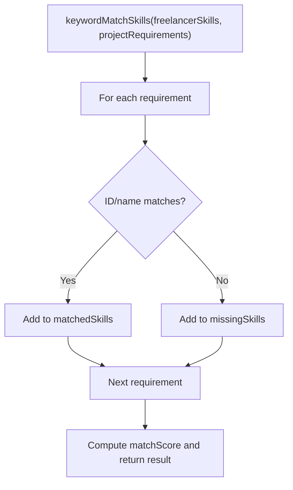
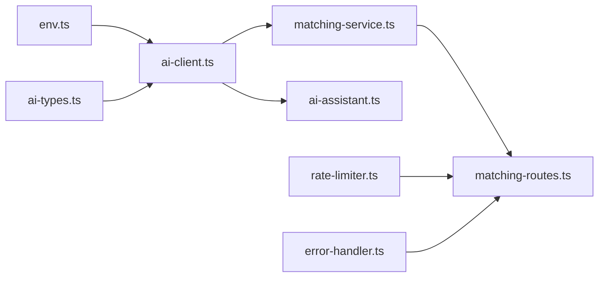

# AI Client

<cite>
**Referenced Files in This Document**
- [ai-client.ts](file://src/services/ai-client.ts)
- [ai-types.ts](file://src/services/ai-types.ts)
- [env.ts](file://src/config/env.ts)
- [matching-service.ts](file://src/services/matching-service.ts)
- [ai-assistant.ts](file://src/services/ai-assistant.ts)
- [matching-routes.ts](file://src/routes/matching-routes.ts)
- [rate-limiter.ts](file://src/middleware/rate-limiter.ts)
- [error-handler.ts](file://src/middleware/error-handler.ts)
- [README.md](file://README.md)
- [TECHNICAL-SPECS.md](file://docs/TECHNICAL-SPECS.md)
</cite>

## Table of Contents
1. [Introduction](#introduction)
2. [Project Structure](#project-structure)
3. [Core Components](#core-components)
4. [Architecture Overview](#architecture-overview)
5. [Detailed Component Analysis](#detailed-component-analysis)
6. [Dependency Analysis](#dependency-analysis)
7. [Performance Considerations](#performance-considerations)
8. [Troubleshooting Guide](#troubleshooting-guide)
9. [Conclusion](#conclusion)

## Introduction
This document explains the AI client service that powers the core communication layer with the Google Gemini API in FreelanceXchain. It covers request construction, retry logic with exponential backoff, timeout handling, prompt engineering strategies, response parsing, fallback mechanisms, and practical usage patterns. It also documents how the AI client integrates with higher-level services and routes, and provides guidance for performance optimization and common issues.

## Project Structure
The AI client resides in the services layer and interacts with configuration, routing, and service layers:

- AI client: constructs prompts, builds requests, calls the Gemini API, parses responses, and provides fallbacks.
- Types: define request/response shapes and AI-specific data models.
- Configuration: reads LLM API key and base URL from environment variables.
- Matching service: orchestrates skill matching, extraction, and gap analysis using the AI client.
- AI assistant: provides additional content generation features using the same AI client.
- Routes: expose AI-backed endpoints for recommendations, skill extraction, and gap analysis.

**Diagram sources**
- [ai-client.ts](file://src/services/ai-client.ts#L1-L120)
- [ai-types.ts](file://src/services/ai-types.ts#L1-L123)
- [env.ts](file://src/config/env.ts#L59-L62)
- [matching-service.ts](file://src/services/matching-service.ts#L1-L120)
- [ai-assistant.ts](file://src/services/ai-assistant.ts#L1-L40)
- [matching-routes.ts](file://src/routes/matching-routes.ts#L1-L60)
- [rate-limiter.ts](file://src/middleware/rate-limiter.ts#L44-L80)
- [error-handler.ts](file://src/middleware/error-handler.ts#L50-L89)

**Section sources**
- [README.md](file://README.md#L136-L152)
- [TECHNICAL-SPECS.md](file://docs/TECHNICAL-SPECS.md#L36-L41)

## Core Components
- AI client: encapsulates the Gemini API integration, including request building, retries, timeouts, response parsing, and fallbacks.
- AI types: define the shape of requests, responses, and AI-specific data models.
- Environment configuration: exposes LLM API key and base URL used by the AI client.
- Matching service: uses the AI client to compute skill matches, extract skills, and analyze skill gaps; falls back to keyword-based logic when AI is unavailable.
- AI assistant: provides additional content generation features using the same AI client.
- Routes: expose endpoints for recommendations, skill extraction, and gap analysis.

**Section sources**
- [ai-client.ts](file://src/services/ai-client.ts#L1-L120)
- [ai-types.ts](file://src/services/ai-types.ts#L1-L123)
- [env.ts](file://src/config/env.ts#L59-L62)
- [matching-service.ts](file://src/services/matching-service.ts#L1-L120)
- [ai-assistant.ts](file://src/services/ai-assistant.ts#L1-L40)
- [matching-routes.ts](file://src/routes/matching-routes.ts#L1-L60)

## Architecture Overview
The AI client acts as the primary integration point with the Gemini API. It is consumed by the matching service for skill-related tasks and by the AI assistant for content generation. The routes layer invokes the matching service and returns structured results to clients.

**Diagram sources**
- [matching-routes.ts](file://src/routes/matching-routes.ts#L148-L182)
- [matching-service.ts](file://src/services/matching-service.ts#L77-L141)
- [ai-client.ts](file://src/services/ai-client.ts#L249-L319)

## Detailed Component Analysis

### AI Client: Request Construction, Retry, Timeout, Parsing, and Fallbacks
- Request construction:
  - Builds the Gemini API URL using the configured base URL and API key.
  - Constructs a request body with contents and generationConfig.
- Retry logic with exponential backoff:
  - Retries up to a fixed maximum count on network aborts, network errors, 5xx, and 429 responses.
  - Delays increase exponentially per retry attempt.
- Timeout handling:
  - Uses an AbortController to cancel long-running requests after a fixed timeout.
- Response parsing:
  - Extracts text from the first candidate part.
  - Parses JSON while tolerating markdown code fences.
- Fallbacks:
  - Keyword-based matching for skill matching and extraction when the AI service is unavailable.

**Diagram sources**
- [ai-client.ts](file://src/services/ai-client.ts#L97-L165)

**Section sources**
- [ai-client.ts](file://src/services/ai-client.ts#L83-L165)
- [env.ts](file://src/config/env.ts#L59-L62)

### Prompt Engineering Strategy
- Templates:
  - Skill match: instructs the model to return a JSON object containing matchScore, matchedSkills, missingSkills, and reasoning.
  - Skill extraction: instructs the model to return a JSON array of extracted skills with confidence scores.
  - Skill gap: instructs the model to return a JSON object with currentSkills, recommendedSkills, marketDemand, and reasoning.
- Variable injection:
  - Skill match: injects freelancer skills, project requirements, and reputation score.
  - Skill extraction: injects text and taxonomy.
  - Skill gap: injects current skills.
- Response normalization:
  - The client enforces JSON-only responses and strips markdown code fences during parsing.

**Diagram sources**
- [ai-client.ts](file://src/services/ai-client.ts#L27-L73)
- [ai-client.ts](file://src/services/ai-client.ts#L207-L217)
- [ai-client.ts](file://src/services/ai-client.ts#L249-L319)

**Section sources**
- [ai-client.ts](file://src/services/ai-client.ts#L27-L73)
- [ai-client.ts](file://src/services/ai-client.ts#L207-L217)
- [ai-client.ts](file://src/services/ai-client.ts#L249-L319)

### Response Parsing Mechanism
- Text extraction:
  - Reads the first candidate part’s text from the Gemini response.
- JSON parsing:
  - Strips markdown code fences before attempting JSON.parse.
  - Validates the parsed result and returns typed data or an AI error.

**Diagram sources**
- [ai-client.ts](file://src/services/ai-client.ts#L167-L206)
- [ai-client.ts](file://src/services/ai-client.ts#L249-L319)

**Section sources**
- [ai-client.ts](file://src/services/ai-client.ts#L167-L206)
- [ai-client.ts](file://src/services/ai-client.ts#L249-L319)

### Fallback Mechanisms: Keyword-Based Matching
- Skill matching fallback:
  - Compares freelancer skills to project requirements using both skill IDs and names.
  - Computes matchScore as a percentage and returns matched/missing skills with a reasoning note.
- Skill extraction fallback:
  - Scans available skills against the input text; exact word matches receive higher confidence than partial matches.

**Diagram sources**
- [ai-client.ts](file://src/services/ai-client.ts#L321-L384)

**Section sources**
- [ai-client.ts](file://src/services/ai-client.ts#L321-L384)

### Concrete Usage Examples
- generateContent:
  - Used by the AI assistant to generate structured content for proposals, project descriptions, and dispute analysis.
  - Example path: [ai-assistant.ts](file://src/services/ai-assistant.ts#L186-L244)
- analyzeSkillMatch:
  - Used by the matching service to compute project-freelancer match scores.
  - Example path: [matching-service.ts](file://src/services/matching-service.ts#L109-L141)
- extractSkills:
  - Used by the matching service to extract skills from free-form text.
  - Example path: [matching-service.ts](file://src/services/matching-service.ts#L247-L269)

**Section sources**
- [ai-assistant.ts](file://src/services/ai-assistant.ts#L186-L244)
- [matching-service.ts](file://src/services/matching-service.ts#L109-L141)
- [matching-service.ts](file://src/services/matching-service.ts#L247-L269)

## Dependency Analysis
- AI client depends on:
  - Environment configuration for LLM API key and base URL.
  - AI types for request/response shapes.
- Matching service depends on:
  - AI client for skill matching, extraction, and gap analysis.
  - Repositories for profile and project data.
- AI assistant depends on:
  - AI client for content generation.
  - Repositories for dispute and contract data.
- Routes depend on:
  - Matching service for recommendations and skill analysis.
  - Middleware for rate limiting and error handling.

**Diagram sources**
- [env.ts](file://src/config/env.ts#L59-L62)
- [ai-client.ts](file://src/services/ai-client.ts#L1-L40)
- [ai-types.ts](file://src/services/ai-types.ts#L1-L123)
- [matching-service.ts](file://src/services/matching-service.ts#L1-L40)
- [ai-assistant.ts](file://src/services/ai-assistant.ts#L1-L20)
- [matching-routes.ts](file://src/routes/matching-routes.ts#L1-L40)
- [rate-limiter.ts](file://src/middleware/rate-limiter.ts#L44-L80)
- [error-handler.ts](file://src/middleware/error-handler.ts#L50-L89)

**Section sources**
- [env.ts](file://src/config/env.ts#L59-L62)
- [ai-client.ts](file://src/services/ai-client.ts#L1-L40)
- [matching-service.ts](file://src/services/matching-service.ts#L1-L40)
- [ai-assistant.ts](file://src/services/ai-assistant.ts#L1-L20)
- [matching-routes.ts](file://src/routes/matching-routes.ts#L1-L40)
- [rate-limiter.ts](file://src/middleware/rate-limiter.ts#L44-L80)
- [error-handler.ts](file://src/middleware/error-handler.ts#L50-L89)

## Performance Considerations
- Caching AI responses:
  - Cache skill match results and extracted skills keyed by input identifiers to reduce repeated calls when the same inputs occur frequently.
  - Consider cache invalidation on profile or project updates.
- Managing concurrent requests:
  - Use a semaphore or queue to cap concurrent AI calls to respect provider limits and avoid timeouts.
  - Combine with exponential backoff to handle bursts gracefully.
- Request batching:
  - Where feasible, batch multiple skill extraction requests to reduce overhead.
- Response normalization:
  - Normalize and validate results early to avoid downstream processing costs.

[No sources needed since this section provides general guidance]

## Troubleshooting Guide
Common issues and resolutions:
- API rate limiting:
  - The AI client retries on 429 with exponential backoff. Clients should also apply rate limiting at the application layer.
  - Reference: [rate-limiter.ts](file://src/middleware/rate-limiter.ts#L44-L80)
- Authentication failures:
  - Missing or invalid LLM API key causes immediate unavailability. Ensure environment variables are set.
  - Reference: [env.ts](file://src/config/env.ts#L59-L62)
- Malformed responses:
  - The client strips markdown fences and validates JSON; otherwise returns a parse error. Verify prompt templates and model behavior.
  - Reference: [ai-client.ts](file://src/services/ai-client.ts#L184-L206)
- Network errors and timeouts:
  - Requests are aborted after a fixed timeout and retried with exponential backoff when retryable.
  - Reference: [ai-client.ts](file://src/services/ai-client.ts#L97-L165)
- Service unavailability:
  - When AI is unavailable, the matching service falls back to keyword-based matching/extraction.
  - Reference: [matching-service.ts](file://src/services/matching-service.ts#L109-L141), [matching-service.ts](file://src/services/matching-service.ts#L247-L269)

**Section sources**
- [rate-limiter.ts](file://src/middleware/rate-limiter.ts#L44-L80)
- [env.ts](file://src/config/env.ts#L59-L62)
- [ai-client.ts](file://src/services/ai-client.ts#L97-L165)
- [ai-client.ts](file://src/services/ai-client.ts#L184-L206)
- [matching-service.ts](file://src/services/matching-service.ts#L109-L141)
- [matching-service.ts](file://src/services/matching-service.ts#L247-L269)

## Conclusion
The AI client provides a robust, resilient integration with the Gemini API, featuring structured prompt engineering, strict response parsing, and comprehensive fallbacks. It underpins the matching service and assistant features, enabling intelligent skill matching, extraction, and gap analysis. By combining exponential backoff, timeouts, and keyword-based fallbacks, the system remains reliable even under transient failures or unavailability. For production deployments, pair the client with caching and rate limiting to optimize performance and cost.