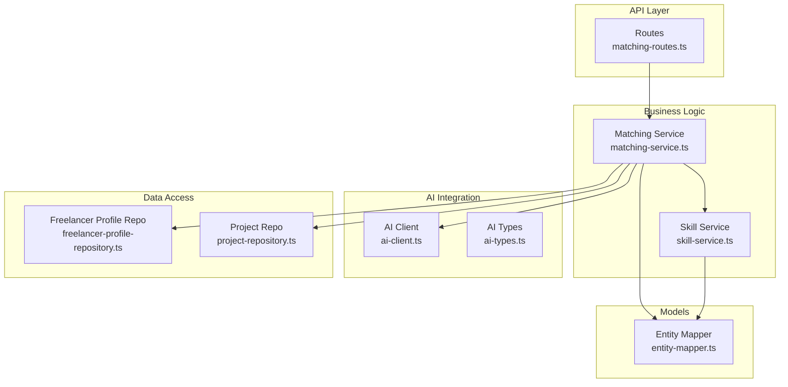
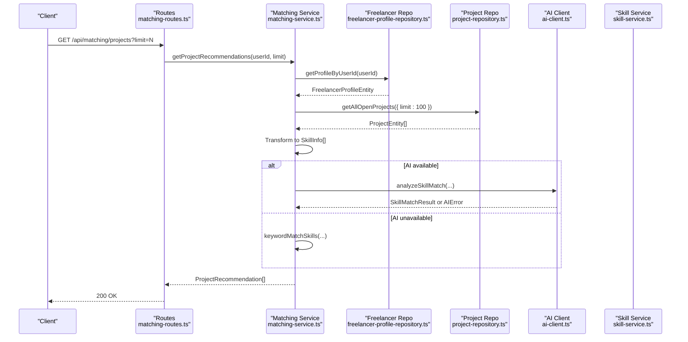
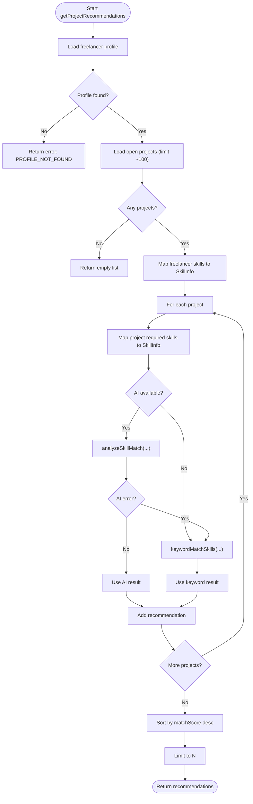
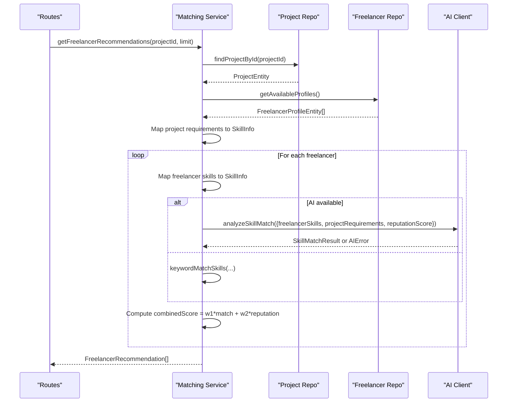
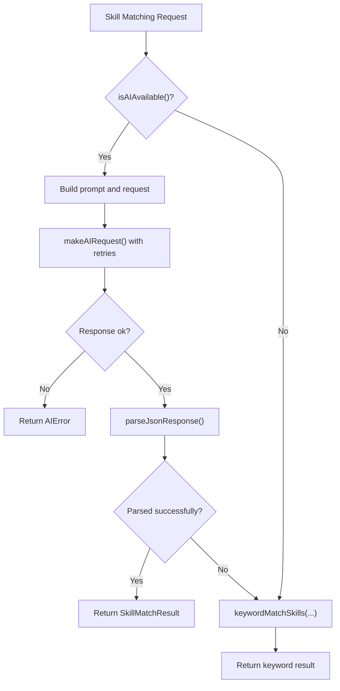
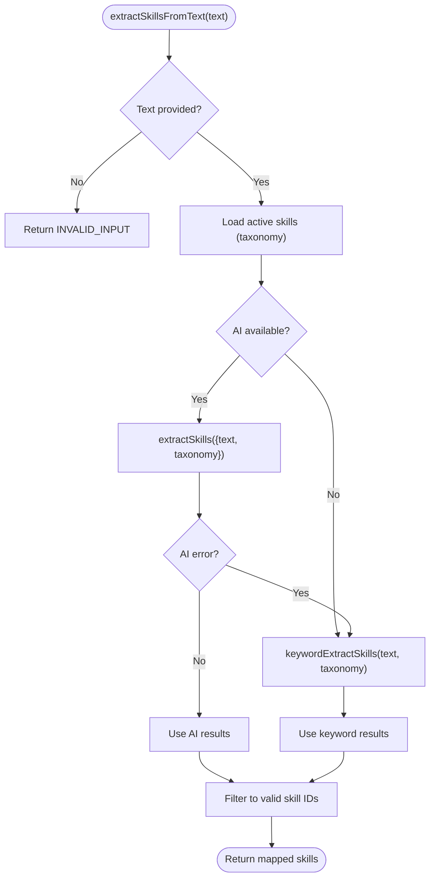
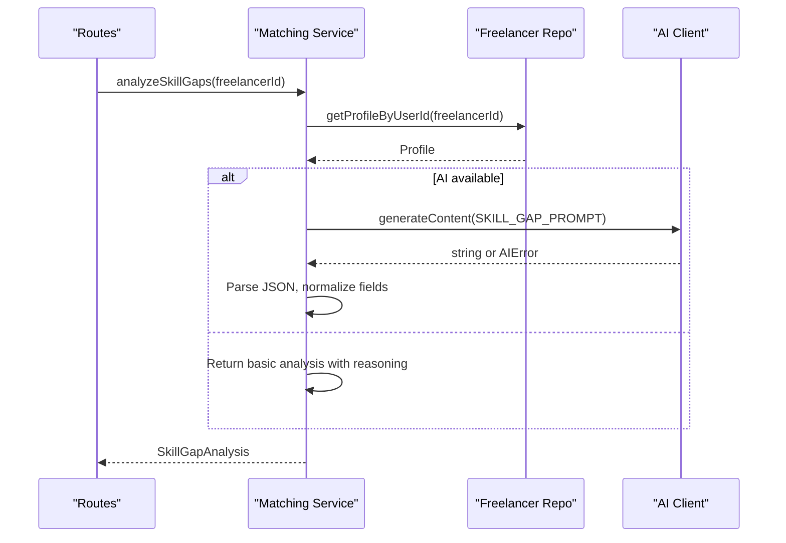
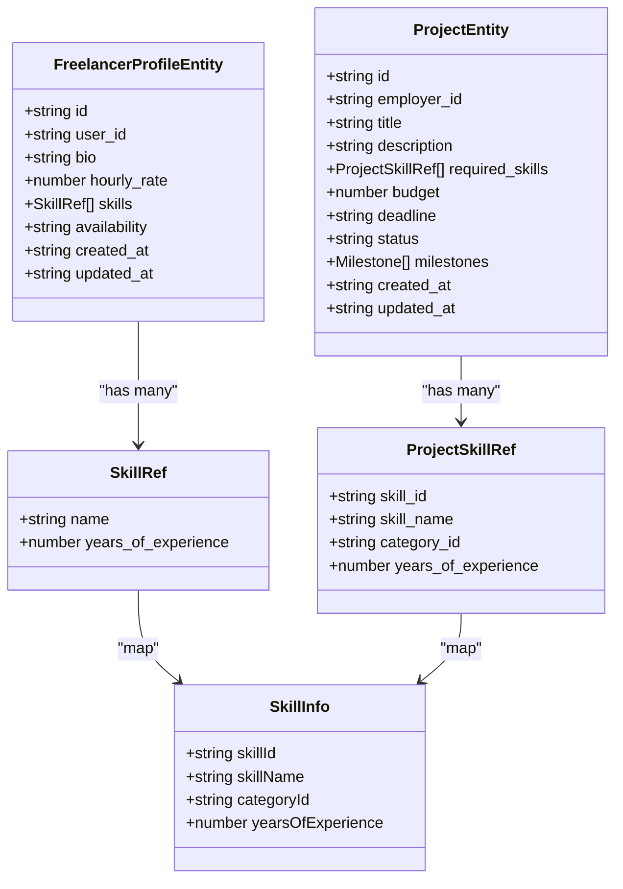
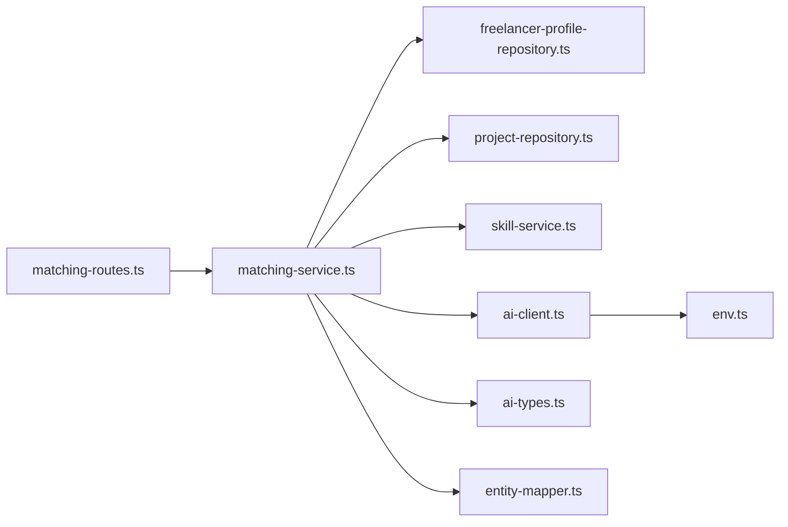

# Matching Service

<cite>
**Referenced Files in This Document**
- [matching-service.ts](file://src/services/matching-service.ts)
- [ai-client.ts](file://src/services/ai-client.ts)
- [ai-types.ts](file://src/services/ai-types.ts)
- [skill-service.ts](file://src/services/skill-service.ts)
- [entity-mapper.ts](file://src/utils/entity-mapper.ts)
- [freelancer-profile-repository.ts](file://src/repositories/freelancer-profile-repository.ts)
- [project-repository.ts](file://src/repositories/project-repository.ts)
- [matching-routes.ts](file://src/routes/matching-routes.ts)
- [env.ts](file://src/config/env.ts)
</cite>

## Table of Contents
1. [Introduction](#introduction)
2. [Project Structure](#project-structure)
3. [Core Components](#core-components)
4. [Architecture Overview](#architecture-overview)
5. [Detailed Component Analysis](#detailed-component-analysis)
6. [Dependency Analysis](#dependency-analysis)
7. [Performance Considerations](#performance-considerations)
8. [Troubleshooting Guide](#troubleshooting-guide)
9. [Conclusion](#conclusion)

## Introduction
This document explains the AI-powered matching service that powers skill-based recommendations in the FreelanceXchain platform. It connects freelancers with suitable projects and vice versa using a robust skill matching pipeline that leverages an LLM API when available and gracefully falls back to keyword-based matching. It also documents skill extraction from free-text descriptions, skill gap analysis for learning path suggestions, and the data transformation logic that maps database entities to the internal SkillInfo representation used by the matching engine.

## Project Structure
The matching service spans several modules:
- Routes define the public API endpoints for recommendations, skill extraction, and skill gap analysis.
- The matching service orchestrates repository calls, transforms entities to SkillInfo, selects AI or keyword matching, and returns structured recommendations.
- The AI client encapsulates LLM API integration, prompt building, retries, timeouts, and parsing.
- Repositories provide typed access to freelancer profiles and projects.
- The skill service supplies the active taxonomy used for skill extraction and validation.
- The entity mapper defines the canonical data models and conversion helpers.

**Diagram sources**
- [matching-routes.ts](file://src/routes/matching-routes.ts#L1-L370)
- [matching-service.ts](file://src/services/matching-service.ts#L1-L391)
- [ai-client.ts](file://src/services/ai-client.ts#L1-L465)
- [ai-types.ts](file://src/services/ai-types.ts#L1-L123)
- [freelancer-profile-repository.ts](file://src/repositories/freelancer-profile-repository.ts#L1-L122)
- [project-repository.ts](file://src/repositories/project-repository.ts#L1-L191)
- [entity-mapper.ts](file://src/utils/entity-mapper.ts#L1-L412)
- [skill-service.ts](file://src/services/skill-service.ts#L1-L285)

**Section sources**
- [matching-routes.ts](file://src/routes/matching-routes.ts#L1-L370)
- [matching-service.ts](file://src/services/matching-service.ts#L1-L391)
- [ai-client.ts](file://src/services/ai-client.ts#L1-L465)
- [ai-types.ts](file://src/services/ai-types.ts#L1-L123)
- [freelancer-profile-repository.ts](file://src/repositories/freelancer-profile-repository.ts#L1-L122)
- [project-repository.ts](file://src/repositories/project-repository.ts#L1-L191)
- [entity-mapper.ts](file://src/utils/entity-mapper.ts#L1-L412)
- [skill-service.ts](file://src/services/skill-service.ts#L1-L285)

## Core Components
- getProjectRecommendations: Computes project recommendations for a freelancer by comparing their skills to open project requirements using AI when available, otherwise keyword matching. Results are sorted by match score and limited by a configurable cap.
- getFreelancerRecommendations: Ranks available freelancers for a given project by combining AI skill match scores with a reputation score (currently defaulted) using weighted scoring, then sorts and limits results.
- extractSkillsFromText: Extracts skills from free-text content by attempting AI extraction and falling back to keyword extraction against the active taxonomy.
- analyzeSkillGaps: Provides a skill gap analysis for a freelancer’s current skills using AI prompts when available, returning recommended skills and market demand signals.
- Data transformation: Converts database entities to SkillInfo for both freelancers and projects, enabling consistent matching logic.

**Section sources**
- [matching-service.ts](file://src/services/matching-service.ts#L73-L391)
- [ai-client.ts](file://src/services/ai-client.ts#L250-L384)
- [skill-service.ts](file://src/services/skill-service.ts#L216-L219)

## Architecture Overview
The matching service follows a layered architecture:
- Route handlers validate requests and delegate to the matching service.
- The matching service retrieves data via repositories, transforms entities to SkillInfo, and invokes either AI or keyword matching.
- The AI client manages LLM API calls, retries, timeouts, and response parsing.
- The skill service provides the active taxonomy for skill extraction and validation.
- The entity mapper ensures consistent data models across layers.

**Diagram sources**
- [matching-routes.ts](file://src/routes/matching-routes.ts#L148-L182)
- [matching-service.ts](file://src/services/matching-service.ts#L77-L141)
- [freelancer-profile-repository.ts](file://src/repositories/freelancer-profile-repository.ts#L29-L31)
- [project-repository.ts](file://src/repositories/project-repository.ts#L76-L95)
- [ai-client.ts](file://src/services/ai-client.ts#L250-L283)

## Detailed Component Analysis

### getProjectRecommendations
Purpose:
- Suggest projects to a freelancer based on skill compatibility.
- Uses AI when configured; otherwise falls back to keyword matching.
- Returns top-N recommendations sorted by match score.

Key steps:
- Fetch freelancer profile by user ID.
- Retrieve open projects (bounded fetch).
- Convert freelancer skills to SkillInfo.
- For each project, convert required skills to SkillInfo.
- Attempt AI skill match; on failure or unavailability, use keyword matching.
- Aggregate match results with matched/missing skills and reasoning.
- Sort by match score descending and limit results.

**Diagram sources**
- [matching-service.ts](file://src/services/matching-service.ts#L77-L141)
- [ai-client.ts](file://src/services/ai-client.ts#L250-L283)
- [ai-client.ts](file://src/services/ai-client.ts#L324-L358)

**Section sources**
- [matching-service.ts](file://src/services/matching-service.ts#L77-L141)

### getFreelancerRecommendations
Purpose:
- Rank available freelancers for a project using a weighted combination of skill match and reputation score.
- Defaults reputation score for demonstration; in practice, integrate with the reputation service.

Key steps:
- Fetch project by ID.
- Retrieve available freelancers.
- Convert project requirements to SkillInfo.
- For each freelancer, convert skills to SkillInfo.
- Attempt AI skill match; on failure or unavailability, use keyword matching.
- Compute combined score using weights and sort by combined score.
- Limit results to top-N.

**Diagram sources**
- [matching-service.ts](file://src/services/matching-service.ts#L147-L218)
- [ai-client.ts](file://src/services/ai-client.ts#L250-L283)
- [ai-client.ts](file://src/services/ai-client.ts#L324-L358)
- [freelancer-profile-repository.ts](file://src/repositories/freelancer-profile-repository.ts#L56-L66)
- [project-repository.ts](file://src/repositories/project-repository.ts#L51-L53)

**Section sources**
- [matching-service.ts](file://src/services/matching-service.ts#L147-L218)

### Skill Matching Pipeline: AI vs Keyword
- AI availability check: The AI client exposes an availability function that checks for configured API key and base URL.
- AI request building: Prompts are constructed with serialized SkillInfo arrays and reputation score.
- Retry and timeout: The AI client implements exponential backoff and a request timeout.
- Response parsing: The AI client extracts text from the LLM response and parses JSON, handling markdown code blocks.
- Fallback: If AI fails or is unavailable, the service uses keyword-based matching that compares skill names and IDs.

**Diagram sources**
- [ai-client.ts](file://src/services/ai-client.ts#L76-L81)
- [ai-client.ts](file://src/services/ai-client.ts#L97-L165)
- [ai-client.ts](file://src/services/ai-client.ts#L222-L247)
- [ai-client.ts](file://src/services/ai-client.ts#L250-L319)
- [ai-client.ts](file://src/services/ai-client.ts#L324-L358)

**Section sources**
- [ai-client.ts](file://src/services/ai-client.ts#L76-L165)
- [ai-client.ts](file://src/services/ai-client.ts#L222-L319)
- [ai-client.ts](file://src/services/ai-client.ts#L324-L358)

### Skill Extraction and Taxonomy Mapping
- Active taxonomy: The skill service provides active skills used as the target taxonomy for extraction.
- AI extraction: The AI client builds a prompt to extract skills and map them to the taxonomy, returning confidence scores.
- Fallback extraction: When AI is unavailable or fails, the service uses keyword extraction that scans text for known skill names and assigns confidence based on exact/partial matches.
- Validation: Extracted skills are filtered to ensure they correspond to valid taxonomy entries.

**Diagram sources**
- [matching-service.ts](file://src/services/matching-service.ts#L223-L269)
- [skill-service.ts](file://src/services/skill-service.ts#L216-L219)
- [ai-client.ts](file://src/services/ai-client.ts#L286-L319)
- [ai-client.ts](file://src/services/ai-client.ts#L360-L384)

**Section sources**
- [matching-service.ts](file://src/services/matching-service.ts#L223-L269)
- [skill-service.ts](file://src/services/skill-service.ts#L216-L219)
- [ai-client.ts](file://src/services/ai-client.ts#L286-L384)

### Skill Gap Analysis
- Purpose: Suggest learning paths for freelancers by analyzing current skills and recommending additional skills aligned with market demand.
- AI prompt: A dedicated prompt template instructs the LLM to produce current skills, recommended skills, market demand levels, and reasoning.
- Parsing: The service cleans markdown code blocks from the LLM response and parses JSON, returning a normalized SkillGapAnalysis object.

**Diagram sources**
- [matching-service.ts](file://src/services/matching-service.ts#L271-L353)
- [ai-client.ts](file://src/services/ai-client.ts#L28-L73)
- [ai-client.ts](file://src/services/ai-client.ts#L222-L247)

**Section sources**
- [matching-service.ts](file://src/services/matching-service.ts#L271-L353)
- [ai-client.ts](file://src/services/ai-client.ts#L28-L73)

### Data Transformation: SkillInfo Mapping
- FreelancerSkillEntity to SkillInfo: Converts profile skills (name and years of experience) to SkillInfo for matching.
- ProjectSkillEntity to SkillInfo: Converts project required skills (including category and optional experience) to SkillInfo.
- These transformations enable consistent matching regardless of whether skills are identified by ID/name or just name.

**Diagram sources**
- [freelancer-profile-repository.ts](file://src/repositories/freelancer-profile-repository.ts#L1-L14)
- [project-repository.ts](file://src/repositories/project-repository.ts#L16-L28)
- [matching-service.ts](file://src/services/matching-service.ts#L52-L71)
- [entity-mapper.ts](file://src/utils/entity-mapper.ts#L90-L129)

**Section sources**
- [matching-service.ts](file://src/services/matching-service.ts#L52-L71)
- [freelancer-profile-repository.ts](file://src/repositories/freelancer-profile-repository.ts#L1-L14)
- [project-repository.ts](file://src/repositories/project-repository.ts#L16-L28)
- [entity-mapper.ts](file://src/utils/entity-mapper.ts#L90-L129)

### API Integration Examples
- Project recommendations endpoint: GET /api/matching/projects with optional limit query parameter.
- Freelancer recommendations endpoint: GET /api/matching/freelancers/{projectId} with optional limit query parameter.
- Skill extraction endpoint: POST /api/matching/extract-skills with JSON body containing text.
- Skill gap analysis endpoint: GET /api/matching/skill-gaps.

These endpoints are secured with authentication middleware and validated by UUID for project IDs.

**Section sources**
- [matching-routes.ts](file://src/routes/matching-routes.ts#L148-L182)
- [matching-routes.ts](file://src/routes/matching-routes.ts#L184-L268)
- [matching-routes.ts](file://src/routes/matching-routes.ts#L270-L325)
- [matching-routes.ts](file://src/routes/matching-routes.ts#L327-L368)

## Dependency Analysis
- Matching service depends on:
  - Repositories for data access (freelancer profiles and projects).
  - Skill service for active taxonomy.
  - AI client for LLM integration and fallbacks.
  - Entity mapper for consistent data models.
- AI client depends on configuration for LLM API key and base URL.
- Routes depend on matching service and enforce validation and authentication.

**Diagram sources**
- [matching-routes.ts](file://src/routes/matching-routes.ts#L1-L370)
- [matching-service.ts](file://src/services/matching-service.ts#L1-L391)
- [ai-client.ts](file://src/services/ai-client.ts#L1-L465)
- [env.ts](file://src/config/env.ts#L59-L62)

**Section sources**
- [matching-service.ts](file://src/services/matching-service.ts#L1-L391)
- [ai-client.ts](file://src/services/ai-client.ts#L1-L465)
- [env.ts](file://src/config/env.ts#L59-L62)

## Performance Considerations
- Limit AI calls:
  - Project recommendations fetch a bounded set of open projects (~100) to reduce AI calls.
  - Recommendations are limited by a configurable cap (default 10, up to 50).
- Fallback strategy:
  - Keyword matching is used when AI is unavailable or fails, preventing service degradation.
- Retry and timeout:
  - The AI client implements exponential backoff and a request timeout to handle transient failures.
- Caching recommendations:
  - Not implemented in the current code. Consider caching per-user project recommendations keyed by user ID and last profile update timestamp to reduce repeated AI calls for the same user within short windows.
- Pagination and filtering:
  - Repositories support pagination and filtering; leverage these patterns to avoid loading excessive data when scaling.

**Section sources**
- [matching-service.ts](file://src/services/matching-service.ts#L89-L141)
- [matching-service.ts](file://src/services/matching-service.ts#L160-L218)
- [ai-client.ts](file://src/services/ai-client.ts#L97-L165)
- [ai-client.ts](file://src/services/ai-client.ts#L222-L247)

## Troubleshooting Guide
- AI Unavailable:
  - Symptom: AI errors returned or fallback to keyword matching.
  - Cause: Missing LLM API key or base URL in environment configuration.
  - Resolution: Set LLM_API_KEY and LLM_API_URL in environment variables.
- AI Network/HTTP Errors:
  - Symptom: AI network error or HTTP status-based retryable errors.
  - Cause: Network issues or upstream service throttling.
  - Resolution: Inspect logs; the AI client retries automatically with exponential backoff.
- Empty or Malformed AI Responses:
  - Symptom: AI empty response or parse error.
  - Cause: Unexpected LLM output format.
  - Resolution: The AI client strips markdown code blocks and validates JSON; ensure prompts remain unchanged.
- Validation Failures:
  - Symptom: 400 responses for invalid limit or missing projectId.
  - Cause: Route-level validation.
  - Resolution: Ensure limit is a positive integer and projectId is a valid UUID.
- Missing Profiles/Projects:
  - Symptom: 404 responses for profile or project not found.
  - Cause: Non-existent user or project ID.
  - Resolution: Verify IDs and ensure profiles/projects exist.

**Section sources**
- [env.ts](file://src/config/env.ts#L59-L62)
- [ai-client.ts](file://src/services/ai-client.ts#L100-L165)
- [ai-client.ts](file://src/services/ai-client.ts#L167-L205)
- [matching-routes.ts](file://src/routes/matching-routes.ts#L154-L167)
- [matching-routes.ts](file://src/routes/matching-routes.ts#L239-L253)
- [matching-service.ts](file://src/services/matching-service.ts#L81-L96)
- [matching-service.ts](file://src/services/matching-service.ts#L151-L158)

## Conclusion
The matching service provides a resilient, AI-first skill recommendation system with robust fallbacks to keyword-based matching. It integrates cleanly with repositories, the active skill taxonomy, and the LLM API while exposing intuitive endpoints for clients. Performance is managed through bounded fetching, configurable limits, and automatic retries. Extending the service with caching and integrating real-time reputation scores would further enhance scalability and accuracy.