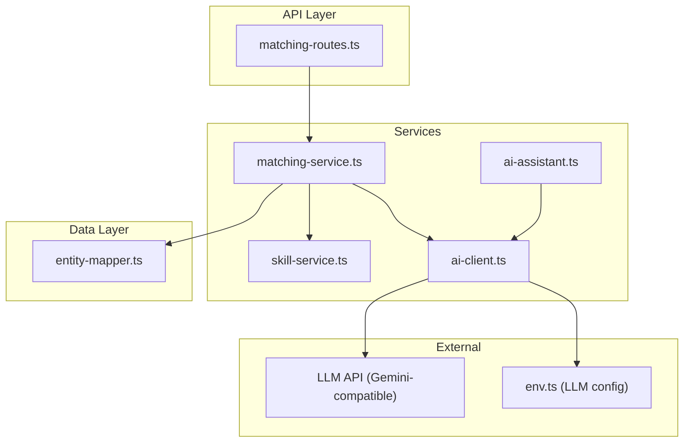
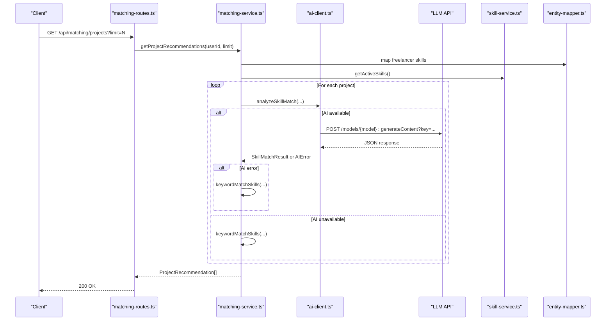
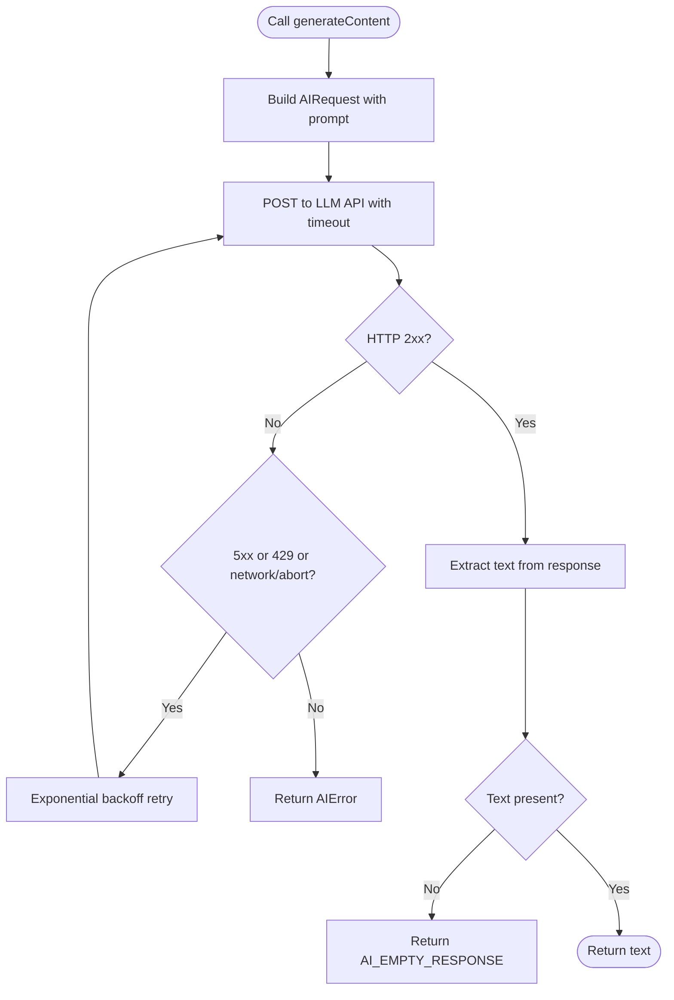
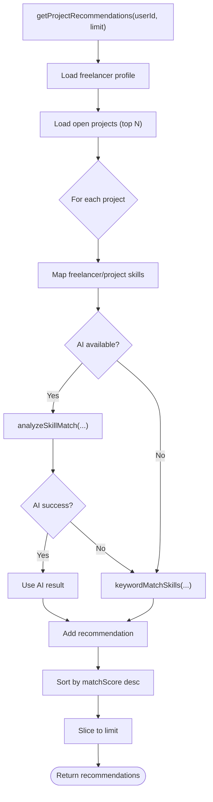
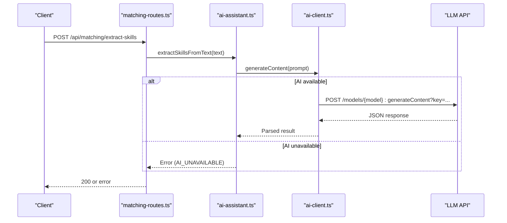
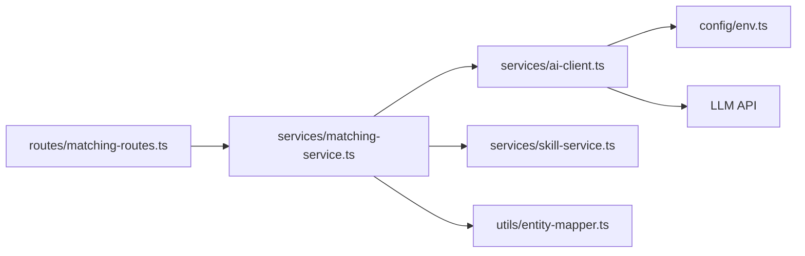

# AI-Powered Matching System

<cite>
**Referenced Files in This Document**
- [README.md](file://README.md)
- [docs/ARCHITECTURE.md](file://docs/ARCHITECTURE.md)
- [src/config/env.ts](file://src/config/env.ts)
- [src/services/ai-client.ts](file://src/services/ai-client.ts)
- [src/services/ai-types.ts](file://src/services/ai-types.ts)
- [src/services/matching-service.ts](file://src/services/matching-service.ts)
- [src/services/ai-assistant.ts](file://src/services/ai-assistant.ts)
- [src/routes/matching-routes.ts](file://src/routes/matching-routes.ts)
- [src/services/skill-service.ts](file://src/services/skill-service.ts)
- [src/utils/entity-mapper.ts](file://src/utils/entity-mapper.ts)
- [src/middleware/rate-limiter.ts](file://src/middleware/rate-limiter.ts)
</cite>

## Table of Contents
1. [Introduction](#introduction)
2. [Project Structure](#project-structure)
3. [Core Components](#core-components)
4. [Architecture Overview](#architecture-overview)
5. [Detailed Component Analysis](#detailed-component-analysis)
6. [Dependency Analysis](#dependency-analysis)
7. [Performance Considerations](#performance-considerations)
8. [Troubleshooting Guide](#troubleshooting-guide)
9. [Conclusion](#conclusion)
10. [Appendices](#appendices)

## Introduction
This document explains the AI-powered skill matching system in FreelanceXchain. The platform integrates Google Gemini-compatible LLM APIs to extract skills from project descriptions and freelancer profiles, compute compatibility scores, and generate intelligent recommendations. It also includes an AI assistant that enhances user interactions through natural language processing for proposals, project descriptions, and dispute analysis. The system emphasizes robust error handling, fallbacks, and performance characteristics such as retries, timeouts, and rate limiting.

## Project Structure
The AI matching system spans configuration, client, service, routes, and supporting utilities:

- Configuration: LLM API keys and URLs are loaded from environment variables.
- AI Client: Communicates with the external LLM API, manages retries, timeouts, and response parsing.
- Matching Service: Orchestrates skill matching, skill extraction, and skill gap analysis with AI-backed and keyword-based fallbacks.
- AI Assistant: Generates content and analyses for proposals, project descriptions, and disputes.
- Routes: Exposes REST endpoints for recommendations, skill extraction, and gap analysis.
- Supporting Services and Utilities: Skill taxonomy retrieval, entity mapping, and rate limiting.

**Diagram sources**
- [src/routes/matching-routes.ts](file://src/routes/matching-routes.ts#L1-L370)
- [src/services/matching-service.ts](file://src/services/matching-service.ts#L1-L391)
- [src/services/ai-client.ts](file://src/services/ai-client.ts#L1-L465)
- [src/services/ai-assistant.ts](file://src/services/ai-assistant.ts#L1-L390)
- [src/services/skill-service.ts](file://src/services/skill-service.ts#L1-L285)
- [src/utils/entity-mapper.ts](file://src/utils/entity-mapper.ts#L1-L200)
- [src/config/env.ts](file://src/config/env.ts#L59-L62)

**Section sources**
- [README.md](file://README.md#L1-L247)
- [docs/ARCHITECTURE.md](file://docs/ARCHITECTURE.md#L1-L218)

## Core Components
- AI Client: Sends prompts to the LLM API, parses JSON responses, and provides robust error handling with exponential backoff and timeouts.
- Matching Service: Computes skill match scores, extracts skills from text, and performs skill gap analysis with AI-backed and keyword-based fallbacks.
- AI Assistant: Generates tailored proposals, improves project descriptions, and analyzes disputes using AI.
- Routes: Expose endpoints for project and freelancer recommendations, skill extraction, and skill gap analysis.
- Configuration: Loads LLM API key and base URL from environment variables.

**Section sources**
- [src/services/ai-client.ts](file://src/services/ai-client.ts#L1-L465)
- [src/services/matching-service.ts](file://src/services/matching-service.ts#L1-L391)
- [src/services/ai-assistant.ts](file://src/services/ai-assistant.ts#L1-L390)
- [src/routes/matching-routes.ts](file://src/routes/matching-routes.ts#L1-L370)
- [src/config/env.ts](file://src/config/env.ts#L59-L62)

## Architecture Overview
The AI matching system integrates with external LLM APIs and internal services:

**Diagram sources**
- [src/routes/matching-routes.ts](file://src/routes/matching-routes.ts#L148-L182)
- [src/services/matching-service.ts](file://src/services/matching-service.ts#L77-L141)
- [src/services/ai-client.ts](file://src/services/ai-client.ts#L251-L358)
- [src/services/skill-service.ts](file://src/services/skill-service.ts#L216-L219)
- [src/utils/entity-mapper.ts](file://src/utils/entity-mapper.ts#L131-L173)

## Detailed Component Analysis

### AI Client: External LLM Communication
Responsibilities:
- Build and send LLM requests with generation configuration.
- Manage retries with exponential backoff for transient errors and rate limits.
- Enforce request timeouts and handle aborts.
- Extract and parse JSON responses, tolerating markdown code blocks.
- Provide fallbacks for skill extraction and matching when AI is unavailable.

Key behaviors:
- Availability check using configured LLM API key and base URL.
- Retry logic for HTTP 5xx and 429, plus network/abort errors.
- Timeout handling to prevent hanging requests.
- JSON parsing with markdown fence stripping.
- Fallback keyword-based matching and extraction when AI is unavailable.

**Diagram sources**
- [src/services/ai-client.ts](file://src/services/ai-client.ts#L97-L165)
- [src/services/ai-client.ts](file://src/services/ai-client.ts#L222-L247)
- [src/services/ai-client.ts](file://src/services/ai-client.ts#L167-L205)

**Section sources**
- [src/services/ai-client.ts](file://src/services/ai-client.ts#L1-L465)
- [src/config/env.ts](file://src/config/env.ts#L59-L62)

### Matching Service: Compatibility and Recommendations
Responsibilities:
- Compute AI-driven skill match scores between freelancers and projects.
- Extract skills from raw text using AI or keyword fallback.
- Analyze skill gaps for freelancers using AI when available.
- Combine AI match scores with reputation weighting for freelancer recommendations.
- Provide keyword-based fallbacks when AI is unavailable.

Recommendation algorithms:
- Project recommendations: Rank projects by AI match score; fallback to keyword matching if AI fails.
- Freelancer recommendations: Rank by combined score (match × weight + reputation × weight).
- Skill extraction: Map extracted skills to taxonomy; validate skill IDs.
- Skill gap analysis: Generate recommendations and market demand signals when AI is available.

**Diagram sources**
- [src/services/matching-service.ts](file://src/services/matching-service.ts#L77-L141)
- [src/services/matching-service.ts](file://src/services/matching-service.ts#L147-L218)
- [src/services/matching-service.ts](file://src/services/matching-service.ts#L223-L269)

**Section sources**
- [src/services/matching-service.ts](file://src/services/matching-service.ts#L1-L391)
- [src/services/skill-service.ts](file://src/services/skill-service.ts#L216-L219)
- [src/utils/entity-mapper.ts](file://src/utils/entity-mapper.ts#L131-L173)

### AI Assistant: Natural Language Enhancements
Responsibilities:
- Generate compelling proposal cover letters with suggested rates and durations.
- Improve project descriptions with suggested milestones and tips.
- Analyze disputes and propose resolutions with confidence and fairness metrics.

Implementation:
- Uses prompt templates with dynamic variable substitution.
- Parses AI JSON responses and validates ranges for numeric fields.
- Falls back to structured errors when AI is unavailable.

**Diagram sources**
- [src/services/ai-assistant.ts](file://src/services/ai-assistant.ts#L186-L244)
- [src/services/ai-client.ts](file://src/services/ai-client.ts#L222-L247)

**Section sources**
- [src/services/ai-assistant.ts](file://src/services/ai-assistant.ts#L1-L390)

### Routes: API Surface for AI Matching
Endpoints:
- GET /api/matching/projects: Returns project recommendations for a freelancer.
- GET /api/matching/freelancers/{projectId}: Returns freelancer recommendations for a project.
- POST /api/matching/extract-skills: Extracts skills from text using AI or keyword fallback.
- GET /api/matching/skill-gaps: Analyzes skill gaps for a freelancer.

Validation and error handling:
- Parameter validation and rate-limiting middleware.
- Structured error responses with codes and messages.
- Request ID propagation for observability.

**Section sources**
- [src/routes/matching-routes.ts](file://src/routes/matching-routes.ts#L1-L370)

## Dependency Analysis
The AI matching system exhibits clear separation of concerns:

- Routes depend on Matching Service for business logic.
- Matching Service depends on AI Client for LLM interactions and Skill Service for taxonomy data.
- AI Client depends on Configuration for LLM API credentials and on the LLM API itself.
- Matching Service uses Entity Mapper for profile and project skill conversions.

**Diagram sources**
- [src/routes/matching-routes.ts](file://src/routes/matching-routes.ts#L1-L370)
- [src/services/matching-service.ts](file://src/services/matching-service.ts#L1-L391)
- [src/services/ai-client.ts](file://src/services/ai-client.ts#L1-L465)
- [src/services/skill-service.ts](file://src/services/skill-service.ts#L1-L285)
- [src/utils/entity-mapper.ts](file://src/utils/entity-mapper.ts#L1-L200)
- [src/config/env.ts](file://src/config/env.ts#L59-L62)

**Section sources**
- [src/routes/matching-routes.ts](file://src/routes/matching-routes.ts#L1-L370)
- [src/services/matching-service.ts](file://src/services/matching-service.ts#L1-L391)
- [src/services/ai-client.ts](file://src/services/ai-client.ts#L1-L465)

## Performance Considerations
- API Rate Limits:
  - Global API rate limiter restricts general request volume.
  - Authentication attempts are rate-limited separately.
  - Sensitive operations have stricter limits.
- Request Timeouts:
  - AI requests enforce a fixed timeout to prevent long-hanging calls.
- Retries:
  - Exponential backoff for transient errors and rate limits.
- Fallback Mechanisms:
  - Keyword-based matching and extraction when AI is unavailable.
  - Basic skill gap analysis without AI when LLM is not configured.
- Caching Strategies:
  - No explicit caching for AI responses is implemented in the current codebase.
  - Consider caching skill extraction results and frequently accessed taxonomy data to reduce LLM calls and latency.

**Section sources**
- [src/middleware/rate-limiter.ts](file://src/middleware/rate-limiter.ts#L1-L80)
- [src/services/ai-client.ts](file://src/services/ai-client.ts#L22-L26)
- [src/services/ai-client.ts](file://src/services/ai-client.ts#L97-L165)
- [src/services/matching-service.ts](file://src/services/matching-service.ts#L271-L353)

## Troubleshooting Guide
Common issues and resolutions:
- AI Unavailable:
  - Cause: Missing LLM API key or base URL.
  - Resolution: Configure LLM_API_KEY and LLM_API_URL in environment variables.
- AI HTTP Errors:
  - Cause: External API errors or rate limits.
  - Resolution: Inspect error code; AI client retries automatically for retryable conditions.
- Network Errors:
  - Cause: Timeouts or aborted requests.
  - Resolution: Verify network connectivity and retry; adjust timeout if necessary.
- Parsing Errors:
  - Cause: Non-JSON or malformed AI responses.
  - Resolution: AI client strips markdown fences; ensure prompts return valid JSON.
- Keyword Fallback:
  - Behavior: When AI fails, the system falls back to keyword-based matching/extraction.
- Skill Gap Analysis:
  - Behavior: Without AI, returns basic analysis with guidance to configure LLM.

Operational checks:
- Confirm environment variables for LLM configuration.
- Validate that the LLM API accepts the configured model and key.
- Monitor rate-limit responses and adjust client-side throttling.

**Section sources**
- [src/services/ai-client.ts](file://src/services/ai-client.ts#L104-L165)
- [src/services/ai-client.ts](file://src/services/ai-client.ts#L184-L205)
- [src/services/matching-service.ts](file://src/services/matching-service.ts#L116-L125)
- [src/services/matching-service.ts](file://src/services/matching-service.ts#L247-L263)
- [src/services/matching-service.ts](file://src/services/matching-service.ts#L288-L300)

## Conclusion
The AI-powered matching system in FreelanceXchain integrates Google Gemini-compatible LLM APIs to enhance skill matching, extraction, and gap analysis. It provides robust fallbacks, structured error handling, and clear separation of concerns across routes, services, and clients. With rate limiting and timeouts, the system balances reliability and responsiveness. Extending caching strategies for taxonomy and extraction results would further improve performance and reduce LLM usage costs.

## Appendices

### Prompt Templates Used
- Skill Match Prompt Template: Guides the model to return a JSON object containing matchScore, matchedSkills, missingSkills, and reasoning.
- Skill Extraction Prompt Template: Guides extraction of skills from text mapped to the platform’s taxonomy with confidence scores.
- Skill Gap Prompt Template: Requests recommendations and market demand signals for skill improvement.
- AI Assistant Prompt Templates:
  - Proposal Writer: Generates cover letters, suggested rates, estimated durations, and key points.
  - Project Description Generator: Produces improved descriptions, suggested milestones, and tips.
  - Dispute Analyzer: Summarizes disputes, lists supporting points, suggests resolution, and provides confidence and fairness metrics.

These templates define the expected JSON schema for parsing and ensure consistent AI outputs across the system.

**Section sources**
- [src/services/ai-client.ts](file://src/services/ai-client.ts#L27-L73)
- [src/services/ai-client.ts](file://src/services/ai-client.ts#L321-L358)
- [src/services/ai-assistant.ts](file://src/services/ai-assistant.ts#L70-L167)
- [src/services/ai-assistant.ts](file://src/services/ai-assistant.ts#L168-L244)
- [src/services/ai-assistant.ts](file://src/services/ai-assistant.ts#L246-L382)