# AI Matching API

<cite>
**Referenced Files in This Document**
- [matching-routes.ts](file://src/routes/matching-routes.ts)
- [matching-service.ts](file://src/services/matching-service.ts)
- [ai-client.ts](file://src/services/ai-client.ts)
- [ai-types.ts](file://src/services/ai-types.ts)
- [auth-middleware.ts](file://src/middleware/auth-middleware.ts)
- [rate-limiter.ts](file://src/middleware/rate-limiter.ts)
- [env.ts](file://src/config/env.ts)
- [swagger.ts](file://src/config/swagger.ts)
- [schema.sql](file://supabase/schema.sql)
- [skill-service.ts](file://src/services/skill-service.ts)
- [skill-repository.ts](file://src/repositories/skill-repository.ts)
- [API-DOCUMENTATION.md](file://docs/API-DOCUMENTATION.md)
</cite>

## Table of Contents
1. [Introduction](#introduction)
2. [Project Structure](#project-structure)
3. [Core Components](#core-components)
4. [Architecture Overview](#architecture-overview)
5. [Detailed Component Analysis](#detailed-component-analysis)
6. [Dependency Analysis](#dependency-analysis)
7. [Performance Considerations](#performance-considerations)
8. [Troubleshooting Guide](#troubleshooting-guide)
9. [Conclusion](#conclusion)
10. [Appendices](#appendices)

## Introduction
This document provides comprehensive API documentation for the AI-powered matching system in the FreelanceXchain platform. It covers:
- HTTP methods, URL patterns, request/response schemas, and authentication requirements (JWT Bearer)
- AI model inputs and outputs for project recommendations, freelancer recommendations, skill extraction, and skill gap analysis
- Match scores, confidence levels, and reasoning explanations
- Client implementation examples for integrating AI recommendations into user interfaces
- Rate limiting for AI service calls and the data sources used for skill matching and market demand analysis

## Project Structure
The AI matching endpoints are implemented as Express routes backed by a matching service that orchestrates AI clients and repositories. The system enforces JWT authentication and applies rate limiting.

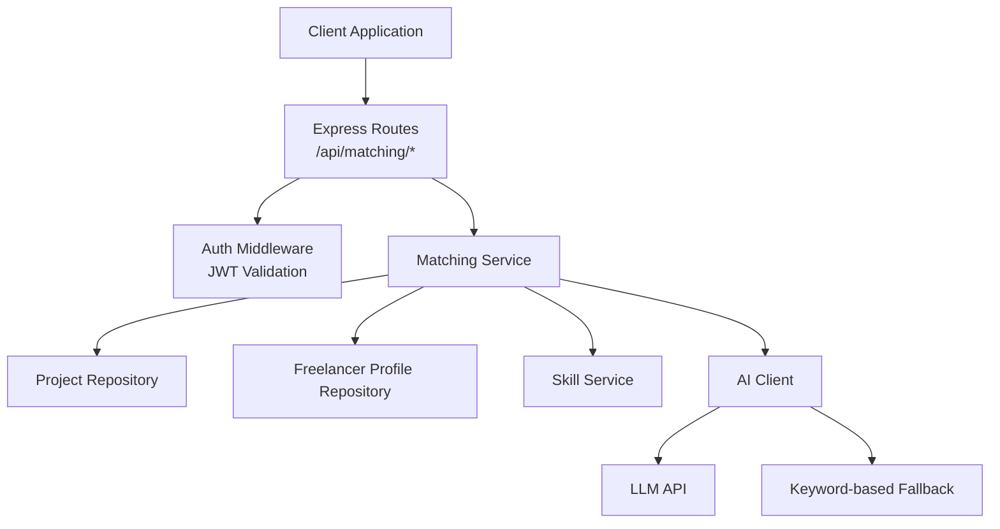
```mermaid
graph TB
Client["Client Application"] --> Routes["Express Routes<br/>/api/matching/*"]
Routes --> Auth["Auth Middleware<br/>JWT Validation"]
Routes --> Service["Matching Service"]
Service --> RepoProj["Project Repository"]
Service --> RepoFP["Freelancer Profile Repository"]
Service --> SkillSvc["Skill Service"]
Service --> AIClient["AI Client"]
AIClient --> LLM["LLM API"]
AIClient --> Fallback["Keyword-based Fallback"]
```

**Diagram sources**
- [matching-routes.ts](file://src/routes/matching-routes.ts#L1-L370)
- [matching-service.ts](file://src/services/matching-service.ts#L1-L391)
- [ai-client.ts](file://src/services/ai-client.ts#L1-L465)
- [auth-middleware.ts](file://src/middleware/auth-middleware.ts#L1-L101)
- [rate-limiter.ts](file://src/middleware/rate-limiter.ts#L1-L81)

**Section sources**
- [matching-routes.ts](file://src/routes/matching-routes.ts#L1-L370)
- [swagger.ts](file://src/config/swagger.ts#L1-L233)

## Core Components
- Matching Routes: Define endpoints for project recommendations, freelancer recommendations, skill extraction, and skill gap analysis. All endpoints require JWT Bearer authentication.
- Matching Service: Implements recommendation logic, integrates AI client, and falls back to keyword-based matching when AI is unavailable.
- AI Client: Manages LLM API connectivity, retries, timeouts, and response parsing. Provides prompts for skill matching, extraction, and gap analysis.
- Authentication Middleware: Validates JWT tokens and attaches user context to requests.
- Rate Limiter: Applies request quotas to protect the API and AI resources.
- Skill Service and Repositories: Provide taxonomy data (active skills) used for mapping and extraction.

**Section sources**
- [matching-routes.ts](file://src/routes/matching-routes.ts#L1-L370)
- [matching-service.ts](file://src/services/matching-service.ts#L1-L391)
- [ai-client.ts](file://src/services/ai-client.ts#L1-L465)
- [auth-middleware.ts](file://src/middleware/auth-middleware.ts#L1-L101)
- [rate-limiter.ts](file://src/middleware/rate-limiter.ts#L1-L81)
- [skill-service.ts](file://src/services/skill-service.ts#L1-L285)
- [skill-repository.ts](file://src/repositories/skill-repository.ts#L1-L127)

## Architecture Overview
The AI Matching API follows a layered architecture:
- Presentation Layer: Express routes define endpoints and handle request validation.
- Application Layer: Matching service coordinates repositories and AI client.
- AI Layer: AI client communicates with LLM API and provides fallbacks.
- Persistence Layer: Supabase-backed repositories manage data access.

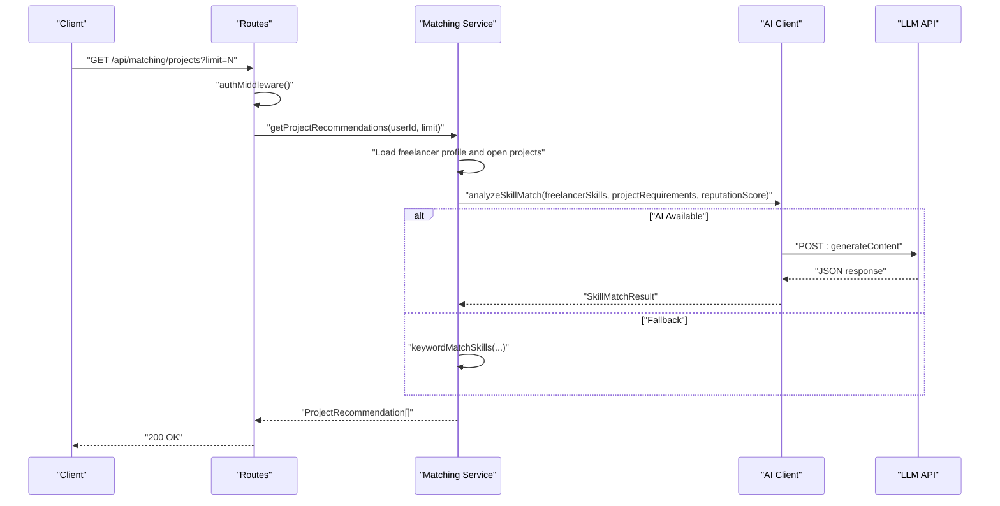
```mermaid
sequenceDiagram
participant C as "Client"
participant R as "Routes"
participant M as "Matching Service"
participant A as "AI Client"
participant P as "LLM API"
C->>R : "GET /api/matching/projects?limit=N"
R->>R : "authMiddleware()"
R->>M : "getProjectRecommendations(userId, limit)"
M->>M : "Load freelancer profile and open projects"
M->>A : "analyzeSkillMatch(freelancerSkills, projectRequirements, reputationScore)"
alt "AI Available"
A->>P : "POST : generateContent"
P-->>A : "JSON response"
A-->>M : "SkillMatchResult"
else "Fallback"
M->>M : "keywordMatchSkills(...)"
end
M-->>R : "ProjectRecommendation[]"
R-->>C : "200 OK"
```

**Diagram sources**
- [matching-routes.ts](file://src/routes/matching-routes.ts#L148-L182)
- [matching-service.ts](file://src/services/matching-service.ts#L73-L141)
- [ai-client.ts](file://src/services/ai-client.ts#L249-L320)

## Detailed Component Analysis

### Authentication and Security
- All matching endpoints require a Bearer token in the Authorization header.
- The auth middleware validates the token and attaches user context to the request.
- The Swagger configuration defines the bearerAuth security scheme.

**Section sources**
- [matching-routes.ts](file://src/routes/matching-routes.ts#L115-L147)
- [auth-middleware.ts](file://src/middleware/auth-middleware.ts#L1-L101)
- [swagger.ts](file://src/config/swagger.ts#L21-L29)

### Rate Limiting
- General API rate limiter: 100 requests per minute per client IP.
- Sensitive operations can use a separate limiter if needed.
- The rate limiter responds with 429 Too Many Requests and Retry-After header.

**Section sources**
- [rate-limiter.ts](file://src/middleware/rate-limiter.ts#L64-L81)

### Endpoint Definitions

#### GET /api/matching/projects
- Purpose: Retrieve AI-powered project recommendations for a freelancer.
- Authentication: JWT Bearer required.
- Query Parameters:
  - limit (integer, default 10, min 1, max 50)
- Response: Array of ProjectRecommendation objects.
- Errors:
  - 401 Unauthorized (invalid or missing token)
  - 404 Not Found (freelancer profile not found)
  - 400 Bad Request (validation errors)

ProjectRecommendation schema:
- projectId: string
- matchScore: number (0–100)
- matchedSkills: string[]
- missingSkills: string[]
- reasoning: string

**Section sources**
- [matching-routes.ts](file://src/routes/matching-routes.ts#L115-L182)
- [matching-service.ts](file://src/services/matching-service.ts#L73-L141)
- [ai-types.ts](file://src/services/ai-types.ts#L72-L88)

#### GET /api/matching/freelancers/{projectId}
- Purpose: Retrieve AI-powered freelancer recommendations for a project.
- Authentication: JWT Bearer required.
- Path Parameters:
  - projectId: string (UUID)
- Query Parameters:
  - limit (integer, default 10, min 1, max 50)
- Response: Array of FreelancerRecommendation objects.
- Errors:
  - 401 Unauthorized (invalid or missing token)
  - 400 Bad Request (invalid UUID or validation)
  - 404 Not Found (project not found)

FreelancerRecommendation schema:
- freelancerId: string
- matchScore: number (0–100)
- reputationScore: number (fixed default in service)
- combinedScore: number (weighted combination)
- matchedSkills: string[]
- reasoning: string

**Section sources**
- [matching-routes.ts](file://src/routes/matching-routes.ts#L184-L268)
- [matching-service.ts](file://src/services/matching-service.ts#L143-L218)
- [ai-types.ts](file://src/services/ai-types.ts#L81-L88)

#### POST /api/matching/extract-skills
- Purpose: Extract skills from text and map them to the platform taxonomy.
- Authentication: JWT Bearer required.
- Request Body:
  - text: string (required)
- Response: Array of ExtractedSkill objects.
- Errors:
  - 400 Bad Request (invalid request)
  - 401 Unauthorized (invalid or missing token)

ExtractedSkill schema:
- skillId: string
- skillName: string
- confidence: number (0–1)

**Section sources**
- [matching-routes.ts](file://src/routes/matching-routes.ts#L270-L325)
- [matching-service.ts](file://src/services/matching-service.ts#L220-L269)
- [ai-types.ts](file://src/services/ai-types.ts#L61-L71)

#### GET /api/matching/skill-gaps
- Purpose: Analyze freelancer’s skills and suggest improvements based on market demand.
- Authentication: JWT Bearer required.
- Response: SkillGapAnalysis object.
- Errors:
  - 401 Unauthorized (invalid or missing token)
  - 404 Not Found (freelancer profile not found)

SkillGapAnalysis schema:
- currentSkills: string[]
- recommendedSkills: string[]
- marketDemand: array of { skillName: string, demandLevel: "high" | "medium" | "low" }
- reasoning: string

**Section sources**
- [matching-routes.ts](file://src/routes/matching-routes.ts#L327-L367)
- [matching-service.ts](file://src/services/matching-service.ts#L271-L353)
- [ai-types.ts](file://src/services/ai-types.ts#L90-L99)

### AI Model Inputs and Outputs

#### Skill Matching (Project Recommendations)
- Inputs:
  - freelancerSkills: array of SkillInfo (skillId, skillName, categoryId, yearsOfExperience)
  - projectRequirements: array of SkillInfo (skillId, skillName, categoryId, yearsOfExperience)
  - reputationScore: number (optional)
- Output:
  - matchScore: number (0–100)
  - matchedSkills: string[]
  - missingSkills: string[]
  - reasoning: string

Fallback behavior:
- If AI is unavailable or fails, the service uses keyword-based matching.

**Section sources**
- [ai-client.ts](file://src/services/ai-client.ts#L249-L320)
- [matching-service.ts](file://src/services/matching-service.ts#L108-L141)

#### Skill Extraction (Text to Taxonomy)
- Inputs:
  - text: string
  - availableSkills: array of SkillInfo (from taxonomy)
- Output:
  - ExtractedSkill[] with confidence (0–1)

Fallback behavior:
- If AI is unavailable or fails, the service uses keyword-based extraction.

**Section sources**
- [ai-client.ts](file://src/services/ai-client.ts#L286-L320)
- [matching-service.ts](file://src/services/matching-service.ts#L220-L269)

#### Skill Gap Analysis
- Inputs:
  - currentSkills: string[] (from freelancer profile)
- Output:
  - currentSkills: string[]
  - recommendedSkills: string[]
  - marketDemand: array of { skillName, demandLevel }
  - reasoning: string

Fallback behavior:
- If AI is unavailable, returns basic analysis with guidance.

**Section sources**
- [ai-client.ts](file://src/services/ai-client.ts#L58-L73)
- [matching-service.ts](file://src/services/matching-service.ts#L271-L353)

### Data Sources Used for Skill Matching and Market Demand
- Active Skills Taxonomy:
  - Provided by the skill service/repository, filtered to is_active = true.
- Freelancer Profile:
  - Skills and experience from freelancer_profiles table (JSONB).
- Project Requirements:
  - required_skills from projects table (JSONB).
- Market Demand:
  - Derived from AI analysis when available; otherwise empty arrays.

**Section sources**
- [skill-service.ts](file://src/services/skill-service.ts#L216-L219)
- [skill-repository.ts](file://src/repositories/skill-repository.ts#L59-L69)
- [schema.sql](file://supabase/schema.sql#L40-L51)
- [schema.sql](file://supabase/schema.sql#L64-L78)

### Client Implementation Examples
Below are conceptual examples of how to integrate AI recommendations into user interfaces. Replace placeholders with your actual API base URL and JWT token.

- Fetch Project Recommendations
  - Method: GET
  - URL: /api/matching/projects?limit=10
  - Headers: Authorization: Bearer <your_jwt>
  - Response: Array of ProjectRecommendation
  - UI Tip: Render cards with matchScore and reasoning; allow filtering by missingSkills.

- Fetch Freelancer Recommendations for a Project
  - Method: GET
  - URL: /api/matching/freelancers/{projectId}?limit=10
  - Headers: Authorization: Bearer <your_jwt>
  - Response: Array of FreelancerRecommendation
  - UI Tip: Sort by combinedScore; show reputationScore overlay.

- Extract Skills from Text
  - Method: POST
  - URL: /api/matching/extract-skills
  - Headers: Authorization: Bearer <your_jwt>, Content-Type: application/json
  - Body: { "text": "..." }
  - Response: Array of ExtractedSkill
  - UI Tip: Display confidence threshold; auto-suggest adding skills to profile.

- Analyze Skill Gaps
  - Method: GET
  - URL: /api/matching/skill-gaps
  - Headers: Authorization: Bearer <your_jwt>
  - Response: SkillGapAnalysis
  - UI Tip: Show recommendedSkills and marketDemand; link to learning resources.

[No sources needed since this section provides conceptual examples]

## Dependency Analysis

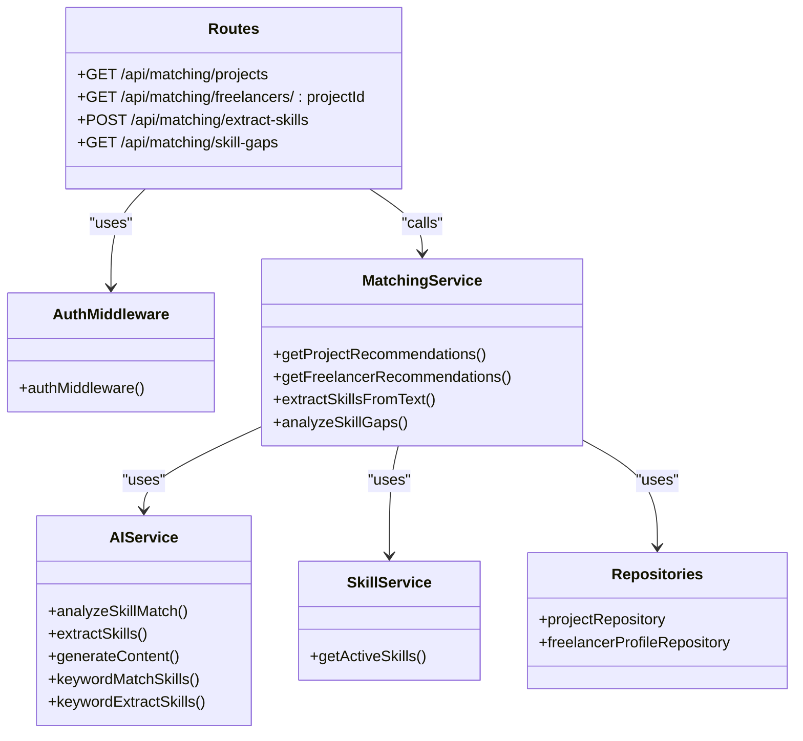
```mermaid
classDiagram
class Routes {
+GET /api/matching/projects
+GET /api/matching/freelancers/ : projectId
+POST /api/matching/extract-skills
+GET /api/matching/skill-gaps
}
class AuthMiddleware {
+authMiddleware()
}
class MatchingService {
+getProjectRecommendations()
+getFreelancerRecommendations()
+extractSkillsFromText()
+analyzeSkillGaps()
}
class AIService {
+analyzeSkillMatch()
+extractSkills()
+generateContent()
+keywordMatchSkills()
+keywordExtractSkills()
}
class SkillService {
+getActiveSkills()
}
class Repositories {
+projectRepository
+freelancerProfileRepository
}
Routes --> AuthMiddleware : "uses"
Routes --> MatchingService : "calls"
MatchingService --> AIService : "uses"
MatchingService --> SkillService : "uses"
MatchingService --> Repositories : "uses"
```

**Diagram sources**
- [matching-routes.ts](file://src/routes/matching-routes.ts#L1-L370)
- [matching-service.ts](file://src/services/matching-service.ts#L1-L391)
- [ai-client.ts](file://src/services/ai-client.ts#L1-L465)
- [skill-service.ts](file://src/services/skill-service.ts#L1-L285)

**Section sources**
- [matching-routes.ts](file://src/routes/matching-routes.ts#L1-L370)
- [matching-service.ts](file://src/services/matching-service.ts#L1-L391)
- [ai-client.ts](file://src/services/ai-client.ts#L1-L465)
- [skill-service.ts](file://src/services/skill-service.ts#L1-L285)

## Performance Considerations
- AI Call Limits:
  - The AI client enforces a request timeout and retry logic with exponential backoff for transient failures.
  - Configure LLM_API_KEY and LLM_API_URL to enable AI features.
- Keyword Fallback:
  - When AI is unavailable, keyword-based matching ensures minimal latency and avoids downtime.
- Recommendation Scope:
  - Project recommendations scan up to 100 open projects; adjust limit via query parameter.
- Rate Limiting:
  - Apply apiRateLimiter to protect the API and downstream LLM costs.

**Section sources**
- [ai-client.ts](file://src/services/ai-client.ts#L97-L165)
- [env.ts](file://src/config/env.ts#L59-L62)
- [rate-limiter.ts](file://src/middleware/rate-limiter.ts#L64-L81)

## Troubleshooting Guide
Common issues and resolutions:
- Unauthorized Access
  - Cause: Missing or invalid Authorization header.
  - Resolution: Ensure Bearer token is present and valid.
- Profile Not Found
  - Cause: Freelancer profile missing for user ID.
  - Resolution: Create a freelancer profile before requesting recommendations.
- AI Unavailable
  - Cause: LLM_API_KEY not configured.
  - Resolution: Set LLM_API_KEY and LLM_API_URL; verify network connectivity.
- AI Response Parsing Errors
  - Cause: Non-JSON or malformed AI response.
  - Resolution: Retry or fall back to keyword-based matching.
- Rate Limit Exceeded
  - Cause: Too many requests within the window.
  - Resolution: Respect Retry-After header and reduce request frequency.

**Section sources**
- [auth-middleware.ts](file://src/middleware/auth-middleware.ts#L25-L70)
- [matching-service.ts](file://src/services/matching-service.ts#L82-L96)
- [ai-client.ts](file://src/services/ai-client.ts#L167-L247)
- [rate-limiter.ts](file://src/middleware/rate-limiter.ts#L30-L60)

## Conclusion
The AI Matching API provides robust, extensible endpoints for skill-based recommendations and analysis. It gracefully degrades to keyword-based matching when AI is unavailable, supports JWT authentication, and applies rate limiting to protect resources. Integrating these endpoints into client applications enables dynamic, data-driven matching experiences for freelancers and employers.

## Appendices

### Environment Variables
- LLM_API_KEY: LLM API key for AI features
- LLM_API_URL: LLM API base URL
- JWT_SECRET: Secret for JWT signing
- SUPABASE_URL, SUPABASE_ANON_KEY: Supabase connection credentials

**Section sources**
- [env.ts](file://src/config/env.ts#L41-L67)

### Example Request/Response Mapping
- Project Recommendations
  - Request: GET /api/matching/projects?limit=10
  - Response: Array of ProjectRecommendation
- Freelancer Recommendations
  - Request: GET /api/matching/freelancers/{projectId}?limit=10
  - Response: Array of FreelancerRecommendation
- Extract Skills
  - Request: POST /api/matching/extract-skills with { text }
  - Response: Array of ExtractedSkill
- Skill Gap Analysis
  - Request: GET /api/matching/skill-gaps
  - Response: SkillGapAnalysis

**Section sources**
- [matching-routes.ts](file://src/routes/matching-routes.ts#L115-L367)
- [API-DOCUMENTATION.md](file://docs/API-DOCUMENTATION.md#L512-L561)

---

# Freelancer Recommendations API

<cite>
**Referenced Files in This Document**
- [matching-routes.ts](file://src/routes/matching-routes.ts)
- [matching-service.ts](file://src/services/matching-service.ts)
- [ai-types.ts](file://src/services/ai-types.ts)
- [ai-client.ts](file://src/services/ai-client.ts)
- [project-repository.ts](file://src/repositories/project-repository.ts)
- [freelancer-profile-repository.ts](file://src/repositories/freelancer-profile-repository.ts)
- [validation-middleware.ts](file://src/middleware/validation-middleware.ts)
- [API-DOCUMENTATION.md](file://docs/API-DOCUMENTATION.md)
</cite>

## Table of Contents
1. [Introduction](#introduction)
2. [Project Structure](#project-structure)
3. [Core Components](#core-components)
4. [Architecture Overview](#architecture-overview)
5. [Detailed Component Analysis](#detailed-component-analysis)
6. [Dependency Analysis](#dependency-analysis)
7. [Performance Considerations](#performance-considerations)
8. [Troubleshooting Guide](#troubleshooting-guide)
9. [Conclusion](#conclusion)
10. [Appendices](#appendices)

## Introduction
This document describes the GET /api/matching/freelancers/{projectId} endpoint for retrieving AI-powered freelancer recommendations for a given project. It covers authentication, path and query parameters, response schema, AI matching logic, error handling, and client implementation guidance for integrating recommendations into a project management interface.

## Project Structure
The endpoint is implemented as part of the matching module:
- Route handler: GET /api/matching/freelancers/:projectId
- Service logic: getFreelancerRecommendations
- Data access: repositories for projects and freelancers
- AI integration: Gemini-based skill matching with fallbacks
- Validation: JWT auth middleware and UUID validation

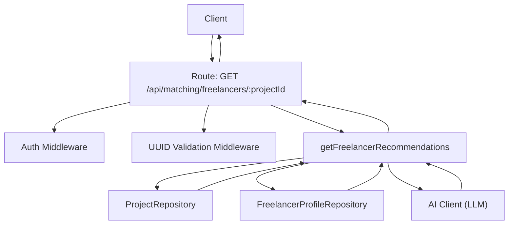
```mermaid
graph TB
Client["Client"] --> Router["Route: GET /api/matching/freelancers/:projectId"]
Router --> AuthMW["Auth Middleware"]
Router --> UUIDMW["UUID Validation Middleware"]
Router --> Service["getFreelancerRecommendations"]
Service --> ProjRepo["ProjectRepository"]
Service --> FreelaRepo["FreelancerProfileRepository"]
Service --> AI["AI Client (LLM)"]
AI --> Service
ProjRepo --> Service
FreelaRepo --> Service
Service --> Router
Router --> Client
```

**Diagram sources**
- [matching-routes.ts](file://src/routes/matching-routes.ts#L184-L268)
- [matching-service.ts](file://src/services/matching-service.ts#L143-L218)
- [project-repository.ts](file://src/repositories/project-repository.ts#L1-L60)
- [freelancer-profile-repository.ts](file://src/repositories/freelancer-profile-repository.ts#L56-L66)
- [ai-client.ts](file://src/services/ai-client.ts#L76-L165)

**Section sources**
- [matching-routes.ts](file://src/routes/matching-routes.ts#L184-L268)
- [matching-service.ts](file://src/services/matching-service.ts#L143-L218)
- [project-repository.ts](file://src/repositories/project-repository.ts#L1-L60)
- [freelancer-profile-repository.ts](file://src/repositories/freelancer-profile-repository.ts#L56-L66)
- [ai-client.ts](file://src/services/ai-client.ts#L76-L165)

## Core Components
- Endpoint: GET /api/matching/freelancers/{projectId}
- Authentication: Bearer token required
- Path parameter: projectId (UUID)
- Query parameter: limit (integer, 1-50, default 10)
- Response: Array of FreelancerRecommendation objects
- AI matching: Skill match score plus reputation weighting
- Error responses: 400 (invalid UUID or limit), 401 (unauthorized), 404 (project not found)

**Section sources**
- [matching-routes.ts](file://src/routes/matching-routes.ts#L184-L268)
- [API-DOCUMENTATION.md](file://docs/API-DOCUMENTATION.md#L537-L541)

## Architecture Overview
The endpoint follows a layered architecture:
- HTTP layer: Express route with middleware
- Service layer: Business logic for recommendation computation
- Data layer: Repositories for projects and freelancers
- AI layer: LLM integration with fallbacks

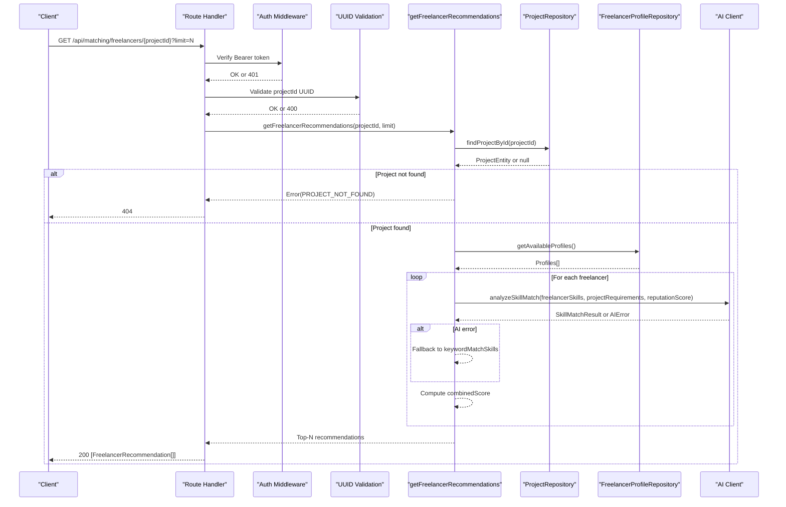
```mermaid
sequenceDiagram
participant C as "Client"
participant R as "Route Handler"
participant M1 as "Auth Middleware"
participant M2 as "UUID Validation"
participant S as "getFreelancerRecommendations"
participant PR as "ProjectRepository"
participant FR as "FreelancerProfileRepository"
participant AI as "AI Client"
C->>R : GET /api/matching/freelancers/{projectId}?limit=N
R->>M1 : Verify Bearer token
M1-->>R : OK or 401
R->>M2 : Validate projectId UUID
M2-->>R : OK or 400
R->>S : getFreelancerRecommendations(projectId, limit)
S->>PR : findProjectById(projectId)
PR-->>S : ProjectEntity or null
alt Project not found
S-->>R : Error(PROJECT_NOT_FOUND)
R-->>C : 404
else Project found
S->>FR : getAvailableProfiles()
FR-->>S : Profiles[]
loop For each freelancer
S->>AI : analyzeSkillMatch(freelancerSkills, projectRequirements, reputationScore)
AI-->>S : SkillMatchResult or AIError
alt AI error
S-->>S : Fallback to keywordMatchSkills
end
S-->>S : Compute combinedScore
end
S-->>R : Top-N recommendations
R-->>C : 200 [FreelancerRecommendation[]]
end
```

**Diagram sources**
- [matching-routes.ts](file://src/routes/matching-routes.ts#L226-L268)
- [matching-service.ts](file://src/services/matching-service.ts#L147-L218)
- [project-repository.ts](file://src/repositories/project-repository.ts#L40-L53)
- [freelancer-profile-repository.ts](file://src/repositories/freelancer-profile-repository.ts#L56-L66)
- [ai-client.ts](file://src/services/ai-client.ts#L76-L165)

## Detailed Component Analysis

### Endpoint Definition
- Method: GET
- Path: /api/matching/freelancers/{projectId}
- Authentication: Required (Bearer token)
- Path parameters:
  - projectId: string, UUID format
- Query parameters:
  - limit: integer, default 10, min 1, max 50
- Response: 200 OK with array of FreelancerRecommendation objects
- Error responses:
  - 400: Invalid UUID format or invalid limit
  - 401: Unauthorized
  - 404: Project not found

**Section sources**
- [matching-routes.ts](file://src/routes/matching-routes.ts#L184-L268)
- [API-DOCUMENTATION.md](file://docs/API-DOCUMENTATION.md#L537-L541)

### Response Schema: FreelancerRecommendation
Each recommendation object includes:
- freelancerId: string (UUID)
- matchScore: number (0-100)
- reputationScore: number (0-100)
- combinedScore: number (weighted average)
- matchedSkills: string[]
- reasoning: string

These fields are produced by the service and returned as-is to clients.

**Section sources**
- [ai-types.ts](file://src/services/ai-types.ts#L81-L88)
- [matching-service.ts](file://src/services/matching-service.ts#L197-L211)

### AI Matching Logic and Weighting
The service computes a combined score by combining:
- Skill match score (0-100)
- Blockchain-verified reputation score (0-100)
Weighting constants:
- SKILL_MATCH_WEIGHT: 0.7
- REPUTATION_WEIGHT: 0.3
combinedScore = floor(matchScore × 0.7 + reputationScore × 0.3)

Fallback behavior:
- If AI is available, use analyzeSkillMatch; on AI error, fall back to keywordMatchSkills
- If AI is unavailable, use keywordMatchSkills

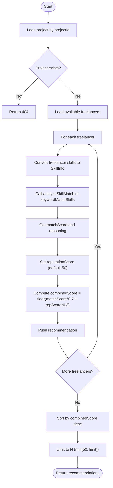
```mermaid
flowchart TD
Start(["Start"]) --> LoadProj["Load project by projectId"]
LoadProj --> ProjFound{"Project exists?"}
ProjFound --> |No| Err404["Return 404"]
ProjFound --> |Yes| LoadFrela["Load available freelancers"]
LoadFrela --> Loop["For each freelancer"]
Loop --> FetchSkills["Convert freelancer skills to SkillInfo"]
FetchSkills --> CallAI["Call analyzeSkillMatch or keywordMatchSkills"]
CallAI --> Score["Get matchScore and reasoning"]
Score --> RepScore["Set reputationScore (default 50)"]
RepScore --> Combine["Compute combinedScore = floor(matchScore*0.7 + repScore*0.3)"]
Combine --> Push["Push recommendation"]
Push --> Next{"More freelancers?"}
Next --> |Yes| Loop
Next --> |No| Sort["Sort by combinedScore desc"]
Sort --> Limit["Limit to N (min(50, limit))"]
Limit --> Done(["Return recommendations"])
```

**Diagram sources**
- [matching-service.ts](file://src/services/matching-service.ts#L147-L218)
- [ai-client.ts](file://src/services/ai-client.ts#L76-L165)

**Section sources**
- [matching-service.ts](file://src/services/matching-service.ts#L39-L42)
- [matching-service.ts](file://src/services/matching-service.ts#L197-L211)
- [ai-client.ts](file://src/services/ai-client.ts#L76-L165)

### Validation and Error Handling
- Path parameter validation:
  - projectId must be a valid UUID; otherwise 400
- Query parameter validation:
  - limit must be a positive integer; otherwise 400
  - limit is capped at 50
- Project existence:
  - If project not found, return 404
- Authentication:
  - Missing or invalid token returns 401

**Section sources**
- [matching-routes.ts](file://src/routes/matching-routes.ts#L226-L268)
- [validation-middleware.ts](file://src/middleware/validation-middleware.ts#L778-L815)

### Example Request and Response

- Example request:
  - GET /api/matching/freelancers/{projectId}?limit=20
  - Headers: Authorization: Bearer <JWT>
  - Path parameter: projectId = a valid UUID
  - Query parameter: limit = 20

- Example response (array of recommendations):
  - [
      {
        "freelancerId": "f1c2d3e4-a5b6-c7d8-e9f0-a1b2c3d4e5f6",
        "matchScore": 87,
        "reputationScore": 65,
        "combinedScore": 76,
        "matchedSkills": ["React", "Node.js"],
        "reasoning": "Strong alignment on frontend/backend stack and sufficient experience."
      },
      {
        "freelancerId": "a2b3c4d5-b6c7-d8e9-f0a1-b2c3d4e5f6a7",
        "matchScore": 82,
        "reputationScore": 72,
        "combinedScore": 78,
        "matchedSkills": ["PostgreSQL", "GraphQL"],
        "reasoning": "High skill match on database and API technologies."
      }
    ]

Notes:
- The endpoint returns up to limit recommendations (default 10, max 50).
- The combinedScore reflects the weighted combination of skill match and reputation.

**Section sources**
- [matching-routes.ts](file://src/routes/matching-routes.ts#L226-L268)
- [matching-service.ts](file://src/services/matching-service.ts#L197-L211)
- [API-DOCUMENTATION.md](file://docs/API-DOCUMENTATION.md#L537-L541)

### Client Implementation Guidance
Recommended UI features for a project management interface:
- Display recommendations in a sortable table with columns:
  - Freelancer name/avatar (from user profile)
  - combinedScore (primary sort)
  - matchScore
  - reputationScore
  - matchedSkills (comma-separated)
  - reasoning (tooltip or expandable)
- Filtering options:
  - Filter by minimum combinedScore or matchScore thresholds
  - Filter by specific matchedSkills
- Actions:
  - View profile details
  - Contact freelancer (via messaging or proposal submission)
  - Submit a proposal to shortlisted freelancers
- UX tips:
  - Highlight top recommendations visually
  - Show “reasoning” as a tooltip to explain scoring
  - Allow bulk selection for mass outreach

[No sources needed since this section provides general guidance]

## Dependency Analysis
The endpoint depends on:
- Route handler for routing and middleware
- Service layer for recommendation computation
- Repositories for data access
- AI client for skill matching
- Validation middleware for UUID checks

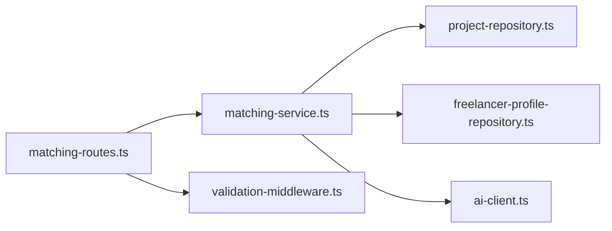
```mermaid
graph LR
Routes["matching-routes.ts"] --> Service["matching-service.ts"]
Service --> ProjRepo["project-repository.ts"]
Service --> FreelaRepo["freelancer-profile-repository.ts"]
Service --> AI["ai-client.ts"]
Routes --> Val["validation-middleware.ts"]
```

**Diagram sources**
- [matching-routes.ts](file://src/routes/matching-routes.ts#L184-L268)
- [matching-service.ts](file://src/services/matching-service.ts#L143-L218)
- [project-repository.ts](file://src/repositories/project-repository.ts#L1-L60)
- [freelancer-profile-repository.ts](file://src/repositories/freelancer-profile-repository.ts#L56-L66)
- [validation-middleware.ts](file://src/middleware/validation-middleware.ts#L778-L815)

**Section sources**
- [matching-routes.ts](file://src/routes/matching-routes.ts#L184-L268)
- [matching-service.ts](file://src/services/matching-service.ts#L143-L218)
- [project-repository.ts](file://src/repositories/project-repository.ts#L1-L60)
- [freelancer-profile-repository.ts](file://src/repositories/freelancer-profile-repository.ts#L56-L66)
- [validation-middleware.ts](file://src/middleware/validation-middleware.ts#L778-L815)

## Performance Considerations
- Recommendation computation loops over available freelancers; consider pagination or caching for large datasets.
- AI calls are asynchronous with retries and timeouts; ensure client-side retry/backoff policies.
- Sorting and slicing occur server-side; keep limit reasonable (≤50) to avoid heavy computations.

[No sources needed since this section provides general guidance]

## Troubleshooting Guide
Common issues and resolutions:
- 400 Bad Request:
  - Invalid UUID for projectId
  - Invalid limit (non-positive or out of range)
- 401 Unauthorized:
  - Missing or invalid Bearer token
- 404 Not Found:
  - Project does not exist
- AI-related issues:
  - If AI is unavailable or returns errors, the service falls back to keyword-based matching

**Section sources**
- [matching-routes.ts](file://src/routes/matching-routes.ts#L226-L268)
- [validation-middleware.ts](file://src/middleware/validation-middleware.ts#L778-L815)
- [matching-service.ts](file://src/services/matching-service.ts#L176-L211)
- [ai-client.ts](file://src/services/ai-client.ts#L76-L165)

## Conclusion
The GET /api/matching/freelancers/{projectId} endpoint provides employer-facing recommendations by combining AI-driven skill matching with a reputation weighting. It enforces JWT authentication, validates UUIDs and limits, and returns a ranked list of freelancers suitable for the specified project. Clients should display recommendations with filtering and contact actions to streamline hiring decisions.

[No sources needed since this section summarizes without analyzing specific files]

## Appendices

### API Definition Summary
- Method: GET
- Path: /api/matching/freelancers/{projectId}
- Auth: Bearer token
- Path params:
  - projectId: UUID
- Query params:
  - limit: integer, default 10, min 1, max 50
- Response: 200 OK with array of FreelancerRecommendation
- Errors: 400 (invalid UUID or limit), 401 (unauthorized), 404 (project not found)

**Section sources**
- [matching-routes.ts](file://src/routes/matching-routes.ts#L184-L268)
- [API-DOCUMENTATION.md](file://docs/API-DOCUMENTATION.md#L537-L541)

---

# Project Recommendations API

<cite>
**Referenced Files in This Document**
- [matching-routes.ts](file://src/routes/matching-routes.ts)
- [matching-service.ts](file://src/services/matching-service.ts)
- [ai-client.ts](file://src/services/ai-client.ts)
- [ai-types.ts](file://src/services/ai-types.ts)
- [auth-middleware.ts](file://src/middleware/auth-middleware.ts)
- [swagger.ts](file://src/config/swagger.ts)
- [API-DOCUMENTATION.md](file://docs/API-DOCUMENTATION.md)
- [project-repository.ts](file://src/repositories/project-repository.ts)
- [entity-mapper.ts](file://src/utils/entity-mapper.ts)
</cite>

## Table of Contents
1. [Introduction](#introduction)
2. [Project Structure](#project-structure)
3. [Core Components](#core-components)
4. [Architecture Overview](#architecture-overview)
5. [Detailed Component Analysis](#detailed-component-analysis)
6. [Dependency Analysis](#dependency-analysis)
7. [Performance Considerations](#performance-considerations)
8. [Troubleshooting Guide](#troubleshooting-guide)
9. [Conclusion](#conclusion)
10. [Appendices](#appendices)

## Introduction
This document provides comprehensive API documentation for the GET /api/matching/projects endpoint in the FreelanceXchain system. It covers authentication requirements, query parameter validation, response schema, AI matching logic, error handling, and client integration guidance for building a dashboard UI that displays project recommendations.

## Project Structure
The recommendations endpoint is implemented as part of the matching module:
- Route handler: GET /api/matching/projects
- Middleware: JWT authentication
- Service: AI-powered skill matching between freelancer and open projects
- AI client: LLM integration with fallback logic
- Repositories: Access to project and freelancer profile data

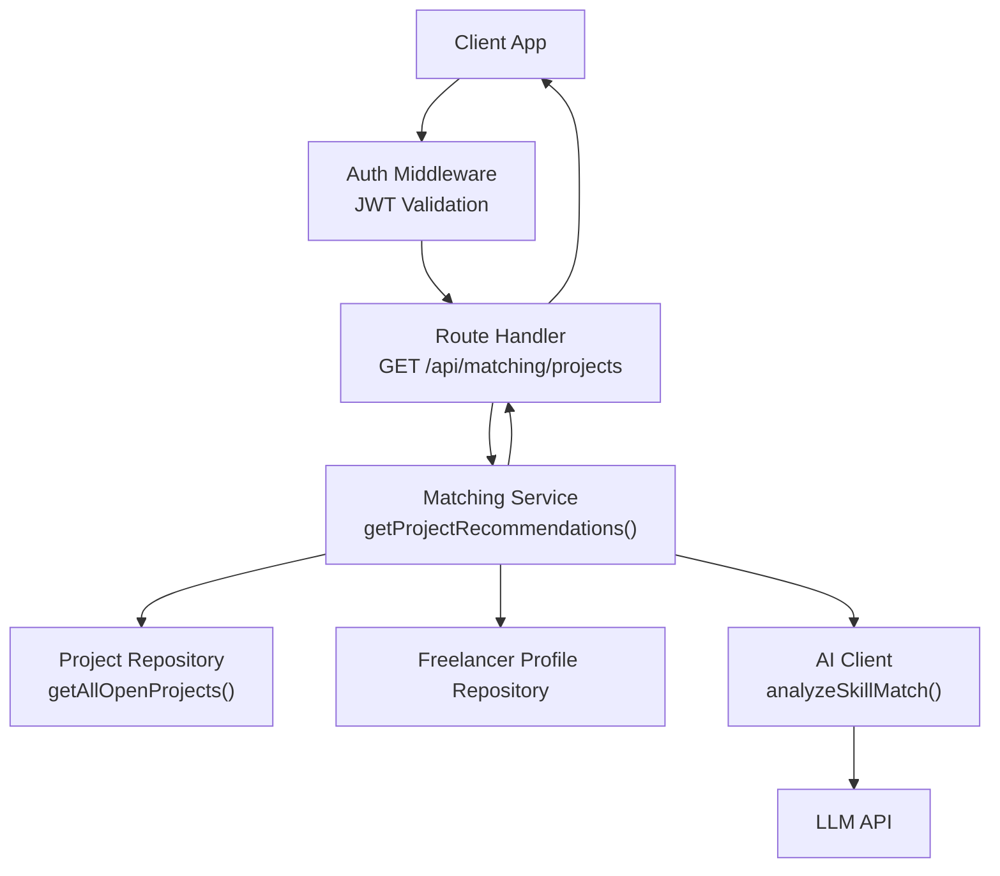
```mermaid
graph TB
Client["Client App"] --> Auth["Auth Middleware<br/>JWT Validation"]
Auth --> Route["Route Handler<br/>GET /api/matching/projects"]
Route --> Service["Matching Service<br/>getProjectRecommendations()"]
Service --> RepoProj["Project Repository<br/>getAllOpenProjects()"]
Service --> RepoProf["Freelancer Profile Repository"]
Service --> AI["AI Client<br/>analyzeSkillMatch()"]
AI --> LLM["LLM API"]
Service --> Route
Route --> Client
```

**Diagram sources**
- [matching-routes.ts](file://src/routes/matching-routes.ts#L148-L182)
- [matching-service.ts](file://src/services/matching-service.ts#L77-L141)
- [project-repository.ts](file://src/repositories/project-repository.ts#L76-L95)
- [ai-client.ts](file://src/services/ai-client.ts#L250-L319)

**Section sources**
- [matching-routes.ts](file://src/routes/matching-routes.ts#L148-L182)
- [swagger.ts](file://src/config/swagger.ts#L21-L28)

## Core Components
- Endpoint: GET /api/matching/projects
- Authentication: Bearer JWT token required
- Query parameter:
  - limit: integer, default 10, minimum 1, maximum 50
- Response: Array of ProjectRecommendation objects
- Error responses:
  - 401 Unauthorized (invalid or missing token)
  - 404 Not Found (freelancer profile not found)

**Section sources**
- [matching-routes.ts](file://src/routes/matching-routes.ts#L115-L147)
- [auth-middleware.ts](file://src/middleware/auth-middleware.ts#L25-L70)
- [API-DOCUMENTATION.md](file://docs/API-DOCUMENTATION.md#L512-L536)

## Architecture Overview
The endpoint follows a layered architecture:
- Route layer validates JWT and parses query parameters
- Service layer orchestrates data fetching and AI matching
- Repository layer retrieves open projects and freelancer profile
- AI client layer interacts with LLM API and provides fallbacks

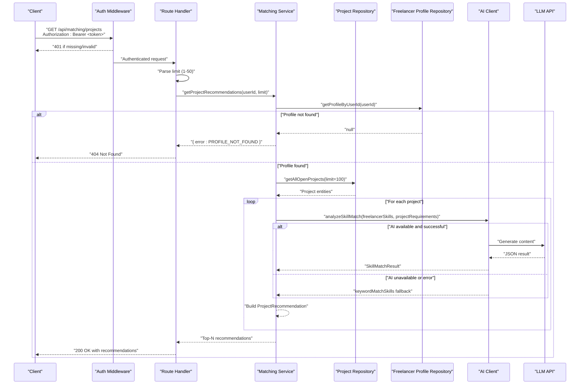
```mermaid
sequenceDiagram
participant C as "Client"
participant M as "Auth Middleware"
participant R as "Route Handler"
participant S as "Matching Service"
participant P as "Project Repository"
participant F as "Freelancer Profile Repository"
participant A as "AI Client"
participant L as "LLM API"
C->>M : "GET /api/matching/projects<br/>Authorization : Bearer <token>"
M-->>C : "401 if missing/invalid"
M->>R : "Authenticated request"
R->>R : "Parse limit (1-50)"
R->>S : "getProjectRecommendations(userId, limit)"
S->>F : "getProfileByUserId(userId)"
alt "Profile not found"
F-->>S : "null"
S-->>R : "{ error : PROFILE_NOT_FOUND }"
R-->>C : "404 Not Found"
else "Profile found"
S->>P : "getAllOpenProjects(limit=100)"
P-->>S : "Project entities"
loop "For each project"
S->>A : "analyzeSkillMatch(freelancerSkills, projectRequirements)"
alt "AI available and successful"
A->>L : "Generate content"
L-->>A : "JSON result"
A-->>S : "SkillMatchResult"
else "AI unavailable or error"
A-->>S : "keywordMatchSkills fallback"
end
S-->>S : "Build ProjectRecommendation"
end
S-->>R : "Top-N recommendations"
R-->>C : "200 OK with recommendations"
end
```

**Diagram sources**
- [matching-routes.ts](file://src/routes/matching-routes.ts#L148-L182)
- [matching-service.ts](file://src/services/matching-service.ts#L77-L141)
- [project-repository.ts](file://src/repositories/project-repository.ts#L76-L95)
- [ai-client.ts](file://src/services/ai-client.ts#L250-L319)

## Detailed Component Analysis

### Endpoint Definition
- Method: GET
- Path: /api/matching/projects
- Authentication: Required (Bearer JWT)
- Query parameters:
  - limit: integer, default 10, minimum 1, maximum 50
- Response: Array of ProjectRecommendation objects

**Section sources**
- [matching-routes.ts](file://src/routes/matching-routes.ts#L115-L147)
- [swagger.ts](file://src/config/swagger.ts#L21-L28)

### Request Flow and Validation
- JWT validation performed by auth middleware
- limit parameter parsing and validation:
  - If provided, must be a positive integer
  - Clamped to maximum 50
  - Default 10 if omitted

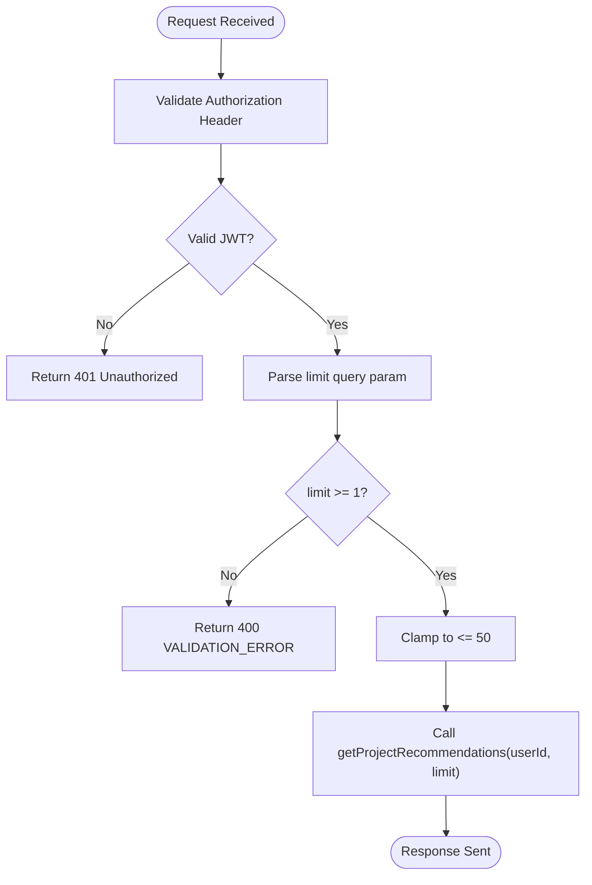
```mermaid
flowchart TD
Start(["Request Received"]) --> CheckAuth["Validate Authorization Header"]
CheckAuth --> AuthOK{"Valid JWT?"}
AuthOK --> |No| Err401["Return 401 Unauthorized"]
AuthOK --> |Yes| ParseLimit["Parse limit query param"]
ParseLimit --> LimitValid{"limit >= 1?"}
LimitValid --> |No| Err400["Return 400 VALIDATION_ERROR"]
LimitValid --> |Yes| Clamp["Clamp to <= 50"]
Clamp --> CallSvc["Call getProjectRecommendations(userId, limit)"]
CallSvc --> End(["Response Sent"])
```

**Diagram sources**
- [auth-middleware.ts](file://src/middleware/auth-middleware.ts#L25-L70)
- [matching-routes.ts](file://src/routes/matching-routes.ts#L153-L167)

**Section sources**
- [matching-routes.ts](file://src/routes/matching-routes.ts#L148-L182)

### Response Schema: ProjectRecommendation
Each recommendation object includes:
- projectId: string
- matchScore: number (0-100)
- matchedSkills: string[]
- missingSkills: string[]
- reasoning: string

These fields are populated by the AI matching result and returned directly to clients.

**Section sources**
- [ai-types.ts](file://src/services/ai-types.ts#L72-L88)
- [matching-service.ts](file://src/services/matching-service.ts#L127-L133)

### AI Matching Logic
The system computes match scores using either:
- LLM-powered analysis when API key is configured
- Keyword-based matching as fallback

Key steps:
- Retrieve freelancer profile and convert skills to SkillInfo
- Fetch up to 100 open projects
- For each project, convert required skills to SkillInfo
- Compute match score:
  - If AI available: analyzeSkillMatch
  - Else: keywordMatchSkills
- Sort recommendations by matchScore descending
- Return top N (limit)

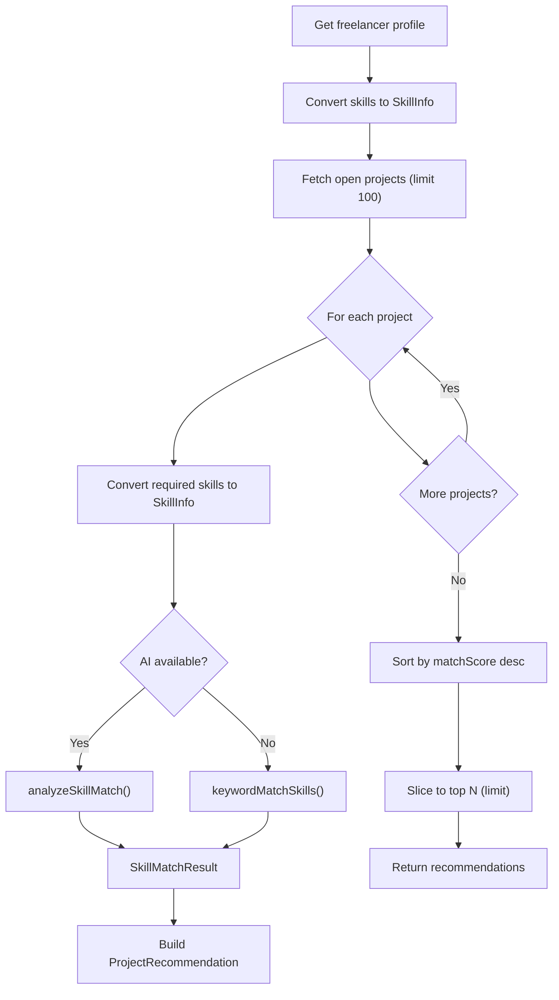
```mermaid
flowchart TD
A["Get freelancer profile"] --> B["Convert skills to SkillInfo"]
B --> C["Fetch open projects (limit 100)"]
C --> D{"For each project"}
D --> E["Convert required skills to SkillInfo"]
E --> F{"AI available?"}
F --> |Yes| G["analyzeSkillMatch()"]
F --> |No| H["keywordMatchSkills()"]
G --> I["SkillMatchResult"]
H --> I
I --> J["Build ProjectRecommendation"]
D --> K{"More projects?"}
K --> |Yes| D
K --> |No| L["Sort by matchScore desc"]
L --> M["Slice to top N (limit)"]
M --> N["Return recommendations"]
```

**Diagram sources**
- [matching-service.ts](file://src/services/matching-service.ts#L77-L141)
- [ai-client.ts](file://src/services/ai-client.ts#L250-L319)

**Section sources**
- [matching-service.ts](file://src/services/matching-service.ts#L77-L141)
- [ai-client.ts](file://src/services/ai-client.ts#L250-L319)

### Error Handling
- 401 Unauthorized:
  - Missing Authorization header
  - Invalid Bearer format
  - Invalid/expired token
- 404 Not Found:
  - Freelancer profile not found when computing recommendations
- Validation errors:
  - limit must be a positive integer

**Section sources**
- [auth-middleware.ts](file://src/middleware/auth-middleware.ts#L25-L70)
- [matching-routes.ts](file://src/routes/matching-routes.ts#L153-L178)
- [matching-service.ts](file://src/services/matching-service.ts#L82-L88)

### Example Request and Response

- Example request:
  - GET /api/matching/projects?limit=15
  - Authorization: Bearer <your_jwt_token>

- Example response (sample):
  - 200 OK
  - Body: Array of ProjectRecommendation objects

Note: The repository’s API documentation shows a different response shape with a recommendations array and nested project object. However, the route handler and service return the ProjectRecommendation objects directly as an array. The example below reflects the actual implementation.

```json
[
  {
    "projectId": "project-uuid-1",
    "matchScore": 92,
    "matchedSkills": ["React", "Node.js"],
    "missingSkills": ["GraphQL"],
    "reasoning": "High match on frontend/backend stack; missing specialized GraphQL skill."
  },
  {
    "projectId": "project-uuid-2",
    "matchScore": 78,
    "matchedSkills": ["TypeScript", "PostgreSQL"],
    "missingSkills": ["AWS", "Docker"],
    "reasoning": "Strong technical alignment; suggests cloud/container skills for scalability."
  }
]
```

**Section sources**
- [matching-routes.ts](file://src/routes/matching-routes.ts#L148-L182)
- [matching-service.ts](file://src/services/matching-service.ts#L127-L141)
- [ai-types.ts](file://src/services/ai-types.ts#L72-L88)

## Dependency Analysis
The endpoint depends on:
- Route handler for JWT validation and parameter parsing
- Matching service for orchestration and scoring
- AI client for LLM integration and fallbacks
- Repositories for data access

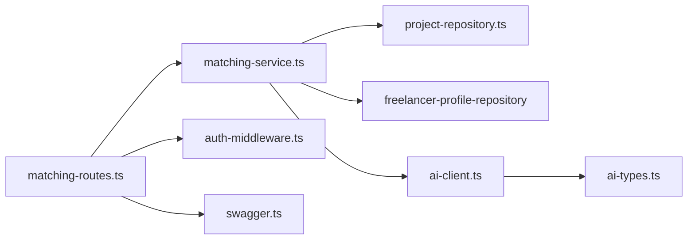
```mermaid
graph LR
Routes["matching-routes.ts"] --> Service["matching-service.ts"]
Service --> RepoProj["project-repository.ts"]
Service --> RepoProf["freelancer-profile-repository"]
Service --> AI["ai-client.ts"]
AI --> Types["ai-types.ts"]
Routes --> Auth["auth-middleware.ts"]
Routes --> Swagger["swagger.ts"]
```

**Diagram sources**
- [matching-routes.ts](file://src/routes/matching-routes.ts#L148-L182)
- [matching-service.ts](file://src/services/matching-service.ts#L77-L141)
- [ai-client.ts](file://src/services/ai-client.ts#L250-L319)
- [auth-middleware.ts](file://src/middleware/auth-middleware.ts#L25-L70)
- [swagger.ts](file://src/config/swagger.ts#L21-L28)

**Section sources**
- [matching-routes.ts](file://src/routes/matching-routes.ts#L148-L182)
- [matching-service.ts](file://src/services/matching-service.ts#L77-L141)
- [ai-client.ts](file://src/services/ai-client.ts#L250-L319)
- [auth-middleware.ts](file://src/middleware/auth-middleware.ts#L25-L70)
- [swagger.ts](file://src/config/swagger.ts#L21-L28)

## Performance Considerations
- The service fetches up to 100 open projects and computes match scores for each, then sorts and slices to top N. This is efficient for typical workloads but consider:
  - Limiting limit to reasonable values (already enforced at 50)
  - Ensuring AI API key is configured to leverage LLM scoring
  - Caching frequently accessed freelancer profiles and project lists at higher layers if needed
- Network latency to LLM API impacts response time; implement retries and timeouts as configured

[No sources needed since this section provides general guidance]

## Troubleshooting Guide
Common issues and resolutions:
- 401 Unauthorized:
  - Verify Authorization header format: Bearer <token>
  - Ensure token is not expired
  - Confirm user role allows access
- 400 Bad Request (limit validation):
  - Ensure limit is a positive integer and ≤ 50
- 404 Not Found:
  - Ensure freelancer profile exists for the user
- 5xx errors:
  - LLM API unconfigured or unreachable
  - Retry after network stabilization

**Section sources**
- [auth-middleware.ts](file://src/middleware/auth-middleware.ts#L25-L70)
- [matching-routes.ts](file://src/routes/matching-routes.ts#L153-L178)
- [matching-service.ts](file://src/services/matching-service.ts#L82-L88)
- [ai-client.ts](file://src/services/ai-client.ts#L100-L165)

## Conclusion
The GET /api/matching/projects endpoint provides AI-driven project recommendations for freelancers. It enforces JWT authentication, validates the limit parameter, and returns a ranked list of recommendations with match scores, matched skills, missing skills, and reasoning. The system gracefully falls back to keyword-based matching when AI is unavailable and maintains clear error responses for common failure modes.

[No sources needed since this section summarizes without analyzing specific files]

## Appendices

### Client Implementation Guidance
- Authentication:
  - Store JWT securely (e.g., HttpOnly cookies or secure storage)
  - Attach Authorization header with each request
- Request:
  - Use GET /api/matching/projects?limit=N
  - Respect limit bounds (1-50)
- UI Integration:
  - Loading state: Show skeleton cards while fetching
  - Pagination: Use limit and server-side sorting by matchScore
  - Error handling: Display user-friendly messages for 401/404/400
  - Recommendations display: Show matchScore, matchedSkills, missingSkills, and reasoning
- Best practices:
  - Debounce repeated requests
  - Cache recent results for the same user
  - Provide “Try again” action for transient AI errors

[No sources needed since this section provides general guidance]

---

# Skill Extraction API

<cite>
**Referenced Files in This Document**
- [matching-routes.ts](file://src/routes/matching-routes.ts)
- [matching-service.ts](file://src/services/matching-service.ts)
- [ai-client.ts](file://src/services/ai-client.ts)
- [ai-types.ts](file://src/services/ai-types.ts)
- [env.ts](file://src/config/env.ts)
- [schema.sql](file://supabase/schema.sql)
- [API-DOCUMENTATION.md](file://docs/API-DOCUMENTATION.md)
</cite>

## Table of Contents
1. [Introduction](#introduction)
2. [Project Structure](#project-structure)
3. [Core Components](#core-components)
4. [Architecture Overview](#architecture-overview)
5. [Detailed Component Analysis](#detailed-component-analysis)
6. [Dependency Analysis](#dependency-analysis)
7. [Performance Considerations](#performance-considerations)
8. [Troubleshooting Guide](#troubleshooting-guide)
9. [Conclusion](#conclusion)
10. [Appendices](#appendices)

## Introduction
This document provides comprehensive API documentation for the skill extraction endpoint in the FreelanceXchain system. It covers the POST /api/matching/extract-skills endpoint, including authentication requirements, request/response schemas, the AI processing pipeline powered by Google Gemini, error handling, and practical client integration guidance for profile creation and project posting workflows.

## Project Structure
The skill extraction feature spans routing, service logic, AI client integration, and configuration. The endpoint is defined under the matching routes module and delegates to the matching service, which orchestrates AI extraction and keyword fallback logic. Environment variables configure the LLM API integration.

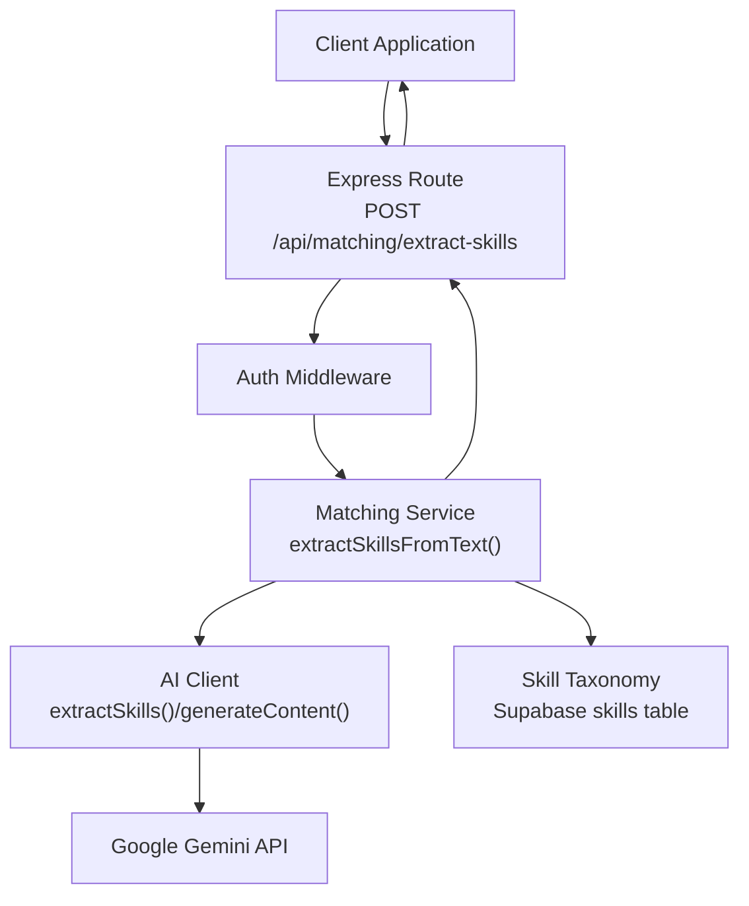
```mermaid
graph TB
Client["Client Application"] --> Routes["Express Route<br/>POST /api/matching/extract-skills"]
Routes --> Middleware["Auth Middleware"]
Middleware --> Service["Matching Service<br/>extractSkillsFromText()"]
Service --> AI["AI Client<br/>extractSkills()/generateContent()"]
AI --> LLM["Google Gemini API"]
Service --> DB["Skill Taxonomy<br/>Supabase skills table"]
Service --> Routes
Routes --> Client
```

**Diagram sources**
- [matching-routes.ts](file://src/routes/matching-routes.ts#L270-L325)
- [matching-service.ts](file://src/services/matching-service.ts#L220-L269)
- [ai-client.ts](file://src/services/ai-client.ts#L285-L319)
- [schema.sql](file://supabase/schema.sql#L29-L38)

**Section sources**
- [matching-routes.ts](file://src/routes/matching-routes.ts#L270-L325)
- [matching-service.ts](file://src/services/matching-service.ts#L220-L269)
- [ai-client.ts](file://src/services/ai-client.ts#L285-L319)
- [schema.sql](file://supabase/schema.sql#L29-L38)

## Core Components
- Endpoint: POST /api/matching/extract-skills
- Authentication: Bearer JWT token required
- Request body: JSON object with a required string field text
- Response: Array of ExtractedSkill objects with skillId, skillName, and confidence fields
- AI Pipeline: Uses Google Gemini via the AI client; falls back to keyword extraction if AI is unavailable

**Section sources**
- [matching-routes.ts](file://src/routes/matching-routes.ts#L270-L325)
- [API-DOCUMENTATION.md](file://docs/API-DOCUMENTATION.md#L540-L548)
- [ai-types.ts](file://src/services/ai-types.ts#L61-L71)

## Architecture Overview
The skill extraction pipeline integrates the Express route, authentication middleware, matching service, AI client, and the Supabase skill taxonomy. The service retrieves active skills from the taxonomy, attempts AI extraction, and falls back to keyword-based extraction when AI is unavailable.

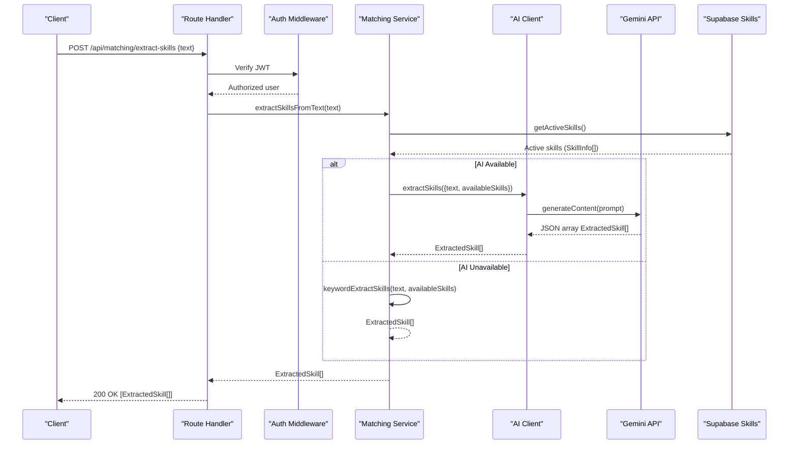
```mermaid
sequenceDiagram
participant C as "Client"
participant R as "Route Handler"
participant M as "Auth Middleware"
participant S as "Matching Service"
participant A as "AI Client"
participant G as "Gemini API"
participant D as "Supabase Skills"
C->>R : POST /api/matching/extract-skills {text}
R->>M : Verify JWT
M-->>R : Authorized user
R->>S : extractSkillsFromText(text)
S->>D : getActiveSkills()
D-->>S : Active skills (SkillInfo[])
alt AI Available
S->>A : extractSkills({text, availableSkills})
A->>G : generateContent(prompt)
G-->>A : JSON array ExtractedSkill[]
A-->>S : ExtractedSkill[]
else AI Unavailable
S->>S : keywordExtractSkills(text, availableSkills)
S-->>S : ExtractedSkill[]
end
S-->>R : ExtractedSkill[]
R-->>C : 200 OK [ExtractedSkill[]]
```

**Diagram sources**
- [matching-routes.ts](file://src/routes/matching-routes.ts#L300-L325)
- [matching-service.ts](file://src/services/matching-service.ts#L220-L269)
- [ai-client.ts](file://src/services/ai-client.ts#L285-L319)
- [schema.sql](file://supabase/schema.sql#L29-L38)

## Detailed Component Analysis

### Endpoint Definition and Authentication
- Method: POST
- Path: /api/matching/extract-skills
- Authentication: Requires a Bearer token in the Authorization header
- Request body:
  - text: string (required)
- Response:
  - Array of ExtractedSkill objects:
    - skillId: string
    - skillName: string
    - confidence: number (0–1)

Error responses:
- 400 Bad Request: Missing or invalid text input
- 401 Unauthorized: Missing or invalid JWT token

**Section sources**
- [matching-routes.ts](file://src/routes/matching-routes.ts#L270-L325)
- [API-DOCUMENTATION.md](file://docs/API-DOCUMENTATION.md#L540-L548)

### AI Processing Pipeline
The pipeline uses Google Gemini to extract skills from unstructured text and map them to the platform’s standardized skill taxonomy. It follows a two-stage approach:
1. AI Extraction: Sends a structured prompt to Gemini with the input text and the active skill taxonomy. Gemini responds with a JSON array of ExtractedSkill objects.
2. Fallback: If AI is unavailable or fails, the service performs keyword-based extraction against the active skills.

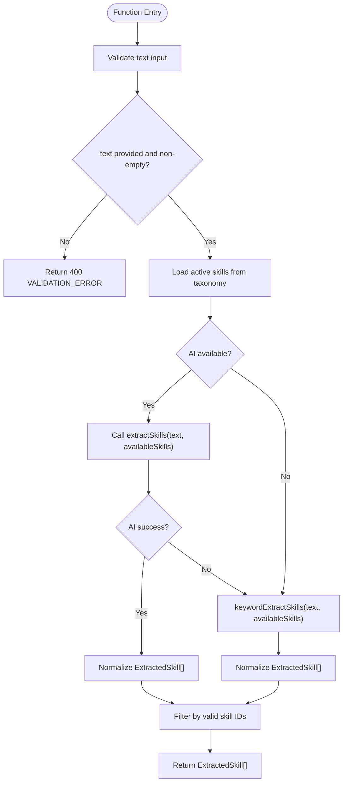
```mermaid
flowchart TD
Start(["Function Entry"]) --> Validate["Validate text input"]
Validate --> TextValid{"text provided and non-empty?"}
TextValid --> |No| Return400["Return 400 VALIDATION_ERROR"]
TextValid --> |Yes| LoadTaxonomy["Load active skills from taxonomy"]
LoadTaxonomy --> AIEnabled{"AI available?"}
AIEnabled --> |Yes| CallAI["Call extractSkills(text, availableSkills)"]
CallAI --> AIResult{"AI success?"}
AIResult --> |Yes| NormalizeAI["Normalize ExtractedSkill[]"]
AIResult --> |No| KeywordFallback["keywordExtractSkills(text, availableSkills)"]
AIEnabled --> |No| KeywordFallback
KeywordFallback --> NormalizeKeywords["Normalize ExtractedSkill[]"]
NormalizeAI --> Filter["Filter by valid skill IDs"]
NormalizeKeywords --> Filter
Filter --> Return200["Return ExtractedSkill[]"]
```

**Diagram sources**
- [matching-service.ts](file://src/services/matching-service.ts#L220-L269)
- [ai-client.ts](file://src/services/ai-client.ts#L285-L319)
- [ai-client.ts](file://src/services/ai-client.ts#L360-L384)

**Section sources**
- [matching-service.ts](file://src/services/matching-service.ts#L220-L269)
- [ai-client.ts](file://src/services/ai-client.ts#L285-L319)
- [ai-client.ts](file://src/services/ai-client.ts#L360-L384)

### Data Models and Schemas
- ExtractedSkill: skillId, skillName, confidence
- SkillExtractionRequest: text, availableSkills (SkillInfo[])
- SkillInfo: skillId, skillName, categoryId?, yearsOfExperience?

These types define the shape of requests and responses exchanged between the route, service, and AI client.

**Section sources**
- [ai-types.ts](file://src/services/ai-types.ts#L61-L71)
- [ai-types.ts](file://src/services/ai-types.ts#L40-L58)

### Skill Taxonomy and Validation
The service loads active skills from the Supabase skills table to form the taxonomy used for mapping. The service filters extracted skills to ensure their IDs correspond to active skills in the taxonomy.

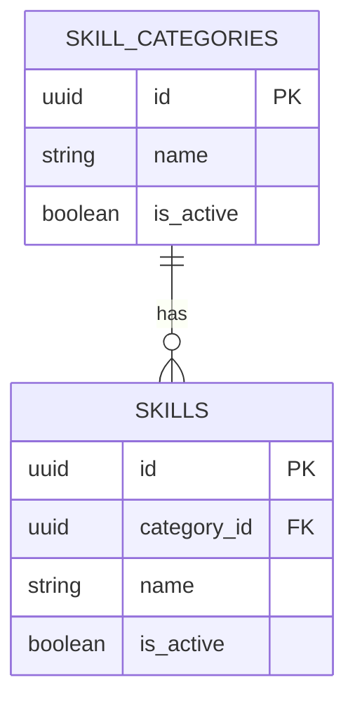
```mermaid
erDiagram
SKILL_CATEGORIES ||--o{ SKILLS : "has"
SKILL_CATEGORIES {
uuid id PK
string name
boolean is_active
}
SKILLS {
uuid id PK
uuid category_id FK
string name
boolean is_active
}
```

**Diagram sources**
- [schema.sql](file://supabase/schema.sql#L19-L38)

**Section sources**
- [schema.sql](file://supabase/schema.sql#L19-L38)
- [matching-service.ts](file://src/services/matching-service.ts#L233-L269)

### Example Request and Response
- Example request body:
  - text: "Looking for a developer with React, Node.js, and PostgreSQL experience"
- Example response (sample):
  - [
      { "skillId": "<uuid>", "skillName": "React", "confidence": 0.92 },
      { "skillId": "<uuid>", "skillName": "Node.js", "confidence": 0.88 },
      { "skillId": "<uuid>", "skillName": "PostgreSQL", "confidence": 0.85 }
    ]

Notes:
- The actual skillId values are UUIDs from the Supabase skills table.
- Confidence values are normalized to 0–1.

**Section sources**
- [API-DOCUMENTATION.md](file://docs/API-DOCUMENTATION.md#L540-L548)
- [ai-client.ts](file://src/services/ai-client.ts#L311-L319)

### Error Handling
- 400 Bad Request:
  - Missing or invalid text input
  - AI extraction failure (when AI is enabled)
- 401 Unauthorized:
  - Missing or invalid JWT token

The route validates the presence and type of text and forwards service errors to the client with appropriate status codes.

**Section sources**
- [matching-routes.ts](file://src/routes/matching-routes.ts#L300-L325)
- [matching-service.ts](file://src/services/matching-service.ts#L220-L231)

## Dependency Analysis
The skill extraction endpoint depends on:
- Express route handler for authentication and request validation
- Matching service for orchestration and fallback logic
- AI client for Gemini integration and response parsing
- Supabase skills table for the taxonomy

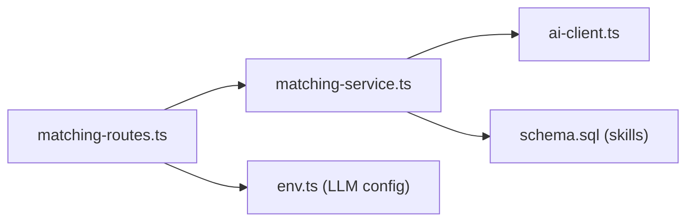
```mermaid
graph LR
Routes["matching-routes.ts"] --> Service["matching-service.ts"]
Service --> AI["ai-client.ts"]
Service --> DB["schema.sql (skills)"]
Routes --> Env["env.ts (LLM config)"]
```

**Diagram sources**
- [matching-routes.ts](file://src/routes/matching-routes.ts#L270-L325)
- [matching-service.ts](file://src/services/matching-service.ts#L220-L269)
- [ai-client.ts](file://src/services/ai-client.ts#L285-L319)
- [schema.sql](file://supabase/schema.sql#L29-L38)
- [env.ts](file://src/config/env.ts#L59-L62)

**Section sources**
- [matching-routes.ts](file://src/routes/matching-routes.ts#L270-L325)
- [matching-service.ts](file://src/services/matching-service.ts#L220-L269)
- [ai-client.ts](file://src/services/ai-client.ts#L285-L319)
- [schema.sql](file://supabase/schema.sql#L29-L38)
- [env.ts](file://src/config/env.ts#L59-L62)

## Performance Considerations
- AI latency: Gemini requests are subject to network latency and rate limits. The AI client implements retry logic and timeouts.
- Keyword fallback: When AI is unavailable, keyword extraction is efficient but less precise than AI.
- Tokenization: The service normalizes confidence values and filters invalid skill IDs to reduce downstream processing overhead.

[No sources needed since this section provides general guidance]

## Troubleshooting Guide
Common issues and resolutions:
- Missing or invalid JWT token:
  - Ensure Authorization: Bearer <token> is included in the request header.
- Missing or empty text:
  - Provide a non-empty string for the text field.
- AI API misconfiguration:
  - Verify LLM_API_KEY and LLM_API_URL environment variables are set.
- AI failures:
  - The service automatically falls back to keyword extraction. If both fail, the service returns an empty array or a validation error.

**Section sources**
- [env.ts](file://src/config/env.ts#L59-L62)
- [matching-routes.ts](file://src/routes/matching-routes.ts#L300-L325)
- [matching-service.ts](file://src/services/matching-service.ts#L247-L269)
- [ai-client.ts](file://src/services/ai-client.ts#L100-L165)

## Conclusion
The POST /api/matching/extract-skills endpoint provides a robust mechanism to identify and map skills from unstructured text using Google Gemini, with a reliable keyword-based fallback. It enforces JWT authentication, validates inputs, and returns a standardized ExtractedSkill array suitable for enriching profiles and project requirements.

[No sources needed since this section summarizes without analyzing specific files]

## Appendices

### Client Implementation Guidance
- Real-time suggestions during profile creation:
  - As users type in a resume or portfolio, trigger skill extraction with short text fragments to prepopulate skill fields.
  - Merge AI-extracted skills with manual selections and allow users to adjust confidence thresholds.
- Manual review options:
  - Present extracted skills with confidence scores and allow users to accept, reject, or edit entries.
- Project posting workflows:
  - After drafting a job description, call the endpoint to extract required skills and auto-fill the project’s required skills list.
  - Combine AI suggestions with keyword extraction to improve recall for niche technologies.

[No sources needed since this section provides general guidance]

---

# Skill Gap Analysis API

<cite>
**Referenced Files in This Document**
- [matching-routes.ts](file://src/routes/matching-routes.ts)
- [matching-service.ts](file://src/services/matching-service.ts)
- [ai-client.ts](file://src/services/ai-client.ts)
- [ai-types.ts](file://src/services/ai-types.ts)
- [freelancer-profile-repository.ts](file://src/repositories/freelancer-profile-repository.ts)
- [auth-middleware.ts](file://src/middleware/auth-middleware.ts)
- [swagger.ts](file://src/config/swagger.ts)
- [env.ts](file://src/config/env.ts)
- [app.ts](file://src/app.ts)
</cite>

## Table of Contents
1. [Introduction](#introduction)
2. [Project Structure](#project-structure)
3. [Core Components](#core-components)
4. [Architecture Overview](#architecture-overview)
5. [Detailed Component Analysis](#detailed-component-analysis)
6. [Dependency Analysis](#dependency-analysis)
7. [Performance Considerations](#performance-considerations)
8. [Troubleshooting Guide](#troubleshooting-guide)
9. [Conclusion](#conclusion)
10. [Appendices](#appendices)

## Introduction
This document provides comprehensive API documentation for the skill gap analysis endpoint in the FreelanceXchain system. It covers the GET /api/matching/skill-gaps endpoint, including authentication requirements, request and response schemas, error handling, and practical guidance for client-side implementation in a career development dashboard.

## Project Structure
The skill gap analysis endpoint is implemented as part of the matching module. The route handler delegates to a service that orchestrates AI analysis and repository access to produce a structured SkillGapAnalysis response.

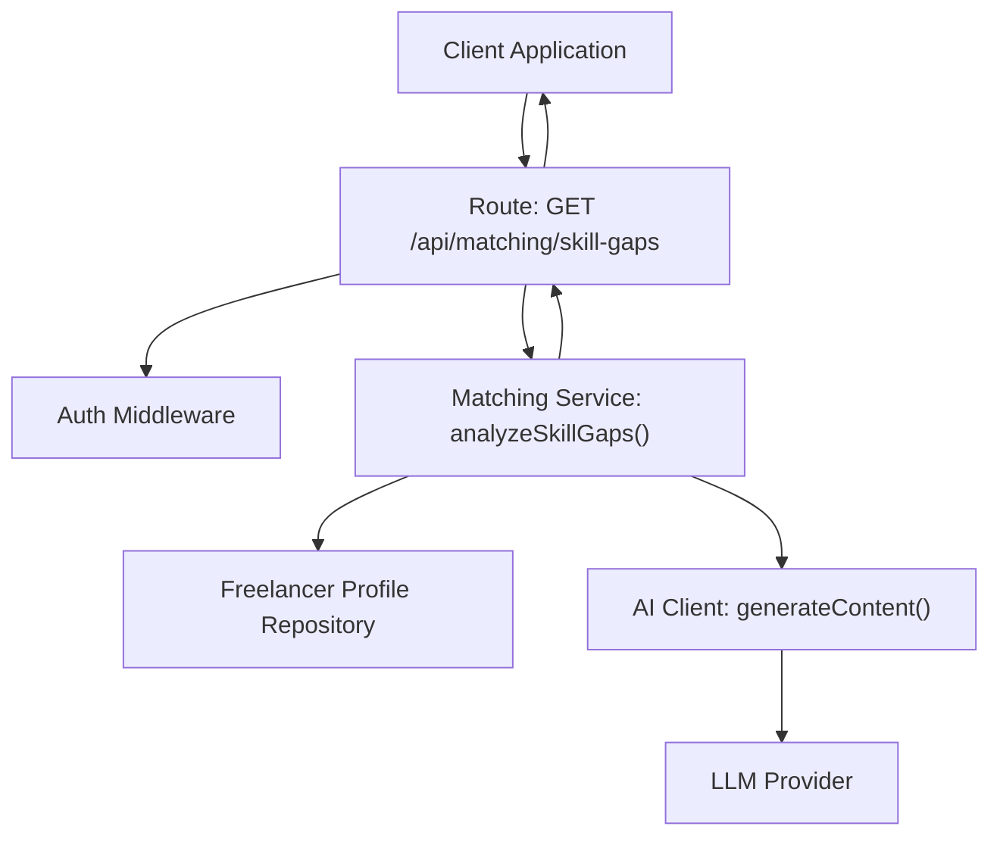
```mermaid
graph TB
Client["Client Application"] --> Route["Route: GET /api/matching/skill-gaps"]
Route --> Auth["Auth Middleware"]
Route --> Service["Matching Service: analyzeSkillGaps()"]
Service --> Repo["Freelancer Profile Repository"]
Service --> AI["AI Client: generateContent()"]
AI --> LLM["LLM Provider"]
Service --> Route
Route --> Client
```

**Diagram sources**
- [matching-routes.ts](file://src/routes/matching-routes.ts#L327-L369)
- [auth-middleware.ts](file://src/middleware/auth-middleware.ts#L25-L70)
- [matching-service.ts](file://src/services/matching-service.ts#L271-L353)
- [freelancer-profile-repository.ts](file://src/repositories/freelancer-profile-repository.ts#L29-L31)
- [ai-client.ts](file://src/services/ai-client.ts#L222-L247)

**Section sources**
- [matching-routes.ts](file://src/routes/matching-routes.ts#L327-L369)
- [app.ts](file://src/app.ts#L80-L84)

## Core Components
- Endpoint: GET /api/matching/skill-gaps
- Authentication: JWT via Bearer token
- No query parameters
- Response: SkillGapAnalysis object with currentSkills, recommendedSkills, marketDemand, and reasoning

Key implementation references:
- Route definition and Swagger schema: [matching-routes.ts](file://src/routes/matching-routes.ts#L327-L369)
- Service logic and AI integration: [matching-service.ts](file://src/services/matching-service.ts#L271-L353)
- AI prompt and response handling: [ai-client.ts](file://src/services/ai-client.ts#L58-L73), [ai-client.ts](file://src/services/ai-client.ts#L222-L247)
- Data model types: [ai-types.ts](file://src/services/ai-types.ts#L90-L100)
- Repository access: [freelancer-profile-repository.ts](file://src/repositories/freelancer-profile-repository.ts#L29-L31)
- Authentication middleware: [auth-middleware.ts](file://src/middleware/auth-middleware.ts#L25-L70)

**Section sources**
- [matching-routes.ts](file://src/routes/matching-routes.ts#L327-L369)
- [matching-service.ts](file://src/services/matching-service.ts#L271-L353)
- [ai-client.ts](file://src/services/ai-client.ts#L58-L73)
- [ai-types.ts](file://src/services/ai-types.ts#L90-L100)
- [freelancer-profile-repository.ts](file://src/repositories/freelancer-profile-repository.ts#L29-L31)
- [auth-middleware.ts](file://src/middleware/auth-middleware.ts#L25-L70)

## Architecture Overview
The endpoint follows a layered architecture:
- HTTP Layer: Express route with auth middleware
- Service Layer: Business logic for skill gap analysis
- Data Access Layer: Repository for freelancer profile
- AI Layer: LLM integration for analysis

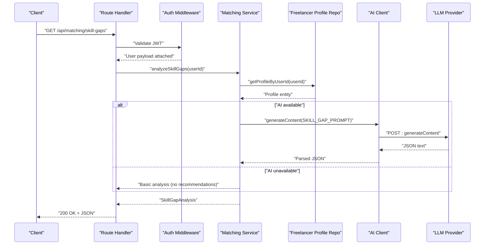
```mermaid
sequenceDiagram
participant C as "Client"
participant R as "Route Handler"
participant M as "Auth Middleware"
participant S as "Matching Service"
participant P as "Freelancer Profile Repo"
participant A as "AI Client"
participant L as "LLM Provider"
C->>R : "GET /api/matching/skill-gaps"
R->>M : "Validate JWT"
M-->>R : "User payload attached"
R->>S : "analyzeSkillGaps(userId)"
S->>P : "getProfileByUserId(userId)"
P-->>S : "Profile entity"
alt "AI available"
S->>A : "generateContent(SKILL_GAP_PROMPT)"
A->>L : "POST : generateContent"
L-->>A : "JSON text"
A-->>S : "Parsed JSON"
else "AI unavailable"
S-->>R : "Basic analysis (no recommendations)"
end
S-->>R : "SkillGapAnalysis"
R-->>C : "200 OK + JSON"
```

**Diagram sources**
- [matching-routes.ts](file://src/routes/matching-routes.ts#L349-L367)
- [auth-middleware.ts](file://src/middleware/auth-middleware.ts#L25-L70)
- [matching-service.ts](file://src/services/matching-service.ts#L271-L353)
- [freelancer-profile-repository.ts](file://src/repositories/freelancer-profile-repository.ts#L29-L31)
- [ai-client.ts](file://src/services/ai-client.ts#L222-L247)

## Detailed Component Analysis

### Endpoint Definition
- Method: GET
- Path: /api/matching/skill-gaps
- Authentication: Required (Bearer JWT)
- Query Parameters: None
- Response: SkillGapAnalysis object

Swagger schema and route:
- [matching-routes.ts](file://src/routes/matching-routes.ts#L327-L369)

**Section sources**
- [matching-routes.ts](file://src/routes/matching-routes.ts#L327-L369)

### Authentication Flow
- Validates Authorization header format and token signature
- Attaches user payload (userId, email, role) to request for downstream use

References:
- [auth-middleware.ts](file://src/middleware/auth-middleware.ts#L25-L70)

**Section sources**
- [auth-middleware.ts](file://src/middleware/auth-middleware.ts#L25-L70)

### Service Logic and AI Integration
- Retrieves freelancer profile by userId
- Builds currentSkills from profile
- If AI is available, generates content using SKILL_GAP_PROMPT
- Parses and validates JSON response
- Returns SkillGapAnalysis with currentSkills, recommendedSkills, marketDemand, and reasoning
- On AI unavailability or errors, returns basic analysis with guidance

References:
- [matching-service.ts](file://src/services/matching-service.ts#L271-L353)
- [ai-client.ts](file://src/services/ai-client.ts#L58-L73)
- [ai-client.ts](file://src/services/ai-client.ts#L222-L247)

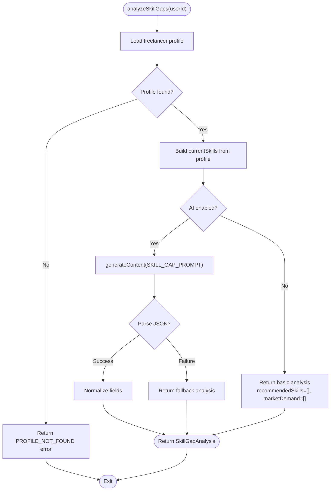
```mermaid
flowchart TD
Start(["analyzeSkillGaps(userId)"]) --> LoadProfile["Load freelancer profile"]
LoadProfile --> HasProfile{"Profile found?"}
HasProfile --> |No| ReturnNotFound["Return PROFILE_NOT_FOUND error"]
HasProfile --> |Yes| BuildCS["Build currentSkills from profile"]
BuildCS --> AIEnabled{"AI enabled?"}
AIEnabled --> |No| BasicAnalysis["Return basic analysis<br/>recommendedSkills=[], marketDemand=[]"]
AIEnabled --> |Yes| CallLLM["generateContent(SKILL_GAP_PROMPT)"]
CallLLM --> ParseResp{"Parse JSON?"}
ParseResp --> |Success| Normalize["Normalize fields"]
ParseResp --> |Failure| Fallback["Return fallback analysis"]
Normalize --> Done(["Return SkillGapAnalysis"])
Fallback --> Done
BasicAnalysis --> Done
ReturnNotFound --> End(["Exit"])
Done --> End
```

**Diagram sources**
- [matching-service.ts](file://src/services/matching-service.ts#L271-L353)
- [ai-client.ts](file://src/services/ai-client.ts#L58-L73)
- [ai-client.ts](file://src/services/ai-client.ts#L222-L247)

**Section sources**
- [matching-service.ts](file://src/services/matching-service.ts#L271-L353)
- [ai-client.ts](file://src/services/ai-client.ts#L58-L73)
- [ai-client.ts](file://src/services/ai-client.ts#L222-L247)

### Data Model: SkillGapAnalysis
- currentSkills: string[]
- recommendedSkills: string[]
- marketDemand: Array with skillName and demandLevel (high | medium | low)
- reasoning: string

References:
- [ai-types.ts](file://src/services/ai-types.ts#L90-L100)

**Section sources**
- [ai-types.ts](file://src/services/ai-types.ts#L90-L100)

### Repository Access
- getProfileByUserId(userId) returns the freelancer’s profile entity
- Used to extract currentSkills for analysis

References:
- [freelancer-profile-repository.ts](file://src/repositories/freelancer-profile-repository.ts#L29-L31)

**Section sources**
- [freelancer-profile-repository.ts](file://src/repositories/freelancer-profile-repository.ts#L29-L31)

### AI Prompt and Response Handling
- SKILL_GAP_PROMPT defines the instruction for the LLM
- generateContent sends the prompt and returns either a string or an AIError
- Response parsing handles markdown code blocks and JSON validation

References:
- [ai-client.ts](file://src/services/ai-client.ts#L58-L73)
- [ai-client.ts](file://src/services/ai-client.ts#L222-L247)

**Section sources**
- [ai-client.ts](file://src/services/ai-client.ts#L58-L73)
- [ai-client.ts](file://src/services/ai-client.ts#L222-L247)

### Example Request
- Method: GET
- Path: /api/matching/skill-gaps
- Headers:
  - Authorization: Bearer <your_jwt_token>
- Query Parameters: None
- Body: Not applicable

References:
- [matching-routes.ts](file://src/routes/matching-routes.ts#L349-L367)

**Section sources**
- [matching-routes.ts](file://src/routes/matching-routes.ts#L349-L367)

### Example Response
Sample JSON structure:
{
  "currentSkills": ["React", "TypeScript", "Node.js"],
  "recommendedSkills": ["GraphQL", "Docker", "AWS"],
  "marketDemand": [
    { "skillName": "GraphQL", "demandLevel": "high" },
    { "skillName": "Docker", "demandLevel": "medium" },
    { "skillName": "AWS", "demandLevel": "high" }
  ],
  "reasoning": "Based on current skills and market trends, consider upskilling in GraphQL and AWS to increase project match potential."
}

References:
- [ai-types.ts](file://src/services/ai-types.ts#L90-L100)
- [matching-service.ts](file://src/services/matching-service.ts#L301-L353)

**Section sources**
- [ai-types.ts](file://src/services/ai-types.ts#L90-L100)
- [matching-service.ts](file://src/services/matching-service.ts#L301-L353)

### Error Handling
- 401 Unauthorized: Missing or invalid Authorization header; invalid or expired token
- 404 Not Found: Profile not found for the authenticated user

References:
- [auth-middleware.ts](file://src/middleware/auth-middleware.ts#L25-L70)
- [matching-routes.ts](file://src/routes/matching-routes.ts#L349-L367)
- [matching-service.ts](file://src/services/matching-service.ts#L271-L284)

**Section sources**
- [auth-middleware.ts](file://src/middleware/auth-middleware.ts#L25-L70)
- [matching-routes.ts](file://src/routes/matching-routes.ts#L349-L367)
- [matching-service.ts](file://src/services/matching-service.ts#L271-L284)

### Client Implementation Guidance
Recommended UI/UX patterns for a career development dashboard:
- Display currentSkills as a tag list with proficiency indicators
- Show recommendedSkills grouped by demandLevel (high/medium/low) with icons
- Render reasoning as a contextual explanation card
- Provide quick actions:
  - Link to learning resources (external URLs or internal course catalog)
  - Track progress per recommended skill
  - Suggest milestones to achieve proficiency
- Refresh button to re-run analysis when skills change
- Graceful degradation when AI is unavailable (show guidance message and basic fields)

[No sources needed since this section provides general guidance]

## Dependency Analysis
The endpoint depends on:
- Route handler for routing and Swagger documentation
- Auth middleware for JWT validation
- Matching service for orchestration and AI integration
- Repository for data access
- AI client for LLM communication

```mermaid
graph LR
Routes["matching-routes.ts"] --> Auth["auth-middleware.ts"]
Routes --> Service["matching-service.ts"]
Service --> Repo["freelancer-profile-repository.ts"]
Service --> AI["ai-client.ts"]
AI --> Env["env.ts (LLM config)"]
Routes --> Swagger["swagger.ts"]
App["app.ts"] --> Routes
```

**Diagram sources**
- [matching-routes.ts](file://src/routes/matching-routes.ts#L327-L369)
- [auth-middleware.ts](file://src/middleware/auth-middleware.ts#L25-L70)
- [matching-service.ts](file://src/services/matching-service.ts#L271-L353)
- [freelancer-profile-repository.ts](file://src/repositories/freelancer-profile-repository.ts#L29-L31)
- [ai-client.ts](file://src/services/ai-client.ts#L222-L247)
- [env.ts](file://src/config/env.ts#L59-L62)
- [swagger.ts](file://src/config/swagger.ts#L22-L28)
- [app.ts](file://src/app.ts#L80-L84)

**Section sources**
- [matching-routes.ts](file://src/routes/matching-routes.ts#L327-L369)
- [auth-middleware.ts](file://src/middleware/auth-middleware.ts#L25-L70)
- [matching-service.ts](file://src/services/matching-service.ts#L271-L353)
- [freelancer-profile-repository.ts](file://src/repositories/freelancer-profile-repository.ts#L29-L31)
- [ai-client.ts](file://src/services/ai-client.ts#L222-L247)
- [env.ts](file://src/config/env.ts#L59-L62)
- [swagger.ts](file://src/config/swagger.ts#L22-L28)
- [app.ts](file://src/app.ts#L80-L84)

## Performance Considerations
- AI calls are asynchronous and include retry logic; network timeouts are handled
- The endpoint performs a single repository read for the profile
- Recommendations are generated once per request; caching strategies can be considered at the client level
- Ensure LLM API keys are configured to avoid fallback behavior

[No sources needed since this section provides general guidance]

## Troubleshooting Guide
Common issues and resolutions:
- 401 Unauthorized
  - Verify Authorization header format: Bearer <token>
  - Confirm token validity and expiration
  - References: [auth-middleware.ts](file://src/middleware/auth-middleware.ts#L25-L70)
- 404 Not Found
  - Ensure the authenticated user has a freelancer profile
  - References: [matching-service.ts](file://src/services/matching-service.ts#L271-L284)
- AI Unavailable or Fallback
  - Configure LLM_API_KEY and LLM_API_URL
  - References: [env.ts](file://src/config/env.ts#L59-L62), [ai-client.ts](file://src/services/ai-client.ts#L76-L81)
- AI Response Parsing Failures
  - LLM may return unexpected format; endpoint falls back gracefully
  - References: [matching-service.ts](file://src/services/matching-service.ts#L301-L353)

**Section sources**
- [auth-middleware.ts](file://src/middleware/auth-middleware.ts#L25-L70)
- [matching-service.ts](file://src/services/matching-service.ts#L271-L284)
- [env.ts](file://src/config/env.ts#L59-L62)
- [ai-client.ts](file://src/services/ai-client.ts#L76-L81)
- [matching-service.ts](file://src/services/matching-service.ts#L301-L353)

## Conclusion
The GET /api/matching/skill-gaps endpoint provides a robust, AI-enhanced skill gap analysis for freelancers. It requires JWT authentication, returns a structured SkillGapAnalysis object, and gracefully degrades when AI is unavailable. Clients can integrate this endpoint into a career development dashboard to display actionable insights and learning recommendations.

[No sources needed since this section summarizes without analyzing specific files]

## Appendices

### API Definition Summary
- Method: GET
- Path: /api/matching/skill-gaps
- Authentication: Bearer JWT
- Query Parameters: None
- Response Schema: SkillGapAnalysis
  - currentSkills: string[]
  - recommendedSkills: string[]
  - marketDemand: Array of { skillName: string, demandLevel: "high" | "medium" | "low" }
  - reasoning: string

References:
- [matching-routes.ts](file://src/routes/matching-routes.ts#L327-L369)
- [ai-types.ts](file://src/services/ai-types.ts#L90-L100)

**Section sources**
- [matching-routes.ts](file://src/routes/matching-routes.ts#L327-L369)
- [ai-types.ts](file://src/services/ai-types.ts#L90-L100)