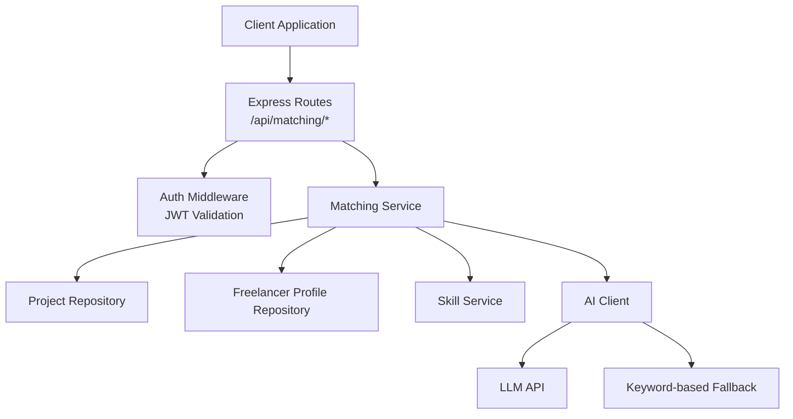
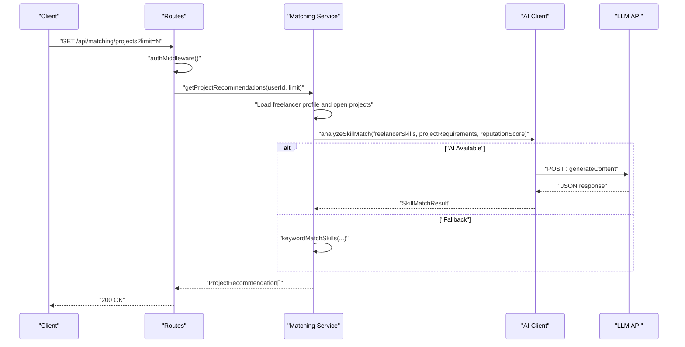
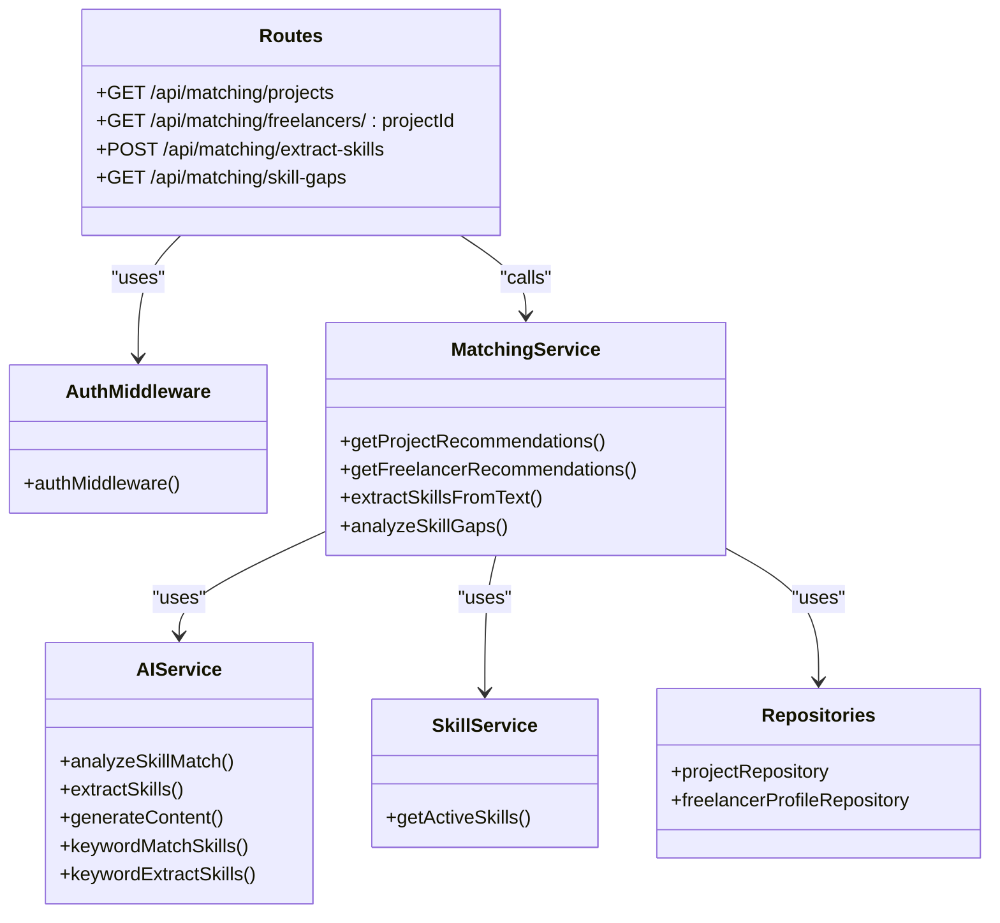

# AI Matching API

<cite>
**Referenced Files in This Document**
- [matching-routes.ts](file://src/routes/matching-routes.ts)
- [matching-service.ts](file://src/services/matching-service.ts)
- [ai-client.ts](file://src/services/ai-client.ts)
- [ai-types.ts](file://src/services/ai-types.ts)
- [auth-middleware.ts](file://src/middleware/auth-middleware.ts)
- [rate-limiter.ts](file://src/middleware/rate-limiter.ts)
- [env.ts](file://src/config/env.ts)
- [swagger.ts](file://src/config/swagger.ts)
- [schema.sql](file://supabase/schema.sql)
- [skill-service.ts](file://src/services/skill-service.ts)
- [skill-repository.ts](file://src/repositories/skill-repository.ts)
- [API-DOCUMENTATION.md](file://docs/API-DOCUMENTATION.md)
</cite>

## Table of Contents
1. [Introduction](#introduction)
2. [Project Structure](#project-structure)
3. [Core Components](#core-components)
4. [Architecture Overview](#architecture-overview)
5. [Detailed Component Analysis](#detailed-component-analysis)
6. [Dependency Analysis](#dependency-analysis)
7. [Performance Considerations](#performance-considerations)
8. [Troubleshooting Guide](#troubleshooting-guide)
9. [Conclusion](#conclusion)
10. [Appendices](#appendices)

## Introduction
This document provides comprehensive API documentation for the AI-powered matching system in the FreelanceXchain platform. It covers:
- HTTP methods, URL patterns, request/response schemas, and authentication requirements (JWT Bearer)
- AI model inputs and outputs for project recommendations, freelancer recommendations, skill extraction, and skill gap analysis
- Match scores, confidence levels, and reasoning explanations
- Client implementation examples for integrating AI recommendations into user interfaces
- Rate limiting for AI service calls and the data sources used for skill matching and market demand analysis

## Project Structure
The AI matching endpoints are implemented as Express routes backed by a matching service that orchestrates AI clients and repositories. The system enforces JWT authentication and applies rate limiting.

**Diagram sources**
- [matching-routes.ts](file://src/routes/matching-routes.ts#L1-L370)
- [matching-service.ts](file://src/services/matching-service.ts#L1-L391)
- [ai-client.ts](file://src/services/ai-client.ts#L1-L465)
- [auth-middleware.ts](file://src/middleware/auth-middleware.ts#L1-L101)
- [rate-limiter.ts](file://src/middleware/rate-limiter.ts#L1-L81)

**Section sources**
- [matching-routes.ts](file://src/routes/matching-routes.ts#L1-L370)
- [swagger.ts](file://src/config/swagger.ts#L1-L233)

## Core Components
- Matching Routes: Define endpoints for project recommendations, freelancer recommendations, skill extraction, and skill gap analysis. All endpoints require JWT Bearer authentication.
- Matching Service: Implements recommendation logic, integrates AI client, and falls back to keyword-based matching when AI is unavailable.
- AI Client: Manages LLM API connectivity, retries, timeouts, and response parsing. Provides prompts for skill matching, extraction, and gap analysis.
- Authentication Middleware: Validates JWT tokens and attaches user context to requests.
- Rate Limiter: Applies request quotas to protect the API and AI resources.
- Skill Service and Repositories: Provide taxonomy data (active skills) used for mapping and extraction.

**Section sources**
- [matching-routes.ts](file://src/routes/matching-routes.ts#L1-L370)
- [matching-service.ts](file://src/services/matching-service.ts#L1-L391)
- [ai-client.ts](file://src/services/ai-client.ts#L1-L465)
- [auth-middleware.ts](file://src/middleware/auth-middleware.ts#L1-L101)
- [rate-limiter.ts](file://src/middleware/rate-limiter.ts#L1-L81)
- [skill-service.ts](file://src/services/skill-service.ts#L1-L285)
- [skill-repository.ts](file://src/repositories/skill-repository.ts#L1-L127)

## Architecture Overview
The AI Matching API follows a layered architecture:
- Presentation Layer: Express routes define endpoints and handle request validation.
- Application Layer: Matching service coordinates repositories and AI client.
- AI Layer: AI client communicates with LLM API and provides fallbacks.
- Persistence Layer: Supabase-backed repositories manage data access.

**Diagram sources**
- [matching-routes.ts](file://src/routes/matching-routes.ts#L148-L182)
- [matching-service.ts](file://src/services/matching-service.ts#L73-L141)
- [ai-client.ts](file://src/services/ai-client.ts#L249-L320)

## Detailed Component Analysis

### Authentication and Security
- All matching endpoints require a Bearer token in the Authorization header.
- The auth middleware validates the token and attaches user context to the request.
- The Swagger configuration defines the bearerAuth security scheme.

**Section sources**
- [matching-routes.ts](file://src/routes/matching-routes.ts#L115-L147)
- [auth-middleware.ts](file://src/middleware/auth-middleware.ts#L1-L101)
- [swagger.ts](file://src/config/swagger.ts#L21-L29)

### Rate Limiting
- General API rate limiter: 100 requests per minute per client IP.
- Sensitive operations can use a separate limiter if needed.
- The rate limiter responds with 429 Too Many Requests and Retry-After header.

**Section sources**
- [rate-limiter.ts](file://src/middleware/rate-limiter.ts#L64-L81)

### Endpoint Definitions

#### GET /api/matching/projects
- Purpose: Retrieve AI-powered project recommendations for a freelancer.
- Authentication: JWT Bearer required.
- Query Parameters:
  - limit (integer, default 10, min 1, max 50)
- Response: Array of ProjectRecommendation objects.
- Errors:
  - 401 Unauthorized (invalid or missing token)
  - 404 Not Found (freelancer profile not found)
  - 400 Bad Request (validation errors)

ProjectRecommendation schema:
- projectId: string
- matchScore: number (0–100)
- matchedSkills: string[]
- missingSkills: string[]
- reasoning: string

**Section sources**
- [matching-routes.ts](file://src/routes/matching-routes.ts#L115-L182)
- [matching-service.ts](file://src/services/matching-service.ts#L73-L141)
- [ai-types.ts](file://src/services/ai-types.ts#L72-L88)

#### GET /api/matching/freelancers/{projectId}
- Purpose: Retrieve AI-powered freelancer recommendations for a project.
- Authentication: JWT Bearer required.
- Path Parameters:
  - projectId: string (UUID)
- Query Parameters:
  - limit (integer, default 10, min 1, max 50)
- Response: Array of FreelancerRecommendation objects.
- Errors:
  - 401 Unauthorized (invalid or missing token)
  - 400 Bad Request (invalid UUID or validation)
  - 404 Not Found (project not found)

FreelancerRecommendation schema:
- freelancerId: string
- matchScore: number (0–100)
- reputationScore: number (fixed default in service)
- combinedScore: number (weighted combination)
- matchedSkills: string[]
- reasoning: string

**Section sources**
- [matching-routes.ts](file://src/routes/matching-routes.ts#L184-L268)
- [matching-service.ts](file://src/services/matching-service.ts#L143-L218)
- [ai-types.ts](file://src/services/ai-types.ts#L81-L88)

#### POST /api/matching/extract-skills
- Purpose: Extract skills from text and map them to the platform taxonomy.
- Authentication: JWT Bearer required.
- Request Body:
  - text: string (required)
- Response: Array of ExtractedSkill objects.
- Errors:
  - 400 Bad Request (invalid request)
  - 401 Unauthorized (invalid or missing token)

ExtractedSkill schema:
- skillId: string
- skillName: string
- confidence: number (0–1)

**Section sources**
- [matching-routes.ts](file://src/routes/matching-routes.ts#L270-L325)
- [matching-service.ts](file://src/services/matching-service.ts#L220-L269)
- [ai-types.ts](file://src/services/ai-types.ts#L61-L71)

#### GET /api/matching/skill-gaps
- Purpose: Analyze freelancer’s skills and suggest improvements based on market demand.
- Authentication: JWT Bearer required.
- Response: SkillGapAnalysis object.
- Errors:
  - 401 Unauthorized (invalid or missing token)
  - 404 Not Found (freelancer profile not found)

SkillGapAnalysis schema:
- currentSkills: string[]
- recommendedSkills: string[]
- marketDemand: array of { skillName: string, demandLevel: "high" | "medium" | "low" }
- reasoning: string

**Section sources**
- [matching-routes.ts](file://src/routes/matching-routes.ts#L327-L367)
- [matching-service.ts](file://src/services/matching-service.ts#L271-L353)
- [ai-types.ts](file://src/services/ai-types.ts#L90-L99)

### AI Model Inputs and Outputs

#### Skill Matching (Project Recommendations)
- Inputs:
  - freelancerSkills: array of SkillInfo (skillId, skillName, categoryId, yearsOfExperience)
  - projectRequirements: array of SkillInfo (skillId, skillName, categoryId, yearsOfExperience)
  - reputationScore: number (optional)
- Output:
  - matchScore: number (0–100)
  - matchedSkills: string[]
  - missingSkills: string[]
  - reasoning: string

Fallback behavior:
- If AI is unavailable or fails, the service uses keyword-based matching.

**Section sources**
- [ai-client.ts](file://src/services/ai-client.ts#L249-L320)
- [matching-service.ts](file://src/services/matching-service.ts#L108-L141)

#### Skill Extraction (Text to Taxonomy)
- Inputs:
  - text: string
  - availableSkills: array of SkillInfo (from taxonomy)
- Output:
  - ExtractedSkill[] with confidence (0–1)

Fallback behavior:
- If AI is unavailable or fails, the service uses keyword-based extraction.

**Section sources**
- [ai-client.ts](file://src/services/ai-client.ts#L286-L320)
- [matching-service.ts](file://src/services/matching-service.ts#L220-L269)

#### Skill Gap Analysis
- Inputs:
  - currentSkills: string[] (from freelancer profile)
- Output:
  - currentSkills: string[]
  - recommendedSkills: string[]
  - marketDemand: array of { skillName, demandLevel }
  - reasoning: string

Fallback behavior:
- If AI is unavailable, returns basic analysis with guidance.

**Section sources**
- [ai-client.ts](file://src/services/ai-client.ts#L58-L73)
- [matching-service.ts](file://src/services/matching-service.ts#L271-L353)

### Data Sources Used for Skill Matching and Market Demand
- Active Skills Taxonomy:
  - Provided by the skill service/repository, filtered to is_active = true.
- Freelancer Profile:
  - Skills and experience from freelancer_profiles table (JSONB).
- Project Requirements:
  - required_skills from projects table (JSONB).
- Market Demand:
  - Derived from AI analysis when available; otherwise empty arrays.

**Section sources**
- [skill-service.ts](file://src/services/skill-service.ts#L216-L219)
- [skill-repository.ts](file://src/repositories/skill-repository.ts#L59-L69)
- [schema.sql](file://supabase/schema.sql#L40-L51)
- [schema.sql](file://supabase/schema.sql#L64-L78)

### Client Implementation Examples
Below are conceptual examples of how to integrate AI recommendations into user interfaces. Replace placeholders with your actual API base URL and JWT token.

- Fetch Project Recommendations
  - Method: GET
  - URL: /api/matching/projects?limit=10
  - Headers: Authorization: Bearer <your_jwt>
  - Response: Array of ProjectRecommendation
  - UI Tip: Render cards with matchScore and reasoning; allow filtering by missingSkills.

- Fetch Freelancer Recommendations for a Project
  - Method: GET
  - URL: /api/matching/freelancers/{projectId}?limit=10
  - Headers: Authorization: Bearer <your_jwt>
  - Response: Array of FreelancerRecommendation
  - UI Tip: Sort by combinedScore; show reputationScore overlay.

- Extract Skills from Text
  - Method: POST
  - URL: /api/matching/extract-skills
  - Headers: Authorization: Bearer <your_jwt>, Content-Type: application/json
  - Body: { "text": "..." }
  - Response: Array of ExtractedSkill
  - UI Tip: Display confidence threshold; auto-suggest adding skills to profile.

- Analyze Skill Gaps
  - Method: GET
  - URL: /api/matching/skill-gaps
  - Headers: Authorization: Bearer <your_jwt>
  - Response: SkillGapAnalysis
  - UI Tip: Show recommendedSkills and marketDemand; link to learning resources.

[No sources needed since this section provides conceptual examples]

## Dependency Analysis

**Diagram sources**
- [matching-routes.ts](file://src/routes/matching-routes.ts#L1-L370)
- [matching-service.ts](file://src/services/matching-service.ts#L1-L391)
- [ai-client.ts](file://src/services/ai-client.ts#L1-L465)
- [skill-service.ts](file://src/services/skill-service.ts#L1-L285)

**Section sources**
- [matching-routes.ts](file://src/routes/matching-routes.ts#L1-L370)
- [matching-service.ts](file://src/services/matching-service.ts#L1-L391)
- [ai-client.ts](file://src/services/ai-client.ts#L1-L465)
- [skill-service.ts](file://src/services/skill-service.ts#L1-L285)

## Performance Considerations
- AI Call Limits:
  - The AI client enforces a request timeout and retry logic with exponential backoff for transient failures.
  - Configure LLM_API_KEY and LLM_API_URL to enable AI features.
- Keyword Fallback:
  - When AI is unavailable, keyword-based matching ensures minimal latency and avoids downtime.
- Recommendation Scope:
  - Project recommendations scan up to 100 open projects; adjust limit via query parameter.
- Rate Limiting:
  - Apply apiRateLimiter to protect the API and downstream LLM costs.

**Section sources**
- [ai-client.ts](file://src/services/ai-client.ts#L97-L165)
- [env.ts](file://src/config/env.ts#L59-L62)
- [rate-limiter.ts](file://src/middleware/rate-limiter.ts#L64-L81)

## Troubleshooting Guide
Common issues and resolutions:
- Unauthorized Access
  - Cause: Missing or invalid Authorization header.
  - Resolution: Ensure Bearer token is present and valid.
- Profile Not Found
  - Cause: Freelancer profile missing for user ID.
  - Resolution: Create a freelancer profile before requesting recommendations.
- AI Unavailable
  - Cause: LLM_API_KEY not configured.
  - Resolution: Set LLM_API_KEY and LLM_API_URL; verify network connectivity.
- AI Response Parsing Errors
  - Cause: Non-JSON or malformed AI response.
  - Resolution: Retry or fall back to keyword-based matching.
- Rate Limit Exceeded
  - Cause: Too many requests within the window.
  - Resolution: Respect Retry-After header and reduce request frequency.

**Section sources**
- [auth-middleware.ts](file://src/middleware/auth-middleware.ts#L25-L70)
- [matching-service.ts](file://src/services/matching-service.ts#L82-L96)
- [ai-client.ts](file://src/services/ai-client.ts#L167-L247)
- [rate-limiter.ts](file://src/middleware/rate-limiter.ts#L30-L60)

## Conclusion
The AI Matching API provides robust, extensible endpoints for skill-based recommendations and analysis. It gracefully degrades to keyword-based matching when AI is unavailable, supports JWT authentication, and applies rate limiting to protect resources. Integrating these endpoints into client applications enables dynamic, data-driven matching experiences for freelancers and employers.

## Appendices

### Environment Variables
- LLM_API_KEY: LLM API key for AI features
- LLM_API_URL: LLM API base URL
- JWT_SECRET: Secret for JWT signing
- SUPABASE_URL, SUPABASE_ANON_KEY: Supabase connection credentials

**Section sources**
- [env.ts](file://src/config/env.ts#L41-L67)

### Example Request/Response Mapping
- Project Recommendations
  - Request: GET /api/matching/projects?limit=10
  - Response: Array of ProjectRecommendation
- Freelancer Recommendations
  - Request: GET /api/matching/freelancers/{projectId}?limit=10
  - Response: Array of FreelancerRecommendation
- Extract Skills
  - Request: POST /api/matching/extract-skills with { text }
  - Response: Array of ExtractedSkill
- Skill Gap Analysis
  - Request: GET /api/matching/skill-gaps
  - Response: SkillGapAnalysis

**Section sources**
- [matching-routes.ts](file://src/routes/matching-routes.ts#L115-L367)
- [API-DOCUMENTATION.md](file://docs/API-DOCUMENTATION.md#L512-L561)