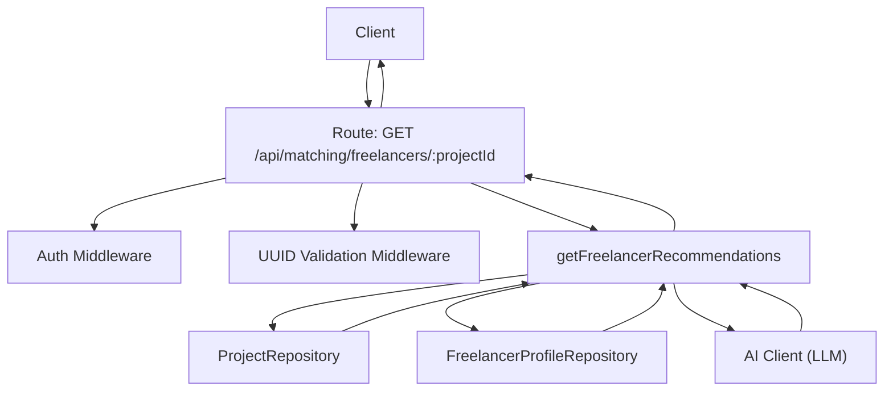
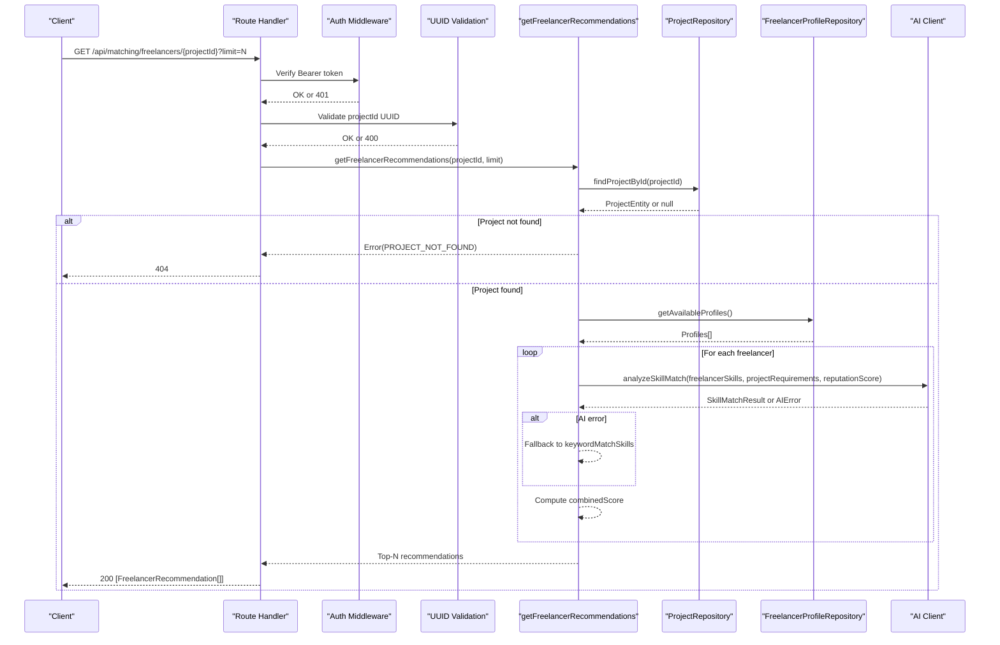
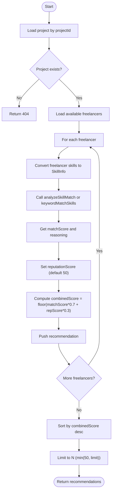
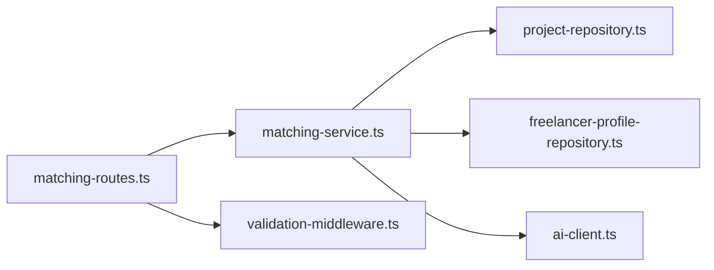

# Freelancer Recommendations API

<cite>
**Referenced Files in This Document**
- [matching-routes.ts](file://src/routes/matching-routes.ts)
- [matching-service.ts](file://src/services/matching-service.ts)
- [ai-types.ts](file://src/services/ai-types.ts)
- [ai-client.ts](file://src/services/ai-client.ts)
- [project-repository.ts](file://src/repositories/project-repository.ts)
- [freelancer-profile-repository.ts](file://src/repositories/freelancer-profile-repository.ts)
- [validation-middleware.ts](file://src/middleware/validation-middleware.ts)
- [API-DOCUMENTATION.md](file://docs/API-DOCUMENTATION.md)
</cite>

## Table of Contents
1. [Introduction](#introduction)
2. [Project Structure](#project-structure)
3. [Core Components](#core-components)
4. [Architecture Overview](#architecture-overview)
5. [Detailed Component Analysis](#detailed-component-analysis)
6. [Dependency Analysis](#dependency-analysis)
7. [Performance Considerations](#performance-considerations)
8. [Troubleshooting Guide](#troubleshooting-guide)
9. [Conclusion](#conclusion)
10. [Appendices](#appendices)

## Introduction
This document describes the GET /api/matching/freelancers/{projectId} endpoint for retrieving AI-powered freelancer recommendations for a given project. It covers authentication, path and query parameters, response schema, AI matching logic, error handling, and client implementation guidance for integrating recommendations into a project management interface.

## Project Structure
The endpoint is implemented as part of the matching module:
- Route handler: GET /api/matching/freelancers/:projectId
- Service logic: getFreelancerRecommendations
- Data access: repositories for projects and freelancers
- AI integration: Gemini-based skill matching with fallbacks
- Validation: JWT auth middleware and UUID validation

**Diagram sources**
- [matching-routes.ts](file://src/routes/matching-routes.ts#L184-L268)
- [matching-service.ts](file://src/services/matching-service.ts#L143-L218)
- [project-repository.ts](file://src/repositories/project-repository.ts#L1-L60)
- [freelancer-profile-repository.ts](file://src/repositories/freelancer-profile-repository.ts#L56-L66)
- [ai-client.ts](file://src/services/ai-client.ts#L76-L165)

**Section sources**
- [matching-routes.ts](file://src/routes/matching-routes.ts#L184-L268)
- [matching-service.ts](file://src/services/matching-service.ts#L143-L218)
- [project-repository.ts](file://src/repositories/project-repository.ts#L1-L60)
- [freelancer-profile-repository.ts](file://src/repositories/freelancer-profile-repository.ts#L56-L66)
- [ai-client.ts](file://src/services/ai-client.ts#L76-L165)

## Core Components
- Endpoint: GET /api/matching/freelancers/{projectId}
- Authentication: Bearer token required
- Path parameter: projectId (UUID)
- Query parameter: limit (integer, 1-50, default 10)
- Response: Array of FreelancerRecommendation objects
- AI matching: Skill match score plus reputation weighting
- Error responses: 400 (invalid UUID or limit), 401 (unauthorized), 404 (project not found)

**Section sources**
- [matching-routes.ts](file://src/routes/matching-routes.ts#L184-L268)
- [API-DOCUMENTATION.md](file://docs/API-DOCUMENTATION.md#L537-L541)

## Architecture Overview
The endpoint follows a layered architecture:
- HTTP layer: Express route with middleware
- Service layer: Business logic for recommendation computation
- Data layer: Repositories for projects and freelancers
- AI layer: LLM integration with fallbacks

**Diagram sources**
- [matching-routes.ts](file://src/routes/matching-routes.ts#L226-L268)
- [matching-service.ts](file://src/services/matching-service.ts#L147-L218)
- [project-repository.ts](file://src/repositories/project-repository.ts#L40-L53)
- [freelancer-profile-repository.ts](file://src/repositories/freelancer-profile-repository.ts#L56-L66)
- [ai-client.ts](file://src/services/ai-client.ts#L76-L165)

## Detailed Component Analysis

### Endpoint Definition
- Method: GET
- Path: /api/matching/freelancers/{projectId}
- Authentication: Required (Bearer token)
- Path parameters:
  - projectId: string, UUID format
- Query parameters:
  - limit: integer, default 10, min 1, max 50
- Response: 200 OK with array of FreelancerRecommendation objects
- Error responses:
  - 400: Invalid UUID format or invalid limit
  - 401: Unauthorized
  - 404: Project not found

**Section sources**
- [matching-routes.ts](file://src/routes/matching-routes.ts#L184-L268)
- [API-DOCUMENTATION.md](file://docs/API-DOCUMENTATION.md#L537-L541)

### Response Schema: FreelancerRecommendation
Each recommendation object includes:
- freelancerId: string (UUID)
- matchScore: number (0-100)
- reputationScore: number (0-100)
- combinedScore: number (weighted average)
- matchedSkills: string[]
- reasoning: string

These fields are produced by the service and returned as-is to clients.

**Section sources**
- [ai-types.ts](file://src/services/ai-types.ts#L81-L88)
- [matching-service.ts](file://src/services/matching-service.ts#L197-L211)

### AI Matching Logic and Weighting
The service computes a combined score by combining:
- Skill match score (0-100)
- Blockchain-verified reputation score (0-100)
Weighting constants:
- SKILL_MATCH_WEIGHT: 0.7
- REPUTATION_WEIGHT: 0.3
combinedScore = floor(matchScore × 0.7 + reputationScore × 0.3)

Fallback behavior:
- If AI is available, use analyzeSkillMatch; on AI error, fall back to keywordMatchSkills
- If AI is unavailable, use keywordMatchSkills

**Diagram sources**
- [matching-service.ts](file://src/services/matching-service.ts#L147-L218)
- [ai-client.ts](file://src/services/ai-client.ts#L76-L165)

**Section sources**
- [matching-service.ts](file://src/services/matching-service.ts#L39-L42)
- [matching-service.ts](file://src/services/matching-service.ts#L197-L211)
- [ai-client.ts](file://src/services/ai-client.ts#L76-L165)

### Validation and Error Handling
- Path parameter validation:
  - projectId must be a valid UUID; otherwise 400
- Query parameter validation:
  - limit must be a positive integer; otherwise 400
  - limit is capped at 50
- Project existence:
  - If project not found, return 404
- Authentication:
  - Missing or invalid token returns 401

**Section sources**
- [matching-routes.ts](file://src/routes/matching-routes.ts#L226-L268)
- [validation-middleware.ts](file://src/middleware/validation-middleware.ts#L778-L815)

### Example Request and Response

- Example request:
  - GET /api/matching/freelancers/{projectId}?limit=20
  - Headers: Authorization: Bearer <JWT>
  - Path parameter: projectId = a valid UUID
  - Query parameter: limit = 20

- Example response (array of recommendations):
  - [
      {
        "freelancerId": "f1c2d3e4-a5b6-c7d8-e9f0-a1b2c3d4e5f6",
        "matchScore": 87,
        "reputationScore": 65,
        "combinedScore": 76,
        "matchedSkills": ["React", "Node.js"],
        "reasoning": "Strong alignment on frontend/backend stack and sufficient experience."
      },
      {
        "freelancerId": "a2b3c4d5-b6c7-d8e9-f0a1-b2c3d4e5f6a7",
        "matchScore": 82,
        "reputationScore": 72,
        "combinedScore": 78,
        "matchedSkills": ["PostgreSQL", "GraphQL"],
        "reasoning": "High skill match on database and API technologies."
      }
    ]

Notes:
- The endpoint returns up to limit recommendations (default 10, max 50).
- The combinedScore reflects the weighted combination of skill match and reputation.

**Section sources**
- [matching-routes.ts](file://src/routes/matching-routes.ts#L226-L268)
- [matching-service.ts](file://src/services/matching-service.ts#L197-L211)
- [API-DOCUMENTATION.md](file://docs/API-DOCUMENTATION.md#L537-L541)

### Client Implementation Guidance
Recommended UI features for a project management interface:
- Display recommendations in a sortable table with columns:
  - Freelancer name/avatar (from user profile)
  - combinedScore (primary sort)
  - matchScore
  - reputationScore
  - matchedSkills (comma-separated)
  - reasoning (tooltip or expandable)
- Filtering options:
  - Filter by minimum combinedScore or matchScore thresholds
  - Filter by specific matchedSkills
- Actions:
  - View profile details
  - Contact freelancer (via messaging or proposal submission)
  - Submit a proposal to shortlisted freelancers
- UX tips:
  - Highlight top recommendations visually
  - Show “reasoning” as a tooltip to explain scoring
  - Allow bulk selection for mass outreach

[No sources needed since this section provides general guidance]

## Dependency Analysis
The endpoint depends on:
- Route handler for routing and middleware
- Service layer for recommendation computation
- Repositories for data access
- AI client for skill matching
- Validation middleware for UUID checks

**Diagram sources**
- [matching-routes.ts](file://src/routes/matching-routes.ts#L184-L268)
- [matching-service.ts](file://src/services/matching-service.ts#L143-L218)
- [project-repository.ts](file://src/repositories/project-repository.ts#L1-L60)
- [freelancer-profile-repository.ts](file://src/repositories/freelancer-profile-repository.ts#L56-L66)
- [validation-middleware.ts](file://src/middleware/validation-middleware.ts#L778-L815)

**Section sources**
- [matching-routes.ts](file://src/routes/matching-routes.ts#L184-L268)
- [matching-service.ts](file://src/services/matching-service.ts#L143-L218)
- [project-repository.ts](file://src/repositories/project-repository.ts#L1-L60)
- [freelancer-profile-repository.ts](file://src/repositories/freelancer-profile-repository.ts#L56-L66)
- [validation-middleware.ts](file://src/middleware/validation-middleware.ts#L778-L815)

## Performance Considerations
- Recommendation computation loops over available freelancers; consider pagination or caching for large datasets.
- AI calls are asynchronous with retries and timeouts; ensure client-side retry/backoff policies.
- Sorting and slicing occur server-side; keep limit reasonable (≤50) to avoid heavy computations.

[No sources needed since this section provides general guidance]

## Troubleshooting Guide
Common issues and resolutions:
- 400 Bad Request:
  - Invalid UUID for projectId
  - Invalid limit (non-positive or out of range)
- 401 Unauthorized:
  - Missing or invalid Bearer token
- 404 Not Found:
  - Project does not exist
- AI-related issues:
  - If AI is unavailable or returns errors, the service falls back to keyword-based matching

**Section sources**
- [matching-routes.ts](file://src/routes/matching-routes.ts#L226-L268)
- [validation-middleware.ts](file://src/middleware/validation-middleware.ts#L778-L815)
- [matching-service.ts](file://src/services/matching-service.ts#L176-L211)
- [ai-client.ts](file://src/services/ai-client.ts#L76-L165)

## Conclusion
The GET /api/matching/freelancers/{projectId} endpoint provides employer-facing recommendations by combining AI-driven skill matching with a reputation weighting. It enforces JWT authentication, validates UUIDs and limits, and returns a ranked list of freelancers suitable for the specified project. Clients should display recommendations with filtering and contact actions to streamline hiring decisions.

[No sources needed since this section summarizes without analyzing specific files]

## Appendices

### API Definition Summary
- Method: GET
- Path: /api/matching/freelancers/{projectId}
- Auth: Bearer token
- Path params:
  - projectId: UUID
- Query params:
  - limit: integer, default 10, min 1, max 50
- Response: 200 OK with array of FreelancerRecommendation
- Errors: 400 (invalid UUID or limit), 401 (unauthorized), 404 (project not found)

**Section sources**
- [matching-routes.ts](file://src/routes/matching-routes.ts#L184-L268)
- [API-DOCUMENTATION.md](file://docs/API-DOCUMENTATION.md#L537-L541)