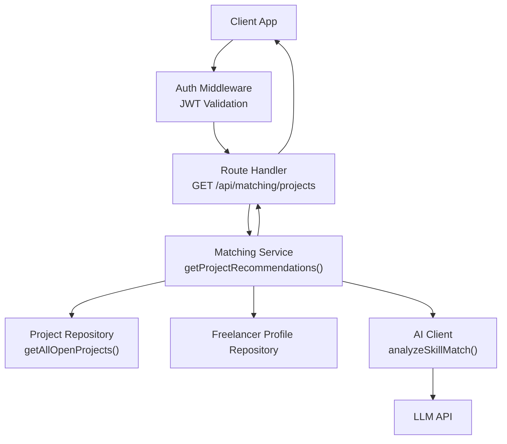
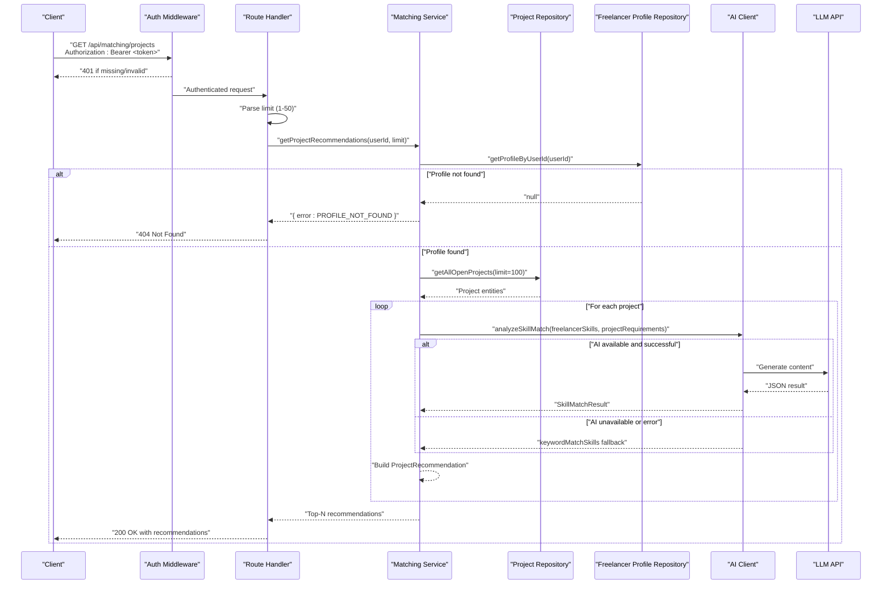
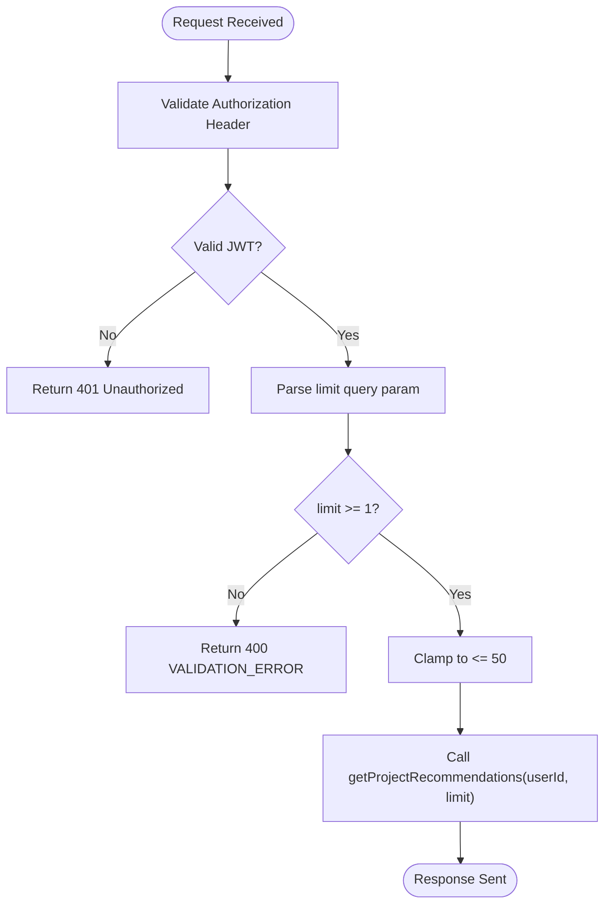
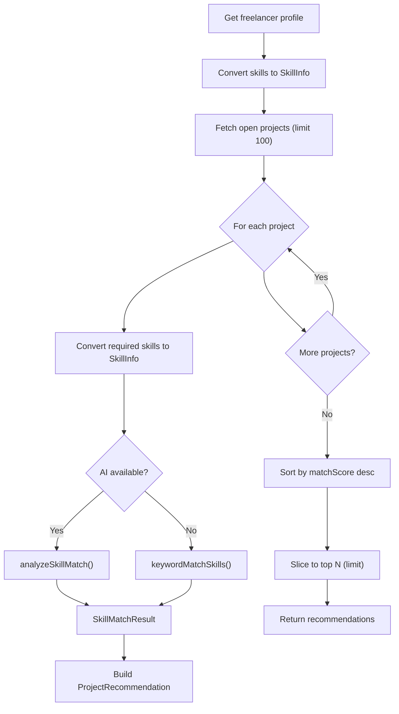
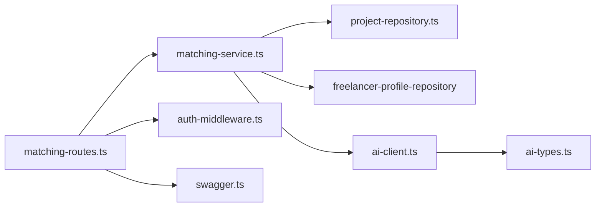

# Project Recommendations API

<cite>
**Referenced Files in This Document**
- [matching-routes.ts](file://src/routes/matching-routes.ts)
- [matching-service.ts](file://src/services/matching-service.ts)
- [ai-client.ts](file://src/services/ai-client.ts)
- [ai-types.ts](file://src/services/ai-types.ts)
- [auth-middleware.ts](file://src/middleware/auth-middleware.ts)
- [swagger.ts](file://src/config/swagger.ts)
- [API-DOCUMENTATION.md](file://docs/API-DOCUMENTATION.md)
- [project-repository.ts](file://src/repositories/project-repository.ts)
- [entity-mapper.ts](file://src/utils/entity-mapper.ts)
</cite>

## Table of Contents
1. [Introduction](#introduction)
2. [Project Structure](#project-structure)
3. [Core Components](#core-components)
4. [Architecture Overview](#architecture-overview)
5. [Detailed Component Analysis](#detailed-component-analysis)
6. [Dependency Analysis](#dependency-analysis)
7. [Performance Considerations](#performance-considerations)
8. [Troubleshooting Guide](#troubleshooting-guide)
9. [Conclusion](#conclusion)
10. [Appendices](#appendices)

## Introduction
This document provides comprehensive API documentation for the GET /api/matching/projects endpoint in the FreelanceXchain system. It covers authentication requirements, query parameter validation, response schema, AI matching logic, error handling, and client integration guidance for building a dashboard UI that displays project recommendations.

## Project Structure
The recommendations endpoint is implemented as part of the matching module:
- Route handler: GET /api/matching/projects
- Middleware: JWT authentication
- Service: AI-powered skill matching between freelancer and open projects
- AI client: LLM integration with fallback logic
- Repositories: Access to project and freelancer profile data



**Diagram sources**
- [matching-routes.ts](file://src/routes/matching-routes.ts#L148-L182)
- [matching-service.ts](file://src/services/matching-service.ts#L77-L141)
- [project-repository.ts](file://src/repositories/project-repository.ts#L76-L95)
- [ai-client.ts](file://src/services/ai-client.ts#L250-L319)

**Section sources**
- [matching-routes.ts](file://src/routes/matching-routes.ts#L148-L182)
- [swagger.ts](file://src/config/swagger.ts#L21-L28)

## Core Components
- Endpoint: GET /api/matching/projects
- Authentication: Bearer JWT token required
- Query parameter:
  - limit: integer, default 10, minimum 1, maximum 50
- Response: Array of ProjectRecommendation objects
- Error responses:
  - 401 Unauthorized (invalid or missing token)
  - 404 Not Found (freelancer profile not found)

**Section sources**
- [matching-routes.ts](file://src/routes/matching-routes.ts#L115-L147)
- [auth-middleware.ts](file://src/middleware/auth-middleware.ts#L25-L70)
- [API-DOCUMENTATION.md](file://docs/API-DOCUMENTATION.md#L512-L536)

## Architecture Overview
The endpoint follows a layered architecture:
- Route layer validates JWT and parses query parameters
- Service layer orchestrates data fetching and AI matching
- Repository layer retrieves open projects and freelancer profile
- AI client layer interacts with LLM API and provides fallbacks



**Diagram sources**
- [matching-routes.ts](file://src/routes/matching-routes.ts#L148-L182)
- [matching-service.ts](file://src/services/matching-service.ts#L77-L141)
- [project-repository.ts](file://src/repositories/project-repository.ts#L76-L95)
- [ai-client.ts](file://src/services/ai-client.ts#L250-L319)

## Detailed Component Analysis

### Endpoint Definition
- Method: GET
- Path: /api/matching/projects
- Authentication: Required (Bearer JWT)
- Query parameters:
  - limit: integer, default 10, minimum 1, maximum 50
- Response: Array of ProjectRecommendation objects

**Section sources**
- [matching-routes.ts](file://src/routes/matching-routes.ts#L115-L147)
- [swagger.ts](file://src/config/swagger.ts#L21-L28)

### Request Flow and Validation
- JWT validation performed by auth middleware
- limit parameter parsing and validation:
  - If provided, must be a positive integer
  - Clamped to maximum 50
  - Default 10 if omitted



**Diagram sources**
- [auth-middleware.ts](file://src/middleware/auth-middleware.ts#L25-L70)
- [matching-routes.ts](file://src/routes/matching-routes.ts#L153-L167)

**Section sources**
- [matching-routes.ts](file://src/routes/matching-routes.ts#L148-L182)

### Response Schema: ProjectRecommendation
Each recommendation object includes:
- projectId: string
- matchScore: number (0-100)
- matchedSkills: string[]
- missingSkills: string[]
- reasoning: string

These fields are populated by the AI matching result and returned directly to clients.

**Section sources**
- [ai-types.ts](file://src/services/ai-types.ts#L72-L88)
- [matching-service.ts](file://src/services/matching-service.ts#L127-L133)

### AI Matching Logic
The system computes match scores using either:
- LLM-powered analysis when API key is configured
- Keyword-based matching as fallback

Key steps:
- Retrieve freelancer profile and convert skills to SkillInfo
- Fetch up to 100 open projects
- For each project, convert required skills to SkillInfo
- Compute match score:
  - If AI available: analyzeSkillMatch
  - Else: keywordMatchSkills
- Sort recommendations by matchScore descending
- Return top N (limit)



**Diagram sources**
- [matching-service.ts](file://src/services/matching-service.ts#L77-L141)
- [ai-client.ts](file://src/services/ai-client.ts#L250-L319)

**Section sources**
- [matching-service.ts](file://src/services/matching-service.ts#L77-L141)
- [ai-client.ts](file://src/services/ai-client.ts#L250-L319)

### Error Handling
- 401 Unauthorized:
  - Missing Authorization header
  - Invalid Bearer format
  - Invalid/expired token
- 404 Not Found:
  - Freelancer profile not found when computing recommendations
- Validation errors:
  - limit must be a positive integer

**Section sources**
- [auth-middleware.ts](file://src/middleware/auth-middleware.ts#L25-L70)
- [matching-routes.ts](file://src/routes/matching-routes.ts#L153-L178)
- [matching-service.ts](file://src/services/matching-service.ts#L82-L88)

### Example Request and Response

- Example request:
  - GET /api/matching/projects?limit=15
  - Authorization: Bearer <your_jwt_token>

- Example response (sample):
  - 200 OK
  - Body: Array of ProjectRecommendation objects

Note: The repository’s API documentation shows a different response shape with a recommendations array and nested project object. However, the route handler and service return the ProjectRecommendation objects directly as an array. The example below reflects the actual implementation.

```json
[
  {
    "projectId": "project-uuid-1",
    "matchScore": 92,
    "matchedSkills": ["React", "Node.js"],
    "missingSkills": ["GraphQL"],
    "reasoning": "High match on frontend/backend stack; missing specialized GraphQL skill."
  },
  {
    "projectId": "project-uuid-2",
    "matchScore": 78,
    "matchedSkills": ["TypeScript", "PostgreSQL"],
    "missingSkills": ["AWS", "Docker"],
    "reasoning": "Strong technical alignment; suggests cloud/container skills for scalability."
  }
]
```

**Section sources**
- [matching-routes.ts](file://src/routes/matching-routes.ts#L148-L182)
- [matching-service.ts](file://src/services/matching-service.ts#L127-L141)
- [ai-types.ts](file://src/services/ai-types.ts#L72-L88)

## Dependency Analysis
The endpoint depends on:
- Route handler for JWT validation and parameter parsing
- Matching service for orchestration and scoring
- AI client for LLM integration and fallbacks
- Repositories for data access



**Diagram sources**
- [matching-routes.ts](file://src/routes/matching-routes.ts#L148-L182)
- [matching-service.ts](file://src/services/matching-service.ts#L77-L141)
- [ai-client.ts](file://src/services/ai-client.ts#L250-L319)
- [auth-middleware.ts](file://src/middleware/auth-middleware.ts#L25-L70)
- [swagger.ts](file://src/config/swagger.ts#L21-L28)

**Section sources**
- [matching-routes.ts](file://src/routes/matching-routes.ts#L148-L182)
- [matching-service.ts](file://src/services/matching-service.ts#L77-L141)
- [ai-client.ts](file://src/services/ai-client.ts#L250-L319)
- [auth-middleware.ts](file://src/middleware/auth-middleware.ts#L25-L70)
- [swagger.ts](file://src/config/swagger.ts#L21-L28)

## Performance Considerations
- The service fetches up to 100 open projects and computes match scores for each, then sorts and slices to top N. This is efficient for typical workloads but consider:
  - Limiting limit to reasonable values (already enforced at 50)
  - Ensuring AI API key is configured to leverage LLM scoring
  - Caching frequently accessed freelancer profiles and project lists at higher layers if needed
- Network latency to LLM API impacts response time; implement retries and timeouts as configured

[No sources needed since this section provides general guidance]

## Troubleshooting Guide
Common issues and resolutions:
- 401 Unauthorized:
  - Verify Authorization header format: Bearer <token>
  - Ensure token is not expired
  - Confirm user role allows access
- 400 Bad Request (limit validation):
  - Ensure limit is a positive integer and ≤ 50
- 404 Not Found:
  - Ensure freelancer profile exists for the user
- 5xx errors:
  - LLM API unconfigured or unreachable
  - Retry after network stabilization

**Section sources**
- [auth-middleware.ts](file://src/middleware/auth-middleware.ts#L25-L70)
- [matching-routes.ts](file://src/routes/matching-routes.ts#L153-L178)
- [matching-service.ts](file://src/services/matching-service.ts#L82-L88)
- [ai-client.ts](file://src/services/ai-client.ts#L100-L165)

## Conclusion
The GET /api/matching/projects endpoint provides AI-driven project recommendations for freelancers. It enforces JWT authentication, validates the limit parameter, and returns a ranked list of recommendations with match scores, matched skills, missing skills, and reasoning. The system gracefully falls back to keyword-based matching when AI is unavailable and maintains clear error responses for common failure modes.

[No sources needed since this section summarizes without analyzing specific files]

## Appendices

### Client Implementation Guidance
- Authentication:
  - Store JWT securely (e.g., HttpOnly cookies or secure storage)
  - Attach Authorization header with each request
- Request:
  - Use GET /api/matching/projects?limit=N
  - Respect limit bounds (1-50)
- UI Integration:
  - Loading state: Show skeleton cards while fetching
  - Pagination: Use limit and server-side sorting by matchScore
  - Error handling: Display user-friendly messages for 401/404/400
  - Recommendations display: Show matchScore, matchedSkills, missingSkills, and reasoning
- Best practices:
  - Debounce repeated requests
  - Cache recent results for the same user
  - Provide “Try again” action for transient AI errors

[No sources needed since this section provides general guidance]