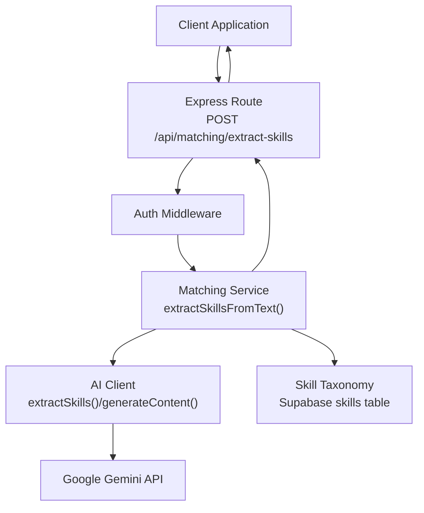
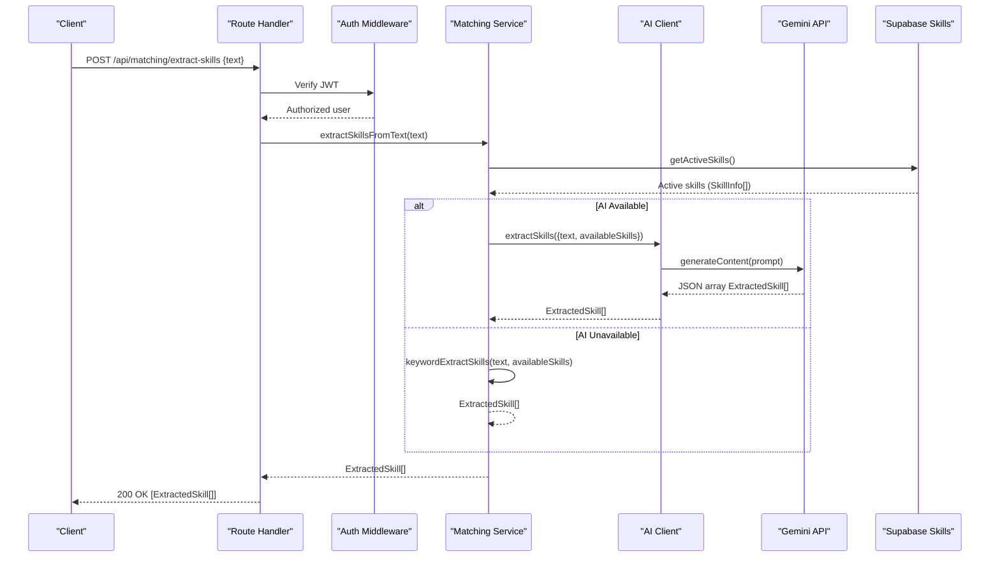
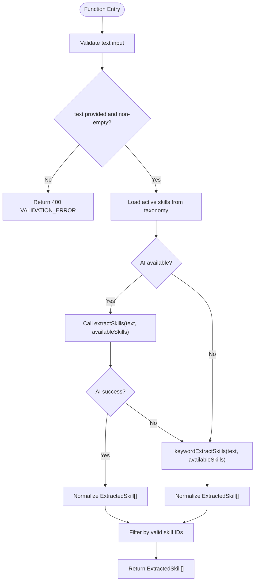
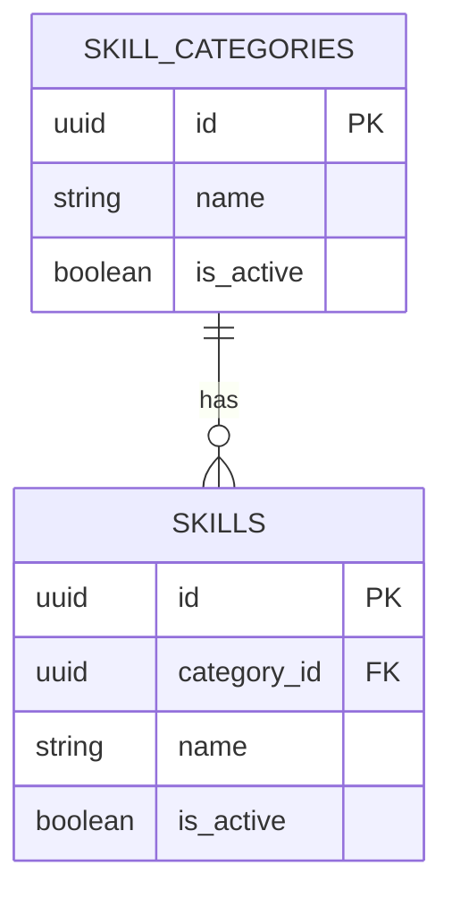
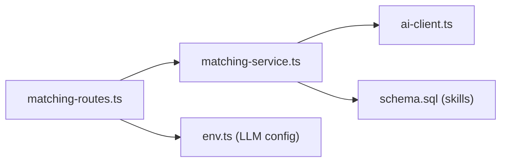

# Skill Extraction API

<cite>
**Referenced Files in This Document**
- [matching-routes.ts](file://src/routes/matching-routes.ts)
- [matching-service.ts](file://src/services/matching-service.ts)
- [ai-client.ts](file://src/services/ai-client.ts)
- [ai-types.ts](file://src/services/ai-types.ts)
- [env.ts](file://src/config/env.ts)
- [schema.sql](file://supabase/schema.sql)
- [API-DOCUMENTATION.md](file://docs/API-DOCUMENTATION.md)
</cite>

## Table of Contents
1. [Introduction](#introduction)
2. [Project Structure](#project-structure)
3. [Core Components](#core-components)
4. [Architecture Overview](#architecture-overview)
5. [Detailed Component Analysis](#detailed-component-analysis)
6. [Dependency Analysis](#dependency-analysis)
7. [Performance Considerations](#performance-considerations)
8. [Troubleshooting Guide](#troubleshooting-guide)
9. [Conclusion](#conclusion)
10. [Appendices](#appendices)

## Introduction
This document provides comprehensive API documentation for the skill extraction endpoint in the FreelanceXchain system. It covers the POST /api/matching/extract-skills endpoint, including authentication requirements, request/response schemas, the AI processing pipeline powered by Google Gemini, error handling, and practical client integration guidance for profile creation and project posting workflows.

## Project Structure
The skill extraction feature spans routing, service logic, AI client integration, and configuration. The endpoint is defined under the matching routes module and delegates to the matching service, which orchestrates AI extraction and keyword fallback logic. Environment variables configure the LLM API integration.

**Diagram sources**
- [matching-routes.ts](file://src/routes/matching-routes.ts#L270-L325)
- [matching-service.ts](file://src/services/matching-service.ts#L220-L269)
- [ai-client.ts](file://src/services/ai-client.ts#L285-L319)
- [schema.sql](file://supabase/schema.sql#L29-L38)

**Section sources**
- [matching-routes.ts](file://src/routes/matching-routes.ts#L270-L325)
- [matching-service.ts](file://src/services/matching-service.ts#L220-L269)
- [ai-client.ts](file://src/services/ai-client.ts#L285-L319)
- [schema.sql](file://supabase/schema.sql#L29-L38)

## Core Components
- Endpoint: POST /api/matching/extract-skills
- Authentication: Bearer JWT token required
- Request body: JSON object with a required string field text
- Response: Array of ExtractedSkill objects with skillId, skillName, and confidence fields
- AI Pipeline: Uses Google Gemini via the AI client; falls back to keyword extraction if AI is unavailable

**Section sources**
- [matching-routes.ts](file://src/routes/matching-routes.ts#L270-L325)
- [API-DOCUMENTATION.md](file://docs/API-DOCUMENTATION.md#L540-L548)
- [ai-types.ts](file://src/services/ai-types.ts#L61-L71)

## Architecture Overview
The skill extraction pipeline integrates the Express route, authentication middleware, matching service, AI client, and the Supabase skill taxonomy. The service retrieves active skills from the taxonomy, attempts AI extraction, and falls back to keyword-based extraction when AI is unavailable.

**Diagram sources**
- [matching-routes.ts](file://src/routes/matching-routes.ts#L300-L325)
- [matching-service.ts](file://src/services/matching-service.ts#L220-L269)
- [ai-client.ts](file://src/services/ai-client.ts#L285-L319)
- [schema.sql](file://supabase/schema.sql#L29-L38)

## Detailed Component Analysis

### Endpoint Definition and Authentication
- Method: POST
- Path: /api/matching/extract-skills
- Authentication: Requires a Bearer token in the Authorization header
- Request body:
  - text: string (required)
- Response:
  - Array of ExtractedSkill objects:
    - skillId: string
    - skillName: string
    - confidence: number (0–1)

Error responses:
- 400 Bad Request: Missing or invalid text input
- 401 Unauthorized: Missing or invalid JWT token

**Section sources**
- [matching-routes.ts](file://src/routes/matching-routes.ts#L270-L325)
- [API-DOCUMENTATION.md](file://docs/API-DOCUMENTATION.md#L540-L548)

### AI Processing Pipeline
The pipeline uses Google Gemini to extract skills from unstructured text and map them to the platform’s standardized skill taxonomy. It follows a two-stage approach:
1. AI Extraction: Sends a structured prompt to Gemini with the input text and the active skill taxonomy. Gemini responds with a JSON array of ExtractedSkill objects.
2. Fallback: If AI is unavailable or fails, the service performs keyword-based extraction against the active skills.

**Diagram sources**
- [matching-service.ts](file://src/services/matching-service.ts#L220-L269)
- [ai-client.ts](file://src/services/ai-client.ts#L285-L319)
- [ai-client.ts](file://src/services/ai-client.ts#L360-L384)

**Section sources**
- [matching-service.ts](file://src/services/matching-service.ts#L220-L269)
- [ai-client.ts](file://src/services/ai-client.ts#L285-L319)
- [ai-client.ts](file://src/services/ai-client.ts#L360-L384)

### Data Models and Schemas
- ExtractedSkill: skillId, skillName, confidence
- SkillExtractionRequest: text, availableSkills (SkillInfo[])
- SkillInfo: skillId, skillName, categoryId?, yearsOfExperience?

These types define the shape of requests and responses exchanged between the route, service, and AI client.

**Section sources**
- [ai-types.ts](file://src/services/ai-types.ts#L61-L71)
- [ai-types.ts](file://src/services/ai-types.ts#L40-L58)

### Skill Taxonomy and Validation
The service loads active skills from the Supabase skills table to form the taxonomy used for mapping. The service filters extracted skills to ensure their IDs correspond to active skills in the taxonomy.

**Diagram sources**
- [schema.sql](file://supabase/schema.sql#L19-L38)

**Section sources**
- [schema.sql](file://supabase/schema.sql#L19-L38)
- [matching-service.ts](file://src/services/matching-service.ts#L233-L269)

### Example Request and Response
- Example request body:
  - text: "Looking for a developer with React, Node.js, and PostgreSQL experience"
- Example response (sample):
  - [
      { "skillId": "<uuid>", "skillName": "React", "confidence": 0.92 },
      { "skillId": "<uuid>", "skillName": "Node.js", "confidence": 0.88 },
      { "skillId": "<uuid>", "skillName": "PostgreSQL", "confidence": 0.85 }
    ]

Notes:
- The actual skillId values are UUIDs from the Supabase skills table.
- Confidence values are normalized to 0–1.

**Section sources**
- [API-DOCUMENTATION.md](file://docs/API-DOCUMENTATION.md#L540-L548)
- [ai-client.ts](file://src/services/ai-client.ts#L311-L319)

### Error Handling
- 400 Bad Request:
  - Missing or invalid text input
  - AI extraction failure (when AI is enabled)
- 401 Unauthorized:
  - Missing or invalid JWT token

The route validates the presence and type of text and forwards service errors to the client with appropriate status codes.

**Section sources**
- [matching-routes.ts](file://src/routes/matching-routes.ts#L300-L325)
- [matching-service.ts](file://src/services/matching-service.ts#L220-L231)

## Dependency Analysis
The skill extraction endpoint depends on:
- Express route handler for authentication and request validation
- Matching service for orchestration and fallback logic
- AI client for Gemini integration and response parsing
- Supabase skills table for the taxonomy

**Diagram sources**
- [matching-routes.ts](file://src/routes/matching-routes.ts#L270-L325)
- [matching-service.ts](file://src/services/matching-service.ts#L220-L269)
- [ai-client.ts](file://src/services/ai-client.ts#L285-L319)
- [schema.sql](file://supabase/schema.sql#L29-L38)
- [env.ts](file://src/config/env.ts#L59-L62)

**Section sources**
- [matching-routes.ts](file://src/routes/matching-routes.ts#L270-L325)
- [matching-service.ts](file://src/services/matching-service.ts#L220-L269)
- [ai-client.ts](file://src/services/ai-client.ts#L285-L319)
- [schema.sql](file://supabase/schema.sql#L29-L38)
- [env.ts](file://src/config/env.ts#L59-L62)

## Performance Considerations
- AI latency: Gemini requests are subject to network latency and rate limits. The AI client implements retry logic and timeouts.
- Keyword fallback: When AI is unavailable, keyword extraction is efficient but less precise than AI.
- Tokenization: The service normalizes confidence values and filters invalid skill IDs to reduce downstream processing overhead.

[No sources needed since this section provides general guidance]

## Troubleshooting Guide
Common issues and resolutions:
- Missing or invalid JWT token:
  - Ensure Authorization: Bearer <token> is included in the request header.
- Missing or empty text:
  - Provide a non-empty string for the text field.
- AI API misconfiguration:
  - Verify LLM_API_KEY and LLM_API_URL environment variables are set.
- AI failures:
  - The service automatically falls back to keyword extraction. If both fail, the service returns an empty array or a validation error.

**Section sources**
- [env.ts](file://src/config/env.ts#L59-L62)
- [matching-routes.ts](file://src/routes/matching-routes.ts#L300-L325)
- [matching-service.ts](file://src/services/matching-service.ts#L247-L269)
- [ai-client.ts](file://src/services/ai-client.ts#L100-L165)

## Conclusion
The POST /api/matching/extract-skills endpoint provides a robust mechanism to identify and map skills from unstructured text using Google Gemini, with a reliable keyword-based fallback. It enforces JWT authentication, validates inputs, and returns a standardized ExtractedSkill array suitable for enriching profiles and project requirements.

[No sources needed since this section summarizes without analyzing specific files]

## Appendices

### Client Implementation Guidance
- Real-time suggestions during profile creation:
  - As users type in a resume or portfolio, trigger skill extraction with short text fragments to prepopulate skill fields.
  - Merge AI-extracted skills with manual selections and allow users to adjust confidence thresholds.
- Manual review options:
  - Present extracted skills with confidence scores and allow users to accept, reject, or edit entries.
- Project posting workflows:
  - After drafting a job description, call the endpoint to extract required skills and auto-fill the project’s required skills list.
  - Combine AI suggestions with keyword extraction to improve recall for niche technologies.

[No sources needed since this section provides general guidance]