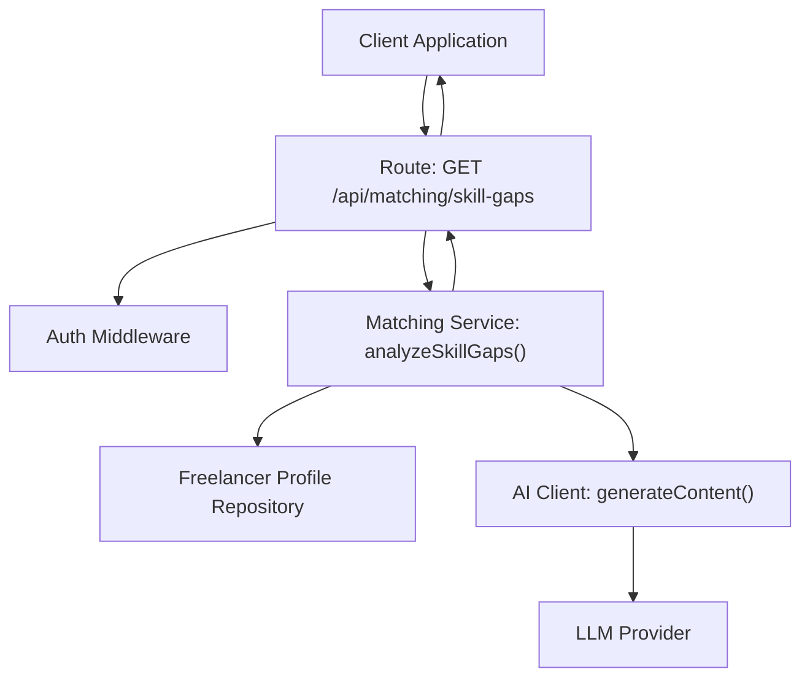
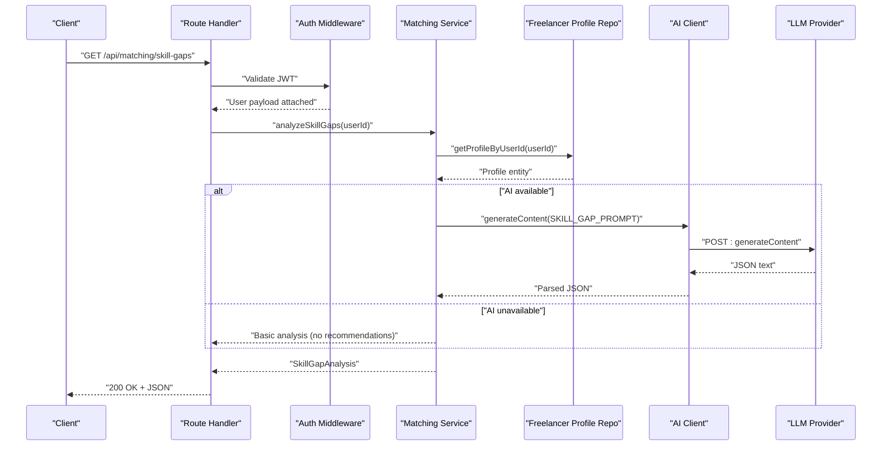
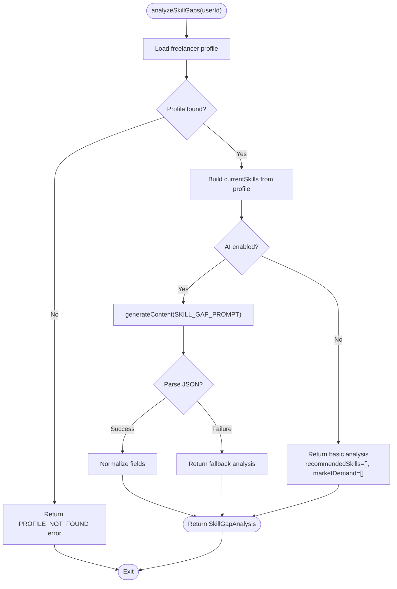
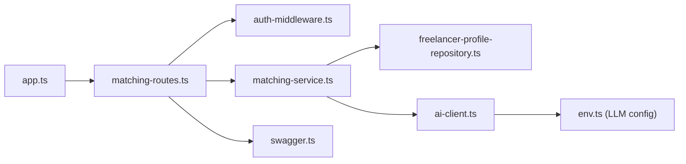

# Skill Gap Analysis API

<cite>
**Referenced Files in This Document**
- [matching-routes.ts](file://src/routes/matching-routes.ts)
- [matching-service.ts](file://src/services/matching-service.ts)
- [ai-client.ts](file://src/services/ai-client.ts)
- [ai-types.ts](file://src/services/ai-types.ts)
- [freelancer-profile-repository.ts](file://src/repositories/freelancer-profile-repository.ts)
- [auth-middleware.ts](file://src/middleware/auth-middleware.ts)
- [swagger.ts](file://src/config/swagger.ts)
- [env.ts](file://src/config/env.ts)
- [app.ts](file://src/app.ts)
</cite>

## Table of Contents
1. [Introduction](#introduction)
2. [Project Structure](#project-structure)
3. [Core Components](#core-components)
4. [Architecture Overview](#architecture-overview)
5. [Detailed Component Analysis](#detailed-component-analysis)
6. [Dependency Analysis](#dependency-analysis)
7. [Performance Considerations](#performance-considerations)
8. [Troubleshooting Guide](#troubleshooting-guide)
9. [Conclusion](#conclusion)
10. [Appendices](#appendices)

## Introduction
This document provides comprehensive API documentation for the skill gap analysis endpoint in the FreelanceXchain system. It covers the GET /api/matching/skill-gaps endpoint, including authentication requirements, request and response schemas, error handling, and practical guidance for client-side implementation in a career development dashboard.

## Project Structure
The skill gap analysis endpoint is implemented as part of the matching module. The route handler delegates to a service that orchestrates AI analysis and repository access to produce a structured SkillGapAnalysis response.

**Diagram sources**
- [matching-routes.ts](file://src/routes/matching-routes.ts#L327-L369)
- [auth-middleware.ts](file://src/middleware/auth-middleware.ts#L25-L70)
- [matching-service.ts](file://src/services/matching-service.ts#L271-L353)
- [freelancer-profile-repository.ts](file://src/repositories/freelancer-profile-repository.ts#L29-L31)
- [ai-client.ts](file://src/services/ai-client.ts#L222-L247)

**Section sources**
- [matching-routes.ts](file://src/routes/matching-routes.ts#L327-L369)
- [app.ts](file://src/app.ts#L80-L84)

## Core Components
- Endpoint: GET /api/matching/skill-gaps
- Authentication: JWT via Bearer token
- No query parameters
- Response: SkillGapAnalysis object with currentSkills, recommendedSkills, marketDemand, and reasoning

Key implementation references:
- Route definition and Swagger schema: [matching-routes.ts](file://src/routes/matching-routes.ts#L327-L369)
- Service logic and AI integration: [matching-service.ts](file://src/services/matching-service.ts#L271-L353)
- AI prompt and response handling: [ai-client.ts](file://src/services/ai-client.ts#L58-L73), [ai-client.ts](file://src/services/ai-client.ts#L222-L247)
- Data model types: [ai-types.ts](file://src/services/ai-types.ts#L90-L100)
- Repository access: [freelancer-profile-repository.ts](file://src/repositories/freelancer-profile-repository.ts#L29-L31)
- Authentication middleware: [auth-middleware.ts](file://src/middleware/auth-middleware.ts#L25-L70)

**Section sources**
- [matching-routes.ts](file://src/routes/matching-routes.ts#L327-L369)
- [matching-service.ts](file://src/services/matching-service.ts#L271-L353)
- [ai-client.ts](file://src/services/ai-client.ts#L58-L73)
- [ai-types.ts](file://src/services/ai-types.ts#L90-L100)
- [freelancer-profile-repository.ts](file://src/repositories/freelancer-profile-repository.ts#L29-L31)
- [auth-middleware.ts](file://src/middleware/auth-middleware.ts#L25-L70)

## Architecture Overview
The endpoint follows a layered architecture:
- HTTP Layer: Express route with auth middleware
- Service Layer: Business logic for skill gap analysis
- Data Access Layer: Repository for freelancer profile
- AI Layer: LLM integration for analysis

**Diagram sources**
- [matching-routes.ts](file://src/routes/matching-routes.ts#L349-L367)
- [auth-middleware.ts](file://src/middleware/auth-middleware.ts#L25-L70)
- [matching-service.ts](file://src/services/matching-service.ts#L271-L353)
- [freelancer-profile-repository.ts](file://src/repositories/freelancer-profile-repository.ts#L29-L31)
- [ai-client.ts](file://src/services/ai-client.ts#L222-L247)

## Detailed Component Analysis

### Endpoint Definition
- Method: GET
- Path: /api/matching/skill-gaps
- Authentication: Required (Bearer JWT)
- Query Parameters: None
- Response: SkillGapAnalysis object

Swagger schema and route:
- [matching-routes.ts](file://src/routes/matching-routes.ts#L327-L369)

**Section sources**
- [matching-routes.ts](file://src/routes/matching-routes.ts#L327-L369)

### Authentication Flow
- Validates Authorization header format and token signature
- Attaches user payload (userId, email, role) to request for downstream use

References:
- [auth-middleware.ts](file://src/middleware/auth-middleware.ts#L25-L70)

**Section sources**
- [auth-middleware.ts](file://src/middleware/auth-middleware.ts#L25-L70)

### Service Logic and AI Integration
- Retrieves freelancer profile by userId
- Builds currentSkills from profile
- If AI is available, generates content using SKILL_GAP_PROMPT
- Parses and validates JSON response
- Returns SkillGapAnalysis with currentSkills, recommendedSkills, marketDemand, and reasoning
- On AI unavailability or errors, returns basic analysis with guidance

References:
- [matching-service.ts](file://src/services/matching-service.ts#L271-L353)
- [ai-client.ts](file://src/services/ai-client.ts#L58-L73)
- [ai-client.ts](file://src/services/ai-client.ts#L222-L247)

**Diagram sources**
- [matching-service.ts](file://src/services/matching-service.ts#L271-L353)
- [ai-client.ts](file://src/services/ai-client.ts#L58-L73)
- [ai-client.ts](file://src/services/ai-client.ts#L222-L247)

**Section sources**
- [matching-service.ts](file://src/services/matching-service.ts#L271-L353)
- [ai-client.ts](file://src/services/ai-client.ts#L58-L73)
- [ai-client.ts](file://src/services/ai-client.ts#L222-L247)

### Data Model: SkillGapAnalysis
- currentSkills: string[]
- recommendedSkills: string[]
- marketDemand: Array with skillName and demandLevel (high | medium | low)
- reasoning: string

References:
- [ai-types.ts](file://src/services/ai-types.ts#L90-L100)

**Section sources**
- [ai-types.ts](file://src/services/ai-types.ts#L90-L100)

### Repository Access
- getProfileByUserId(userId) returns the freelancer’s profile entity
- Used to extract currentSkills for analysis

References:
- [freelancer-profile-repository.ts](file://src/repositories/freelancer-profile-repository.ts#L29-L31)

**Section sources**
- [freelancer-profile-repository.ts](file://src/repositories/freelancer-profile-repository.ts#L29-L31)

### AI Prompt and Response Handling
- SKILL_GAP_PROMPT defines the instruction for the LLM
- generateContent sends the prompt and returns either a string or an AIError
- Response parsing handles markdown code blocks and JSON validation

References:
- [ai-client.ts](file://src/services/ai-client.ts#L58-L73)
- [ai-client.ts](file://src/services/ai-client.ts#L222-L247)

**Section sources**
- [ai-client.ts](file://src/services/ai-client.ts#L58-L73)
- [ai-client.ts](file://src/services/ai-client.ts#L222-L247)

### Example Request
- Method: GET
- Path: /api/matching/skill-gaps
- Headers:
  - Authorization: Bearer <your_jwt_token>
- Query Parameters: None
- Body: Not applicable

References:
- [matching-routes.ts](file://src/routes/matching-routes.ts#L349-L367)

**Section sources**
- [matching-routes.ts](file://src/routes/matching-routes.ts#L349-L367)

### Example Response
Sample JSON structure:
{
  "currentSkills": ["React", "TypeScript", "Node.js"],
  "recommendedSkills": ["GraphQL", "Docker", "AWS"],
  "marketDemand": [
    { "skillName": "GraphQL", "demandLevel": "high" },
    { "skillName": "Docker", "demandLevel": "medium" },
    { "skillName": "AWS", "demandLevel": "high" }
  ],
  "reasoning": "Based on current skills and market trends, consider upskilling in GraphQL and AWS to increase project match potential."
}

References:
- [ai-types.ts](file://src/services/ai-types.ts#L90-L100)
- [matching-service.ts](file://src/services/matching-service.ts#L301-L353)

**Section sources**
- [ai-types.ts](file://src/services/ai-types.ts#L90-L100)
- [matching-service.ts](file://src/services/matching-service.ts#L301-L353)

### Error Handling
- 401 Unauthorized: Missing or invalid Authorization header; invalid or expired token
- 404 Not Found: Profile not found for the authenticated user

References:
- [auth-middleware.ts](file://src/middleware/auth-middleware.ts#L25-L70)
- [matching-routes.ts](file://src/routes/matching-routes.ts#L349-L367)
- [matching-service.ts](file://src/services/matching-service.ts#L271-L284)

**Section sources**
- [auth-middleware.ts](file://src/middleware/auth-middleware.ts#L25-L70)
- [matching-routes.ts](file://src/routes/matching-routes.ts#L349-L367)
- [matching-service.ts](file://src/services/matching-service.ts#L271-L284)

### Client Implementation Guidance
Recommended UI/UX patterns for a career development dashboard:
- Display currentSkills as a tag list with proficiency indicators
- Show recommendedSkills grouped by demandLevel (high/medium/low) with icons
- Render reasoning as a contextual explanation card
- Provide quick actions:
  - Link to learning resources (external URLs or internal course catalog)
  - Track progress per recommended skill
  - Suggest milestones to achieve proficiency
- Refresh button to re-run analysis when skills change
- Graceful degradation when AI is unavailable (show guidance message and basic fields)

[No sources needed since this section provides general guidance]

## Dependency Analysis
The endpoint depends on:
- Route handler for routing and Swagger documentation
- Auth middleware for JWT validation
- Matching service for orchestration and AI integration
- Repository for data access
- AI client for LLM communication

**Diagram sources**
- [matching-routes.ts](file://src/routes/matching-routes.ts#L327-L369)
- [auth-middleware.ts](file://src/middleware/auth-middleware.ts#L25-L70)
- [matching-service.ts](file://src/services/matching-service.ts#L271-L353)
- [freelancer-profile-repository.ts](file://src/repositories/freelancer-profile-repository.ts#L29-L31)
- [ai-client.ts](file://src/services/ai-client.ts#L222-L247)
- [env.ts](file://src/config/env.ts#L59-L62)
- [swagger.ts](file://src/config/swagger.ts#L22-L28)
- [app.ts](file://src/app.ts#L80-L84)

**Section sources**
- [matching-routes.ts](file://src/routes/matching-routes.ts#L327-L369)
- [auth-middleware.ts](file://src/middleware/auth-middleware.ts#L25-L70)
- [matching-service.ts](file://src/services/matching-service.ts#L271-L353)
- [freelancer-profile-repository.ts](file://src/repositories/freelancer-profile-repository.ts#L29-L31)
- [ai-client.ts](file://src/services/ai-client.ts#L222-L247)
- [env.ts](file://src/config/env.ts#L59-L62)
- [swagger.ts](file://src/config/swagger.ts#L22-L28)
- [app.ts](file://src/app.ts#L80-L84)

## Performance Considerations
- AI calls are asynchronous and include retry logic; network timeouts are handled
- The endpoint performs a single repository read for the profile
- Recommendations are generated once per request; caching strategies can be considered at the client level
- Ensure LLM API keys are configured to avoid fallback behavior

[No sources needed since this section provides general guidance]

## Troubleshooting Guide
Common issues and resolutions:
- 401 Unauthorized
  - Verify Authorization header format: Bearer <token>
  - Confirm token validity and expiration
  - References: [auth-middleware.ts](file://src/middleware/auth-middleware.ts#L25-L70)
- 404 Not Found
  - Ensure the authenticated user has a freelancer profile
  - References: [matching-service.ts](file://src/services/matching-service.ts#L271-L284)
- AI Unavailable or Fallback
  - Configure LLM_API_KEY and LLM_API_URL
  - References: [env.ts](file://src/config/env.ts#L59-L62), [ai-client.ts](file://src/services/ai-client.ts#L76-L81)
- AI Response Parsing Failures
  - LLM may return unexpected format; endpoint falls back gracefully
  - References: [matching-service.ts](file://src/services/matching-service.ts#L301-L353)

**Section sources**
- [auth-middleware.ts](file://src/middleware/auth-middleware.ts#L25-L70)
- [matching-service.ts](file://src/services/matching-service.ts#L271-L284)
- [env.ts](file://src/config/env.ts#L59-L62)
- [ai-client.ts](file://src/services/ai-client.ts#L76-L81)
- [matching-service.ts](file://src/services/matching-service.ts#L301-L353)

## Conclusion
The GET /api/matching/skill-gaps endpoint provides a robust, AI-enhanced skill gap analysis for freelancers. It requires JWT authentication, returns a structured SkillGapAnalysis object, and gracefully degrades when AI is unavailable. Clients can integrate this endpoint into a career development dashboard to display actionable insights and learning recommendations.

[No sources needed since this section summarizes without analyzing specific files]

## Appendices

### API Definition Summary
- Method: GET
- Path: /api/matching/skill-gaps
- Authentication: Bearer JWT
- Query Parameters: None
- Response Schema: SkillGapAnalysis
  - currentSkills: string[]
  - recommendedSkills: string[]
  - marketDemand: Array of { skillName: string, demandLevel: "high" | "medium" | "low" }
  - reasoning: string

References:
- [matching-routes.ts](file://src/routes/matching-routes.ts#L327-L369)
- [ai-types.ts](file://src/services/ai-types.ts#L90-L100)

**Section sources**
- [matching-routes.ts](file://src/routes/matching-routes.ts#L327-L369)
- [ai-types.ts](file://src/services/ai-types.ts#L90-L100)