# Authentication API

<cite>
**Referenced Files in This Document**
- [auth-routes.ts](file://src/routes/auth-routes.ts)
- [auth-service.ts](file://src/services/auth-service.ts)
- [rate-limiter.ts](file://src/middleware/rate-limiter.ts)
- [auth-middleware.ts](file://src/middleware/auth-middleware.ts)
- [auth-types.ts](file://src/services/auth-types.ts)
- [user.ts](file://src/models/user.ts)
- [swagger.ts](file://src/config/swagger.ts)
- [env.ts](file://src/config/env.ts)
- [README.md](file://README.md)
</cite>

## Table of Contents
1. [Introduction](#introduction)
2. [Project Structure](#project-structure)
3. [Core Components](#core-components)
4. [Architecture Overview](#architecture-overview)
5. [Detailed Component Analysis](#detailed-component-analysis)
6. [Dependency Analysis](#dependency-analysis)
7. [Performance Considerations](#performance-considerations)
8. [Troubleshooting Guide](#troubleshooting-guide)
9. [Conclusion](#conclusion)
10. [Appendices](#appendices)

## Introduction
This document provides comprehensive API documentation for the authentication module of the FreelanceXchain system. It covers all authentication endpoints, including user registration, login, token refresh, OAuth integration, and password recovery. It also documents request/response schemas, JWT-based authentication requirements, rate limiting policies, and client implementation guidance for JavaScript/TypeScript.

The authentication endpoints are implemented under the base path /api/auth and integrate with Supabase Auth for secure user management, email verification, and OAuth providers.

**Section sources**
- [README.md](file://README.md#L153-L178)

## Project Structure
The authentication module is organized into routes, services, middleware, and shared types. The OpenAPI/Swagger specification is configured to document the authentication endpoints.

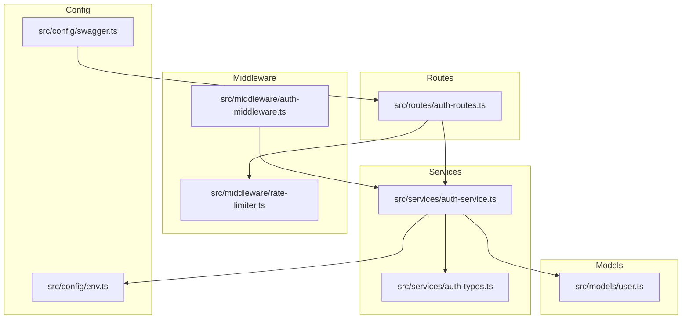
```mermaid
graph TB
subgraph "Routes"
RAuth["src/routes/auth-routes.ts"]
end
subgraph "Services"
SAuth["src/services/auth-service.ts"]
STypes["src/services/auth-types.ts"]
end
subgraph "Middleware"
MRate["src/middleware/rate-limiter.ts"]
MAuth["src/middleware/auth-middleware.ts"]
end
subgraph "Models"
MUser["src/models/user.ts"]
end
subgraph "Config"
CEnv["src/config/env.ts"]
CSwag["src/config/swagger.ts"]
end
RAuth --> SAuth
RAuth --> MRate
MAuth --> SAuth
SAuth --> STypes
SAuth --> MUser
SAuth --> CEnv
CSwag --> RAuth
```

**Diagram sources**
- [auth-routes.ts](file://src/routes/auth-routes.ts#L1-L120)
- [auth-service.ts](file://src/services/auth-service.ts#L1-L60)
- [rate-limiter.ts](file://src/middleware/rate-limiter.ts#L63-L81)
- [auth-middleware.ts](file://src/middleware/auth-middleware.ts#L1-L70)
- [auth-types.ts](file://src/services/auth-types.ts#L1-L49)
- [user.ts](file://src/models/user.ts#L1-L4)
- [swagger.ts](file://src/config/swagger.ts#L1-L60)
- [env.ts](file://src/config/env.ts#L41-L67)

**Section sources**
- [auth-routes.ts](file://src/routes/auth-routes.ts#L1-L120)
- [swagger.ts](file://src/config/swagger.ts#L1-L60)

## Core Components
- Authentication routes: Define endpoints for registration, login, token refresh, OAuth, and password recovery.
- Authentication service: Implements business logic for Supabase Auth integration, token validation, and user synchronization.
- Rate limiter middleware: Applies rate limits to authentication endpoints.
- Auth middleware: Validates JWT Bearer tokens and enforces role-based access control.
- Shared types: Define request/response schemas and error codes.

**Section sources**
- [auth-routes.ts](file://src/routes/auth-routes.ts#L126-L235)
- [auth-service.ts](file://src/services/auth-service.ts#L64-L201)
- [rate-limiter.ts](file://src/middleware/rate-limiter.ts#L63-L81)
- [auth-middleware.ts](file://src/middleware/auth-middleware.ts#L25-L70)
- [auth-types.ts](file://src/services/auth-types.ts#L1-L49)

## Architecture Overview
The authentication flow integrates with Supabase Auth for secure user management. The routes validate inputs, apply rate limiting, and delegate to the service layer. The service layer interacts with Supabase Auth and the database to manage users and tokens. The auth middleware validates JWT Bearer tokens for protected routes.

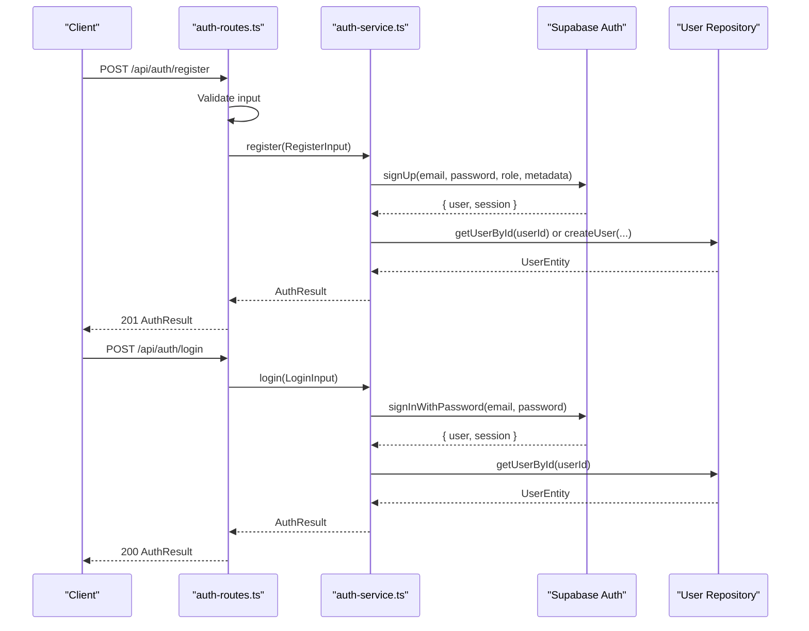
```mermaid
sequenceDiagram
participant Client as "Client"
participant Routes as "auth-routes.ts"
participant Service as "auth-service.ts"
participant Supabase as "Supabase Auth"
participant DB as "User Repository"
Client->>Routes : POST /api/auth/register
Routes->>Routes : Validate input
Routes->>Service : register(RegisterInput)
Service->>Supabase : signUp(email, password, role, metadata)
Supabase-->>Service : { user, session }
Service->>DB : getUserById(userId) or createUser(...)
DB-->>Service : UserEntity
Service-->>Routes : AuthResult
Routes-->>Client : 201 AuthResult
Client->>Routes : POST /api/auth/login
Routes->>Service : login(LoginInput)
Service->>Supabase : signInWithPassword(email, password)
Supabase-->>Service : { user, session }
Service->>DB : getUserById(userId)
DB-->>Service : UserEntity
Service-->>Routes : AuthResult
Routes-->>Client : 200 AuthResult
```

**Diagram sources**
- [auth-routes.ts](file://src/routes/auth-routes.ts#L160-L235)
- [auth-service.ts](file://src/services/auth-service.ts#L68-L201)

## Detailed Component Analysis

### Authentication Endpoints

#### POST /api/auth/register
- Purpose: Register a new user with email/password.
- Request body schema: RegisterInput
  - email: string, required
  - password: string, required, minimum length 8, must include uppercase, lowercase, digit, and special character
  - role: string, enum [freelancer, employer], required
  - name: string, optional, minimum length 2 if provided
  - walletAddress: string, optional, Ethereum address format 0x followed by 40 hex digits
- Responses:
  - 201: AuthResult with user, accessToken, refreshToken
  - 400: AuthError with VALIDATION_ERROR
  - 409: AuthError with DUPLICATE_EMAIL

Rate limiting: Yes (authRateLimiter)

Security considerations:
- Password strength enforced by service-level validation.
- Duplicate email detection via Supabase Auth and database checks.

**Section sources**
- [auth-routes.ts](file://src/routes/auth-routes.ts#L126-L235)
- [auth-service.ts](file://src/services/auth-service.ts#L68-L155)
- [rate-limiter.ts](file://src/middleware/rate-limiter.ts#L63-L68)

#### POST /api/auth/login
- Purpose: Authenticate a user with email/password.
- Request body schema: LoginInput
  - email: string, required
  - password: string, required
- Responses:
  - 200: AuthResult with user, accessToken, refreshToken
  - 400: AuthError with VALIDATION_ERROR
  - 401: AuthError with AUTH_INVALID_CREDENTIALS

Notes:
- Requires email verification; unverified emails will fail login.

**Section sources**
- [auth-routes.ts](file://src/routes/auth-routes.ts#L238-L316)
- [auth-service.ts](file://src/services/auth-service.ts#L157-L201)

#### POST /api/auth/refresh
- Purpose: Refresh access and refresh tokens using a refresh token.
- Request body schema: RefreshInput
  - refreshToken: string, required
- Responses:
  - 200: AuthResult with user, accessToken, refreshToken
  - 400: AuthError with VALIDATION_ERROR
  - 401: AuthError with AUTH_TOKEN_EXPIRED or AUTH_INVALID_TOKEN

**Section sources**
- [auth-routes.ts](file://src/routes/auth-routes.ts#L318-L385)
- [auth-service.ts](file://src/services/auth-service.ts#L203-L228)

#### GET /api/auth/oauth/:provider
- Purpose: Initiate OAuth login with a provider (google, github, azure, linkedin).
- Responses:
  - 302: Redirect to provider authorization URL
  - 400: AuthError with VALIDATION_ERROR

**Section sources**
- [auth-routes.ts](file://src/routes/auth-routes.ts#L532-L563)
- [auth-service.ts](file://src/services/auth-service.ts#L295-L324)

#### GET /api/auth/callback
- Purpose: Handle OAuth callback. Supports PKCE flow (code in query) and implicit flow (tokens in URL fragment).
- Responses:
  - 200: AuthResult with tokens and user
  - 202: Registration required (user exists in Supabase but not in local users)
  - 400: AuthError with OAUTH_ERROR

**Section sources**
- [auth-routes.ts](file://src/routes/auth-routes.ts#L387-L482)
- [auth-service.ts](file://src/services/auth-service.ts#L326-L345)

#### POST /api/auth/oauth/callback
- Purpose: Receive access_token from frontend after OAuth redirect (implicit flow).
- Request body:
  - access_token: string, required
- Responses:
  - 200: Status success
  - 202: Registration required
  - 401: AuthError with AUTH_INVALID_TOKEN

**Section sources**
- [auth-routes.ts](file://src/routes/auth-routes.ts#L565-L637)
- [auth-service.ts](file://src/services/auth-service.ts#L261-L293)

#### POST /api/auth/oauth/register
- Purpose: Complete OAuth registration by selecting role and optionally providing name and walletAddress.
- Request body:
  - accessToken: string, required
  - role: string, enum [freelancer, employer], required
  - name: string, optional, minimum length 2 if provided
  - walletAddress: string, optional, Ethereum address format
- Responses:
  - 201: AuthResult with user, accessToken, refreshToken
  - 400: AuthError with VALIDATION_ERROR
  - 401: AuthError with AUTH_INVALID_TOKEN

Rate limiting: Yes (authRateLimiter)

**Section sources**
- [auth-routes.ts](file://src/routes/auth-routes.ts#L639-L753)
- [auth-service.ts](file://src/services/auth-service.ts#L347-L402)
- [rate-limiter.ts](file://src/middleware/rate-limiter.ts#L63-L68)

#### POST /api/auth/resend-confirmation
- Purpose: Resend email confirmation link.
- Request body:
  - email: string, required
- Responses:
  - 200: Confirmation email sent
  - 400: AuthError with VALIDATION_ERROR

Rate limiting: Yes (authRateLimiter)

**Section sources**
- [auth-routes.ts](file://src/routes/auth-routes.ts#L755-L806)
- [auth-service.ts](file://src/services/auth-service.ts#L404-L423)
- [rate-limiter.ts](file://src/middleware/rate-limiter.ts#L63-L68)

#### POST /api/auth/forgot-password
- Purpose: Send password reset email.
- Request body:
  - email: string, required
- Responses:
  - 200: Password reset email sent
  - 400: AuthError with VALIDATION_ERROR

Rate limiting: Yes (authRateLimiter)

**Section sources**
- [auth-routes.ts](file://src/routes/auth-routes.ts#L808-L859)
- [auth-service.ts](file://src/services/auth-service.ts#L425-L447)
- [rate-limiter.ts](file://src/middleware/rate-limiter.ts#L63-L68)

#### POST /api/auth/reset-password
- Purpose: Update password using reset token.
- Request body:
  - accessToken: string, required
  - password: string, required, minimum length 8, must include uppercase, lowercase, digit, and special character
- Responses:
  - 200: Password updated successfully
  - 400: AuthError with VALIDATION_ERROR
  - 401: AuthError with INVALID_TOKEN

Rate limiting: Yes (authRateLimiter)

**Section sources**
- [auth-routes.ts](file://src/routes/auth-routes.ts#L861-L937)
- [auth-service.ts](file://src/services/auth-service.ts#L449-L468)
- [rate-limiter.ts](file://src/middleware/rate-limiter.ts#L63-L68)

### Request and Response Schemas

#### RegisterInput
- email: string, required
- password: string, required
- role: string, enum [freelancer, employer], required
- name: string, optional
- walletAddress: string, optional

#### LoginInput
- email: string, required
- password: string, required

#### RefreshInput
- refreshToken: string, required

#### AuthResult
- user: object
  - id: string
  - email: string
  - role: string, enum [freelancer, employer, admin]
  - walletAddress: string
  - createdAt: string (date-time)
- accessToken: string
- refreshToken: string

#### AuthError
- error: object
  - code: string, enum including DUPLICATE_EMAIL, INVALID_CREDENTIALS, TOKEN_EXPIRED, INVALID_TOKEN, AUTH_EXCHANGE_FAILED, AUTH_INVALID_TOKEN, AUTH_INVALID_CREDENTIALS, AUTH_REQUIRE_REGISTRATION, VALIDATION_ERROR, INTERNAL_ERROR
  - message: string
  - details: array of validation errors (optional)
- timestamp: string (date-time)
- requestId: string

**Section sources**
- [auth-routes.ts](file://src/routes/auth-routes.ts#L22-L115)
- [auth-types.ts](file://src/services/auth-types.ts#L1-L49)

### Authentication Requirements (JWT)
- All protected routes require a Bearer token in the Authorization header.
- The auth middleware validates the token and attaches user info to the request.
- Supported roles: freelancer, employer, admin.

**Section sources**
- [auth-middleware.ts](file://src/middleware/auth-middleware.ts#L25-L70)
- [user.ts](file://src/models/user.ts#L1-L4)
- [swagger.ts](file://src/config/swagger.ts#L22-L28)

### Rate Limiting Policies
- authRateLimiter: 10 requests per 15 minutes per client IP.
- apiRateLimiter: 100 requests per minute per client IP.
- sensitiveRateLimiter: 5 requests per hour per client IP.

The auth endpoints use authRateLimiter. Exceeding the limit returns 429 with Retry-After header and RATE_LIMIT_EXCEEDED error.

**Section sources**
- [rate-limiter.ts](file://src/middleware/rate-limiter.ts#L1-L81)
- [auth-routes.ts](file://src/routes/auth-routes.ts#L160-L235)

### OAuth Integration
- Providers supported: google, github, azure, linkedin.
- PKCE flow: Redirect to provider, receive code in query, exchange code for tokens, then login.
- Implicit flow: Tokens in URL fragment; backend serves minimal HTML to extract tokens and POST to /api/auth/oauth/callback.

**Section sources**
- [auth-routes.ts](file://src/routes/auth-routes.ts#L387-L482)
- [auth-service.ts](file://src/services/auth-service.ts#L295-L345)

### Password Recovery
- forgot-password: Sends reset email via Supabase Auth.
- reset-password: Updates password using reset token.

**Section sources**
- [auth-routes.ts](file://src/routes/auth-routes.ts#L808-L937)
- [auth-service.ts](file://src/services/auth-service.ts#L425-L468)

### Client Implementation Examples (JavaScript/TypeScript)
Below are conceptual examples of how clients should interact with the authentication endpoints. Replace placeholders with actual values and handle responses accordingly.

- Registration with wallet address
  - Endpoint: POST /api/auth/register
  - Headers: Content-Type: application/json
  - Body: { email, password, role, name?, walletAddress? }
  - Success: Parse AuthResult to store accessToken and refreshToken
  - Error: Handle VALIDATION_ERROR or DUPLICATE_EMAIL

- Login
  - Endpoint: POST /api/auth/login
  - Headers: Content-Type: application/json
  - Body: { email, password }
  - Success: Store tokens and set Authorization: Bearer <accessToken> for subsequent requests

- Token Refresh
  - Endpoint: POST /api/auth/refresh
  - Body: { refreshToken }
  - Success: Replace stored accessToken and refreshToken

- OAuth Login Flow (Google/GitHub)
  - Initiate: GET /api/auth/oauth/:provider
  - Callback (PKCE): GET /api/auth/callback with code
  - Callback (implicit): GET /api/auth/callback (frontend receives tokens), then POST /api/auth/oauth/callback with access_token
  - Registration: POST /api/auth/oauth/register with accessToken, role, name?, walletAddress?

- Password Reset
  - Forgot password: POST /api/auth/forgot-password with email
  - Reset password: POST /api/auth/reset-password with accessToken, password

- Protected Route Example
  - Add Authorization: Bearer <accessToken> header
  - Handle 401 responses by refreshing tokens or prompting re-authentication

[No sources needed since this section provides conceptual client usage guidance]

## Dependency Analysis
The authentication routes depend on the service layer for business logic and on the rate limiter middleware for throttling. The service layer depends on Supabase Auth and the user repository. The auth middleware depends on the service layer for token validation.

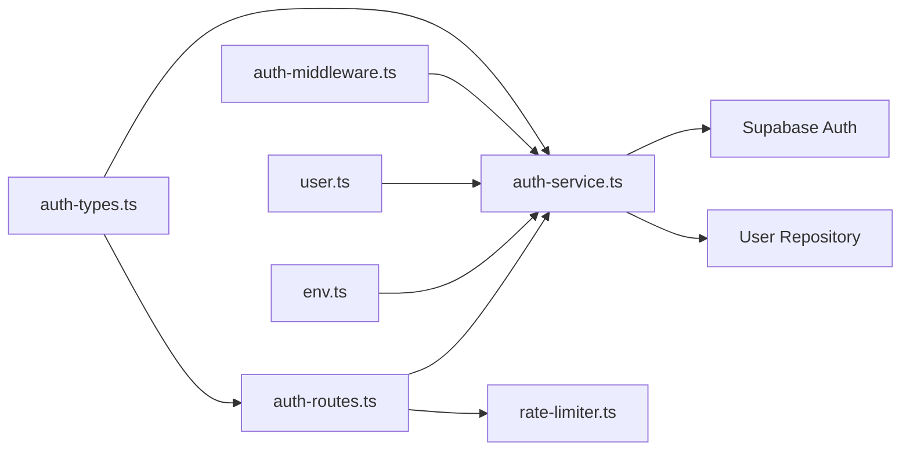
```mermaid
graph LR
Routes["auth-routes.ts"] --> Service["auth-service.ts"]
Routes --> Rate["rate-limiter.ts"]
Service --> Supabase["Supabase Auth"]
Service --> Repo["User Repository"]
AuthMW["auth-middleware.ts"] --> Service
Types["auth-types.ts"] --> Service
Types --> Routes
Models["user.ts"] --> Service
Env["env.ts"] --> Service
```

**Diagram sources**
- [auth-routes.ts](file://src/routes/auth-routes.ts#L1-L120)
- [auth-service.ts](file://src/services/auth-service.ts#L1-L60)
- [rate-limiter.ts](file://src/middleware/rate-limiter.ts#L63-L81)
- [auth-middleware.ts](file://src/middleware/auth-middleware.ts#L1-L70)
- [auth-types.ts](file://src/services/auth-types.ts#L1-L49)
- [user.ts](file://src/models/user.ts#L1-L4)
- [env.ts](file://src/config/env.ts#L41-L67)

**Section sources**
- [auth-routes.ts](file://src/routes/auth-routes.ts#L1-L120)
- [auth-service.ts](file://src/services/auth-service.ts#L1-L60)
- [auth-middleware.ts](file://src/middleware/auth-middleware.ts#L1-L70)
- [rate-limiter.ts](file://src/middleware/rate-limiter.ts#L63-L81)
- [auth-types.ts](file://src/services/auth-types.ts#L1-L49)
- [user.ts](file://src/models/user.ts#L1-L4)
- [env.ts](file://src/config/env.ts#L41-L67)

## Performance Considerations
- Rate limiting reduces load on authentication endpoints and protects against brute force attacks.
- Token refresh and OAuth flows rely on external Supabase Auth; network latency affects response times.
- Avoid excessive polling of resend-confirmation and forgot-password endpoints.

[No sources needed since this section provides general guidance]

## Troubleshooting Guide
Common issues and resolutions:
- 400 Validation Error: Ensure request body matches schemas and required fields are present.
- 401 Invalid Credentials: Verify email/password or token validity; ensure email is confirmed.
- 409 Duplicate Email: Use a different email address.
- 429 Rate Limit Exceeded: Wait until Retry-After seconds elapse before retrying.
- OAuth errors: Confirm provider configuration and redirect URLs; ensure correct provider name.

**Section sources**
- [auth-routes.ts](file://src/routes/auth-routes.ts#L160-L235)
- [auth-service.ts](file://src/services/auth-service.ts#L157-L201)
- [rate-limiter.ts](file://src/middleware/rate-limiter.ts#L30-L60)

## Security Considerations
- Password storage: Supabase Auth manages password hashing; do not store raw passwords.
- Token expiration: Configure JWT secrets and expirations via environment variables.
- Brute force protection: Rate limiting and Supabase Auth constraints mitigate repeated login attempts.
- Token handling: Store refresh tokens securely; prefer short-lived access tokens and rotate refresh tokens.

**Section sources**
- [env.ts](file://src/config/env.ts#L52-L58)
- [auth-service.ts](file://src/services/auth-service.ts#L157-L201)
- [rate-limiter.ts](file://src/middleware/rate-limiter.ts#L63-L81)

## Conclusion
The authentication module provides a robust, standards-compliant API for user registration, login, token refresh, OAuth integration, and password recovery. It leverages Supabase Auth for secure identity management and includes built-in rate limiting and JWT-based authorization. Clients should implement proper error handling, token rotation, and secure storage of credentials and tokens.

[No sources needed since this section summarizes without analyzing specific files]

## Appendices

### OpenAPI/Swagger Integration
- Swagger/OpenAPI is configured to document the authentication endpoints and shared schemas.
- Interactive documentation is available at /api-docs.

**Section sources**
- [swagger.ts](file://src/config/swagger.ts#L1-L60)
- [README.md](file://README.md#L153-L159)

---

# Password Recovery

<cite>
**Referenced Files in This Document**   
- [auth-service.ts](file://src/services/auth-service.ts)
- [auth-routes.ts](file://src/routes/auth-routes.ts)
- [rate-limiter.ts](file://src/middleware/rate-limiter.ts)
- [env.ts](file://src/config/env.ts)
- [supabase.ts](file://src/config/supabase.ts)
</cite>

## Table of Contents
1. [Introduction](#introduction)
2. [Password Recovery Endpoints](#password-recovery-endpoints)
3. [Email Verification Process](#email-verification-process)
4. [Security Measures](#security-measures)
5. [Integration with Supabase](#integration-with-supabase)
6. [Implementation Details](#implementation-details)

## Introduction
The FreelanceXchain system provides a secure password recovery mechanism that allows users to reset their passwords through an email-based verification process. This documentation details the implementation of the password recovery functionality, including the requestPasswordReset and updatePassword flows, security measures, and integration with Supabase's authentication system.

**Section sources**
- [auth-service.ts](file://src/services/auth-service.ts#L425-L469)
- [auth-routes.ts](file://src/routes/auth-routes.ts#L808-L937)

## Password Recovery Endpoints
The password recovery functionality is exposed through two primary endpoints that handle the initiation and completion of the password reset process.

### Request Password Reset
The `/api/auth/forgot-password` endpoint initiates the password recovery process by sending a reset email to the user's registered email address.

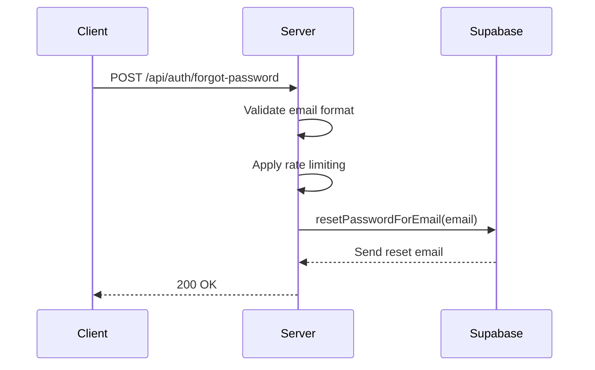
```mermaid
sequenceDiagram
participant Client
participant Server
participant Supabase
Client->>Server : POST /api/auth/forgot-password
Server->>Server : Validate email format
Server->>Server : Apply rate limiting
Server->>Supabase : resetPasswordForEmail(email)
Supabase-->>Server : Send reset email
Server-->>Client : 200 OK
```

**Diagram sources**
- [auth-service.ts](file://src/services/auth-service.ts#L425-L447)
- [auth-routes.ts](file://src/routes/auth-routes.ts#L808-L859)

### Reset Password
The `/api/auth/reset-password` endpoint completes the password recovery process by updating the user's password using the access token provided in the reset email.

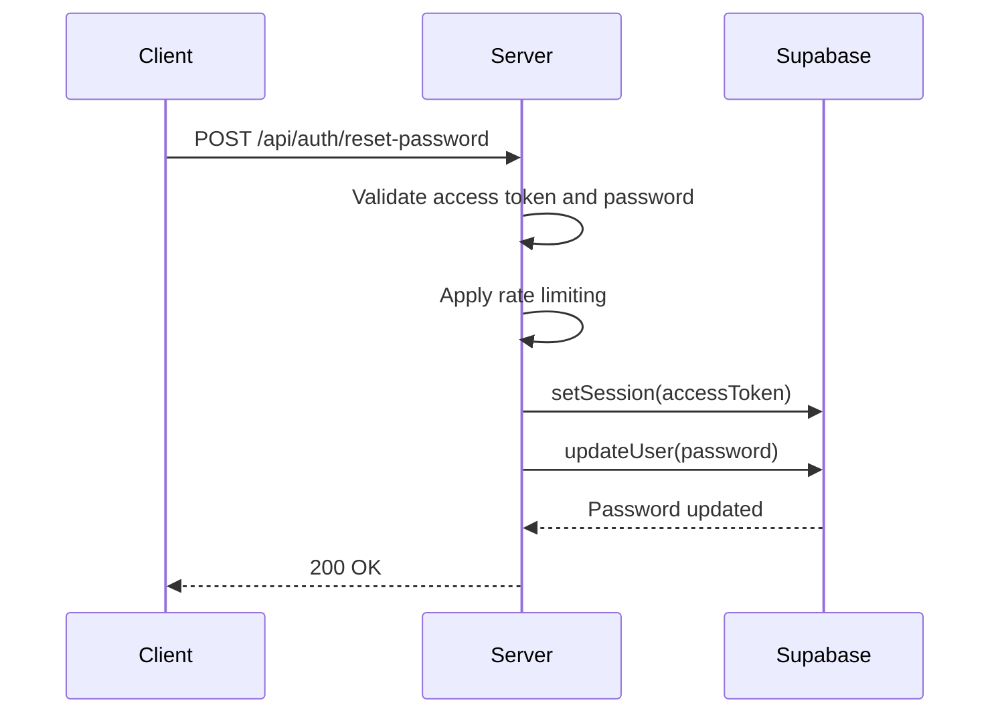
```mermaid
sequenceDiagram
participant Client
participant Server
participant Supabase
Client->>Server : POST /api/auth/reset-password
Server->>Server : Validate access token and password
Server->>Server : Apply rate limiting
Server->>Supabase : setSession(accessToken)
Server->>Supabase : updateUser(password)
Supabase-->>Server : Password updated
Server-->>Client : 200 OK
```

**Diagram sources**
- [auth-service.ts](file://src/services/auth-service.ts#L450-L468)
- [auth-routes.ts](file://src/routes/auth-routes.ts#L861-L935)

**Section sources**
- [auth-service.ts](file://src/services/auth-service.ts#L425-L469)
- [auth-routes.ts](file://src/routes/auth-routes.ts#L808-L937)

## Email Verification Process
The password recovery process uses an email-based verification system to ensure that only the legitimate account owner can reset their password.

### Token Generation and Expiration
When a user requests a password reset, Supabase generates a time-limited access token that is included in the reset email. The token has the following characteristics:

- **Expiration**: The reset token expires after a configurable period (default: 1 hour)
- **Single Use**: The token becomes invalid after it is used to update the password
- **Secure Transmission**: The token is transmitted via HTTPS and included in the redirect URL

The redirect URL is configured based on the environment:
- Production: Uses the PUBLIC_URL environment variable
- Development: Defaults to localhost with the configured port

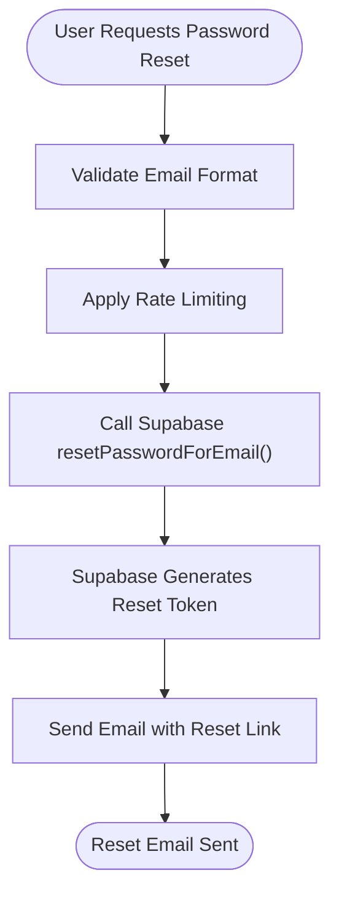
```mermaid
flowchart TD
Start([User Requests Password Reset]) --> ValidateEmail["Validate Email Format"]
ValidateEmail --> RateLimit["Apply Rate Limiting"]
RateLimit --> SendRequest["Call Supabase resetPasswordForEmail()"]
SendRequest --> GenerateToken["Supabase Generates Reset Token"]
GenerateToken --> SendEmail["Send Email with Reset Link"]
SendEmail --> Complete([Reset Email Sent])
```

**Diagram sources**
- [auth-service.ts](file://src/services/auth-service.ts#L430-L437)
- [env.ts](file://src/config/env.ts#L27-L39)

**Section sources**
- [auth-service.ts](file://src/services/auth-service.ts#L425-L447)

## Security Measures
The password recovery implementation includes multiple security measures to prevent abuse and protect user accounts.

### Rate Limiting
The system implements rate limiting to prevent brute force attacks and denial-of-service attempts:

- **Authentication Rate Limiter**: Limits password reset requests to 10 attempts per 15 minutes per IP address
- **Sensitive Operation Rate Limiter**: Additional protection for critical authentication operations

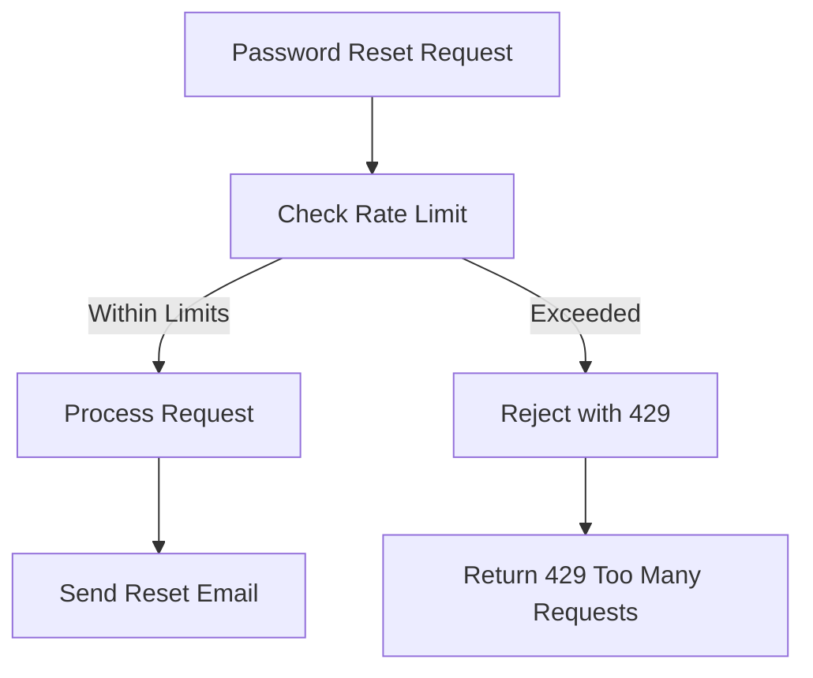
```mermaid
flowchart TD
Request["Password Reset Request"] --> CheckRateLimit["Check Rate Limit"]
CheckRateLimit --> |Within Limits| ProcessRequest["Process Request"]
CheckRateLimit --> |Exceeded| RejectRequest["Reject with 429"]
ProcessRequest --> SendEmail["Send Reset Email"]
RejectRequest --> Response429["Return 429 Too Many Requests"]
```

**Diagram sources**
- [rate-limiter.ts](file://src/middleware/rate-limiter.ts#L64-L68)
- [auth-routes.ts](file://src/routes/auth-routes.ts#L834-L835)

### Password Strength Requirements
The system enforces strong password policies to enhance account security:

- Minimum 8 characters
- At least one uppercase letter
- At least one lowercase letter
- At least one number
- At least one special character (@$!%*?&)

**Section sources**
- [auth-service.ts](file://src/services/auth-service.ts#L14-L47)
- [rate-limiter.ts](file://src/middleware/rate-limiter.ts#L64-L80)

## Integration with Supabase
The password recovery functionality integrates with Supabase's authentication system while maintaining application-specific user data and session management.

### Supabase Authentication Flow
The implementation leverages Supabase's built-in password reset functionality while extending it with custom business logic:

1. **Token Handling**: The access token from Supabase is used to authenticate the password update request
2. **Session Management**: The system sets the session with the provided access token before updating the password
3. **User Data Synchronization**: Application-specific user data is maintained in the public.users table

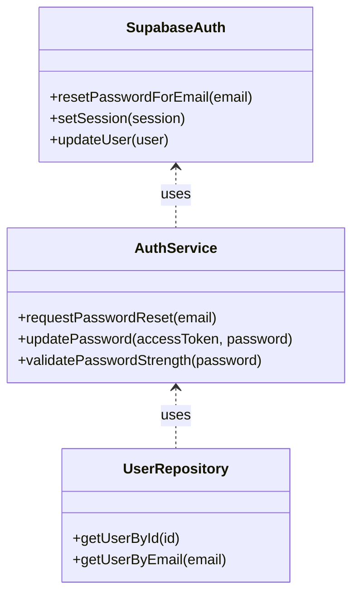
```mermaid
classDiagram
class SupabaseAuth {
+resetPasswordForEmail(email)
+setSession(session)
+updateUser(user)
}
class AuthService {
+requestPasswordReset(email)
+updatePassword(accessToken, password)
+validatePasswordStrength(password)
}
class UserRepository {
+getUserById(id)
+getUserByEmail(email)
}
SupabaseAuth <.. AuthService : uses
AuthService <.. UserRepository : uses
```

**Diagram sources**
- [auth-service.ts](file://src/services/auth-service.ts#L425-L469)
- [supabase.ts](file://src/config/supabase.ts#L25-L33)

### Application-Specific User Management
While Supabase handles the core authentication, the application maintains its own user data in the public.users table:

- **User Profile Data**: Role, wallet address, name, and other application-specific attributes
- **Data Synchronization**: User records are created and updated to maintain consistency between Supabase Auth and the application database
- **Session Integration**: The system combines Supabase tokens with application user data in the authentication response

**Section sources**
- [auth-service.ts](file://src/services/auth-service.ts#L425-L469)
- [supabase.ts](file://src/config/supabase.ts#L6-L21)

## Implementation Details
The password recovery functionality is implemented across multiple service and route files, with clear separation of concerns.

### Service Layer Implementation
The core password recovery logic is implemented in the `auth-service.ts` file with two primary functions:

- **requestPasswordReset(email)**: Initiates the password recovery process by requesting Supabase to send a reset email
- **updatePassword(accessToken, newPassword)**: Completes the recovery by updating the user's password using the provided access token

Both functions include comprehensive error handling and return standardized response objects.

### Route Layer Implementation
The authentication routes are defined in `auth-routes.ts` with proper request validation and error handling:

- **Input Validation**: Email format and password strength are validated before processing
- **Rate Limiting**: The authRateLimiter middleware is applied to prevent abuse
- **Error Responses**: Standardized error responses with appropriate HTTP status codes
- **Request Tracing**: Each request includes a requestId for debugging and monitoring

**Section sources**
- [auth-service.ts](file://src/services/auth-service.ts#L425-L469)
- [auth-routes.ts](file://src/routes/auth-routes.ts#L808-L937)
- [rate-limiter.ts](file://src/middleware/rate-limiter.ts#L64-L80)

---

# Token Refresh

<cite>
**Referenced Files in This Document**
- [auth-routes.ts](file://src/routes/auth-routes.ts)
- [auth-service.ts](file://src/services/auth-service.ts)
- [auth-types.ts](file://src/services/auth-types.ts)
- [auth-middleware.ts](file://src/middleware/auth-middleware.ts)
- [env.ts](file://src/config/env.ts)
- [swagger.ts](file://src/config/swagger.ts)
- [README.md](file://README.md)
</cite>

## Table of Contents
1. [Introduction](#introduction)
2. [Project Structure](#project-structure)
3. [Core Components](#core-components)
4. [Architecture Overview](#architecture-overview)
5. [Detailed Component Analysis](#detailed-component-analysis)
6. [Dependency Analysis](#dependency-analysis)
7. [Performance Considerations](#performance-considerations)
8. [Troubleshooting Guide](#troubleshooting-guide)
9. [Conclusion](#conclusion)
10. [Appendices](#appendices)

## Introduction
This document describes the token refresh mechanism for the FreelanceXchain authentication system. It focuses on the POST /api/auth/refresh endpoint that accepts a refreshToken in the request body to obtain new accessToken and refreshToken pairs. It documents the RefreshInput schema, explains the token rotation strategy, and details the 200 success response with updated AuthResult, as well as error responses for 400 (missing token) and 401 (expired/invalid token). It also explains how the system validates token signatures and expiration using JWT standards, documents the implementation in auth-routes.ts and refreshTokens in auth-service.ts, and provides secure storage recommendations for refresh tokens on client applications.

## Project Structure
The token refresh flow spans routing, service logic, and configuration:
- Route handler: POST /api/auth/refresh
- Service function: refreshTokens(refreshToken)
- Types: RefreshInput, AuthResult, AuthError
- Middleware: authMiddleware for access token validation
- Configuration: JWT secrets and expirations

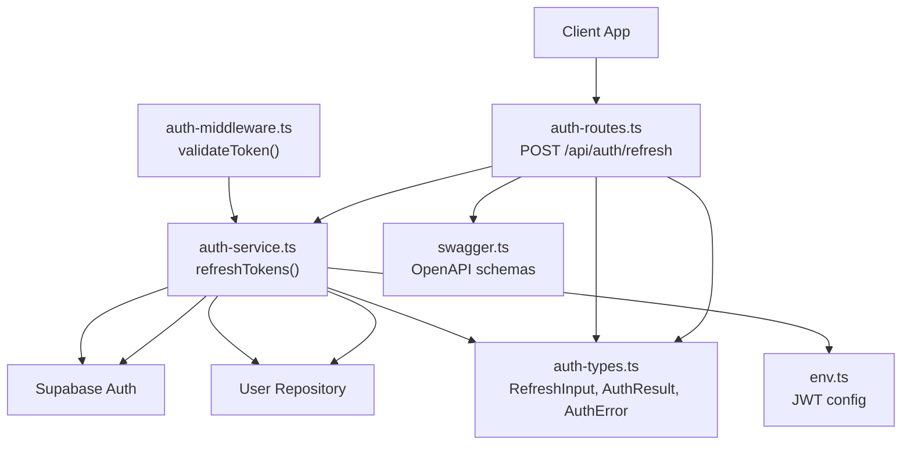
```mermaid
graph TB
Client["Client App"] --> Routes["auth-routes.ts<br/>POST /api/auth/refresh"]
Routes --> Service["auth-service.ts<br/>refreshTokens()"]
Service --> Supabase["Supabase Auth"]
Service --> Repo["User Repository"]
Routes --> Types["auth-types.ts<br/>RefreshInput, AuthResult, AuthError"]
Middleware["auth-middleware.ts<br/>validateToken()"] --> Service
Config["env.ts<br/>JWT config"]
Swagger["swagger.ts<br/>OpenAPI schemas"]
Routes --> Types
Service --> Types
Service --> Repo
Service --> Supabase
Service --> Config
Routes --> Swagger
```

**Diagram sources**
- [auth-routes.ts](file://src/routes/auth-routes.ts#L318-L385)
- [auth-service.ts](file://src/services/auth-service.ts#L203-L228)
- [auth-types.ts](file://src/services/auth-types.ts#L1-L49)
- [auth-middleware.ts](file://src/middleware/auth-middleware.ts#L1-L71)
- [env.ts](file://src/config/env.ts#L52-L58)
- [swagger.ts](file://src/config/swagger.ts#L1-L233)

**Section sources**
- [auth-routes.ts](file://src/routes/auth-routes.ts#L318-L385)
- [auth-service.ts](file://src/services/auth-service.ts#L203-L228)
- [auth-types.ts](file://src/services/auth-types.ts#L1-L49)
- [auth-middleware.ts](file://src/middleware/auth-middleware.ts#L1-L71)
- [env.ts](file://src/config/env.ts#L52-L58)
- [swagger.ts](file://src/config/swagger.ts#L1-L233)

## Core Components
- Endpoint: POST /api/auth/refresh
- Request body: RefreshInput with refreshToken
- Success response: 200 OK with AuthResult containing user, accessToken, and refreshToken
- Error responses:
  - 400 Bad Request for missing or invalid refreshToken
  - 401 Unauthorized for expired or invalid refresh token

Key implementation references:
- Route handler and OpenAPI schema for RefreshInput and AuthResult
- Service function refreshTokens that calls Supabase auth refreshSession
- Type definitions for RefreshInput, AuthResult, AuthError
- JWT configuration for secrets and expirations

**Section sources**
- [auth-routes.ts](file://src/routes/auth-routes.ts#L64-L115)
- [auth-routes.ts](file://src/routes/auth-routes.ts#L318-L385)
- [auth-service.ts](file://src/services/auth-service.ts#L203-L228)
- [auth-types.ts](file://src/services/auth-types.ts#L1-L49)
- [env.ts](file://src/config/env.ts#L52-L58)

## Architecture Overview
The refresh flow integrates with Supabase Auth to rotate tokens while ensuring the user still exists in the application’s database.

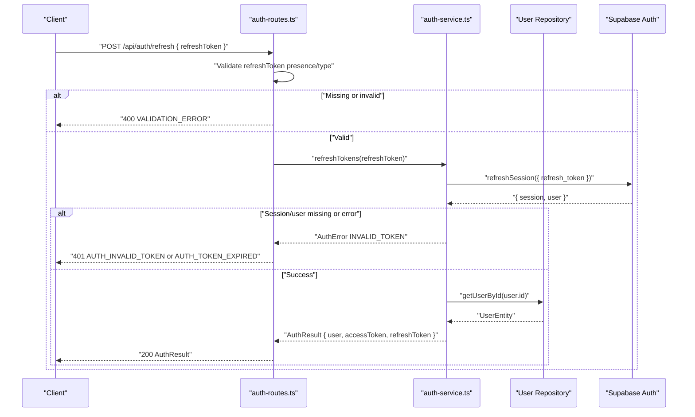
```mermaid
sequenceDiagram
participant C as "Client"
participant R as "auth-routes.ts"
participant S as "auth-service.ts"
participant U as "User Repository"
participant SB as "Supabase Auth"
C->>R : "POST /api/auth/refresh { refreshToken }"
R->>R : "Validate refreshToken presence/type"
alt "Missing or invalid"
R-->>C : "400 VALIDATION_ERROR"
else "Valid"
R->>S : "refreshTokens(refreshToken)"
S->>SB : "refreshSession({ refresh_token })"
SB-->>S : "{ session, user }"
alt "Session/user missing or error"
S-->>R : "AuthError INVALID_TOKEN"
R-->>C : "401 AUTH_INVALID_TOKEN or AUTH_TOKEN_EXPIRED"
else "Success"
S->>U : "getUserById(user.id)"
U-->>S : "UserEntity"
S-->>R : "AuthResult { user, accessToken, refreshToken }"
R-->>C : "200 AuthResult"
end
end
```

**Diagram sources**
- [auth-routes.ts](file://src/routes/auth-routes.ts#L352-L385)
- [auth-service.ts](file://src/services/auth-service.ts#L206-L228)

## Detailed Component Analysis

### Endpoint Definition: POST /api/auth/refresh
- Method: POST
- Path: /api/auth/refresh
- Request body: RefreshInput
  - refreshToken: string (required)
- Responses:
  - 200 OK: AuthResult
  - 400 Bad Request: AuthError with VALIDATION_ERROR
  - 401 Unauthorized: AuthError with AUTH_INVALID_TOKEN or AUTH_TOKEN_EXPIRED

OpenAPI schema definitions:
- RefreshInput: object with required refreshToken
- AuthResult: object with user, accessToken, refreshToken

Validation logic:
- Route checks for presence and type of refreshToken
- Returns 400 with details if missing or not a string

**Section sources**
- [auth-routes.ts](file://src/routes/auth-routes.ts#L64-L115)
- [auth-routes.ts](file://src/routes/auth-routes.ts#L318-L385)

### Service Implementation: refreshTokens(refreshToken)
Behavior:
- Calls Supabase auth refreshSession with the provided refresh token
- On success, retrieves the associated user from the application’s user repository
- Returns AuthResult with updated access and refresh tokens
- On failure, returns AuthError with INVALID_TOKEN and explanatory message

JWT validation:
- Access tokens are validated by auth-middleware.ts using validateToken
- validateToken calls Supabase getUser with the access token to verify signature and expiration
- The service itself relies on Supabase for refresh token validation

**Section sources**
- [auth-service.ts](file://src/services/auth-service.ts#L203-L228)
- [auth-middleware.ts](file://src/middleware/auth-middleware.ts#L25-L70)

### Token Rotation Strategy
- Access tokens are short-lived (configured via JWT_EXPIRES_IN)
- Refresh tokens are long-lived (configured via JWT_REFRESH_EXPIRES_IN)
- On successful refresh, both access and refresh tokens are rotated
- The system delegates signature verification and expiration checks to Supabase Auth

JWT configuration:
- JWT_SECRET and JWT_REFRESH_SECRET are loaded from environment
- Expirations are configured via JWT_EXPIRES_IN and JWT_REFRESH_EXPIRES_IN

**Section sources**
- [env.ts](file://src/config/env.ts#L52-L58)
- [auth-service.ts](file://src/services/auth-service.ts#L231-L259)

### Data Models and Types
- RefreshInput: { refreshToken: string }
- AuthResult: { user, accessToken: string, refreshToken: string }
- AuthError: { code, message }

These types are used consistently across route and service layers.

**Section sources**
- [auth-types.ts](file://src/services/auth-types.ts#L1-L49)

### Example Requests and Responses
- Request body (JSON):
  - refreshToken: string
- Successful response body (JSON):
  - user: { id, email, role, walletAddress, createdAt }
  - accessToken: string
  - refreshToken: string
- Error response body (JSON):
  - error: { code, message, details? }
  - timestamp: string (ISO 8601)
  - requestId: string

Notes:
- The endpoint returns 400 for missing/invalid refreshToken
- Returns 401 for expired or invalid refresh token

**Section sources**
- [auth-routes.ts](file://src/routes/auth-routes.ts#L64-L115)
- [auth-routes.ts](file://src/routes/auth-routes.ts#L352-L385)
- [auth-service.ts](file://src/services/auth-service.ts#L206-L228)

### JWT Signature and Expiration Validation
- Access token validation:
  - auth-middleware.ts splits Authorization header and calls validateToken
  - validateToken uses Supabase getUser to verify token signature and expiration
  - Returns user claims or AuthError on failure
- Refresh token validation:
  - refreshTokens uses Supabase refreshSession
  - On error or missing session/user, returns AuthError INVALID_TOKEN

This design leverages Supabase’s JWT verification, ensuring robust signature and expiration checks without manual decoding.

**Section sources**
- [auth-middleware.ts](file://src/middleware/auth-middleware.ts#L25-L70)
- [auth-service.ts](file://src/services/auth-service.ts#L206-L228)

## Dependency Analysis
The refresh flow depends on:
- Route handler for input validation and response formatting
- Service layer for token rotation and user lookup
- Supabase Auth for JWT validation and rotation
- User repository for user existence and profile data
- Configuration for JWT secrets and expirations
- OpenAPI schemas for documentation

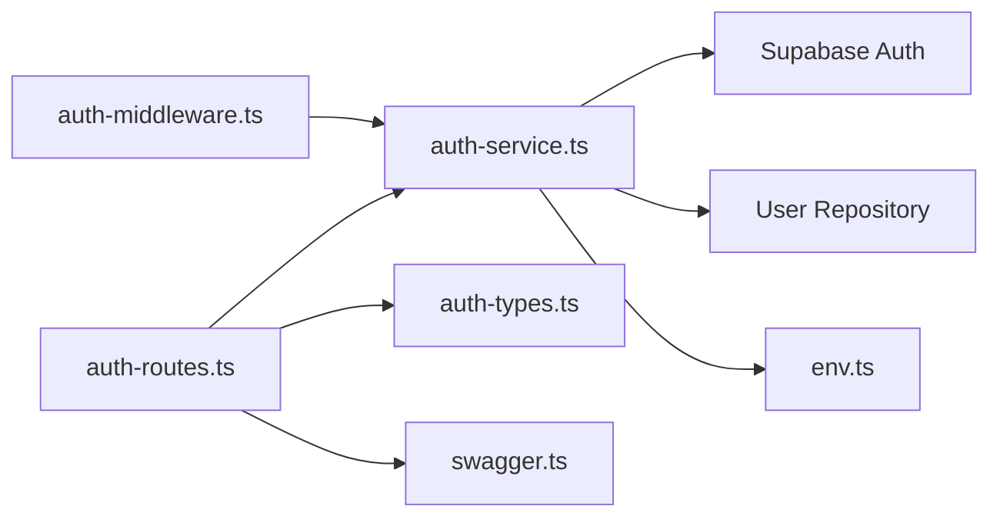
```mermaid
graph LR
Routes["auth-routes.ts"] --> Service["auth-service.ts"]
Routes --> Types["auth-types.ts"]
Service --> Supabase["Supabase Auth"]
Service --> Repo["User Repository"]
Service --> Config["env.ts"]
Routes --> Swagger["swagger.ts"]
Middleware["auth-middleware.ts"] --> Service
```

**Diagram sources**
- [auth-routes.ts](file://src/routes/auth-routes.ts#L318-L385)
- [auth-service.ts](file://src/services/auth-service.ts#L203-L228)
- [auth-types.ts](file://src/services/auth-types.ts#L1-L49)
- [auth-middleware.ts](file://src/middleware/auth-middleware.ts#L1-L71)
- [env.ts](file://src/config/env.ts#L52-L58)
- [swagger.ts](file://src/config/swagger.ts#L1-L233)

**Section sources**
- [auth-routes.ts](file://src/routes/auth-routes.ts#L318-L385)
- [auth-service.ts](file://src/services/auth-service.ts#L203-L228)
- [auth-middleware.ts](file://src/middleware/auth-middleware.ts#L1-L71)
- [env.ts](file://src/config/env.ts#L52-L58)
- [swagger.ts](file://src/config/swagger.ts#L1-L233)

## Performance Considerations
- Refresh calls involve network latency to Supabase; consider caching user data locally for short periods to reduce repeated lookups.
- Rate limiting is applied at the route level to mitigate abuse.
- Keep access token lifetime small and refresh token lifetime larger to balance security and UX.

[No sources needed since this section provides general guidance]

## Troubleshooting Guide
Common issues and resolutions:
- 400 VALIDATION_ERROR:
  - Cause: Missing or invalid refreshToken in request body
  - Resolution: Ensure refreshToken is present and is a string
- 401 AUTH_INVALID_TOKEN or AUTH_TOKEN_EXPIRED:
  - Cause: Refresh token is invalid or expired
  - Resolution: Require the user to log in again to obtain a fresh refresh token
- Internal errors:
  - Cause: Unexpected failures from Supabase or user repository
  - Resolution: Check Supabase connectivity and logs; retry after verifying environment configuration

Operational checks:
- Verify JWT_SECRET/JWT_REFRESH_SECRET and expirations are set correctly
- Confirm Supabase URL and keys are configured
- Ensure the user still exists in the application database

**Section sources**
- [auth-routes.ts](file://src/routes/auth-routes.ts#L352-L385)
- [auth-service.ts](file://src/services/auth-service.ts#L206-L228)
- [env.ts](file://src/config/env.ts#L52-L58)

## Conclusion
The token refresh mechanism in FreelanceXchain is implemented via a dedicated endpoint that rotates both access and refresh tokens using Supabase Auth. The route enforces input validation, while the service performs token rotation and user verification. JWT signature and expiration are validated by Supabase, ensuring secure sessions. Proper configuration of JWT secrets and expirations is essential for balancing security and usability.

[No sources needed since this section summarizes without analyzing specific files]

## Appendices

### API Reference: POST /api/auth/refresh
- Request body: RefreshInput
  - refreshToken: string (required)
- Responses:
  - 200 OK: AuthResult
  - 400 Bad Request: AuthError with VALIDATION_ERROR
  - 401 Unauthorized: AuthError with AUTH_INVALID_TOKEN or AUTH_TOKEN_EXPIRED

**Section sources**
- [auth-routes.ts](file://src/routes/auth-routes.ts#L64-L115)
- [auth-routes.ts](file://src/routes/auth-routes.ts#L318-L385)
- [auth-types.ts](file://src/services/auth-types.ts#L1-L49)

### Secure Storage Recommendations for Refresh Tokens
- Store refresh tokens securely on clients:
  - Use secure, httpOnly cookies when possible
  - Prefer encrypted storage mechanisms (e.g., browser crypto APIs)
  - Avoid storing in localStorage or plain text
- Enforce strict SameSite and Secure attributes for cookies
- Rotate refresh tokens on sensitive actions and logout
- Monitor for suspicious activity and invalidate compromised tokens

[No sources needed since this section provides general guidance]

---

# User Login

<cite>
**Referenced Files in This Document**
- [auth-routes.ts](file://src/routes/auth-routes.ts)
- [auth-service.ts](file://src/services/auth-service.ts)
- [rate-limiter.ts](file://src/middleware/rate-limiter.ts)
- [auth-types.ts](file://src/services/auth-types.ts)
- [user-repository.ts](file://src/repositories/user-repository.ts)
- [user.ts](file://src/models/user.ts)
- [supabase.ts](file://src/config/supabase.ts)
- [swagger.ts](file://src/config/swagger.ts)
</cite>

## Table of Contents
1. [Introduction](#introduction)
2. [Project Structure](#project-structure)
3. [Core Components](#core-components)
4. [Architecture Overview](#architecture-overview)
5. [Detailed Component Analysis](#detailed-component-analysis)
6. [Dependency Analysis](#dependency-analysis)
7. [Performance Considerations](#performance-considerations)
8. [Troubleshooting Guide](#troubleshooting-guide)
9. [Conclusion](#conclusion)

## Introduction
This document provides comprehensive API documentation for the POST /api/auth/login endpoint in the FreelanceXchain system. It covers the LoginInput schema, authentication flow, credential validation, JWT token generation, response format, error handling, and security measures including the authRateLimiter middleware. It also explains how the auth-routes.ts integration works with the login function in auth-service.ts and how the system validates credentials against Supabase authentication while maintaining application-specific user data and roles.

## Project Structure
The login endpoint is implemented as part of the authentication module:
- Route handler: src/routes/auth-routes.ts
- Business logic: src/services/auth-service.ts
- Rate limiting: src/middleware/rate-limiter.ts
- Types: src/services/auth-types.ts
- Data access: src/repositories/user-repository.ts
- User model: src/models/user.ts
- Supabase client: src/config/supabase.ts
- OpenAPI/Swagger definitions: src/config/swagger.ts

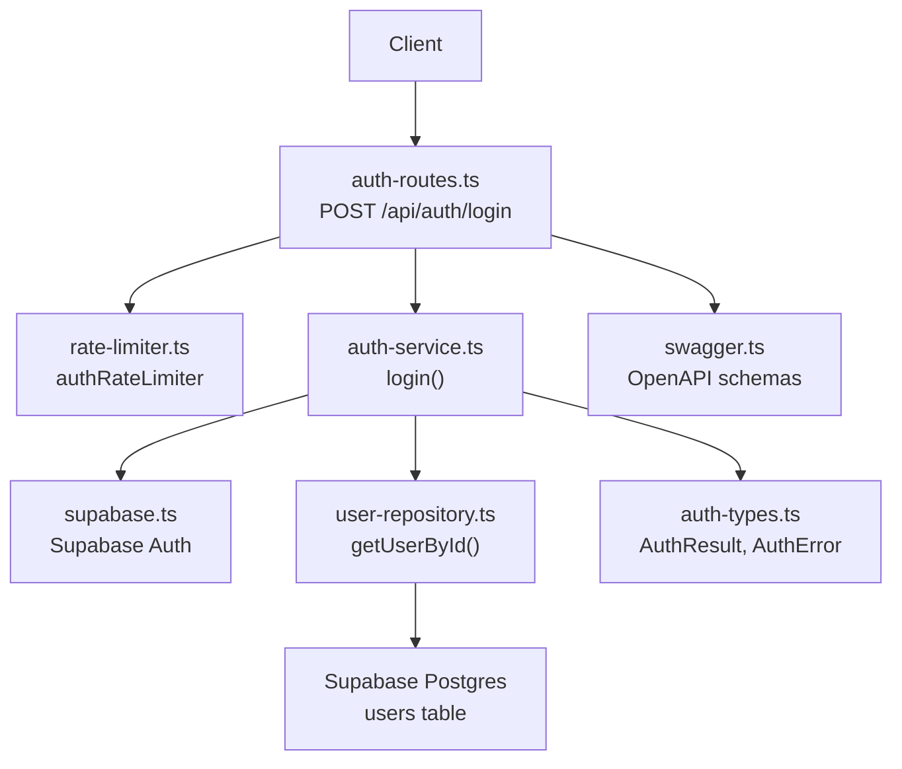
```mermaid
graph TB
Client["Client"] --> Routes["auth-routes.ts<br/>POST /api/auth/login"]
Routes --> Limiter["rate-limiter.ts<br/>authRateLimiter"]
Routes --> Service["auth-service.ts<br/>login()"]
Service --> Supabase["supabase.ts<br/>Supabase Auth"]
Service --> Repo["user-repository.ts<br/>getUserById()"]
Repo --> DB["Supabase Postgres<br/>users table"]
Service --> Types["auth-types.ts<br/>AuthResult, AuthError"]
Routes --> Swagger["swagger.ts<br/>OpenAPI schemas"]
```

**Diagram sources**
- [auth-routes.ts](file://src/routes/auth-routes.ts#L272-L315)
- [rate-limiter.ts](file://src/middleware/rate-limiter.ts#L63-L68)
- [auth-service.ts](file://src/services/auth-service.ts#L157-L201)
- [user-repository.ts](file://src/repositories/user-repository.ts#L24-L41)
- [supabase.ts](file://src/config/supabase.ts#L25-L33)
- [auth-types.ts](file://src/services/auth-types.ts#L11-L49)
- [swagger.ts](file://src/config/swagger.ts#L1-L233)

**Section sources**
- [auth-routes.ts](file://src/routes/auth-routes.ts#L272-L315)
- [rate-limiter.ts](file://src/middleware/rate-limiter.ts#L63-L68)
- [auth-service.ts](file://src/services/auth-service.ts#L157-L201)
- [user-repository.ts](file://src/repositories/user-repository.ts#L24-L41)
- [supabase.ts](file://src/config/supabase.ts#L25-L33)
- [auth-types.ts](file://src/services/auth-types.ts#L11-L49)
- [swagger.ts](file://src/config/swagger.ts#L1-L233)

## Core Components
- Endpoint: POST /api/auth/login
- Request body: LoginInput schema with required fields email and password
- Response: AuthResult with user data, accessToken, and refreshToken
- Error responses: 400 for validation errors, 401 for invalid credentials
- Security: authRateLimiter middleware enforces rate limits to prevent brute force attacks
- Integration: Route handler delegates to auth-service.login; service validates against Supabase Auth and enriches with application user data

**Section sources**
- [auth-routes.ts](file://src/routes/auth-routes.ts#L272-L315)
- [auth-types.ts](file://src/services/auth-types.ts#L11-L33)
- [rate-limiter.ts](file://src/middleware/rate-limiter.ts#L63-L68)
- [auth-service.ts](file://src/services/auth-service.ts#L157-L201)

## Architecture Overview
The login flow integrates route validation, rate limiting, Supabase authentication, and application user data retrieval.

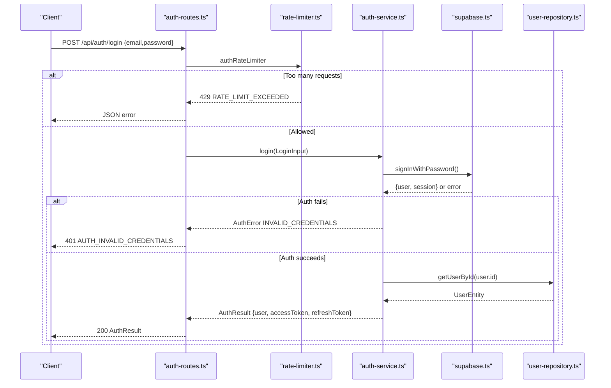
```mermaid
sequenceDiagram
participant C as "Client"
participant R as "auth-routes.ts"
participant L as "rate-limiter.ts"
participant S as "auth-service.ts"
participant SB as "supabase.ts"
participant U as "user-repository.ts"
C->>R : POST /api/auth/login {email,password}
R->>L : authRateLimiter
alt Too many requests
L-->>R : 429 RATE_LIMIT_EXCEEDED
R-->>C : JSON error
else Allowed
R->>S : login(LoginInput)
S->>SB : signInWithPassword()
SB-->>S : {user, session} or error
alt Auth fails
S-->>R : AuthError INVALID_CREDENTIALS
R-->>C : 401 AUTH_INVALID_CREDENTIALS
else Auth succeeds
S->>U : getUserById(user.id)
U-->>S : UserEntity
S-->>R : AuthResult {user, accessToken, refreshToken}
R-->>C : 200 AuthResult
end
end
```

**Diagram sources**
- [auth-routes.ts](file://src/routes/auth-routes.ts#L272-L315)
- [rate-limiter.ts](file://src/middleware/rate-limiter.ts#L27-L61)
- [auth-service.ts](file://src/services/auth-service.ts#L157-L201)
- [user-repository.ts](file://src/repositories/user-repository.ts#L24-L41)
- [supabase.ts](file://src/config/supabase.ts#L25-L33)

## Detailed Component Analysis

### API Definition: POST /api/auth/login
- Method: POST
- Path: /api/auth/login
- Tags: Authentication
- Request body: LoginInput
  - email: string, required
  - password: string, required
- Responses:
  - 200 OK: AuthResult
  - 400 Bad Request: Validation error
  - 401 Unauthorized: Invalid credentials
  - 429 Too Many Requests: Rate limit exceeded

OpenAPI/Swagger schema definitions:
- LoginInput: required fields email and password
- AuthResult: user object with id, email, role, walletAddress, createdAt; accessToken, refreshToken
- AuthError: standardized error envelope with code and message

**Section sources**
- [auth-routes.ts](file://src/routes/auth-routes.ts#L238-L271)
- [auth-routes.ts](file://src/routes/auth-routes.ts#L272-L315)
- [auth-types.ts](file://src/services/auth-types.ts#L11-L33)
- [swagger.ts](file://src/config/swagger.ts#L1-L233)

### Route Handler Behavior
- Input validation: checks email format and presence of password
- Error handling: returns 400 with VALIDATION_ERROR when validation fails
- Rate limiting: applies authRateLimiter before invoking login
- Success path: returns 200 with AuthResult
- Failure path: returns 401 with AUTH_INVALID_CREDENTIALS

**Section sources**
- [auth-routes.ts](file://src/routes/auth-routes.ts#L272-L315)
- [rate-limiter.ts](file://src/middleware/rate-limiter.ts#L63-L68)

### Service Layer: login()
- Normalizes email to lowercase
- Calls Supabase Auth signInWithPassword
- Handles Supabase errors:
  - Email not confirmed -> INVALID_CREDENTIALS
  - Other auth failures -> INVALID_CREDENTIALS
- Retrieves application user data from Supabase Postgres users table via user-repository
- Constructs AuthResult with accessToken and refreshToken from Supabase session

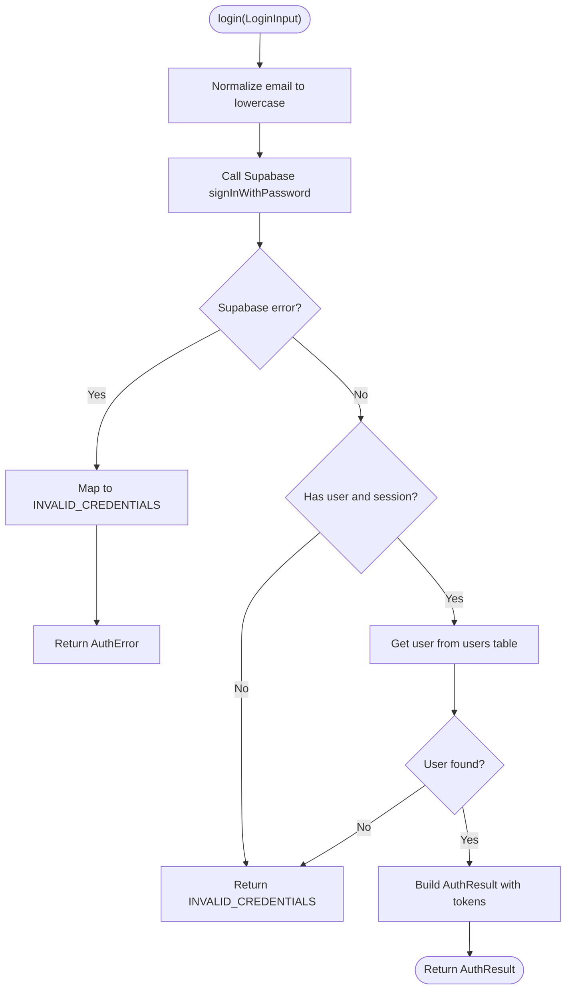
```mermaid
flowchart TD
Start(["login(LoginInput)"]) --> Normalize["Normalize email to lowercase"]
Normalize --> CallSupabase["Call Supabase signInWithPassword"]
CallSupabase --> HasError{"Supabase error?"}
HasError --> |Yes| MapError["Map to INVALID_CREDENTIALS"]
MapError --> ReturnError["Return AuthError"]
HasError --> |No| HasUser{"Has user and session?"}
HasUser --> |No| InvalidCreds["Return INVALID_CREDENTIALS"]
HasUser --> |Yes| GetUser["Get user from users table"]
GetUser --> Found{"User found?"}
Found --> |No| InvalidCreds
Found --> |Yes| BuildResult["Build AuthResult with tokens"]
BuildResult --> Done(["Return AuthResult"])
```

**Diagram sources**
- [auth-service.ts](file://src/services/auth-service.ts#L157-L201)
- [user-repository.ts](file://src/repositories/user-repository.ts#L24-L41)

**Section sources**
- [auth-service.ts](file://src/services/auth-service.ts#L157-L201)
- [user-repository.ts](file://src/repositories/user-repository.ts#L24-L41)

### Data Model: AuthResult and AuthError
- AuthResult:
  - user: id, email, role, walletAddress, createdAt
  - accessToken: string
  - refreshToken: string
- AuthError:
  - code: one of DUPLICATE_EMAIL, INVALID_CREDENTIALS, TOKEN_EXPIRED, INVALID_TOKEN, AUTH_EXCHANGE_FAILED, AUTH_INVALID_TOKEN, AUTH_INVALID_CREDENTIALS, AUTH_REQUIRE_REGISTRATION, VALIDATION_ERROR, INTERNAL_ERROR
  - message: string

These types define the response contract for successful logins and error scenarios.

**Section sources**
- [auth-types.ts](file://src/services/auth-types.ts#L23-L49)

### Middleware: authRateLimiter
- Enforces a sliding window policy:
  - Window: 15 minutes
  - Max requests: 10 attempts
- On limit exceeded:
  - Returns 429 with RATE_LIMIT_EXCEEDED
  - Sets Retry-After header
- Uses client IP (with support for X-Forwarded-For) as the key

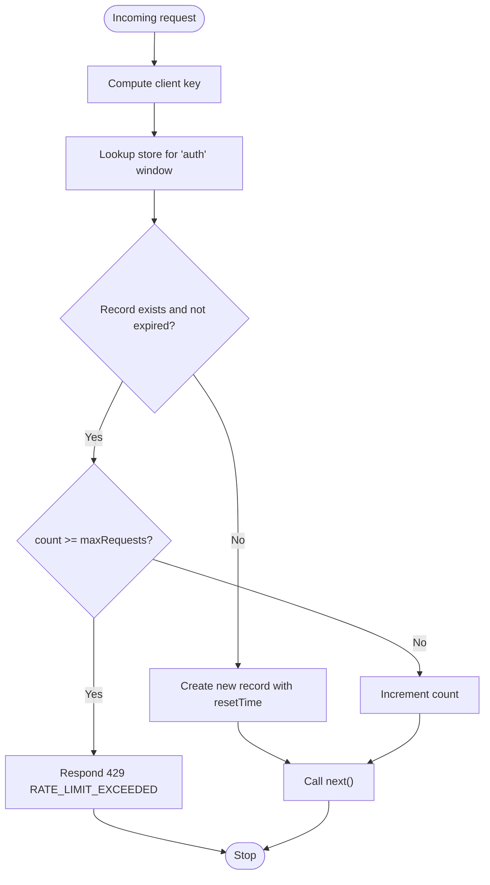
```mermaid
flowchart TD
Enter(["Incoming request"]) --> GetKey["Compute client key"]
GetKey --> Store["Lookup store for 'auth' window"]
Store --> Exists{"Record exists and not expired?"}
Exists --> |No| Create["Create new record with resetTime"]
Exists --> |Yes| CheckLimit{"count >= maxRequests?"}
CheckLimit --> |Yes| Block["Respond 429 RATE_LIMIT_EXCEEDED"]
CheckLimit --> |No| Increment["Increment count"]
Create --> Next["Call next()"]
Increment --> Next
Block --> End(["Stop"])
Next --> End
```

**Diagram sources**
- [rate-limiter.ts](file://src/middleware/rate-limiter.ts#L27-L61)

**Section sources**
- [rate-limiter.ts](file://src/middleware/rate-limiter.ts#L27-L61)
- [rate-limiter.ts](file://src/middleware/rate-limiter.ts#L63-L68)

### Supabase Integration and Application User Data
- Supabase Auth manages email/password credentials and sessions
- Application user data (role, walletAddress, timestamps) is stored in Supabase Postgres users table
- After successful Supabase login, the service retrieves the application user record and returns it alongside tokens
- This ensures:
  - Strong credential validation via Supabase
  - Application-specific roles and metadata remain synchronized

**Section sources**
- [auth-service.ts](file://src/services/auth-service.ts#L157-L201)
- [user-repository.ts](file://src/repositories/user-repository.ts#L24-L41)
- [supabase.ts](file://src/config/supabase.ts#L25-L33)

### Error Handling and Codes
- Validation errors (400):
  - VALIDATION_ERROR with details array
- Authentication errors (401):
  - AUTH_INVALID_CREDENTIALS for invalid email/password
  - INVALID_CREDENTIALS for Supabase-level failures (e.g., unconfirmed email)
- Rate limiting (429):
  - RATE_LIMIT_EXCEEDED with Retry-After

**Section sources**
- [auth-routes.ts](file://src/routes/auth-routes.ts#L272-L315)
- [auth-service.ts](file://src/services/auth-service.ts#L157-L201)
- [rate-limiter.ts](file://src/middleware/rate-limiter.ts#L27-L61)

### Example Requests and Responses
- Successful login request:
  - POST /api/auth/login
  - Body: { "email": "<user@example.com>", "password": "<securePassword>" }
  - Response: 200 OK with AuthResult containing user, accessToken, refreshToken
- Validation error response (400):
  - Body: { "error": { "code": "VALIDATION_ERROR", "message": "Invalid request data", "details": [ { "field": "email", "message": "Valid email is required" } ] }, "timestamp": "...", "requestId": "..." }
- Invalid credentials response (401):
  - Body: { "error": { "code": "AUTH_INVALID_CREDENTIALS", "message": "Invalid email or password" }, "timestamp": "...", "requestId": "..." }
- Rate limit exceeded response (429):
  - Body: { "error": { "code": "RATE_LIMIT_EXCEEDED", "message": "Too many authentication attempts, please try again later" }, "retryAfter": 900, "timestamp": "...", "requestId": "..." }

Note: These examples illustrate the structure and codes. See the referenced files for exact field names and shapes.

**Section sources**
- [auth-routes.ts](file://src/routes/auth-routes.ts#L272-L315)
- [auth-types.ts](file://src/services/auth-types.ts#L23-L49)
- [rate-limiter.ts](file://src/middleware/rate-limiter.ts#L27-L61)

## Dependency Analysis
The login endpoint depends on:
- Route handler for request parsing and response formatting
- Rate limiter for security
- Service layer for business logic and external integrations
- Supabase client for authentication
- Repository for application user data

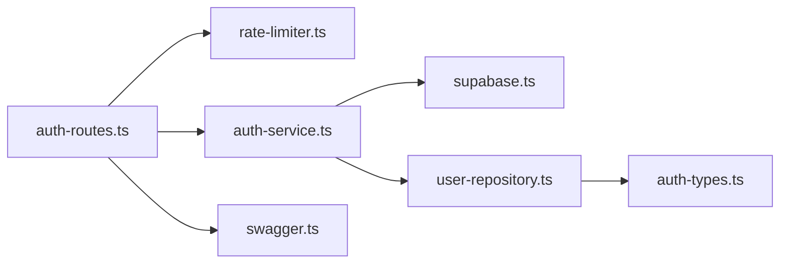
```mermaid
graph LR
Routes["auth-routes.ts"] --> Limiter["rate-limiter.ts"]
Routes --> Service["auth-service.ts"]
Service --> Supabase["supabase.ts"]
Service --> Repo["user-repository.ts"]
Repo --> Types["auth-types.ts"]
Routes --> Swagger["swagger.ts"]
```

**Diagram sources**
- [auth-routes.ts](file://src/routes/auth-routes.ts#L272-L315)
- [rate-limiter.ts](file://src/middleware/rate-limiter.ts#L63-L68)
- [auth-service.ts](file://src/services/auth-service.ts#L157-L201)
- [user-repository.ts](file://src/repositories/user-repository.ts#L24-L41)
- [supabase.ts](file://src/config/supabase.ts#L25-L33)
- [auth-types.ts](file://src/services/auth-types.ts#L11-L33)
- [swagger.ts](file://src/config/swagger.ts#L1-L233)

**Section sources**
- [auth-routes.ts](file://src/routes/auth-routes.ts#L272-L315)
- [rate-limiter.ts](file://src/middleware/rate-limiter.ts#L63-L68)
- [auth-service.ts](file://src/services/auth-service.ts#L157-L201)
- [user-repository.ts](file://src/repositories/user-repository.ts#L24-L41)
- [supabase.ts](file://src/config/supabase.ts#L25-L33)
- [auth-types.ts](file://src/services/auth-types.ts#L11-L33)
- [swagger.ts](file://src/config/swagger.ts#L1-L233)

## Performance Considerations
- Supabase calls incur network latency; keep payloads minimal
- Rate limiting reduces load during brute force attempts
- Consider caching user roles and metadata for subsequent requests if appropriate
- Monitor Supabase rate limits and adjust authRateLimiter as needed

[No sources needed since this section provides general guidance]

## Troubleshooting Guide
Common issues and resolutions:
- 400 Validation Error:
  - Ensure email is present and valid; ensure password is present
  - Check for typos in field names
- 401 Invalid Credentials:
  - Verify email and password are correct
  - Confirm email is verified in Supabase
  - Check that the user exists in the application users table
- 429 Rate Limit Exceeded:
  - Wait until the window resets (Retry-After seconds)
  - Reduce login attempts or adjust client-side retry logic
- Internal errors:
  - Inspect Supabase connectivity and configuration
  - Verify JWT secret and expiration settings

**Section sources**
- [auth-routes.ts](file://src/routes/auth-routes.ts#L272-L315)
- [auth-service.ts](file://src/services/auth-service.ts#L157-L201)
- [rate-limiter.ts](file://src/middleware/rate-limiter.ts#L27-L61)
- [supabase.ts](file://src/config/supabase.ts#L25-L33)

## Conclusion
The POST /api/auth/login endpoint provides a secure, validated authentication flow that leverages Supabase for credential management while preserving application-specific user data and roles. The route handler performs input validation and applies rate limiting, while the service layer coordinates with Supabase Auth and the application user repository to produce a standardized AuthResult. Clear error responses and rate limiting protect the system from abuse and provide predictable client experiences.

---

# User Registration

<cite>
**Referenced Files in This Document**
- [auth-routes.ts](file://src/routes/auth-routes.ts)
- [auth-service.ts](file://src/services/auth-service.ts)
- [auth-types.ts](file://src/services/auth-types.ts)
- [rate-limiter.ts](file://src/middleware/rate-limiter.ts)
- [user-repository.ts](file://src/repositories/user-repository.ts)
- [supabase.ts](file://src/config/supabase.ts)
- [swagger.ts](file://src/config/swagger.ts)
- [API-DOCUMENTATION.md](file://docs/API-DOCUMENTATION.md)
</cite>

## Table of Contents
1. [Introduction](#introduction)
2. [Project Structure](#project-structure)
3. [Core Components](#core-components)
4. [Architecture Overview](#architecture-overview)
5. [Detailed Component Analysis](#detailed-component-analysis)
6. [Dependency Analysis](#dependency-analysis)
7. [Performance Considerations](#performance-considerations)
8. [Troubleshooting Guide](#troubleshooting-guide)
9. [Conclusion](#conclusion)

## Introduction
This document provides comprehensive API documentation for the user registration endpoint in the FreelanceXchain system. It covers the POST /api/auth/register endpoint, including request body schema, validation rules, success and error responses, and the interaction between the route handler and the authentication service. It also explains how the authRateLimiter middleware protects against abuse and how Supabase handles initial OAuth user creation before role assignment.

## Project Structure
The registration flow spans several layers:
- Route handler: validates inputs, applies rate limiting, and delegates to the service layer
- Service layer: orchestrates Supabase Auth and database operations
- Repository layer: interacts with the Supabase Postgres users table
- Middleware: enforces rate limits and request validation
- Configuration: Supabase client initialization and Swagger/OpenAPI definitions

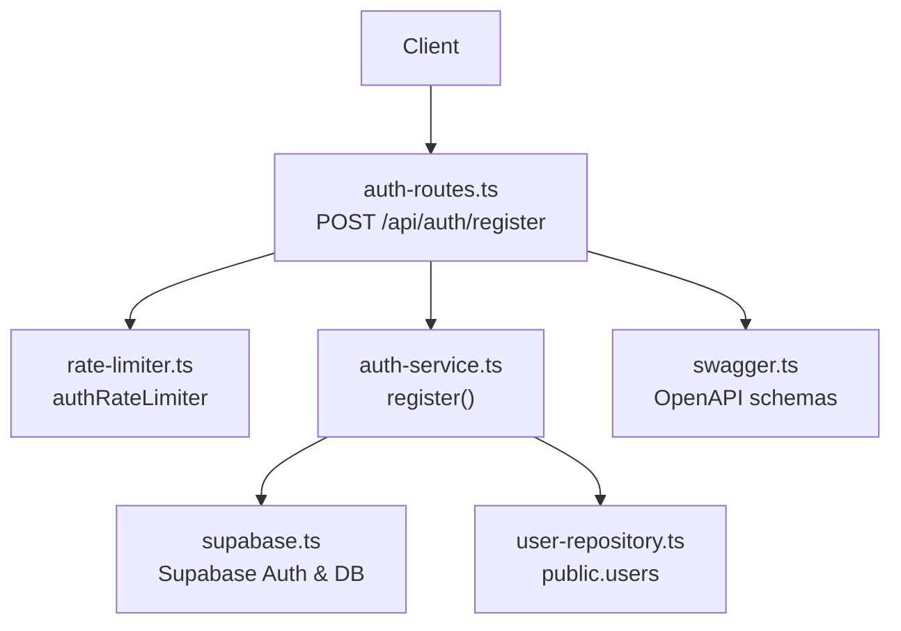
```mermaid
graph TB
Client["Client"] --> Routes["auth-routes.ts<br/>POST /api/auth/register"]
Routes --> Limiter["rate-limiter.ts<br/>authRateLimiter"]
Routes --> Service["auth-service.ts<br/>register()"]
Service --> Supabase["supabase.ts<br/>Supabase Auth & DB"]
Service --> Repo["user-repository.ts<br/>public.users"]
Routes --> Swagger["swagger.ts<br/>OpenAPI schemas"]
```

**Diagram sources**
- [auth-routes.ts](file://src/routes/auth-routes.ts#L160-L235)
- [rate-limiter.ts](file://src/middleware/rate-limiter.ts#L64-L68)
- [auth-service.ts](file://src/services/auth-service.ts#L68-L155)
- [user-repository.ts](file://src/repositories/user-repository.ts#L1-L58)
- [supabase.ts](file://src/config/supabase.ts#L25-L33)
- [swagger.ts](file://src/config/swagger.ts#L1-L233)

**Section sources**
- [auth-routes.ts](file://src/routes/auth-routes.ts#L160-L235)
- [rate-limiter.ts](file://src/middleware/rate-limiter.ts#L64-L68)
- [auth-service.ts](file://src/services/auth-service.ts#L68-L155)
- [user-repository.ts](file://src/repositories/user-repository.ts#L1-L58)
- [supabase.ts](file://src/config/supabase.ts#L25-L33)
- [swagger.ts](file://src/config/swagger.ts#L1-L233)

## Core Components
- Endpoint: POST /api/auth/register
- Purpose: Create a new user account with email/password, assign role, and optionally set name and wallet address
- Success response: 201 with AuthResult schema
- Error responses: 400 for validation errors, 409 for duplicate email
- Rate limiting: authRateLimiter configured for 10 requests per 15 minutes

**Section sources**
- [auth-routes.ts](file://src/routes/auth-routes.ts#L126-L159)
- [auth-routes.ts](file://src/routes/auth-routes.ts#L160-L235)
- [rate-limiter.ts](file://src/middleware/rate-limiter.ts#L64-L68)
- [API-DOCUMENTATION.md](file://docs/API-DOCUMENTATION.md#L613-L642)

## Architecture Overview
The registration flow integrates Supabase Auth for identity and the application’s database for user profiles. The route handler performs input validation and rate limiting, then calls the service layer to register the user. The service layer registers with Supabase Auth, waits for the database trigger to populate public.users, and returns an AuthResult with tokens.

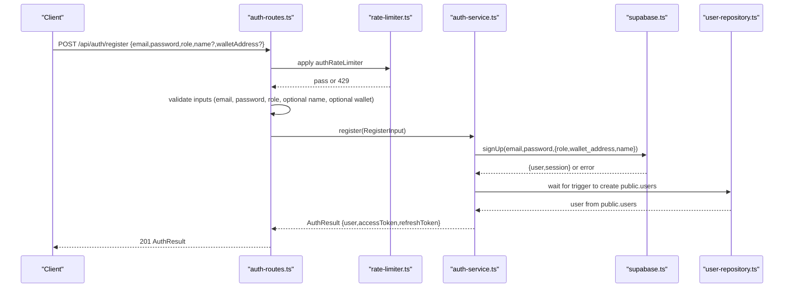
```mermaid
sequenceDiagram
participant C as "Client"
participant R as "auth-routes.ts"
participant RL as "rate-limiter.ts"
participant S as "auth-service.ts"
participant SB as "supabase.ts"
participant DB as "user-repository.ts"
C->>R : POST /api/auth/register {email,password,role,name?,walletAddress?}
R->>RL : apply authRateLimiter
RL-->>R : pass or 429
R->>R : validate inputs (email, password, role, optional name, optional wallet)
R->>S : register(RegisterInput)
S->>SB : signUp(email,password,{role,wallet_address,name})
SB-->>S : {user,session} or error
S->>DB : wait for trigger to create public.users
DB-->>S : user from public.users
S-->>R : AuthResult {user,accessToken,refreshToken}
R-->>C : 201 AuthResult
```

**Diagram sources**
- [auth-routes.ts](file://src/routes/auth-routes.ts#L160-L235)
- [rate-limiter.ts](file://src/middleware/rate-limiter.ts#L64-L68)
- [auth-service.ts](file://src/services/auth-service.ts#L68-L155)
- [user-repository.ts](file://src/repositories/user-repository.ts#L1-L58)
- [supabase.ts](file://src/config/supabase.ts#L25-L33)

## Detailed Component Analysis

### Endpoint Definition and OpenAPI Schema
- Endpoint: POST /api/auth/register
- Tags: Authentication
- Request body schema: RegisterInput
  - email: string, format: email, required
  - password: string, min length 8, required
  - role: string, enum: freelancer, employer, required
  - name: string, min length 2, optional
  - walletAddress: string, pattern 0x[a-fA-F0-9]{40}, optional
- Responses:
  - 201: AuthResult
  - 400: AuthError (validation errors)
  - 409: AuthError (duplicate email)

**Section sources**
- [auth-routes.ts](file://src/routes/auth-routes.ts#L26-L115)
- [auth-routes.ts](file://src/routes/auth-routes.ts#L126-L159)
- [swagger.ts](file://src/config/swagger.ts#L1-L233)

### Request Validation Rules
- Email validation:
  - Format: email
  - Length: minimum 5 characters
- Password validation:
  - Minimum length: 8 characters
  - Requirements enforced by validatePasswordStrength:
    - At least one lowercase letter
    - At least one uppercase letter
    - At least one digit
    - At least one special character from [@ $ ! % * ? &]
- Role validation:
  - Enumerated values: freelancer, employer
- Optional name validation:
  - If provided, minimum length: 2 characters
- Optional wallet address validation:
  - Pattern: 0x followed by exactly 40 hexadecimal characters

These rules are enforced both in the route handler and in the service layer.

**Section sources**
- [auth-routes.ts](file://src/routes/auth-routes.ts#L160-L235)
- [auth-service.ts](file://src/services/auth-service.ts#L21-L48)

### Success Response: AuthResult
On successful registration, the endpoint returns:
- HTTP 201 Created
- Body: AuthResult
  - user: {
      - id: string
      - email: string
      - role: string (freelancer, employer, admin)
      - walletAddress: string
      - createdAt: string (ISO 8601)
    }
  - accessToken: string
  - refreshToken: string

The service constructs AuthResult from the Supabase user and session, and from the public.users row.

**Section sources**
- [auth-routes.ts](file://src/routes/auth-routes.ts#L126-L159)
- [auth-service.ts](file://src/services/auth-service.ts#L50-L62)
- [auth-types.ts](file://src/services/auth-types.ts#L23-L33)

### Error Responses
- 400 Bad Request:
  - Validation errors: includes details array with field and message
  - Example codes: VALIDATION_ERROR
- 409 Conflict:
  - Duplicate email encountered
  - Code: DUPLICATE_EMAIL

The route handler translates service errors into appropriate HTTP status codes.

**Section sources**
- [auth-routes.ts](file://src/routes/auth-routes.ts#L200-L235)
- [auth-service.ts](file://src/services/auth-service.ts#L72-L105)
- [API-DOCUMENTATION.md](file://docs/API-DOCUMENTATION.md#L634-L641)

### Rate Limiting: authRateLimiter
- Window: 15 minutes
- Max requests: 10 per client IP
- Behavior: Returns 429 Too Many Requests with Retry-After header and RATE_LIMIT_EXCEEDED error

The middleware uses X-Forwarded-For when present, otherwise falls back to req.ip.

**Section sources**
- [rate-limiter.ts](file://src/middleware/rate-limiter.ts#L1-L81)

### Interaction Between auth-routes.ts and registerWithSupabase
- The route handler calls register(RegisterInput) in auth-service.ts
- registerWithSupabase is used for OAuth registration (separate endpoint)
- For email/password registration, the route handler calls register, which internally:
  - Normalizes email
  - Checks for duplicate email in public.users
  - Calls Supabase Auth signUp with role, wallet_address, and name in user options
  - Waits briefly for trigger to create public.users
  - Returns AuthResult with tokens

**Section sources**
- [auth-routes.ts](file://src/routes/auth-routes.ts#L160-L235)
- [auth-service.ts](file://src/services/auth-service.ts#L68-L155)

### Supabase OAuth User Creation and Role Assignment
- Initial OAuth flow:
  - getOAuthUrl redirects to provider
  - exchangeCodeForSession exchanges authorization code for tokens
  - loginWithSupabase validates access token and checks if a public.users record exists
  - If not found, returns AUTH_REQUIRE_REGISTRATION indicating role selection is required
- OAuth registration:
  - /api/auth/oauth/register accepts accessToken, role, optional name, optional walletAddress
  - registerWithSupabase updates user metadata in Supabase Auth and creates a record in public.users
  - Returns AuthResult with tokens

This separation ensures that Supabase creates the user record first, then the application assigns role and profile attributes.

**Section sources**
- [auth-routes.ts](file://src/routes/auth-routes.ts#L416-L473)
- [auth-routes.ts](file://src/routes/auth-routes.ts#L639-L753)
- [auth-service.ts](file://src/services/auth-service.ts#L261-L402)

### Wallet Address Pattern
- Pattern: 0x[a-fA-F0-9]{40}
- Matches Ethereum-style addresses with leading 0x and exactly 40 hex digits
- Enforced both in route-level validation and Swagger schema

**Section sources**
- [auth-routes.ts](file://src/routes/auth-routes.ts#L192-L196)
- [swagger.ts](file://src/config/swagger.ts#L1-L233)

## Dependency Analysis
The registration flow depends on:
- Supabase client for Auth operations and database access
- User repository for database interactions
- Rate limiter middleware for abuse protection
- Swagger/OpenAPI for schema definitions

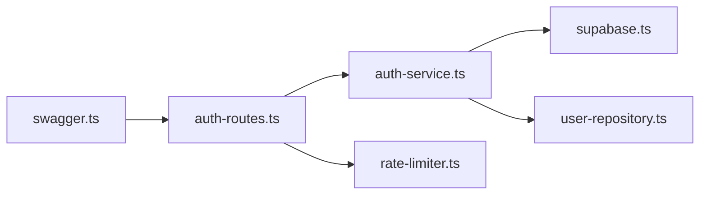
```mermaid
graph LR
Routes["auth-routes.ts"] --> Service["auth-service.ts"]
Routes --> Limiter["rate-limiter.ts"]
Service --> Supabase["supabase.ts"]
Service --> Repo["user-repository.ts"]
Swagger["swagger.ts"] --> Routes
```

**Diagram sources**
- [auth-routes.ts](file://src/routes/auth-routes.ts#L160-L235)
- [rate-limiter.ts](file://src/middleware/rate-limiter.ts#L64-L68)
- [auth-service.ts](file://src/services/auth-service.ts#L68-L155)
- [user-repository.ts](file://src/repositories/user-repository.ts#L1-L58)
- [supabase.ts](file://src/config/supabase.ts#L25-L33)
- [swagger.ts](file://src/config/swagger.ts#L1-L233)

**Section sources**
- [auth-routes.ts](file://src/routes/auth-routes.ts#L160-L235)
- [auth-service.ts](file://src/services/auth-service.ts#L68-L155)
- [user-repository.ts](file://src/repositories/user-repository.ts#L1-L58)
- [supabase.ts](file://src/config/supabase.ts#L25-L33)
- [swagger.ts](file://src/config/swagger.ts#L1-L233)

## Performance Considerations
- Input validation occurs in-memory before hitting Supabase, reducing unnecessary network calls
- The service waits briefly for a database trigger to populate public.users; this introduces a small latency but ensures consistency
- Rate limiting prevents brute-force attempts and protects downstream systems

[No sources needed since this section provides general guidance]

## Troubleshooting Guide
Common issues and resolutions:
- Validation failures (400):
  - Ensure email matches format and length requirements
  - Ensure password meets minimum length and complexity requirements
  - Ensure role is one of freelancer or employer
  - If name is provided, ensure minimum length of 2 characters
  - If walletAddress is provided, ensure it matches 0x followed by 40 hex characters
- Duplicate email (409):
  - Another user already registered with the same normalized email
  - Ask the user to log in or use a different email
- Rate limit exceeded (429):
  - Exceeded 10 requests in 15 minutes; wait for Retry-After seconds before retrying
- Internal errors:
  - Occur when Supabase operations fail; check logs and environment variables for Supabase configuration

**Section sources**
- [auth-routes.ts](file://src/routes/auth-routes.ts#L160-L235)
- [auth-service.ts](file://src/services/auth-service.ts#L72-L105)
- [rate-limiter.ts](file://src/middleware/rate-limiter.ts#L44-L55)
- [supabase.ts](file://src/config/supabase.ts#L25-L33)

## Conclusion
The POST /api/auth/register endpoint provides a robust, validated, and rate-limited pathway to create new user accounts. It integrates tightly with Supabase Auth for identity while persisting user profiles in the application database. The endpoint returns a standardized AuthResult on success and clearly defined error responses for validation and conflict scenarios. The authRateLimiter helps protect the system from abuse, and the separation of concerns across route, service, and repository layers keeps the code maintainable and testable.

---

# OAuth Integration

<cite>
**Referenced Files in This Document**
- [auth-routes.ts](file://src/routes/auth-routes.ts)
- [auth-service.ts](file://src/services/auth-service.ts)
- [auth-types.ts](file://src/services/auth-types.ts)
- [supabase.ts](file://src/config/supabase.ts)
- [env.ts](file://src/config/env.ts)
- [user-repository.ts](file://src/repositories/user-repository.ts)
- [user.ts](file://src/models/user.ts)
- [API-DOCUMENTATION.md](file://docs/API-DOCUMENTATION.md)
- [TECHNICAL-SPECS.md](file://docs/TECHNICAL-SPECS.md)
</cite>

## Table of Contents
1. [Introduction](#introduction)
2. [Project Structure](#project-structure)
3. [Core Components](#core-components)
4. [Architecture Overview](#architecture-overview)
5. [Detailed Component Analysis](#detailed-component-analysis)
6. [Dependency Analysis](#dependency-analysis)
7. [Performance Considerations](#performance-considerations)
8. [Troubleshooting Guide](#troubleshooting-guide)
9. [Conclusion](#conclusion)
10. [Appendices](#appendices)

## Introduction
This document provides comprehensive API documentation for the OAuth integration system in FreelanceXchain. It covers the complete OAuth flow including initiating provider login, handling callbacks for both PKCE and implicit flows, and the “registration required” flow for new OAuth users. It also documents the exchangeCodeForSession and loginWithSupabase functions, explains security considerations around state management and token validation, and outlines how external identities are securely linked to internal user accounts with optional blockchain wallet integration.

## Project Structure
The OAuth integration spans routing, service logic, configuration, and data access layers:
- Routes define the OAuth endpoints and handle request/response flows.
- Services encapsulate Supabase OAuth interactions and internal user synchronization.
- Configuration supplies Supabase client initialization and environment variables.
- Repositories manage persistence of user records in the database.

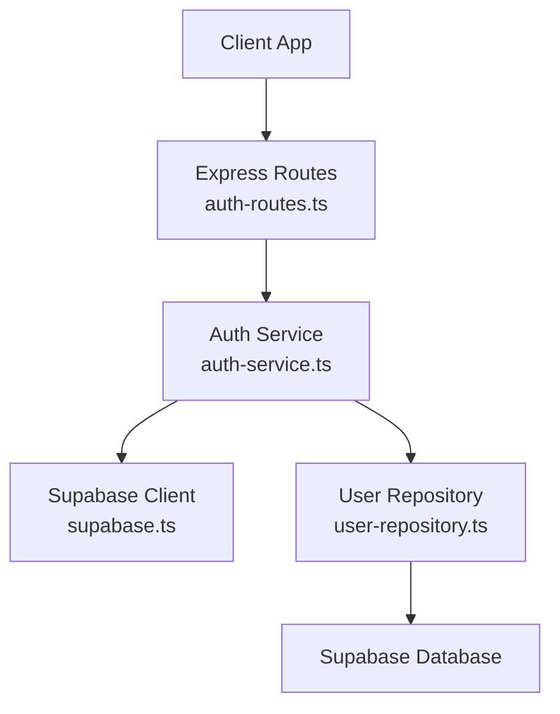
```mermaid
graph TB
Client["Client App"] --> Routes["Express Routes<br/>auth-routes.ts"]
Routes --> Service["Auth Service<br/>auth-service.ts"]
Service --> Supabase["Supabase Client<br/>supabase.ts"]
Service --> Repo["User Repository<br/>user-repository.ts"]
Repo --> DB["Supabase Database"]
```

**Diagram sources**
- [auth-routes.ts](file://src/routes/auth-routes.ts#L532-L563)
- [auth-service.ts](file://src/services/auth-service.ts#L298-L345)
- [supabase.ts](file://src/config/supabase.ts#L25-L33)
- [user-repository.ts](file://src/repositories/user-repository.ts#L15-L58)

**Section sources**
- [auth-routes.ts](file://src/routes/auth-routes.ts#L532-L563)
- [auth-service.ts](file://src/services/auth-service.ts#L298-L345)
- [supabase.ts](file://src/config/supabase.ts#L25-L33)
- [user-repository.ts](file://src/repositories/user-repository.ts#L15-L58)

## Core Components
- OAuth initiation endpoint: GET /api/auth/oauth/:provider
- Callback handler: GET /api/auth/callback (PKCE) and POST /api/auth/oauth/callback (implicit)
- Registration continuation: POST /api/auth/oauth/register
- Supporting service functions:
  - getOAuthUrl(provider)
  - exchangeCodeForSession(code)
  - loginWithSupabase(accessToken)
  - registerWithSupabase(accessToken, role, walletAddress, name)

These components collectively implement a robust OAuth integration with Supabase, including handling new user registration and linking external identities to internal user profiles.

**Section sources**
- [auth-routes.ts](file://src/routes/auth-routes.ts#L532-L563)
- [auth-routes.ts](file://src/routes/auth-routes.ts#L387-L473)
- [auth-routes.ts](file://src/routes/auth-routes.ts#L565-L637)
- [auth-service.ts](file://src/services/auth-service.ts#L298-L345)
- [auth-service.ts](file://src/services/auth-service.ts#L347-L402)

## Architecture Overview
The OAuth flow integrates with Supabase for provider redirection and token exchange. The backend validates tokens, checks for existing user records, and either returns app tokens or signals that registration is required.

```mermaid
sequenceDiagram
participant C as "Client App"
participant R as "Routes<br/>auth-routes.ts"
participant S as "Service<br/>auth-service.ts"
participant SB as "Supabase"
participant U as "User Repository<br/>user-repository.ts"
C->>R : "GET /api/auth/oauth/ : provider"
R->>S : "getOAuthUrl(provider)"
S->>SB : "signInWithOAuth(options)"
SB-->>S : "OAuth URL"
S-->>R : "OAuth URL"
R-->>C : "302 Redirect to provider"
C->>SB : "Provider login"
SB-->>R : "GET /api/auth/callback?code=..."
R->>S : "exchangeCodeForSession(code)"
S->>SB : "exchangeCodeForSession(code)"
SB-->>S : "{access_token, refresh_token}"
S-->>R : "{access_token, refresh_token}"
R->>S : "loginWithSupabase(access_token)"
S->>SB : "getUser(access_token)"
SB-->>S : "User"
S->>U : "getUserByEmail(user.email)"
U-->>S : "UserEntity or null"
alt "Existing user"
S-->>R : "AuthResult"
R-->>C : "200 OK with tokens"
else "New user"
S-->>R : "AUTH_REQUIRE_REGISTRATION"
R-->>C : "202 Registration Required"
end
```

**Diagram sources**
- [auth-routes.ts](file://src/routes/auth-routes.ts#L532-L563)
- [auth-routes.ts](file://src/routes/auth-routes.ts#L387-L473)
- [auth-service.ts](file://src/services/auth-service.ts#L298-L345)
- [auth-service.ts](file://src/services/auth-service.ts#L261-L293)
- [user-repository.ts](file://src/repositories/user-repository.ts#L28-L41)

## Detailed Component Analysis

### OAuth Initiation Endpoint: GET /api/auth/oauth/:provider
- Purpose: Redirect clients to the selected provider’s OAuth page.
- Providers supported: google, github, azure, linkedin.
- Behavior:
  - Validates provider parameter.
  - Calls getOAuthUrl(provider) to obtain a Supabase OAuth URL with configured redirect and parameters.
  - Responds with a 302 redirect to the provider.

Security considerations:
- The redirect URL is built from environment configuration and points to the backend’s callback endpoint.
- The provider mapping adjusts LinkedIn to the OIDC provider alias recognized by Supabase.

**Section sources**
- [auth-routes.ts](file://src/routes/auth-routes.ts#L532-L563)
- [auth-service.ts](file://src/services/auth-service.ts#L298-L324)
- [env.ts](file://src/config/env.ts#L41-L67)

### Callback Handler: GET /api/auth/callback (PKCE)
- Purpose: Handle provider redirects containing an authorization code.
- Flow:
  - If an error is present, returns a 400 with error details.
  - If a code is present, exchanges it for session tokens via exchangeCodeForSession(code).
  - Validates the resulting access token with loginWithSupabase(access_token).
  - If the user exists, returns 200 with app tokens.
  - If the user does not exist, returns 202 with registration_required and the provider access token.

Implicit flow note:
- The route also serves a minimal HTML page that extracts tokens from the URL fragment and posts them to POST /api/auth/oauth/callback.

**Section sources**
- [auth-routes.ts](file://src/routes/auth-routes.ts#L387-L473)
- [auth-service.ts](file://src/services/auth-service.ts#L326-L345)
- [auth-service.ts](file://src/services/auth-service.ts#L261-L293)

### Implicit Flow Handler: POST /api/auth/oauth/callback
- Purpose: Legacy support for implicit flow where tokens arrive in the URL fragment.
- Behavior:
  - Validates presence of access_token.
  - Calls loginWithSupabase(access_token).
  - Returns 200 on success or 202 if registration is required.
  - Returns 401 on invalid token.

**Section sources**
- [auth-routes.ts](file://src/routes/auth-routes.ts#L565-L637)
- [auth-service.ts](file://src/services/auth-service.ts#L261-L293)

### Registration Continuation: POST /api/auth/oauth/register
- Purpose: Finalize OAuth registration by assigning a role and optional profile details.
- Request body:
  - accessToken (required)
  - role (freelancer or employer)
  - name (optional)
  - walletAddress (optional, validated as Ethereum address)
- Behavior:
  - Validates inputs.
  - Calls registerWithSupabase(accessToken, role, walletAddress, name).
  - On success, returns 201 with app tokens and user profile.
  - On failure, returns 401 with error details.

**Section sources**
- [auth-routes.ts](file://src/routes/auth-routes.ts#L639-L753)
- [auth-service.ts](file://src/services/auth-service.ts#L347-L402)

### Service Functions: exchangeCodeForSession and loginWithSupabase
- exchangeCodeForSession(code):
  - Exchanges the authorization code received from the provider for Supabase session tokens.
  - Returns either an AuthError or a tuple of access and refresh tokens.

- loginWithSupabase(accessToken):
  - Validates the Supabase access token and retrieves the user.
  - Checks if a corresponding user record exists in the application database.
  - Returns AUTH_REQUIRE_REGISTRATION if the user does not exist.
  - Otherwise, returns an AuthResult with app tokens and user profile.

```mermaid
flowchart TD
Start(["exchangeCodeForSession(code)"]) --> CallSupabase["Call Supabase exchangeCodeForSession(code)"]
CallSupabase --> HasError{"Error or no session?"}
HasError --> |Yes| ReturnError["Return AuthError"]
HasError --> |No| ReturnTokens["Return {access_token, refresh_token}"]
subgraph "loginWithSupabase(accessToken)"
A["getUser(access_token)"] --> B{"User found?"}
B --> |No| E["Return INVALID_TOKEN"]
B --> |Yes| C["getUserByEmail(user.email)"]
C --> D{"User exists in DB?"}
D --> |No| F["Return AUTH_REQUIRE_REGISTRATION"]
D --> |Yes| G["getSession() for refresh_token"]
G --> H["Return AuthResult"]
end
```

**Diagram sources**
- [auth-service.ts](file://src/services/auth-service.ts#L326-L345)
- [auth-service.ts](file://src/services/auth-service.ts#L261-L293)

**Section sources**
- [auth-service.ts](file://src/services/auth-service.ts#L326-L345)
- [auth-service.ts](file://src/services/auth-service.ts#L261-L293)

### Data Model and Types
- AuthResult: includes user profile, accessToken, and refreshToken.
- AuthError: standardized error codes for authentication failures.
- UserRole: union of freelancer, employer, admin.

**Section sources**
- [auth-types.ts](file://src/services/auth-types.ts#L16-L49)
- [user.ts](file://src/models/user.ts#L1-L4)

### Security Considerations
- Provider selection validation prevents unsupported providers.
- Redirect URL is constructed from environment variables to ensure callbacks reach the intended backend.
- Token validation occurs via Supabase getUser and local user lookup.
- The implicit flow handler responds with a minimal HTML page that posts tokens to a dedicated endpoint to reduce exposure of tokens in browser history.
- Registration requires explicit role selection, preventing ambiguous identity states.

**Section sources**
- [auth-routes.ts](file://src/routes/auth-routes.ts#L532-L563)
- [auth-routes.ts](file://src/routes/auth-routes.ts#L387-L473)
- [auth-routes.ts](file://src/routes/auth-routes.ts#L565-L637)
- [auth-service.ts](file://src/services/auth-service.ts#L298-L324)

### Frontend Integration Examples
- PKCE flow:
  - Client navigates to GET /api/auth/oauth/:provider.
  - After provider login, Supabase redirects to GET /api/auth/callback with an authorization code.
  - Backend exchanges code for tokens and returns either 200 with tokens or 202 with registration_required.
  - For new users, client calls POST /api/auth/oauth/register with accessToken and role.

- Implicit flow:
  - Client navigates to GET /api/auth/oauth/:provider.
  - After provider login, Supabase redirects to GET /api/auth/callback with tokens in the URL fragment.
  - The route serves a minimal HTML page that extracts tokens and posts them to POST /api/auth/oauth/callback.
  - Backend validates the token and returns 200 or 202.

- Reference documentation:
  - API overview and examples are documented in the project’s API documentation.

**Section sources**
- [API-DOCUMENTATION.md](file://docs/API-DOCUMENTATION.md#L73-L149)
- [TECHNICAL-SPECS.md](file://docs/TECHNICAL-SPECS.md#L361-L386)
- [auth-routes.ts](file://src/routes/auth-routes.ts#L387-L473)
- [auth-routes.ts](file://src/routes/auth-routes.ts#L565-L637)

### Identity Linking and Blockchain Wallet Integration
- External identity linkage:
  - loginWithSupabase validates the provider token and checks for a corresponding user in the application database.
  - If the user does not exist, the system signals registration_required, prompting the client to call POST /api/auth/oauth/register.
  - registerWithSupabase updates Supabase user metadata (role, name, wallet address) and creates a record in the application database.

- Wallet integration:
  - The registration endpoint accepts an optional walletAddress parameter.
  - The user model includes a wallet_address field, enabling downstream blockchain features.

**Section sources**
- [auth-service.ts](file://src/services/auth-service.ts#L261-L293)
- [auth-service.ts](file://src/services/auth-service.ts#L347-L402)
- [user-repository.ts](file://src/repositories/user-repository.ts#L1-L14)
- [user.ts](file://src/models/user.ts#L1-L4)

## Dependency Analysis
The OAuth integration depends on Supabase for provider authentication and token management, while the application maintains user records in the database.

```mermaid
graph LR
Routes["auth-routes.ts"] --> Service["auth-service.ts"]
Service --> Supabase["supabase.ts"]
Service --> Repo["user-repository.ts"]
Repo --> DB["Supabase DB"]
Service --> Types["auth-types.ts"]
Service --> Models["user.ts"]
Routes --> Env["env.ts"]
```

**Diagram sources**
- [auth-routes.ts](file://src/routes/auth-routes.ts#L532-L563)
- [auth-service.ts](file://src/services/auth-service.ts#L298-L345)
- [supabase.ts](file://src/config/supabase.ts#L25-L33)
- [user-repository.ts](file://src/repositories/user-repository.ts#L15-L58)
- [auth-types.ts](file://src/services/auth-types.ts#L16-L49)
- [user.ts](file://src/models/user.ts#L1-L4)
- [env.ts](file://src/config/env.ts#L41-L67)

**Section sources**
- [auth-routes.ts](file://src/routes/auth-routes.ts#L532-L563)
- [auth-service.ts](file://src/services/auth-service.ts#L298-L345)
- [supabase.ts](file://src/config/supabase.ts#L25-L33)
- [user-repository.ts](file://src/repositories/user-repository.ts#L15-L58)
- [auth-types.ts](file://src/services/auth-types.ts#L16-L49)
- [user.ts](file://src/models/user.ts#L1-L4)
- [env.ts](file://src/config/env.ts#L41-L67)

## Performance Considerations
- Token exchange and user lookup are lightweight operations; ensure Supabase connectivity is reliable and consider caching refresh tokens on the client to minimize repeated exchanges.
- Rate limiting is applied to authentication endpoints to mitigate abuse.
- Avoid long-running synchronous operations in the callback handlers; keep them asynchronous to reduce latency.

[No sources needed since this section provides general guidance]

## Troubleshooting Guide
Common issues and resolutions:
- Invalid provider: Ensure provider is one of google, github, azure, linkedin.
- Missing or invalid access_token: Verify the implicit flow handler receives a valid token and that the token is posted to the correct endpoint.
- AUTH_REQUIRE_REGISTRATION: Client must call POST /api/auth/oauth/register with accessToken and role.
- AUTH_INVALID_TOKEN: Confirm the token is fresh and not expired; refresh if necessary.
- Redirect URL mismatch: Verify PUBLIC_URL or BASE_URL environment variables are correctly set.

**Section sources**
- [auth-routes.ts](file://src/routes/auth-routes.ts#L532-L563)
- [auth-routes.ts](file://src/routes/auth-routes.ts#L565-L637)
- [auth-service.ts](file://src/services/auth-service.ts#L261-L293)
- [env.ts](file://src/config/env.ts#L41-L67)

## Conclusion
The OAuth integration in FreelanceXchain provides a secure, extensible foundation for external identity management. It supports multiple providers, handles both PKCE and implicit flows, and seamlessly links external identities to internal user accounts. The design emphasizes clear separation of concerns, robust error handling, and straightforward client integration patterns.

[No sources needed since this section summarizes without analyzing specific files]

## Appendices

### API Endpoints Summary
- GET /api/auth/oauth/:provider
  - Redirects to provider login page.
- GET /api/auth/callback
  - Handles PKCE flow; returns tokens or registration_required.
- POST /api/auth/oauth/callback
  - Handles implicit flow; returns success or registration_required.
- POST /api/auth/oauth/register
  - Completes OAuth registration with role assignment.

**Section sources**
- [API-DOCUMENTATION.md](file://docs/API-DOCUMENTATION.md#L73-L149)
- [auth-routes.ts](file://src/routes/auth-routes.ts#L532-L563)
- [auth-routes.ts](file://src/routes/auth-routes.ts#L387-L473)
- [auth-routes.ts](file://src/routes/auth-routes.ts#L565-L637)
- [auth-routes.ts](file://src/routes/auth-routes.ts#L639-L753)

---

# OAuth Callback Handling

<cite>
**Referenced Files in This Document**
- [auth-routes.ts](file://src/routes/auth-routes.ts)
- [auth-service.ts](file://src/services/auth-service.ts)
- [auth-types.ts](file://src/services/auth-types.ts)
- [supabase.ts](file://src/config/supabase.ts)
- [API-DOCUMENTATION.md](file://docs/API-DOCUMENTATION.md)
- [README.md](file://README.md)
</cite>

## Table of Contents
1. [Introduction](#introduction)
2. [Project Structure](#project-structure)
3. [Core Components](#core-components)
4. [Architecture Overview](#architecture-overview)
5. [Detailed Component Analysis](#detailed-component-analysis)
6. [Dependency Analysis](#dependency-analysis)
7. [Performance Considerations](#performance-considerations)
8. [Troubleshooting Guide](#troubleshooting-guide)
9. [Conclusion](#conclusion)
10. [Appendices](#appendices)

## Introduction
This document explains the OAuth callback handling system used by FreelanceXchain. It covers:
- The GET /api/auth/callback endpoint for PKCE flows (authorization code in query parameters)
- The POST /api/auth/oauth/callback endpoint for implicit flows (access tokens in URL fragments)
- How authorization codes are exchanged for sessions using exchangeCodeForSession
- How tokens are extracted from URL fragments and forwarded to the backend
- The 202 “registration required” response logic for new OAuth users
- Error handling for OAuth failures and token validation
- Security considerations around state validation and token verification
- Implementation details from auth-service.ts and examples of frontend integration for both flow types

## Project Structure
The OAuth callback handling spans routing, service-layer logic, and configuration:
- Routes define the endpoints and orchestrate the flow
- Services encapsulate Supabase interactions and token validation
- Configuration provides the Supabase client used by services

```mermaid
graph TB
subgraph "Routes"
R1["GET /api/auth/callback"]
R2["POST /api/auth/oauth/callback"]
R3["GET /api/auth/oauth/:provider"]
end
subgraph "Services"
S1["exchangeCodeForSession(code)"]
S2["loginWithSupabase(accessToken)"]
S3["registerWithSupabase(accessToken, role, walletAddress, name)"]
end
subgraph "Config"
C1["getSupabaseClient()"]
end
R1 --> S1
R1 --> S2
R2 --> S2
R3 --> C1
S1 --> C1
S2 --> C1
S3 --> C1
```

**Diagram sources**
- [auth-routes.ts](file://src/routes/auth-routes.ts#L387-L637)
- [auth-service.ts](file://src/services/auth-service.ts#L296-L402)
- [supabase.ts](file://src/config/supabase.ts#L25-L33)

**Section sources**
- [auth-routes.ts](file://src/routes/auth-routes.ts#L387-L637)
- [auth-service.ts](file://src/services/auth-service.ts#L296-L402)
- [supabase.ts](file://src/config/supabase.ts#L25-L33)

## Core Components
- Route handlers for OAuth callbacks:
  - GET /api/auth/callback: PKCE flow handler; validates errors, exchanges code, logs in, and responds with either tokens or 202 registration required
  - POST /api/auth/oauth/callback: Implicit flow handler; validates access_token, logs in, and responds with success or 202/401
- Service functions:
  - exchangeCodeForSession(code): Exchanges an authorization code for Supabase session tokens
  - loginWithSupabase(accessToken): Validates a Supabase access token and returns app tokens; triggers 202 when user does not exist in the app
  - registerWithSupabase(accessToken, role, walletAddress, name): Completes OAuth registration by updating user metadata and creating a local user record
- Types and errors:
  - AuthResult and AuthError types define response shapes and error codes used across routes and services

**Section sources**
- [auth-routes.ts](file://src/routes/auth-routes.ts#L387-L637)
- [auth-service.ts](file://src/services/auth-service.ts#L263-L402)
- [auth-types.ts](file://src/services/auth-types.ts#L1-L49)

## Architecture Overview
The system integrates with Supabase Auth to handle OAuth providers and exchange authorization codes for session tokens. The backend verifies tokens and synchronizes user records, returning either app JWT tokens or guiding the client to complete registration.

```mermaid
sequenceDiagram
participant Client as "Client Browser"
participant Routes as "Auth Routes"
participant Service as "Auth Service"
participant Supabase as "Supabase Auth"
participant DB as "Supabase DB"
Client->>Routes : GET /api/auth/oauth/ : provider
Routes->>Supabase : signInWithOAuth(options)
Supabase-->>Routes : redirect_url
Routes-->>Client : 302 Redirect
Client->>Routes : GET /api/auth/callback?code=...
Routes->>Service : exchangeCodeForSession(code)
Service->>Supabase : exchangeCodeForSession(code)
Supabase-->>Service : {access_token, refresh_token}
Service-->>Routes : tokens
Routes->>Service : loginWithSupabase(access_token)
Service->>Supabase : getUser(access_token)
alt User exists in app
Service->>DB : fetch user profile
DB-->>Service : user
Service-->>Routes : AuthResult
Routes-->>Client : 200 {access_token, refresh_token, user}
else User does not exist in app
Service-->>Routes : AUTH_REQUIRE_REGISTRATION
Routes-->>Client : 202 {status : "registration_required", access_token}
end
```

**Diagram sources**
- [auth-routes.ts](file://src/routes/auth-routes.ts#L387-L473)
- [auth-service.ts](file://src/services/auth-service.ts#L296-L345)
- [auth-service.ts](file://src/services/auth-service.ts#L263-L293)

## Detailed Component Analysis

### GET /api/auth/callback (PKCE Flow)
Behavior:
- Validates OAuth error query parameters and returns 400 on failure
- If code is present, exchanges it for session tokens using exchangeCodeForSession
- Calls loginWithSupabase with the returned access token
- Responds with 200 and tokens if the user exists in the app
- Responds with 202 and access_token if the user does not exist in the app (registration required)
- Responds with 401 on invalid token or exchange failure

```mermaid
flowchart TD
Start(["GET /api/auth/callback"]) --> CheckError["Check 'error' query param"]
CheckError --> HasError{"Error present?"}
HasError --> |Yes| Return400["Return 400 OAuth error"]
HasError --> |No| HasCode{"Has 'code' query param?"}
HasCode --> |No| ImplicitFlow["Serve implicit flow HTML<br/>extract tokens from URL fragment"]
HasCode --> |Yes| Exchange["exchangeCodeForSession(code)"]
Exchange --> ExchangeOK{"Exchange success?"}
ExchangeOK --> |No| Return401["Return 401 AUTH_EXCHANGE_FAILED"]
ExchangeOK --> |Yes| Login["loginWithSupabase(access_token)"]
Login --> LoginOK{"Login success?"}
LoginOK --> |No| RegReq{"Is AUTH_REQUIRE_REGISTRATION?"}
RegReq --> |Yes| Return202["Return 202 registration_required"]
RegReq --> |No| Return401b["Return 401 AUTH_INVALID_TOKEN"]
LoginOK --> |Yes| Return200["Return 200 {access_token, refresh_token, user}"]
```

**Diagram sources**
- [auth-routes.ts](file://src/routes/auth-routes.ts#L387-L473)
- [auth-service.ts](file://src/services/auth-service.ts#L296-L345)
- [auth-service.ts](file://src/services/auth-service.ts#L263-L293)

**Section sources**
- [auth-routes.ts](file://src/routes/auth-routes.ts#L387-L473)
- [auth-service.ts](file://src/services/auth-service.ts#L296-L345)
- [auth-service.ts](file://src/services/auth-service.ts#L263-L293)

### POST /api/auth/oauth/callback (Implicit Flow)
Behavior:
- Validates presence of access_token in request body
- Calls loginWithSupabase with the access_token
- Responds with 200 on success
- Responds with 202 when registration is required
- Responds with 401 on invalid token

```mermaid
sequenceDiagram
participant Client as "Client Browser"
participant Routes as "Auth Routes"
participant Service as "Auth Service"
participant Supabase as "Supabase Auth"
Client->>Routes : POST /api/auth/oauth/callback {access_token}
Routes->>Service : loginWithSupabase(access_token)
Service->>Supabase : getUser(access_token)
alt User exists in app
Service-->>Routes : AuthResult
Routes-->>Client : 200 {status : "success"}
else Registration required
Service-->>Routes : AUTH_REQUIRE_REGISTRATION
Routes-->>Client : 202 {status : "registration_required", accessToken}
else Invalid token
Service-->>Routes : AuthError
Routes-->>Client : 401 {error}
end
```

**Diagram sources**
- [auth-routes.ts](file://src/routes/auth-routes.ts#L565-L637)
- [auth-service.ts](file://src/services/auth-service.ts#L263-L293)

**Section sources**
- [auth-routes.ts](file://src/routes/auth-routes.ts#L565-L637)
- [auth-service.ts](file://src/services/auth-service.ts#L263-L293)

### exchangeCodeForSession(code)
Purpose:
- Exchanges an authorization code received from the OAuth provider into a Supabase session containing access and refresh tokens

Implementation highlights:
- Uses the Supabase client to call exchangeCodeForSession
- Returns AuthError on failure with code AUTH_EXCHANGE_FAILED
- Returns token pair on success

Security considerations:
- The code is short-lived and bound to the original authorization request
- The exchange occurs server-side, preventing exposure of tokens to the client except via the intended flow

**Section sources**
- [auth-service.ts](file://src/services/auth-service.ts#L329-L345)
- [supabase.ts](file://src/config/supabase.ts#L25-L33)

### loginWithSupabase(accessToken)
Purpose:
- Validates a Supabase access token and returns app tokens
- If the user does not exist in the app’s database, returns AUTH_REQUIRE_REGISTRATION (202)

Implementation highlights:
- Validates token via Supabase getUser
- Checks for user existence in the app’s user table
- Retrieves current session refresh token for completeness
- Returns AuthError with code AUTH_REQUIRE_REGISTRATION when user not found in app

Security considerations:
- Validates token with Supabase before proceeding
- Ensures the user’s email is available for app-level checks

**Section sources**
- [auth-service.ts](file://src/services/auth-service.ts#L263-L293)
- [auth-types.ts](file://src/services/auth-types.ts#L35-L49)

### registerWithSupabase(accessToken, role, walletAddress, name)
Purpose:
- Completes OAuth registration by updating user metadata and creating a local user record

Implementation highlights:
- Validates access token and extracts user email
- Updates Supabase user metadata (role, wallet address, name)
- Creates a local user record in the app’s database
- Returns AuthResult with app tokens

Security considerations:
- Requires a valid Supabase access token
- Role must be one of the supported values
- Wallet address follows a strict format when provided

**Section sources**
- [auth-service.ts](file://src/services/auth-service.ts#L347-L402)
- [auth-types.ts](file://src/services/auth-types.ts#L1-L34)

### Frontend Integration Examples
- PKCE flow (recommended):
  - Initiate OAuth by navigating to GET /api/auth/oauth/:provider
  - After provider consent, the browser is redirected to GET /api/auth/callback?code=...
  - The backend exchanges the code and returns either tokens (200) or registration required (202)
- Implicit flow (legacy):
  - The backend serves a minimal HTML page that extracts tokens from the URL fragment and posts them to POST /api/auth/oauth/callback
  - The backend responds with 200, 202, or 401

Documentation references:
- API endpoints and expected responses are documented in the API documentation

**Section sources**
- [auth-routes.ts](file://src/routes/auth-routes.ts#L387-L473)
- [auth-routes.ts](file://src/routes/auth-routes.ts#L565-L637)
- [API-DOCUMENTATION.md](file://docs/API-DOCUMENTATION.md#L81-L130)

## Dependency Analysis
The OAuth callback system depends on:
- Supabase client for OAuth initiation, token exchange, and user validation
- Auth routes to coordinate flows and respond with standardized statuses
- Auth service functions to encapsulate business logic and error handling

```mermaid
graph LR
Routes["auth-routes.ts"] --> Service["auth-service.ts"]
Service --> Config["supabase.ts"]
Routes --> Types["auth-types.ts"]
Service --> Types
```

**Diagram sources**
- [auth-routes.ts](file://src/routes/auth-routes.ts#L387-L637)
- [auth-service.ts](file://src/services/auth-service.ts#L263-L402)
- [supabase.ts](file://src/config/supabase.ts#L25-L33)
- [auth-types.ts](file://src/services/auth-types.ts#L1-L49)

**Section sources**
- [auth-routes.ts](file://src/routes/auth-routes.ts#L387-L637)
- [auth-service.ts](file://src/services/auth-service.ts#L263-L402)
- [supabase.ts](file://src/config/supabase.ts#L25-L33)
- [auth-types.ts](file://src/services/auth-types.ts#L1-L49)

## Performance Considerations
- Minimal latency: exchangeCodeForSession and loginWithSupabase perform a single Supabase call each
- Reduced round trips: implicit flow HTML page posts tokens directly to the backend
- Caching: consider caching frequent user lookups if traffic increases
- Rate limiting: authentication endpoints are protected by rate limiter middleware

[No sources needed since this section provides general guidance]

## Troubleshooting Guide
Common issues and resolutions:
- OAuth error returned (400): Indicates provider-level error; inspect error and error_description query parameters
- Exchange failure (401): The authorization code may be invalid or expired; retry the OAuth flow
- Registration required (202): The user authenticated with Supabase but does not exist in the app; call POST /api/auth/oauth/register to complete onboarding
- Invalid token (401): The access token is invalid or expired; re-authenticate or refresh tokens

Error codes and handling:
- AUTH_EXCHANGE_FAILED: exchangeCodeForSession returned an error
- AUTH_REQUIRE_REGISTRATION: user exists in Supabase but not in the app
- AUTH_INVALID_TOKEN: loginWithSupabase failed due to invalid token

**Section sources**
- [auth-routes.ts](file://src/routes/auth-routes.ts#L416-L473)
- [auth-routes.ts](file://src/routes/auth-routes.ts#L597-L637)
- [auth-service.ts](file://src/services/auth-service.ts#L296-L345)
- [auth-service.ts](file://src/services/auth-service.ts#L263-L293)
- [auth-types.ts](file://src/services/auth-types.ts#L35-L49)

## Conclusion
FreelanceXchain’s OAuth callback handling provides robust support for both PKCE and implicit flows:
- PKCE flow securely exchanges authorization codes for session tokens and returns either app tokens or registration-required status
- Implicit flow extracts tokens from URL fragments and forwards them to the backend for validation
- The system centralizes token validation and user synchronization via Supabase, returning standardized responses and error codes
- Security is strengthened by server-side exchanges and token verification before issuing app tokens

[No sources needed since this section summarizes without analyzing specific files]

## Appendices

### API Endpoint Reference
- GET /api/auth/oauth/:provider — Initiates OAuth with a provider and redirects to the provider login page
- GET /api/auth/callback — Handles PKCE flow; returns tokens or 202 registration required
- POST /api/auth/oauth/callback — Handles implicit flow; returns success, 202 registration required, or 401
- POST /api/auth/oauth/register — Completes OAuth registration by selecting role and creating a local user record

**Section sources**
- [API-DOCUMENTATION.md](file://docs/API-DOCUMENTATION.md#L73-L130)
- [auth-routes.ts](file://src/routes/auth-routes.ts#L387-L637)

### Security Notes
- State validation: The current implementation does not validate state parameters in the callback. If you require state validation, add state parameter handling in getOAuthUrl and validate it in the callback route.
- Token verification: loginWithSupabase validates the Supabase access token before proceeding; ensure clients store tokens securely and rotate refresh tokens appropriately.
- Redirect URLs: getOAuthUrl constructs redirect URLs using PUBLIC_URL or localhost; ensure PUBLIC_URL is configured correctly for production.

**Section sources**
- [auth-service.ts](file://src/services/auth-service.ts#L296-L324)
- [README.md](file://README.md#L136-L151)

---

# OAuth Provider Initiation

<cite>
**Referenced Files in This Document**
- [auth-routes.ts](file://src/routes/auth-routes.ts)
- [auth-service.ts](file://src/services/auth-service.ts)
- [swagger.ts](file://src/config/swagger.ts)
- [env.ts](file://src/config/env.ts)
- [supabase.ts](file://src/config/supabase.ts)
- [API-DOCUMENTATION.md](file://docs/API-DOCUMENTATION.md)
</cite>

## Table of Contents
1. [Introduction](#introduction)
2. [Project Structure](#project-structure)
3. [Core Components](#core-components)
4. [Architecture Overview](#architecture-overview)
5. [Detailed Component Analysis](#detailed-component-analysis)
6. [Dependency Analysis](#dependency-analysis)
7. [Performance Considerations](#performance-considerations)
8. [Troubleshooting Guide](#troubleshooting-guide)
9. [Conclusion](#conclusion)

## Introduction
This document describes the OAuth provider initiation endpoint GET /api/auth/oauth/:provider in FreelanceXchain. It explains how the route validates the provider parameter, generates the OAuth URL via getOAuthUrl in auth-service.ts, and performs the redirection to the selected provider. It also covers redirect URL configuration, PKCE flow setup, state management for security, and how invalid provider requests are handled. Finally, it documents error responses for unsupported providers and server-side failures during URL generation.

## Project Structure
The OAuth initiation flow spans routing, service-layer logic, and configuration:

- Route handler: GET /api/auth/oauth/:provider
- Service function: getOAuthUrl(provider)
- Supabase client initialization
- Environment configuration for redirect URL and base URL
- OpenAPI/Swagger documentation

```mermaid
graph TB
Client["Client Browser"] --> Route["GET /api/auth/oauth/:provider<br/>in auth-routes.ts"]
Route --> Service["getOAuthUrl(provider)<br/>in auth-service.ts"]
Service --> Supabase["Supabase Auth Client<br/>in supabase.ts"]
Supabase --> Provider["OAuth Provider Login Page"]
Provider --> Callback["/api/auth/callback<br/>PKCE or implicit flow"]
```

**Diagram sources**
- [auth-routes.ts](file://src/routes/auth-routes.ts#L532-L563)
- [auth-service.ts](file://src/services/auth-service.ts#L298-L324)
- [supabase.ts](file://src/config/supabase.ts#L25-L33)
- [API-DOCUMENTATION.md](file://docs/API-DOCUMENTATION.md#L73-L79)

**Section sources**
- [auth-routes.ts](file://src/routes/auth-routes.ts#L532-L563)
- [auth-service.ts](file://src/services/auth-service.ts#L298-L324)
- [swagger.ts](file://src/config/swagger.ts#L1-L40)
- [env.ts](file://src/config/env.ts#L27-L39)
- [supabase.ts](file://src/config/supabase.ts#L25-L33)
- [API-DOCUMENTATION.md](file://docs/API-DOCUMENTATION.md#L73-L79)

## Core Components
- Route handler: Validates provider parameter and delegates to getOAuthUrl, then redirects to the generated URL. It returns 400 for invalid provider and 500 for internal errors.
- Service function: Builds the provider-specific Supabase OAuth URL, sets redirect URL and PKCE-related query parameters, and returns the URL.
- Supabase client: Provides the Supabase Auth client used to generate the OAuth URL.
- Environment configuration: Determines the redirect URL and base URL used in the OAuth flow.

Key behaviors:
- Supported providers: google, github, azure, linkedin
- Redirect URL: Uses PUBLIC_URL or falls back to http://localhost:<port>/api/auth/callback
- PKCE parameters: access_type=offline and prompt=consent are included
- No state parameter is explicitly set in getOAuthUrl; state management is handled by Supabase

**Section sources**
- [auth-routes.ts](file://src/routes/auth-routes.ts#L532-L563)
- [auth-service.ts](file://src/services/auth-service.ts#L298-L324)
- [env.ts](file://src/config/env.ts#L27-L39)
- [supabase.ts](file://src/config/supabase.ts#L25-L33)

## Architecture Overview
The OAuth initiation flow is a thin controller that delegates to a service function which uses the Supabase client to generate the provider URL. The browser is redirected to the provider’s OAuth page. After authentication, the provider redirects back to the configured callback endpoint.

```mermaid
sequenceDiagram
participant C as "Client"
participant R as "Route Handler<br/>GET /api/auth/oauth/ : provider"
participant S as "Service<br/>getOAuthUrl()"
participant SB as "Supabase Client"
participant P as "OAuth Provider"
participant CB as "Callback Endpoint<br/>/api/auth/callback"
C->>R : "GET /api/auth/oauth/google"
R->>R : "Validate provider"
R->>S : "getOAuthUrl('google')"
S->>SB : "signInWithOAuth(options)"
SB-->>S : "OAuth URL"
S-->>R : "URL"
R-->>C : "302 Redirect to provider"
C->>P : "Login and consent"
P-->>CB : "Redirect with code or tokens"
CB-->>C : "App tokens or registration required"
```

**Diagram sources**
- [auth-routes.ts](file://src/routes/auth-routes.ts#L532-L563)
- [auth-service.ts](file://src/services/auth-service.ts#L298-L324)
- [API-DOCUMENTATION.md](file://docs/API-DOCUMENTATION.md#L73-L79)

## Detailed Component Analysis

### Route Handler: GET /api/auth/oauth/:provider
Responsibilities:
- Extracts provider from path parameters
- Validates provider against supported list
- Calls getOAuthUrl(provider)
- Redirects to the generated URL
- Returns 400 for invalid provider and 500 for internal errors

Security and validation:
- Provider validation prevents unsupported values
- No additional state parameter is set here; state is managed by Supabase

Error handling:
- 400: VALIDATION_ERROR with message “Invalid provider”
- 500: INTERNAL_ERROR with message “Failed to initiate OAuth flow”

Client-side initiation examples (conceptual):
- Google: GET /api/auth/oauth/google
- GitHub: GET /api/auth/oauth/github
- Azure: GET /api/auth/oauth/azure
- LinkedIn: GET /api/auth/oauth/linkedin

Notes:
- The route intentionally does not accept a role parameter at this stage; role selection occurs after callback.

**Section sources**
- [auth-routes.ts](file://src/routes/auth-routes.ts#L532-L563)
- [API-DOCUMENTATION.md](file://docs/API-DOCUMENTATION.md#L73-L79)

### Service Function: getOAuthUrl(provider)
Responsibilities:
- Selects the correct provider identifier for Supabase (linkedin_oidc for LinkedIn)
- Determines redirect URL using PUBLIC_URL or falls back to configured base URL and port
- Calls Supabase signInWithOAuth with:
  - redirectTo set to the computed callback URL
  - skipBrowserRedirect set to true (client handles redirect)
  - queryParams: access_type=offline and prompt=consent for PKCE
- Returns the OAuth URL or throws on error

Security and PKCE:
- access_type=offline and prompt=consent enable offline access and re-consent prompts
- skipBrowserRedirect=true ensures the server returns the URL instead of performing automatic browser redirect
- No explicit state parameter is passed; Supabase manages state internally

Redirect URL resolution:
- Uses PUBLIC_URL environment variable if present
- Otherwise constructs http://localhost:<port>/api/auth/callback using config

**Section sources**
- [auth-service.ts](file://src/services/auth-service.ts#L298-L324)
- [env.ts](file://src/config/env.ts#L27-L39)
- [supabase.ts](file://src/config/supabase.ts#L25-L33)

### Supabase Client Initialization
- Ensures SUPABASE_URL and SUPABASE_ANON_KEY are configured
- Provides a singleton Supabase client instance used by getOAuthUrl

**Section sources**
- [supabase.ts](file://src/config/supabase.ts#L25-L33)

### OpenAPI/Swagger Documentation
- The route is documented with path parameter provider constrained to [google, github, azure, linkedin]
- Response is 302 redirect to provider

**Section sources**
- [swagger.ts](file://src/config/swagger.ts#L1-L40)
- [API-DOCUMENTATION.md](file://docs/API-DOCUMENTATION.md#L73-L79)

### PKCE Flow Setup and State Management
- PKCE parameters:
  - access_type=offline
  - prompt=consent
- State management:
  - The service does not explicitly pass a state parameter
  - Supabase handles state internally during signInWithOAuth

Note: The callback endpoint supports both PKCE (code in query) and implicit (tokens in URL fragment). The initiation endpoint focuses on generating the URL with PKCE parameters.

**Section sources**
- [auth-service.ts](file://src/services/auth-service.ts#L298-L324)
- [auth-routes.ts](file://src/routes/auth-routes.ts#L390-L482)

### Error Handling During URL Generation
- Validation failure: 400 with VALIDATION_ERROR
- Internal failure: 500 with INTERNAL_ERROR
- getOAuthUrl throws on Supabase error; the route catches and returns 500

**Section sources**
- [auth-routes.ts](file://src/routes/auth-routes.ts#L532-L563)
- [auth-service.ts](file://src/services/auth-service.ts#L319-L321)

## Dependency Analysis
The OAuth initiation endpoint depends on:
- Route handler for parameter validation and redirection
- Service function for URL generation and PKCE parameters
- Supabase client for OAuth integration
- Environment configuration for redirect URL and base URL

```mermaid
graph LR
Routes["auth-routes.ts"] --> Service["auth-service.ts"]
Service --> Supabase["supabase.ts"]
Service --> Env["env.ts"]
Routes --> Docs["API-DOCUMENTATION.md"]
```

**Diagram sources**
- [auth-routes.ts](file://src/routes/auth-routes.ts#L532-L563)
- [auth-service.ts](file://src/services/auth-service.ts#L298-L324)
- [supabase.ts](file://src/config/supabase.ts#L25-L33)
- [env.ts](file://src/config/env.ts#L27-L39)
- [API-DOCUMENTATION.md](file://docs/API-DOCUMENTATION.md#L73-L79)

**Section sources**
- [auth-routes.ts](file://src/routes/auth-routes.ts#L532-L563)
- [auth-service.ts](file://src/services/auth-service.ts#L298-L324)
- [supabase.ts](file://src/config/supabase.ts#L25-L33)
- [env.ts](file://src/config/env.ts#L27-L39)
- [API-DOCUMENTATION.md](file://docs/API-DOCUMENTATION.md#L73-L79)

## Performance Considerations
- The route is lightweight and delegates to a single service call; latency is dominated by network round-trips to Supabase and the OAuth provider.
- Using skipBrowserRedirect=true avoids unnecessary client-side redirects and lets the server return the URL promptly.
- Ensure PUBLIC_URL is configured correctly to minimize redirect hops and avoid mixed-content issues.

## Troubleshooting Guide
Common issues and resolutions:
- Unsupported provider:
  - Symptom: 400 VALIDATION_ERROR with message “Invalid provider”
  - Resolution: Use one of google, github, azure, linkedin
- Missing Supabase configuration:
  - Symptom: 500 INTERNAL_ERROR during URL generation
  - Resolution: Set SUPABASE_URL and SUPABASE_ANON_KEY
- Incorrect redirect URL:
  - Symptom: Redirect loops or callback failures
  - Resolution: Set PUBLIC_URL to your production origin or ensure local PORT is correct
- Provider-specific misconfiguration:
  - Symptom: Provider rejects the redirect URL or fails to return a code
  - Resolution: Verify provider OAuth app settings and allowed redirect URIs match PUBLIC_URL/api/auth/callback

**Section sources**
- [auth-routes.ts](file://src/routes/auth-routes.ts#L532-L563)
- [auth-service.ts](file://src/services/auth-service.ts#L298-L324)
- [env.ts](file://src/config/env.ts#L27-L39)
- [supabase.ts](file://src/config/supabase.ts#L25-L33)

## Conclusion
The GET /api/auth/oauth/:provider endpoint provides a secure and standardized way to initiate OAuth with supported providers. It validates inputs, generates a provider-specific URL with PKCE parameters, and redirects the client to the provider’s login page. Redirect URL configuration and environment variables are central to correctness. The service layer encapsulates Supabase integration, while the route enforces validation and error handling. For unsupported providers or server-side failures, the endpoint returns appropriate error responses.

---

# OAuth Registration Completion

<cite>
**Referenced Files in This Document**
- [auth-routes.ts](file://src/routes/auth-routes.ts)
- [auth-service.ts](file://src/services/auth-service.ts)
- [user-repository.ts](file://src/repositories/user-repository.ts)
- [supabase.ts](file://src/config/supabase.ts)
- [swagger.ts](file://src/config/swagger.ts)
- [user.ts](file://src/models/user.ts)
- [auth-types.ts](file://src/services/auth-types.ts)
- [entity-mapper.ts](file://src/utils/entity-mapper.ts)
</cite>

## Table of Contents
1. [Introduction](#introduction)
2. [Project Structure](#project-structure)
3. [Core Components](#core-components)
4. [Architecture Overview](#architecture-overview)
5. [Detailed Component Analysis](#detailed-component-analysis)
6. [Dependency Analysis](#dependency-analysis)
7. [Performance Considerations](#performance-considerations)
8. [Troubleshooting Guide](#troubleshooting-guide)
9. [Conclusion](#conclusion)

## Introduction
This document provides comprehensive API documentation for the OAuth registration completion endpoint POST /api/auth/oauth/register in FreelanceXchain. The endpoint finalizes account creation for new OAuth users by assigning a role (freelancer or employer), optionally setting a full name, and validating an Ethereum wallet address format. It integrates with registerWithSupabase in auth-service.ts to validate the Supabase access token, synchronize user metadata in Supabase Auth, and create a corresponding user record in the public.users table. The document explains validation rules, response formats, error handling, and security considerations for token validation and role assignment.

## Project Structure
The OAuth registration flow spans route handlers, service logic, repository access, and Supabase integration. The following diagram shows the primary components involved in the POST /api/auth/oauth/register endpoint.

```mermaid
graph TB
Client["Client Application"] --> Routes["Auth Routes<br/>auth-routes.ts"]
Routes --> Service["Auth Service<br/>auth-service.ts"]
Service --> Repo["User Repository<br/>user-repository.ts"]
Service --> Supabase["Supabase Client<br/>supabase.ts"]
Repo --> DB["PostgreSQL Table<br/>public.users"]
Supabase --> Auth["Supabase Auth"]
```

**Diagram sources**
- [auth-routes.ts](file://src/routes/auth-routes.ts#L640-L753)
- [auth-service.ts](file://src/services/auth-service.ts#L347-L402)
- [user-repository.ts](file://src/repositories/user-repository.ts#L1-L58)
- [supabase.ts](file://src/config/supabase.ts#L1-L44)

**Section sources**
- [auth-routes.ts](file://src/routes/auth-routes.ts#L640-L753)
- [auth-service.ts](file://src/services/auth-service.ts#L347-L402)
- [user-repository.ts](file://src/repositories/user-repository.ts#L1-L58)
- [supabase.ts](file://src/config/supabase.ts#L1-L44)

## Core Components
- Route handler for POST /api/auth/oauth/register validates request fields and invokes registerWithSupabase.
- Service function registerWithSupabase validates the Supabase access token, checks for existing user records, updates Supabase user metadata, and creates a public.users record.
- Repository layer persists user data to the public.users table.
- Supabase client manages authentication and user metadata synchronization.

Key responsibilities:
- Validate accessToken presence and role selection.
- Validate optional name length and wallet address format.
- Authenticate and authorize via Supabase access token.
- Assign role (freelancer or employer) and optional profile metadata.
- Create user record in public.users and return AuthResult.

**Section sources**
- [auth-routes.ts](file://src/routes/auth-routes.ts#L682-L753)
- [auth-service.ts](file://src/services/auth-service.ts#L347-L402)
- [user-repository.ts](file://src/repositories/user-repository.ts#L1-L58)
- [supabase.ts](file://src/config/supabase.ts#L1-L44)

## Architecture Overview
The OAuth registration completion follows a layered architecture:
- Presentation: Express route validates input and delegates to service.
- Application: Service validates token, updates metadata, and creates user.
- Persistence: Repository writes to public.users.
- Integration: Supabase client synchronizes user metadata and sessions.

```mermaid
sequenceDiagram
participant C as "Client"
participant R as "Auth Routes"
participant S as "Auth Service"
participant URepo as "User Repository"
participant Sup as "Supabase Client"
participant DB as "public.users"
C->>R : POST /api/auth/oauth/register {accessToken, role, name?, walletAddress?}
R->>R : Validate accessToken, role, name, walletAddress
R->>S : registerWithSupabase(accessToken, role, walletAddress, name)
S->>Sup : auth.getUser(accessToken)
Sup-->>S : {user} or error
S->>URepo : getUserByEmail(user.email)
alt user exists
S-->>R : AuthResult (existing user)
else user does not exist
S->>Sup : auth.updateUser({role, wallet_address, name})
S->>URepo : createUser({id, email, role, wallet_address, name})
URepo->>DB : INSERT INTO users
S-->>R : AuthResult (new user)
end
R-->>C : 201 AuthResult or 400/401/500
```

**Diagram sources**
- [auth-routes.ts](file://src/routes/auth-routes.ts#L682-L753)
- [auth-service.ts](file://src/services/auth-service.ts#L347-L402)
- [user-repository.ts](file://src/repositories/user-repository.ts#L1-L58)
- [supabase.ts](file://src/config/supabase.ts#L1-L44)

## Detailed Component Analysis

### Endpoint Definition: POST /api/auth/oauth/register
- Method: POST
- Path: /api/auth/oauth/register
- Purpose: Finalize OAuth user registration by assigning role and optional profile metadata.

Request body fields:
- accessToken: string, required. Supabase access token obtained from OAuth flow.
- role: string, required. Must be freelancer or employer.
- name: string, optional. Minimum 2 characters if provided.
- walletAddress: string, optional. Must match Ethereum address pattern 0x followed by 40 hexadecimal characters.

Response:
- 201 Created: AuthResult containing user id, email, role, walletAddress, createdAt, accessToken, refreshToken.
- 400 Bad Request: Validation error with details array indicating invalid fields.
- 401 Unauthorized: Invalid token or registration failure mapped to AUTH_INVALID_TOKEN.
- 500 Internal Server Error: Unexpected error during registration.

Security considerations:
- Access token must be validated via Supabase getUser before proceeding.
- Role must be one of the allowed values.
- Wallet address must conform to Ethereum address format.
- Name must meet minimum length requirement when present.

Validation logic highlights:
- accessToken presence and type checked.
- role restricted to freelancer or employer.
- name length enforced when provided.
- walletAddress format enforced using regex pattern.

Integration points:
- registerWithSupabase performs token validation and metadata update.
- User creation occurs in public.users via repository.
- Session refresh token is included in AuthResult.

**Section sources**
- [auth-routes.ts](file://src/routes/auth-routes.ts#L640-L753)
- [auth-types.ts](file://src/services/auth-types.ts#L1-L49)
- [user.ts](file://src/models/user.ts#L1-L4)

### Service Layer: registerWithSupabase
Behavior:
- Validates access token by calling Supabase getUser.
- Checks if user already exists in public.users by email.
- Updates Supabase user metadata with role, wallet_address, and name.
- Creates a new user record in public.users with normalized email and provided attributes.
- Retrieves session refresh token and constructs AuthResult.

Error handling:
- Returns INVALID_TOKEN when token is invalid or user not found.
- Returns EXISTING_USER when user already exists (AuthResult).
- Propagates internal errors as AUTH_INVALID_TOKEN.

Data model mapping:
- UserEntity fields include id, email, role, wallet_address, name, created_at, updated_at.
- AuthResult includes user (id, email, role, walletAddress, createdAt) and tokens.

**Section sources**
- [auth-service.ts](file://src/services/auth-service.ts#L347-L402)
- [user-repository.ts](file://src/repositories/user-repository.ts#L1-L58)
- [entity-mapper.ts](file://src/utils/entity-mapper.ts#L1-L46)

### Repository Layer: User Repository
Responsibilities:
- createUser inserts a new user into public.users with timestamps.
- getUserByEmail retrieves user by normalized email.
- getUserById retrieves user by id.
- emailExists checks for duplicate emails.

Database integration:
- Uses Supabase client to perform CRUD operations on the users table.
- Handles row-not-found errors gracefully.

**Section sources**
- [user-repository.ts](file://src/repositories/user-repository.ts#L1-L58)
- [supabase.ts](file://src/config/supabase.ts#L1-L44)

### Supabase Integration
- getSupabaseClient initializes the Supabase client with configured URL and anon key.
- TABLES defines the users table constant used by the repository.
- registerWithSupabase uses Supabase auth.getUser to validate token and auth.updateUser to set metadata.

**Section sources**
- [supabase.ts](file://src/config/supabase.ts#L1-L44)
- [auth-service.ts](file://src/services/auth-service.ts#L347-L402)

### Example Requests and Responses

- Successful registration request:
  - POST /api/auth/oauth/register
  - Body: { "accessToken": "<valid_supabase_access_token>", "role": "freelancer", "name": "John Doe", "walletAddress": "0x1234567890123456789012345678901234567890" }

- Minimal registration request:
  - POST /api/auth/oauth/register
  - Body: { "accessToken": "<valid_supabase_access_token>", "role": "employer" }

- Validation error response (invalid role):
  - Status: 400
  - Body: { "error": { "code": "VALIDATION_ERROR", "message": "Invalid request data", "details": [ { "field": "role", "message": "Valid role (freelancer or employer) is required" } ] }, "timestamp": "<iso_datetime>", "requestId": "<uuid>" }

- Invalid token response:
  - Status: 401
  - Body: { "error": { "code": "AUTH_INVALID_TOKEN", "message": "Registration failed" }, "timestamp": "<iso_datetime>", "requestId": "<uuid>" }

- Internal error response:
  - Status: 500
  - Body: { "error": { "code": "INTERNAL_ERROR", "message": "An unexpected error occurred during registration" }, "timestamp": "<iso_datetime>", "requestId": "<uuid>" }

Note: Replace placeholders with actual values. The AuthResult payload includes user and token fields as defined in the service types.

**Section sources**
- [auth-routes.ts](file://src/routes/auth-routes.ts#L682-L753)
- [auth-service.ts](file://src/services/auth-service.ts#L347-L402)
- [auth-types.ts](file://src/services/auth-types.ts#L1-L49)

## Dependency Analysis
The endpoint depends on:
- Route handler for input validation and orchestration.
- Service function for token validation, metadata update, and user creation.
- Repository for persistence to public.users.
- Supabase client for authentication and metadata synchronization.

```mermaid
graph LR
Routes["auth-routes.ts"] --> Service["auth-service.ts"]
Service --> Repo["user-repository.ts"]
Service --> Supabase["supabase.ts"]
Repo --> DB["public.users"]
Service --> Types["auth-types.ts"]
Service --> Models["user.ts"]
Service --> Mapper["entity-mapper.ts"]
```

**Diagram sources**
- [auth-routes.ts](file://src/routes/auth-routes.ts#L640-L753)
- [auth-service.ts](file://src/services/auth-service.ts#L347-L402)
- [user-repository.ts](file://src/repositories/user-repository.ts#L1-L58)
- [supabase.ts](file://src/config/supabase.ts#L1-L44)
- [auth-types.ts](file://src/services/auth-types.ts#L1-L49)
- [user.ts](file://src/models/user.ts#L1-L4)
- [entity-mapper.ts](file://src/utils/entity-mapper.ts#L1-L46)

**Section sources**
- [auth-routes.ts](file://src/routes/auth-routes.ts#L640-L753)
- [auth-service.ts](file://src/services/auth-service.ts#L347-L402)
- [user-repository.ts](file://src/repositories/user-repository.ts#L1-L58)
- [supabase.ts](file://src/config/supabase.ts#L1-L44)
- [auth-types.ts](file://src/services/auth-types.ts#L1-L49)
- [user.ts](file://src/models/user.ts#L1-L4)
- [entity-mapper.ts](file://src/utils/entity-mapper.ts#L1-L46)

## Performance Considerations
- Token validation is performed synchronously via Supabase getUser; ensure low-latency network connectivity to Supabase.
- Public users table creation uses a short delay before querying; consider adjusting timing if triggers are slow.
- Repository operations are single-row queries; keep indexes on id and email for optimal performance.
- Avoid excessive retries on transient Supabase errors; implement exponential backoff if needed.

[No sources needed since this section provides general guidance]

## Troubleshooting Guide
Common issues and resolutions:
- Invalid access token:
  - Symptom: 401 AUTH_INVALID_TOKEN.
  - Cause: Token expired or malformed.
  - Resolution: Obtain a fresh access token via OAuth flow and retry.

- Validation errors:
  - Symptom: 400 VALIDATION_ERROR with details array.
  - Causes: Missing accessToken, invalid role, invalid name length, or invalid wallet address format.
  - Resolution: Correct request payload according to validation rules.

- Duplicate user:
  - Symptom: 401 AUTH_INVALID_TOKEN indicating existing user.
  - Cause: User already exists in public.users.
  - Resolution: Log in with existing credentials or use a different OAuth account.

- Supabase metadata update failures:
  - Symptom: Registration proceeds but metadata not updated.
  - Resolution: Verify Supabase configuration and retry; check logs for error details.

- Internal server errors:
  - Symptom: 500 INTERNAL_ERROR.
  - Resolution: Inspect server logs and retry; confirm Supabase connectivity and database health.

**Section sources**
- [auth-routes.ts](file://src/routes/auth-routes.ts#L682-L753)
- [auth-service.ts](file://src/services/auth-service.ts#L347-L402)

## Conclusion
The POST /api/auth/oauth/register endpoint securely finalizes OAuth user registration by validating the access token, enforcing role and profile constraints, updating Supabase user metadata, and creating a public.users record. The service layer encapsulates Supabase integration and repository persistence, while the route layer enforces input validation and returns standardized responses. Following the documented validation rules and error handling ensures robust integration with the FreelanceXchain platform.