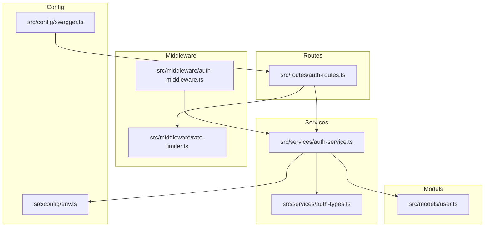
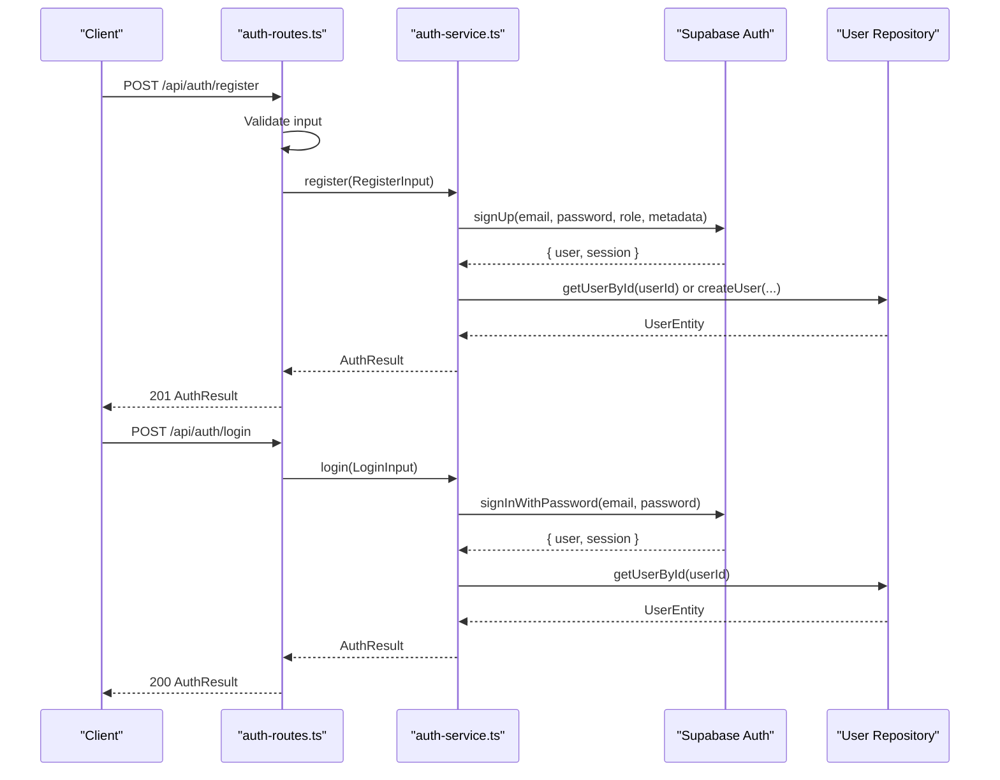
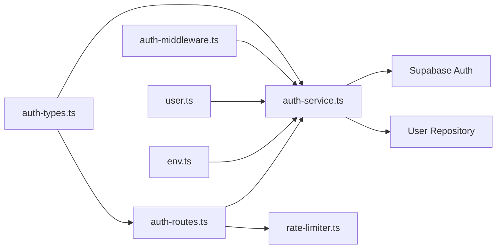

# Authentication API

<cite>
**Referenced Files in This Document**
- [auth-routes.ts](file://src/routes/auth-routes.ts)
- [auth-service.ts](file://src/services/auth-service.ts)
- [rate-limiter.ts](file://src/middleware/rate-limiter.ts)
- [auth-middleware.ts](file://src/middleware/auth-middleware.ts)
- [auth-types.ts](file://src/services/auth-types.ts)
- [user.ts](file://src/models/user.ts)
- [swagger.ts](file://src/config/swagger.ts)
- [env.ts](file://src/config/env.ts)
- [README.md](file://README.md)
</cite>

## Table of Contents
1. [Introduction](#introduction)
2. [Project Structure](#project-structure)
3. [Core Components](#core-components)
4. [Architecture Overview](#architecture-overview)
5. [Detailed Component Analysis](#detailed-component-analysis)
6. [Dependency Analysis](#dependency-analysis)
7. [Performance Considerations](#performance-considerations)
8. [Troubleshooting Guide](#troubleshooting-guide)
9. [Conclusion](#conclusion)
10. [Appendices](#appendices)

## Introduction
This document provides comprehensive API documentation for the authentication module of the FreelanceXchain system. It covers all authentication endpoints, including user registration, login, token refresh, OAuth integration, and password recovery. It also documents request/response schemas, JWT-based authentication requirements, rate limiting policies, and client implementation guidance for JavaScript/TypeScript.

The authentication endpoints are implemented under the base path /api/auth and integrate with Supabase Auth for secure user management, email verification, and OAuth providers.

**Section sources**
- [README.md](file://README.md#L153-L178)

## Project Structure
The authentication module is organized into routes, services, middleware, and shared types. The OpenAPI/Swagger specification is configured to document the authentication endpoints.

**Diagram sources**
- [auth-routes.ts](file://src/routes/auth-routes.ts#L1-L120)
- [auth-service.ts](file://src/services/auth-service.ts#L1-L60)
- [rate-limiter.ts](file://src/middleware/rate-limiter.ts#L63-L81)
- [auth-middleware.ts](file://src/middleware/auth-middleware.ts#L1-L70)
- [auth-types.ts](file://src/services/auth-types.ts#L1-L49)
- [user.ts](file://src/models/user.ts#L1-L4)
- [swagger.ts](file://src/config/swagger.ts#L1-L60)
- [env.ts](file://src/config/env.ts#L41-L67)

**Section sources**
- [auth-routes.ts](file://src/routes/auth-routes.ts#L1-L120)
- [swagger.ts](file://src/config/swagger.ts#L1-L60)

## Core Components
- Authentication routes: Define endpoints for registration, login, token refresh, OAuth, and password recovery.
- Authentication service: Implements business logic for Supabase Auth integration, token validation, and user synchronization.
- Rate limiter middleware: Applies rate limits to authentication endpoints.
- Auth middleware: Validates JWT Bearer tokens and enforces role-based access control.
- Shared types: Define request/response schemas and error codes.

**Section sources**
- [auth-routes.ts](file://src/routes/auth-routes.ts#L126-L235)
- [auth-service.ts](file://src/services/auth-service.ts#L64-L201)
- [rate-limiter.ts](file://src/middleware/rate-limiter.ts#L63-L81)
- [auth-middleware.ts](file://src/middleware/auth-middleware.ts#L25-L70)
- [auth-types.ts](file://src/services/auth-types.ts#L1-L49)

## Architecture Overview
The authentication flow integrates with Supabase Auth for secure user management. The routes validate inputs, apply rate limiting, and delegate to the service layer. The service layer interacts with Supabase Auth and the database to manage users and tokens. The auth middleware validates JWT Bearer tokens for protected routes.

**Diagram sources**
- [auth-routes.ts](file://src/routes/auth-routes.ts#L160-L235)
- [auth-service.ts](file://src/services/auth-service.ts#L68-L201)

## Detailed Component Analysis

### Authentication Endpoints

#### POST /api/auth/register
- Purpose: Register a new user with email/password.
- Request body schema: RegisterInput
  - email: string, required
  - password: string, required, minimum length 8, must include uppercase, lowercase, digit, and special character
  - role: string, enum [freelancer, employer], required
  - name: string, optional, minimum length 2 if provided
  - walletAddress: string, optional, Ethereum address format 0x followed by 40 hex digits
- Responses:
  - 201: AuthResult with user, accessToken, refreshToken
  - 400: AuthError with VALIDATION_ERROR
  - 409: AuthError with DUPLICATE_EMAIL

Rate limiting: Yes (authRateLimiter)

Security considerations:
- Password strength enforced by service-level validation.
- Duplicate email detection via Supabase Auth and database checks.

**Section sources**
- [auth-routes.ts](file://src/routes/auth-routes.ts#L126-L235)
- [auth-service.ts](file://src/services/auth-service.ts#L68-L155)
- [rate-limiter.ts](file://src/middleware/rate-limiter.ts#L63-L68)

#### POST /api/auth/login
- Purpose: Authenticate a user with email/password.
- Request body schema: LoginInput
  - email: string, required
  - password: string, required
- Responses:
  - 200: AuthResult with user, accessToken, refreshToken
  - 400: AuthError with VALIDATION_ERROR
  - 401: AuthError with AUTH_INVALID_CREDENTIALS

Notes:
- Requires email verification; unverified emails will fail login.

**Section sources**
- [auth-routes.ts](file://src/routes/auth-routes.ts#L238-L316)
- [auth-service.ts](file://src/services/auth-service.ts#L157-L201)

#### POST /api/auth/refresh
- Purpose: Refresh access and refresh tokens using a refresh token.
- Request body schema: RefreshInput
  - refreshToken: string, required
- Responses:
  - 200: AuthResult with user, accessToken, refreshToken
  - 400: AuthError with VALIDATION_ERROR
  - 401: AuthError with AUTH_TOKEN_EXPIRED or AUTH_INVALID_TOKEN

**Section sources**
- [auth-routes.ts](file://src/routes/auth-routes.ts#L318-L385)
- [auth-service.ts](file://src/services/auth-service.ts#L203-L228)

#### GET /api/auth/oauth/:provider
- Purpose: Initiate OAuth login with a provider (google, github, azure, linkedin).
- Responses:
  - 302: Redirect to provider authorization URL
  - 400: AuthError with VALIDATION_ERROR

**Section sources**
- [auth-routes.ts](file://src/routes/auth-routes.ts#L532-L563)
- [auth-service.ts](file://src/services/auth-service.ts#L295-L324)

#### GET /api/auth/callback
- Purpose: Handle OAuth callback. Supports PKCE flow (code in query) and implicit flow (tokens in URL fragment).
- Responses:
  - 200: AuthResult with tokens and user
  - 202: Registration required (user exists in Supabase but not in local users)
  - 400: AuthError with OAUTH_ERROR

**Section sources**
- [auth-routes.ts](file://src/routes/auth-routes.ts#L387-L482)
- [auth-service.ts](file://src/services/auth-service.ts#L326-L345)

#### POST /api/auth/oauth/callback
- Purpose: Receive access_token from frontend after OAuth redirect (implicit flow).
- Request body:
  - access_token: string, required
- Responses:
  - 200: Status success
  - 202: Registration required
  - 401: AuthError with AUTH_INVALID_TOKEN

**Section sources**
- [auth-routes.ts](file://src/routes/auth-routes.ts#L565-L637)
- [auth-service.ts](file://src/services/auth-service.ts#L261-L293)

#### POST /api/auth/oauth/register
- Purpose: Complete OAuth registration by selecting role and optionally providing name and walletAddress.
- Request body:
  - accessToken: string, required
  - role: string, enum [freelancer, employer], required
  - name: string, optional, minimum length 2 if provided
  - walletAddress: string, optional, Ethereum address format
- Responses:
  - 201: AuthResult with user, accessToken, refreshToken
  - 400: AuthError with VALIDATION_ERROR
  - 401: AuthError with AUTH_INVALID_TOKEN

Rate limiting: Yes (authRateLimiter)

**Section sources**
- [auth-routes.ts](file://src/routes/auth-routes.ts#L639-L753)
- [auth-service.ts](file://src/services/auth-service.ts#L347-L402)
- [rate-limiter.ts](file://src/middleware/rate-limiter.ts#L63-L68)

#### POST /api/auth/resend-confirmation
- Purpose: Resend email confirmation link.
- Request body:
  - email: string, required
- Responses:
  - 200: Confirmation email sent
  - 400: AuthError with VALIDATION_ERROR

Rate limiting: Yes (authRateLimiter)

**Section sources**
- [auth-routes.ts](file://src/routes/auth-routes.ts#L755-L806)
- [auth-service.ts](file://src/services/auth-service.ts#L404-L423)
- [rate-limiter.ts](file://src/middleware/rate-limiter.ts#L63-L68)

#### POST /api/auth/forgot-password
- Purpose: Send password reset email.
- Request body:
  - email: string, required
- Responses:
  - 200: Password reset email sent
  - 400: AuthError with VALIDATION_ERROR

Rate limiting: Yes (authRateLimiter)

**Section sources**
- [auth-routes.ts](file://src/routes/auth-routes.ts#L808-L859)
- [auth-service.ts](file://src/services/auth-service.ts#L425-L447)
- [rate-limiter.ts](file://src/middleware/rate-limiter.ts#L63-L68)

#### POST /api/auth/reset-password
- Purpose: Update password using reset token.
- Request body:
  - accessToken: string, required
  - password: string, required, minimum length 8, must include uppercase, lowercase, digit, and special character
- Responses:
  - 200: Password updated successfully
  - 400: AuthError with VALIDATION_ERROR
  - 401: AuthError with INVALID_TOKEN

Rate limiting: Yes (authRateLimiter)

**Section sources**
- [auth-routes.ts](file://src/routes/auth-routes.ts#L861-L937)
- [auth-service.ts](file://src/services/auth-service.ts#L449-L468)
- [rate-limiter.ts](file://src/middleware/rate-limiter.ts#L63-L68)

### Request and Response Schemas

#### RegisterInput
- email: string, required
- password: string, required
- role: string, enum [freelancer, employer], required
- name: string, optional
- walletAddress: string, optional

#### LoginInput
- email: string, required
- password: string, required

#### RefreshInput
- refreshToken: string, required

#### AuthResult
- user: object
  - id: string
  - email: string
  - role: string, enum [freelancer, employer, admin]
  - walletAddress: string
  - createdAt: string (date-time)
- accessToken: string
- refreshToken: string

#### AuthError
- error: object
  - code: string, enum including DUPLICATE_EMAIL, INVALID_CREDENTIALS, TOKEN_EXPIRED, INVALID_TOKEN, AUTH_EXCHANGE_FAILED, AUTH_INVALID_TOKEN, AUTH_INVALID_CREDENTIALS, AUTH_REQUIRE_REGISTRATION, VALIDATION_ERROR, INTERNAL_ERROR
  - message: string
  - details: array of validation errors (optional)
- timestamp: string (date-time)
- requestId: string

**Section sources**
- [auth-routes.ts](file://src/routes/auth-routes.ts#L22-L115)
- [auth-types.ts](file://src/services/auth-types.ts#L1-L49)

### Authentication Requirements (JWT)
- All protected routes require a Bearer token in the Authorization header.
- The auth middleware validates the token and attaches user info to the request.
- Supported roles: freelancer, employer, admin.

**Section sources**
- [auth-middleware.ts](file://src/middleware/auth-middleware.ts#L25-L70)
- [user.ts](file://src/models/user.ts#L1-L4)
- [swagger.ts](file://src/config/swagger.ts#L22-L28)

### Rate Limiting Policies
- authRateLimiter: 10 requests per 15 minutes per client IP.
- apiRateLimiter: 100 requests per minute per client IP.
- sensitiveRateLimiter: 5 requests per hour per client IP.

The auth endpoints use authRateLimiter. Exceeding the limit returns 429 with Retry-After header and RATE_LIMIT_EXCEEDED error.

**Section sources**
- [rate-limiter.ts](file://src/middleware/rate-limiter.ts#L1-L81)
- [auth-routes.ts](file://src/routes/auth-routes.ts#L160-L235)

### OAuth Integration
- Providers supported: google, github, azure, linkedin.
- PKCE flow: Redirect to provider, receive code in query, exchange code for tokens, then login.
- Implicit flow: Tokens in URL fragment; backend serves minimal HTML to extract tokens and POST to /api/auth/oauth/callback.

**Section sources**
- [auth-routes.ts](file://src/routes/auth-routes.ts#L387-L482)
- [auth-service.ts](file://src/services/auth-service.ts#L295-L345)

### Password Recovery
- forgot-password: Sends reset email via Supabase Auth.
- reset-password: Updates password using reset token.

**Section sources**
- [auth-routes.ts](file://src/routes/auth-routes.ts#L808-L937)
- [auth-service.ts](file://src/services/auth-service.ts#L425-L468)

### Client Implementation Examples (JavaScript/TypeScript)
Below are conceptual examples of how clients should interact with the authentication endpoints. Replace placeholders with actual values and handle responses accordingly.

- Registration with wallet address
  - Endpoint: POST /api/auth/register
  - Headers: Content-Type: application/json
  - Body: { email, password, role, name?, walletAddress? }
  - Success: Parse AuthResult to store accessToken and refreshToken
  - Error: Handle VALIDATION_ERROR or DUPLICATE_EMAIL

- Login
  - Endpoint: POST /api/auth/login
  - Headers: Content-Type: application/json
  - Body: { email, password }
  - Success: Store tokens and set Authorization: Bearer <accessToken> for subsequent requests

- Token Refresh
  - Endpoint: POST /api/auth/refresh
  - Body: { refreshToken }
  - Success: Replace stored accessToken and refreshToken

- OAuth Login Flow (Google/GitHub)
  - Initiate: GET /api/auth/oauth/:provider
  - Callback (PKCE): GET /api/auth/callback with code
  - Callback (implicit): GET /api/auth/callback (frontend receives tokens), then POST /api/auth/oauth/callback with access_token
  - Registration: POST /api/auth/oauth/register with accessToken, role, name?, walletAddress?

- Password Reset
  - Forgot password: POST /api/auth/forgot-password with email
  - Reset password: POST /api/auth/reset-password with accessToken, password

- Protected Route Example
  - Add Authorization: Bearer <accessToken> header
  - Handle 401 responses by refreshing tokens or prompting re-authentication

[No sources needed since this section provides conceptual client usage guidance]

## Dependency Analysis
The authentication routes depend on the service layer for business logic and on the rate limiter middleware for throttling. The service layer depends on Supabase Auth and the user repository. The auth middleware depends on the service layer for token validation.

**Diagram sources**
- [auth-routes.ts](file://src/routes/auth-routes.ts#L1-L120)
- [auth-service.ts](file://src/services/auth-service.ts#L1-L60)
- [rate-limiter.ts](file://src/middleware/rate-limiter.ts#L63-L81)
- [auth-middleware.ts](file://src/middleware/auth-middleware.ts#L1-L70)
- [auth-types.ts](file://src/services/auth-types.ts#L1-L49)
- [user.ts](file://src/models/user.ts#L1-L4)
- [env.ts](file://src/config/env.ts#L41-L67)

**Section sources**
- [auth-routes.ts](file://src/routes/auth-routes.ts#L1-L120)
- [auth-service.ts](file://src/services/auth-service.ts#L1-L60)
- [auth-middleware.ts](file://src/middleware/auth-middleware.ts#L1-L70)
- [rate-limiter.ts](file://src/middleware/rate-limiter.ts#L63-L81)
- [auth-types.ts](file://src/services/auth-types.ts#L1-L49)
- [user.ts](file://src/models/user.ts#L1-L4)
- [env.ts](file://src/config/env.ts#L41-L67)

## Performance Considerations
- Rate limiting reduces load on authentication endpoints and protects against brute force attacks.
- Token refresh and OAuth flows rely on external Supabase Auth; network latency affects response times.
- Avoid excessive polling of resend-confirmation and forgot-password endpoints.

[No sources needed since this section provides general guidance]

## Troubleshooting Guide
Common issues and resolutions:
- 400 Validation Error: Ensure request body matches schemas and required fields are present.
- 401 Invalid Credentials: Verify email/password or token validity; ensure email is confirmed.
- 409 Duplicate Email: Use a different email address.
- 429 Rate Limit Exceeded: Wait until Retry-After seconds elapse before retrying.
- OAuth errors: Confirm provider configuration and redirect URLs; ensure correct provider name.

**Section sources**
- [auth-routes.ts](file://src/routes/auth-routes.ts#L160-L235)
- [auth-service.ts](file://src/services/auth-service.ts#L157-L201)
- [rate-limiter.ts](file://src/middleware/rate-limiter.ts#L30-L60)

## Security Considerations
- Password storage: Supabase Auth manages password hashing; do not store raw passwords.
- Token expiration: Configure JWT secrets and expirations via environment variables.
- Brute force protection: Rate limiting and Supabase Auth constraints mitigate repeated login attempts.
- Token handling: Store refresh tokens securely; prefer short-lived access tokens and rotate refresh tokens.

**Section sources**
- [env.ts](file://src/config/env.ts#L52-L58)
- [auth-service.ts](file://src/services/auth-service.ts#L157-L201)
- [rate-limiter.ts](file://src/middleware/rate-limiter.ts#L63-L81)

## Conclusion
The authentication module provides a robust, standards-compliant API for user registration, login, token refresh, OAuth integration, and password recovery. It leverages Supabase Auth for secure identity management and includes built-in rate limiting and JWT-based authorization. Clients should implement proper error handling, token rotation, and secure storage of credentials and tokens.

[No sources needed since this section summarizes without analyzing specific files]

## Appendices

### OpenAPI/Swagger Integration
- Swagger/OpenAPI is configured to document the authentication endpoints and shared schemas.
- Interactive documentation is available at /api-docs.

**Section sources**
- [swagger.ts](file://src/config/swagger.ts#L1-L60)
- [README.md](file://README.md#L153-L159)