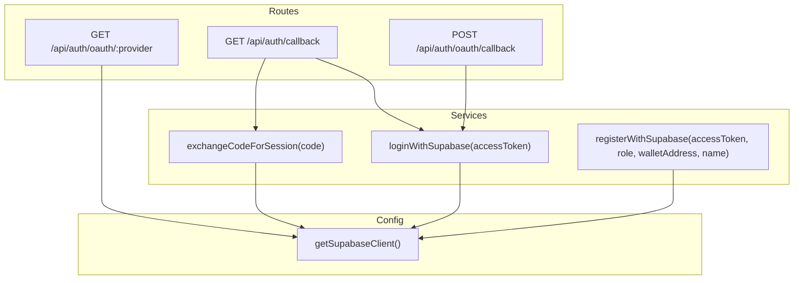
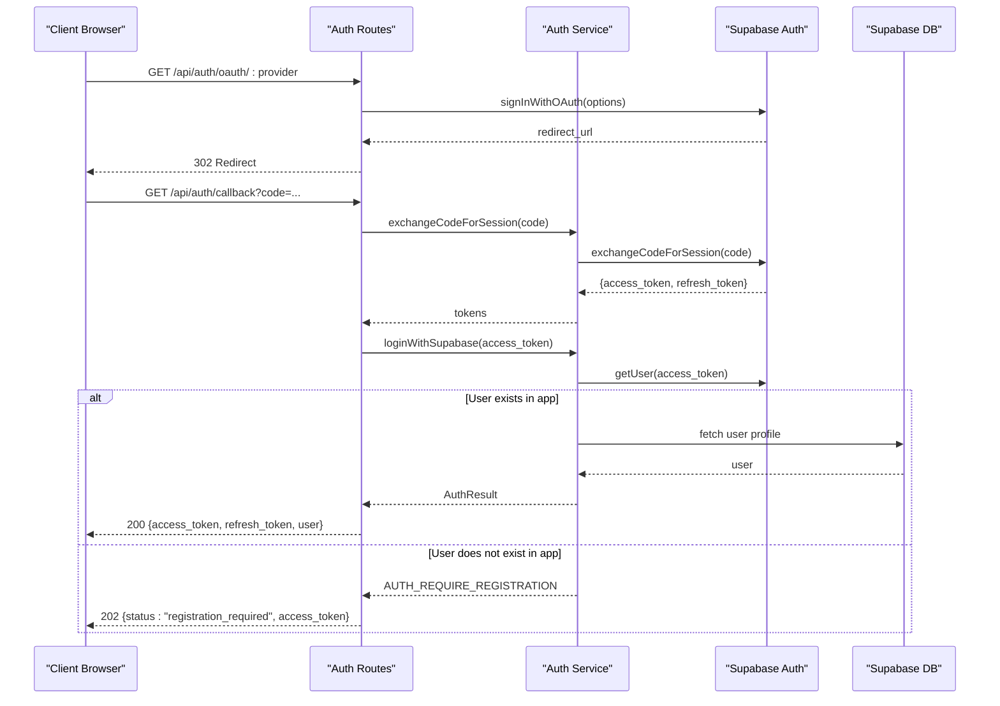
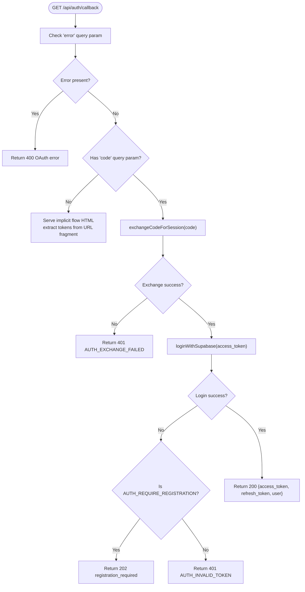
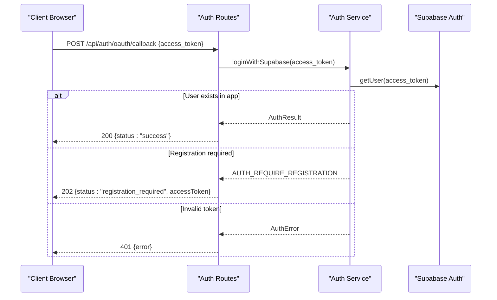
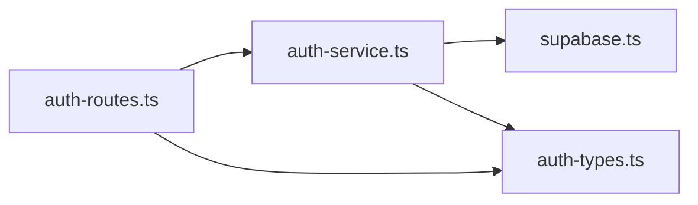

# OAuth Callback Handling

<cite>
**Referenced Files in This Document**
- [auth-routes.ts](file://src/routes/auth-routes.ts)
- [auth-service.ts](file://src/services/auth-service.ts)
- [auth-types.ts](file://src/services/auth-types.ts)
- [supabase.ts](file://src/config/supabase.ts)
- [API-DOCUMENTATION.md](file://docs/API-DOCUMENTATION.md)
- [README.md](file://README.md)
</cite>

## Table of Contents
1. [Introduction](#introduction)
2. [Project Structure](#project-structure)
3. [Core Components](#core-components)
4. [Architecture Overview](#architecture-overview)
5. [Detailed Component Analysis](#detailed-component-analysis)
6. [Dependency Analysis](#dependency-analysis)
7. [Performance Considerations](#performance-considerations)
8. [Troubleshooting Guide](#troubleshooting-guide)
9. [Conclusion](#conclusion)
10. [Appendices](#appendices)

## Introduction
This document explains the OAuth callback handling system used by FreelanceXchain. It covers:
- The GET /api/auth/callback endpoint for PKCE flows (authorization code in query parameters)
- The POST /api/auth/oauth/callback endpoint for implicit flows (access tokens in URL fragments)
- How authorization codes are exchanged for sessions using exchangeCodeForSession
- How tokens are extracted from URL fragments and forwarded to the backend
- The 202 “registration required” response logic for new OAuth users
- Error handling for OAuth failures and token validation
- Security considerations around state validation and token verification
- Implementation details from auth-service.ts and examples of frontend integration for both flow types

## Project Structure
The OAuth callback handling spans routing, service-layer logic, and configuration:
- Routes define the endpoints and orchestrate the flow
- Services encapsulate Supabase interactions and token validation
- Configuration provides the Supabase client used by services

**Diagram sources**
- [auth-routes.ts](file://src/routes/auth-routes.ts#L387-L637)
- [auth-service.ts](file://src/services/auth-service.ts#L296-L402)
- [supabase.ts](file://src/config/supabase.ts#L25-L33)

**Section sources**
- [auth-routes.ts](file://src/routes/auth-routes.ts#L387-L637)
- [auth-service.ts](file://src/services/auth-service.ts#L296-L402)
- [supabase.ts](file://src/config/supabase.ts#L25-L33)

## Core Components
- Route handlers for OAuth callbacks:
  - GET /api/auth/callback: PKCE flow handler; validates errors, exchanges code, logs in, and responds with either tokens or 202 registration required
  - POST /api/auth/oauth/callback: Implicit flow handler; validates access_token, logs in, and responds with success or 202/401
- Service functions:
  - exchangeCodeForSession(code): Exchanges an authorization code for Supabase session tokens
  - loginWithSupabase(accessToken): Validates a Supabase access token and returns app tokens; triggers 202 when user does not exist in the app
  - registerWithSupabase(accessToken, role, walletAddress, name): Completes OAuth registration by updating user metadata and creating a local user record
- Types and errors:
  - AuthResult and AuthError types define response shapes and error codes used across routes and services

**Section sources**
- [auth-routes.ts](file://src/routes/auth-routes.ts#L387-L637)
- [auth-service.ts](file://src/services/auth-service.ts#L263-L402)
- [auth-types.ts](file://src/services/auth-types.ts#L1-L49)

## Architecture Overview
The system integrates with Supabase Auth to handle OAuth providers and exchange authorization codes for session tokens. The backend verifies tokens and synchronizes user records, returning either app JWT tokens or guiding the client to complete registration.

**Diagram sources**
- [auth-routes.ts](file://src/routes/auth-routes.ts#L387-L473)
- [auth-service.ts](file://src/services/auth-service.ts#L296-L345)
- [auth-service.ts](file://src/services/auth-service.ts#L263-L293)

## Detailed Component Analysis

### GET /api/auth/callback (PKCE Flow)
Behavior:
- Validates OAuth error query parameters and returns 400 on failure
- If code is present, exchanges it for session tokens using exchangeCodeForSession
- Calls loginWithSupabase with the returned access token
- Responds with 200 and tokens if the user exists in the app
- Responds with 202 and access_token if the user does not exist in the app (registration required)
- Responds with 401 on invalid token or exchange failure

**Diagram sources**
- [auth-routes.ts](file://src/routes/auth-routes.ts#L387-L473)
- [auth-service.ts](file://src/services/auth-service.ts#L296-L345)
- [auth-service.ts](file://src/services/auth-service.ts#L263-L293)

**Section sources**
- [auth-routes.ts](file://src/routes/auth-routes.ts#L387-L473)
- [auth-service.ts](file://src/services/auth-service.ts#L296-L345)
- [auth-service.ts](file://src/services/auth-service.ts#L263-L293)

### POST /api/auth/oauth/callback (Implicit Flow)
Behavior:
- Validates presence of access_token in request body
- Calls loginWithSupabase with the access_token
- Responds with 200 on success
- Responds with 202 when registration is required
- Responds with 401 on invalid token

**Diagram sources**
- [auth-routes.ts](file://src/routes/auth-routes.ts#L565-L637)
- [auth-service.ts](file://src/services/auth-service.ts#L263-L293)

**Section sources**
- [auth-routes.ts](file://src/routes/auth-routes.ts#L565-L637)
- [auth-service.ts](file://src/services/auth-service.ts#L263-L293)

### exchangeCodeForSession(code)
Purpose:
- Exchanges an authorization code received from the OAuth provider into a Supabase session containing access and refresh tokens

Implementation highlights:
- Uses the Supabase client to call exchangeCodeForSession
- Returns AuthError on failure with code AUTH_EXCHANGE_FAILED
- Returns token pair on success

Security considerations:
- The code is short-lived and bound to the original authorization request
- The exchange occurs server-side, preventing exposure of tokens to the client except via the intended flow

**Section sources**
- [auth-service.ts](file://src/services/auth-service.ts#L329-L345)
- [supabase.ts](file://src/config/supabase.ts#L25-L33)

### loginWithSupabase(accessToken)
Purpose:
- Validates a Supabase access token and returns app tokens
- If the user does not exist in the app’s database, returns AUTH_REQUIRE_REGISTRATION (202)

Implementation highlights:
- Validates token via Supabase getUser
- Checks for user existence in the app’s user table
- Retrieves current session refresh token for completeness
- Returns AuthError with code AUTH_REQUIRE_REGISTRATION when user not found in app

Security considerations:
- Validates token with Supabase before proceeding
- Ensures the user’s email is available for app-level checks

**Section sources**
- [auth-service.ts](file://src/services/auth-service.ts#L263-L293)
- [auth-types.ts](file://src/services/auth-types.ts#L35-L49)

### registerWithSupabase(accessToken, role, walletAddress, name)
Purpose:
- Completes OAuth registration by updating user metadata and creating a local user record

Implementation highlights:
- Validates access token and extracts user email
- Updates Supabase user metadata (role, wallet address, name)
- Creates a local user record in the app’s database
- Returns AuthResult with app tokens

Security considerations:
- Requires a valid Supabase access token
- Role must be one of the supported values
- Wallet address follows a strict format when provided

**Section sources**
- [auth-service.ts](file://src/services/auth-service.ts#L347-L402)
- [auth-types.ts](file://src/services/auth-types.ts#L1-L34)

### Frontend Integration Examples
- PKCE flow (recommended):
  - Initiate OAuth by navigating to GET /api/auth/oauth/:provider
  - After provider consent, the browser is redirected to GET /api/auth/callback?code=...
  - The backend exchanges the code and returns either tokens (200) or registration required (202)
- Implicit flow (legacy):
  - The backend serves a minimal HTML page that extracts tokens from the URL fragment and posts them to POST /api/auth/oauth/callback
  - The backend responds with 200, 202, or 401

Documentation references:
- API endpoints and expected responses are documented in the API documentation

**Section sources**
- [auth-routes.ts](file://src/routes/auth-routes.ts#L387-L473)
- [auth-routes.ts](file://src/routes/auth-routes.ts#L565-L637)
- [API-DOCUMENTATION.md](file://docs/API-DOCUMENTATION.md#L81-L130)

## Dependency Analysis
The OAuth callback system depends on:
- Supabase client for OAuth initiation, token exchange, and user validation
- Auth routes to coordinate flows and respond with standardized statuses
- Auth service functions to encapsulate business logic and error handling

**Diagram sources**
- [auth-routes.ts](file://src/routes/auth-routes.ts#L387-L637)
- [auth-service.ts](file://src/services/auth-service.ts#L263-L402)
- [supabase.ts](file://src/config/supabase.ts#L25-L33)
- [auth-types.ts](file://src/services/auth-types.ts#L1-L49)

**Section sources**
- [auth-routes.ts](file://src/routes/auth-routes.ts#L387-L637)
- [auth-service.ts](file://src/services/auth-service.ts#L263-L402)
- [supabase.ts](file://src/config/supabase.ts#L25-L33)
- [auth-types.ts](file://src/services/auth-types.ts#L1-L49)

## Performance Considerations
- Minimal latency: exchangeCodeForSession and loginWithSupabase perform a single Supabase call each
- Reduced round trips: implicit flow HTML page posts tokens directly to the backend
- Caching: consider caching frequent user lookups if traffic increases
- Rate limiting: authentication endpoints are protected by rate limiter middleware

[No sources needed since this section provides general guidance]

## Troubleshooting Guide
Common issues and resolutions:
- OAuth error returned (400): Indicates provider-level error; inspect error and error_description query parameters
- Exchange failure (401): The authorization code may be invalid or expired; retry the OAuth flow
- Registration required (202): The user authenticated with Supabase but does not exist in the app; call POST /api/auth/oauth/register to complete onboarding
- Invalid token (401): The access token is invalid or expired; re-authenticate or refresh tokens

Error codes and handling:
- AUTH_EXCHANGE_FAILED: exchangeCodeForSession returned an error
- AUTH_REQUIRE_REGISTRATION: user exists in Supabase but not in the app
- AUTH_INVALID_TOKEN: loginWithSupabase failed due to invalid token

**Section sources**
- [auth-routes.ts](file://src/routes/auth-routes.ts#L416-L473)
- [auth-routes.ts](file://src/routes/auth-routes.ts#L597-L637)
- [auth-service.ts](file://src/services/auth-service.ts#L296-L345)
- [auth-service.ts](file://src/services/auth-service.ts#L263-L293)
- [auth-types.ts](file://src/services/auth-types.ts#L35-L49)

## Conclusion
FreelanceXchain’s OAuth callback handling provides robust support for both PKCE and implicit flows:
- PKCE flow securely exchanges authorization codes for session tokens and returns either app tokens or registration-required status
- Implicit flow extracts tokens from URL fragments and forwards them to the backend for validation
- The system centralizes token validation and user synchronization via Supabase, returning standardized responses and error codes
- Security is strengthened by server-side exchanges and token verification before issuing app tokens

[No sources needed since this section summarizes without analyzing specific files]

## Appendices

### API Endpoint Reference
- GET /api/auth/oauth/:provider — Initiates OAuth with a provider and redirects to the provider login page
- GET /api/auth/callback — Handles PKCE flow; returns tokens or 202 registration required
- POST /api/auth/oauth/callback — Handles implicit flow; returns success, 202 registration required, or 401
- POST /api/auth/oauth/register — Completes OAuth registration by selecting role and creating a local user record

**Section sources**
- [API-DOCUMENTATION.md](file://docs/API-DOCUMENTATION.md#L73-L130)
- [auth-routes.ts](file://src/routes/auth-routes.ts#L387-L637)

### Security Notes
- State validation: The current implementation does not validate state parameters in the callback. If you require state validation, add state parameter handling in getOAuthUrl and validate it in the callback route.
- Token verification: loginWithSupabase validates the Supabase access token before proceeding; ensure clients store tokens securely and rotate refresh tokens appropriately.
- Redirect URLs: getOAuthUrl constructs redirect URLs using PUBLIC_URL or localhost; ensure PUBLIC_URL is configured correctly for production.

**Section sources**
- [auth-service.ts](file://src/services/auth-service.ts#L296-L324)
- [README.md](file://README.md#L136-L151)