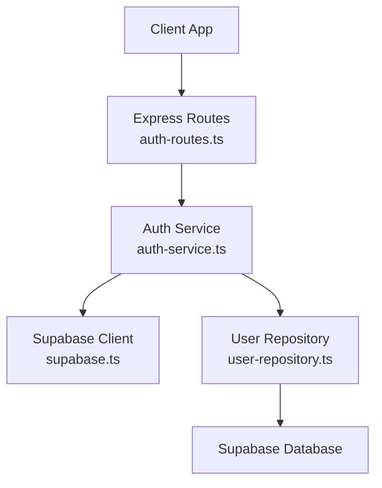
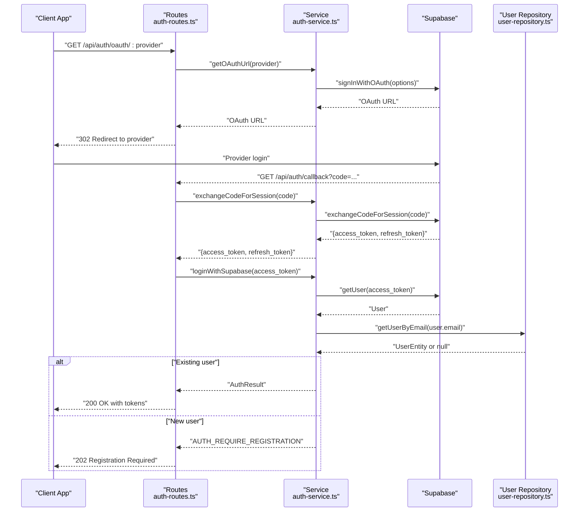
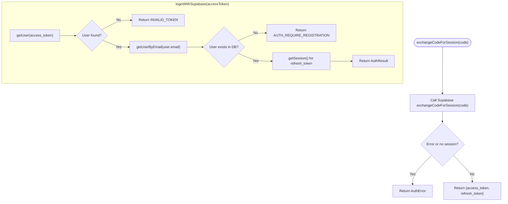
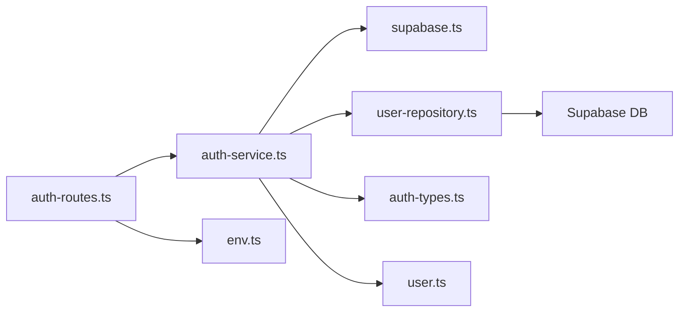

# OAuth Integration

<cite>
**Referenced Files in This Document**
- [auth-routes.ts](file://src/routes/auth-routes.ts)
- [auth-service.ts](file://src/services/auth-service.ts)
- [auth-types.ts](file://src/services/auth-types.ts)
- [supabase.ts](file://src/config/supabase.ts)
- [env.ts](file://src/config/env.ts)
- [user-repository.ts](file://src/repositories/user-repository.ts)
- [user.ts](file://src/models/user.ts)
- [API-DOCUMENTATION.md](file://docs/API-DOCUMENTATION.md)
- [TECHNICAL-SPECS.md](file://docs/TECHNICAL-SPECS.md)
</cite>

## Table of Contents
1. [Introduction](#introduction)
2. [Project Structure](#project-structure)
3. [Core Components](#core-components)
4. [Architecture Overview](#architecture-overview)
5. [Detailed Component Analysis](#detailed-component-analysis)
6. [Dependency Analysis](#dependency-analysis)
7. [Performance Considerations](#performance-considerations)
8. [Troubleshooting Guide](#troubleshooting-guide)
9. [Conclusion](#conclusion)
10. [Appendices](#appendices)

## Introduction
This document provides comprehensive API documentation for the OAuth integration system in FreelanceXchain. It covers the complete OAuth flow including initiating provider login, handling callbacks for both PKCE and implicit flows, and the “registration required” flow for new OAuth users. It also documents the exchangeCodeForSession and loginWithSupabase functions, explains security considerations around state management and token validation, and outlines how external identities are securely linked to internal user accounts with optional blockchain wallet integration.

## Project Structure
The OAuth integration spans routing, service logic, configuration, and data access layers:
- Routes define the OAuth endpoints and handle request/response flows.
- Services encapsulate Supabase OAuth interactions and internal user synchronization.
- Configuration supplies Supabase client initialization and environment variables.
- Repositories manage persistence of user records in the database.

**Diagram sources**
- [auth-routes.ts](file://src/routes/auth-routes.ts#L532-L563)
- [auth-service.ts](file://src/services/auth-service.ts#L298-L345)
- [supabase.ts](file://src/config/supabase.ts#L25-L33)
- [user-repository.ts](file://src/repositories/user-repository.ts#L15-L58)

**Section sources**
- [auth-routes.ts](file://src/routes/auth-routes.ts#L532-L563)
- [auth-service.ts](file://src/services/auth-service.ts#L298-L345)
- [supabase.ts](file://src/config/supabase.ts#L25-L33)
- [user-repository.ts](file://src/repositories/user-repository.ts#L15-L58)

## Core Components
- OAuth initiation endpoint: GET /api/auth/oauth/:provider
- Callback handler: GET /api/auth/callback (PKCE) and POST /api/auth/oauth/callback (implicit)
- Registration continuation: POST /api/auth/oauth/register
- Supporting service functions:
  - getOAuthUrl(provider)
  - exchangeCodeForSession(code)
  - loginWithSupabase(accessToken)
  - registerWithSupabase(accessToken, role, walletAddress, name)

These components collectively implement a robust OAuth integration with Supabase, including handling new user registration and linking external identities to internal user profiles.

**Section sources**
- [auth-routes.ts](file://src/routes/auth-routes.ts#L532-L563)
- [auth-routes.ts](file://src/routes/auth-routes.ts#L387-L473)
- [auth-routes.ts](file://src/routes/auth-routes.ts#L565-L637)
- [auth-service.ts](file://src/services/auth-service.ts#L298-L345)
- [auth-service.ts](file://src/services/auth-service.ts#L347-L402)

## Architecture Overview
The OAuth flow integrates with Supabase for provider redirection and token exchange. The backend validates tokens, checks for existing user records, and either returns app tokens or signals that registration is required.

**Diagram sources**
- [auth-routes.ts](file://src/routes/auth-routes.ts#L532-L563)
- [auth-routes.ts](file://src/routes/auth-routes.ts#L387-L473)
- [auth-service.ts](file://src/services/auth-service.ts#L298-L345)
- [auth-service.ts](file://src/services/auth-service.ts#L261-L293)
- [user-repository.ts](file://src/repositories/user-repository.ts#L28-L41)

## Detailed Component Analysis

### OAuth Initiation Endpoint: GET /api/auth/oauth/:provider
- Purpose: Redirect clients to the selected provider’s OAuth page.
- Providers supported: google, github, azure, linkedin.
- Behavior:
  - Validates provider parameter.
  - Calls getOAuthUrl(provider) to obtain a Supabase OAuth URL with configured redirect and parameters.
  - Responds with a 302 redirect to the provider.

Security considerations:
- The redirect URL is built from environment configuration and points to the backend’s callback endpoint.
- The provider mapping adjusts LinkedIn to the OIDC provider alias recognized by Supabase.

**Section sources**
- [auth-routes.ts](file://src/routes/auth-routes.ts#L532-L563)
- [auth-service.ts](file://src/services/auth-service.ts#L298-L324)
- [env.ts](file://src/config/env.ts#L41-L67)

### Callback Handler: GET /api/auth/callback (PKCE)
- Purpose: Handle provider redirects containing an authorization code.
- Flow:
  - If an error is present, returns a 400 with error details.
  - If a code is present, exchanges it for session tokens via exchangeCodeForSession(code).
  - Validates the resulting access token with loginWithSupabase(access_token).
  - If the user exists, returns 200 with app tokens.
  - If the user does not exist, returns 202 with registration_required and the provider access token.

Implicit flow note:
- The route also serves a minimal HTML page that extracts tokens from the URL fragment and posts them to POST /api/auth/oauth/callback.

**Section sources**
- [auth-routes.ts](file://src/routes/auth-routes.ts#L387-L473)
- [auth-service.ts](file://src/services/auth-service.ts#L326-L345)
- [auth-service.ts](file://src/services/auth-service.ts#L261-L293)

### Implicit Flow Handler: POST /api/auth/oauth/callback
- Purpose: Legacy support for implicit flow where tokens arrive in the URL fragment.
- Behavior:
  - Validates presence of access_token.
  - Calls loginWithSupabase(access_token).
  - Returns 200 on success or 202 if registration is required.
  - Returns 401 on invalid token.

**Section sources**
- [auth-routes.ts](file://src/routes/auth-routes.ts#L565-L637)
- [auth-service.ts](file://src/services/auth-service.ts#L261-L293)

### Registration Continuation: POST /api/auth/oauth/register
- Purpose: Finalize OAuth registration by assigning a role and optional profile details.
- Request body:
  - accessToken (required)
  - role (freelancer or employer)
  - name (optional)
  - walletAddress (optional, validated as Ethereum address)
- Behavior:
  - Validates inputs.
  - Calls registerWithSupabase(accessToken, role, walletAddress, name).
  - On success, returns 201 with app tokens and user profile.
  - On failure, returns 401 with error details.

**Section sources**
- [auth-routes.ts](file://src/routes/auth-routes.ts#L639-L753)
- [auth-service.ts](file://src/services/auth-service.ts#L347-L402)

### Service Functions: exchangeCodeForSession and loginWithSupabase
- exchangeCodeForSession(code):
  - Exchanges the authorization code received from the provider for Supabase session tokens.
  - Returns either an AuthError or a tuple of access and refresh tokens.

- loginWithSupabase(accessToken):
  - Validates the Supabase access token and retrieves the user.
  - Checks if a corresponding user record exists in the application database.
  - Returns AUTH_REQUIRE_REGISTRATION if the user does not exist.
  - Otherwise, returns an AuthResult with app tokens and user profile.

**Diagram sources**
- [auth-service.ts](file://src/services/auth-service.ts#L326-L345)
- [auth-service.ts](file://src/services/auth-service.ts#L261-L293)

**Section sources**
- [auth-service.ts](file://src/services/auth-service.ts#L326-L345)
- [auth-service.ts](file://src/services/auth-service.ts#L261-L293)

### Data Model and Types
- AuthResult: includes user profile, accessToken, and refreshToken.
- AuthError: standardized error codes for authentication failures.
- UserRole: union of freelancer, employer, admin.

**Section sources**
- [auth-types.ts](file://src/services/auth-types.ts#L16-L49)
- [user.ts](file://src/models/user.ts#L1-L4)

### Security Considerations
- Provider selection validation prevents unsupported providers.
- Redirect URL is constructed from environment variables to ensure callbacks reach the intended backend.
- Token validation occurs via Supabase getUser and local user lookup.
- The implicit flow handler responds with a minimal HTML page that posts tokens to a dedicated endpoint to reduce exposure of tokens in browser history.
- Registration requires explicit role selection, preventing ambiguous identity states.

**Section sources**
- [auth-routes.ts](file://src/routes/auth-routes.ts#L532-L563)
- [auth-routes.ts](file://src/routes/auth-routes.ts#L387-L473)
- [auth-routes.ts](file://src/routes/auth-routes.ts#L565-L637)
- [auth-service.ts](file://src/services/auth-service.ts#L298-L324)

### Frontend Integration Examples
- PKCE flow:
  - Client navigates to GET /api/auth/oauth/:provider.
  - After provider login, Supabase redirects to GET /api/auth/callback with an authorization code.
  - Backend exchanges code for tokens and returns either 200 with tokens or 202 with registration_required.
  - For new users, client calls POST /api/auth/oauth/register with accessToken and role.

- Implicit flow:
  - Client navigates to GET /api/auth/oauth/:provider.
  - After provider login, Supabase redirects to GET /api/auth/callback with tokens in the URL fragment.
  - The route serves a minimal HTML page that extracts tokens and posts them to POST /api/auth/oauth/callback.
  - Backend validates the token and returns 200 or 202.

- Reference documentation:
  - API overview and examples are documented in the project’s API documentation.

**Section sources**
- [API-DOCUMENTATION.md](file://docs/API-DOCUMENTATION.md#L73-L149)
- [TECHNICAL-SPECS.md](file://docs/TECHNICAL-SPECS.md#L361-L386)
- [auth-routes.ts](file://src/routes/auth-routes.ts#L387-L473)
- [auth-routes.ts](file://src/routes/auth-routes.ts#L565-L637)

### Identity Linking and Blockchain Wallet Integration
- External identity linkage:
  - loginWithSupabase validates the provider token and checks for a corresponding user in the application database.
  - If the user does not exist, the system signals registration_required, prompting the client to call POST /api/auth/oauth/register.
  - registerWithSupabase updates Supabase user metadata (role, name, wallet address) and creates a record in the application database.

- Wallet integration:
  - The registration endpoint accepts an optional walletAddress parameter.
  - The user model includes a wallet_address field, enabling downstream blockchain features.

**Section sources**
- [auth-service.ts](file://src/services/auth-service.ts#L261-L293)
- [auth-service.ts](file://src/services/auth-service.ts#L347-L402)
- [user-repository.ts](file://src/repositories/user-repository.ts#L1-L14)
- [user.ts](file://src/models/user.ts#L1-L4)

## Dependency Analysis
The OAuth integration depends on Supabase for provider authentication and token management, while the application maintains user records in the database.

**Diagram sources**
- [auth-routes.ts](file://src/routes/auth-routes.ts#L532-L563)
- [auth-service.ts](file://src/services/auth-service.ts#L298-L345)
- [supabase.ts](file://src/config/supabase.ts#L25-L33)
- [user-repository.ts](file://src/repositories/user-repository.ts#L15-L58)
- [auth-types.ts](file://src/services/auth-types.ts#L16-L49)
- [user.ts](file://src/models/user.ts#L1-L4)
- [env.ts](file://src/config/env.ts#L41-L67)

**Section sources**
- [auth-routes.ts](file://src/routes/auth-routes.ts#L532-L563)
- [auth-service.ts](file://src/services/auth-service.ts#L298-L345)
- [supabase.ts](file://src/config/supabase.ts#L25-L33)
- [user-repository.ts](file://src/repositories/user-repository.ts#L15-L58)
- [auth-types.ts](file://src/services/auth-types.ts#L16-L49)
- [user.ts](file://src/models/user.ts#L1-L4)
- [env.ts](file://src/config/env.ts#L41-L67)

## Performance Considerations
- Token exchange and user lookup are lightweight operations; ensure Supabase connectivity is reliable and consider caching refresh tokens on the client to minimize repeated exchanges.
- Rate limiting is applied to authentication endpoints to mitigate abuse.
- Avoid long-running synchronous operations in the callback handlers; keep them asynchronous to reduce latency.

[No sources needed since this section provides general guidance]

## Troubleshooting Guide
Common issues and resolutions:
- Invalid provider: Ensure provider is one of google, github, azure, linkedin.
- Missing or invalid access_token: Verify the implicit flow handler receives a valid token and that the token is posted to the correct endpoint.
- AUTH_REQUIRE_REGISTRATION: Client must call POST /api/auth/oauth/register with accessToken and role.
- AUTH_INVALID_TOKEN: Confirm the token is fresh and not expired; refresh if necessary.
- Redirect URL mismatch: Verify PUBLIC_URL or BASE_URL environment variables are correctly set.

**Section sources**
- [auth-routes.ts](file://src/routes/auth-routes.ts#L532-L563)
- [auth-routes.ts](file://src/routes/auth-routes.ts#L565-L637)
- [auth-service.ts](file://src/services/auth-service.ts#L261-L293)
- [env.ts](file://src/config/env.ts#L41-L67)

## Conclusion
The OAuth integration in FreelanceXchain provides a secure, extensible foundation for external identity management. It supports multiple providers, handles both PKCE and implicit flows, and seamlessly links external identities to internal user accounts. The design emphasizes clear separation of concerns, robust error handling, and straightforward client integration patterns.

[No sources needed since this section summarizes without analyzing specific files]

## Appendices

### API Endpoints Summary
- GET /api/auth/oauth/:provider
  - Redirects to provider login page.
- GET /api/auth/callback
  - Handles PKCE flow; returns tokens or registration_required.
- POST /api/auth/oauth/callback
  - Handles implicit flow; returns success or registration_required.
- POST /api/auth/oauth/register
  - Completes OAuth registration with role assignment.

**Section sources**
- [API-DOCUMENTATION.md](file://docs/API-DOCUMENTATION.md#L73-L149)
- [auth-routes.ts](file://src/routes/auth-routes.ts#L532-L563)
- [auth-routes.ts](file://src/routes/auth-routes.ts#L387-L473)
- [auth-routes.ts](file://src/routes/auth-routes.ts#L565-L637)
- [auth-routes.ts](file://src/routes/auth-routes.ts#L639-L753)