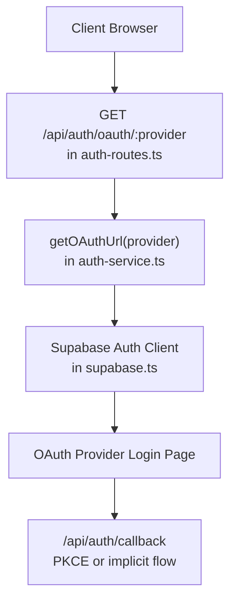
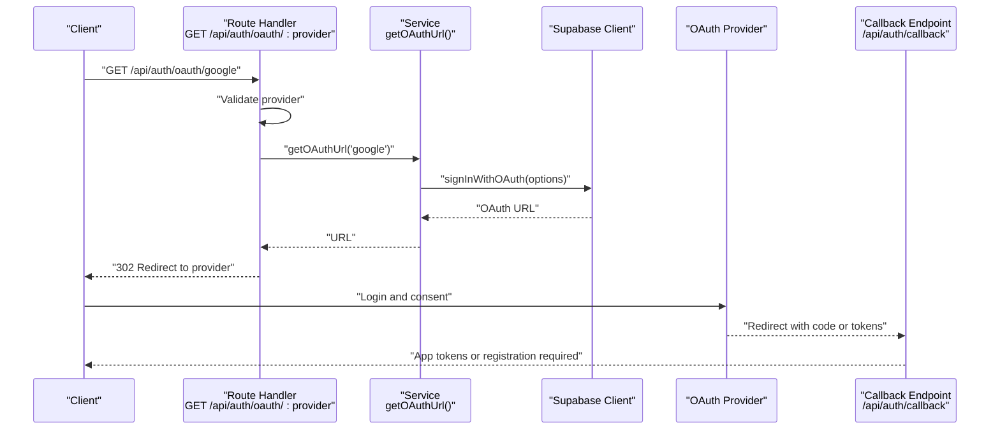
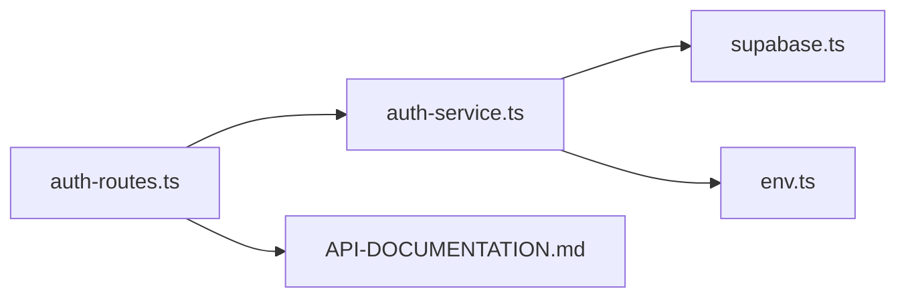

# OAuth Provider Initiation

<cite>
**Referenced Files in This Document**
- [auth-routes.ts](file://src/routes/auth-routes.ts)
- [auth-service.ts](file://src/services/auth-service.ts)
- [swagger.ts](file://src/config/swagger.ts)
- [env.ts](file://src/config/env.ts)
- [supabase.ts](file://src/config/supabase.ts)
- [API-DOCUMENTATION.md](file://docs/API-DOCUMENTATION.md)
</cite>

## Table of Contents
1. [Introduction](#introduction)
2. [Project Structure](#project-structure)
3. [Core Components](#core-components)
4. [Architecture Overview](#architecture-overview)
5. [Detailed Component Analysis](#detailed-component-analysis)
6. [Dependency Analysis](#dependency-analysis)
7. [Performance Considerations](#performance-considerations)
8. [Troubleshooting Guide](#troubleshooting-guide)
9. [Conclusion](#conclusion)

## Introduction
This document describes the OAuth provider initiation endpoint GET /api/auth/oauth/:provider in FreelanceXchain. It explains how the route validates the provider parameter, generates the OAuth URL via getOAuthUrl in auth-service.ts, and performs the redirection to the selected provider. It also covers redirect URL configuration, PKCE flow setup, state management for security, and how invalid provider requests are handled. Finally, it documents error responses for unsupported providers and server-side failures during URL generation.

## Project Structure
The OAuth initiation flow spans routing, service-layer logic, and configuration:

- Route handler: GET /api/auth/oauth/:provider
- Service function: getOAuthUrl(provider)
- Supabase client initialization
- Environment configuration for redirect URL and base URL
- OpenAPI/Swagger documentation

**Diagram sources**
- [auth-routes.ts](file://src/routes/auth-routes.ts#L532-L563)
- [auth-service.ts](file://src/services/auth-service.ts#L298-L324)
- [supabase.ts](file://src/config/supabase.ts#L25-L33)
- [API-DOCUMENTATION.md](file://docs/API-DOCUMENTATION.md#L73-L79)

**Section sources**
- [auth-routes.ts](file://src/routes/auth-routes.ts#L532-L563)
- [auth-service.ts](file://src/services/auth-service.ts#L298-L324)
- [swagger.ts](file://src/config/swagger.ts#L1-L40)
- [env.ts](file://src/config/env.ts#L27-L39)
- [supabase.ts](file://src/config/supabase.ts#L25-L33)
- [API-DOCUMENTATION.md](file://docs/API-DOCUMENTATION.md#L73-L79)

## Core Components
- Route handler: Validates provider parameter and delegates to getOAuthUrl, then redirects to the generated URL. It returns 400 for invalid provider and 500 for internal errors.
- Service function: Builds the provider-specific Supabase OAuth URL, sets redirect URL and PKCE-related query parameters, and returns the URL.
- Supabase client: Provides the Supabase Auth client used to generate the OAuth URL.
- Environment configuration: Determines the redirect URL and base URL used in the OAuth flow.

Key behaviors:
- Supported providers: google, github, azure, linkedin
- Redirect URL: Uses PUBLIC_URL or falls back to http://localhost:<port>/api/auth/callback
- PKCE parameters: access_type=offline and prompt=consent are included
- No state parameter is explicitly set in getOAuthUrl; state management is handled by Supabase

**Section sources**
- [auth-routes.ts](file://src/routes/auth-routes.ts#L532-L563)
- [auth-service.ts](file://src/services/auth-service.ts#L298-L324)
- [env.ts](file://src/config/env.ts#L27-L39)
- [supabase.ts](file://src/config/supabase.ts#L25-L33)

## Architecture Overview
The OAuth initiation flow is a thin controller that delegates to a service function which uses the Supabase client to generate the provider URL. The browser is redirected to the provider’s OAuth page. After authentication, the provider redirects back to the configured callback endpoint.

**Diagram sources**
- [auth-routes.ts](file://src/routes/auth-routes.ts#L532-L563)
- [auth-service.ts](file://src/services/auth-service.ts#L298-L324)
- [API-DOCUMENTATION.md](file://docs/API-DOCUMENTATION.md#L73-L79)

## Detailed Component Analysis

### Route Handler: GET /api/auth/oauth/:provider
Responsibilities:
- Extracts provider from path parameters
- Validates provider against supported list
- Calls getOAuthUrl(provider)
- Redirects to the generated URL
- Returns 400 for invalid provider and 500 for internal errors

Security and validation:
- Provider validation prevents unsupported values
- No additional state parameter is set here; state is managed by Supabase

Error handling:
- 400: VALIDATION_ERROR with message “Invalid provider”
- 500: INTERNAL_ERROR with message “Failed to initiate OAuth flow”

Client-side initiation examples (conceptual):
- Google: GET /api/auth/oauth/google
- GitHub: GET /api/auth/oauth/github
- Azure: GET /api/auth/oauth/azure
- LinkedIn: GET /api/auth/oauth/linkedin

Notes:
- The route intentionally does not accept a role parameter at this stage; role selection occurs after callback.

**Section sources**
- [auth-routes.ts](file://src/routes/auth-routes.ts#L532-L563)
- [API-DOCUMENTATION.md](file://docs/API-DOCUMENTATION.md#L73-L79)

### Service Function: getOAuthUrl(provider)
Responsibilities:
- Selects the correct provider identifier for Supabase (linkedin_oidc for LinkedIn)
- Determines redirect URL using PUBLIC_URL or falls back to configured base URL and port
- Calls Supabase signInWithOAuth with:
  - redirectTo set to the computed callback URL
  - skipBrowserRedirect set to true (client handles redirect)
  - queryParams: access_type=offline and prompt=consent for PKCE
- Returns the OAuth URL or throws on error

Security and PKCE:
- access_type=offline and prompt=consent enable offline access and re-consent prompts
- skipBrowserRedirect=true ensures the server returns the URL instead of performing automatic browser redirect
- No explicit state parameter is passed; Supabase manages state internally

Redirect URL resolution:
- Uses PUBLIC_URL environment variable if present
- Otherwise constructs http://localhost:<port>/api/auth/callback using config

**Section sources**
- [auth-service.ts](file://src/services/auth-service.ts#L298-L324)
- [env.ts](file://src/config/env.ts#L27-L39)
- [supabase.ts](file://src/config/supabase.ts#L25-L33)

### Supabase Client Initialization
- Ensures SUPABASE_URL and SUPABASE_ANON_KEY are configured
- Provides a singleton Supabase client instance used by getOAuthUrl

**Section sources**
- [supabase.ts](file://src/config/supabase.ts#L25-L33)

### OpenAPI/Swagger Documentation
- The route is documented with path parameter provider constrained to [google, github, azure, linkedin]
- Response is 302 redirect to provider

**Section sources**
- [swagger.ts](file://src/config/swagger.ts#L1-L40)
- [API-DOCUMENTATION.md](file://docs/API-DOCUMENTATION.md#L73-L79)

### PKCE Flow Setup and State Management
- PKCE parameters:
  - access_type=offline
  - prompt=consent
- State management:
  - The service does not explicitly pass a state parameter
  - Supabase handles state internally during signInWithOAuth

Note: The callback endpoint supports both PKCE (code in query) and implicit (tokens in URL fragment). The initiation endpoint focuses on generating the URL with PKCE parameters.

**Section sources**
- [auth-service.ts](file://src/services/auth-service.ts#L298-L324)
- [auth-routes.ts](file://src/routes/auth-routes.ts#L390-L482)

### Error Handling During URL Generation
- Validation failure: 400 with VALIDATION_ERROR
- Internal failure: 500 with INTERNAL_ERROR
- getOAuthUrl throws on Supabase error; the route catches and returns 500

**Section sources**
- [auth-routes.ts](file://src/routes/auth-routes.ts#L532-L563)
- [auth-service.ts](file://src/services/auth-service.ts#L319-L321)

## Dependency Analysis
The OAuth initiation endpoint depends on:
- Route handler for parameter validation and redirection
- Service function for URL generation and PKCE parameters
- Supabase client for OAuth integration
- Environment configuration for redirect URL and base URL

**Diagram sources**
- [auth-routes.ts](file://src/routes/auth-routes.ts#L532-L563)
- [auth-service.ts](file://src/services/auth-service.ts#L298-L324)
- [supabase.ts](file://src/config/supabase.ts#L25-L33)
- [env.ts](file://src/config/env.ts#L27-L39)
- [API-DOCUMENTATION.md](file://docs/API-DOCUMENTATION.md#L73-L79)

**Section sources**
- [auth-routes.ts](file://src/routes/auth-routes.ts#L532-L563)
- [auth-service.ts](file://src/services/auth-service.ts#L298-L324)
- [supabase.ts](file://src/config/supabase.ts#L25-L33)
- [env.ts](file://src/config/env.ts#L27-L39)
- [API-DOCUMENTATION.md](file://docs/API-DOCUMENTATION.md#L73-L79)

## Performance Considerations
- The route is lightweight and delegates to a single service call; latency is dominated by network round-trips to Supabase and the OAuth provider.
- Using skipBrowserRedirect=true avoids unnecessary client-side redirects and lets the server return the URL promptly.
- Ensure PUBLIC_URL is configured correctly to minimize redirect hops and avoid mixed-content issues.

## Troubleshooting Guide
Common issues and resolutions:
- Unsupported provider:
  - Symptom: 400 VALIDATION_ERROR with message “Invalid provider”
  - Resolution: Use one of google, github, azure, linkedin
- Missing Supabase configuration:
  - Symptom: 500 INTERNAL_ERROR during URL generation
  - Resolution: Set SUPABASE_URL and SUPABASE_ANON_KEY
- Incorrect redirect URL:
  - Symptom: Redirect loops or callback failures
  - Resolution: Set PUBLIC_URL to your production origin or ensure local PORT is correct
- Provider-specific misconfiguration:
  - Symptom: Provider rejects the redirect URL or fails to return a code
  - Resolution: Verify provider OAuth app settings and allowed redirect URIs match PUBLIC_URL/api/auth/callback

**Section sources**
- [auth-routes.ts](file://src/routes/auth-routes.ts#L532-L563)
- [auth-service.ts](file://src/services/auth-service.ts#L298-L324)
- [env.ts](file://src/config/env.ts#L27-L39)
- [supabase.ts](file://src/config/supabase.ts#L25-L33)

## Conclusion
The GET /api/auth/oauth/:provider endpoint provides a secure and standardized way to initiate OAuth with supported providers. It validates inputs, generates a provider-specific URL with PKCE parameters, and redirects the client to the provider’s login page. Redirect URL configuration and environment variables are central to correctness. The service layer encapsulates Supabase integration, while the route enforces validation and error handling. For unsupported providers or server-side failures, the endpoint returns appropriate error responses.