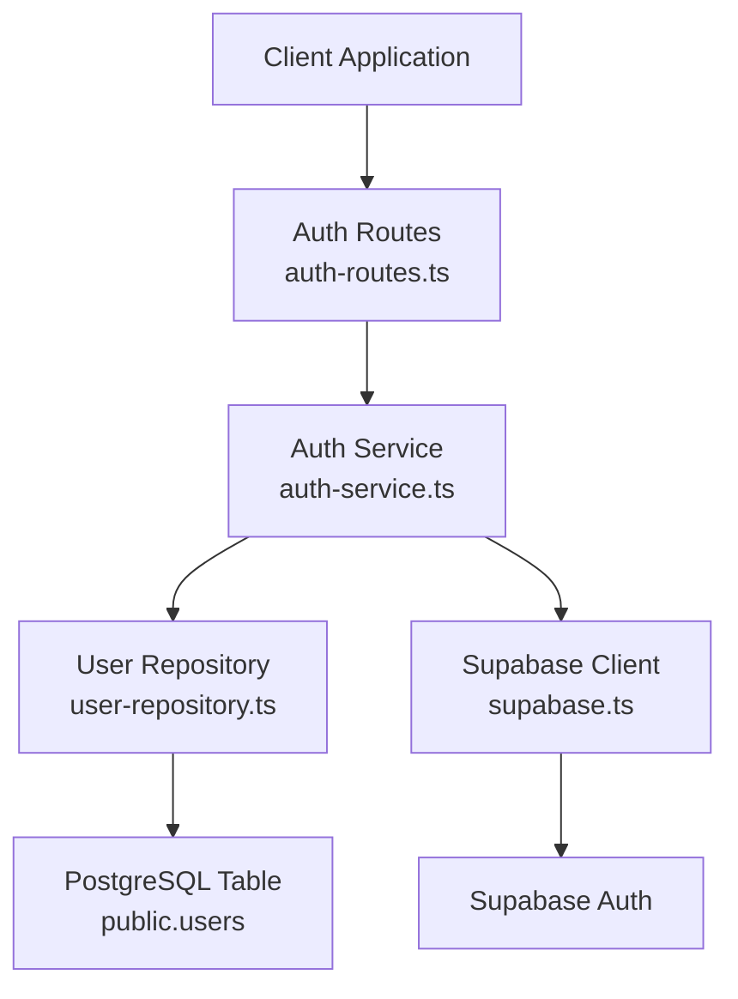
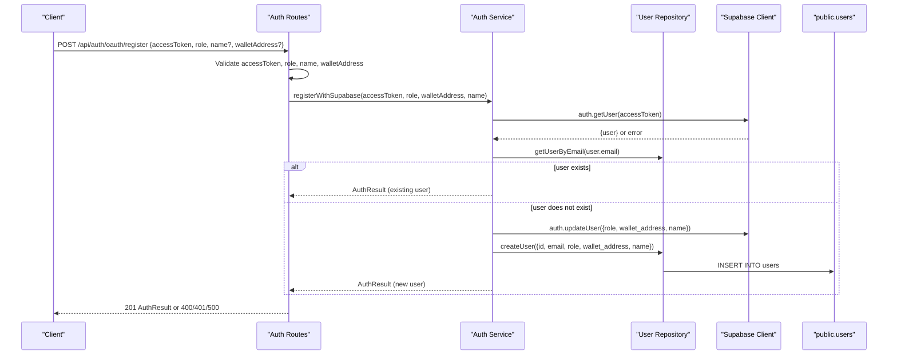
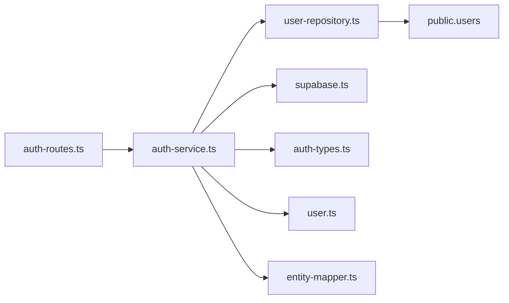

# OAuth Registration Completion

<cite>
**Referenced Files in This Document**
- [auth-routes.ts](file://src/routes/auth-routes.ts)
- [auth-service.ts](file://src/services/auth-service.ts)
- [user-repository.ts](file://src/repositories/user-repository.ts)
- [supabase.ts](file://src/config/supabase.ts)
- [swagger.ts](file://src/config/swagger.ts)
- [user.ts](file://src/models/user.ts)
- [auth-types.ts](file://src/services/auth-types.ts)
- [entity-mapper.ts](file://src/utils/entity-mapper.ts)
</cite>

## Table of Contents
1. [Introduction](#introduction)
2. [Project Structure](#project-structure)
3. [Core Components](#core-components)
4. [Architecture Overview](#architecture-overview)
5. [Detailed Component Analysis](#detailed-component-analysis)
6. [Dependency Analysis](#dependency-analysis)
7. [Performance Considerations](#performance-considerations)
8. [Troubleshooting Guide](#troubleshooting-guide)
9. [Conclusion](#conclusion)

## Introduction
This document provides comprehensive API documentation for the OAuth registration completion endpoint POST /api/auth/oauth/register in FreelanceXchain. The endpoint finalizes account creation for new OAuth users by assigning a role (freelancer or employer), optionally setting a full name, and validating an Ethereum wallet address format. It integrates with registerWithSupabase in auth-service.ts to validate the Supabase access token, synchronize user metadata in Supabase Auth, and create a corresponding user record in the public.users table. The document explains validation rules, response formats, error handling, and security considerations for token validation and role assignment.

## Project Structure
The OAuth registration flow spans route handlers, service logic, repository access, and Supabase integration. The following diagram shows the primary components involved in the POST /api/auth/oauth/register endpoint.

**Diagram sources**
- [auth-routes.ts](file://src/routes/auth-routes.ts#L640-L753)
- [auth-service.ts](file://src/services/auth-service.ts#L347-L402)
- [user-repository.ts](file://src/repositories/user-repository.ts#L1-L58)
- [supabase.ts](file://src/config/supabase.ts#L1-L44)

**Section sources**
- [auth-routes.ts](file://src/routes/auth-routes.ts#L640-L753)
- [auth-service.ts](file://src/services/auth-service.ts#L347-L402)
- [user-repository.ts](file://src/repositories/user-repository.ts#L1-L58)
- [supabase.ts](file://src/config/supabase.ts#L1-L44)

## Core Components
- Route handler for POST /api/auth/oauth/register validates request fields and invokes registerWithSupabase.
- Service function registerWithSupabase validates the Supabase access token, checks for existing user records, updates Supabase user metadata, and creates a public.users record.
- Repository layer persists user data to the public.users table.
- Supabase client manages authentication and user metadata synchronization.

Key responsibilities:
- Validate accessToken presence and role selection.
- Validate optional name length and wallet address format.
- Authenticate and authorize via Supabase access token.
- Assign role (freelancer or employer) and optional profile metadata.
- Create user record in public.users and return AuthResult.

**Section sources**
- [auth-routes.ts](file://src/routes/auth-routes.ts#L682-L753)
- [auth-service.ts](file://src/services/auth-service.ts#L347-L402)
- [user-repository.ts](file://src/repositories/user-repository.ts#L1-L58)
- [supabase.ts](file://src/config/supabase.ts#L1-L44)

## Architecture Overview
The OAuth registration completion follows a layered architecture:
- Presentation: Express route validates input and delegates to service.
- Application: Service validates token, updates metadata, and creates user.
- Persistence: Repository writes to public.users.
- Integration: Supabase client synchronizes user metadata and sessions.

**Diagram sources**
- [auth-routes.ts](file://src/routes/auth-routes.ts#L682-L753)
- [auth-service.ts](file://src/services/auth-service.ts#L347-L402)
- [user-repository.ts](file://src/repositories/user-repository.ts#L1-L58)
- [supabase.ts](file://src/config/supabase.ts#L1-L44)

## Detailed Component Analysis

### Endpoint Definition: POST /api/auth/oauth/register
- Method: POST
- Path: /api/auth/oauth/register
- Purpose: Finalize OAuth user registration by assigning role and optional profile metadata.

Request body fields:
- accessToken: string, required. Supabase access token obtained from OAuth flow.
- role: string, required. Must be freelancer or employer.
- name: string, optional. Minimum 2 characters if provided.
- walletAddress: string, optional. Must match Ethereum address pattern 0x followed by 40 hexadecimal characters.

Response:
- 201 Created: AuthResult containing user id, email, role, walletAddress, createdAt, accessToken, refreshToken.
- 400 Bad Request: Validation error with details array indicating invalid fields.
- 401 Unauthorized: Invalid token or registration failure mapped to AUTH_INVALID_TOKEN.
- 500 Internal Server Error: Unexpected error during registration.

Security considerations:
- Access token must be validated via Supabase getUser before proceeding.
- Role must be one of the allowed values.
- Wallet address must conform to Ethereum address format.
- Name must meet minimum length requirement when present.

Validation logic highlights:
- accessToken presence and type checked.
- role restricted to freelancer or employer.
- name length enforced when provided.
- walletAddress format enforced using regex pattern.

Integration points:
- registerWithSupabase performs token validation and metadata update.
- User creation occurs in public.users via repository.
- Session refresh token is included in AuthResult.

**Section sources**
- [auth-routes.ts](file://src/routes/auth-routes.ts#L640-L753)
- [auth-types.ts](file://src/services/auth-types.ts#L1-L49)
- [user.ts](file://src/models/user.ts#L1-L4)

### Service Layer: registerWithSupabase
Behavior:
- Validates access token by calling Supabase getUser.
- Checks if user already exists in public.users by email.
- Updates Supabase user metadata with role, wallet_address, and name.
- Creates a new user record in public.users with normalized email and provided attributes.
- Retrieves session refresh token and constructs AuthResult.

Error handling:
- Returns INVALID_TOKEN when token is invalid or user not found.
- Returns EXISTING_USER when user already exists (AuthResult).
- Propagates internal errors as AUTH_INVALID_TOKEN.

Data model mapping:
- UserEntity fields include id, email, role, wallet_address, name, created_at, updated_at.
- AuthResult includes user (id, email, role, walletAddress, createdAt) and tokens.

**Section sources**
- [auth-service.ts](file://src/services/auth-service.ts#L347-L402)
- [user-repository.ts](file://src/repositories/user-repository.ts#L1-L58)
- [entity-mapper.ts](file://src/utils/entity-mapper.ts#L1-L46)

### Repository Layer: User Repository
Responsibilities:
- createUser inserts a new user into public.users with timestamps.
- getUserByEmail retrieves user by normalized email.
- getUserById retrieves user by id.
- emailExists checks for duplicate emails.

Database integration:
- Uses Supabase client to perform CRUD operations on the users table.
- Handles row-not-found errors gracefully.

**Section sources**
- [user-repository.ts](file://src/repositories/user-repository.ts#L1-L58)
- [supabase.ts](file://src/config/supabase.ts#L1-L44)

### Supabase Integration
- getSupabaseClient initializes the Supabase client with configured URL and anon key.
- TABLES defines the users table constant used by the repository.
- registerWithSupabase uses Supabase auth.getUser to validate token and auth.updateUser to set metadata.

**Section sources**
- [supabase.ts](file://src/config/supabase.ts#L1-L44)
- [auth-service.ts](file://src/services/auth-service.ts#L347-L402)

### Example Requests and Responses

- Successful registration request:
  - POST /api/auth/oauth/register
  - Body: { "accessToken": "<valid_supabase_access_token>", "role": "freelancer", "name": "John Doe", "walletAddress": "0x1234567890123456789012345678901234567890" }

- Minimal registration request:
  - POST /api/auth/oauth/register
  - Body: { "accessToken": "<valid_supabase_access_token>", "role": "employer" }

- Validation error response (invalid role):
  - Status: 400
  - Body: { "error": { "code": "VALIDATION_ERROR", "message": "Invalid request data", "details": [ { "field": "role", "message": "Valid role (freelancer or employer) is required" } ] }, "timestamp": "<iso_datetime>", "requestId": "<uuid>" }

- Invalid token response:
  - Status: 401
  - Body: { "error": { "code": "AUTH_INVALID_TOKEN", "message": "Registration failed" }, "timestamp": "<iso_datetime>", "requestId": "<uuid>" }

- Internal error response:
  - Status: 500
  - Body: { "error": { "code": "INTERNAL_ERROR", "message": "An unexpected error occurred during registration" }, "timestamp": "<iso_datetime>", "requestId": "<uuid>" }

Note: Replace placeholders with actual values. The AuthResult payload includes user and token fields as defined in the service types.

**Section sources**
- [auth-routes.ts](file://src/routes/auth-routes.ts#L682-L753)
- [auth-service.ts](file://src/services/auth-service.ts#L347-L402)
- [auth-types.ts](file://src/services/auth-types.ts#L1-L49)

## Dependency Analysis
The endpoint depends on:
- Route handler for input validation and orchestration.
- Service function for token validation, metadata update, and user creation.
- Repository for persistence to public.users.
- Supabase client for authentication and metadata synchronization.

**Diagram sources**
- [auth-routes.ts](file://src/routes/auth-routes.ts#L640-L753)
- [auth-service.ts](file://src/services/auth-service.ts#L347-L402)
- [user-repository.ts](file://src/repositories/user-repository.ts#L1-L58)
- [supabase.ts](file://src/config/supabase.ts#L1-L44)
- [auth-types.ts](file://src/services/auth-types.ts#L1-L49)
- [user.ts](file://src/models/user.ts#L1-L4)
- [entity-mapper.ts](file://src/utils/entity-mapper.ts#L1-L46)

**Section sources**
- [auth-routes.ts](file://src/routes/auth-routes.ts#L640-L753)
- [auth-service.ts](file://src/services/auth-service.ts#L347-L402)
- [user-repository.ts](file://src/repositories/user-repository.ts#L1-L58)
- [supabase.ts](file://src/config/supabase.ts#L1-L44)
- [auth-types.ts](file://src/services/auth-types.ts#L1-L49)
- [user.ts](file://src/models/user.ts#L1-L4)
- [entity-mapper.ts](file://src/utils/entity-mapper.ts#L1-L46)

## Performance Considerations
- Token validation is performed synchronously via Supabase getUser; ensure low-latency network connectivity to Supabase.
- Public users table creation uses a short delay before querying; consider adjusting timing if triggers are slow.
- Repository operations are single-row queries; keep indexes on id and email for optimal performance.
- Avoid excessive retries on transient Supabase errors; implement exponential backoff if needed.

[No sources needed since this section provides general guidance]

## Troubleshooting Guide
Common issues and resolutions:
- Invalid access token:
  - Symptom: 401 AUTH_INVALID_TOKEN.
  - Cause: Token expired or malformed.
  - Resolution: Obtain a fresh access token via OAuth flow and retry.

- Validation errors:
  - Symptom: 400 VALIDATION_ERROR with details array.
  - Causes: Missing accessToken, invalid role, invalid name length, or invalid wallet address format.
  - Resolution: Correct request payload according to validation rules.

- Duplicate user:
  - Symptom: 401 AUTH_INVALID_TOKEN indicating existing user.
  - Cause: User already exists in public.users.
  - Resolution: Log in with existing credentials or use a different OAuth account.

- Supabase metadata update failures:
  - Symptom: Registration proceeds but metadata not updated.
  - Resolution: Verify Supabase configuration and retry; check logs for error details.

- Internal server errors:
  - Symptom: 500 INTERNAL_ERROR.
  - Resolution: Inspect server logs and retry; confirm Supabase connectivity and database health.

**Section sources**
- [auth-routes.ts](file://src/routes/auth-routes.ts#L682-L753)
- [auth-service.ts](file://src/services/auth-service.ts#L347-L402)

## Conclusion
The POST /api/auth/oauth/register endpoint securely finalizes OAuth user registration by validating the access token, enforcing role and profile constraints, updating Supabase user metadata, and creating a public.users record. The service layer encapsulates Supabase integration and repository persistence, while the route layer enforces input validation and returns standardized responses. Following the documented validation rules and error handling ensures robust integration with the FreelanceXchain platform.