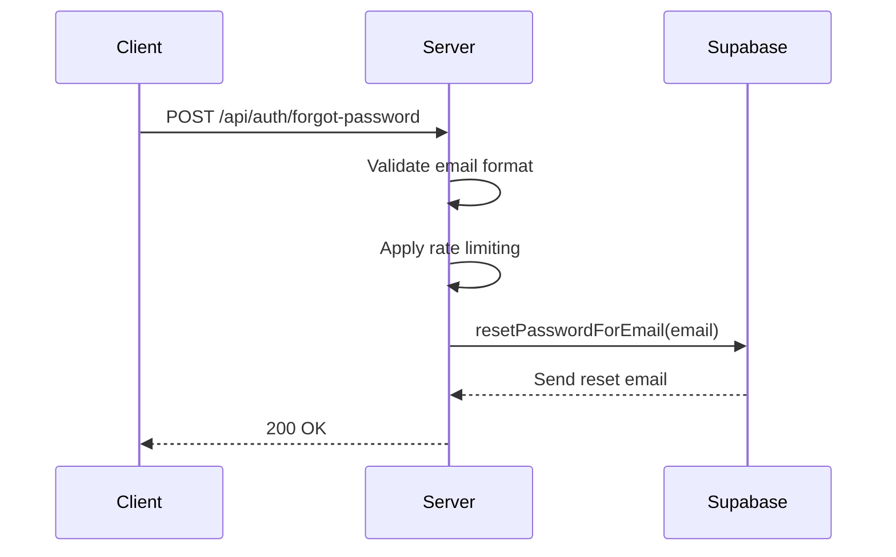
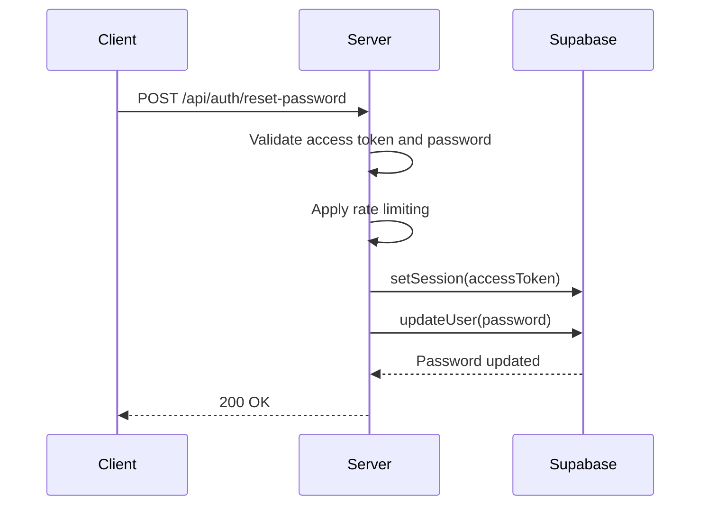
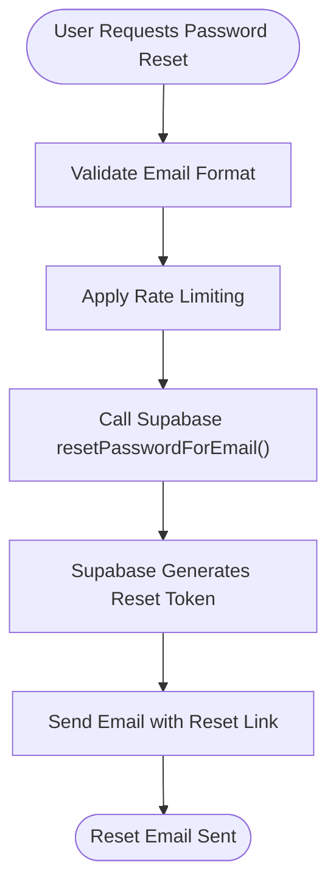
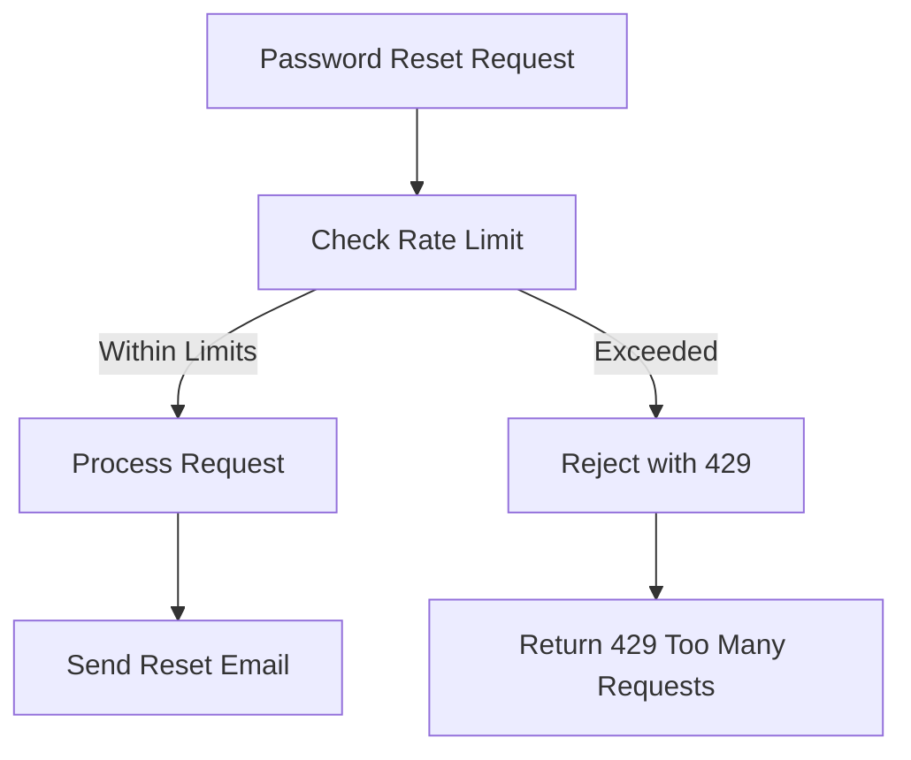
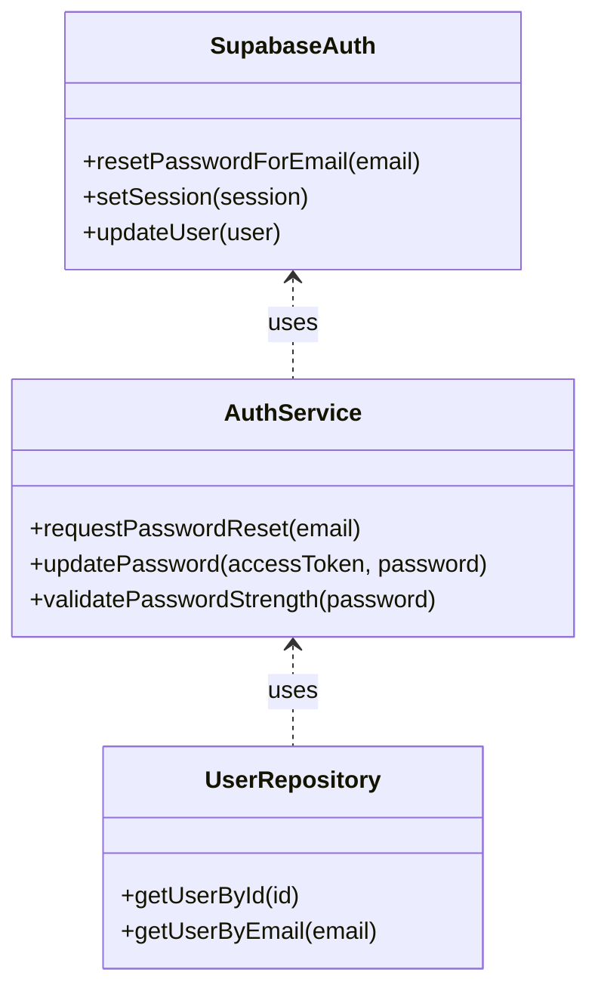

# Password Recovery

<cite>
**Referenced Files in This Document**   
- [auth-service.ts](file://src/services/auth-service.ts)
- [auth-routes.ts](file://src/routes/auth-routes.ts)
- [rate-limiter.ts](file://src/middleware/rate-limiter.ts)
- [env.ts](file://src/config/env.ts)
- [supabase.ts](file://src/config/supabase.ts)
</cite>

## Table of Contents
1. [Introduction](#introduction)
2. [Password Recovery Endpoints](#password-recovery-endpoints)
3. [Email Verification Process](#email-verification-process)
4. [Security Measures](#security-measures)
5. [Integration with Supabase](#integration-with-supabase)
6. [Implementation Details](#implementation-details)

## Introduction
The FreelanceXchain system provides a secure password recovery mechanism that allows users to reset their passwords through an email-based verification process. This documentation details the implementation of the password recovery functionality, including the requestPasswordReset and updatePassword flows, security measures, and integration with Supabase's authentication system.

**Section sources**
- [auth-service.ts](file://src/services/auth-service.ts#L425-L469)
- [auth-routes.ts](file://src/routes/auth-routes.ts#L808-L937)

## Password Recovery Endpoints
The password recovery functionality is exposed through two primary endpoints that handle the initiation and completion of the password reset process.

### Request Password Reset
The `/api/auth/forgot-password` endpoint initiates the password recovery process by sending a reset email to the user's registered email address.

**Diagram sources**
- [auth-service.ts](file://src/services/auth-service.ts#L425-L447)
- [auth-routes.ts](file://src/routes/auth-routes.ts#L808-L859)

### Reset Password
The `/api/auth/reset-password` endpoint completes the password recovery process by updating the user's password using the access token provided in the reset email.

**Diagram sources**
- [auth-service.ts](file://src/services/auth-service.ts#L450-L468)
- [auth-routes.ts](file://src/routes/auth-routes.ts#L861-L935)

**Section sources**
- [auth-service.ts](file://src/services/auth-service.ts#L425-L469)
- [auth-routes.ts](file://src/routes/auth-routes.ts#L808-L937)

## Email Verification Process
The password recovery process uses an email-based verification system to ensure that only the legitimate account owner can reset their password.

### Token Generation and Expiration
When a user requests a password reset, Supabase generates a time-limited access token that is included in the reset email. The token has the following characteristics:

- **Expiration**: The reset token expires after a configurable period (default: 1 hour)
- **Single Use**: The token becomes invalid after it is used to update the password
- **Secure Transmission**: The token is transmitted via HTTPS and included in the redirect URL

The redirect URL is configured based on the environment:
- Production: Uses the PUBLIC_URL environment variable
- Development: Defaults to localhost with the configured port

**Diagram sources**
- [auth-service.ts](file://src/services/auth-service.ts#L430-L437)
- [env.ts](file://src/config/env.ts#L27-L39)

**Section sources**
- [auth-service.ts](file://src/services/auth-service.ts#L425-L447)

## Security Measures
The password recovery implementation includes multiple security measures to prevent abuse and protect user accounts.

### Rate Limiting
The system implements rate limiting to prevent brute force attacks and denial-of-service attempts:

- **Authentication Rate Limiter**: Limits password reset requests to 10 attempts per 15 minutes per IP address
- **Sensitive Operation Rate Limiter**: Additional protection for critical authentication operations

**Diagram sources**
- [rate-limiter.ts](file://src/middleware/rate-limiter.ts#L64-L68)
- [auth-routes.ts](file://src/routes/auth-routes.ts#L834-L835)

### Password Strength Requirements
The system enforces strong password policies to enhance account security:

- Minimum 8 characters
- At least one uppercase letter
- At least one lowercase letter
- At least one number
- At least one special character (@$!%*?&)

**Section sources**
- [auth-service.ts](file://src/services/auth-service.ts#L14-L47)
- [rate-limiter.ts](file://src/middleware/rate-limiter.ts#L64-L80)

## Integration with Supabase
The password recovery functionality integrates with Supabase's authentication system while maintaining application-specific user data and session management.

### Supabase Authentication Flow
The implementation leverages Supabase's built-in password reset functionality while extending it with custom business logic:

1. **Token Handling**: The access token from Supabase is used to authenticate the password update request
2. **Session Management**: The system sets the session with the provided access token before updating the password
3. **User Data Synchronization**: Application-specific user data is maintained in the public.users table

**Diagram sources**
- [auth-service.ts](file://src/services/auth-service.ts#L425-L469)
- [supabase.ts](file://src/config/supabase.ts#L25-L33)

### Application-Specific User Management
While Supabase handles the core authentication, the application maintains its own user data in the public.users table:

- **User Profile Data**: Role, wallet address, name, and other application-specific attributes
- **Data Synchronization**: User records are created and updated to maintain consistency between Supabase Auth and the application database
- **Session Integration**: The system combines Supabase tokens with application user data in the authentication response

**Section sources**
- [auth-service.ts](file://src/services/auth-service.ts#L425-L469)
- [supabase.ts](file://src/config/supabase.ts#L6-L21)

## Implementation Details
The password recovery functionality is implemented across multiple service and route files, with clear separation of concerns.

### Service Layer Implementation
The core password recovery logic is implemented in the `auth-service.ts` file with two primary functions:

- **requestPasswordReset(email)**: Initiates the password recovery process by requesting Supabase to send a reset email
- **updatePassword(accessToken, newPassword)**: Completes the recovery by updating the user's password using the provided access token

Both functions include comprehensive error handling and return standardized response objects.

### Route Layer Implementation
The authentication routes are defined in `auth-routes.ts` with proper request validation and error handling:

- **Input Validation**: Email format and password strength are validated before processing
- **Rate Limiting**: The authRateLimiter middleware is applied to prevent abuse
- **Error Responses**: Standardized error responses with appropriate HTTP status codes
- **Request Tracing**: Each request includes a requestId for debugging and monitoring

**Section sources**
- [auth-service.ts](file://src/services/auth-service.ts#L425-L469)
- [auth-routes.ts](file://src/routes/auth-routes.ts#L808-L937)
- [rate-limiter.ts](file://src/middleware/rate-limiter.ts#L64-L80)