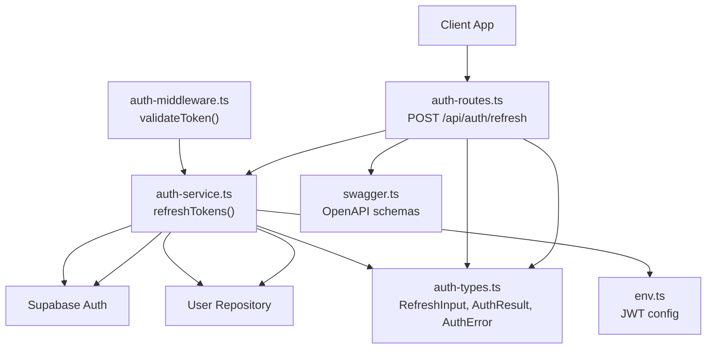
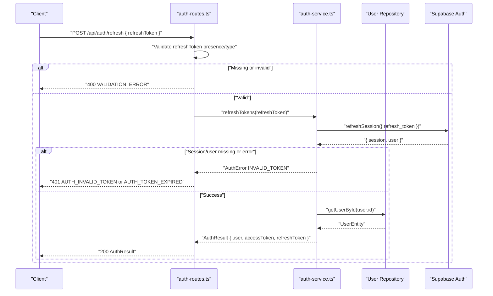
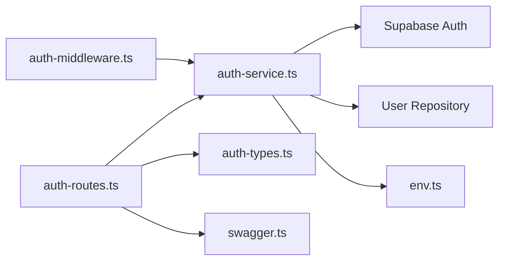

# Token Refresh

<cite>
**Referenced Files in This Document**
- [auth-routes.ts](file://src/routes/auth-routes.ts)
- [auth-service.ts](file://src/services/auth-service.ts)
- [auth-types.ts](file://src/services/auth-types.ts)
- [auth-middleware.ts](file://src/middleware/auth-middleware.ts)
- [env.ts](file://src/config/env.ts)
- [swagger.ts](file://src/config/swagger.ts)
- [README.md](file://README.md)
</cite>

## Table of Contents
1. [Introduction](#introduction)
2. [Project Structure](#project-structure)
3. [Core Components](#core-components)
4. [Architecture Overview](#architecture-overview)
5. [Detailed Component Analysis](#detailed-component-analysis)
6. [Dependency Analysis](#dependency-analysis)
7. [Performance Considerations](#performance-considerations)
8. [Troubleshooting Guide](#troubleshooting-guide)
9. [Conclusion](#conclusion)
10. [Appendices](#appendices)

## Introduction
This document describes the token refresh mechanism for the FreelanceXchain authentication system. It focuses on the POST /api/auth/refresh endpoint that accepts a refreshToken in the request body to obtain new accessToken and refreshToken pairs. It documents the RefreshInput schema, explains the token rotation strategy, and details the 200 success response with updated AuthResult, as well as error responses for 400 (missing token) and 401 (expired/invalid token). It also explains how the system validates token signatures and expiration using JWT standards, documents the implementation in auth-routes.ts and refreshTokens in auth-service.ts, and provides secure storage recommendations for refresh tokens on client applications.

## Project Structure
The token refresh flow spans routing, service logic, and configuration:
- Route handler: POST /api/auth/refresh
- Service function: refreshTokens(refreshToken)
- Types: RefreshInput, AuthResult, AuthError
- Middleware: authMiddleware for access token validation
- Configuration: JWT secrets and expirations

**Diagram sources**
- [auth-routes.ts](file://src/routes/auth-routes.ts#L318-L385)
- [auth-service.ts](file://src/services/auth-service.ts#L203-L228)
- [auth-types.ts](file://src/services/auth-types.ts#L1-L49)
- [auth-middleware.ts](file://src/middleware/auth-middleware.ts#L1-L71)
- [env.ts](file://src/config/env.ts#L52-L58)
- [swagger.ts](file://src/config/swagger.ts#L1-L233)

**Section sources**
- [auth-routes.ts](file://src/routes/auth-routes.ts#L318-L385)
- [auth-service.ts](file://src/services/auth-service.ts#L203-L228)
- [auth-types.ts](file://src/services/auth-types.ts#L1-L49)
- [auth-middleware.ts](file://src/middleware/auth-middleware.ts#L1-L71)
- [env.ts](file://src/config/env.ts#L52-L58)
- [swagger.ts](file://src/config/swagger.ts#L1-L233)

## Core Components
- Endpoint: POST /api/auth/refresh
- Request body: RefreshInput with refreshToken
- Success response: 200 OK with AuthResult containing user, accessToken, and refreshToken
- Error responses:
  - 400 Bad Request for missing or invalid refreshToken
  - 401 Unauthorized for expired or invalid refresh token

Key implementation references:
- Route handler and OpenAPI schema for RefreshInput and AuthResult
- Service function refreshTokens that calls Supabase auth refreshSession
- Type definitions for RefreshInput, AuthResult, AuthError
- JWT configuration for secrets and expirations

**Section sources**
- [auth-routes.ts](file://src/routes/auth-routes.ts#L64-L115)
- [auth-routes.ts](file://src/routes/auth-routes.ts#L318-L385)
- [auth-service.ts](file://src/services/auth-service.ts#L203-L228)
- [auth-types.ts](file://src/services/auth-types.ts#L1-L49)
- [env.ts](file://src/config/env.ts#L52-L58)

## Architecture Overview
The refresh flow integrates with Supabase Auth to rotate tokens while ensuring the user still exists in the application’s database.

**Diagram sources**
- [auth-routes.ts](file://src/routes/auth-routes.ts#L352-L385)
- [auth-service.ts](file://src/services/auth-service.ts#L206-L228)

## Detailed Component Analysis

### Endpoint Definition: POST /api/auth/refresh
- Method: POST
- Path: /api/auth/refresh
- Request body: RefreshInput
  - refreshToken: string (required)
- Responses:
  - 200 OK: AuthResult
  - 400 Bad Request: AuthError with VALIDATION_ERROR
  - 401 Unauthorized: AuthError with AUTH_INVALID_TOKEN or AUTH_TOKEN_EXPIRED

OpenAPI schema definitions:
- RefreshInput: object with required refreshToken
- AuthResult: object with user, accessToken, refreshToken

Validation logic:
- Route checks for presence and type of refreshToken
- Returns 400 with details if missing or not a string

**Section sources**
- [auth-routes.ts](file://src/routes/auth-routes.ts#L64-L115)
- [auth-routes.ts](file://src/routes/auth-routes.ts#L318-L385)

### Service Implementation: refreshTokens(refreshToken)
Behavior:
- Calls Supabase auth refreshSession with the provided refresh token
- On success, retrieves the associated user from the application’s user repository
- Returns AuthResult with updated access and refresh tokens
- On failure, returns AuthError with INVALID_TOKEN and explanatory message

JWT validation:
- Access tokens are validated by auth-middleware.ts using validateToken
- validateToken calls Supabase getUser with the access token to verify signature and expiration
- The service itself relies on Supabase for refresh token validation

**Section sources**
- [auth-service.ts](file://src/services/auth-service.ts#L203-L228)
- [auth-middleware.ts](file://src/middleware/auth-middleware.ts#L25-L70)

### Token Rotation Strategy
- Access tokens are short-lived (configured via JWT_EXPIRES_IN)
- Refresh tokens are long-lived (configured via JWT_REFRESH_EXPIRES_IN)
- On successful refresh, both access and refresh tokens are rotated
- The system delegates signature verification and expiration checks to Supabase Auth

JWT configuration:
- JWT_SECRET and JWT_REFRESH_SECRET are loaded from environment
- Expirations are configured via JWT_EXPIRES_IN and JWT_REFRESH_EXPIRES_IN

**Section sources**
- [env.ts](file://src/config/env.ts#L52-L58)
- [auth-service.ts](file://src/services/auth-service.ts#L231-L259)

### Data Models and Types
- RefreshInput: { refreshToken: string }
- AuthResult: { user, accessToken: string, refreshToken: string }
- AuthError: { code, message }

These types are used consistently across route and service layers.

**Section sources**
- [auth-types.ts](file://src/services/auth-types.ts#L1-L49)

### Example Requests and Responses
- Request body (JSON):
  - refreshToken: string
- Successful response body (JSON):
  - user: { id, email, role, walletAddress, createdAt }
  - accessToken: string
  - refreshToken: string
- Error response body (JSON):
  - error: { code, message, details? }
  - timestamp: string (ISO 8601)
  - requestId: string

Notes:
- The endpoint returns 400 for missing/invalid refreshToken
- Returns 401 for expired or invalid refresh token

**Section sources**
- [auth-routes.ts](file://src/routes/auth-routes.ts#L64-L115)
- [auth-routes.ts](file://src/routes/auth-routes.ts#L352-L385)
- [auth-service.ts](file://src/services/auth-service.ts#L206-L228)

### JWT Signature and Expiration Validation
- Access token validation:
  - auth-middleware.ts splits Authorization header and calls validateToken
  - validateToken uses Supabase getUser to verify token signature and expiration
  - Returns user claims or AuthError on failure
- Refresh token validation:
  - refreshTokens uses Supabase refreshSession
  - On error or missing session/user, returns AuthError INVALID_TOKEN

This design leverages Supabase’s JWT verification, ensuring robust signature and expiration checks without manual decoding.

**Section sources**
- [auth-middleware.ts](file://src/middleware/auth-middleware.ts#L25-L70)
- [auth-service.ts](file://src/services/auth-service.ts#L206-L228)

## Dependency Analysis
The refresh flow depends on:
- Route handler for input validation and response formatting
- Service layer for token rotation and user lookup
- Supabase Auth for JWT validation and rotation
- User repository for user existence and profile data
- Configuration for JWT secrets and expirations
- OpenAPI schemas for documentation

**Diagram sources**
- [auth-routes.ts](file://src/routes/auth-routes.ts#L318-L385)
- [auth-service.ts](file://src/services/auth-service.ts#L203-L228)
- [auth-types.ts](file://src/services/auth-types.ts#L1-L49)
- [auth-middleware.ts](file://src/middleware/auth-middleware.ts#L1-L71)
- [env.ts](file://src/config/env.ts#L52-L58)
- [swagger.ts](file://src/config/swagger.ts#L1-L233)

**Section sources**
- [auth-routes.ts](file://src/routes/auth-routes.ts#L318-L385)
- [auth-service.ts](file://src/services/auth-service.ts#L203-L228)
- [auth-middleware.ts](file://src/middleware/auth-middleware.ts#L1-L71)
- [env.ts](file://src/config/env.ts#L52-L58)
- [swagger.ts](file://src/config/swagger.ts#L1-L233)

## Performance Considerations
- Refresh calls involve network latency to Supabase; consider caching user data locally for short periods to reduce repeated lookups.
- Rate limiting is applied at the route level to mitigate abuse.
- Keep access token lifetime small and refresh token lifetime larger to balance security and UX.

[No sources needed since this section provides general guidance]

## Troubleshooting Guide
Common issues and resolutions:
- 400 VALIDATION_ERROR:
  - Cause: Missing or invalid refreshToken in request body
  - Resolution: Ensure refreshToken is present and is a string
- 401 AUTH_INVALID_TOKEN or AUTH_TOKEN_EXPIRED:
  - Cause: Refresh token is invalid or expired
  - Resolution: Require the user to log in again to obtain a fresh refresh token
- Internal errors:
  - Cause: Unexpected failures from Supabase or user repository
  - Resolution: Check Supabase connectivity and logs; retry after verifying environment configuration

Operational checks:
- Verify JWT_SECRET/JWT_REFRESH_SECRET and expirations are set correctly
- Confirm Supabase URL and keys are configured
- Ensure the user still exists in the application database

**Section sources**
- [auth-routes.ts](file://src/routes/auth-routes.ts#L352-L385)
- [auth-service.ts](file://src/services/auth-service.ts#L206-L228)
- [env.ts](file://src/config/env.ts#L52-L58)

## Conclusion
The token refresh mechanism in FreelanceXchain is implemented via a dedicated endpoint that rotates both access and refresh tokens using Supabase Auth. The route enforces input validation, while the service performs token rotation and user verification. JWT signature and expiration are validated by Supabase, ensuring secure sessions. Proper configuration of JWT secrets and expirations is essential for balancing security and usability.

[No sources needed since this section summarizes without analyzing specific files]

## Appendices

### API Reference: POST /api/auth/refresh
- Request body: RefreshInput
  - refreshToken: string (required)
- Responses:
  - 200 OK: AuthResult
  - 400 Bad Request: AuthError with VALIDATION_ERROR
  - 401 Unauthorized: AuthError with AUTH_INVALID_TOKEN or AUTH_TOKEN_EXPIRED

**Section sources**
- [auth-routes.ts](file://src/routes/auth-routes.ts#L64-L115)
- [auth-routes.ts](file://src/routes/auth-routes.ts#L318-L385)
- [auth-types.ts](file://src/services/auth-types.ts#L1-L49)

### Secure Storage Recommendations for Refresh Tokens
- Store refresh tokens securely on clients:
  - Use secure, httpOnly cookies when possible
  - Prefer encrypted storage mechanisms (e.g., browser crypto APIs)
  - Avoid storing in localStorage or plain text
- Enforce strict SameSite and Secure attributes for cookies
- Rotate refresh tokens on sensitive actions and logout
- Monitor for suspicious activity and invalidate compromised tokens

[No sources needed since this section provides general guidance]