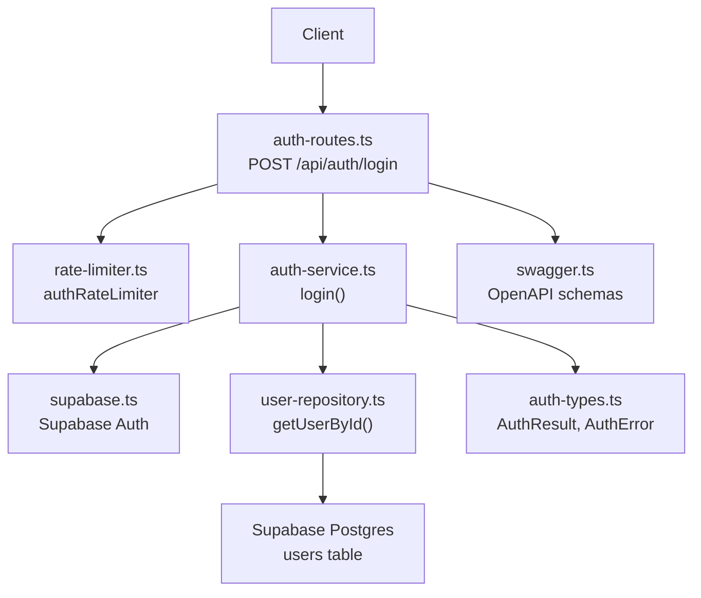
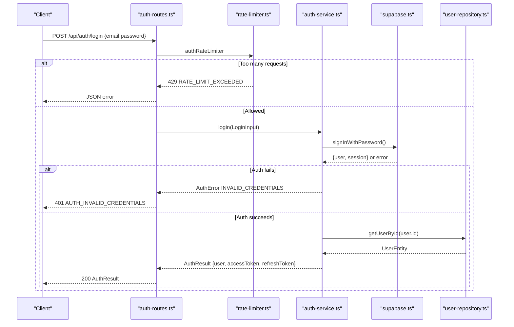
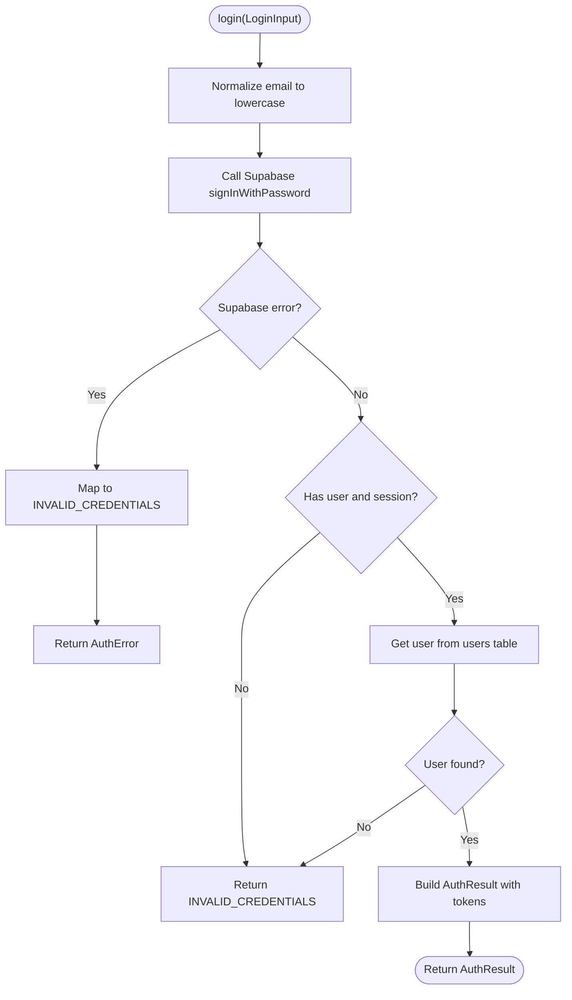
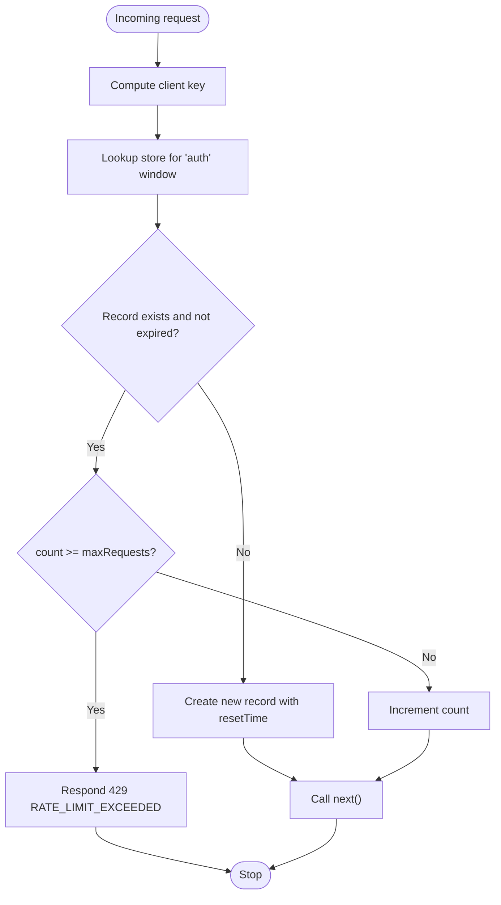
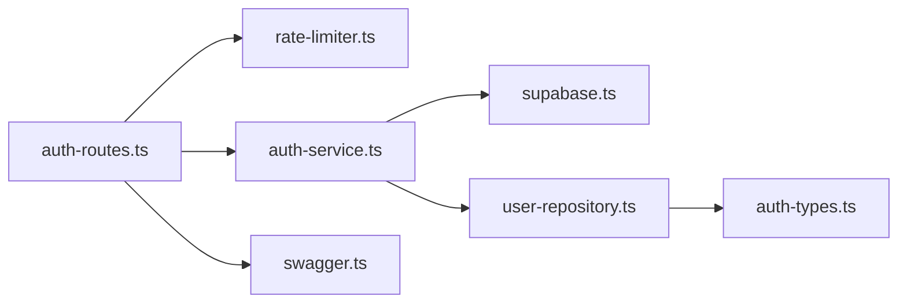

# User Login

<cite>
**Referenced Files in This Document**
- [auth-routes.ts](file://src/routes/auth-routes.ts)
- [auth-service.ts](file://src/services/auth-service.ts)
- [rate-limiter.ts](file://src/middleware/rate-limiter.ts)
- [auth-types.ts](file://src/services/auth-types.ts)
- [user-repository.ts](file://src/repositories/user-repository.ts)
- [user.ts](file://src/models/user.ts)
- [supabase.ts](file://src/config/supabase.ts)
- [swagger.ts](file://src/config/swagger.ts)
</cite>

## Table of Contents
1. [Introduction](#introduction)
2. [Project Structure](#project-structure)
3. [Core Components](#core-components)
4. [Architecture Overview](#architecture-overview)
5. [Detailed Component Analysis](#detailed-component-analysis)
6. [Dependency Analysis](#dependency-analysis)
7. [Performance Considerations](#performance-considerations)
8. [Troubleshooting Guide](#troubleshooting-guide)
9. [Conclusion](#conclusion)

## Introduction
This document provides comprehensive API documentation for the POST /api/auth/login endpoint in the FreelanceXchain system. It covers the LoginInput schema, authentication flow, credential validation, JWT token generation, response format, error handling, and security measures including the authRateLimiter middleware. It also explains how the auth-routes.ts integration works with the login function in auth-service.ts and how the system validates credentials against Supabase authentication while maintaining application-specific user data and roles.

## Project Structure
The login endpoint is implemented as part of the authentication module:
- Route handler: src/routes/auth-routes.ts
- Business logic: src/services/auth-service.ts
- Rate limiting: src/middleware/rate-limiter.ts
- Types: src/services/auth-types.ts
- Data access: src/repositories/user-repository.ts
- User model: src/models/user.ts
- Supabase client: src/config/supabase.ts
- OpenAPI/Swagger definitions: src/config/swagger.ts

**Diagram sources**
- [auth-routes.ts](file://src/routes/auth-routes.ts#L272-L315)
- [rate-limiter.ts](file://src/middleware/rate-limiter.ts#L63-L68)
- [auth-service.ts](file://src/services/auth-service.ts#L157-L201)
- [user-repository.ts](file://src/repositories/user-repository.ts#L24-L41)
- [supabase.ts](file://src/config/supabase.ts#L25-L33)
- [auth-types.ts](file://src/services/auth-types.ts#L11-L49)
- [swagger.ts](file://src/config/swagger.ts#L1-L233)

**Section sources**
- [auth-routes.ts](file://src/routes/auth-routes.ts#L272-L315)
- [rate-limiter.ts](file://src/middleware/rate-limiter.ts#L63-L68)
- [auth-service.ts](file://src/services/auth-service.ts#L157-L201)
- [user-repository.ts](file://src/repositories/user-repository.ts#L24-L41)
- [supabase.ts](file://src/config/supabase.ts#L25-L33)
- [auth-types.ts](file://src/services/auth-types.ts#L11-L49)
- [swagger.ts](file://src/config/swagger.ts#L1-L233)

## Core Components
- Endpoint: POST /api/auth/login
- Request body: LoginInput schema with required fields email and password
- Response: AuthResult with user data, accessToken, and refreshToken
- Error responses: 400 for validation errors, 401 for invalid credentials
- Security: authRateLimiter middleware enforces rate limits to prevent brute force attacks
- Integration: Route handler delegates to auth-service.login; service validates against Supabase Auth and enriches with application user data

**Section sources**
- [auth-routes.ts](file://src/routes/auth-routes.ts#L272-L315)
- [auth-types.ts](file://src/services/auth-types.ts#L11-L33)
- [rate-limiter.ts](file://src/middleware/rate-limiter.ts#L63-L68)
- [auth-service.ts](file://src/services/auth-service.ts#L157-L201)

## Architecture Overview
The login flow integrates route validation, rate limiting, Supabase authentication, and application user data retrieval.

**Diagram sources**
- [auth-routes.ts](file://src/routes/auth-routes.ts#L272-L315)
- [rate-limiter.ts](file://src/middleware/rate-limiter.ts#L27-L61)
- [auth-service.ts](file://src/services/auth-service.ts#L157-L201)
- [user-repository.ts](file://src/repositories/user-repository.ts#L24-L41)
- [supabase.ts](file://src/config/supabase.ts#L25-L33)

## Detailed Component Analysis

### API Definition: POST /api/auth/login
- Method: POST
- Path: /api/auth/login
- Tags: Authentication
- Request body: LoginInput
  - email: string, required
  - password: string, required
- Responses:
  - 200 OK: AuthResult
  - 400 Bad Request: Validation error
  - 401 Unauthorized: Invalid credentials
  - 429 Too Many Requests: Rate limit exceeded

OpenAPI/Swagger schema definitions:
- LoginInput: required fields email and password
- AuthResult: user object with id, email, role, walletAddress, createdAt; accessToken, refreshToken
- AuthError: standardized error envelope with code and message

**Section sources**
- [auth-routes.ts](file://src/routes/auth-routes.ts#L238-L271)
- [auth-routes.ts](file://src/routes/auth-routes.ts#L272-L315)
- [auth-types.ts](file://src/services/auth-types.ts#L11-L33)
- [swagger.ts](file://src/config/swagger.ts#L1-L233)

### Route Handler Behavior
- Input validation: checks email format and presence of password
- Error handling: returns 400 with VALIDATION_ERROR when validation fails
- Rate limiting: applies authRateLimiter before invoking login
- Success path: returns 200 with AuthResult
- Failure path: returns 401 with AUTH_INVALID_CREDENTIALS

**Section sources**
- [auth-routes.ts](file://src/routes/auth-routes.ts#L272-L315)
- [rate-limiter.ts](file://src/middleware/rate-limiter.ts#L63-L68)

### Service Layer: login()
- Normalizes email to lowercase
- Calls Supabase Auth signInWithPassword
- Handles Supabase errors:
  - Email not confirmed -> INVALID_CREDENTIALS
  - Other auth failures -> INVALID_CREDENTIALS
- Retrieves application user data from Supabase Postgres users table via user-repository
- Constructs AuthResult with accessToken and refreshToken from Supabase session

**Diagram sources**
- [auth-service.ts](file://src/services/auth-service.ts#L157-L201)
- [user-repository.ts](file://src/repositories/user-repository.ts#L24-L41)

**Section sources**
- [auth-service.ts](file://src/services/auth-service.ts#L157-L201)
- [user-repository.ts](file://src/repositories/user-repository.ts#L24-L41)

### Data Model: AuthResult and AuthError
- AuthResult:
  - user: id, email, role, walletAddress, createdAt
  - accessToken: string
  - refreshToken: string
- AuthError:
  - code: one of DUPLICATE_EMAIL, INVALID_CREDENTIALS, TOKEN_EXPIRED, INVALID_TOKEN, AUTH_EXCHANGE_FAILED, AUTH_INVALID_TOKEN, AUTH_INVALID_CREDENTIALS, AUTH_REQUIRE_REGISTRATION, VALIDATION_ERROR, INTERNAL_ERROR
  - message: string

These types define the response contract for successful logins and error scenarios.

**Section sources**
- [auth-types.ts](file://src/services/auth-types.ts#L23-L49)

### Middleware: authRateLimiter
- Enforces a sliding window policy:
  - Window: 15 minutes
  - Max requests: 10 attempts
- On limit exceeded:
  - Returns 429 with RATE_LIMIT_EXCEEDED
  - Sets Retry-After header
- Uses client IP (with support for X-Forwarded-For) as the key

**Diagram sources**
- [rate-limiter.ts](file://src/middleware/rate-limiter.ts#L27-L61)

**Section sources**
- [rate-limiter.ts](file://src/middleware/rate-limiter.ts#L27-L61)
- [rate-limiter.ts](file://src/middleware/rate-limiter.ts#L63-L68)

### Supabase Integration and Application User Data
- Supabase Auth manages email/password credentials and sessions
- Application user data (role, walletAddress, timestamps) is stored in Supabase Postgres users table
- After successful Supabase login, the service retrieves the application user record and returns it alongside tokens
- This ensures:
  - Strong credential validation via Supabase
  - Application-specific roles and metadata remain synchronized

**Section sources**
- [auth-service.ts](file://src/services/auth-service.ts#L157-L201)
- [user-repository.ts](file://src/repositories/user-repository.ts#L24-L41)
- [supabase.ts](file://src/config/supabase.ts#L25-L33)

### Error Handling and Codes
- Validation errors (400):
  - VALIDATION_ERROR with details array
- Authentication errors (401):
  - AUTH_INVALID_CREDENTIALS for invalid email/password
  - INVALID_CREDENTIALS for Supabase-level failures (e.g., unconfirmed email)
- Rate limiting (429):
  - RATE_LIMIT_EXCEEDED with Retry-After

**Section sources**
- [auth-routes.ts](file://src/routes/auth-routes.ts#L272-L315)
- [auth-service.ts](file://src/services/auth-service.ts#L157-L201)
- [rate-limiter.ts](file://src/middleware/rate-limiter.ts#L27-L61)

### Example Requests and Responses
- Successful login request:
  - POST /api/auth/login
  - Body: { "email": "<user@example.com>", "password": "<securePassword>" }
  - Response: 200 OK with AuthResult containing user, accessToken, refreshToken
- Validation error response (400):
  - Body: { "error": { "code": "VALIDATION_ERROR", "message": "Invalid request data", "details": [ { "field": "email", "message": "Valid email is required" } ] }, "timestamp": "...", "requestId": "..." }
- Invalid credentials response (401):
  - Body: { "error": { "code": "AUTH_INVALID_CREDENTIALS", "message": "Invalid email or password" }, "timestamp": "...", "requestId": "..." }
- Rate limit exceeded response (429):
  - Body: { "error": { "code": "RATE_LIMIT_EXCEEDED", "message": "Too many authentication attempts, please try again later" }, "retryAfter": 900, "timestamp": "...", "requestId": "..." }

Note: These examples illustrate the structure and codes. See the referenced files for exact field names and shapes.

**Section sources**
- [auth-routes.ts](file://src/routes/auth-routes.ts#L272-L315)
- [auth-types.ts](file://src/services/auth-types.ts#L23-L49)
- [rate-limiter.ts](file://src/middleware/rate-limiter.ts#L27-L61)

## Dependency Analysis
The login endpoint depends on:
- Route handler for request parsing and response formatting
- Rate limiter for security
- Service layer for business logic and external integrations
- Supabase client for authentication
- Repository for application user data

**Diagram sources**
- [auth-routes.ts](file://src/routes/auth-routes.ts#L272-L315)
- [rate-limiter.ts](file://src/middleware/rate-limiter.ts#L63-L68)
- [auth-service.ts](file://src/services/auth-service.ts#L157-L201)
- [user-repository.ts](file://src/repositories/user-repository.ts#L24-L41)
- [supabase.ts](file://src/config/supabase.ts#L25-L33)
- [auth-types.ts](file://src/services/auth-types.ts#L11-L33)
- [swagger.ts](file://src/config/swagger.ts#L1-L233)

**Section sources**
- [auth-routes.ts](file://src/routes/auth-routes.ts#L272-L315)
- [rate-limiter.ts](file://src/middleware/rate-limiter.ts#L63-L68)
- [auth-service.ts](file://src/services/auth-service.ts#L157-L201)
- [user-repository.ts](file://src/repositories/user-repository.ts#L24-L41)
- [supabase.ts](file://src/config/supabase.ts#L25-L33)
- [auth-types.ts](file://src/services/auth-types.ts#L11-L33)
- [swagger.ts](file://src/config/swagger.ts#L1-L233)

## Performance Considerations
- Supabase calls incur network latency; keep payloads minimal
- Rate limiting reduces load during brute force attempts
- Consider caching user roles and metadata for subsequent requests if appropriate
- Monitor Supabase rate limits and adjust authRateLimiter as needed

[No sources needed since this section provides general guidance]

## Troubleshooting Guide
Common issues and resolutions:
- 400 Validation Error:
  - Ensure email is present and valid; ensure password is present
  - Check for typos in field names
- 401 Invalid Credentials:
  - Verify email and password are correct
  - Confirm email is verified in Supabase
  - Check that the user exists in the application users table
- 429 Rate Limit Exceeded:
  - Wait until the window resets (Retry-After seconds)
  - Reduce login attempts or adjust client-side retry logic
- Internal errors:
  - Inspect Supabase connectivity and configuration
  - Verify JWT secret and expiration settings

**Section sources**
- [auth-routes.ts](file://src/routes/auth-routes.ts#L272-L315)
- [auth-service.ts](file://src/services/auth-service.ts#L157-L201)
- [rate-limiter.ts](file://src/middleware/rate-limiter.ts#L27-L61)
- [supabase.ts](file://src/config/supabase.ts#L25-L33)

## Conclusion
The POST /api/auth/login endpoint provides a secure, validated authentication flow that leverages Supabase for credential management while preserving application-specific user data and roles. The route handler performs input validation and applies rate limiting, while the service layer coordinates with Supabase Auth and the application user repository to produce a standardized AuthResult. Clear error responses and rate limiting protect the system from abuse and provide predictable client experiences.