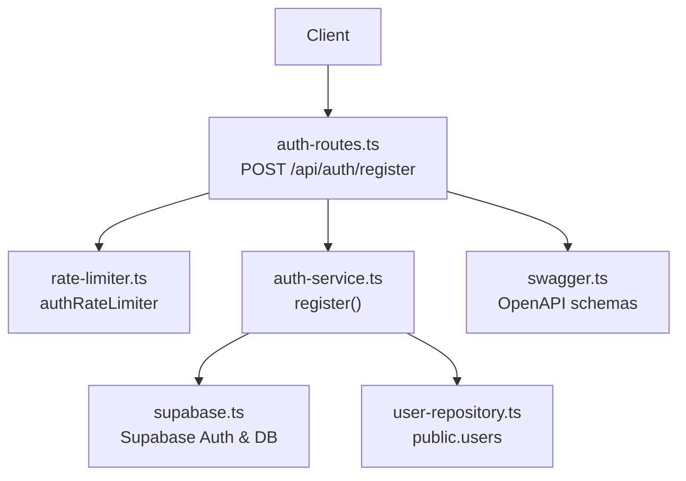
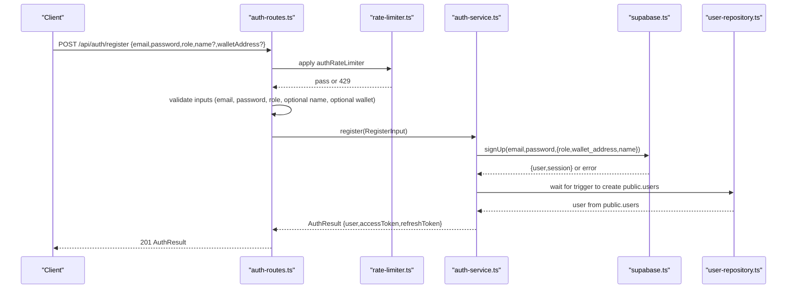
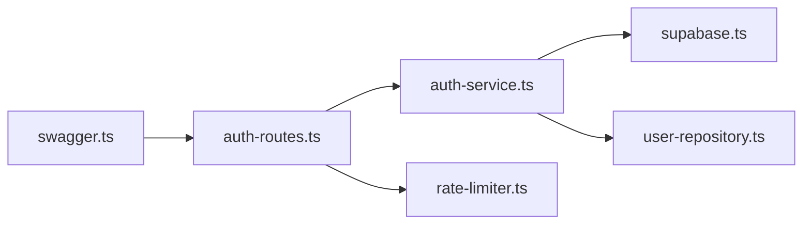

# User Registration

<cite>
**Referenced Files in This Document**
- [auth-routes.ts](file://src/routes/auth-routes.ts)
- [auth-service.ts](file://src/services/auth-service.ts)
- [auth-types.ts](file://src/services/auth-types.ts)
- [rate-limiter.ts](file://src/middleware/rate-limiter.ts)
- [user-repository.ts](file://src/repositories/user-repository.ts)
- [supabase.ts](file://src/config/supabase.ts)
- [swagger.ts](file://src/config/swagger.ts)
- [API-DOCUMENTATION.md](file://docs/API-DOCUMENTATION.md)
</cite>

## Table of Contents
1. [Introduction](#introduction)
2. [Project Structure](#project-structure)
3. [Core Components](#core-components)
4. [Architecture Overview](#architecture-overview)
5. [Detailed Component Analysis](#detailed-component-analysis)
6. [Dependency Analysis](#dependency-analysis)
7. [Performance Considerations](#performance-considerations)
8. [Troubleshooting Guide](#troubleshooting-guide)
9. [Conclusion](#conclusion)

## Introduction
This document provides comprehensive API documentation for the user registration endpoint in the FreelanceXchain system. It covers the POST /api/auth/register endpoint, including request body schema, validation rules, success and error responses, and the interaction between the route handler and the authentication service. It also explains how the authRateLimiter middleware protects against abuse and how Supabase handles initial OAuth user creation before role assignment.

## Project Structure
The registration flow spans several layers:
- Route handler: validates inputs, applies rate limiting, and delegates to the service layer
- Service layer: orchestrates Supabase Auth and database operations
- Repository layer: interacts with the Supabase Postgres users table
- Middleware: enforces rate limits and request validation
- Configuration: Supabase client initialization and Swagger/OpenAPI definitions

**Diagram sources**
- [auth-routes.ts](file://src/routes/auth-routes.ts#L160-L235)
- [rate-limiter.ts](file://src/middleware/rate-limiter.ts#L64-L68)
- [auth-service.ts](file://src/services/auth-service.ts#L68-L155)
- [user-repository.ts](file://src/repositories/user-repository.ts#L1-L58)
- [supabase.ts](file://src/config/supabase.ts#L25-L33)
- [swagger.ts](file://src/config/swagger.ts#L1-L233)

**Section sources**
- [auth-routes.ts](file://src/routes/auth-routes.ts#L160-L235)
- [rate-limiter.ts](file://src/middleware/rate-limiter.ts#L64-L68)
- [auth-service.ts](file://src/services/auth-service.ts#L68-L155)
- [user-repository.ts](file://src/repositories/user-repository.ts#L1-L58)
- [supabase.ts](file://src/config/supabase.ts#L25-L33)
- [swagger.ts](file://src/config/swagger.ts#L1-L233)

## Core Components
- Endpoint: POST /api/auth/register
- Purpose: Create a new user account with email/password, assign role, and optionally set name and wallet address
- Success response: 201 with AuthResult schema
- Error responses: 400 for validation errors, 409 for duplicate email
- Rate limiting: authRateLimiter configured for 10 requests per 15 minutes

**Section sources**
- [auth-routes.ts](file://src/routes/auth-routes.ts#L126-L159)
- [auth-routes.ts](file://src/routes/auth-routes.ts#L160-L235)
- [rate-limiter.ts](file://src/middleware/rate-limiter.ts#L64-L68)
- [API-DOCUMENTATION.md](file://docs/API-DOCUMENTATION.md#L613-L642)

## Architecture Overview
The registration flow integrates Supabase Auth for identity and the application’s database for user profiles. The route handler performs input validation and rate limiting, then calls the service layer to register the user. The service layer registers with Supabase Auth, waits for the database trigger to populate public.users, and returns an AuthResult with tokens.

**Diagram sources**
- [auth-routes.ts](file://src/routes/auth-routes.ts#L160-L235)
- [rate-limiter.ts](file://src/middleware/rate-limiter.ts#L64-L68)
- [auth-service.ts](file://src/services/auth-service.ts#L68-L155)
- [user-repository.ts](file://src/repositories/user-repository.ts#L1-L58)
- [supabase.ts](file://src/config/supabase.ts#L25-L33)

## Detailed Component Analysis

### Endpoint Definition and OpenAPI Schema
- Endpoint: POST /api/auth/register
- Tags: Authentication
- Request body schema: RegisterInput
  - email: string, format: email, required
  - password: string, min length 8, required
  - role: string, enum: freelancer, employer, required
  - name: string, min length 2, optional
  - walletAddress: string, pattern 0x[a-fA-F0-9]{40}, optional
- Responses:
  - 201: AuthResult
  - 400: AuthError (validation errors)
  - 409: AuthError (duplicate email)

**Section sources**
- [auth-routes.ts](file://src/routes/auth-routes.ts#L26-L115)
- [auth-routes.ts](file://src/routes/auth-routes.ts#L126-L159)
- [swagger.ts](file://src/config/swagger.ts#L1-L233)

### Request Validation Rules
- Email validation:
  - Format: email
  - Length: minimum 5 characters
- Password validation:
  - Minimum length: 8 characters
  - Requirements enforced by validatePasswordStrength:
    - At least one lowercase letter
    - At least one uppercase letter
    - At least one digit
    - At least one special character from [@ $ ! % * ? &]
- Role validation:
  - Enumerated values: freelancer, employer
- Optional name validation:
  - If provided, minimum length: 2 characters
- Optional wallet address validation:
  - Pattern: 0x followed by exactly 40 hexadecimal characters

These rules are enforced both in the route handler and in the service layer.

**Section sources**
- [auth-routes.ts](file://src/routes/auth-routes.ts#L160-L235)
- [auth-service.ts](file://src/services/auth-service.ts#L21-L48)

### Success Response: AuthResult
On successful registration, the endpoint returns:
- HTTP 201 Created
- Body: AuthResult
  - user: {
      - id: string
      - email: string
      - role: string (freelancer, employer, admin)
      - walletAddress: string
      - createdAt: string (ISO 8601)
    }
  - accessToken: string
  - refreshToken: string

The service constructs AuthResult from the Supabase user and session, and from the public.users row.

**Section sources**
- [auth-routes.ts](file://src/routes/auth-routes.ts#L126-L159)
- [auth-service.ts](file://src/services/auth-service.ts#L50-L62)
- [auth-types.ts](file://src/services/auth-types.ts#L23-L33)

### Error Responses
- 400 Bad Request:
  - Validation errors: includes details array with field and message
  - Example codes: VALIDATION_ERROR
- 409 Conflict:
  - Duplicate email encountered
  - Code: DUPLICATE_EMAIL

The route handler translates service errors into appropriate HTTP status codes.

**Section sources**
- [auth-routes.ts](file://src/routes/auth-routes.ts#L200-L235)
- [auth-service.ts](file://src/services/auth-service.ts#L72-L105)
- [API-DOCUMENTATION.md](file://docs/API-DOCUMENTATION.md#L634-L641)

### Rate Limiting: authRateLimiter
- Window: 15 minutes
- Max requests: 10 per client IP
- Behavior: Returns 429 Too Many Requests with Retry-After header and RATE_LIMIT_EXCEEDED error

The middleware uses X-Forwarded-For when present, otherwise falls back to req.ip.

**Section sources**
- [rate-limiter.ts](file://src/middleware/rate-limiter.ts#L1-L81)

### Interaction Between auth-routes.ts and registerWithSupabase
- The route handler calls register(RegisterInput) in auth-service.ts
- registerWithSupabase is used for OAuth registration (separate endpoint)
- For email/password registration, the route handler calls register, which internally:
  - Normalizes email
  - Checks for duplicate email in public.users
  - Calls Supabase Auth signUp with role, wallet_address, and name in user options
  - Waits briefly for trigger to create public.users
  - Returns AuthResult with tokens

**Section sources**
- [auth-routes.ts](file://src/routes/auth-routes.ts#L160-L235)
- [auth-service.ts](file://src/services/auth-service.ts#L68-L155)

### Supabase OAuth User Creation and Role Assignment
- Initial OAuth flow:
  - getOAuthUrl redirects to provider
  - exchangeCodeForSession exchanges authorization code for tokens
  - loginWithSupabase validates access token and checks if a public.users record exists
  - If not found, returns AUTH_REQUIRE_REGISTRATION indicating role selection is required
- OAuth registration:
  - /api/auth/oauth/register accepts accessToken, role, optional name, optional walletAddress
  - registerWithSupabase updates user metadata in Supabase Auth and creates a record in public.users
  - Returns AuthResult with tokens

This separation ensures that Supabase creates the user record first, then the application assigns role and profile attributes.

**Section sources**
- [auth-routes.ts](file://src/routes/auth-routes.ts#L416-L473)
- [auth-routes.ts](file://src/routes/auth-routes.ts#L639-L753)
- [auth-service.ts](file://src/services/auth-service.ts#L261-L402)

### Wallet Address Pattern
- Pattern: 0x[a-fA-F0-9]{40}
- Matches Ethereum-style addresses with leading 0x and exactly 40 hex digits
- Enforced both in route-level validation and Swagger schema

**Section sources**
- [auth-routes.ts](file://src/routes/auth-routes.ts#L192-L196)
- [swagger.ts](file://src/config/swagger.ts#L1-L233)

## Dependency Analysis
The registration flow depends on:
- Supabase client for Auth operations and database access
- User repository for database interactions
- Rate limiter middleware for abuse protection
- Swagger/OpenAPI for schema definitions

**Diagram sources**
- [auth-routes.ts](file://src/routes/auth-routes.ts#L160-L235)
- [rate-limiter.ts](file://src/middleware/rate-limiter.ts#L64-L68)
- [auth-service.ts](file://src/services/auth-service.ts#L68-L155)
- [user-repository.ts](file://src/repositories/user-repository.ts#L1-L58)
- [supabase.ts](file://src/config/supabase.ts#L25-L33)
- [swagger.ts](file://src/config/swagger.ts#L1-L233)

**Section sources**
- [auth-routes.ts](file://src/routes/auth-routes.ts#L160-L235)
- [auth-service.ts](file://src/services/auth-service.ts#L68-L155)
- [user-repository.ts](file://src/repositories/user-repository.ts#L1-L58)
- [supabase.ts](file://src/config/supabase.ts#L25-L33)
- [swagger.ts](file://src/config/swagger.ts#L1-L233)

## Performance Considerations
- Input validation occurs in-memory before hitting Supabase, reducing unnecessary network calls
- The service waits briefly for a database trigger to populate public.users; this introduces a small latency but ensures consistency
- Rate limiting prevents brute-force attempts and protects downstream systems

[No sources needed since this section provides general guidance]

## Troubleshooting Guide
Common issues and resolutions:
- Validation failures (400):
  - Ensure email matches format and length requirements
  - Ensure password meets minimum length and complexity requirements
  - Ensure role is one of freelancer or employer
  - If name is provided, ensure minimum length of 2 characters
  - If walletAddress is provided, ensure it matches 0x followed by 40 hex characters
- Duplicate email (409):
  - Another user already registered with the same normalized email
  - Ask the user to log in or use a different email
- Rate limit exceeded (429):
  - Exceeded 10 requests in 15 minutes; wait for Retry-After seconds before retrying
- Internal errors:
  - Occur when Supabase operations fail; check logs and environment variables for Supabase configuration

**Section sources**
- [auth-routes.ts](file://src/routes/auth-routes.ts#L160-L235)
- [auth-service.ts](file://src/services/auth-service.ts#L72-L105)
- [rate-limiter.ts](file://src/middleware/rate-limiter.ts#L44-L55)
- [supabase.ts](file://src/config/supabase.ts#L25-L33)

## Conclusion
The POST /api/auth/register endpoint provides a robust, validated, and rate-limited pathway to create new user accounts. It integrates tightly with Supabase Auth for identity while persisting user profiles in the application database. The endpoint returns a standardized AuthResult on success and clearly defined error responses for validation and conflict scenarios. The authRateLimiter helps protect the system from abuse, and the separation of concerns across route, service, and repository layers keeps the code maintainable and testable.