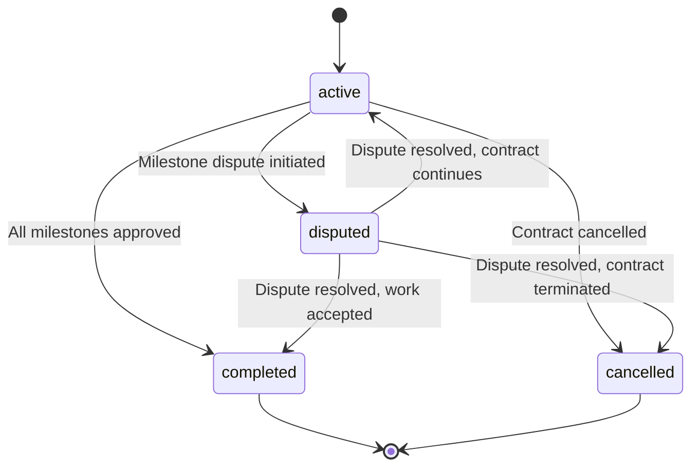
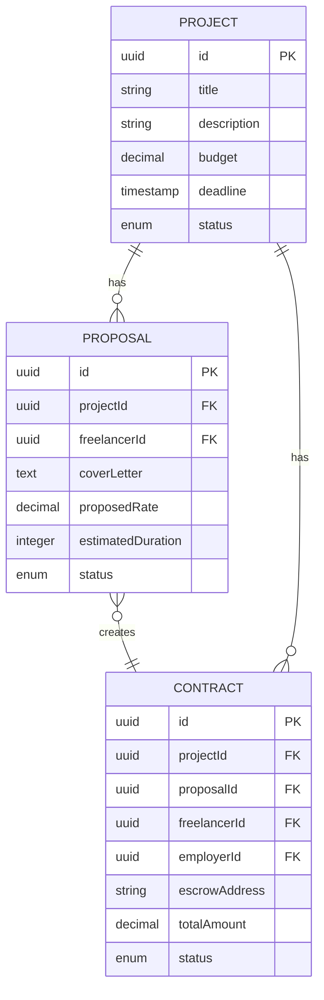
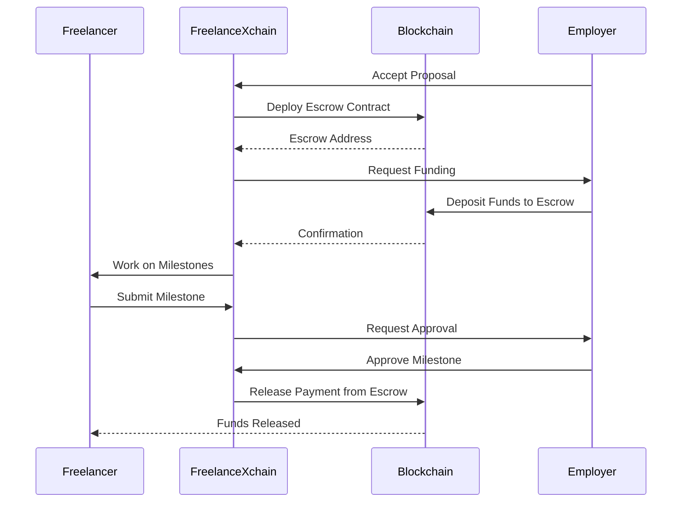

# Contract API

<cite>
**Referenced Files in This Document**   
- [contract-routes.ts](file://src/routes/contract-routes.ts)
- [contract-service.ts](file://src/services/contract-service.ts)
- [contract-repository.ts](file://src/repositories/contract-repository.ts)
- [entity-mapper.ts](file://src/utils/entity-mapper.ts)
- [proposal-service.ts](file://src/services/proposal-service.ts)
- [escrow-contract.ts](file://src/services/escrow-contract.ts)
- [schema.sql](file://supabase/schema.sql)
</cite>

## Table of Contents
1. [Introduction](#introduction)
2. [API Endpoints](#api-endpoints)
3. [Contract Schema](#contract-schema)
4. [Contract Status Lifecycle](#contract-status-lifecycle)
5. [Relationships Between Contracts, Proposals, and Projects](#relationships-between-contracts-proposals-and-projects)
6. [Blockchain Escrow Integration](#blockchain-escrow-integration)
7. [Client Implementation Examples](#client-implementation-examples)
8. [Error Handling](#error-handling)

## Introduction
The Contract API provides read-only access to contract data within the FreelanceXchain system. Contracts are created when a proposal is accepted and represent formal agreements between freelancers and employers for project work. This API allows users to retrieve their contract history and view detailed contract information. All endpoints require JWT authentication and are designed to be read-only, with contract creation handled through the proposal acceptance workflow.

**Section sources**
- [contract-routes.ts](file://src/routes/contract-routes.ts#L1-L170)

## API Endpoints

### List User Contracts
Retrieves all contracts for the authenticated user (as either freelancer or employer).

**HTTP Method**: GET  
**URL Pattern**: `/api/contracts`  
**Authentication**: JWT (Bearer token)  
**Parameters**:
- `limit` (integer, optional): Number of results per page (default: 20)
- `continuationToken` (string, optional): Token for pagination

**Response**:
```json
{
  "items": [
    {
      "id": "string",
      "projectId": "string",
      "proposalId": "string",
      "freelancerId": "string",
      "employerId": "string",
      "escrowAddress": "string",
      "totalAmount": number,
      "status": "active",
      "createdAt": "string",
      "updatedAt": "string"
    }
  ],
  "hasMore": boolean,
  "continuationToken": "string"
}
```

**Status Codes**:
- 200: Contracts retrieved successfully
- 401: Unauthorized (missing or invalid JWT)

**Section sources**
- [contract-routes.ts](file://src/routes/contract-routes.ts#L43-L83)

### Get Contract Details
Retrieves details of a specific contract.

**HTTP Method**: GET  
**URL Pattern**: `/api/contracts/{id}`  
**Authentication**: JWT (Bearer token)  
**Path Parameters**:
- `id` (string, required): Contract ID (UUID)

**Response**:
```json
{
  "id": "string",
  "projectId": "string",
  "proposalId": "string",
  "freelancerId": "string",
  "employerId": "string",
  "escrowAddress": "string",
  "totalAmount": number,
  "status": "active",
  "createdAt": "string",
  "updatedAt": "string"
}
```

**Status Codes**:
- 200: Contract retrieved successfully
- 400: Invalid UUID format
- 401: Unauthorized (missing or invalid JWT)
- 404: Contract not found

**Section sources**
- [contract-routes.ts](file://src/routes/contract-routes.ts#L119-L150)

## Contract Schema
The contract object represents a formal agreement between a freelancer and employer for project work. Contracts are created when a proposal is accepted and contain references to the associated project, proposal, and parties involved.

```json
{
  "id": "string",
  "projectId": "string",
  "proposalId": "string",
  "freelancerId": "string",
  "employerId": "string",
  "escrowAddress": "string",
  "totalAmount": number,
  "status": "active",
  "createdAt": "string",
  "updatedAt": "string"
}
```

**Field Descriptions**:
- `id`: Unique identifier for the contract (UUID)
- `projectId`: Reference to the associated project
- `proposalId`: Reference to the accepted proposal that created this contract
- `freelancerId`: ID of the freelancer party
- `employerId`: ID of the employer party
- `escrowAddress`: Blockchain address of the escrow contract holding funds
- `totalAmount`: Total contract value in ETH
- `status`: Current status of the contract (active, completed, disputed, cancelled)
- `createdAt`: Timestamp when the contract was created
- `updatedAt`: Timestamp when the contract was last updated

**Section sources**
- [entity-mapper.ts](file://src/utils/entity-mapper.ts#L284-L295)
- [schema.sql](file://supabase/schema.sql#L94-L106)

## Contract Status Lifecycle
Contracts progress through a defined status lifecycle that governs their state transitions. The valid statuses are: `active`, `completed`, `disputed`, and `cancelled`.



**State Transition Rules**:
- From `active`: Can transition to `completed`, `disputed`, or `cancelled`
- From `disputed`: Can transition to `active`, `completed`, or `cancelled`
- From `completed`: No further transitions allowed
- From `cancelled`: No further transitions allowed

**Section sources**
- [contract-service.ts](file://src/services/contract-service.ts#L77-L82)
- [schema.sql](file://supabase/schema.sql#L103)

## Relationships Between Contracts, Proposals, and Projects
Contracts are created through a workflow that begins with project creation, followed by proposal submission, and finalized by proposal acceptance. This creates a hierarchical relationship between these entities.



**Workflow**:
1. Employer creates a project
2. Freelancer submits a proposal for the project
3. Employer accepts the proposal
4. System automatically creates a contract linked to the project and accepted proposal
5. Contract status is set to `active` and escrow is established

**Section sources**
- [proposal-service.ts](file://src/services/proposal-service.ts#L225-L235)
- [schema.sql](file://supabase/schema.sql#L64-L106)

## Blockchain Escrow Integration
Each contract is linked to a blockchain escrow address where funds are held securely. The escrow contract manages fund release according to milestone completion.



**Key Points**:
- Escrow address is stored in the contract's `escrowAddress` field
- Funds are deposited by the employer to the escrow address
- Payments are released to the freelancer upon milestone approval
- The escrow contract ensures funds are only released according to agreed terms

**Section sources**
- [escrow-contract.ts](file://src/services/escrow-contract.ts#L38-L83)
- [contract-service.ts](file://src/services/contract-service.ts#L105-L126)

## Client Implementation Examples

### Retrieve User's Contract History
```javascript
// Example using fetch API
async function getUserContracts(limit = 20, continuationToken = null) {
  const url = new URL('/api/contracts', API_BASE_URL);
  if (limit) url.searchParams.append('limit', limit);
  if (continuationToken) url.searchParams.append('continuationToken', continuationToken);

  const response = await fetch(url, {
    method: 'GET',
    headers: {
      'Authorization': `Bearer ${jwtToken}`,
      'Content-Type': 'application/json'
    }
  });

  if (!response.ok) {
    throw new Error(`HTTP error! status: ${response.status}`);
  }

  return await response.json();
}

// Usage
const contractsData = await getUserContracts(10);
console.log('Contracts:', contractsData.items);
console.log('Has more:', contractsData.hasMore);
```

### Display Specific Contract Details
```javascript
// Example using async/await
async function getContractDetails(contractId) {
  const response = await fetch(`/api/contracts/${contractId}`, {
    method: 'GET',
    headers: {
      'Authorization': `Bearer ${jwtToken}`,
      'Content-Type': 'application/json'
    }
  });

  if (!response.ok) {
    if (response.status === 404) {
      throw new Error('Contract not found');
    }
    throw new Error(`Failed to fetch contract: ${response.status}`);
  }

  return await response.json();
}

// Usage
try {
  const contract = await getContractDetails('a1b2c3d4-e5f6-7890-g1h2-i3j4k5l6m7n8');
  displayContract(contract);
} catch (error) {
  console.error('Error fetching contract:', error.message);
}
```

**Section sources**
- [contract-routes.ts](file://src/routes/contract-routes.ts#L84-L167)

## Error Handling
The Contract API follows a consistent error response format for all endpoints.

**Error Response Format**:
```json
{
  "error": {
    "code": "string",
    "message": "string"
  },
  "timestamp": "string",
  "requestId": "string"
}
```

**Common Error Codes**:
- `AUTH_UNAUTHORIZED`: User not authenticated (401)
- `NOT_FOUND`: Contract not found (404)
- `INVALID_UUID_FORMAT`: Invalid UUID format (400)

All error responses include a timestamp and request ID for debugging purposes.

**Section sources**
- [contract-routes.ts](file://src/routes/contract-routes.ts#L90-L95)
- [contract-routes.ts](file://src/routes/contract-routes.ts#L157-L162)