# Dispute API

<cite>
**Referenced Files in This Document**
- [dispute-routes.ts](file://src/routes/dispute-routes.ts)
- [dispute-service.ts](file://src/services/dispute-service.ts)
- [dispute-repository.ts](file://src/repositories/dispute-repository.ts)
- [entity-mapper.ts](file://src/utils/entity-mapper.ts)
- [auth-middleware.ts](file://src/middleware/auth-middleware.ts)
- [validation-middleware.ts](file://src/middleware/validation-middleware.ts)
- [dispute-registry.ts](file://src/services/dispute-registry.ts)
- [API-DOCUMENTATION.md](file://docs/API-DOCUMENTATION.md)
- [swagger.ts](file://src/config/swagger.ts)
</cite>

## Table of Contents
1. [Introduction](#introduction)
2. [Project Structure](#project-structure)
3. [Core Components](#core-components)
4. [Architecture Overview](#architecture-overview)
5. [Detailed Component Analysis](#detailed-component-analysis)
6. [Dependency Analysis](#dependency-analysis)
7. [Performance Considerations](#performance-considerations)
8. [Troubleshooting Guide](#troubleshooting-guide)
9. [Conclusion](#conclusion)
10. [Appendices](#appendices)

## Introduction
This document provides comprehensive API documentation for the dispute resolution system in the FreelanceXchain platform. It covers all dispute-related endpoints: creating disputes, submitting evidence, resolving disputes, and retrieving dispute information. It also documents authentication requirements (JWT), validation rules, role-based access controls, the dispute status lifecycle, and blockchain recording of outcomes. Client implementation examples are included to help developers integrate dispute workflows.

## Project Structure
The dispute functionality spans routing, service orchestration, persistence, and blockchain integration layers. The routes define the HTTP endpoints and apply middleware for authentication and validation. The service layer enforces business rules, interacts with repositories, and triggers blockchain operations. The repository layer abstracts database access. The entity mapper converts between database entities and API models. The validation middleware ensures request payloads conform to schemas.

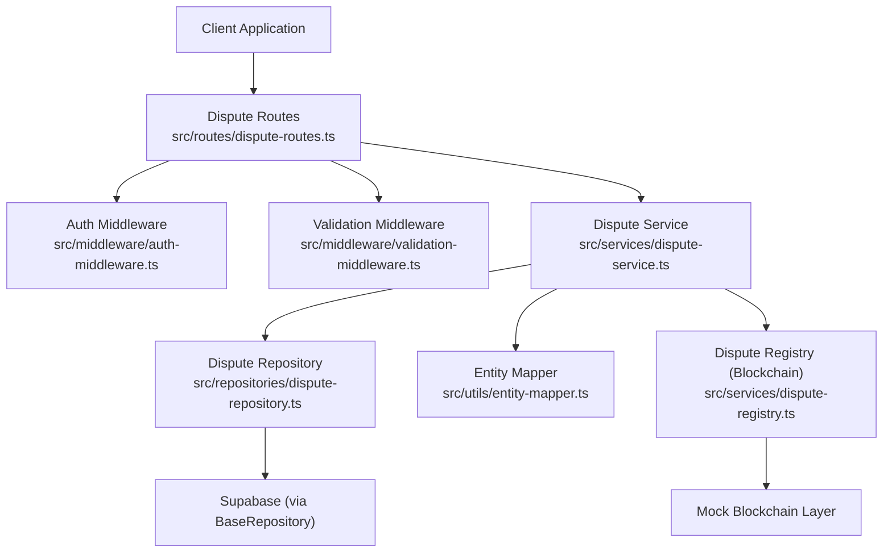
```mermaid
graph TB
Client["Client Application"] --> Routes["Dispute Routes<br/>src/routes/dispute-routes.ts"]
Routes --> AuthMW["Auth Middleware<br/>src/middleware/auth-middleware.ts"]
Routes --> ValidationMW["Validation Middleware<br/>src/middleware/validation-middleware.ts"]
Routes --> Service["Dispute Service<br/>src/services/dispute-service.ts"]
Service --> Repo["Dispute Repository<br/>src/repositories/dispute-repository.ts"]
Service --> Mapper["Entity Mapper<br/>src/utils/entity-mapper.ts"]
Service --> Registry["Dispute Registry (Blockchain)<br/>src/services/dispute-registry.ts"]
Repo --> DB["Supabase (via BaseRepository)"]
Registry --> Chain["Mock Blockchain Layer"]
```

**Diagram sources**
- [dispute-routes.ts](file://src/routes/dispute-routes.ts#L1-L558)
- [auth-middleware.ts](file://src/middleware/auth-middleware.ts#L1-L101)
- [validation-middleware.ts](file://src/middleware/validation-middleware.ts#L1-L815)
- [dispute-service.ts](file://src/services/dispute-service.ts#L1-L521)
- [dispute-repository.ts](file://src/repositories/dispute-repository.ts#L1-L136)
- [entity-mapper.ts](file://src/utils/entity-mapper.ts#L312-L371)
- [dispute-registry.ts](file://src/services/dispute-registry.ts#L1-L289)

**Section sources**
- [dispute-routes.ts](file://src/routes/dispute-routes.ts#L1-L558)
- [dispute-service.ts](file://src/services/dispute-service.ts#L1-L521)
- [dispute-repository.ts](file://src/repositories/dispute-repository.ts#L1-L136)
- [entity-mapper.ts](file://src/utils/entity-mapper.ts#L312-L371)
- [auth-middleware.ts](file://src/middleware/auth-middleware.ts#L1-L101)
- [validation-middleware.ts](file://src/middleware/validation-middleware.ts#L1-L815)
- [dispute-registry.ts](file://src/services/dispute-registry.ts#L1-L289)

## Core Components
- Dispute Routes: Define endpoints for creating disputes, retrieving dispute details, submitting evidence, resolving disputes, and listing disputes by contract.
- Dispute Service: Implements business logic for dispute creation, evidence submission, and resolution, including validations, status transitions, and blockchain interactions.
- Dispute Repository: Persists and retrieves dispute records, manages pagination, and enforces uniqueness constraints.
- Entity Mapper: Converts between database entities and API models for Disputes, Evidence, and DisputeResolution.
- Auth Middleware: Enforces JWT-based authentication and attaches user identity to requests.
- Validation Middleware: Provides robust request validation for UUIDs and payload schemas.
- Dispute Registry (Blockchain): Simulates on-chain recording of disputes, evidence updates, and resolutions.

**Section sources**
- [dispute-routes.ts](file://src/routes/dispute-routes.ts#L1-L558)
- [dispute-service.ts](file://src/services/dispute-service.ts#L1-L521)
- [dispute-repository.ts](file://src/repositories/dispute-repository.ts#L1-L136)
- [entity-mapper.ts](file://src/utils/entity-mapper.ts#L312-L371)
- [auth-middleware.ts](file://src/middleware/auth-middleware.ts#L1-L101)
- [validation-middleware.ts](file://src/middleware/validation-middleware.ts#L606-L638)
- [dispute-registry.ts](file://src/services/dispute-registry.ts#L1-L289)

## Architecture Overview
The dispute API follows a layered architecture:
- HTTP Layer: Routes define endpoints and apply middleware.
- Service Layer: Orchestrates business logic, repository interactions, and blockchain operations.
- Persistence Layer: Supabase-backed repository with typed entities.
- Presentation Layer: Entity mapper exposes API-friendly models.
- Security Layer: JWT authentication and role checks.

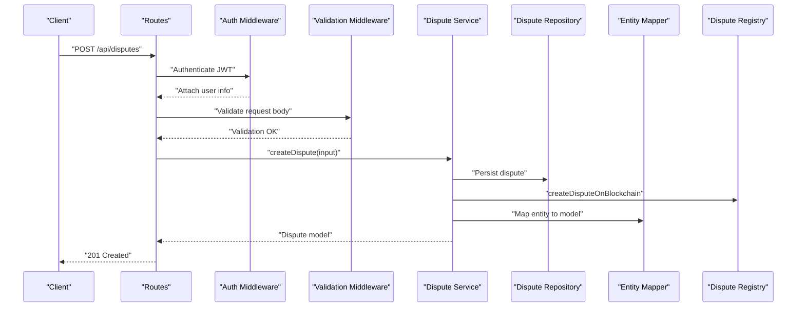
```mermaid
sequenceDiagram
participant C as "Client"
participant R as "Routes"
participant A as "Auth Middleware"
participant V as "Validation Middleware"
participant S as "Dispute Service"
participant P as "Dispute Repository"
participant M as "Entity Mapper"
participant B as "Dispute Registry"
C->>R : "POST /api/disputes"
R->>A : "Authenticate JWT"
A-->>R : "Attach user info"
R->>V : "Validate request body"
V-->>R : "Validation OK"
R->>S : "createDispute(input)"
S->>P : "Persist dispute"
S->>B : "createDisputeOnBlockchain"
S->>M : "Map entity to model"
S-->>R : "Dispute model"
R-->>C : "201 Created"
```

**Diagram sources**
- [dispute-routes.ts](file://src/routes/dispute-routes.ts#L149-L224)
- [auth-middleware.ts](file://src/middleware/auth-middleware.ts#L25-L70)
- [validation-middleware.ts](file://src/middleware/validation-middleware.ts#L606-L638)
- [dispute-service.ts](file://src/services/dispute-service.ts#L67-L206)
- [dispute-repository.ts](file://src/repositories/dispute-repository.ts#L39-L41)
- [entity-mapper.ts](file://src/utils/entity-mapper.ts#L353-L371)
- [dispute-registry.ts](file://src/services/dispute-registry.ts#L69-L145)

## Detailed Component Analysis

### Endpoint Definitions and Schemas

#### Authentication
- All protected endpoints require a Bearer token in the Authorization header.
- Token format: Bearer <JWT>.
- Role checks:
  - Creating disputes: Contract party only.
  - Submitting evidence: Contract party only.
  - Resolving disputes: Admin only.

**Section sources**
- [API-DOCUMENTATION.md](file://docs/API-DOCUMENTATION.md#L7-L13)
- [swagger.ts](file://src/config/swagger.ts#L22-L28)
- [dispute-routes.ts](file://src/routes/dispute-routes.ts#L446-L451)

#### Create Dispute
- Method: POST
- URL: /api/disputes
- Authentication: JWT required
- Request body:
  - contractId: string (UUID)
  - milestoneId: string (UUID)
  - reason: string (non-empty)
- Response:
  - 201 Created with Dispute model
  - 400 Bad Request (validation errors)
  - 401 Unauthorized (missing/invalid token)
  - 403 Forbidden (not a contract party)
  - 404 Not Found (contract/milestone not found)
  - 409 Conflict (already disputed or duplicate dispute)
- Lifecycle:
  - Validates contract and milestone existence.
  - Ensures milestone is not already disputed or approved.
  - Prevents duplicate active disputes for the same milestone.
  - Sets initial status to open.
  - Updates milestone and contract statuses.
  - Records on blockchain and notifies both parties.

**Section sources**
- [dispute-routes.ts](file://src/routes/dispute-routes.ts#L149-L224)
- [dispute-service.ts](file://src/services/dispute-service.ts#L67-L206)
- [dispute-repository.ts](file://src/repositories/dispute-repository.ts#L88-L90)
- [entity-mapper.ts](file://src/utils/entity-mapper.ts#L312-L371)
- [dispute-registry.ts](file://src/services/dispute-registry.ts#L69-L145)

#### Retrieve Dispute Details
- Method: GET
- URL: /api/disputes/{disputeId}
- Path parameter: disputeId (UUID)
- Authentication: JWT required
- Response:
  - 200 OK with Dispute model
  - 400 Bad Request (invalid UUID)
  - 401 Unauthorized
  - 404 Not Found

**Section sources**
- [dispute-routes.ts](file://src/routes/dispute-routes.ts#L258-L287)
- [dispute-service.ts](file://src/services/dispute-service.ts#L461-L475)

#### Submit Evidence
- Method: POST
- URL: /api/disputes/{disputeId}/evidence
- Path parameter: disputeId (UUID)
- Authentication: JWT required
- Request body:
  - type: enum [text, file, link]
  - content: string (non-empty)
- Response:
  - 200 OK with updated Dispute model
  - 400 Bad Request (validation errors or resolved dispute)
  - 401 Unauthorized
  - 403 Forbidden (not a contract party)
  - 404 Not Found
- Lifecycle:
  - Validates dispute exists and is not resolved.
  - Verifies submitter is a contract party.
  - Adds evidence and transitions status to under_review if previously open.
  - Updates blockchain evidence hash.

**Section sources**
- [dispute-routes.ts](file://src/routes/dispute-routes.ts#L290-L382)
- [dispute-service.ts](file://src/services/dispute-service.ts#L209-L293)
- [dispute-registry.ts](file://src/services/dispute-registry.ts#L148-L189)

#### Resolve Dispute (Admin)
- Method: POST
- URL: /api/disputes/{disputeId}/resolve
- Path parameter: disputeId (UUID)
- Authentication: JWT required, role=admin
- Request body:
  - decision: enum [freelancer_favor, employer_favor, split]
  - reasoning: string (non-empty)
- Response:
  - 200 OK with updated Dispute model
  - 400 Bad Request (validation errors or already resolved)
  - 401 Unauthorized
  - 403 Forbidden (not admin)
  - 404 Not Found
- Lifecycle:
  - Validates resolver role is admin.
  - Ensures dispute exists and is not already resolved.
  - Determines payment outcome based on decision:
    - freelancer_favor: release to freelancer, milestone approved.
    - employer_favor: refund to employer, milestone pending.
    - split: milestone approved (partial release handled separately).
  - Updates contract/project statuses.
  - Records resolution on blockchain and notifies both parties.

**Section sources**
- [dispute-routes.ts](file://src/routes/dispute-routes.ts#L384-L487)
- [dispute-service.ts](file://src/services/dispute-service.ts#L296-L458)
- [dispute-registry.ts](file://src/services/dispute-registry.ts#L192-L253)

#### List Disputes by Contract
- Method: GET
- URL: /api/contracts/{contractId}/disputes
- Path parameter: contractId (UUID)
- Authentication: JWT required, contract party only
- Response:
  - 200 OK with array of Dispute models
  - 400 Bad Request (invalid UUID)
  - 401 Unauthorized
  - 403 Forbidden (not a contract party)
  - 404 Not Found

**Section sources**
- [dispute-routes.ts](file://src/routes/dispute-routes.ts#L490-L555)
- [dispute-service.ts](file://src/services/dispute-service.ts#L477-L502)

### Data Models and Schemas
- Dispute:
  - id: string (UUID)
  - contractId: string (UUID)
  - milestoneId: string (UUID)
  - initiatorId: string (UUID)
  - reason: string
  - evidence: array of Evidence
  - status: enum [open, under_review, resolved]
  - resolution: DisputeResolution or null
  - createdAt: string (date-time)
  - updatedAt: string (date-time)
- Evidence:
  - id: string (UUID)
  - submitterId: string (UUID)
  - type: enum [text, file, link]
  - content: string
  - submittedAt: string (date-time)
- DisputeResolution:
  - decision: enum [freelancer_favor, employer_favor, split]
  - reasoning: string
  - resolvedBy: string (UUID)
  - resolvedAt: string (date-time)

These models are mapped from repository entities and exposed via the API.

**Section sources**
- [entity-mapper.ts](file://src/utils/entity-mapper.ts#L312-L371)
- [dispute-repository.ts](file://src/repositories/dispute-repository.ts#L6-L32)
- [swagger.ts](file://src/config/swagger.ts#L22-L28)

### Validation Rules
- UUID validation:
  - All UUID path parameters are validated using a dedicated middleware.
- Request body validation:
  - Create Dispute: contractId, milestoneId (UUID), reason (non-empty string).
  - Submit Evidence: type (enum), content (non-empty string).
  - Resolve Dispute: decision (enum), reasoning (non-empty string).
- Additional business validations:
  - Create Dispute: milestone must exist, not already disputed, not approved; no duplicate active dispute.
  - Submit Evidence: dispute must not be resolved; submitter must be a contract party.
  - Resolve Dispute: dispute must not be resolved; resolver must be admin.

**Section sources**
- [validation-middleware.ts](file://src/middleware/validation-middleware.ts#L606-L638)
- [dispute-routes.ts](file://src/routes/dispute-routes.ts#L168-L201)
- [dispute-routes.ts](file://src/routes/dispute-routes.ts#L348-L360)
- [dispute-routes.ts](file://src/routes/dispute-routes.ts#L453-L465)
- [dispute-service.ts](file://src/services/dispute-service.ts#L110-L133)
- [dispute-service.ts](file://src/services/dispute-service.ts#L227-L233)
- [dispute-service.ts](file://src/services/dispute-service.ts#L322-L328)

### Dispute Status Lifecycle
- open: Initial state when a dispute is created.
- under_review: Automatically set when evidence is submitted to a previously open dispute; remains under_review if evidence is added later.
- resolved: Set when an admin resolves the dispute; cannot accept further evidence.

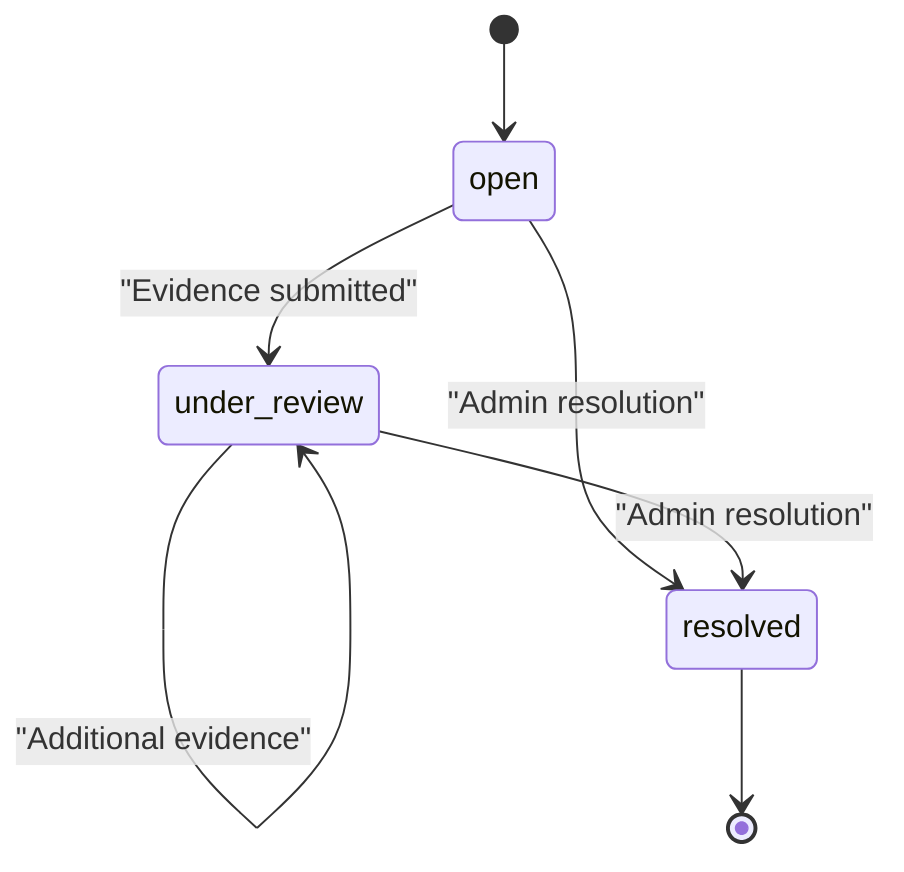
```mermaid
stateDiagram-v2
[*] --> open
open --> under_review : "Evidence submitted"
under_review --> under_review : "Additional evidence"
open --> resolved : "Admin resolution"
under_review --> resolved : "Admin resolution"
resolved --> [*]
```

**Diagram sources**
- [dispute-service.ts](file://src/services/dispute-service.ts#L263-L271)
- [dispute-service.ts](file://src/services/dispute-service.ts#L322-L328)

### Role-Based Access Controls
- Any contract party (freelancer or employer) can:
  - Create disputes.
  - Submit evidence.
- Only administrators can:
  - Resolve disputes.

**Section sources**
- [dispute-routes.ts](file://src/routes/dispute-routes.ts#L446-L451)
- [dispute-service.ts](file://src/services/dispute-service.ts#L305-L311)

### Client Implementation Examples

#### Example: Create a Dispute
- Endpoint: POST /api/disputes
- Headers: Authorization: Bearer <JWT>
- Request body:
  - contractId: string (UUID)
  - milestoneId: string (UUID)
  - reason: string
- Expected response: 201 with Dispute model

**Section sources**
- [dispute-routes.ts](file://src/routes/dispute-routes.ts#L149-L224)
- [API-DOCUMENTATION.md](file://docs/API-DOCUMENTATION.md#L448-L460)

#### Example: Submit Evidence
- Endpoint: POST /api/disputes/{disputeId}/evidence
- Path parameters: disputeId (UUID)
- Headers: Authorization: Bearer <JWT>
- Request body:
  - type: enum [text, file, link]
  - content: string
- Expected response: 200 with updated Dispute model

**Section sources**
- [dispute-routes.ts](file://src/routes/dispute-routes.ts#L290-L382)
- [API-DOCUMENTATION.md](file://docs/API-DOCUMENTATION.md#L461-L471)

#### Example: Admin Resolve Dispute
- Endpoint: POST /api/disputes/{disputeId}/resolve
- Path parameters: disputeId (UUID)
- Headers: Authorization: Bearer <JWT>, role=admin
- Request body:
  - decision: enum [freelancer_favor, employer_favor, split]
  - reasoning: string
- Expected response: 200 with updated Dispute model

**Section sources**
- [dispute-routes.ts](file://src/routes/dispute-routes.ts#L384-L487)
- [API-DOCUMENTATION.md](file://docs/API-DOCUMENTATION.md#L472-L481)

### Dispute Resolution Outcomes and Escrow Effects
- freelancer_favor:
  - Outcome recorded on blockchain.
  - Milestone status updated to approved.
  - Payment released to freelancer.
- employer_favor:
  - Outcome recorded on blockchain.
  - Milestone status updated to pending.
  - Payment refunded to employer.
- split:
  - Outcome recorded on blockchain.
  - Milestone status updated to approved.
  - Partial release handled separately.

**Section sources**
- [dispute-service.ts](file://src/services/dispute-service.ts#L367-L401)
- [dispute-registry.ts](file://src/services/dispute-registry.ts#L192-L253)

## Dependency Analysis
The dispute module exhibits clear separation of concerns:
- Routes depend on auth and validation middleware and delegate to the service layer.
- Service depends on repository, mapper, and blockchain registry.
- Repository encapsulates database operations.
- Mapper centralizes model transformations.
- Blockchain registry simulates immutable records.

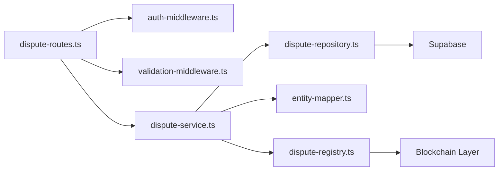
```mermaid
graph LR
Routes["dispute-routes.ts"] --> Auth["auth-middleware.ts"]
Routes --> Valid["validation-middleware.ts"]
Routes --> Service["dispute-service.ts"]
Service --> Repo["dispute-repository.ts"]
Service --> Mapper["entity-mapper.ts"]
Service --> Registry["dispute-registry.ts"]
Repo --> DB["Supabase"]
Registry --> Chain["Blockchain Layer"]
```

**Diagram sources**
- [dispute-routes.ts](file://src/routes/dispute-routes.ts#L1-L558)
- [auth-middleware.ts](file://src/middleware/auth-middleware.ts#L1-L101)
- [validation-middleware.ts](file://src/middleware/validation-middleware.ts#L1-L815)
- [dispute-service.ts](file://src/services/dispute-service.ts#L1-L521)
- [dispute-repository.ts](file://src/repositories/dispute-repository.ts#L1-L136)
- [entity-mapper.ts](file://src/utils/entity-mapper.ts#L312-L371)
- [dispute-registry.ts](file://src/services/dispute-registry.ts#L1-L289)

**Section sources**
- [dispute-routes.ts](file://src/routes/dispute-routes.ts#L1-L558)
- [dispute-service.ts](file://src/services/dispute-service.ts#L1-L521)
- [dispute-repository.ts](file://src/repositories/dispute-repository.ts#L1-L136)
- [entity-mapper.ts](file://src/utils/entity-mapper.ts#L312-L371)
- [dispute-registry.ts](file://src/services/dispute-registry.ts#L1-L289)

## Performance Considerations
- Request validation occurs before service logic to fail fast and reduce unnecessary database calls.
- Pagination is supported for listing disputes by contract via repository methods.
- Blockchain operations are asynchronous and logged; failures do not block dispute resolution but are surfaced in logs.
- Status transitions minimize redundant writes by updating only necessary fields.

[No sources needed since this section provides general guidance]

## Troubleshooting Guide
Common error scenarios and resolutions:
- 400 Validation Error:
  - Ensure UUIDs are valid and request bodies match schemas.
  - Check enum values for type and decision.
- 401 Unauthorized:
  - Confirm Authorization header includes a valid Bearer token.
- 403 Forbidden:
  - Only contract parties can create disputes and submit evidence; only admins can resolve.
- 404 Not Found:
  - Verify contractId, milestoneId, or disputeId exist.
- Duplicate or Already Resolved:
  - Cannot create a dispute for an approved or already disputed milestone.
  - Cannot submit evidence or resolve a dispute already marked as resolved.

**Section sources**
- [dispute-routes.ts](file://src/routes/dispute-routes.ts#L168-L201)
- [dispute-routes.ts](file://src/routes/dispute-routes.ts#L348-L360)
- [dispute-routes.ts](file://src/routes/dispute-routes.ts#L453-L465)
- [dispute-service.ts](file://src/services/dispute-service.ts#L110-L133)
- [dispute-service.ts](file://src/services/dispute-service.ts#L227-L233)
- [dispute-service.ts](file://src/services/dispute-service.ts#L322-L328)

## Conclusion
The dispute API provides a secure, auditable, and extensible mechanism for managing disputes in the FreelanceXchain ecosystem. It enforces strict validation, role-based access, and a clear status lifecycle while integrating with blockchain for immutable records. Clients should implement robust error handling and adhere to the documented schemas and access controls.

[No sources needed since this section summarizes without analyzing specific files]

## Appendices

### API Reference Summary

- Create Dispute
  - Method: POST
  - URL: /api/disputes
  - Auth: JWT, contract party
  - Body: contractId (UUID), milestoneId (UUID), reason (string)
  - Responses: 201, 400, 401, 403, 404, 409

- Get Dispute
  - Method: GET
  - URL: /api/disputes/{disputeId}
  - Auth: JWT
  - Path: disputeId (UUID)
  - Responses: 200, 400, 401, 404

- Submit Evidence
  - Method: POST
  - URL: /api/disputes/{disputeId}/evidence
  - Auth: JWT, contract party
  - Path: disputeId (UUID)
  - Body: type (enum), content (string)
  - Responses: 200, 400, 401, 403, 404

- Resolve Dispute (Admin)
  - Method: POST
  - URL: /api/disputes/{disputeId}/resolve
  - Auth: JWT, admin
  - Path: disputeId (UUID)
  - Body: decision (enum), reasoning (string)
  - Responses: 200, 400, 401, 403, 404

- List Disputes by Contract
  - Method: GET
  - URL: /api/contracts/{contractId}/disputes
  - Auth: JWT, contract party
  - Path: contractId (UUID)
  - Responses: 200, 400, 401, 403, 404

**Section sources**
- [dispute-routes.ts](file://src/routes/dispute-routes.ts#L149-L555)
- [API-DOCUMENTATION.md](file://docs/API-DOCUMENTATION.md#L440-L483)

---

# Dispute Creation

<cite>
**Referenced Files in This Document**
- [dispute-routes.ts](file://src/routes/dispute-routes.ts)
- [dispute-service.ts](file://src/services/dispute-service.ts)
- [dispute-repository.ts](file://src/repositories/dispute-repository.ts)
- [entity-mapper.ts](file://src/utils/entity-mapper.ts)
- [validation-middleware.ts](file://src/middleware/validation-middleware.ts)
- [auth-middleware.ts](file://src/middleware/auth-middleware.ts)
- [error-handler.ts](file://src/middleware/error-handler.ts)
- [DisputeResolution.sol](file://contracts/DisputeResolution.sol)
- [dispute-registry.ts](file://src/services/dispute-registry.ts)
</cite>

## Table of Contents
1. [Introduction](#introduction)
2. [Project Structure](#project-structure)
3. [Core Components](#core-components)
4. [Architecture Overview](#architecture-overview)
5. [Detailed Component Analysis](#detailed-component-analysis)
6. [Dependency Analysis](#dependency-analysis)
7. [Performance Considerations](#performance-considerations)
8. [Troubleshooting Guide](#troubleshooting-guide)
9. [Conclusion](#conclusion)
10. [Appendices](#appendices)

## Introduction
This document describes the API for creating a dispute via POST /api/disputes. It covers the request schema, authentication and authorization, validation rules, response format, backend flow from route to service and blockchain integration, and common error scenarios. It also provides practical examples and client implementation guidance.

## Project Structure
The dispute creation endpoint is implemented in the routes layer and delegated to a service layer that orchestrates repository access, business validation, notifications, and blockchain recording.

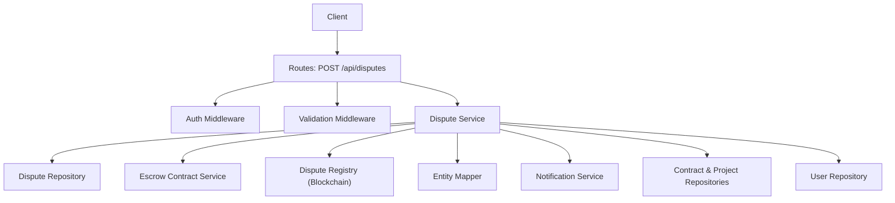
```mermaid
graph TB
Client["Client"] --> Routes["Routes: POST /api/disputes"]
Routes --> Auth["Auth Middleware"]
Routes --> Validator["Validation Middleware"]
Routes --> Service["Dispute Service"]
Service --> Repo["Dispute Repository"]
Service --> Escrow["Escrow Contract Service"]
Service --> Registry["Dispute Registry (Blockchain)"]
Service --> Mapper["Entity Mapper"]
Service --> Notify["Notification Service"]
Service --> Contracts["Contract & Project Repositories"]
Service --> Users["User Repository"]
```

**Diagram sources**
- [dispute-routes.ts](file://src/routes/dispute-routes.ts#L149-L224)
- [dispute-service.ts](file://src/services/dispute-service.ts#L67-L206)
- [dispute-repository.ts](file://src/repositories/dispute-repository.ts#L39-L90)
- [entity-mapper.ts](file://src/utils/entity-mapper.ts#L312-L371)
- [dispute-registry.ts](file://src/services/dispute-registry.ts#L69-L145)

**Section sources**
- [dispute-routes.ts](file://src/routes/dispute-routes.ts#L149-L224)
- [dispute-service.ts](file://src/services/dispute-service.ts#L67-L206)

## Core Components
- Route handler enforces JWT authentication and validates request body fields.
- Service performs business validation (contract-party access, milestone existence, duplicate dispute checks) and updates domain state.
- Repository persists dispute records and related lookups.
- Blockchain registry records dispute lifecycle immutably.
- Entity mapper converts between internal entities and API models.

**Section sources**
- [dispute-routes.ts](file://src/routes/dispute-routes.ts#L149-L224)
- [dispute-service.ts](file://src/services/dispute-service.ts#L67-L206)
- [dispute-repository.ts](file://src/repositories/dispute-repository.ts#L39-L90)
- [entity-mapper.ts](file://src/utils/entity-mapper.ts#L312-L371)
- [dispute-registry.ts](file://src/services/dispute-registry.ts#L69-L145)

## Architecture Overview
The endpoint follows a layered architecture: route -> service -> repository/blockchain. The service ensures only a contract party can initiate a dispute, validates milestone eligibility, and records the dispute on-chain.

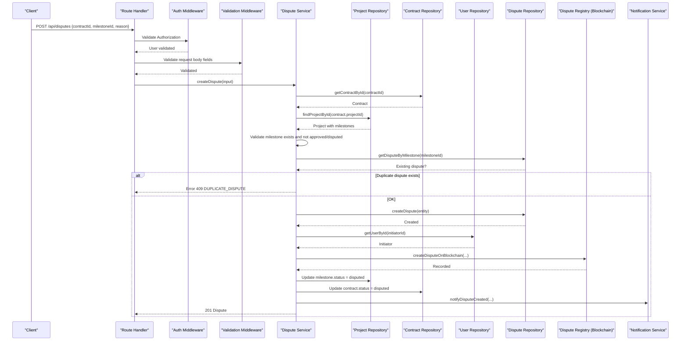
```mermaid
sequenceDiagram
participant C as "Client"
participant R as "Route Handler"
participant A as "Auth Middleware"
participant V as "Validation Middleware"
participant S as "Dispute Service"
participant P as "Project Repository"
participant CR as "Contract Repository"
participant UR as "User Repository"
participant DR as "Dispute Repository"
participant BR as "Dispute Registry (Blockchain)"
participant N as "Notification Service"
C->>R : POST /api/disputes {contractId, milestoneId, reason}
R->>A : Validate Authorization
A-->>R : User validated
R->>V : Validate request body fields
V-->>R : Validated
R->>S : createDispute(input)
S->>CR : getContractById(contractId)
CR-->>S : Contract
S->>P : findProjectById(contract.projectId)
P-->>S : Project with milestones
S->>S : Validate milestone exists and not approved/disputed
S->>DR : getDisputeByMilestone(milestoneId)
DR-->>S : Existing dispute?
alt Duplicate dispute exists
S-->>R : Error 409 DUPLICATE_DISPUTE
else OK
S->>DR : createDispute(entity)
DR-->>S : Created
S->>UR : getUserById(initiatorId)
UR-->>S : Initiator
S->>BR : createDisputeOnBlockchain(...)
BR-->>S : Recorded
S->>P : Update milestone.status = disputed
S->>CR : Update contract.status = disputed
S->>N : notifyDisputeCreated(...)
S-->>R : 201 Dispute
end
```

**Diagram sources**
- [dispute-routes.ts](file://src/routes/dispute-routes.ts#L149-L224)
- [dispute-service.ts](file://src/services/dispute-service.ts#L67-L206)
- [dispute-repository.ts](file://src/repositories/dispute-repository.ts#L39-L90)
- [dispute-registry.ts](file://src/services/dispute-registry.ts#L69-L145)

## Detailed Component Analysis

### Endpoint Definition
- Method: POST
- Path: /api/disputes
- Authentication: Required (Bearer JWT)
- Role-based access: Any contract party (employer or freelancer) can initiate a dispute
- Request body fields:
  - contractId: string, required, UUID
  - milestoneId: string, required, UUID
  - reason: string, required, non-empty
- Response: 201 Created with the full Dispute object
- Common errors:
  - 400: Validation errors (missing/invalid fields)
  - 401: Unauthorized (missing/invalid JWT)
  - 403: Unauthorized (not a contract party)
  - 404: Contract or milestone not found
  - 409: Already disputed or duplicate active dispute for milestone

**Section sources**
- [dispute-routes.ts](file://src/routes/dispute-routes.ts#L118-L148)
- [dispute-routes.ts](file://src/routes/dispute-routes.ts#L149-L224)
- [validation-middleware.ts](file://src/middleware/validation-middleware.ts#L606-L616)

### Request Validation Rules
- contractId must be present and a valid UUID.
- milestoneId must be present and a valid UUID.
- reason must be present and a non-empty string.
- The route also applies a reusable UUID validator for path parameters in other endpoints.

**Section sources**
- [dispute-routes.ts](file://src/routes/dispute-routes.ts#L168-L203)
- [validation-middleware.ts](file://src/middleware/validation-middleware.ts#L606-L616)
- [validation-middleware.ts](file://src/middleware/validation-middleware.ts#L771-L800)

### Authentication and Authorization
- Authentication: Route requires a valid Bearer JWT. The auth middleware extracts the token from the Authorization header and validates it.
- Authorization: The service verifies that the initiator is either the employer or freelancer on the contract. Other endpoints enforce role checks differently (e.g., admin-only resolution).

**Section sources**
- [auth-middleware.ts](file://src/middleware/auth-middleware.ts#L25-L70)
- [dispute-service.ts](file://src/services/dispute-service.ts#L82-L88)

### Business Logic and Domain State
- Validates contract exists and loads project with milestones.
- Ensures milestone exists and is not already disputed or approved.
- Prevents duplicate active disputes for the same milestone.
- Creates a Dispute entity with status "open" and empty evidence array.
- Updates milestone status to "disputed" and contract status to "disputed".
- Sends notifications to both parties.

**Section sources**
- [dispute-service.ts](file://src/services/dispute-service.ts#L72-L134)
- [dispute-service.ts](file://src/services/dispute-service.ts#L175-L183)

### Response Schema
The response is a Dispute object with:
- id: string
- contractId: string
- milestoneId: string
- initiatorId: string
- reason: string
- evidence: Evidence[]
- status: "open" | "under_review" | "resolved"
- resolution: DisputeResolution | null
- createdAt: string (ISO date-time)
- updatedAt: string (ISO date-time)

Evidence items include:
- id: string
- submitterId: string
- type: "text" | "file" | "link"
- content: string
- submittedAt: string (ISO date-time)

DisputeResolution includes:
- decision: "freelancer_favor" | "employer_favor" | "split"
- reasoning: string
- resolvedBy: string
- resolvedAt: string (ISO date-time)

**Section sources**
- [entity-mapper.ts](file://src/utils/entity-mapper.ts#L312-L371)
- [dispute-repository.ts](file://src/repositories/dispute-repository.ts#L6-L32)

### Backend Flow: Route to Service to Blockchain
- Route validates JWT and request body.
- Service:
  - Loads contract and project, validates milestone eligibility.
  - Checks for existing active dispute on milestone.
  - Persists dispute and updates statuses.
  - Calls blockchain registry to record dispute with wallets and amount.
  - Notifies both parties.
- Blockchain contract stores immutable records keyed by hashes.

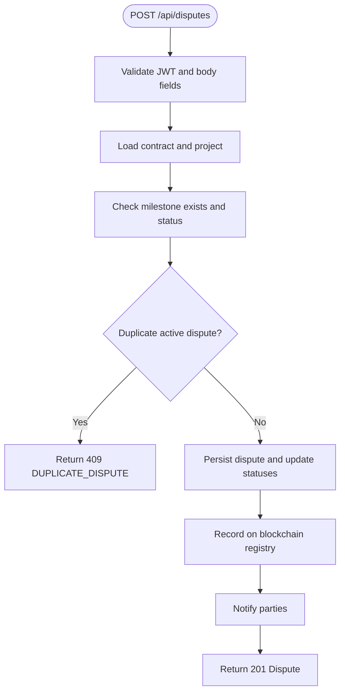
```mermaid
flowchart TD
Start(["POST /api/disputes"]) --> Validate["Validate JWT and body fields"]
Validate --> LoadContract["Load contract and project"]
LoadContract --> CheckMilestone["Check milestone exists and status"]
CheckMilestone --> DuplicateCheck{"Duplicate active dispute?"}
DuplicateCheck --> |Yes| Return409["Return 409 DUPLICATE_DISPUTE"]
DuplicateCheck --> |No| Persist["Persist dispute and update statuses"]
Persist --> RecordBlock["Record on blockchain registry"]
RecordBlock --> Notify["Notify parties"]
Notify --> Return201["Return 201 Dispute"]
```

**Diagram sources**
- [dispute-routes.ts](file://src/routes/dispute-routes.ts#L149-L224)
- [dispute-service.ts](file://src/services/dispute-service.ts#L67-L206)
- [dispute-registry.ts](file://src/services/dispute-registry.ts#L69-L145)

**Section sources**
- [dispute-routes.ts](file://src/routes/dispute-routes.ts#L149-L224)
- [dispute-service.ts](file://src/services/dispute-service.ts#L67-L206)
- [dispute-registry.ts](file://src/services/dispute-registry.ts#L69-L145)

### Blockchain Integration with DisputeResolution Smart Contract
- On successful dispute creation, the service records a dispute on-chain using the Dispute Registry service, which simulates transactions and stores records in-memory.
- The Solidity contract DisputeResolution stores immutable records keyed by hashed identifiers and emits events for dispute creation, evidence updates, and resolution.
- The service also marks the agreement as disputed on-chain.

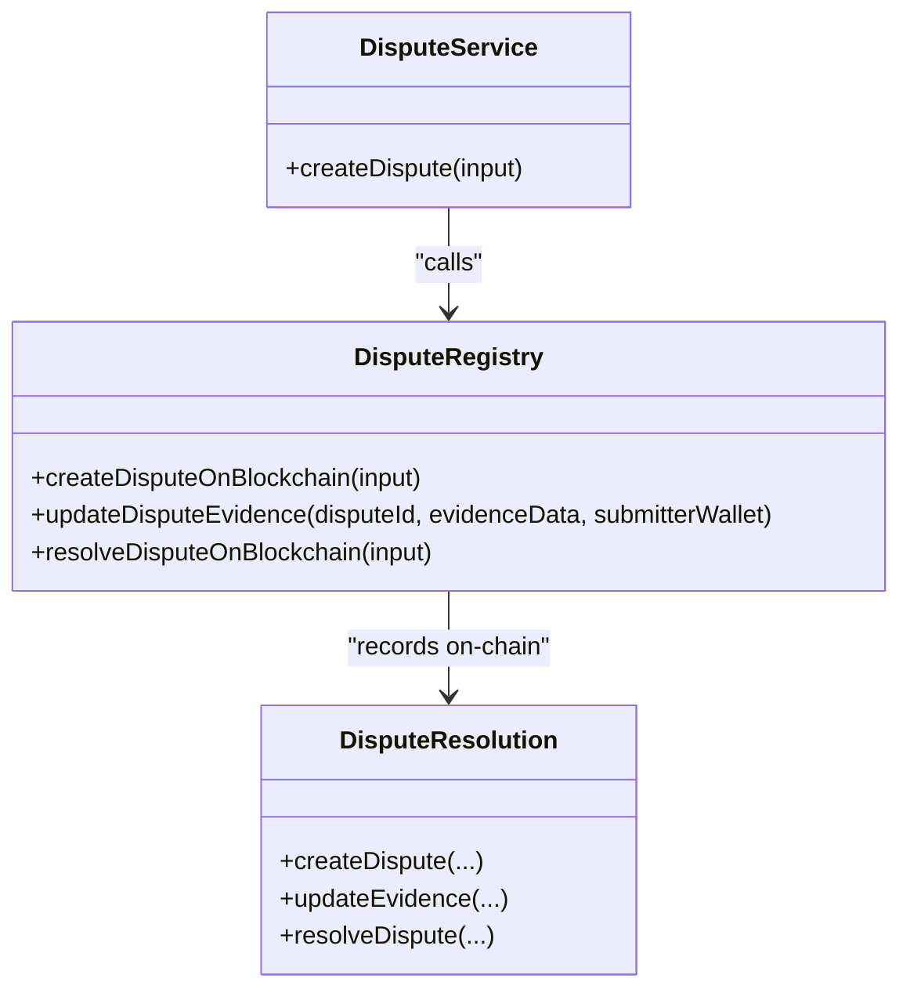
```mermaid
classDiagram
class DisputeService {
+createDispute(input)
}
class DisputeRegistry {
+createDisputeOnBlockchain(input)
+updateDisputeEvidence(disputeId, evidenceData, submitterWallet)
+resolveDisputeOnBlockchain(input)
}
class DisputeResolution {
+createDispute(...)
+updateEvidence(...)
+resolveDispute(...)
}
DisputeService --> DisputeRegistry : "calls"
DisputeRegistry --> DisputeResolution : "records on-chain"
```

**Diagram sources**
- [dispute-service.ts](file://src/services/dispute-service.ts#L151-L173)
- [dispute-registry.ts](file://src/services/dispute-registry.ts#L69-L145)
- [DisputeResolution.sol](file://contracts/DisputeResolution.sol#L48-L125)

**Section sources**
- [dispute-service.ts](file://src/services/dispute-service.ts#L151-L173)
- [dispute-registry.ts](file://src/services/dispute-registry.ts#L69-L145)
- [DisputeResolution.sol](file://contracts/DisputeResolution.sol#L48-L125)

### Practical Example: Milestone Delivery Issue
- Scenario: Employer initiates a dispute because the milestone deliverable was not received.
- Request payload:
  - contractId: "a1b2c3d4-e5f6-a7b8-c9d0-e1f2a3b4c5d6"
  - milestoneId: "f0e9d8c7-b6a5-f4e3-d2c1-b0a9f8e7d6c5"
  - reason: "Deliverable not received by due date"
- Expected response: 201 with a Dispute object having status "open" and empty evidence array.

**Section sources**
- [dispute-routes.ts](file://src/routes/dispute-routes.ts#L149-L224)
- [entity-mapper.ts](file://src/utils/entity-mapper.ts#L312-L371)

### Common Errors
- 400 Validation errors:
  - Missing or invalid contractId (must be UUID).
  - Missing or invalid milestoneId (must be UUID).
  - Missing or empty reason (must be non-empty string).
- 401 Unauthorized:
  - Missing Authorization header or invalid/missing Bearer token.
- 403 Unauthorized:
  - Initiator is not a contract party (employer or freelancer).
- 404 Not Found:
  - Contract or milestone not found.
- 409 Conflict:
  - Milestone is already under dispute.
  - An active dispute already exists for the milestone.

**Section sources**
- [dispute-routes.ts](file://src/routes/dispute-routes.ts#L168-L217)
- [dispute-service.ts](file://src/services/dispute-service.ts#L82-L134)

## Dependency Analysis
The route depends on auth and validation middleware and delegates to the dispute service. The service depends on repositories, user and contract/project loaders, notification service, and blockchain registry.

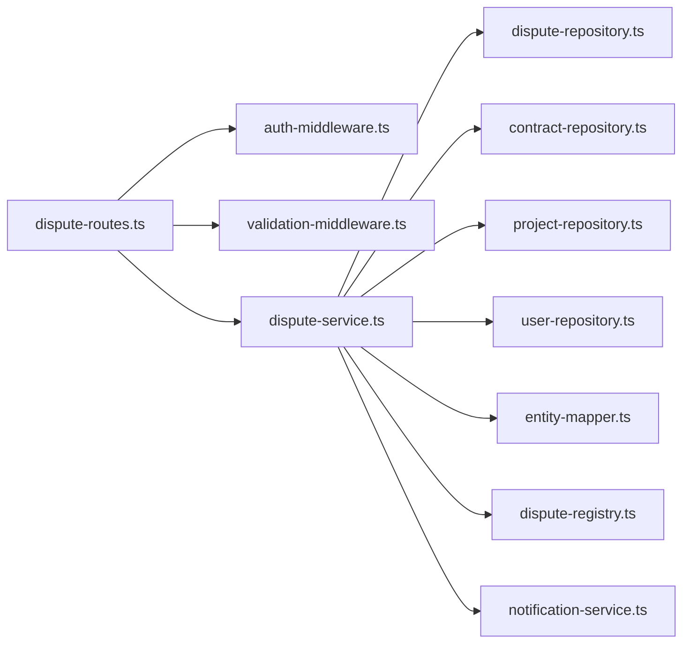
```mermaid
graph LR
Routes["dispute-routes.ts"] --> Auth["auth-middleware.ts"]
Routes --> Validator["validation-middleware.ts"]
Routes --> Service["dispute-service.ts"]
Service --> Repo["dispute-repository.ts"]
Service --> Contracts["contract-repository.ts"]
Service --> Projects["project-repository.ts"]
Service --> Users["user-repository.ts"]
Service --> Mapper["entity-mapper.ts"]
Service --> Registry["dispute-registry.ts"]
Service --> Notify["notification-service.ts"]
```

**Diagram sources**
- [dispute-routes.ts](file://src/routes/dispute-routes.ts#L149-L224)
- [dispute-service.ts](file://src/services/dispute-service.ts#L1-L66)
- [dispute-repository.ts](file://src/repositories/dispute-repository.ts#L39-L90)

**Section sources**
- [dispute-routes.ts](file://src/routes/dispute-routes.ts#L149-L224)
- [dispute-service.ts](file://src/services/dispute-service.ts#L1-L66)

## Performance Considerations
- Validation is lightweight and occurs before any repository calls.
- Repository queries are simple and scoped to IDs.
- Blockchain operations are asynchronous and logged; failures do not block the primary flow.
- Notifications are sent after persistence and blockchain recording.

[No sources needed since this section provides general guidance]

## Troubleshooting Guide
- If receiving 401 Unauthorized, ensure the Authorization header is present and formatted as "Bearer <token>".
- If receiving 403 Unauthorized, verify the user is either the employer or freelancer on the contract.
- If receiving 404 Not Found, confirm the contractId and milestoneId are valid and correspond to an existing contract and milestone.
- If receiving 409 Conflict, check that the milestone is not already disputed or has an active dispute.
- If blockchain recording fails, the service logs the error and still returns the created dispute; retry later or contact support.

**Section sources**
- [auth-middleware.ts](file://src/middleware/auth-middleware.ts#L25-L70)
- [dispute-service.ts](file://src/services/dispute-service.ts#L151-L173)
- [error-handler.ts](file://src/middleware/error-handler.ts#L85-L120)

## Conclusion
The dispute creation endpoint provides a secure, auditable way for any contract party to initiate a dispute. It enforces strict validation, prevents duplicates, updates domain state, and records immutable on-chain data. Clients should handle 400/401/403/404/409 responses appropriately and implement retry/backoff for transient blockchain errors.

## Appendices

### API Reference: POST /api/disputes
- Authentication: Bearer JWT
- Request body:
  - contractId: string (UUID)
  - milestoneId: string (UUID)
  - reason: string (non-empty)
- Responses:
  - 201: Dispute created
  - 400: Validation error
  - 401: Unauthorized
  - 403: Unauthorized (not a contract party)
  - 404: Contract or milestone not found
  - 409: Already disputed or duplicate active dispute

**Section sources**
- [dispute-routes.ts](file://src/routes/dispute-routes.ts#L118-L148)
- [dispute-routes.ts](file://src/routes/dispute-routes.ts#L149-L224)
- [validation-middleware.ts](file://src/middleware/validation-middleware.ts#L606-L616)

### Client Implementation Guidance
- Always attach a valid Bearer token in the Authorization header.
- Validate inputs server-side using the same rules (UUIDs, non-empty reason).
- Handle 409 Conflict by informing the user that a dispute already exists for the milestone.
- After creation, poll the dispute details endpoint to track status and evidence submissions.
- For error handling, implement exponential backoff for transient failures and display user-friendly messages.

[No sources needed since this section provides general guidance]

---

# Dispute Resolution

<cite>
**Referenced Files in This Document**
- [dispute-routes.ts](file://src/routes/dispute-routes.ts)
- [dispute-service.ts](file://src/services/dispute-service.ts)
- [auth-middleware.ts](file://src/middleware/auth-middleware.ts)
- [validation-middleware.ts](file://src/middleware/validation-middleware.ts)
- [dispute-registry.ts](file://src/services/dispute-registry.ts)
- [escrow-contract.ts](file://src/services/escrow-contract.ts)
- [DisputeResolution.sol](file://contracts/DisputeResolution.sol)
- [FreelanceEscrow.sol](file://contracts/FreelanceEscrow.sol)
- [entity-mapper.ts](file://src/utils/entity-mapper.ts)
- [API-DOCUMENTATION.md](file://docs/API-DOCUMENTATION.md)
</cite>

## Table of Contents
1. [Introduction](#introduction)
2. [Project Structure](#project-structure)
3. [Core Components](#core-components)
4. [Architecture Overview](#architecture-overview)
5. [Detailed Component Analysis](#detailed-component-analysis)
6. [Dependency Analysis](#dependency-analysis)
7. [Performance Considerations](#performance-considerations)
8. [Troubleshooting Guide](#troubleshooting-guide)
9. [Conclusion](#conclusion)
10. [Appendices](#appendices)

## Introduction
This document provides API documentation for the dispute resolution endpoint POST /api/disputes/{disputeId}/resolve. It explains who can use the endpoint, the request payload, state transitions, financial implications of each decision, integration with on-chain contracts, and error responses. It also includes guidance for audit trails and compliance logging.

## Project Structure
The dispute resolution feature spans the Express route layer, service layer, middleware, blockchain integration, and Solidity contracts:
- Route: enforces authentication and admin role checks, validates inputs, and delegates to the service.
- Service: orchestrates state updates, interacts with the escrow service, and records outcomes on-chain.
- Blockchain services: simulate transactions and persist records for auditability.
- On-chain contracts: DisputeResolution stores immutable outcomes; FreelanceEscrow executes fund transfers.

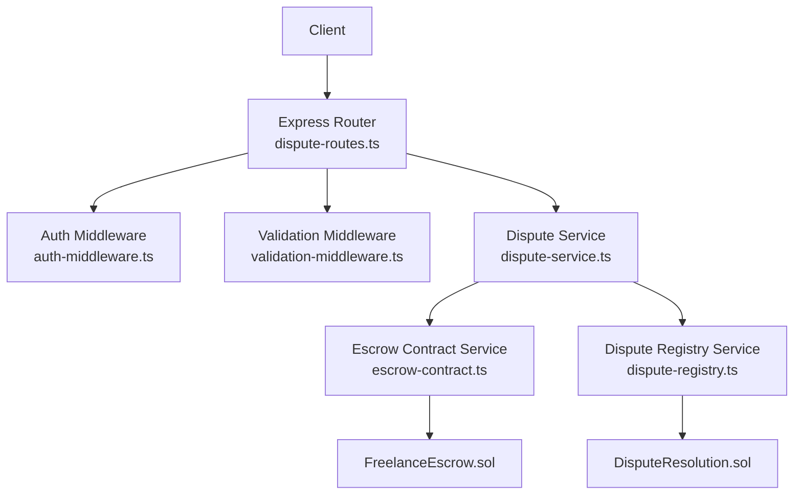
```mermaid
graph TB
Client["Client"]
Router["Express Router<br/>dispute-routes.ts"]
AuthMW["Auth Middleware<br/>auth-middleware.ts"]
ValMW["Validation Middleware<br/>validation-middleware.ts"]
Service["Dispute Service<br/>dispute-service.ts"]
EscrowSvc["Escrow Contract Service<br/>escrow-contract.ts"]
RegistrySvc["Dispute Registry Service<br/>dispute-registry.ts"]
EscrowSC["FreelanceEscrow.sol"]
DisputeSC["DisputeResolution.sol"]
Client --> Router
Router --> AuthMW
Router --> ValMW
Router --> Service
Service --> EscrowSvc
Service --> RegistrySvc
RegistrySvc --> DisputeSC
EscrowSvc --> EscrowSC
```

**Diagram sources**
- [dispute-routes.ts](file://src/routes/dispute-routes.ts#L424-L486)
- [auth-middleware.ts](file://src/middleware/auth-middleware.ts#L25-L70)
- [validation-middleware.ts](file://src/middleware/validation-middleware.ts#L782-L800)
- [dispute-service.ts](file://src/services/dispute-service.ts#L296-L458)
- [escrow-contract.ts](file://src/services/escrow-contract.ts#L138-L264)
- [dispute-registry.ts](file://src/services/dispute-registry.ts#L191-L253)
- [FreelanceEscrow.sol](file://contracts/FreelanceEscrow.sol#L178-L207)
- [DisputeResolution.sol](file://contracts/DisputeResolution.sol#L96-L126)

**Section sources**
- [dispute-routes.ts](file://src/routes/dispute-routes.ts#L424-L486)
- [dispute-service.ts](file://src/services/dispute-service.ts#L296-L458)
- [auth-middleware.ts](file://src/middleware/auth-middleware.ts#L25-L70)
- [validation-middleware.ts](file://src/middleware/validation-middleware.ts#L782-L800)

## Core Components
- Endpoint: POST /api/disputes/{disputeId}/resolve
- Authentication: Requires a valid Bearer token.
- Authorization: Only users with role admin can resolve disputes.
- Request body:
  - decision: one of freelancer_favor, employer_favor, split
  - reasoning: required text explanation
- Response: Returns the updated Dispute object with status resolved and resolution details.

Key behaviors:
- Admin role verification occurs in both route and service layers.
- Validates decision and reasoning presence and correctness.
- Updates dispute status to resolved and persists resolution metadata.
- Triggers on-chain recording of outcome and, where applicable, fund release/refund.

**Section sources**
- [dispute-routes.ts](file://src/routes/dispute-routes.ts#L424-L486)
- [dispute-service.ts](file://src/services/dispute-service.ts#L300-L458)
- [entity-mapper.ts](file://src/utils/entity-mapper.ts#L313-L371)

## Architecture Overview
The resolution flow integrates off-chain state updates with on-chain immutability and fund movement.

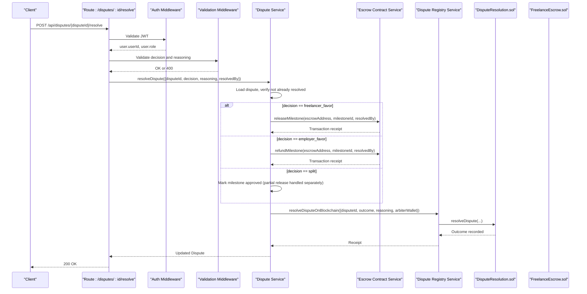
```mermaid
sequenceDiagram
participant C as "Client"
participant R as "Route : /disputes/ : id/resolve"
participant A as "Auth Middleware"
participant V as "Validation Middleware"
participant S as "Dispute Service"
participant E as "Escrow Contract Service"
participant D as "Dispute Registry Service"
participant SC1 as "DisputeResolution.sol"
participant SC2 as "FreelanceEscrow.sol"
C->>R : POST /api/disputes/{disputeId}/resolve
R->>A : Validate JWT
A-->>R : user.userId, user.role
R->>V : Validate decision and reasoning
V-->>R : OK or 400
R->>S : resolveDispute({disputeId, decision, reasoning, resolvedBy})
S->>S : Load dispute, verify not already resolved
alt decision == freelancer_favor
S->>E : releaseMilestone(escrowAddress, milestoneId, resolvedBy)
E-->>S : Transaction receipt
else decision == employer_favor
S->>E : refundMilestone(escrowAddress, milestoneId, resolvedBy)
E-->>S : Transaction receipt
else decision == split
S->>S : Mark milestone approved (partial release handled separately)
end
S->>D : resolveDisputeOnBlockchain({disputeId, outcome, reasoning, arbiterWallet})
D->>SC1 : resolveDispute(...)
SC1-->>D : Outcome recorded
D-->>S : Receipt
S-->>R : Updated Dispute
R-->>C : 200 OK
```

**Diagram sources**
- [dispute-routes.ts](file://src/routes/dispute-routes.ts#L424-L486)
- [dispute-service.ts](file://src/services/dispute-service.ts#L296-L458)
- [escrow-contract.ts](file://src/services/escrow-contract.ts#L138-L264)
- [dispute-registry.ts](file://src/services/dispute-registry.ts#L191-L253)
- [DisputeResolution.sol](file://contracts/DisputeResolution.sol#L96-L126)
- [FreelanceEscrow.sol](file://contracts/FreelanceEscrow.sol#L178-L207)

## Detailed Component Analysis

### Endpoint Definition and Behavior
- Path: POST /api/disputes/{disputeId}/resolve
- Security: Bearer token required.
- Role requirement: admin only.
- Request body:
  - decision: enum freelancer_favor, employer_favor, split
  - reasoning: string, required
- Response: Dispute with status resolved and resolution populated.

Behavior highlights:
- Admin role enforced in route and service.
- Decision validated and reasoning required.
- On-chain outcome recorded regardless of financial action.

**Section sources**
- [dispute-routes.ts](file://src/routes/dispute-routes.ts#L385-L423)
- [dispute-routes.ts](file://src/routes/dispute-routes.ts#L424-L486)
- [validation-middleware.ts](file://src/middleware/validation-middleware.ts#L629-L638)

### State Transition: Under Review to Resolved
- Evidence submission moves dispute from open to under_review.
- Resolution sets status to resolved and attaches resolution metadata.

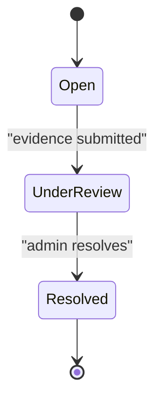
```mermaid
stateDiagram-v2
[*] --> Open
Open --> UnderReview : "evidence submitted"
UnderReview --> Resolved : "admin resolves"
Resolved --> [*]
```

**Diagram sources**
- [dispute-service.ts](file://src/services/dispute-service.ts#L210-L293)
- [dispute-service.ts](file://src/services/dispute-service.ts#L296-L458)

**Section sources**
- [dispute-service.ts](file://src/services/dispute-service.ts#L210-L293)
- [dispute-service.ts](file://src/services/dispute-service.ts#L296-L458)

### Financial Implications by Decision
- freelancer_favor:
  - Releases milestone payment to freelancer via FreelanceEscrow.
  - Milestone status set to approved.
- employer_favor:
  - Refunds milestone payment to employer via FreelanceEscrow.
  - Milestone status set to pending.
- split:
  - Marks milestone as approved (partial release handled separately).
  - No automatic fund transfer in this endpoint; split outcome recorded on-chain.

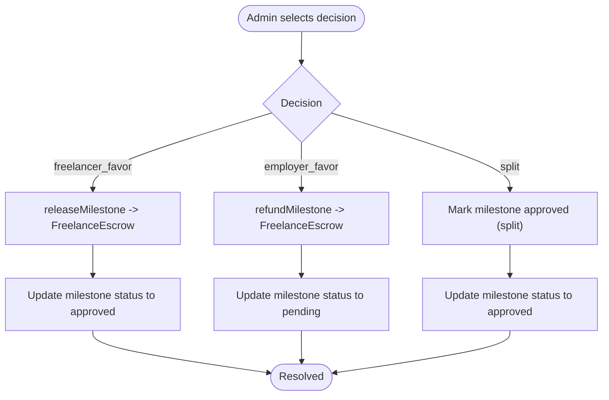
```mermaid
flowchart TD
Start(["Admin selects decision"]) --> Choice{"Decision"}
Choice --> |freelancer_favor| Release["releaseMilestone -> FreelanceEscrow"]
Choice --> |employer_favor| Refund["refundMilestone -> FreelanceEscrow"]
Choice --> |split| Approve["Mark milestone approved (split)"]
Release --> Update["Update milestone status to approved"]
Refund --> Update2["Update milestone status to pending"]
Approve --> Update3["Update milestone status to approved"]
Update --> End(["Resolved"])
Update2 --> End
Update3 --> End
```

**Diagram sources**
- [dispute-service.ts](file://src/services/dispute-service.ts#L367-L401)
- [escrow-contract.ts](file://src/services/escrow-contract.ts#L138-L264)
- [FreelanceEscrow.sol](file://contracts/FreelanceEscrow.sol#L178-L207)

**Section sources**
- [dispute-service.ts](file://src/services/dispute-service.ts#L367-L401)
- [escrow-contract.ts](file://src/services/escrow-contract.ts#L138-L264)

### On-Chain Recording and Fund Release
- Dispute outcome recorded immutably on DisputeResolution.sol.
- Arbitration decision stored with reasoning and arbiter wallet.
- Fund release/refund executed via FreelanceEscrow.sol methods invoked by the service.

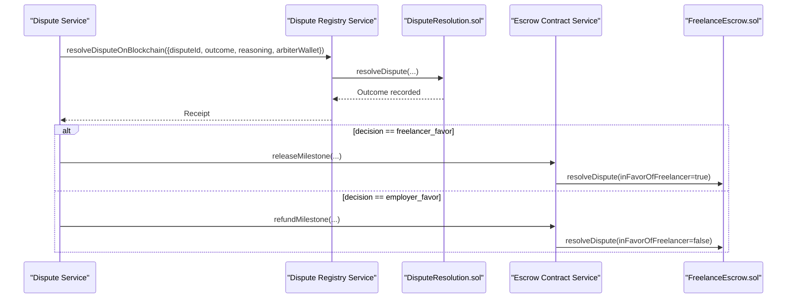
```mermaid
sequenceDiagram
participant S as "Dispute Service"
participant D as "Dispute Registry Service"
participant SC as "DisputeResolution.sol"
participant E as "Escrow Contract Service"
participant ESC as "FreelanceEscrow.sol"
S->>D : resolveDisputeOnBlockchain({disputeId, outcome, reasoning, arbiterWallet})
D->>SC : resolveDispute(...)
SC-->>D : Outcome recorded
D-->>S : Receipt
alt decision == freelancer_favor
S->>E : releaseMilestone(...)
E->>ESC : resolveDispute(inFavorOfFreelancer=true)
else decision == employer_favor
S->>E : refundMilestone(...)
E->>ESC : resolveDispute(inFavorOfFreelancer=false)
end
```

**Diagram sources**
- [dispute-service.ts](file://src/services/dispute-service.ts#L419-L456)
- [dispute-registry.ts](file://src/services/dispute-registry.ts#L191-L253)
- [DisputeResolution.sol](file://contracts/DisputeResolution.sol#L96-L126)
- [escrow-contract.ts](file://src/services/escrow-contract.ts#L138-L264)
- [FreelanceEscrow.sol](file://contracts/FreelanceEscrow.sol#L178-L207)

**Section sources**
- [dispute-registry.ts](file://src/services/dispute-registry.ts#L191-L253)
- [DisputeResolution.sol](file://contracts/DisputeResolution.sol#L96-L126)
- [escrow-contract.ts](file://src/services/escrow-contract.ts#L138-L264)
- [FreelanceEscrow.sol](file://contracts/FreelanceEscrow.sol#L178-L207)

### Example: Split Decision with Reasoning
- Scenario: Dispute resolved with split decision.
- Action: Mark milestone approved; partial release handled elsewhere.
- Reasoning: Include a detailed explanation in the reasoning field.

Note: The endpoint does not automatically split funds; it records the outcome and marks the milestone approved. Partial release logic is separate.

**Section sources**
- [dispute-service.ts](file://src/services/dispute-service.ts#L379-L383)
- [dispute-routes.ts](file://src/routes/dispute-routes.ts#L424-L486)

### Error Responses
Common HTTP statuses:
- 401 Unauthorized: Missing or invalid Bearer token.
- 403 Forbidden: Non-admin user attempts to resolve a dispute.
- 400 Bad Request: Invalid decision, missing reasoning, invalid UUID, or dispute already resolved.
- 404 Not Found: Dispute not found.

The route enforces admin role and validates inputs, while the service enforces uniqueness of roles and checks for already-resolved disputes.

**Section sources**
- [dispute-routes.ts](file://src/routes/dispute-routes.ts#L438-L451)
- [dispute-routes.ts](file://src/routes/dispute-routes.ts#L453-L465)
- [dispute-routes.ts](file://src/routes/dispute-routes.ts#L475-L479)
- [dispute-service.ts](file://src/services/dispute-service.ts#L322-L328)

### Audit Trails and Compliance Logging
- Off-chain:
  - DisputeService logs resolution actions and updates Dispute resolution metadata.
  - Notifications are sent to both parties upon resolution.
- On-chain:
  - DisputeResolution.sol emits DisputeResolved events with outcome, arbiter, and timestamp.
  - Escrow Contract Service records transaction receipts for fund releases/refunds.
- Recommendations:
  - Store timestamps, resolver identity, and reasoning in logs.
  - Maintain immutable chain of custody for evidence hashes and outcomes.
  - Ensure all sensitive fields are redacted or hashed in logs.

**Section sources**
- [dispute-service.ts](file://src/services/dispute-service.ts#L419-L456)
- [dispute-registry.ts](file://src/services/dispute-registry.ts#L191-L253)
- [DisputeResolution.sol](file://contracts/DisputeResolution.sol#L96-L126)
- [escrow-contract.ts](file://src/services/escrow-contract.ts#L138-L264)

## Dependency Analysis
- Route depends on:
  - Auth middleware for JWT validation and role extraction.
  - Validation middleware for UUID and request body validation.
  - Dispute service for business logic.
- Service depends on:
  - Escrow contract service for fund release/refund.
  - Dispute registry service for on-chain outcome recording.
  - Repositories and mappers for data access and model conversion.
- Contracts depend on:
  - DisputeResolution.sol for immutable outcome storage.
  - FreelanceEscrow.sol for fund movement.

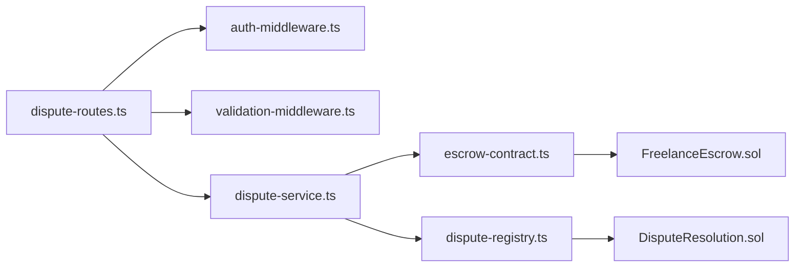
```mermaid
graph LR
Routes["dispute-routes.ts"] --> AuthMW["auth-middleware.ts"]
Routes --> ValMW["validation-middleware.ts"]
Routes --> Service["dispute-service.ts"]
Service --> EscrowSvc["escrow-contract.ts"]
Service --> RegistrySvc["dispute-registry.ts"]
RegistrySvc --> DisputeSC["DisputeResolution.sol"]
EscrowSvc --> EscrowSC["FreelanceEscrow.sol"]
```

**Diagram sources**
- [dispute-routes.ts](file://src/routes/dispute-routes.ts#L424-L486)
- [auth-middleware.ts](file://src/middleware/auth-middleware.ts#L25-L70)
- [validation-middleware.ts](file://src/middleware/validation-middleware.ts#L782-L800)
- [dispute-service.ts](file://src/services/dispute-service.ts#L296-L458)
- [escrow-contract.ts](file://src/services/escrow-contract.ts#L138-L264)
- [dispute-registry.ts](file://src/services/dispute-registry.ts#L191-L253)
- [FreelanceEscrow.sol](file://contracts/FreelanceEscrow.sol#L178-L207)
- [DisputeResolution.sol](file://contracts/DisputeResolution.sol#L96-L126)

**Section sources**
- [dispute-routes.ts](file://src/routes/dispute-routes.ts#L424-L486)
- [dispute-service.ts](file://src/services/dispute-service.ts#L296-L458)

## Performance Considerations
- Transaction latency: On-chain operations introduce network delays; batch or schedule notifications accordingly.
- Reentrancy protection: FreelanceEscrow.sol uses modifiers to prevent reentrancy during fund transfers.
- Validation overhead: Input validation is performed in middleware and service layers; keep schemas minimal and efficient.

[No sources needed since this section provides general guidance]

## Troubleshooting Guide
- 401 Unauthorized:
  - Ensure Authorization header is present and formatted as Bearer <token>.
  - Verify token is not expired.
- 403 Forbidden:
  - Confirm the user has role admin.
- 400 Bad Request:
  - Check decision is one of freelancer_favor, employer_favor, split.
  - Ensure reasoning is present and non-empty.
  - Validate disputeId is a valid UUID.
  - If receiving 400 for “already resolved,” confirm dispute status.
- 404 Not Found:
  - Verify disputeId exists and belongs to a valid contract/milestone.

**Section sources**
- [auth-middleware.ts](file://src/middleware/auth-middleware.ts#L25-L70)
- [dispute-routes.ts](file://src/routes/dispute-routes.ts#L438-L451)
- [dispute-routes.ts](file://src/routes/dispute-routes.ts#L453-L465)
- [dispute-routes.ts](file://src/routes/dispute-routes.ts#L475-L479)
- [dispute-service.ts](file://src/services/dispute-service.ts#L322-L328)

## Conclusion
The POST /api/disputes/{disputeId}/resolve endpoint enables admin-controlled dispute resolution with clear state transitions and financial implications. It integrates off-chain state updates with on-chain immutability and fund movements, ensuring transparent and auditable outcomes. Proper error handling and logging are essential for compliance and operational reliability.

[No sources needed since this section summarizes without analyzing specific files]

## Appendices

### API Definition Summary
- Method: POST
- Path: /api/disputes/{disputeId}/resolve
- Path parameters:
  - disputeId: UUID
- Headers:
  - Authorization: Bearer <token>
- Request body:
  - decision: enum freelancer_favor, employer_favor, split
  - reasoning: string, required
- Responses:
  - 200 OK: Dispute object with status resolved
  - 400 Bad Request: Validation or already-resolved
  - 401 Unauthorized: Missing/invalid token
  - 403 Forbidden: Non-admin user
  - 404 Not Found: Dispute not found

**Section sources**
- [dispute-routes.ts](file://src/routes/dispute-routes.ts#L385-L423)
- [dispute-routes.ts](file://src/routes/dispute-routes.ts#L424-L486)
- [validation-middleware.ts](file://src/middleware/validation-middleware.ts#L629-L638)
- [API-DOCUMENTATION.md](file://docs/API-DOCUMENTATION.md#L440-L483)

---

# Dispute Retrieval

<cite>
**Referenced Files in This Document**
- [dispute-routes.ts](file://src/routes/dispute-routes.ts)
- [dispute-service.ts](file://src/services/dispute-service.ts)
- [dispute-repository.ts](file://src/repositories/dispute-repository.ts)
- [auth-middleware.ts](file://src/middleware/auth-middleware.ts)
- [validation-middleware.ts](file://src/middleware/validation-middleware.ts)
- [swagger.ts](file://src/config/swagger.ts)
- [schema.sql](file://supabase/schema.sql)
- [entity-mapper.ts](file://src/utils/entity-mapper.ts)
</cite>

## Table of Contents
1. [Introduction](#introduction)
2. [Project Structure](#project-structure)
3. [Core Components](#core-components)
4. [Architecture Overview](#architecture-overview)
5. [Detailed Component Analysis](#detailed-component-analysis)
6. [Dependency Analysis](#dependency-analysis)
7. [Performance Considerations](#performance-considerations)
8. [Troubleshooting Guide](#troubleshooting-guide)
9. [Conclusion](#conclusion)
10. [Appendices](#appendices)

## Introduction
This document provides API documentation for dispute retrieval endpoints:
- GET /api/disputes/{disputeId}
- GET /api/contracts/{contractId}/disputes

It covers authentication requirements (JWT Bearer), access control (only involved parties and admins), request/response schemas, error handling, and the end-to-end data flow from route to service layer and database.

## Project Structure
The dispute retrieval functionality spans routing, middleware, service, repository, and data model layers.

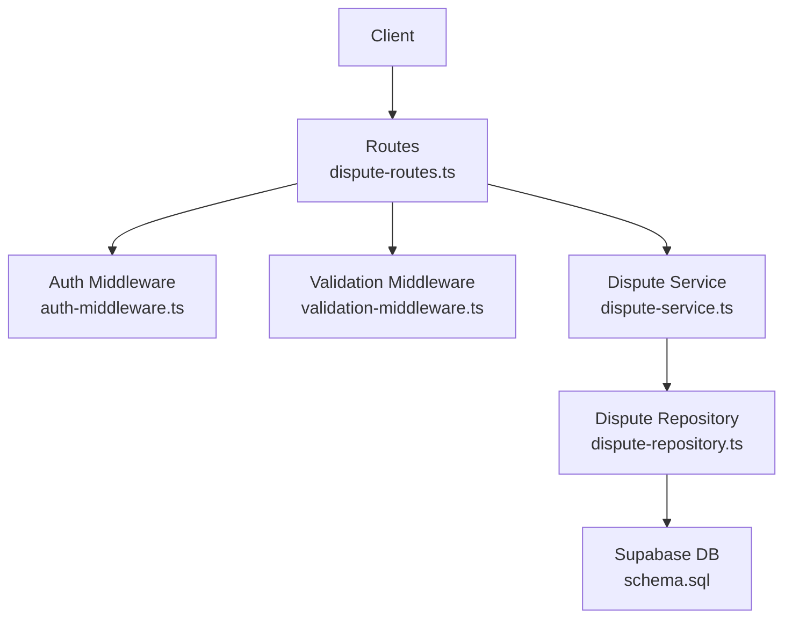
```mermaid
graph TB
Client["Client"]
Router["Routes<br/>dispute-routes.ts"]
AuthMW["Auth Middleware<br/>auth-middleware.ts"]
ValMW["Validation Middleware<br/>validation-middleware.ts"]
Service["Dispute Service<br/>dispute-service.ts"]
Repo["Dispute Repository<br/>dispute-repository.ts"]
DB["Supabase DB<br/>schema.sql"]
Client --> Router
Router --> AuthMW
Router --> ValMW
Router --> Service
Service --> Repo
Repo --> DB
```

**Diagram sources**
- [dispute-routes.ts](file://src/routes/dispute-routes.ts#L258-L555)
- [auth-middleware.ts](file://src/middleware/auth-middleware.ts#L25-L70)
- [validation-middleware.ts](file://src/middleware/validation-middleware.ts#L778-L800)
- [dispute-service.ts](file://src/services/dispute-service.ts#L461-L502)
- [dispute-repository.ts](file://src/repositories/dispute-repository.ts#L39-L132)
- [schema.sql](file://supabase/schema.sql#L108-L120)

**Section sources**
- [dispute-routes.ts](file://src/routes/dispute-routes.ts#L258-L555)
- [auth-middleware.ts](file://src/middleware/auth-middleware.ts#L25-L70)
- [validation-middleware.ts](file://src/middleware/validation-middleware.ts#L778-L800)
- [dispute-service.ts](file://src/services/dispute-service.ts#L461-L502)
- [dispute-repository.ts](file://src/repositories/dispute-repository.ts#L39-L132)
- [schema.sql](file://supabase/schema.sql#L108-L120)

## Core Components
- Route handlers enforce JWT authentication and UUID parameter validation, then delegate to the service layer.
- Service layer enforces access control by verifying the user’s association with the contract and performs database queries.
- Repository layer encapsulates Supabase queries for dispute records.
- Swagger defines the JWT security scheme and response schemas for Dispute, Evidence, and DisputeResolution.

Key responsibilities:
- Authentication: Bearer JWT via Authorization header.
- Access control: Only parties involved in the contract (employer or freelancer) may view disputes.
- Data mapping: Entities are mapped to API models for consistent JSON responses.

**Section sources**
- [swagger.ts](file://src/config/swagger.ts#L22-L28)
- [dispute-routes.ts](file://src/routes/dispute-routes.ts#L258-L555)
- [auth-middleware.ts](file://src/middleware/auth-middleware.ts#L25-L70)
- [dispute-service.ts](file://src/services/dispute-service.ts#L461-L502)
- [dispute-repository.ts](file://src/repositories/dispute-repository.ts#L39-L132)
- [entity-mapper.ts](file://src/utils/entity-mapper.ts#L312-L371)

## Architecture Overview
The retrieval flow follows a layered architecture: route -> middleware -> service -> repository -> database.

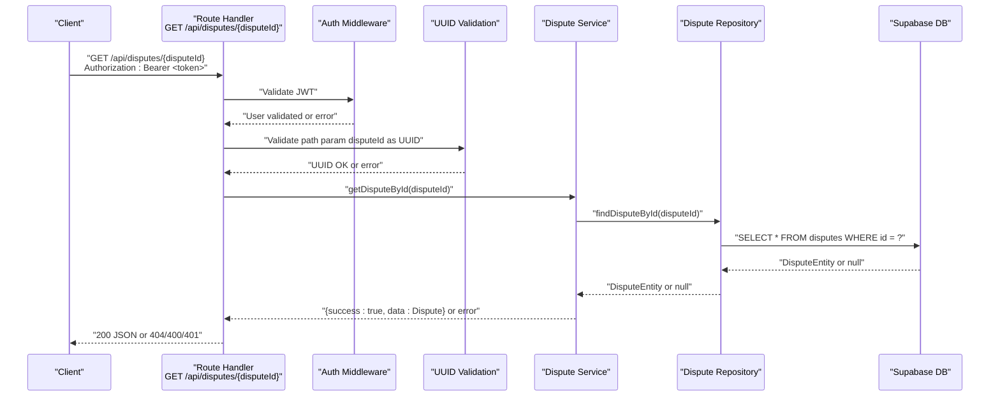
```mermaid
sequenceDiagram
participant C as "Client"
participant R as "Route Handler<br/>GET /api/disputes/{disputeId}"
participant A as "Auth Middleware"
participant V as "UUID Validation"
participant S as "Dispute Service"
participant P as "Dispute Repository"
participant D as "Supabase DB"
C->>R : "GET /api/disputes/{disputeId}<br/>Authorization : Bearer <token>"
R->>A : "Validate JWT"
A-->>R : "User validated or error"
R->>V : "Validate path param disputeId as UUID"
V-->>R : "UUID OK or error"
R->>S : "getDisputeById(disputeId)"
S->>P : "findDisputeById(disputeId)"
P->>D : "SELECT * FROM disputes WHERE id = ?"
D-->>P : "DisputeEntity or null"
P-->>S : "DisputeEntity or null"
S-->>R : "{success : true, data : Dispute} or error"
R-->>C : "200 JSON or 404/400/401"
```

**Diagram sources**
- [dispute-routes.ts](file://src/routes/dispute-routes.ts#L258-L287)
- [auth-middleware.ts](file://src/middleware/auth-middleware.ts#L25-L70)
- [validation-middleware.ts](file://src/middleware/validation-middleware.ts#L778-L800)
- [dispute-service.ts](file://src/services/dispute-service.ts#L461-L475)
- [dispute-repository.ts](file://src/repositories/dispute-repository.ts#L43-L53)
- [schema.sql](file://supabase/schema.sql#L108-L120)

## Detailed Component Analysis

### Endpoint: GET /api/disputes/{disputeId}
- Authentication: Required. Bearer JWT in Authorization header.
- Path parameter:
  - disputeId: UUID string. Validated by UUID middleware.
- Access control:
  - No explicit role restriction in route; service enforces that the user is associated with the contract via the contract repository.
- Response:
  - 200 OK with Dispute object containing:
    - id, contractId, milestoneId, initiatorId, reason
    - evidence: array of Evidence objects
    - status: one of open, under_review, resolved
    - resolution: DisputeResolution object or null
    - createdAt, updatedAt
- Error responses:
  - 400 Bad Request: Invalid UUID format.
  - 401 Unauthorized: Missing/invalid/expired JWT.
  - 404 Not Found: Dispute not found.

Response schema (Swagger-defined):
- Dispute: id, contractId, milestoneId, initiatorId, reason, evidence[], status, resolution?, createdAt, updatedAt
- Evidence: id, submitterId, type, content, submittedAt
- DisputeResolution: decision, reasoning, resolvedBy, resolvedAt

**Section sources**
- [dispute-routes.ts](file://src/routes/dispute-routes.ts#L227-L287)
- [swagger.ts](file://src/config/swagger.ts#L22-L28)
- [swagger.ts](file://src/config/swagger.ts#L22-L28)
- [dispute-service.ts](file://src/services/dispute-service.ts#L461-L475)
- [dispute-repository.ts](file://src/repositories/dispute-repository.ts#L43-L53)
- [entity-mapper.ts](file://src/utils/entity-mapper.ts#L312-L371)

### Endpoint: GET /api/contracts/{contractId}/disputes
- Authentication: Required. Bearer JWT.
- Path parameter:
  - contractId: UUID string. Validated by UUID middleware.
- Access control:
  - Only employer or freelancer associated with the contract may retrieve disputes.
- Response:
  - 200 OK with array of Dispute objects for the given contract.
- Error responses:
  - 400 Bad Request: Invalid UUID format.
  - 401 Unauthorized: Missing/invalid/expired JWT.
  - 403 Forbidden: User not associated with the contract.
  - 404 Not Found: Contract not found.

Pagination and filtering:
- Repository supports paginated queries with limit and offset, and ordering by created_at descending.
- Current route handler does not expose query parameters for pagination/filtering; consumers should implement client-side pagination or request server-side pagination parameters if needed.

**Section sources**
- [dispute-routes.ts](file://src/routes/dispute-routes.ts#L490-L555)
- [dispute-service.ts](file://src/services/dispute-service.ts#L478-L502)
- [dispute-repository.ts](file://src/repositories/dispute-repository.ts#L55-L86)
- [swagger.ts](file://src/config/swagger.ts#L22-L28)

### Data Flow and Database Queries
- Single dispute retrieval:
  - Route validates JWT and UUID.
  - Service calls repository to find dispute by ID.
  - Repository executes a SELECT query on the disputes table by id.
  - Service maps entity to API model and returns.
- Contract-level disputes:
  - Route validates JWT and UUID.
  - Service verifies contract existence and user association.
  - Service retrieves all disputes for the contract ordered by created_at desc.
  - Repository executes a SELECT with equality filter on contract_id and ordering.

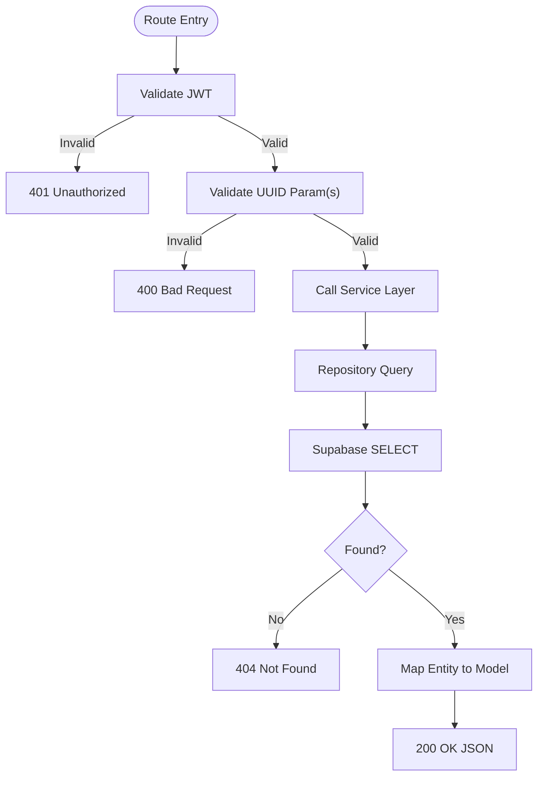
```mermaid
flowchart TD
Start(["Route Entry"]) --> Auth["Validate JWT"]
Auth --> |Invalid| E401["401 Unauthorized"]
Auth --> |Valid| UUID["Validate UUID Param(s)"]
UUID --> |Invalid| E400["400 Bad Request"]
UUID --> |Valid| ServiceCall["Call Service Layer"]
ServiceCall --> RepoCall["Repository Query"]
RepoCall --> DBQuery["Supabase SELECT"]
DBQuery --> Result{"Found?"}
Result --> |No| E404["404 Not Found"]
Result --> |Yes| Map["Map Entity to Model"]
Map --> Ok["200 OK JSON"]
```

**Diagram sources**
- [dispute-routes.ts](file://src/routes/dispute-routes.ts#L258-L555)
- [dispute-service.ts](file://src/services/dispute-service.ts#L461-L502)
- [dispute-repository.ts](file://src/repositories/dispute-repository.ts#L39-L132)
- [schema.sql](file://supabase/schema.sql#L108-L120)

## Dependency Analysis
- Routes depend on:
  - Auth middleware for JWT validation.
  - Validation middleware for UUID parameter checks.
  - Dispute service for business logic.
- Service depends on:
  - Dispute repository for data access.
  - Contract repository to verify user association.
  - User repository to map wallets for blockchain recording.
- Repository depends on:
  - Supabase client configured in base repository.
  - Disputes table schema.

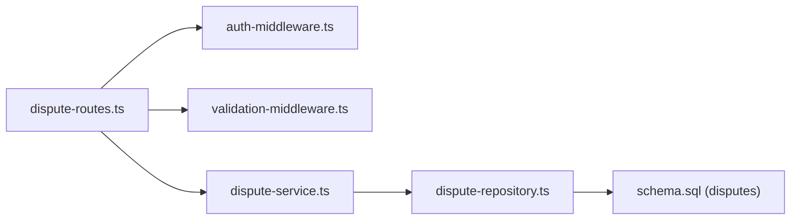
```mermaid
graph LR
Routes["dispute-routes.ts"] --> AuthMW["auth-middleware.ts"]
Routes --> ValMW["validation-middleware.ts"]
Routes --> Service["dispute-service.ts"]
Service --> Repo["dispute-repository.ts"]
Repo --> DB["schema.sql (disputes)"]
```

**Diagram sources**
- [dispute-routes.ts](file://src/routes/dispute-routes.ts#L258-L555)
- [auth-middleware.ts](file://src/middleware/auth-middleware.ts#L25-L70)
- [validation-middleware.ts](file://src/middleware/validation-middleware.ts#L778-L800)
- [dispute-service.ts](file://src/services/dispute-service.ts#L461-L502)
- [dispute-repository.ts](file://src/repositories/dispute-repository.ts#L39-L132)
- [schema.sql](file://supabase/schema.sql#L108-L120)

**Section sources**
- [dispute-routes.ts](file://src/routes/dispute-routes.ts#L258-L555)
- [auth-middleware.ts](file://src/middleware/auth-middleware.ts#L25-L70)
- [validation-middleware.ts](file://src/middleware/validation-middleware.ts#L778-L800)
- [dispute-service.ts](file://src/services/dispute-service.ts#L461-L502)
- [dispute-repository.ts](file://src/repositories/dispute-repository.ts#L39-L132)
- [schema.sql](file://supabase/schema.sql#L108-L120)

## Performance Considerations
- Indexing: The disputes table has an index on contract_id, which optimizes contract-level queries.
- Ordering: Results are ordered by created_at descending to show newest disputes first.
- Pagination: Repository supports limit/offset; current route handlers do not expose query parameters. Consider adding limit and offset query parameters to the contract-level endpoint for scalable retrieval.

[No sources needed since this section provides general guidance]

## Troubleshooting Guide
Common issues and resolutions:
- 401 Unauthorized:
  - Missing Authorization header or invalid Bearer token format.
  - Token expired or invalid.
- 400 Bad Request:
  - Path parameter disputeId or contractId is not a valid UUID.
- 403 Forbidden:
  - Accessing contract-level disputes without being an employer or freelancer in that contract.
- 404 Not Found:
  - Dispute not found by ID.
  - Contract not found by ID.

Operational tips:
- Ensure Authorization header is present and formatted as "Bearer <token>".
- Confirm UUIDs are valid v4 UUIDs.
- Verify the user belongs to the contract for contract-level retrieval.

**Section sources**
- [auth-middleware.ts](file://src/middleware/auth-middleware.ts#L25-L70)
- [validation-middleware.ts](file://src/middleware/validation-middleware.ts#L778-L800)
- [dispute-service.ts](file://src/services/dispute-service.ts#L478-L502)
- [dispute-service.ts](file://src/services/dispute-service.ts#L461-L475)

## Conclusion
The dispute retrieval endpoints are secured with JWT and enforce strict access control. The service layer ensures only parties involved in a contract can view its disputes. Responses conform to Swagger-defined schemas, and the repository layer efficiently queries the Supabase database with proper indexing and ordering.

[No sources needed since this section summarizes without analyzing specific files]

## Appendices

### API Definitions

- GET /api/disputes/{disputeId}
  - Authentication: Bearer JWT
  - Path parameters:
    - disputeId: UUID
  - Responses:
    - 200: Dispute object
    - 400: Invalid UUID
    - 401: Unauthorized
    - 404: Dispute not found

- GET /api/contracts/{contractId}/disputes
  - Authentication: Bearer JWT
  - Path parameters:
    - contractId: UUID
  - Responses:
    - 200: Array of Dispute objects
    - 400: Invalid UUID
    - 401: Unauthorized
    - 403: Not authorized to view disputes
    - 404: Contract not found

**Section sources**
- [dispute-routes.ts](file://src/routes/dispute-routes.ts#L227-L287)
- [dispute-routes.ts](file://src/routes/dispute-routes.ts#L490-L555)
- [swagger.ts](file://src/config/swagger.ts#L22-L28)

### Response Schemas

- Dispute
  - Fields: id, contractId, milestoneId, initiatorId, reason, evidence[], status, resolution?, createdAt, updatedAt
- Evidence
  - Fields: id, submitterId, type, content, submittedAt
- DisputeResolution
  - Fields: decision, reasoning, resolvedBy, resolvedAt

**Section sources**
- [swagger.ts](file://src/config/swagger.ts#L22-L28)
- [entity-mapper.ts](file://src/utils/entity-mapper.ts#L312-L371)

### Example Requests and Expected Outcomes

- Retrieve a specific dispute:
  - Request: GET /api/disputes/{valid-dispute-id} with Authorization: Bearer <token>
  - Outcome: 200 OK with Dispute JSON

- List all disputes for a contract:
  - Request: GET /api/contracts/{valid-contract-id}/disputes with Authorization: Bearer <token>
  - Outcome: 200 OK with array of Dispute JSON

- Unauthorized access:
  - Request: GET /api/contracts/{contract-id}/disputes without valid JWT
  - Outcome: 401 Unauthorized

- Non-existent dispute:
  - Request: GET /api/disputes/{nonexistent-id} with valid JWT
  - Outcome: 404 Not Found

- Invalid UUID:
  - Request: GET /api/disputes/invalid-id with valid JWT
  - Outcome: 400 Bad Request

**Section sources**
- [dispute-routes.ts](file://src/routes/dispute-routes.ts#L258-L555)
- [auth-middleware.ts](file://src/middleware/auth-middleware.ts#L25-L70)
- [validation-middleware.ts](file://src/middleware/validation-middleware.ts#L778-L800)
- [dispute-service.ts](file://src/services/dispute-service.ts#L461-L502)

---

# Evidence Submission

<cite>
**Referenced Files in This Document**
- [dispute-routes.ts](file://src/routes/dispute-routes.ts)
- [dispute-service.ts](file://src/services/dispute-service.ts)
- [dispute-repository.ts](file://src/repositories/dispute-repository.ts)
- [validation-middleware.ts](file://src/middleware/validation-middleware.ts)
- [auth-middleware.ts](file://src/middleware/auth-middleware.ts)
- [entity-mapper.ts](file://src/utils/entity-mapper.ts)
- [dispute-registry.ts](file://src/services/dispute-registry.ts)
- [DisputeResolution.sol](file://contracts/DisputeResolution.sol)
- [blockchain-client.ts](file://src/services/blockchain-client.ts)
- [error-handler.ts](file://src/middleware/error-handler.ts)
</cite>

## Table of Contents
1. [Introduction](#introduction)
2. [Project Structure](#project-structure)
3. [Core Components](#core-components)
4. [Architecture Overview](#architecture-overview)
5. [Detailed Component Analysis](#detailed-component-analysis)
6. [Dependency Analysis](#dependency-analysis)
7. [Performance Considerations](#performance-considerations)
8. [Troubleshooting Guide](#troubleshooting-guide)
9. [Conclusion](#conclusion)

## Introduction
This document describes the API for submitting evidence to an active dispute. It covers the endpoint path, authentication, request schema, validation rules, error responses, and the integration with the blockchain-based evidence logging contract. It also provides examples for each evidence type and client-side implementation tips.

## Project Structure
The evidence submission endpoint is implemented as a REST POST route that is secured with JWT authentication, validated by request and parameter schemas, and processed by a service layer that persists the evidence and updates the blockchain log.

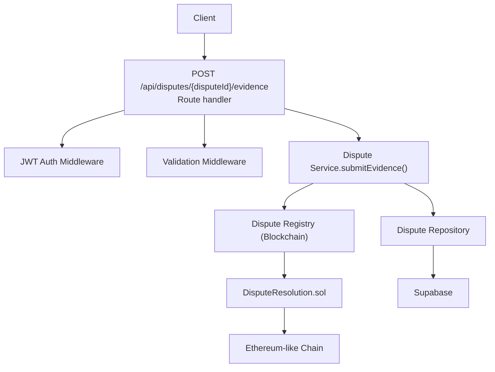
```mermaid
graph TB
Client["Client"] --> Route["POST /api/disputes/{disputeId}/evidence<br/>Route handler"]
Route --> Auth["JWT Auth Middleware"]
Route --> Validator["Validation Middleware"]
Route --> Service["Dispute Service.submitEvidence()"]
Service --> Repo["Dispute Repository"]
Service --> Registry["Dispute Registry (Blockchain)"]
Registry --> Contract["DisputeResolution.sol"]
Repo --> DB["Supabase"]
Contract --> Chain["Ethereum-like Chain"]
```

**Diagram sources**
- [dispute-routes.ts](file://src/routes/dispute-routes.ts#L290-L382)
- [auth-middleware.ts](file://src/middleware/auth-middleware.ts#L25-L70)
- [validation-middleware.ts](file://src/middleware/validation-middleware.ts#L618-L627)
- [dispute-service.ts](file://src/services/dispute-service.ts#L213-L293)
- [dispute-repository.ts](file://src/repositories/dispute-repository.ts#L34-L53)
- [dispute-registry.ts](file://src/services/dispute-registry.ts#L147-L189)
- [DisputeResolution.sol](file://contracts/DisputeResolution.sol#L84-L94)

**Section sources**
- [dispute-routes.ts](file://src/routes/dispute-routes.ts#L290-L382)

## Core Components
- Endpoint: POST /api/disputes/{disputeId}/evidence
- Path parameter: disputeId (UUID)
- Authentication: Bearer JWT via auth middleware
- Request body schema:
  - type: string, enum [text, file, link]
  - content: string (required)
- Validation:
  - type must be one of the allowed values
  - content must be a non-empty string
  - disputeId must be a valid UUID
- Authorization:
  - Only parties to the underlying contract (employer or freelancer) may submit evidence while the dispute is open or under_review
- Response:
  - Updated Dispute object with appended evidence
- Blockchain integration:
  - Evidence hash is recorded on-chain via DisputeResolution contract

**Section sources**
- [dispute-routes.ts](file://src/routes/dispute-routes.ts#L290-L382)
- [validation-middleware.ts](file://src/middleware/validation-middleware.ts#L618-L627)
- [dispute-service.ts](file://src/services/dispute-service.ts#L213-L293)
- [dispute-repository.ts](file://src/repositories/dispute-repository.ts#L34-L53)
- [entity-mapper.ts](file://src/utils/entity-mapper.ts#L312-L371)

## Architecture Overview
The request flow for evidence submission:

```mermaid
sequenceDiagram
participant C as "Client"
participant R as "Route Handler"
participant A as "Auth Middleware"
participant V as "Validation Middleware"
participant S as "Dispute Service"
participant D as "Dispute Repository"
participant B as "Dispute Registry"
participant X as "DisputeResolution.sol"
C->>R : POST /api/disputes/{disputeId}/evidence
R->>A : Validate JWT
A-->>R : Authorized user
R->>V : Validate request body and path params
V-->>R : Valid
R->>S : submitEvidence({disputeId, submitterId, type, content})
S->>D : Load dispute and verify status
D-->>S : Dispute entity
S->>S : Append evidence and set status to under_review if needed
S->>D : Persist updated dispute
S->>B : updateDisputeEvidence(disputeId, evidenceData, submitterWallet)
B->>X : updateEvidence(disputeIdHash, evidenceHash)
X-->>B : Confirmed
B-->>S : Receipt
S-->>R : Updated Dispute with appended evidence
R-->>C : 200 OK with Dispute
```

**Diagram sources**
- [dispute-routes.ts](file://src/routes/dispute-routes.ts#L328-L381)
- [auth-middleware.ts](file://src/middleware/auth-middleware.ts#L25-L70)
- [validation-middleware.ts](file://src/middleware/validation-middleware.ts#L618-L627)
- [dispute-service.ts](file://src/services/dispute-service.ts#L213-L293)
- [dispute-repository.ts](file://src/repositories/dispute-repository.ts#L34-L53)
- [dispute-registry.ts](file://src/services/dispute-registry.ts#L147-L189)
- [DisputeResolution.sol](file://contracts/DisputeResolution.sol#L84-L94)

## Detailed Component Analysis

### Endpoint Definition
- Method: POST
- Path: /api/disputes/{disputeId}/evidence
- Security: bearerAuth (JWT required)
- Path parameters:
  - disputeId: string, format uuid
- Request body:
  - type: string, enum [text, file, link]
  - content: string (non-empty)
- Responses:
  - 200 OK: Dispute object with appended evidence
  - 400 Bad Request: Validation errors or invalid status
  - 401 Unauthorized: Missing/invalid/expired JWT
  - 403 Forbidden: Not authorized to submit evidence
  - 404 Not Found: Dispute not found

**Section sources**
- [dispute-routes.ts](file://src/routes/dispute-routes.ts#L290-L382)
- [validation-middleware.ts](file://src/middleware/validation-middleware.ts#L618-L627)

### Authentication and Authorization
- Authentication: Route uses auth middleware to validate JWT and attach user info to the request.
- Authorization: Service verifies that the submitter is either the employer or freelancer in the contract associated with the dispute.

**Section sources**
- [auth-middleware.ts](file://src/middleware/auth-middleware.ts#L25-L70)
- [dispute-service.ts](file://src/services/dispute-service.ts#L235-L249)

### Request Validation
- Body schema enforces:
  - type must be one of [text, file, link]
  - content must be a non-empty string
- Path parameter schema enforces:
  - disputeId must be a valid UUID

**Section sources**
- [validation-middleware.ts](file://src/middleware/validation-middleware.ts#L618-L627)
- [dispute-routes.ts](file://src/routes/dispute-routes.ts#L328-L336)

### Evidence Submission Logic
- Load dispute by ID
- Reject if dispute status is resolved
- Verify submitter is a party to the contract
- Create evidence entity with generated ID, submitterId, type, content, and timestamp
- Append evidence to dispute and set status to under_review if currently open
- Persist updated dispute
- Compute evidenceData JSON and update blockchain evidence hash

```mermaid
flowchart TD
Start(["submitEvidence"]) --> Load["Load dispute by ID"]
Load --> Found{"Dispute found?"}
Found --> |No| NotFound["Return NOT_FOUND"]
Found --> |Yes| StatusCheck["Check status != resolved"]
StatusCheck --> |Resolved| InvalidStatus["Return INVALID_STATUS"]
StatusCheck --> |Open/Under Review| PartyCheck["Verify submitter is employer or freelancer"]
PartyCheck --> |Unauthorized| Unauth["Return UNAUTHORIZED"]
PartyCheck --> |Authorized| Build["Build evidence entity"]
Build --> Append["Append to dispute evidence"]
Append --> StatusUpdate{"Was status open?"}
StatusUpdate --> |Yes| SetReview["Set status under_review"]
StatusUpdate --> |No| Keep["Keep current status"]
SetReview --> Persist["Persist updated dispute"]
Keep --> Persist
Persist --> Hash["Compute evidenceData JSON and hash"]
Hash --> Block["updateDisputeEvidence on blockchain"]
Block --> Done(["Return updated Dispute"])
```

**Diagram sources**
- [dispute-service.ts](file://src/services/dispute-service.ts#L213-L293)
- [dispute-repository.ts](file://src/repositories/dispute-repository.ts#L34-L53)
- [dispute-registry.ts](file://src/services/dispute-registry.ts#L147-L189)

**Section sources**
- [dispute-service.ts](file://src/services/dispute-service.ts#L213-L293)

### Blockchain Integration
- Backend computes a JSON string of the updated evidence array and hashes it.
- Calls updateDisputeEvidence with the disputeId, evidenceData hash, and submitter’s wallet address.
- The DisputeResolution.sol contract stores the evidenceHash for the given disputeIdHash.
- The registry simulates transaction submission and confirmation; in production, this would interact with a real Ethereum-like chain.

```mermaid
sequenceDiagram
participant S as "Dispute Service"
participant R as "Dispute Registry"
participant C as "DisputeResolution.sol"
S->>R : updateDisputeEvidence(disputeId, evidenceData, submitterWallet)
R->>R : compute evidenceData JSON and hash
R->>C : updateEvidence(disputeIdHash, evidenceHash)
C-->>R : Confirmed
R-->>S : Receipt
```

**Diagram sources**
- [dispute-service.ts](file://src/services/dispute-service.ts#L281-L291)
- [dispute-registry.ts](file://src/services/dispute-registry.ts#L147-L189)
- [DisputeResolution.sol](file://contracts/DisputeResolution.sol#L84-L94)

**Section sources**
- [dispute-registry.ts](file://src/services/dispute-registry.ts#L147-L189)
- [blockchain-client.ts](file://src/services/blockchain-client.ts#L131-L206)
- [DisputeResolution.sol](file://contracts/DisputeResolution.sol#L84-L94)

### Data Model and Response
- Evidence entity fields:
  - id: string
  - submitterId: string
  - type: "text" | "file" | "link"
  - content: string
  - submittedAt: ISO date-time string
- Dispute model includes:
  - evidence: Evidence[]
  - status: "open" | "under_review" | "resolved"
- Response returns the updated Dispute with the newly appended evidence.

**Section sources**
- [dispute-repository.ts](file://src/repositories/dispute-repository.ts#L6-L13)
- [entity-mapper.ts](file://src/utils/entity-mapper.ts#L312-L371)

## Dependency Analysis
- Route depends on:
  - auth-middleware for JWT validation
  - validation-middleware for request and path parameter validation
  - dispute-service for business logic
- Service depends on:
  - dispute-repository for persistence
  - dispute-registry for blockchain updates
  - entity-mapper for model conversion
- Registry depends on:
  - blockchain-client for transaction submission and confirmation
  - DisputeResolution.sol for on-chain operations

```mermaid
graph LR
Routes["dispute-routes.ts"] --> Auth["auth-middleware.ts"]
Routes --> Val["validation-middleware.ts"]
Routes --> Service["dispute-service.ts"]
Service --> Repo["dispute-repository.ts"]
Service --> Registry["dispute-registry.ts"]
Registry --> Client["blockchain-client.ts"]
Registry --> Contract["DisputeResolution.sol"]
```

**Diagram sources**
- [dispute-routes.ts](file://src/routes/dispute-routes.ts#L290-L382)
- [auth-middleware.ts](file://src/middleware/auth-middleware.ts#L25-L70)
- [validation-middleware.ts](file://src/middleware/validation-middleware.ts#L618-L627)
- [dispute-service.ts](file://src/services/dispute-service.ts#L213-L293)
- [dispute-repository.ts](file://src/repositories/dispute-repository.ts#L34-L53)
- [dispute-registry.ts](file://src/services/dispute-registry.ts#L147-L189)
- [blockchain-client.ts](file://src/services/blockchain-client.ts#L131-L206)
- [DisputeResolution.sol](file://contracts/DisputeResolution.sol#L84-L94)

**Section sources**
- [dispute-routes.ts](file://src/routes/dispute-routes.ts#L290-L382)
- [dispute-service.ts](file://src/services/dispute-service.ts#L213-L293)

## Performance Considerations
- Evidence submission is lightweight: JSON serialization of evidence array and hashing are fast.
- Blockchain operations are asynchronous and simulated in this codebase; in production, latency depends on network confirmation times.
- Consider batching evidence submissions if clients need to upload multiple pieces of evidence.

[No sources needed since this section provides general guidance]

## Troubleshooting Guide
Common error scenarios and their causes:
- 400 Bad Request
  - Invalid type or missing content
  - Invalid UUID format for disputeId
  - Attempting to submit evidence to a resolved dispute
- 401 Unauthorized
  - Missing Authorization header or invalid/expired JWT
- 403 Forbidden
  - User is not a party to the contract associated with the dispute
- 404 Not Found
  - Dispute not found

**Section sources**
- [dispute-routes.ts](file://src/routes/dispute-routes.ts#L328-L381)
- [auth-middleware.ts](file://src/middleware/auth-middleware.ts#L25-L70)
- [dispute-service.ts](file://src/services/dispute-service.ts#L227-L249)
- [error-handler.ts](file://src/middleware/error-handler.ts#L40-L83)

## Conclusion
The evidence submission endpoint securely accepts text, file, or link-based evidence from authorized parties during open or under_review disputes. It persists the evidence locally and records an immutable evidence hash on-chain for transparency. Clients should ensure proper JWT usage, validate inputs, and handle asynchronous blockchain confirmations.