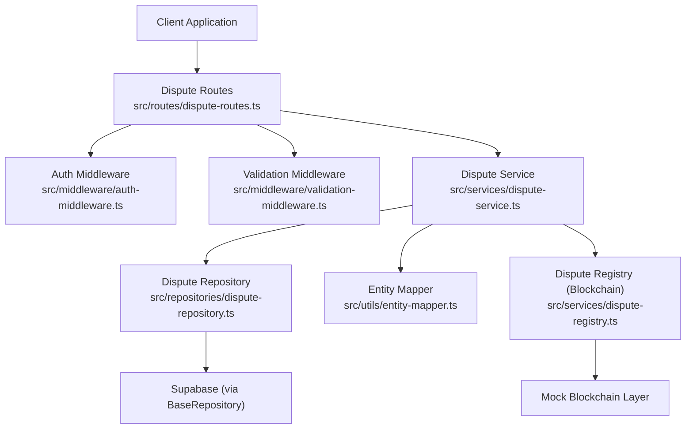
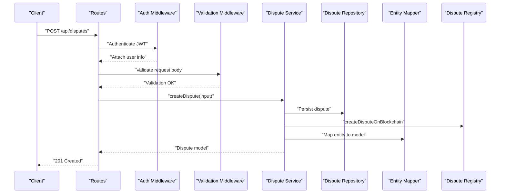
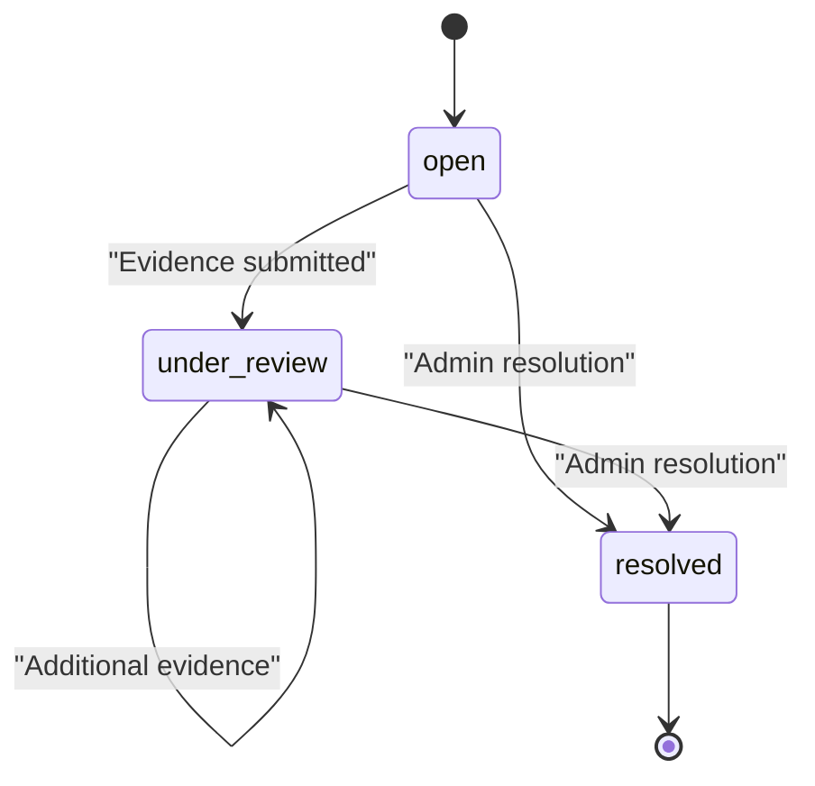
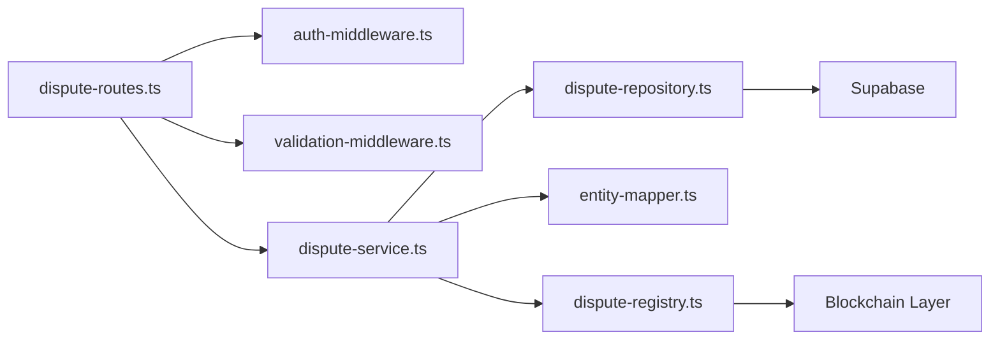

# Dispute API

<cite>
**Referenced Files in This Document**
- [dispute-routes.ts](file://src/routes/dispute-routes.ts)
- [dispute-service.ts](file://src/services/dispute-service.ts)
- [dispute-repository.ts](file://src/repositories/dispute-repository.ts)
- [entity-mapper.ts](file://src/utils/entity-mapper.ts)
- [auth-middleware.ts](file://src/middleware/auth-middleware.ts)
- [validation-middleware.ts](file://src/middleware/validation-middleware.ts)
- [dispute-registry.ts](file://src/services/dispute-registry.ts)
- [API-DOCUMENTATION.md](file://docs/API-DOCUMENTATION.md)
- [swagger.ts](file://src/config/swagger.ts)
</cite>

## Table of Contents
1. [Introduction](#introduction)
2. [Project Structure](#project-structure)
3. [Core Components](#core-components)
4. [Architecture Overview](#architecture-overview)
5. [Detailed Component Analysis](#detailed-component-analysis)
6. [Dependency Analysis](#dependency-analysis)
7. [Performance Considerations](#performance-considerations)
8. [Troubleshooting Guide](#troubleshooting-guide)
9. [Conclusion](#conclusion)
10. [Appendices](#appendices)

## Introduction
This document provides comprehensive API documentation for the dispute resolution system in the FreelanceXchain platform. It covers all dispute-related endpoints: creating disputes, submitting evidence, resolving disputes, and retrieving dispute information. It also documents authentication requirements (JWT), validation rules, role-based access controls, the dispute status lifecycle, and blockchain recording of outcomes. Client implementation examples are included to help developers integrate dispute workflows.

## Project Structure
The dispute functionality spans routing, service orchestration, persistence, and blockchain integration layers. The routes define the HTTP endpoints and apply middleware for authentication and validation. The service layer enforces business rules, interacts with repositories, and triggers blockchain operations. The repository layer abstracts database access. The entity mapper converts between database entities and API models. The validation middleware ensures request payloads conform to schemas.

**Diagram sources**
- [dispute-routes.ts](file://src/routes/dispute-routes.ts#L1-L558)
- [auth-middleware.ts](file://src/middleware/auth-middleware.ts#L1-L101)
- [validation-middleware.ts](file://src/middleware/validation-middleware.ts#L1-L815)
- [dispute-service.ts](file://src/services/dispute-service.ts#L1-L521)
- [dispute-repository.ts](file://src/repositories/dispute-repository.ts#L1-L136)
- [entity-mapper.ts](file://src/utils/entity-mapper.ts#L312-L371)
- [dispute-registry.ts](file://src/services/dispute-registry.ts#L1-L289)

**Section sources**
- [dispute-routes.ts](file://src/routes/dispute-routes.ts#L1-L558)
- [dispute-service.ts](file://src/services/dispute-service.ts#L1-L521)
- [dispute-repository.ts](file://src/repositories/dispute-repository.ts#L1-L136)
- [entity-mapper.ts](file://src/utils/entity-mapper.ts#L312-L371)
- [auth-middleware.ts](file://src/middleware/auth-middleware.ts#L1-L101)
- [validation-middleware.ts](file://src/middleware/validation-middleware.ts#L1-L815)
- [dispute-registry.ts](file://src/services/dispute-registry.ts#L1-L289)

## Core Components
- Dispute Routes: Define endpoints for creating disputes, retrieving dispute details, submitting evidence, resolving disputes, and listing disputes by contract.
- Dispute Service: Implements business logic for dispute creation, evidence submission, and resolution, including validations, status transitions, and blockchain interactions.
- Dispute Repository: Persists and retrieves dispute records, manages pagination, and enforces uniqueness constraints.
- Entity Mapper: Converts between database entities and API models for Disputes, Evidence, and DisputeResolution.
- Auth Middleware: Enforces JWT-based authentication and attaches user identity to requests.
- Validation Middleware: Provides robust request validation for UUIDs and payload schemas.
- Dispute Registry (Blockchain): Simulates on-chain recording of disputes, evidence updates, and resolutions.

**Section sources**
- [dispute-routes.ts](file://src/routes/dispute-routes.ts#L1-L558)
- [dispute-service.ts](file://src/services/dispute-service.ts#L1-L521)
- [dispute-repository.ts](file://src/repositories/dispute-repository.ts#L1-L136)
- [entity-mapper.ts](file://src/utils/entity-mapper.ts#L312-L371)
- [auth-middleware.ts](file://src/middleware/auth-middleware.ts#L1-L101)
- [validation-middleware.ts](file://src/middleware/validation-middleware.ts#L606-L638)
- [dispute-registry.ts](file://src/services/dispute-registry.ts#L1-L289)

## Architecture Overview
The dispute API follows a layered architecture:
- HTTP Layer: Routes define endpoints and apply middleware.
- Service Layer: Orchestrates business logic, repository interactions, and blockchain operations.
- Persistence Layer: Supabase-backed repository with typed entities.
- Presentation Layer: Entity mapper exposes API-friendly models.
- Security Layer: JWT authentication and role checks.

**Diagram sources**
- [dispute-routes.ts](file://src/routes/dispute-routes.ts#L149-L224)
- [auth-middleware.ts](file://src/middleware/auth-middleware.ts#L25-L70)
- [validation-middleware.ts](file://src/middleware/validation-middleware.ts#L606-L638)
- [dispute-service.ts](file://src/services/dispute-service.ts#L67-L206)
- [dispute-repository.ts](file://src/repositories/dispute-repository.ts#L39-L41)
- [entity-mapper.ts](file://src/utils/entity-mapper.ts#L353-L371)
- [dispute-registry.ts](file://src/services/dispute-registry.ts#L69-L145)

## Detailed Component Analysis

### Endpoint Definitions and Schemas

#### Authentication
- All protected endpoints require a Bearer token in the Authorization header.
- Token format: Bearer <JWT>.
- Role checks:
  - Creating disputes: Contract party only.
  - Submitting evidence: Contract party only.
  - Resolving disputes: Admin only.

**Section sources**
- [API-DOCUMENTATION.md](file://docs/API-DOCUMENTATION.md#L7-L13)
- [swagger.ts](file://src/config/swagger.ts#L22-L28)
- [dispute-routes.ts](file://src/routes/dispute-routes.ts#L446-L451)

#### Create Dispute
- Method: POST
- URL: /api/disputes
- Authentication: JWT required
- Request body:
  - contractId: string (UUID)
  - milestoneId: string (UUID)
  - reason: string (non-empty)
- Response:
  - 201 Created with Dispute model
  - 400 Bad Request (validation errors)
  - 401 Unauthorized (missing/invalid token)
  - 403 Forbidden (not a contract party)
  - 404 Not Found (contract/milestone not found)
  - 409 Conflict (already disputed or duplicate dispute)
- Lifecycle:
  - Validates contract and milestone existence.
  - Ensures milestone is not already disputed or approved.
  - Prevents duplicate active disputes for the same milestone.
  - Sets initial status to open.
  - Updates milestone and contract statuses.
  - Records on blockchain and notifies both parties.

**Section sources**
- [dispute-routes.ts](file://src/routes/dispute-routes.ts#L149-L224)
- [dispute-service.ts](file://src/services/dispute-service.ts#L67-L206)
- [dispute-repository.ts](file://src/repositories/dispute-repository.ts#L88-L90)
- [entity-mapper.ts](file://src/utils/entity-mapper.ts#L312-L371)
- [dispute-registry.ts](file://src/services/dispute-registry.ts#L69-L145)

#### Retrieve Dispute Details
- Method: GET
- URL: /api/disputes/{disputeId}
- Path parameter: disputeId (UUID)
- Authentication: JWT required
- Response:
  - 200 OK with Dispute model
  - 400 Bad Request (invalid UUID)
  - 401 Unauthorized
  - 404 Not Found

**Section sources**
- [dispute-routes.ts](file://src/routes/dispute-routes.ts#L258-L287)
- [dispute-service.ts](file://src/services/dispute-service.ts#L461-L475)

#### Submit Evidence
- Method: POST
- URL: /api/disputes/{disputeId}/evidence
- Path parameter: disputeId (UUID)
- Authentication: JWT required
- Request body:
  - type: enum [text, file, link]
  - content: string (non-empty)
- Response:
  - 200 OK with updated Dispute model
  - 400 Bad Request (validation errors or resolved dispute)
  - 401 Unauthorized
  - 403 Forbidden (not a contract party)
  - 404 Not Found
- Lifecycle:
  - Validates dispute exists and is not resolved.
  - Verifies submitter is a contract party.
  - Adds evidence and transitions status to under_review if previously open.
  - Updates blockchain evidence hash.

**Section sources**
- [dispute-routes.ts](file://src/routes/dispute-routes.ts#L290-L382)
- [dispute-service.ts](file://src/services/dispute-service.ts#L209-L293)
- [dispute-registry.ts](file://src/services/dispute-registry.ts#L148-L189)

#### Resolve Dispute (Admin)
- Method: POST
- URL: /api/disputes/{disputeId}/resolve
- Path parameter: disputeId (UUID)
- Authentication: JWT required, role=admin
- Request body:
  - decision: enum [freelancer_favor, employer_favor, split]
  - reasoning: string (non-empty)
- Response:
  - 200 OK with updated Dispute model
  - 400 Bad Request (validation errors or already resolved)
  - 401 Unauthorized
  - 403 Forbidden (not admin)
  - 404 Not Found
- Lifecycle:
  - Validates resolver role is admin.
  - Ensures dispute exists and is not already resolved.
  - Determines payment outcome based on decision:
    - freelancer_favor: release to freelancer, milestone approved.
    - employer_favor: refund to employer, milestone pending.
    - split: milestone approved (partial release handled separately).
  - Updates contract/project statuses.
  - Records resolution on blockchain and notifies both parties.

**Section sources**
- [dispute-routes.ts](file://src/routes/dispute-routes.ts#L384-L487)
- [dispute-service.ts](file://src/services/dispute-service.ts#L296-L458)
- [dispute-registry.ts](file://src/services/dispute-registry.ts#L192-L253)

#### List Disputes by Contract
- Method: GET
- URL: /api/contracts/{contractId}/disputes
- Path parameter: contractId (UUID)
- Authentication: JWT required, contract party only
- Response:
  - 200 OK with array of Dispute models
  - 400 Bad Request (invalid UUID)
  - 401 Unauthorized
  - 403 Forbidden (not a contract party)
  - 404 Not Found

**Section sources**
- [dispute-routes.ts](file://src/routes/dispute-routes.ts#L490-L555)
- [dispute-service.ts](file://src/services/dispute-service.ts#L477-L502)

### Data Models and Schemas
- Dispute:
  - id: string (UUID)
  - contractId: string (UUID)
  - milestoneId: string (UUID)
  - initiatorId: string (UUID)
  - reason: string
  - evidence: array of Evidence
  - status: enum [open, under_review, resolved]
  - resolution: DisputeResolution or null
  - createdAt: string (date-time)
  - updatedAt: string (date-time)
- Evidence:
  - id: string (UUID)
  - submitterId: string (UUID)
  - type: enum [text, file, link]
  - content: string
  - submittedAt: string (date-time)
- DisputeResolution:
  - decision: enum [freelancer_favor, employer_favor, split]
  - reasoning: string
  - resolvedBy: string (UUID)
  - resolvedAt: string (date-time)

These models are mapped from repository entities and exposed via the API.

**Section sources**
- [entity-mapper.ts](file://src/utils/entity-mapper.ts#L312-L371)
- [dispute-repository.ts](file://src/repositories/dispute-repository.ts#L6-L32)
- [swagger.ts](file://src/config/swagger.ts#L22-L28)

### Validation Rules
- UUID validation:
  - All UUID path parameters are validated using a dedicated middleware.
- Request body validation:
  - Create Dispute: contractId, milestoneId (UUID), reason (non-empty string).
  - Submit Evidence: type (enum), content (non-empty string).
  - Resolve Dispute: decision (enum), reasoning (non-empty string).
- Additional business validations:
  - Create Dispute: milestone must exist, not already disputed, not approved; no duplicate active dispute.
  - Submit Evidence: dispute must not be resolved; submitter must be a contract party.
  - Resolve Dispute: dispute must not be resolved; resolver must be admin.

**Section sources**
- [validation-middleware.ts](file://src/middleware/validation-middleware.ts#L606-L638)
- [dispute-routes.ts](file://src/routes/dispute-routes.ts#L168-L201)
- [dispute-routes.ts](file://src/routes/dispute-routes.ts#L348-L360)
- [dispute-routes.ts](file://src/routes/dispute-routes.ts#L453-L465)
- [dispute-service.ts](file://src/services/dispute-service.ts#L110-L133)
- [dispute-service.ts](file://src/services/dispute-service.ts#L227-L233)
- [dispute-service.ts](file://src/services/dispute-service.ts#L322-L328)

### Dispute Status Lifecycle
- open: Initial state when a dispute is created.
- under_review: Automatically set when evidence is submitted to a previously open dispute; remains under_review if evidence is added later.
- resolved: Set when an admin resolves the dispute; cannot accept further evidence.

**Diagram sources**
- [dispute-service.ts](file://src/services/dispute-service.ts#L263-L271)
- [dispute-service.ts](file://src/services/dispute-service.ts#L322-L328)

### Role-Based Access Controls
- Any contract party (freelancer or employer) can:
  - Create disputes.
  - Submit evidence.
- Only administrators can:
  - Resolve disputes.

**Section sources**
- [dispute-routes.ts](file://src/routes/dispute-routes.ts#L446-L451)
- [dispute-service.ts](file://src/services/dispute-service.ts#L305-L311)

### Client Implementation Examples

#### Example: Create a Dispute
- Endpoint: POST /api/disputes
- Headers: Authorization: Bearer <JWT>
- Request body:
  - contractId: string (UUID)
  - milestoneId: string (UUID)
  - reason: string
- Expected response: 201 with Dispute model

**Section sources**
- [dispute-routes.ts](file://src/routes/dispute-routes.ts#L149-L224)
- [API-DOCUMENTATION.md](file://docs/API-DOCUMENTATION.md#L448-L460)

#### Example: Submit Evidence
- Endpoint: POST /api/disputes/{disputeId}/evidence
- Path parameters: disputeId (UUID)
- Headers: Authorization: Bearer <JWT>
- Request body:
  - type: enum [text, file, link]
  - content: string
- Expected response: 200 with updated Dispute model

**Section sources**
- [dispute-routes.ts](file://src/routes/dispute-routes.ts#L290-L382)
- [API-DOCUMENTATION.md](file://docs/API-DOCUMENTATION.md#L461-L471)

#### Example: Admin Resolve Dispute
- Endpoint: POST /api/disputes/{disputeId}/resolve
- Path parameters: disputeId (UUID)
- Headers: Authorization: Bearer <JWT>, role=admin
- Request body:
  - decision: enum [freelancer_favor, employer_favor, split]
  - reasoning: string
- Expected response: 200 with updated Dispute model

**Section sources**
- [dispute-routes.ts](file://src/routes/dispute-routes.ts#L384-L487)
- [API-DOCUMENTATION.md](file://docs/API-DOCUMENTATION.md#L472-L481)

### Dispute Resolution Outcomes and Escrow Effects
- freelancer_favor:
  - Outcome recorded on blockchain.
  - Milestone status updated to approved.
  - Payment released to freelancer.
- employer_favor:
  - Outcome recorded on blockchain.
  - Milestone status updated to pending.
  - Payment refunded to employer.
- split:
  - Outcome recorded on blockchain.
  - Milestone status updated to approved.
  - Partial release handled separately.

**Section sources**
- [dispute-service.ts](file://src/services/dispute-service.ts#L367-L401)
- [dispute-registry.ts](file://src/services/dispute-registry.ts#L192-L253)

## Dependency Analysis
The dispute module exhibits clear separation of concerns:
- Routes depend on auth and validation middleware and delegate to the service layer.
- Service depends on repository, mapper, and blockchain registry.
- Repository encapsulates database operations.
- Mapper centralizes model transformations.
- Blockchain registry simulates immutable records.

**Diagram sources**
- [dispute-routes.ts](file://src/routes/dispute-routes.ts#L1-L558)
- [auth-middleware.ts](file://src/middleware/auth-middleware.ts#L1-L101)
- [validation-middleware.ts](file://src/middleware/validation-middleware.ts#L1-L815)
- [dispute-service.ts](file://src/services/dispute-service.ts#L1-L521)
- [dispute-repository.ts](file://src/repositories/dispute-repository.ts#L1-L136)
- [entity-mapper.ts](file://src/utils/entity-mapper.ts#L312-L371)
- [dispute-registry.ts](file://src/services/dispute-registry.ts#L1-L289)

**Section sources**
- [dispute-routes.ts](file://src/routes/dispute-routes.ts#L1-L558)
- [dispute-service.ts](file://src/services/dispute-service.ts#L1-L521)
- [dispute-repository.ts](file://src/repositories/dispute-repository.ts#L1-L136)
- [entity-mapper.ts](file://src/utils/entity-mapper.ts#L312-L371)
- [dispute-registry.ts](file://src/services/dispute-registry.ts#L1-L289)

## Performance Considerations
- Request validation occurs before service logic to fail fast and reduce unnecessary database calls.
- Pagination is supported for listing disputes by contract via repository methods.
- Blockchain operations are asynchronous and logged; failures do not block dispute resolution but are surfaced in logs.
- Status transitions minimize redundant writes by updating only necessary fields.

[No sources needed since this section provides general guidance]

## Troubleshooting Guide
Common error scenarios and resolutions:
- 400 Validation Error:
  - Ensure UUIDs are valid and request bodies match schemas.
  - Check enum values for type and decision.
- 401 Unauthorized:
  - Confirm Authorization header includes a valid Bearer token.
- 403 Forbidden:
  - Only contract parties can create disputes and submit evidence; only admins can resolve.
- 404 Not Found:
  - Verify contractId, milestoneId, or disputeId exist.
- Duplicate or Already Resolved:
  - Cannot create a dispute for an approved or already disputed milestone.
  - Cannot submit evidence or resolve a dispute already marked as resolved.

**Section sources**
- [dispute-routes.ts](file://src/routes/dispute-routes.ts#L168-L201)
- [dispute-routes.ts](file://src/routes/dispute-routes.ts#L348-L360)
- [dispute-routes.ts](file://src/routes/dispute-routes.ts#L453-L465)
- [dispute-service.ts](file://src/services/dispute-service.ts#L110-L133)
- [dispute-service.ts](file://src/services/dispute-service.ts#L227-L233)
- [dispute-service.ts](file://src/services/dispute-service.ts#L322-L328)

## Conclusion
The dispute API provides a secure, auditable, and extensible mechanism for managing disputes in the FreelanceXchain ecosystem. It enforces strict validation, role-based access, and a clear status lifecycle while integrating with blockchain for immutable records. Clients should implement robust error handling and adhere to the documented schemas and access controls.

[No sources needed since this section summarizes without analyzing specific files]

## Appendices

### API Reference Summary

- Create Dispute
  - Method: POST
  - URL: /api/disputes
  - Auth: JWT, contract party
  - Body: contractId (UUID), milestoneId (UUID), reason (string)
  - Responses: 201, 400, 401, 403, 404, 409

- Get Dispute
  - Method: GET
  - URL: /api/disputes/{disputeId}
  - Auth: JWT
  - Path: disputeId (UUID)
  - Responses: 200, 400, 401, 404

- Submit Evidence
  - Method: POST
  - URL: /api/disputes/{disputeId}/evidence
  - Auth: JWT, contract party
  - Path: disputeId (UUID)
  - Body: type (enum), content (string)
  - Responses: 200, 400, 401, 403, 404

- Resolve Dispute (Admin)
  - Method: POST
  - URL: /api/disputes/{disputeId}/resolve
  - Auth: JWT, admin
  - Path: disputeId (UUID)
  - Body: decision (enum), reasoning (string)
  - Responses: 200, 400, 401, 403, 404

- List Disputes by Contract
  - Method: GET
  - URL: /api/contracts/{contractId}/disputes
  - Auth: JWT, contract party
  - Path: contractId (UUID)
  - Responses: 200, 400, 401, 403, 404

**Section sources**
- [dispute-routes.ts](file://src/routes/dispute-routes.ts#L149-L555)
- [API-DOCUMENTATION.md](file://docs/API-DOCUMENTATION.md#L440-L483)