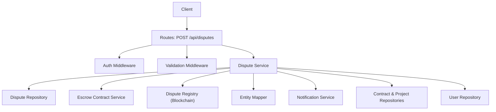
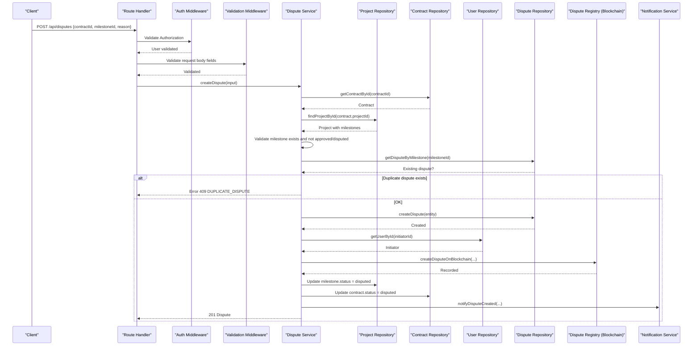
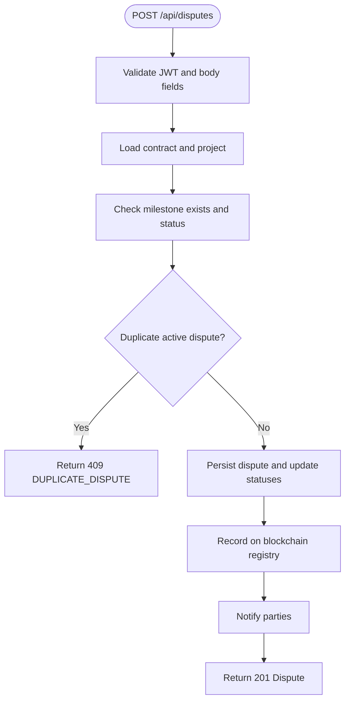
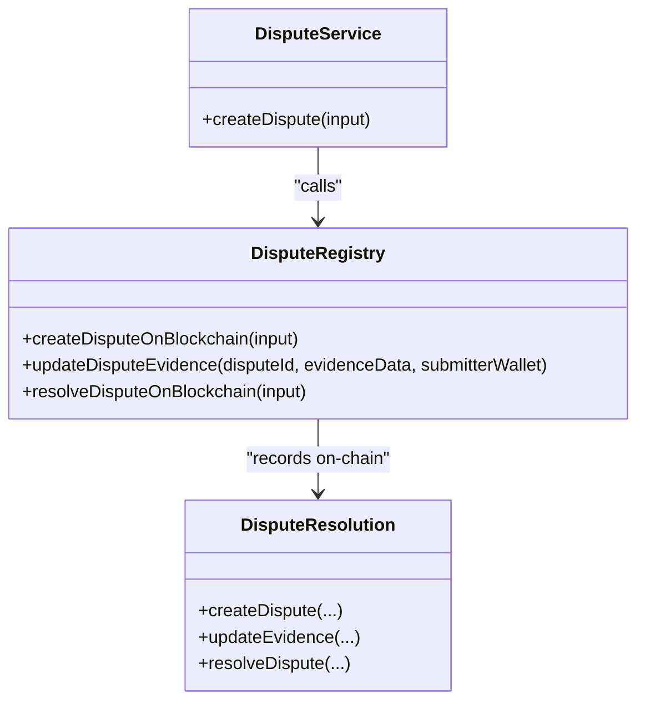
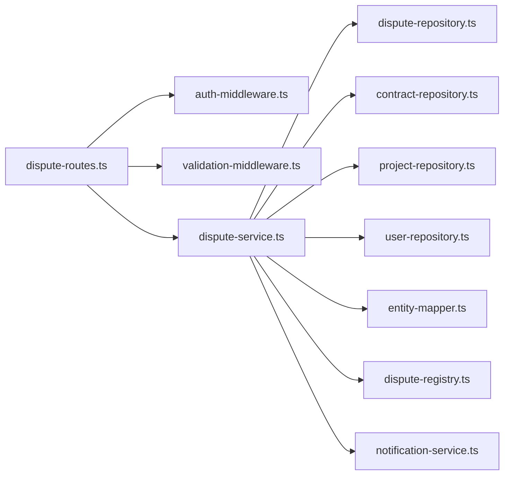

# Dispute Creation

<cite>
**Referenced Files in This Document**
- [dispute-routes.ts](file://src/routes/dispute-routes.ts)
- [dispute-service.ts](file://src/services/dispute-service.ts)
- [dispute-repository.ts](file://src/repositories/dispute-repository.ts)
- [entity-mapper.ts](file://src/utils/entity-mapper.ts)
- [validation-middleware.ts](file://src/middleware/validation-middleware.ts)
- [auth-middleware.ts](file://src/middleware/auth-middleware.ts)
- [error-handler.ts](file://src/middleware/error-handler.ts)
- [DisputeResolution.sol](file://contracts/DisputeResolution.sol)
- [dispute-registry.ts](file://src/services/dispute-registry.ts)
</cite>

## Table of Contents
1. [Introduction](#introduction)
2. [Project Structure](#project-structure)
3. [Core Components](#core-components)
4. [Architecture Overview](#architecture-overview)
5. [Detailed Component Analysis](#detailed-component-analysis)
6. [Dependency Analysis](#dependency-analysis)
7. [Performance Considerations](#performance-considerations)
8. [Troubleshooting Guide](#troubleshooting-guide)
9. [Conclusion](#conclusion)
10. [Appendices](#appendices)

## Introduction
This document describes the API for creating a dispute via POST /api/disputes. It covers the request schema, authentication and authorization, validation rules, response format, backend flow from route to service and blockchain integration, and common error scenarios. It also provides practical examples and client implementation guidance.

## Project Structure
The dispute creation endpoint is implemented in the routes layer and delegated to a service layer that orchestrates repository access, business validation, notifications, and blockchain recording.

**Diagram sources**
- [dispute-routes.ts](file://src/routes/dispute-routes.ts#L149-L224)
- [dispute-service.ts](file://src/services/dispute-service.ts#L67-L206)
- [dispute-repository.ts](file://src/repositories/dispute-repository.ts#L39-L90)
- [entity-mapper.ts](file://src/utils/entity-mapper.ts#L312-L371)
- [dispute-registry.ts](file://src/services/dispute-registry.ts#L69-L145)

**Section sources**
- [dispute-routes.ts](file://src/routes/dispute-routes.ts#L149-L224)
- [dispute-service.ts](file://src/services/dispute-service.ts#L67-L206)

## Core Components
- Route handler enforces JWT authentication and validates request body fields.
- Service performs business validation (contract-party access, milestone existence, duplicate dispute checks) and updates domain state.
- Repository persists dispute records and related lookups.
- Blockchain registry records dispute lifecycle immutably.
- Entity mapper converts between internal entities and API models.

**Section sources**
- [dispute-routes.ts](file://src/routes/dispute-routes.ts#L149-L224)
- [dispute-service.ts](file://src/services/dispute-service.ts#L67-L206)
- [dispute-repository.ts](file://src/repositories/dispute-repository.ts#L39-L90)
- [entity-mapper.ts](file://src/utils/entity-mapper.ts#L312-L371)
- [dispute-registry.ts](file://src/services/dispute-registry.ts#L69-L145)

## Architecture Overview
The endpoint follows a layered architecture: route -> service -> repository/blockchain. The service ensures only a contract party can initiate a dispute, validates milestone eligibility, and records the dispute on-chain.

**Diagram sources**
- [dispute-routes.ts](file://src/routes/dispute-routes.ts#L149-L224)
- [dispute-service.ts](file://src/services/dispute-service.ts#L67-L206)
- [dispute-repository.ts](file://src/repositories/dispute-repository.ts#L39-L90)
- [dispute-registry.ts](file://src/services/dispute-registry.ts#L69-L145)

## Detailed Component Analysis

### Endpoint Definition
- Method: POST
- Path: /api/disputes
- Authentication: Required (Bearer JWT)
- Role-based access: Any contract party (employer or freelancer) can initiate a dispute
- Request body fields:
  - contractId: string, required, UUID
  - milestoneId: string, required, UUID
  - reason: string, required, non-empty
- Response: 201 Created with the full Dispute object
- Common errors:
  - 400: Validation errors (missing/invalid fields)
  - 401: Unauthorized (missing/invalid JWT)
  - 403: Unauthorized (not a contract party)
  - 404: Contract or milestone not found
  - 409: Already disputed or duplicate active dispute for milestone

**Section sources**
- [dispute-routes.ts](file://src/routes/dispute-routes.ts#L118-L148)
- [dispute-routes.ts](file://src/routes/dispute-routes.ts#L149-L224)
- [validation-middleware.ts](file://src/middleware/validation-middleware.ts#L606-L616)

### Request Validation Rules
- contractId must be present and a valid UUID.
- milestoneId must be present and a valid UUID.
- reason must be present and a non-empty string.
- The route also applies a reusable UUID validator for path parameters in other endpoints.

**Section sources**
- [dispute-routes.ts](file://src/routes/dispute-routes.ts#L168-L203)
- [validation-middleware.ts](file://src/middleware/validation-middleware.ts#L606-L616)
- [validation-middleware.ts](file://src/middleware/validation-middleware.ts#L771-L800)

### Authentication and Authorization
- Authentication: Route requires a valid Bearer JWT. The auth middleware extracts the token from the Authorization header and validates it.
- Authorization: The service verifies that the initiator is either the employer or freelancer on the contract. Other endpoints enforce role checks differently (e.g., admin-only resolution).

**Section sources**
- [auth-middleware.ts](file://src/middleware/auth-middleware.ts#L25-L70)
- [dispute-service.ts](file://src/services/dispute-service.ts#L82-L88)

### Business Logic and Domain State
- Validates contract exists and loads project with milestones.
- Ensures milestone exists and is not already disputed or approved.
- Prevents duplicate active disputes for the same milestone.
- Creates a Dispute entity with status "open" and empty evidence array.
- Updates milestone status to "disputed" and contract status to "disputed".
- Sends notifications to both parties.

**Section sources**
- [dispute-service.ts](file://src/services/dispute-service.ts#L72-L134)
- [dispute-service.ts](file://src/services/dispute-service.ts#L175-L183)

### Response Schema
The response is a Dispute object with:
- id: string
- contractId: string
- milestoneId: string
- initiatorId: string
- reason: string
- evidence: Evidence[]
- status: "open" | "under_review" | "resolved"
- resolution: DisputeResolution | null
- createdAt: string (ISO date-time)
- updatedAt: string (ISO date-time)

Evidence items include:
- id: string
- submitterId: string
- type: "text" | "file" | "link"
- content: string
- submittedAt: string (ISO date-time)

DisputeResolution includes:
- decision: "freelancer_favor" | "employer_favor" | "split"
- reasoning: string
- resolvedBy: string
- resolvedAt: string (ISO date-time)

**Section sources**
- [entity-mapper.ts](file://src/utils/entity-mapper.ts#L312-L371)
- [dispute-repository.ts](file://src/repositories/dispute-repository.ts#L6-L32)

### Backend Flow: Route to Service to Blockchain
- Route validates JWT and request body.
- Service:
  - Loads contract and project, validates milestone eligibility.
  - Checks for existing active dispute on milestone.
  - Persists dispute and updates statuses.
  - Calls blockchain registry to record dispute with wallets and amount.
  - Notifies both parties.
- Blockchain contract stores immutable records keyed by hashes.

**Diagram sources**
- [dispute-routes.ts](file://src/routes/dispute-routes.ts#L149-L224)
- [dispute-service.ts](file://src/services/dispute-service.ts#L67-L206)
- [dispute-registry.ts](file://src/services/dispute-registry.ts#L69-L145)

**Section sources**
- [dispute-routes.ts](file://src/routes/dispute-routes.ts#L149-L224)
- [dispute-service.ts](file://src/services/dispute-service.ts#L67-L206)
- [dispute-registry.ts](file://src/services/dispute-registry.ts#L69-L145)

### Blockchain Integration with DisputeResolution Smart Contract
- On successful dispute creation, the service records a dispute on-chain using the Dispute Registry service, which simulates transactions and stores records in-memory.
- The Solidity contract DisputeResolution stores immutable records keyed by hashed identifiers and emits events for dispute creation, evidence updates, and resolution.
- The service also marks the agreement as disputed on-chain.

**Diagram sources**
- [dispute-service.ts](file://src/services/dispute-service.ts#L151-L173)
- [dispute-registry.ts](file://src/services/dispute-registry.ts#L69-L145)
- [DisputeResolution.sol](file://contracts/DisputeResolution.sol#L48-L125)

**Section sources**
- [dispute-service.ts](file://src/services/dispute-service.ts#L151-L173)
- [dispute-registry.ts](file://src/services/dispute-registry.ts#L69-L145)
- [DisputeResolution.sol](file://contracts/DisputeResolution.sol#L48-L125)

### Practical Example: Milestone Delivery Issue
- Scenario: Employer initiates a dispute because the milestone deliverable was not received.
- Request payload:
  - contractId: "a1b2c3d4-e5f6-a7b8-c9d0-e1f2a3b4c5d6"
  - milestoneId: "f0e9d8c7-b6a5-f4e3-d2c1-b0a9f8e7d6c5"
  - reason: "Deliverable not received by due date"
- Expected response: 201 with a Dispute object having status "open" and empty evidence array.

**Section sources**
- [dispute-routes.ts](file://src/routes/dispute-routes.ts#L149-L224)
- [entity-mapper.ts](file://src/utils/entity-mapper.ts#L312-L371)

### Common Errors
- 400 Validation errors:
  - Missing or invalid contractId (must be UUID).
  - Missing or invalid milestoneId (must be UUID).
  - Missing or empty reason (must be non-empty string).
- 401 Unauthorized:
  - Missing Authorization header or invalid/missing Bearer token.
- 403 Unauthorized:
  - Initiator is not a contract party (employer or freelancer).
- 404 Not Found:
  - Contract or milestone not found.
- 409 Conflict:
  - Milestone is already under dispute.
  - An active dispute already exists for the milestone.

**Section sources**
- [dispute-routes.ts](file://src/routes/dispute-routes.ts#L168-L217)
- [dispute-service.ts](file://src/services/dispute-service.ts#L82-L134)

## Dependency Analysis
The route depends on auth and validation middleware and delegates to the dispute service. The service depends on repositories, user and contract/project loaders, notification service, and blockchain registry.

**Diagram sources**
- [dispute-routes.ts](file://src/routes/dispute-routes.ts#L149-L224)
- [dispute-service.ts](file://src/services/dispute-service.ts#L1-L66)
- [dispute-repository.ts](file://src/repositories/dispute-repository.ts#L39-L90)

**Section sources**
- [dispute-routes.ts](file://src/routes/dispute-routes.ts#L149-L224)
- [dispute-service.ts](file://src/services/dispute-service.ts#L1-L66)

## Performance Considerations
- Validation is lightweight and occurs before any repository calls.
- Repository queries are simple and scoped to IDs.
- Blockchain operations are asynchronous and logged; failures do not block the primary flow.
- Notifications are sent after persistence and blockchain recording.

[No sources needed since this section provides general guidance]

## Troubleshooting Guide
- If receiving 401 Unauthorized, ensure the Authorization header is present and formatted as "Bearer <token>".
- If receiving 403 Unauthorized, verify the user is either the employer or freelancer on the contract.
- If receiving 404 Not Found, confirm the contractId and milestoneId are valid and correspond to an existing contract and milestone.
- If receiving 409 Conflict, check that the milestone is not already disputed or has an active dispute.
- If blockchain recording fails, the service logs the error and still returns the created dispute; retry later or contact support.

**Section sources**
- [auth-middleware.ts](file://src/middleware/auth-middleware.ts#L25-L70)
- [dispute-service.ts](file://src/services/dispute-service.ts#L151-L173)
- [error-handler.ts](file://src/middleware/error-handler.ts#L85-L120)

## Conclusion
The dispute creation endpoint provides a secure, auditable way for any contract party to initiate a dispute. It enforces strict validation, prevents duplicates, updates domain state, and records immutable on-chain data. Clients should handle 400/401/403/404/409 responses appropriately and implement retry/backoff for transient blockchain errors.

## Appendices

### API Reference: POST /api/disputes
- Authentication: Bearer JWT
- Request body:
  - contractId: string (UUID)
  - milestoneId: string (UUID)
  - reason: string (non-empty)
- Responses:
  - 201: Dispute created
  - 400: Validation error
  - 401: Unauthorized
  - 403: Unauthorized (not a contract party)
  - 404: Contract or milestone not found
  - 409: Already disputed or duplicate active dispute

**Section sources**
- [dispute-routes.ts](file://src/routes/dispute-routes.ts#L118-L148)
- [dispute-routes.ts](file://src/routes/dispute-routes.ts#L149-L224)
- [validation-middleware.ts](file://src/middleware/validation-middleware.ts#L606-L616)

### Client Implementation Guidance
- Always attach a valid Bearer token in the Authorization header.
- Validate inputs server-side using the same rules (UUIDs, non-empty reason).
- Handle 409 Conflict by informing the user that a dispute already exists for the milestone.
- After creation, poll the dispute details endpoint to track status and evidence submissions.
- For error handling, implement exponential backoff for transient failures and display user-friendly messages.

[No sources needed since this section provides general guidance]