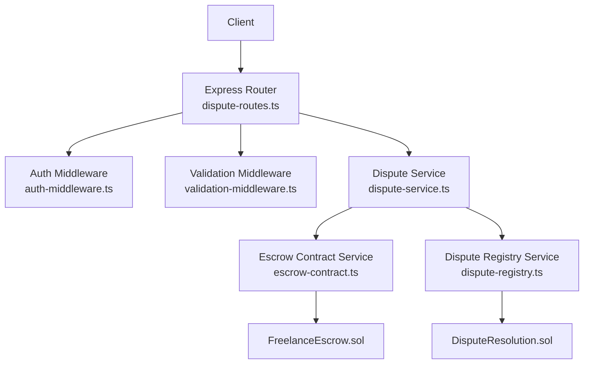
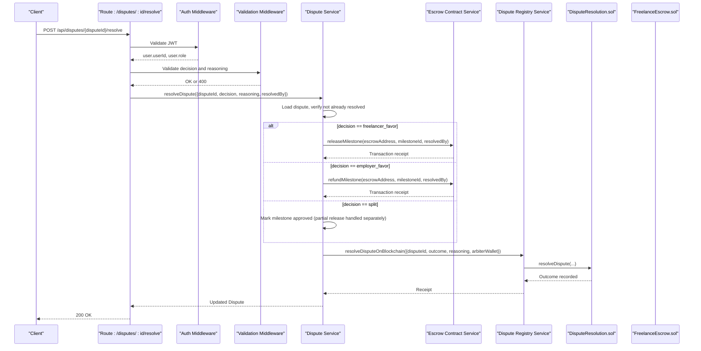
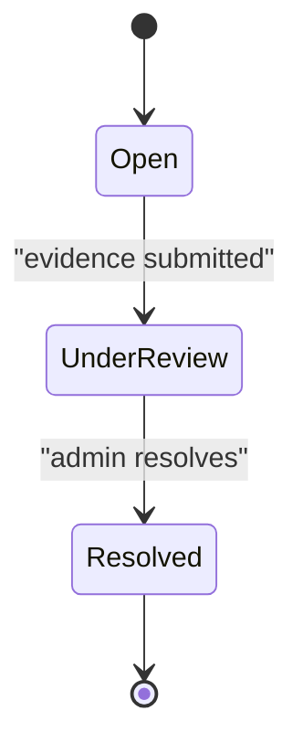
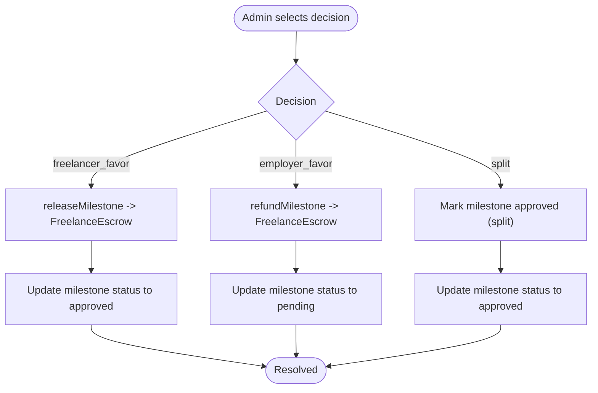
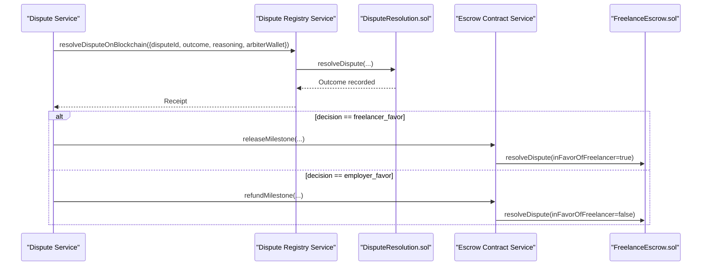
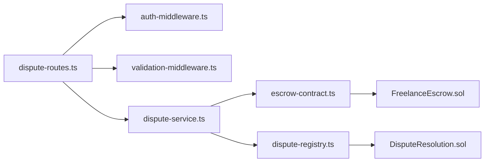

# Dispute Resolution

<cite>
**Referenced Files in This Document**
- [dispute-routes.ts](file://src/routes/dispute-routes.ts)
- [dispute-service.ts](file://src/services/dispute-service.ts)
- [auth-middleware.ts](file://src/middleware/auth-middleware.ts)
- [validation-middleware.ts](file://src/middleware/validation-middleware.ts)
- [dispute-registry.ts](file://src/services/dispute-registry.ts)
- [escrow-contract.ts](file://src/services/escrow-contract.ts)
- [DisputeResolution.sol](file://contracts/DisputeResolution.sol)
- [FreelanceEscrow.sol](file://contracts/FreelanceEscrow.sol)
- [entity-mapper.ts](file://src/utils/entity-mapper.ts)
- [API-DOCUMENTATION.md](file://docs/API-DOCUMENTATION.md)
</cite>

## Table of Contents
1. [Introduction](#introduction)
2. [Project Structure](#project-structure)
3. [Core Components](#core-components)
4. [Architecture Overview](#architecture-overview)
5. [Detailed Component Analysis](#detailed-component-analysis)
6. [Dependency Analysis](#dependency-analysis)
7. [Performance Considerations](#performance-considerations)
8. [Troubleshooting Guide](#troubleshooting-guide)
9. [Conclusion](#conclusion)
10. [Appendices](#appendices)

## Introduction
This document provides API documentation for the dispute resolution endpoint POST /api/disputes/{disputeId}/resolve. It explains who can use the endpoint, the request payload, state transitions, financial implications of each decision, integration with on-chain contracts, and error responses. It also includes guidance for audit trails and compliance logging.

## Project Structure
The dispute resolution feature spans the Express route layer, service layer, middleware, blockchain integration, and Solidity contracts:
- Route: enforces authentication and admin role checks, validates inputs, and delegates to the service.
- Service: orchestrates state updates, interacts with the escrow service, and records outcomes on-chain.
- Blockchain services: simulate transactions and persist records for auditability.
- On-chain contracts: DisputeResolution stores immutable outcomes; FreelanceEscrow executes fund transfers.

**Diagram sources**
- [dispute-routes.ts](file://src/routes/dispute-routes.ts#L424-L486)
- [auth-middleware.ts](file://src/middleware/auth-middleware.ts#L25-L70)
- [validation-middleware.ts](file://src/middleware/validation-middleware.ts#L782-L800)
- [dispute-service.ts](file://src/services/dispute-service.ts#L296-L458)
- [escrow-contract.ts](file://src/services/escrow-contract.ts#L138-L264)
- [dispute-registry.ts](file://src/services/dispute-registry.ts#L191-L253)
- [FreelanceEscrow.sol](file://contracts/FreelanceEscrow.sol#L178-L207)
- [DisputeResolution.sol](file://contracts/DisputeResolution.sol#L96-L126)

**Section sources**
- [dispute-routes.ts](file://src/routes/dispute-routes.ts#L424-L486)
- [dispute-service.ts](file://src/services/dispute-service.ts#L296-L458)
- [auth-middleware.ts](file://src/middleware/auth-middleware.ts#L25-L70)
- [validation-middleware.ts](file://src/middleware/validation-middleware.ts#L782-L800)

## Core Components
- Endpoint: POST /api/disputes/{disputeId}/resolve
- Authentication: Requires a valid Bearer token.
- Authorization: Only users with role admin can resolve disputes.
- Request body:
  - decision: one of freelancer_favor, employer_favor, split
  - reasoning: required text explanation
- Response: Returns the updated Dispute object with status resolved and resolution details.

Key behaviors:
- Admin role verification occurs in both route and service layers.
- Validates decision and reasoning presence and correctness.
- Updates dispute status to resolved and persists resolution metadata.
- Triggers on-chain recording of outcome and, where applicable, fund release/refund.

**Section sources**
- [dispute-routes.ts](file://src/routes/dispute-routes.ts#L424-L486)
- [dispute-service.ts](file://src/services/dispute-service.ts#L300-L458)
- [entity-mapper.ts](file://src/utils/entity-mapper.ts#L313-L371)

## Architecture Overview
The resolution flow integrates off-chain state updates with on-chain immutability and fund movement.

**Diagram sources**
- [dispute-routes.ts](file://src/routes/dispute-routes.ts#L424-L486)
- [dispute-service.ts](file://src/services/dispute-service.ts#L296-L458)
- [escrow-contract.ts](file://src/services/escrow-contract.ts#L138-L264)
- [dispute-registry.ts](file://src/services/dispute-registry.ts#L191-L253)
- [DisputeResolution.sol](file://contracts/DisputeResolution.sol#L96-L126)
- [FreelanceEscrow.sol](file://contracts/FreelanceEscrow.sol#L178-L207)

## Detailed Component Analysis

### Endpoint Definition and Behavior
- Path: POST /api/disputes/{disputeId}/resolve
- Security: Bearer token required.
- Role requirement: admin only.
- Request body:
  - decision: enum freelancer_favor, employer_favor, split
  - reasoning: string, required
- Response: Dispute with status resolved and resolution populated.

Behavior highlights:
- Admin role enforced in route and service.
- Decision validated and reasoning required.
- On-chain outcome recorded regardless of financial action.

**Section sources**
- [dispute-routes.ts](file://src/routes/dispute-routes.ts#L385-L423)
- [dispute-routes.ts](file://src/routes/dispute-routes.ts#L424-L486)
- [validation-middleware.ts](file://src/middleware/validation-middleware.ts#L629-L638)

### State Transition: Under Review to Resolved
- Evidence submission moves dispute from open to under_review.
- Resolution sets status to resolved and attaches resolution metadata.

**Diagram sources**
- [dispute-service.ts](file://src/services/dispute-service.ts#L210-L293)
- [dispute-service.ts](file://src/services/dispute-service.ts#L296-L458)

**Section sources**
- [dispute-service.ts](file://src/services/dispute-service.ts#L210-L293)
- [dispute-service.ts](file://src/services/dispute-service.ts#L296-L458)

### Financial Implications by Decision
- freelancer_favor:
  - Releases milestone payment to freelancer via FreelanceEscrow.
  - Milestone status set to approved.
- employer_favor:
  - Refunds milestone payment to employer via FreelanceEscrow.
  - Milestone status set to pending.
- split:
  - Marks milestone as approved (partial release handled separately).
  - No automatic fund transfer in this endpoint; split outcome recorded on-chain.

**Diagram sources**
- [dispute-service.ts](file://src/services/dispute-service.ts#L367-L401)
- [escrow-contract.ts](file://src/services/escrow-contract.ts#L138-L264)
- [FreelanceEscrow.sol](file://contracts/FreelanceEscrow.sol#L178-L207)

**Section sources**
- [dispute-service.ts](file://src/services/dispute-service.ts#L367-L401)
- [escrow-contract.ts](file://src/services/escrow-contract.ts#L138-L264)

### On-Chain Recording and Fund Release
- Dispute outcome recorded immutably on DisputeResolution.sol.
- Arbitration decision stored with reasoning and arbiter wallet.
- Fund release/refund executed via FreelanceEscrow.sol methods invoked by the service.

**Diagram sources**
- [dispute-service.ts](file://src/services/dispute-service.ts#L419-L456)
- [dispute-registry.ts](file://src/services/dispute-registry.ts#L191-L253)
- [DisputeResolution.sol](file://contracts/DisputeResolution.sol#L96-L126)
- [escrow-contract.ts](file://src/services/escrow-contract.ts#L138-L264)
- [FreelanceEscrow.sol](file://contracts/FreelanceEscrow.sol#L178-L207)

**Section sources**
- [dispute-registry.ts](file://src/services/dispute-registry.ts#L191-L253)
- [DisputeResolution.sol](file://contracts/DisputeResolution.sol#L96-L126)
- [escrow-contract.ts](file://src/services/escrow-contract.ts#L138-L264)
- [FreelanceEscrow.sol](file://contracts/FreelanceEscrow.sol#L178-L207)

### Example: Split Decision with Reasoning
- Scenario: Dispute resolved with split decision.
- Action: Mark milestone approved; partial release handled elsewhere.
- Reasoning: Include a detailed explanation in the reasoning field.

Note: The endpoint does not automatically split funds; it records the outcome and marks the milestone approved. Partial release logic is separate.

**Section sources**
- [dispute-service.ts](file://src/services/dispute-service.ts#L379-L383)
- [dispute-routes.ts](file://src/routes/dispute-routes.ts#L424-L486)

### Error Responses
Common HTTP statuses:
- 401 Unauthorized: Missing or invalid Bearer token.
- 403 Forbidden: Non-admin user attempts to resolve a dispute.
- 400 Bad Request: Invalid decision, missing reasoning, invalid UUID, or dispute already resolved.
- 404 Not Found: Dispute not found.

The route enforces admin role and validates inputs, while the service enforces uniqueness of roles and checks for already-resolved disputes.

**Section sources**
- [dispute-routes.ts](file://src/routes/dispute-routes.ts#L438-L451)
- [dispute-routes.ts](file://src/routes/dispute-routes.ts#L453-L465)
- [dispute-routes.ts](file://src/routes/dispute-routes.ts#L475-L479)
- [dispute-service.ts](file://src/services/dispute-service.ts#L322-L328)

### Audit Trails and Compliance Logging
- Off-chain:
  - DisputeService logs resolution actions and updates Dispute resolution metadata.
  - Notifications are sent to both parties upon resolution.
- On-chain:
  - DisputeResolution.sol emits DisputeResolved events with outcome, arbiter, and timestamp.
  - Escrow Contract Service records transaction receipts for fund releases/refunds.
- Recommendations:
  - Store timestamps, resolver identity, and reasoning in logs.
  - Maintain immutable chain of custody for evidence hashes and outcomes.
  - Ensure all sensitive fields are redacted or hashed in logs.

**Section sources**
- [dispute-service.ts](file://src/services/dispute-service.ts#L419-L456)
- [dispute-registry.ts](file://src/services/dispute-registry.ts#L191-L253)
- [DisputeResolution.sol](file://contracts/DisputeResolution.sol#L96-L126)
- [escrow-contract.ts](file://src/services/escrow-contract.ts#L138-L264)

## Dependency Analysis
- Route depends on:
  - Auth middleware for JWT validation and role extraction.
  - Validation middleware for UUID and request body validation.
  - Dispute service for business logic.
- Service depends on:
  - Escrow contract service for fund release/refund.
  - Dispute registry service for on-chain outcome recording.
  - Repositories and mappers for data access and model conversion.
- Contracts depend on:
  - DisputeResolution.sol for immutable outcome storage.
  - FreelanceEscrow.sol for fund movement.

**Diagram sources**
- [dispute-routes.ts](file://src/routes/dispute-routes.ts#L424-L486)
- [auth-middleware.ts](file://src/middleware/auth-middleware.ts#L25-L70)
- [validation-middleware.ts](file://src/middleware/validation-middleware.ts#L782-L800)
- [dispute-service.ts](file://src/services/dispute-service.ts#L296-L458)
- [escrow-contract.ts](file://src/services/escrow-contract.ts#L138-L264)
- [dispute-registry.ts](file://src/services/dispute-registry.ts#L191-L253)
- [FreelanceEscrow.sol](file://contracts/FreelanceEscrow.sol#L178-L207)
- [DisputeResolution.sol](file://contracts/DisputeResolution.sol#L96-L126)

**Section sources**
- [dispute-routes.ts](file://src/routes/dispute-routes.ts#L424-L486)
- [dispute-service.ts](file://src/services/dispute-service.ts#L296-L458)

## Performance Considerations
- Transaction latency: On-chain operations introduce network delays; batch or schedule notifications accordingly.
- Reentrancy protection: FreelanceEscrow.sol uses modifiers to prevent reentrancy during fund transfers.
- Validation overhead: Input validation is performed in middleware and service layers; keep schemas minimal and efficient.

[No sources needed since this section provides general guidance]

## Troubleshooting Guide
- 401 Unauthorized:
  - Ensure Authorization header is present and formatted as Bearer <token>.
  - Verify token is not expired.
- 403 Forbidden:
  - Confirm the user has role admin.
- 400 Bad Request:
  - Check decision is one of freelancer_favor, employer_favor, split.
  - Ensure reasoning is present and non-empty.
  - Validate disputeId is a valid UUID.
  - If receiving 400 for “already resolved,” confirm dispute status.
- 404 Not Found:
  - Verify disputeId exists and belongs to a valid contract/milestone.

**Section sources**
- [auth-middleware.ts](file://src/middleware/auth-middleware.ts#L25-L70)
- [dispute-routes.ts](file://src/routes/dispute-routes.ts#L438-L451)
- [dispute-routes.ts](file://src/routes/dispute-routes.ts#L453-L465)
- [dispute-routes.ts](file://src/routes/dispute-routes.ts#L475-L479)
- [dispute-service.ts](file://src/services/dispute-service.ts#L322-L328)

## Conclusion
The POST /api/disputes/{disputeId}/resolve endpoint enables admin-controlled dispute resolution with clear state transitions and financial implications. It integrates off-chain state updates with on-chain immutability and fund movements, ensuring transparent and auditable outcomes. Proper error handling and logging are essential for compliance and operational reliability.

[No sources needed since this section summarizes without analyzing specific files]

## Appendices

### API Definition Summary
- Method: POST
- Path: /api/disputes/{disputeId}/resolve
- Path parameters:
  - disputeId: UUID
- Headers:
  - Authorization: Bearer <token>
- Request body:
  - decision: enum freelancer_favor, employer_favor, split
  - reasoning: string, required
- Responses:
  - 200 OK: Dispute object with status resolved
  - 400 Bad Request: Validation or already-resolved
  - 401 Unauthorized: Missing/invalid token
  - 403 Forbidden: Non-admin user
  - 404 Not Found: Dispute not found

**Section sources**
- [dispute-routes.ts](file://src/routes/dispute-routes.ts#L385-L423)
- [dispute-routes.ts](file://src/routes/dispute-routes.ts#L424-L486)
- [validation-middleware.ts](file://src/middleware/validation-middleware.ts#L629-L638)
- [API-DOCUMENTATION.md](file://docs/API-DOCUMENTATION.md#L440-L483)