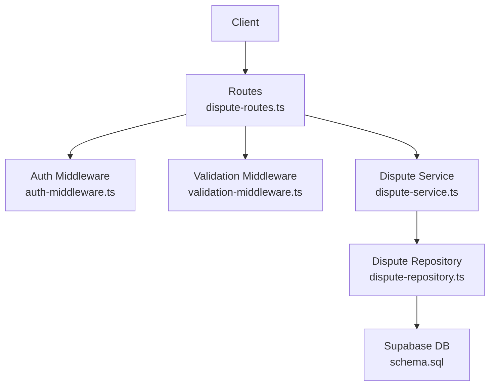
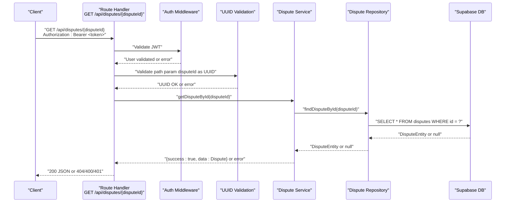
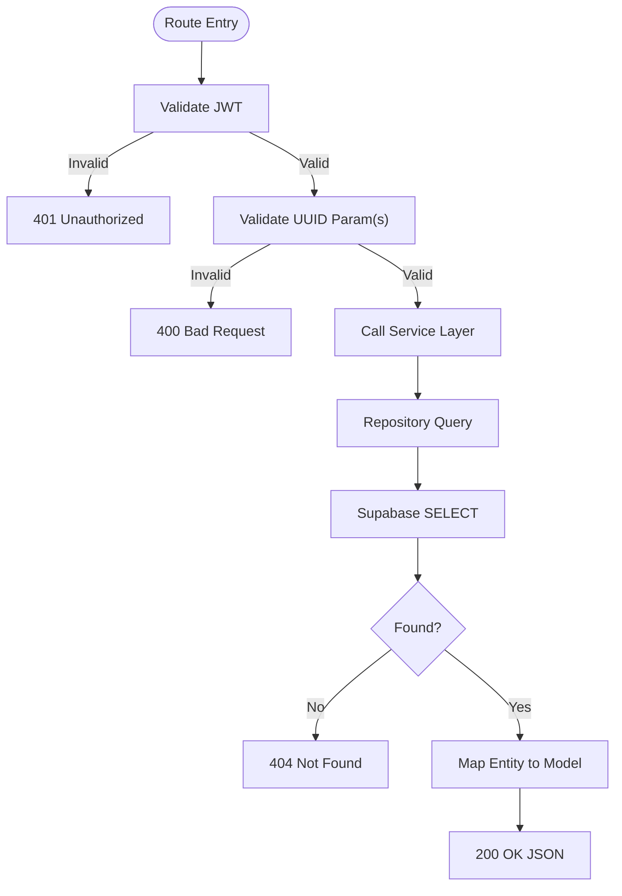
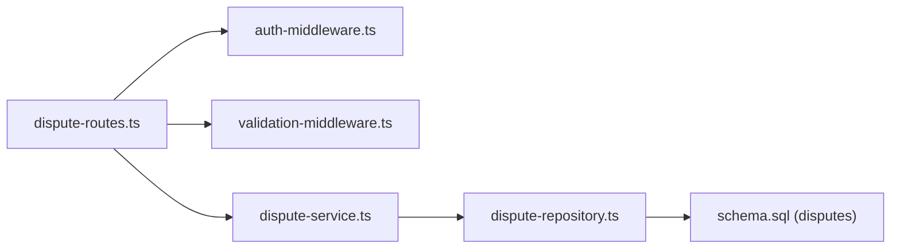

# Dispute Retrieval

<cite>
**Referenced Files in This Document**
- [dispute-routes.ts](file://src/routes/dispute-routes.ts)
- [dispute-service.ts](file://src/services/dispute-service.ts)
- [dispute-repository.ts](file://src/repositories/dispute-repository.ts)
- [auth-middleware.ts](file://src/middleware/auth-middleware.ts)
- [validation-middleware.ts](file://src/middleware/validation-middleware.ts)
- [swagger.ts](file://src/config/swagger.ts)
- [schema.sql](file://supabase/schema.sql)
- [entity-mapper.ts](file://src/utils/entity-mapper.ts)
</cite>

## Table of Contents
1. [Introduction](#introduction)
2. [Project Structure](#project-structure)
3. [Core Components](#core-components)
4. [Architecture Overview](#architecture-overview)
5. [Detailed Component Analysis](#detailed-component-analysis)
6. [Dependency Analysis](#dependency-analysis)
7. [Performance Considerations](#performance-considerations)
8. [Troubleshooting Guide](#troubleshooting-guide)
9. [Conclusion](#conclusion)
10. [Appendices](#appendices)

## Introduction
This document provides API documentation for dispute retrieval endpoints:
- GET /api/disputes/{disputeId}
- GET /api/contracts/{contractId}/disputes

It covers authentication requirements (JWT Bearer), access control (only involved parties and admins), request/response schemas, error handling, and the end-to-end data flow from route to service layer and database.

## Project Structure
The dispute retrieval functionality spans routing, middleware, service, repository, and data model layers.

**Diagram sources**
- [dispute-routes.ts](file://src/routes/dispute-routes.ts#L258-L555)
- [auth-middleware.ts](file://src/middleware/auth-middleware.ts#L25-L70)
- [validation-middleware.ts](file://src/middleware/validation-middleware.ts#L778-L800)
- [dispute-service.ts](file://src/services/dispute-service.ts#L461-L502)
- [dispute-repository.ts](file://src/repositories/dispute-repository.ts#L39-L132)
- [schema.sql](file://supabase/schema.sql#L108-L120)

**Section sources**
- [dispute-routes.ts](file://src/routes/dispute-routes.ts#L258-L555)
- [auth-middleware.ts](file://src/middleware/auth-middleware.ts#L25-L70)
- [validation-middleware.ts](file://src/middleware/validation-middleware.ts#L778-L800)
- [dispute-service.ts](file://src/services/dispute-service.ts#L461-L502)
- [dispute-repository.ts](file://src/repositories/dispute-repository.ts#L39-L132)
- [schema.sql](file://supabase/schema.sql#L108-L120)

## Core Components
- Route handlers enforce JWT authentication and UUID parameter validation, then delegate to the service layer.
- Service layer enforces access control by verifying the user’s association with the contract and performs database queries.
- Repository layer encapsulates Supabase queries for dispute records.
- Swagger defines the JWT security scheme and response schemas for Dispute, Evidence, and DisputeResolution.

Key responsibilities:
- Authentication: Bearer JWT via Authorization header.
- Access control: Only parties involved in the contract (employer or freelancer) may view disputes.
- Data mapping: Entities are mapped to API models for consistent JSON responses.

**Section sources**
- [swagger.ts](file://src/config/swagger.ts#L22-L28)
- [dispute-routes.ts](file://src/routes/dispute-routes.ts#L258-L555)
- [auth-middleware.ts](file://src/middleware/auth-middleware.ts#L25-L70)
- [dispute-service.ts](file://src/services/dispute-service.ts#L461-L502)
- [dispute-repository.ts](file://src/repositories/dispute-repository.ts#L39-L132)
- [entity-mapper.ts](file://src/utils/entity-mapper.ts#L312-L371)

## Architecture Overview
The retrieval flow follows a layered architecture: route -> middleware -> service -> repository -> database.

**Diagram sources**
- [dispute-routes.ts](file://src/routes/dispute-routes.ts#L258-L287)
- [auth-middleware.ts](file://src/middleware/auth-middleware.ts#L25-L70)
- [validation-middleware.ts](file://src/middleware/validation-middleware.ts#L778-L800)
- [dispute-service.ts](file://src/services/dispute-service.ts#L461-L475)
- [dispute-repository.ts](file://src/repositories/dispute-repository.ts#L43-L53)
- [schema.sql](file://supabase/schema.sql#L108-L120)

## Detailed Component Analysis

### Endpoint: GET /api/disputes/{disputeId}
- Authentication: Required. Bearer JWT in Authorization header.
- Path parameter:
  - disputeId: UUID string. Validated by UUID middleware.
- Access control:
  - No explicit role restriction in route; service enforces that the user is associated with the contract via the contract repository.
- Response:
  - 200 OK with Dispute object containing:
    - id, contractId, milestoneId, initiatorId, reason
    - evidence: array of Evidence objects
    - status: one of open, under_review, resolved
    - resolution: DisputeResolution object or null
    - createdAt, updatedAt
- Error responses:
  - 400 Bad Request: Invalid UUID format.
  - 401 Unauthorized: Missing/invalid/expired JWT.
  - 404 Not Found: Dispute not found.

Response schema (Swagger-defined):
- Dispute: id, contractId, milestoneId, initiatorId, reason, evidence[], status, resolution?, createdAt, updatedAt
- Evidence: id, submitterId, type, content, submittedAt
- DisputeResolution: decision, reasoning, resolvedBy, resolvedAt

**Section sources**
- [dispute-routes.ts](file://src/routes/dispute-routes.ts#L227-L287)
- [swagger.ts](file://src/config/swagger.ts#L22-L28)
- [swagger.ts](file://src/config/swagger.ts#L22-L28)
- [dispute-service.ts](file://src/services/dispute-service.ts#L461-L475)
- [dispute-repository.ts](file://src/repositories/dispute-repository.ts#L43-L53)
- [entity-mapper.ts](file://src/utils/entity-mapper.ts#L312-L371)

### Endpoint: GET /api/contracts/{contractId}/disputes
- Authentication: Required. Bearer JWT.
- Path parameter:
  - contractId: UUID string. Validated by UUID middleware.
- Access control:
  - Only employer or freelancer associated with the contract may retrieve disputes.
- Response:
  - 200 OK with array of Dispute objects for the given contract.
- Error responses:
  - 400 Bad Request: Invalid UUID format.
  - 401 Unauthorized: Missing/invalid/expired JWT.
  - 403 Forbidden: User not associated with the contract.
  - 404 Not Found: Contract not found.

Pagination and filtering:
- Repository supports paginated queries with limit and offset, and ordering by created_at descending.
- Current route handler does not expose query parameters for pagination/filtering; consumers should implement client-side pagination or request server-side pagination parameters if needed.

**Section sources**
- [dispute-routes.ts](file://src/routes/dispute-routes.ts#L490-L555)
- [dispute-service.ts](file://src/services/dispute-service.ts#L478-L502)
- [dispute-repository.ts](file://src/repositories/dispute-repository.ts#L55-L86)
- [swagger.ts](file://src/config/swagger.ts#L22-L28)

### Data Flow and Database Queries
- Single dispute retrieval:
  - Route validates JWT and UUID.
  - Service calls repository to find dispute by ID.
  - Repository executes a SELECT query on the disputes table by id.
  - Service maps entity to API model and returns.
- Contract-level disputes:
  - Route validates JWT and UUID.
  - Service verifies contract existence and user association.
  - Service retrieves all disputes for the contract ordered by created_at desc.
  - Repository executes a SELECT with equality filter on contract_id and ordering.

**Diagram sources**
- [dispute-routes.ts](file://src/routes/dispute-routes.ts#L258-L555)
- [dispute-service.ts](file://src/services/dispute-service.ts#L461-L502)
- [dispute-repository.ts](file://src/repositories/dispute-repository.ts#L39-L132)
- [schema.sql](file://supabase/schema.sql#L108-L120)

## Dependency Analysis
- Routes depend on:
  - Auth middleware for JWT validation.
  - Validation middleware for UUID parameter checks.
  - Dispute service for business logic.
- Service depends on:
  - Dispute repository for data access.
  - Contract repository to verify user association.
  - User repository to map wallets for blockchain recording.
- Repository depends on:
  - Supabase client configured in base repository.
  - Disputes table schema.

**Diagram sources**
- [dispute-routes.ts](file://src/routes/dispute-routes.ts#L258-L555)
- [auth-middleware.ts](file://src/middleware/auth-middleware.ts#L25-L70)
- [validation-middleware.ts](file://src/middleware/validation-middleware.ts#L778-L800)
- [dispute-service.ts](file://src/services/dispute-service.ts#L461-L502)
- [dispute-repository.ts](file://src/repositories/dispute-repository.ts#L39-L132)
- [schema.sql](file://supabase/schema.sql#L108-L120)

**Section sources**
- [dispute-routes.ts](file://src/routes/dispute-routes.ts#L258-L555)
- [auth-middleware.ts](file://src/middleware/auth-middleware.ts#L25-L70)
- [validation-middleware.ts](file://src/middleware/validation-middleware.ts#L778-L800)
- [dispute-service.ts](file://src/services/dispute-service.ts#L461-L502)
- [dispute-repository.ts](file://src/repositories/dispute-repository.ts#L39-L132)
- [schema.sql](file://supabase/schema.sql#L108-L120)

## Performance Considerations
- Indexing: The disputes table has an index on contract_id, which optimizes contract-level queries.
- Ordering: Results are ordered by created_at descending to show newest disputes first.
- Pagination: Repository supports limit/offset; current route handlers do not expose query parameters. Consider adding limit and offset query parameters to the contract-level endpoint for scalable retrieval.

[No sources needed since this section provides general guidance]

## Troubleshooting Guide
Common issues and resolutions:
- 401 Unauthorized:
  - Missing Authorization header or invalid Bearer token format.
  - Token expired or invalid.
- 400 Bad Request:
  - Path parameter disputeId or contractId is not a valid UUID.
- 403 Forbidden:
  - Accessing contract-level disputes without being an employer or freelancer in that contract.
- 404 Not Found:
  - Dispute not found by ID.
  - Contract not found by ID.

Operational tips:
- Ensure Authorization header is present and formatted as "Bearer <token>".
- Confirm UUIDs are valid v4 UUIDs.
- Verify the user belongs to the contract for contract-level retrieval.

**Section sources**
- [auth-middleware.ts](file://src/middleware/auth-middleware.ts#L25-L70)
- [validation-middleware.ts](file://src/middleware/validation-middleware.ts#L778-L800)
- [dispute-service.ts](file://src/services/dispute-service.ts#L478-L502)
- [dispute-service.ts](file://src/services/dispute-service.ts#L461-L475)

## Conclusion
The dispute retrieval endpoints are secured with JWT and enforce strict access control. The service layer ensures only parties involved in a contract can view its disputes. Responses conform to Swagger-defined schemas, and the repository layer efficiently queries the Supabase database with proper indexing and ordering.

[No sources needed since this section summarizes without analyzing specific files]

## Appendices

### API Definitions

- GET /api/disputes/{disputeId}
  - Authentication: Bearer JWT
  - Path parameters:
    - disputeId: UUID
  - Responses:
    - 200: Dispute object
    - 400: Invalid UUID
    - 401: Unauthorized
    - 404: Dispute not found

- GET /api/contracts/{contractId}/disputes
  - Authentication: Bearer JWT
  - Path parameters:
    - contractId: UUID
  - Responses:
    - 200: Array of Dispute objects
    - 400: Invalid UUID
    - 401: Unauthorized
    - 403: Not authorized to view disputes
    - 404: Contract not found

**Section sources**
- [dispute-routes.ts](file://src/routes/dispute-routes.ts#L227-L287)
- [dispute-routes.ts](file://src/routes/dispute-routes.ts#L490-L555)
- [swagger.ts](file://src/config/swagger.ts#L22-L28)

### Response Schemas

- Dispute
  - Fields: id, contractId, milestoneId, initiatorId, reason, evidence[], status, resolution?, createdAt, updatedAt
- Evidence
  - Fields: id, submitterId, type, content, submittedAt
- DisputeResolution
  - Fields: decision, reasoning, resolvedBy, resolvedAt

**Section sources**
- [swagger.ts](file://src/config/swagger.ts#L22-L28)
- [entity-mapper.ts](file://src/utils/entity-mapper.ts#L312-L371)

### Example Requests and Expected Outcomes

- Retrieve a specific dispute:
  - Request: GET /api/disputes/{valid-dispute-id} with Authorization: Bearer <token>
  - Outcome: 200 OK with Dispute JSON

- List all disputes for a contract:
  - Request: GET /api/contracts/{valid-contract-id}/disputes with Authorization: Bearer <token>
  - Outcome: 200 OK with array of Dispute JSON

- Unauthorized access:
  - Request: GET /api/contracts/{contract-id}/disputes without valid JWT
  - Outcome: 401 Unauthorized

- Non-existent dispute:
  - Request: GET /api/disputes/{nonexistent-id} with valid JWT
  - Outcome: 404 Not Found

- Invalid UUID:
  - Request: GET /api/disputes/invalid-id with valid JWT
  - Outcome: 400 Bad Request

**Section sources**
- [dispute-routes.ts](file://src/routes/dispute-routes.ts#L258-L555)
- [auth-middleware.ts](file://src/middleware/auth-middleware.ts#L25-L70)
- [validation-middleware.ts](file://src/middleware/validation-middleware.ts#L778-L800)
- [dispute-service.ts](file://src/services/dispute-service.ts#L461-L502)