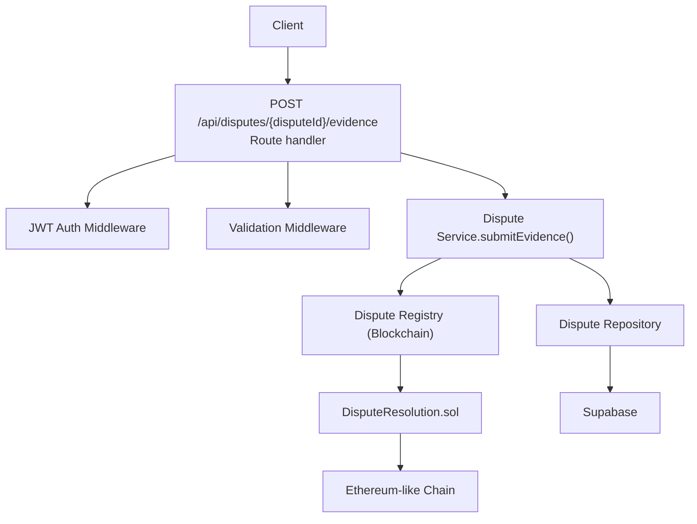
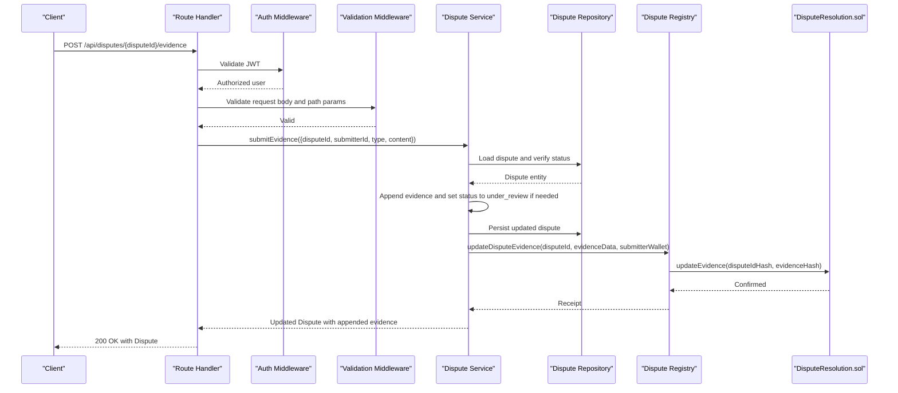
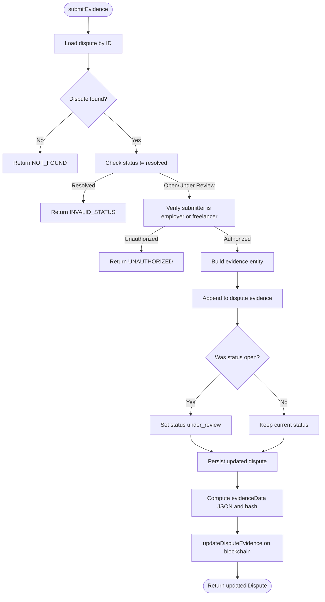
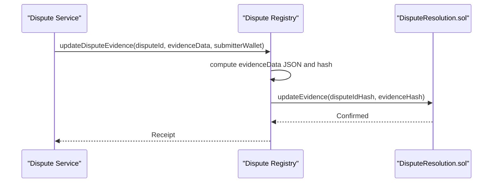
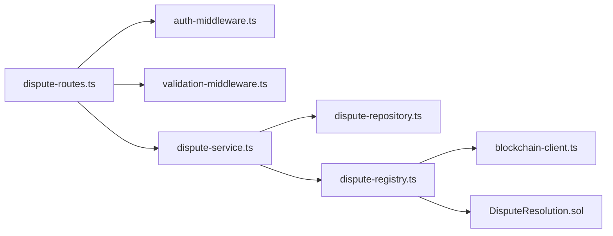

# Evidence Submission

<cite>
**Referenced Files in This Document**
- [dispute-routes.ts](file://src/routes/dispute-routes.ts)
- [dispute-service.ts](file://src/services/dispute-service.ts)
- [dispute-repository.ts](file://src/repositories/dispute-repository.ts)
- [validation-middleware.ts](file://src/middleware/validation-middleware.ts)
- [auth-middleware.ts](file://src/middleware/auth-middleware.ts)
- [entity-mapper.ts](file://src/utils/entity-mapper.ts)
- [dispute-registry.ts](file://src/services/dispute-registry.ts)
- [DisputeResolution.sol](file://contracts/DisputeResolution.sol)
- [blockchain-client.ts](file://src/services/blockchain-client.ts)
- [error-handler.ts](file://src/middleware/error-handler.ts)
</cite>

## Table of Contents
1. [Introduction](#introduction)
2. [Project Structure](#project-structure)
3. [Core Components](#core-components)
4. [Architecture Overview](#architecture-overview)
5. [Detailed Component Analysis](#detailed-component-analysis)
6. [Dependency Analysis](#dependency-analysis)
7. [Performance Considerations](#performance-considerations)
8. [Troubleshooting Guide](#troubleshooting-guide)
9. [Conclusion](#conclusion)

## Introduction
This document describes the API for submitting evidence to an active dispute. It covers the endpoint path, authentication, request schema, validation rules, error responses, and the integration with the blockchain-based evidence logging contract. It also provides examples for each evidence type and client-side implementation tips.

## Project Structure
The evidence submission endpoint is implemented as a REST POST route that is secured with JWT authentication, validated by request and parameter schemas, and processed by a service layer that persists the evidence and updates the blockchain log.

**Diagram sources**
- [dispute-routes.ts](file://src/routes/dispute-routes.ts#L290-L382)
- [auth-middleware.ts](file://src/middleware/auth-middleware.ts#L25-L70)
- [validation-middleware.ts](file://src/middleware/validation-middleware.ts#L618-L627)
- [dispute-service.ts](file://src/services/dispute-service.ts#L213-L293)
- [dispute-repository.ts](file://src/repositories/dispute-repository.ts#L34-L53)
- [dispute-registry.ts](file://src/services/dispute-registry.ts#L147-L189)
- [DisputeResolution.sol](file://contracts/DisputeResolution.sol#L84-L94)

**Section sources**
- [dispute-routes.ts](file://src/routes/dispute-routes.ts#L290-L382)

## Core Components
- Endpoint: POST /api/disputes/{disputeId}/evidence
- Path parameter: disputeId (UUID)
- Authentication: Bearer JWT via auth middleware
- Request body schema:
  - type: string, enum [text, file, link]
  - content: string (required)
- Validation:
  - type must be one of the allowed values
  - content must be a non-empty string
  - disputeId must be a valid UUID
- Authorization:
  - Only parties to the underlying contract (employer or freelancer) may submit evidence while the dispute is open or under_review
- Response:
  - Updated Dispute object with appended evidence
- Blockchain integration:
  - Evidence hash is recorded on-chain via DisputeResolution contract

**Section sources**
- [dispute-routes.ts](file://src/routes/dispute-routes.ts#L290-L382)
- [validation-middleware.ts](file://src/middleware/validation-middleware.ts#L618-L627)
- [dispute-service.ts](file://src/services/dispute-service.ts#L213-L293)
- [dispute-repository.ts](file://src/repositories/dispute-repository.ts#L34-L53)
- [entity-mapper.ts](file://src/utils/entity-mapper.ts#L312-L371)

## Architecture Overview
The request flow for evidence submission:

**Diagram sources**
- [dispute-routes.ts](file://src/routes/dispute-routes.ts#L328-L381)
- [auth-middleware.ts](file://src/middleware/auth-middleware.ts#L25-L70)
- [validation-middleware.ts](file://src/middleware/validation-middleware.ts#L618-L627)
- [dispute-service.ts](file://src/services/dispute-service.ts#L213-L293)
- [dispute-repository.ts](file://src/repositories/dispute-repository.ts#L34-L53)
- [dispute-registry.ts](file://src/services/dispute-registry.ts#L147-L189)
- [DisputeResolution.sol](file://contracts/DisputeResolution.sol#L84-L94)

## Detailed Component Analysis

### Endpoint Definition
- Method: POST
- Path: /api/disputes/{disputeId}/evidence
- Security: bearerAuth (JWT required)
- Path parameters:
  - disputeId: string, format uuid
- Request body:
  - type: string, enum [text, file, link]
  - content: string (non-empty)
- Responses:
  - 200 OK: Dispute object with appended evidence
  - 400 Bad Request: Validation errors or invalid status
  - 401 Unauthorized: Missing/invalid/expired JWT
  - 403 Forbidden: Not authorized to submit evidence
  - 404 Not Found: Dispute not found

**Section sources**
- [dispute-routes.ts](file://src/routes/dispute-routes.ts#L290-L382)
- [validation-middleware.ts](file://src/middleware/validation-middleware.ts#L618-L627)

### Authentication and Authorization
- Authentication: Route uses auth middleware to validate JWT and attach user info to the request.
- Authorization: Service verifies that the submitter is either the employer or freelancer in the contract associated with the dispute.

**Section sources**
- [auth-middleware.ts](file://src/middleware/auth-middleware.ts#L25-L70)
- [dispute-service.ts](file://src/services/dispute-service.ts#L235-L249)

### Request Validation
- Body schema enforces:
  - type must be one of [text, file, link]
  - content must be a non-empty string
- Path parameter schema enforces:
  - disputeId must be a valid UUID

**Section sources**
- [validation-middleware.ts](file://src/middleware/validation-middleware.ts#L618-L627)
- [dispute-routes.ts](file://src/routes/dispute-routes.ts#L328-L336)

### Evidence Submission Logic
- Load dispute by ID
- Reject if dispute status is resolved
- Verify submitter is a party to the contract
- Create evidence entity with generated ID, submitterId, type, content, and timestamp
- Append evidence to dispute and set status to under_review if currently open
- Persist updated dispute
- Compute evidenceData JSON and update blockchain evidence hash

**Diagram sources**
- [dispute-service.ts](file://src/services/dispute-service.ts#L213-L293)
- [dispute-repository.ts](file://src/repositories/dispute-repository.ts#L34-L53)
- [dispute-registry.ts](file://src/services/dispute-registry.ts#L147-L189)

**Section sources**
- [dispute-service.ts](file://src/services/dispute-service.ts#L213-L293)

### Blockchain Integration
- Backend computes a JSON string of the updated evidence array and hashes it.
- Calls updateDisputeEvidence with the disputeId, evidenceData hash, and submitter’s wallet address.
- The DisputeResolution.sol contract stores the evidenceHash for the given disputeIdHash.
- The registry simulates transaction submission and confirmation; in production, this would interact with a real Ethereum-like chain.

**Diagram sources**
- [dispute-service.ts](file://src/services/dispute-service.ts#L281-L291)
- [dispute-registry.ts](file://src/services/dispute-registry.ts#L147-L189)
- [DisputeResolution.sol](file://contracts/DisputeResolution.sol#L84-L94)

**Section sources**
- [dispute-registry.ts](file://src/services/dispute-registry.ts#L147-L189)
- [blockchain-client.ts](file://src/services/blockchain-client.ts#L131-L206)
- [DisputeResolution.sol](file://contracts/DisputeResolution.sol#L84-L94)

### Data Model and Response
- Evidence entity fields:
  - id: string
  - submitterId: string
  - type: "text" | "file" | "link"
  - content: string
  - submittedAt: ISO date-time string
- Dispute model includes:
  - evidence: Evidence[]
  - status: "open" | "under_review" | "resolved"
- Response returns the updated Dispute with the newly appended evidence.

**Section sources**
- [dispute-repository.ts](file://src/repositories/dispute-repository.ts#L6-L13)
- [entity-mapper.ts](file://src/utils/entity-mapper.ts#L312-L371)

## Dependency Analysis
- Route depends on:
  - auth-middleware for JWT validation
  - validation-middleware for request and path parameter validation
  - dispute-service for business logic
- Service depends on:
  - dispute-repository for persistence
  - dispute-registry for blockchain updates
  - entity-mapper for model conversion
- Registry depends on:
  - blockchain-client for transaction submission and confirmation
  - DisputeResolution.sol for on-chain operations

**Diagram sources**
- [dispute-routes.ts](file://src/routes/dispute-routes.ts#L290-L382)
- [auth-middleware.ts](file://src/middleware/auth-middleware.ts#L25-L70)
- [validation-middleware.ts](file://src/middleware/validation-middleware.ts#L618-L627)
- [dispute-service.ts](file://src/services/dispute-service.ts#L213-L293)
- [dispute-repository.ts](file://src/repositories/dispute-repository.ts#L34-L53)
- [dispute-registry.ts](file://src/services/dispute-registry.ts#L147-L189)
- [blockchain-client.ts](file://src/services/blockchain-client.ts#L131-L206)
- [DisputeResolution.sol](file://contracts/DisputeResolution.sol#L84-L94)

**Section sources**
- [dispute-routes.ts](file://src/routes/dispute-routes.ts#L290-L382)
- [dispute-service.ts](file://src/services/dispute-service.ts#L213-L293)

## Performance Considerations
- Evidence submission is lightweight: JSON serialization of evidence array and hashing are fast.
- Blockchain operations are asynchronous and simulated in this codebase; in production, latency depends on network confirmation times.
- Consider batching evidence submissions if clients need to upload multiple pieces of evidence.

[No sources needed since this section provides general guidance]

## Troubleshooting Guide
Common error scenarios and their causes:
- 400 Bad Request
  - Invalid type or missing content
  - Invalid UUID format for disputeId
  - Attempting to submit evidence to a resolved dispute
- 401 Unauthorized
  - Missing Authorization header or invalid/expired JWT
- 403 Forbidden
  - User is not a party to the contract associated with the dispute
- 404 Not Found
  - Dispute not found

**Section sources**
- [dispute-routes.ts](file://src/routes/dispute-routes.ts#L328-L381)
- [auth-middleware.ts](file://src/middleware/auth-middleware.ts#L25-L70)
- [dispute-service.ts](file://src/services/dispute-service.ts#L227-L249)
- [error-handler.ts](file://src/middleware/error-handler.ts#L40-L83)

## Conclusion
The evidence submission endpoint securely accepts text, file, or link-based evidence from authorized parties during open or under_review disputes. It persists the evidence locally and records an immutable evidence hash on-chain for transparency. Clients should ensure proper JWT usage, validate inputs, and handle asynchronous blockchain confirmations.