# KYC Verification API

<cite>
**Referenced Files in This Document**
- [kyc-routes.ts](file://src/routes/kyc-routes.ts)
- [kyc-service.ts](file://src/services/kyc-service.ts)
- [kyc-models.ts](file://src/models/kyc.ts)
- [kyc-repository.ts](file://src/repositories/kyc-repository.ts)
- [kyc-contract.ts](file://src/services/kyc-contract.ts)
- [KYCVerification.sol](file://contracts/KYCVerification.sol)
- [auth-middleware.ts](file://src/middleware/auth-middleware.ts)
- [API-DOCUMENTATION.md](file://docs/API-DOCUMENTATION.md)
</cite>

## Table of Contents
1. [Introduction](#introduction)
2. [Project Structure](#project-structure)
3. [Core Components](#core-components)
4. [Architecture Overview](#architecture-overview)
5. [Detailed Component Analysis](#detailed-component-analysis)
6. [Dependency Analysis](#dependency-analysis)
7. [Performance Considerations](#performance-considerations)
8. [Troubleshooting Guide](#troubleshooting-guide)
9. [Conclusion](#conclusion)
10. [Appendices](#appendices)

## Introduction
This document provides comprehensive API documentation for the KYC verification system in the FreelanceXchain platform. It covers all KYC endpoints for submitting international identity and address information, managing verification documents, creating and completing liveness sessions, verifying face match, retrieving KYC status, and administrative review workflows. It also explains the KYC status lifecycle, required fields for international KYC, privacy considerations, and integration with the on-chain KYC verification smart contract.

## Project Structure
The KYC API is implemented as Express routes backed by service-layer logic, repository persistence, and blockchain integration. Swagger schemas define request/response structures. Authentication is enforced via a JWT Bearer token middleware.

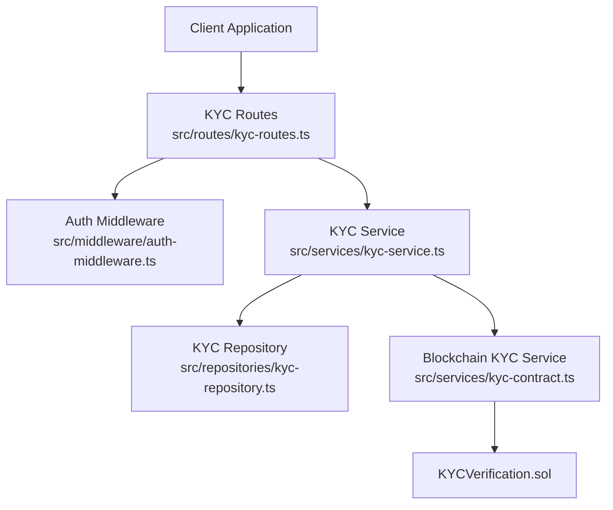
```mermaid
graph TB
Client["Client Application"] --> Routes["KYC Routes<br/>src/routes/kyc-routes.ts"]
Routes --> Auth["Auth Middleware<br/>src/middleware/auth-middleware.ts"]
Routes --> Service["KYC Service<br/>src/services/kyc-service.ts"]
Service --> Repo["KYC Repository<br/>src/repositories/kyc-repository.ts"]
Service --> ContractSvc["Blockchain KYC Service<br/>src/services/kyc-contract.ts"]
ContractSvc --> Contract["KYCVerification.sol"]
```

**Diagram sources**
- [kyc-routes.ts](file://src/routes/kyc-routes.ts#L1-L917)
- [auth-middleware.ts](file://src/middleware/auth-middleware.ts#L1-L101)
- [kyc-service.ts](file://src/services/kyc-service.ts#L1-L547)
- [kyc-repository.ts](file://src/repositories/kyc-repository.ts#L1-L178)
- [kyc-contract.ts](file://src/services/kyc-contract.ts#L1-L366)
- [KYCVerification.sol](file://contracts/KYCVerification.sol#L1-L211)

**Section sources**
- [kyc-routes.ts](file://src/routes/kyc-routes.ts#L1-L917)
- [auth-middleware.ts](file://src/middleware/auth-middleware.ts#L1-L101)
- [kyc-service.ts](file://src/services/kyc-service.ts#L1-L547)
- [kyc-repository.ts](file://src/repositories/kyc-repository.ts#L1-L178)
- [kyc-contract.ts](file://src/services/kyc-contract.ts#L1-L366)
- [KYCVerification.sol](file://contracts/KYCVerification.sol#L1-L211)

## Core Components
- Routes: Define endpoints, request/response schemas, and security requirements.
- Service: Orchestrates validation, business rules, repository updates, and blockchain submissions.
- Repository: Persists KYC records to Supabase and maps entities to models.
- Models: Strongly typed request/response schemas and enums.
- Blockchain Service: Submits KYC to the smart contract and manages approvals/rejections.
- Smart Contract: Stores on-chain verification status and metadata.

**Section sources**
- [kyc-routes.ts](file://src/routes/kyc-routes.ts#L1-L917)
- [kyc-service.ts](file://src/services/kyc-service.ts#L1-L547)
- [kyc-repository.ts](file://src/repositories/kyc-repository.ts#L1-L178)
- [kyc-models.ts](file://src/models/kyc.ts#L1-L206)
- [kyc-contract.ts](file://src/services/kyc-contract.ts#L1-L366)
- [KYCVerification.sol](file://contracts/KYCVerification.sol#L1-L211)

## Architecture Overview
The KYC API follows a layered architecture:
- Presentation Layer: Express routes expose REST endpoints.
- Application Layer: Services encapsulate business logic and integrate with repositories and blockchain.
- Persistence Layer: Repository maps models to Supabase entities and performs CRUD.
- Integration Layer: Blockchain service interacts with the KYC smart contract.

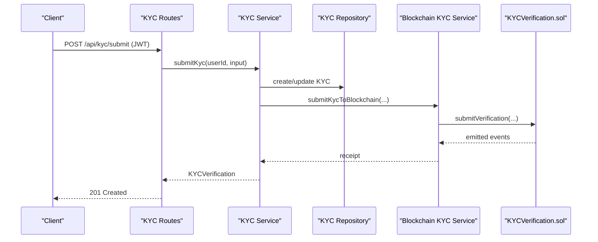
```mermaid
sequenceDiagram
participant C as "Client"
participant R as "KYC Routes"
participant S as "KYC Service"
participant DB as "KYC Repository"
participant BC as "Blockchain KYC Service"
participant SC as "KYCVerification.sol"
C->>R : POST /api/kyc/submit (JWT)
R->>S : submitKyc(userId, input)
S->>DB : create/update KYC
S->>BC : submitKycToBlockchain(...)
BC->>SC : submitVerification(...)
SC-->>BC : emitted events
BC-->>S : receipt
S-->>R : KYCVerification
R-->>C : 201 Created
```

**Diagram sources**
- [kyc-routes.ts](file://src/routes/kyc-routes.ts#L367-L428)
- [kyc-service.ts](file://src/services/kyc-service.ts#L90-L190)
- [kyc-repository.ts](file://src/repositories/kyc-repository.ts#L124-L157)
- [kyc-contract.ts](file://src/services/kyc-contract.ts#L93-L156)
- [KYCVerification.sol](file://contracts/KYCVerification.sol#L61-L87)

## Detailed Component Analysis

### Authentication and Security
- All protected KYC endpoints require a Bearer token in the Authorization header.
- The auth middleware validates the token and attaches user info to the request.
- Administrative endpoints additionally require the admin role.

**Section sources**
- [API-DOCUMENTATION.md](file://docs/API-DOCUMENTATION.md#L7-L14)
- [auth-middleware.ts](file://src/middleware/auth-middleware.ts#L1-L101)
- [kyc-routes.ts](file://src/routes/kyc-routes.ts#L313-L365)

### KYC Status Lifecycle
- pending: Initial state when a user registers or initiates KYC.
- submitted: After successful submission of personal and document information.
- under_review: Admin review phase (managed by admin endpoints).
- approved: Verified and approved; may have expiration.
- rejected: Verification denied with a rejection reason/code.

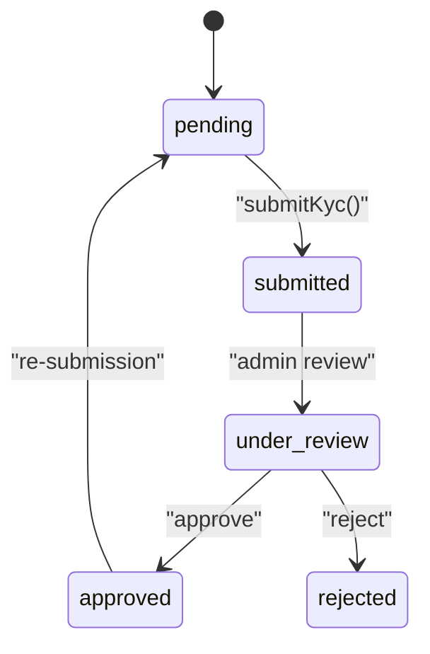
```mermaid
stateDiagram-v2
[*] --> pending
pending --> submitted : "submitKyc()"
submitted --> under_review : "admin review"
under_review --> approved : "approve"
under_review --> rejected : "reject"
approved --> pending : "re-submission"
```

**Diagram sources**
- [kyc-models.ts](file://src/models/kyc.ts#L1-L206)
- [kyc-service.ts](file://src/services/kyc-service.ts#L328-L407)

**Section sources**
- [kyc-models.ts](file://src/models/kyc.ts#L1-L206)
- [kyc-service.ts](file://src/services/kyc-service.ts#L328-L407)

### International KYC Requirements
- Address: addressLine1, city, country, countryCode are required.
- Document: type, documentNumber, issuingCountry, frontImageUrl are required; backImageUrl is optional.
- Selfie: selfieImageUrl is optional but recommended for face match.
- Tier: basic, standard, enhanced; defaults to country tier if not provided.

**Section sources**
- [kyc-routes.ts](file://src/routes/kyc-routes.ts#L205-L237)
- [kyc-models.ts](file://src/models/kyc.ts#L74-L119)

### Endpoint Reference

#### GET /api/kyc/countries
- Purpose: Retrieve supported countries and their KYC requirements.
- Response: Array of SupportedCountry entries.

**Section sources**
- [kyc-routes.ts](file://src/routes/kyc-routes.ts#L240-L260)
- [kyc-service.ts](file://src/services/kyc-service.ts#L45-L71)

#### GET /api/kyc/countries/{countryCode}
- Purpose: Retrieve KYC requirements for a specific country.
- Path Parameters: countryCode (ISO 3166-1 alpha-2).
- Response: SupportedCountry.

**Section sources**
- [kyc-routes.ts](file://src/routes/kyc-routes.ts#L262-L309)
- [kyc-service.ts](file://src/services/kyc-service.ts#L73-L85)

#### GET /api/kyc/status
- Purpose: Retrieve current user’s KYC status.
- Response: KycVerification.

**Section sources**
- [kyc-routes.ts](file://src/routes/kyc-routes.ts#L312-L365)
- [kyc-service.ts](file://src/services/kyc-service.ts#L86-L90)

#### POST /api/kyc/submit
- Purpose: Submit international KYC with personal info and identity documents.
- Request Body: KycSubmissionInput.
- Responses:
  - 201: KYC created/submitted.
  - 400: Validation error.
  - 409: KYC already pending or approved.

**Section sources**
- [kyc-routes.ts](file://src/routes/kyc-routes.ts#L367-L428)
- [kyc-service.ts](file://src/services/kyc-service.ts#L90-L190)

#### POST /api/kyc/liveness/session
- Purpose: Create a liveness verification session with randomized challenges.
- Request Body: LivenessSessionInput (optional challenges).
- Response: LivenessCheck.

**Section sources**
- [kyc-routes.ts](file://src/routes/kyc-routes.ts#L430-L486)
- [kyc-service.ts](file://src/services/kyc-service.ts#L193-L235)

#### GET /api/kyc/liveness/session
- Purpose: Retrieve current liveness session.
- Response: LivenessCheck or 404 if none.

**Section sources**
- [kyc-routes.ts](file://src/routes/kyc-routes.ts#L488-L539)
- [kyc-service.ts](file://src/services/kyc-service.ts#L320-L326)

#### POST /api/kyc/liveness/verify
- Purpose: Submit captured frames and challenge results to finalize liveness.
- Request Body: LivenessVerificationInput (sessionId, capturedFrames, challengeResults).
- Response: LivenessCheck.

**Section sources**
- [kyc-routes.ts](file://src/routes/kyc-routes.ts#L541-L624)
- [kyc-service.ts](file://src/services/kyc-service.ts#L237-L293)

#### POST /api/kyc/face-match
- Purpose: Verify face match between selfie and document.
- Request Body: FaceMatchInput (selfieImageUrl, documentImageUrl).
- Response: { matched: boolean, score: number }.

**Section sources**
- [kyc-routes.ts](file://src/routes/kyc-routes.ts#L626-L698)
- [kyc-service.ts](file://src/services/kyc-service.ts#L295-L318)

#### POST /api/kyc/documents
- Purpose: Add an additional document to an existing KYC.
- Request Body: KycDocument.
- Response: Updated KycVerification.

**Section sources**
- [kyc-routes.ts](file://src/routes/kyc-routes.ts#L700-L764)
- [kyc-service.ts](file://src/services/kyc-service.ts#L417-L454)

#### GET /api/kyc/admin/pending
- Purpose: Get pending KYC reviews (Admin only).
- Response: Array of KycVerification.

**Section sources**
- [kyc-routes.ts](file://src/routes/kyc-routes.ts#L766-L783)
- [kyc-service.ts](file://src/services/kyc-service.ts#L409-L411)

#### GET /api/kyc/admin/status/{status}
- Purpose: Get KYC verifications by status (Admin only).
- Path Parameters: status (pending, submitted, under_review, approved, rejected).
- Response: Array of KycVerification.

**Section sources**
- [kyc-routes.ts](file://src/routes/kyc-routes.ts#L785-L820)
- [kyc-service.ts](file://src/services/kyc-service.ts#L413-L415)

#### POST /api/kyc/admin/review/{kycId}
- Purpose: Approve or reject a KYC verification with AML screening results.
- Path Parameters: kycId (UUID).
- Request Body: KycReviewInput (status, rejectionReason, rejectionCode, riskLevel, riskScore, amlScreeningStatus, amlScreeningNotes).
- Response: Updated KycVerification.

**Section sources**
- [kyc-routes.ts](file://src/routes/kyc-routes.ts#L822-L914)
- [kyc-service.ts](file://src/services/kyc-service.ts#L328-L407)

### Request/Response Schemas

#### InternationalAddress
- Required fields: addressLine1, city, country, countryCode.

**Section sources**
- [kyc-routes.ts](file://src/routes/kyc-routes.ts#L27-L50)
- [kyc-models.ts](file://src/models/kyc.ts#L74-L82)

#### KycDocument
- Required fields: type, documentNumber, issuingCountry, frontImageUrl.
- Optional fields: backImageUrl, issuingAuthority, issueDate, expiryDate.

**Section sources**
- [kyc-routes.ts](file://src/routes/kyc-routes.ts#L51-L77)
- [kyc-models.ts](file://src/models/kyc.ts#L35-L49)

#### LivenessChallenge
- Enumerations: blink, smile, turn_left, turn_right, nod, open_mouth.
- Fields: type, completed, timestamp.

**Section sources**
- [kyc-routes.ts](file://src/routes/kyc-routes.ts#L78-L104)
- [kyc-models.ts](file://src/models/kyc.ts#L29-L33)

#### LivenessCheck
- Fields: id, sessionId, status (pending, passed, failed, expired), confidenceScore, challenges, capturedFrames, completedAt, expiresAt, createdAt.

**Section sources**
- [kyc-routes.ts](file://src/routes/kyc-routes.ts#L89-L107)
- [kyc-models.ts](file://src/models/kyc.ts#L17-L27)

#### KycSubmissionInput
- Required fields: firstName, lastName, dateOfBirth, nationality, address, document.
- Optional fields: middleName, placeOfBirth, secondaryNationality, taxResidenceCountry, taxIdentificationNumber, selfieImageUrl, tier.

**Section sources**
- [kyc-routes.ts](file://src/routes/kyc-routes.ts#L108-L145)
- [kyc-models.ts](file://src/models/kyc.ts#L136-L167)

#### KycVerification
- Fields: id, userId, status, tier, personal info, address, documents, livenessCheck, faceMatchScore, faceMatchStatus, selfieImageUrl, amlScreeningStatus, riskLevel, riskScore, timestamps.

**Section sources**
- [kyc-routes.ts](file://src/routes/kyc-routes.ts#L146-L177)
- [kyc-models.ts](file://src/models/kyc.ts#L84-L119)

#### SupportedCountry
- Fields: code, name, supportedDocuments, requiresLiveness, requiresAddressProof, tier.

**Section sources**
- [kyc-routes.ts](file://src/routes/kyc-routes.ts#L183-L200)
- [kyc-service.ts](file://src/services/kyc-service.ts#L45-L63)

### Client Implementation Examples

#### Example: Submitting Personal Information and Identity Documents
- Steps:
  - Authenticate and obtain a JWT.
  - Call POST /api/kyc/submit with a payload containing personal info, address, and document details.
  - Handle 201 on success, 400 for validation errors, 409 if KYC already pending/approved.

**Section sources**
- [kyc-routes.ts](file://src/routes/kyc-routes.ts#L367-L428)
- [kyc-service.ts](file://src/services/kyc-service.ts#L90-L190)

#### Example: Creating a Liveness Session and Completing Challenges
- Steps:
  - Call POST /api/kyc/liveness/session to create a session with optional challenges.
  - Poll or retrieve the session via GET /api/kyc/liveness/session.
  - Complete challenges and call POST /api/kyc/liveness/verify with captured frames and challenge results.
  - Handle 200 with updated LivenessCheck.

**Section sources**
- [kyc-routes.ts](file://src/routes/kyc-routes.ts#L430-L539)
- [kyc-service.ts](file://src/services/kyc-service.ts#L193-L293)

#### Example: Verifying Face Match
- Steps:
  - Call POST /api/kyc/face-match with selfieImageUrl and documentImageUrl.
  - Receive matched boolean and score; update local KYC accordingly.

**Section sources**
- [kyc-routes.ts](file://src/routes/kyc-routes.ts#L626-L698)
- [kyc-service.ts](file://src/services/kyc-service.ts#L295-L318)

#### Example: Retrieving KYC Status
- Steps:
  - Call GET /api/kyc/status with Authorization: Bearer <token>.
  - Receive KycVerification or 404 if not found.

**Section sources**
- [kyc-routes.ts](file://src/routes/kyc-routes.ts#L312-L365)
- [kyc-service.ts](file://src/services/kyc-service.ts#L86-L90)

### Administrative Workflows
- Retrieve pending reviews: GET /api/kyc/admin/pending.
- Filter by status: GET /api/kyc/admin/status/{status}.
- Review and approve/reject: POST /api/kyc/admin/review/{kycId} with KycReviewInput.

**Section sources**
- [kyc-routes.ts](file://src/routes/kyc-routes.ts#L766-L914)
- [kyc-service.ts](file://src/services/kyc-service.ts#L328-L407)

## Dependency Analysis

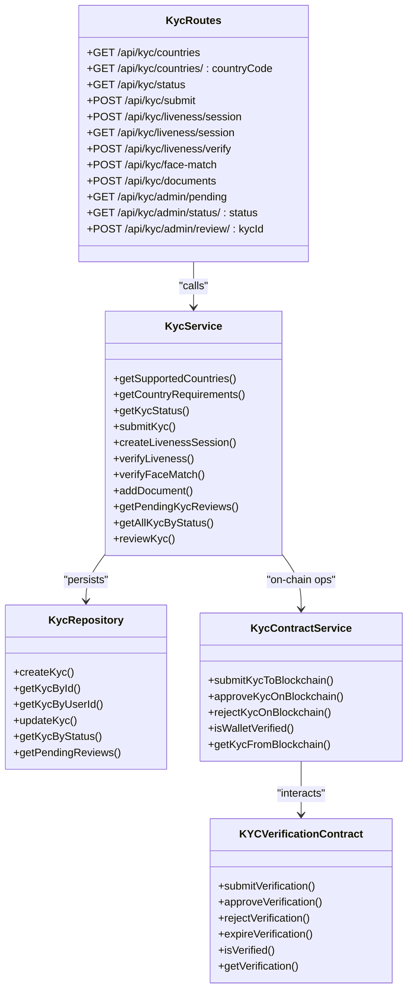
```mermaid
classDiagram
class KycRoutes {
+GET /api/kyc/countries
+GET /api/kyc/countries/ : countryCode
+GET /api/kyc/status
+POST /api/kyc/submit
+POST /api/kyc/liveness/session
+GET /api/kyc/liveness/session
+POST /api/kyc/liveness/verify
+POST /api/kyc/face-match
+POST /api/kyc/documents
+GET /api/kyc/admin/pending
+GET /api/kyc/admin/status/ : status
+POST /api/kyc/admin/review/ : kycId
}
class KycService {
+getSupportedCountries()
+getCountryRequirements()
+getKycStatus()
+submitKyc()
+createLivenessSession()
+verifyLiveness()
+verifyFaceMatch()
+addDocument()
+getPendingKycReviews()
+getAllKycByStatus()
+reviewKyc()
}
class KycRepository {
+createKyc()
+getKycById()
+getKycByUserId()
+updateKyc()
+getKycByStatus()
+getPendingReviews()
}
class KycContractService {
+submitKycToBlockchain()
+approveKycOnBlockchain()
+rejectKycOnBlockchain()
+isWalletVerified()
+getKycFromBlockchain()
}
class KYCVerificationContract {
+submitVerification()
+approveVerification()
+rejectVerification()
+expireVerification()
+isVerified()
+getVerification()
}
KycRoutes --> KycService : "calls"
KycService --> KycRepository : "persists"
KycService --> KycContractService : "on-chain ops"
KycContractService --> KYCVerificationContract : "interacts"
```

**Diagram sources**
- [kyc-routes.ts](file://src/routes/kyc-routes.ts#L1-L917)
- [kyc-service.ts](file://src/services/kyc-service.ts#L1-L547)
- [kyc-repository.ts](file://src/repositories/kyc-repository.ts#L1-L178)
- [kyc-contract.ts](file://src/services/kyc-contract.ts#L1-L366)
- [KYCVerification.sol](file://contracts/KYCVerification.sol#L1-L211)

**Section sources**
- [kyc-routes.ts](file://src/routes/kyc-routes.ts#L1-L917)
- [kyc-service.ts](file://src/services/kyc-service.ts#L1-L547)
- [kyc-repository.ts](file://src/repositories/kyc-repository.ts#L1-L178)
- [kyc-contract.ts](file://src/services/kyc-contract.ts#L1-L366)
- [KYCVerification.sol](file://contracts/KYCVerification.sol#L1-L211)

## Performance Considerations
- Liveness verification simulates confidence scoring; in production, use a dedicated ML model to compute scores efficiently.
- Face match uses simulated scoring; integrate a robust face recognition API for accuracy and latency.
- Batch administrative queries (pending and status filters) are paginated; tune limits for optimal response times.
- On-chain operations are asynchronous; use transaction polling or callbacks to avoid blocking requests.

[No sources needed since this section provides general guidance]

## Troubleshooting Guide
Common issues and resolutions:
- Unauthorized: Ensure Authorization header includes a valid Bearer token.
- Invalid token: Token missing, malformed, or expired; re-authenticate.
- KYC not found: User has no KYC record; submit KYC first.
- Session expired: Liveness session timed out; recreate a new session.
- Validation errors: Missing required fields in submission or document upload; refer to schema requirements.
- KYC already pending/approved: Cannot resubmit until resolution; wait for admin review or re-submission window.

**Section sources**
- [auth-middleware.ts](file://src/middleware/auth-middleware.ts#L25-L70)
- [kyc-routes.ts](file://src/routes/kyc-routes.ts#L312-L428)
- [kyc-service.ts](file://src/services/kyc-service.ts#L193-L318)

## Conclusion
The KYC API provides a comprehensive, secure, and extensible framework for international identity verification. It enforces strict validation, supports liveness checks, integrates with on-chain verification, and offers administrative controls. Clients should implement robust error handling, respect privacy constraints, and leverage the provided endpoints to deliver a seamless user experience.

[No sources needed since this section summarizes without analyzing specific files]

## Appendices

### Privacy Considerations
- Off-chain: Store only hashed identifiers and minimal data; keep personal details behind access-controlled APIs.
- On-chain: The smart contract stores status, tier, and dataHash, not personal data, aligning with privacy regulations.
- Face match and document images: Handle securely; avoid storing raw images on server; use signed URLs and short-lived access tokens.

**Section sources**
- [KYCVerification.sol](file://contracts/KYCVerification.sol#L1-L211)
- [kyc-contract.ts](file://src/services/kyc-contract.ts#L66-L87)

### Integration with Third-Party Identity Verification Services
- The current implementation simulates liveness and face matching; integrate with external services by replacing the simulation logic in the service layer.
- Ensure compliance with GDPR and local privacy laws; use hashing and encryption for sensitive data.

**Section sources**
- [kyc-service.ts](file://src/services/kyc-service.ts#L237-L318)
- [kyc-contract.ts](file://src/services/kyc-contract.ts#L90-L156)

---

# Face Match Verification API

<cite>
**Referenced Files in This Document**
- [kyc-routes.ts](file://src/routes/kyc-routes.ts)
- [kyc-service.ts](file://src/services/kyc-service.ts)
- [kyc.ts](file://src/models/kyc.ts)
- [kyc-repository.ts](file://src/repositories/kyc-repository.ts)
- [swagger.ts](file://src/config/swagger.ts)
- [API-DOCUMENTATION.md](file://docs/API-DOCUMENTATION.md)
- [security-middleware.ts](file://src/middleware/security-middleware.ts)
- [validation-middleware.ts](file://src/middleware/validation-middleware.ts)
- [test-kyc-flow.cjs](file://scripts/test-kyc-flow.cjs)
</cite>

## Table of Contents
1. [Introduction](#introduction)
2. [Project Structure](#project-structure)
3. [Core Components](#core-components)
4. [Architecture Overview](#architecture-overview)
5. [Detailed Component Analysis](#detailed-component-analysis)
6. [Dependency Analysis](#dependency-analysis)
7. [Performance Considerations](#performance-considerations)
8. [Troubleshooting Guide](#troubleshooting-guide)
9. [Conclusion](#conclusion)
10. [Appendices](#appendices)

## Introduction
This document describes the POST /api/kyc/face-match endpoint used to compare a user’s selfie with their identity document photo. It specifies the HTTP method, URL pattern, request body schema, authentication requirements, response schema, and the underlying confidence scoring and matching logic. It also provides guidance on image quality requirements and outlines privacy considerations for processing biometric data.

## Project Structure
The face match verification endpoint is implemented as part of the KYC module:
- Route handler: defines the endpoint, authentication, and request validation
- Service: performs the matching logic and updates KYC state
- Model: defines the request/response shapes and thresholds
- Repository: persists KYC updates to the database
- Swagger/OpenAPI: documents the endpoint and security scheme
- Test script: demonstrates usage in a real flow

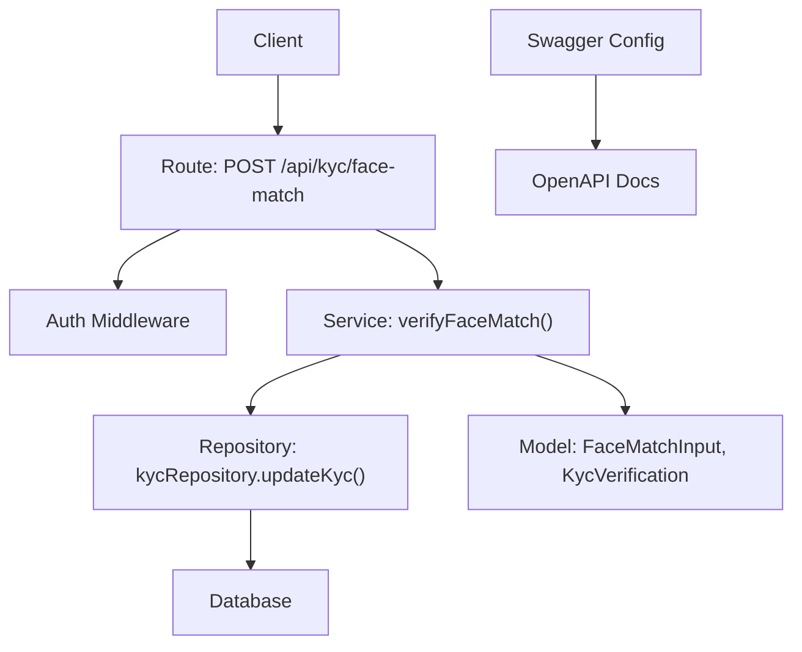
```mermaid
graph TB
Client["Client"] --> Route["Route: POST /api/kyc/face-match"]
Route --> Auth["Auth Middleware"]
Route --> Service["Service: verifyFaceMatch()"]
Service --> Repo["Repository: kycRepository.updateKyc()"]
Repo --> DB["Database"]
Service --> Model["Model: FaceMatchInput, KycVerification"]
Swagger["Swagger Config"] --> Docs["OpenAPI Docs"]
```

**Diagram sources**
- [kyc-routes.ts](file://src/routes/kyc-routes.ts#L626-L698)
- [kyc-service.ts](file://src/services/kyc-service.ts#L295-L318)
- [kyc-repository.ts](file://src/repositories/kyc-repository.ts#L153-L157)
- [swagger.ts](file://src/config/swagger.ts#L22-L28)

**Section sources**
- [kyc-routes.ts](file://src/routes/kyc-routes.ts#L626-L698)
- [swagger.ts](file://src/config/swagger.ts#L22-L28)

## Core Components
- Endpoint: POST /api/kyc/face-match
- Authentication: Bearer JWT via Authorization header
- Request body: selfieImageUrl and documentImageUrl
- Response: matched (boolean) and score (number)
- Threshold: matched is true when score >= 0.80

Implementation highlights:
- Route enforces JWT and validates presence of selfieImageUrl and documentImageUrl
- Service simulates face matching and sets faceMatchStatus and faceMatchScore
- Repository persists updates to the KYC record

**Section sources**
- [kyc-routes.ts](file://src/routes/kyc-routes.ts#L626-L698)
- [kyc-service.ts](file://src/services/kyc-service.ts#L295-L318)
- [kyc.ts](file://src/models/kyc.ts#L183-L186)

## Architecture Overview
The endpoint follows a layered architecture:
- Presentation layer: Express route
- Application layer: Service orchestrating business logic
- Persistence layer: Repository mapping to database
- Data model: Strong typing for inputs and outputs

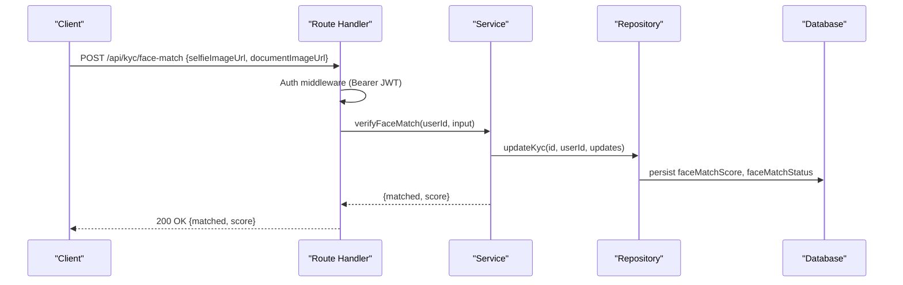
```mermaid
sequenceDiagram
participant C as "Client"
participant R as "Route Handler"
participant S as "Service"
participant P as "Repository"
participant D as "Database"
C->>R : POST /api/kyc/face-match {selfieImageUrl, documentImageUrl}
R->>R : Auth middleware (Bearer JWT)
R->>S : verifyFaceMatch(userId, input)
S->>P : updateKyc(id, userId, updates)
P->>D : persist faceMatchScore, faceMatchStatus
S-->>R : {matched, score}
R-->>C : 200 OK {matched, score}
```

**Diagram sources**
- [kyc-routes.ts](file://src/routes/kyc-routes.ts#L662-L698)
- [kyc-service.ts](file://src/services/kyc-service.ts#L295-L318)
- [kyc-repository.ts](file://src/repositories/kyc-repository.ts#L153-L157)

## Detailed Component Analysis

### Endpoint Definition
- Method: POST
- URL: /api/kyc/face-match
- Authentication: Bearer JWT (Authorization: Bearer <token>)
- Request body schema:
  - selfieImageUrl: string (required)
  - documentImageUrl: string (required)
- Response schema:
  - matched: boolean
  - score: number

Behavior:
- On success: returns 200 OK with matched and score
- On validation failure: returns 400 with error details
- On unauthorized: returns 401

**Section sources**
- [kyc-routes.ts](file://src/routes/kyc-routes.ts#L626-L698)
- [swagger.ts](file://src/config/swagger.ts#L22-L28)
- [API-DOCUMENTATION.md](file://docs/API-DOCUMENTATION.md#L7-L13)

### Matching Logic and Confidence Scoring
- Threshold: matched = true if score >= 0.80
- Current implementation simulates matching with a random score in [0.75, 1.00]
- In production, replace the simulation with a real face recognition API

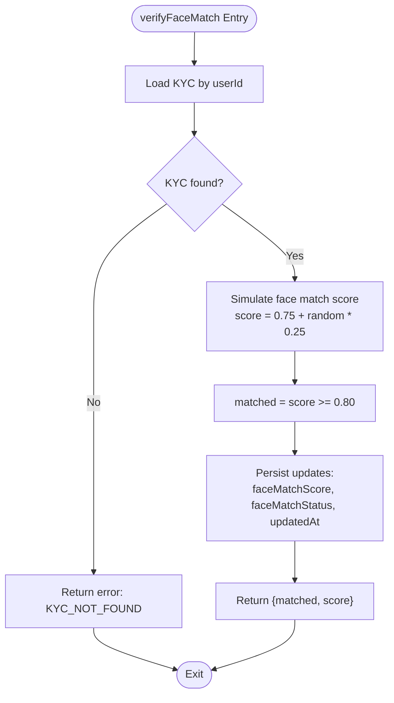
```mermaid
flowchart TD
Start(["verifyFaceMatch Entry"]) --> LoadKyc["Load KYC by userId"]
LoadKyc --> Found{"KYC found?"}
Found --> |No| ReturnError["Return error: KYC_NOT_FOUND"]
Found --> |Yes| Simulate["Simulate face match score<br/>score = 0.75 + random * 0.25"]
Simulate --> ComputeMatch["matched = score >= 0.80"]
ComputeMatch --> Persist["Persist updates:<br/>faceMatchScore, faceMatchStatus, updatedAt"]
Persist --> ReturnOk["Return {matched, score}"]
ReturnError --> End(["Exit"])
ReturnOk --> End
```

**Diagram sources**
- [kyc-service.ts](file://src/services/kyc-service.ts#L295-L318)

**Section sources**
- [kyc-service.ts](file://src/services/kyc-service.ts#L63-L68)
- [kyc-service.ts](file://src/services/kyc-service.ts#L295-L318)

### Request Validation and Error Handling
- Route-level validation ensures selfieImageUrl and documentImageUrl are present
- Unauthorized requests return 401
- Validation failures return 400 with structured error payload

Validation patterns used across the codebase:
- URI format validation for URLs
- Presence checks for required fields

**Section sources**
- [kyc-routes.ts](file://src/routes/kyc-routes.ts#L675-L684)
- [validation-middleware.ts](file://src/middleware/validation-middleware.ts#L241-L277)

### Response Schema
- matched: boolean
- score: number

These fields are persisted to the KYC record and returned to the client.

**Section sources**
- [kyc-service.ts](file://src/services/kyc-service.ts#L295-L318)
- [kyc.ts](file://src/models/kyc.ts#L183-L186)

### Example Requests and Responses
- Successful match (example):
  - Request: POST /api/kyc/face-match with selfieImageUrl and documentImageUrl
  - Response: { matched: true, score: 0.85 }
- Non-match (example):
  - Request: Same as above
  - Response: { matched: false, score: 0.76 }

Note: The score is simulated in the current implementation.

**Section sources**
- [test-kyc-flow.cjs](file://scripts/test-kyc-flow.cjs#L171-L186)

## Dependency Analysis
- Route depends on auth middleware and service
- Service depends on repository and models
- Repository depends on Supabase client and entity mapping
- Swagger config defines the bearerAuth security scheme

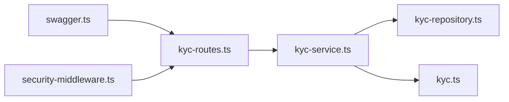
```mermaid
graph LR
Routes["kyc-routes.ts"] --> Service["kyc-service.ts"]
Service --> Repo["kyc-repository.ts"]
Service --> Models["kyc.ts"]
Swagger["swagger.ts"] --> Routes
Security["security-middleware.ts"] --> Routes
```

**Diagram sources**
- [kyc-routes.ts](file://src/routes/kyc-routes.ts#L626-L698)
- [kyc-service.ts](file://src/services/kyc-service.ts#L1-L40)
- [kyc-repository.ts](file://src/repositories/kyc-repository.ts#L1-L41)
- [swagger.ts](file://src/config/swagger.ts#L22-L28)

**Section sources**
- [kyc-routes.ts](file://src/routes/kyc-routes.ts#L626-L698)
- [kyc-service.ts](file://src/services/kyc-service.ts#L1-L40)
- [swagger.ts](file://src/config/swagger.ts#L22-L28)

## Performance Considerations
- Image resolution and compression: Higher resolution images generally improve matching accuracy but increase processing time and bandwidth usage
- Network latency: Fetching images from remote URLs adds latency; consider caching or pre-uploading images to reduce round trips
- Batch processing: If integrating with other KYC steps, coordinate timing to minimize redundant image fetches

[No sources needed since this section provides general guidance]

## Troubleshooting Guide
Common issues and resolutions:
- 401 Unauthorized: Ensure Authorization header includes a valid Bearer token
- 400 Validation Error: Confirm selfieImageUrl and documentImageUrl are present and valid URIs
- 404 Not Found: The KYC record may not exist for the authenticated user; submit KYC first
- Unexpected non-match: Lower scores can occur due to lighting, pose, or image quality; retry with improved images

**Section sources**
- [kyc-routes.ts](file://src/routes/kyc-routes.ts#L666-L698)
- [kyc-service.ts](file://src/services/kyc-service.ts#L295-L318)

## Conclusion
The POST /api/kyc/face-match endpoint enables biometric verification by comparing a selfie with an identity document photo. It uses a configurable threshold to determine a match and returns a numeric confidence score. While the current implementation simulates matching, integrating a robust face recognition API will enable production-grade accuracy. Proper image quality and secure handling of biometric data are essential for reliable verification.

[No sources needed since this section summarizes without analyzing specific files]

## Appendices

### Implementation Guidance: Image Quality Requirements
- Lighting: Even, well-lit conditions; avoid backlighting or shadows
- Pose: Front-facing, centered face with eyes open and mouth closed
- Resolution: Minimum recommended resolution to ensure facial feature clarity
- Background: Plain, non-distracting background
- Document: Clear front-facing photo with no glare or folds
- Cropping: Ensure the face occupies approximately 60–80% of the image width

[No sources needed since this section provides general guidance]

### Privacy Considerations
- Data minimization: Only transmit images necessary for verification
- Secure transport: Use HTTPS to prevent interception
- Storage: Store images securely and apply encryption at rest
- Retention: Define and enforce retention policies; delete images after verification completes
- Consent: Obtain explicit consent for biometric processing and explain purpose and duration
- Compliance: Adhere to applicable regulations (e.g., GDPR, CCPA) for sensitive biometric data

[No sources needed since this section provides general guidance]

---

# KYC Administration API

<cite>
**Referenced Files in This Document**
- [kyc-routes.ts](file://src/routes/kyc-routes.ts)
- [auth-middleware.ts](file://src/middleware/auth-middleware.ts)
- [kyc-service.ts](file://src/services/kyc-service.ts)
- [kyc-repository.ts](file://src/repositories/kyc-repository.ts)
- [kyc-model.ts](file://src/models/kyc.ts)
- [user-model.ts](file://src/models/user.ts)
- [swagger.ts](file://src/config/swagger.ts)
- [API-DOCUMENTATION.md](file://docs/API-DOCUMENTATION.md)
</cite>

## Table of Contents
1. [Introduction](#introduction)
2. [Project Structure](#project-structure)
3. [Core Components](#core-components)
4. [Architecture Overview](#architecture-overview)
5. [Detailed Component Analysis](#detailed-component-analysis)
6. [Dependency Analysis](#dependency-analysis)
7. [Performance Considerations](#performance-considerations)
8. [Troubleshooting Guide](#troubleshooting-guide)
9. [Conclusion](#conclusion)

## Introduction
This document describes the KYC administration endpoints that are accessible only to admin users. It covers:
- GET /api/kyc/admin/pending: Retrieve all KYC verifications awaiting review.
- GET /api/kyc/admin/status/{status}: Filter KYC records by status (pending, submitted, under_review, approved, rejected).

It specifies HTTP methods, URL patterns, authentication requirements (JWT with admin role), response schemas, and error responses. It also explains the authorization flow using the requireRole('admin') middleware and how role-based access control prevents unauthorized access. Example responses and usage examples for admin dashboards are included.

## Project Structure
The KYC administration endpoints are implemented in the routing layer and backed by service and repository layers. The Swagger configuration defines the OpenAPI schema for the endpoints.

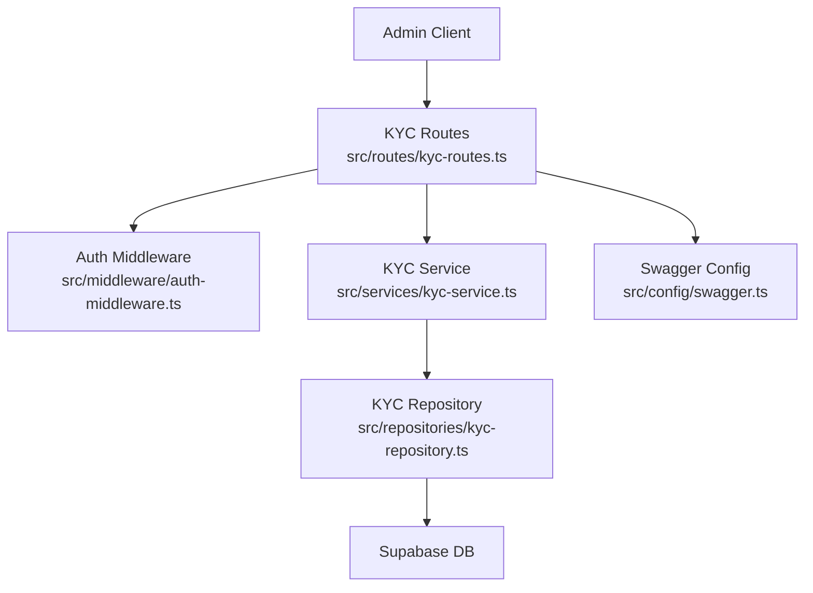
```mermaid
graph TB
Client["Admin Client"] --> Routes["KYC Routes<br/>src/routes/kyc-routes.ts"]
Routes --> AuthMW["Auth Middleware<br/>src/middleware/auth-middleware.ts"]
Routes --> Service["KYC Service<br/>src/services/kyc-service.ts"]
Service --> Repo["KYC Repository<br/>src/repositories/kyc-repository.ts"]
Repo --> DB["Supabase DB"]
Routes --> Swagger["Swagger Config<br/>src/config/swagger.ts"]
```

**Diagram sources**
- [kyc-routes.ts](file://src/routes/kyc-routes.ts#L767-L820)
- [auth-middleware.ts](file://src/middleware/auth-middleware.ts#L25-L100)
- [kyc-service.ts](file://src/services/kyc-service.ts#L409-L415)
- [kyc-repository.ts](file://src/repositories/kyc-repository.ts#L119-L175)
- [swagger.ts](file://src/config/swagger.ts#L1-L233)

**Section sources**
- [kyc-routes.ts](file://src/routes/kyc-routes.ts#L767-L820)
- [swagger.ts](file://src/config/swagger.ts#L1-L233)

## Core Components
- Route handlers for admin endpoints:
  - GET /api/kyc/admin/pending
  - GET /api/kyc/admin/status/{status}
- Middleware:
  - authMiddleware: validates JWT Bearer token
  - requireRole('admin'): enforces admin role
- Service functions:
  - getPendingKycReviews()
  - getAllKycByStatus(status)
- Repository:
  - getPendingReviews()
  - getKycByStatus(status)
- Data model:
  - KycVerification and KycStatus

Key implementation references:
- Admin endpoints and validation: [kyc-routes.ts](file://src/routes/kyc-routes.ts#L767-L820)
- Role enforcement: [auth-middleware.ts](file://src/middleware/auth-middleware.ts#L72-L100)
- Service functions: [kyc-service.ts](file://src/services/kyc-service.ts#L409-L415)
- Repository functions: [kyc-repository.ts](file://src/repositories/kyc-repository.ts#L119-L175)
- Data model: [kyc-model.ts](file://src/models/kyc.ts#L1-L120), [user-model.ts](file://src/models/user.ts#L1-L4)

**Section sources**
- [kyc-routes.ts](file://src/routes/kyc-routes.ts#L767-L820)
- [auth-middleware.ts](file://src/middleware/auth-middleware.ts#L25-L100)
- [kyc-service.ts](file://src/services/kyc-service.ts#L409-L415)
- [kyc-repository.ts](file://src/repositories/kyc-repository.ts#L119-L175)
- [kyc-model.ts](file://src/models/kyc.ts#L1-L120)
- [user-model.ts](file://src/models/user.ts#L1-L4)

## Architecture Overview
The admin endpoints follow a layered architecture:
- Router layer validates path parameters and applies auth and role middleware.
- Service layer orchestrates repository calls and returns typed results.
- Repository layer maps models to database entities and executes queries.
- Swagger defines the OpenAPI schema for the endpoints.

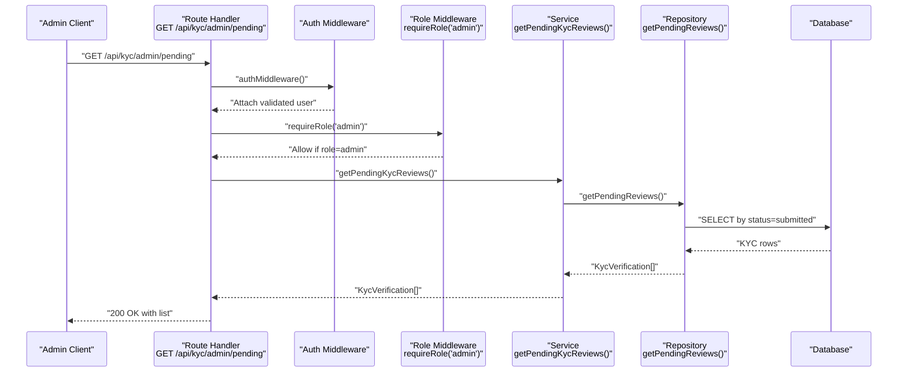
```mermaid
sequenceDiagram
participant C as "Admin Client"
participant R as "Route Handler<br/>GET /api/kyc/admin/pending"
participant A as "Auth Middleware"
participant RA as "Role Middleware<br/>requireRole('admin')"
participant S as "Service<br/>getPendingKycReviews()"
participant RP as "Repository<br/>getPendingReviews()"
participant DB as "Database"
C->>R : "GET /api/kyc/admin/pending"
R->>A : "authMiddleware()"
A-->>R : "Attach validated user"
R->>RA : "requireRole('admin')"
RA-->>R : "Allow if role=admin"
R->>S : "getPendingKycReviews()"
S->>RP : "getPendingReviews()"
RP->>DB : "SELECT by status=submitted"
DB-->>RP : "KYC rows"
RP-->>S : "KycVerification[]"
S-->>R : "KycVerification[]"
R-->>C : "200 OK with list"
```

**Diagram sources**
- [kyc-routes.ts](file://src/routes/kyc-routes.ts#L767-L783)
- [auth-middleware.ts](file://src/middleware/auth-middleware.ts#L25-L100)
- [kyc-service.ts](file://src/services/kyc-service.ts#L409-L411)
- [kyc-repository.ts](file://src/repositories/kyc-repository.ts#L172-L175)

## Detailed Component Analysis

### Endpoint: GET /api/kyc/admin/pending
- Purpose: Retrieve all KYC verifications awaiting review (status submitted).
- Authentication: JWT Bearer token required.
- Authorization: Admin role required.
- Response: Array of KycVerification objects.

Implementation highlights:
- Route handler: [kyc-routes.ts](file://src/routes/kyc-routes.ts#L767-L783)
- Service function: [kyc-service.ts](file://src/services/kyc-service.ts#L409-L411)
- Repository function: [kyc-repository.ts](file://src/repositories/kyc-repository.ts#L172-L175)
- Data model: [kyc-model.ts](file://src/models/kyc.ts#L84-L119)

Response schema (OpenAPI):
- Type: array of KycVerification
- KycVerification fields include identifiers, personal info, address, documents, livenessCheck, faceMatch fields, AML screening fields, risk fields, timestamps, and status.

Swagger references:
- Schema definitions: [swagger.ts](file://src/config/swagger.ts#L1-L233)
- Endpoint documentation: [kyc-routes.ts](file://src/routes/kyc-routes.ts#L767-L783)

Example response (conceptual):
- An array of KycVerification entries with fields such as id, userId, status, tier, name, nationality, address, documents, livenessCheck, faceMatchScore/status, amlScreeningStatus, riskLevel, timestamps, and optional blockchain fields.

Authorization flow:
- authMiddleware validates token and attaches user to request.
- requireRole('admin') checks user role and rejects non-admins with 403.

Error responses:
- 401 Unauthorized: missing or invalid token.
- 403 Forbidden: insufficient permissions (non-admin).

**Section sources**
- [kyc-routes.ts](file://src/routes/kyc-routes.ts#L767-L783)
- [auth-middleware.ts](file://src/middleware/auth-middleware.ts#L25-L100)
- [kyc-service.ts](file://src/services/kyc-service.ts#L409-L411)
- [kyc-repository.ts](file://src/repositories/kyc-repository.ts#L172-L175)
- [swagger.ts](file://src/config/swagger.ts#L1-L233)
- [kyc-model.ts](file://src/models/kyc.ts#L84-L119)

### Endpoint: GET /api/kyc/admin/status/{status}
- Purpose: Filter KYC verifications by status.
- Path parameter: status must be one of pending, submitted, under_review, approved, rejected.
- Authentication: JWT Bearer token required.
- Authorization: Admin role required.
- Response: Array of KycVerification objects.

Implementation highlights:
- Route handler validates status and calls service/repository: [kyc-routes.ts](file://src/routes/kyc-routes.ts#L785-L820)
- Service function: [kyc-service.ts](file://src/services/kyc-service.ts#L413-L415)
- Repository function: [kyc-repository.ts](file://src/repositories/kyc-repository.ts#L159-L170)
- Data model: [kyc-model.ts](file://src/models/kyc.ts#L1-L120)

Response schema (OpenAPI):
- Same as pending endpoint: array of KycVerification.

Validation and error handling:
- Invalid status returns 400 with INVALID_STATUS.
- Successful requests return 200 with filtered list.

Authorization flow:
- Same as pending endpoint.

Error responses:
- 400 Bad Request: invalid status value.
- 401 Unauthorized: missing or invalid token.
- 403 Forbidden: insufficient permissions (non-admin).

**Section sources**
- [kyc-routes.ts](file://src/routes/kyc-routes.ts#L785-L820)
- [kyc-service.ts](file://src/services/kyc-service.ts#L413-L415)
- [kyc-repository.ts](file://src/repositories/kyc-repository.ts#L159-L170)
- [kyc-model.ts](file://src/models/kyc.ts#L1-L120)

### Authorization Flow and Role-Based Access Control
The admin endpoints apply two middleware layers:
- authMiddleware: verifies Authorization header format and validates JWT. On success, attaches user with role to request.
- requireRole('admin'): ensures the user role includes 'admin'. Non-admin users receive 403.

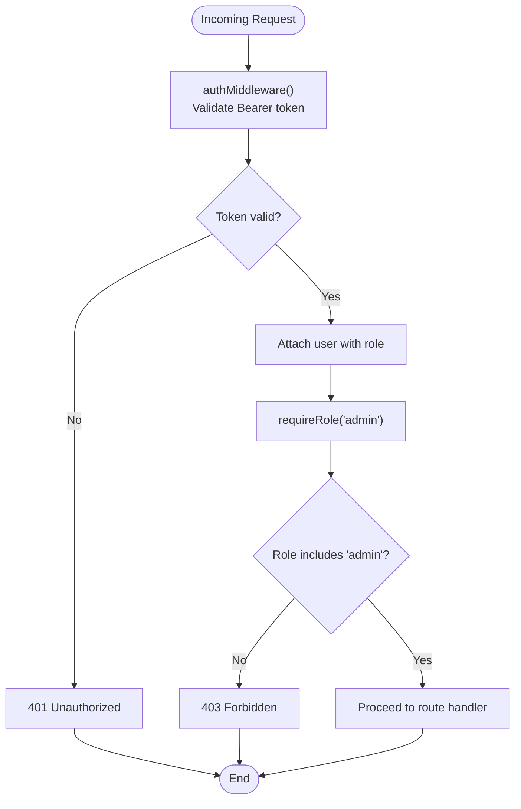
```mermaid
flowchart TD
Start(["Incoming Request"]) --> CheckAuth["authMiddleware()<br/>Validate Bearer token"]
CheckAuth --> HasToken{"Token valid?"}
HasToken --> |No| Return401["401 Unauthorized"]
HasToken --> |Yes| AttachUser["Attach user with role"]
AttachUser --> CheckRole["requireRole('admin')"]
CheckRole --> IsAdmin{"Role includes 'admin'?"}
IsAdmin --> |No| Return403["403 Forbidden"]
IsAdmin --> |Yes| Next["Proceed to route handler"]
Return401 --> End(["End"])
Return403 --> End
Next --> End
```

**Diagram sources**
- [auth-middleware.ts](file://src/middleware/auth-middleware.ts#L25-L100)

**Section sources**
- [auth-middleware.ts](file://src/middleware/auth-middleware.ts#L25-L100)
- [user-model.ts](file://src/models/user.ts#L1-L4)

### Data Model: KycVerification
The response schema for both endpoints is an array of KycVerification. Key fields include:
- Identity: id, userId, firstName, middleName, lastName, dateOfBirth, placeOfBirth, nationality, secondaryNationality, taxResidenceCountry, taxIdentificationNumber
- Address: InternationalAddress with addressLine1, addressLine2, city, stateProvince, postalCode, country, countryCode
- Documents: array of KycDocument with type, documentNumber, issuingCountry, issuingAuthority, issueDate, expiryDate, front/back image URLs, verification metadata
- Verification: selfieImageUrl, livenessCheck, faceMatchScore, faceMatchStatus, amlScreeningStatus, amlScreeningNotes, pepStatus, sanctionsStatus, riskLevel, riskScore
- Lifecycle: status, tier, submittedAt, reviewedAt, reviewedBy, rejectionReason, rejectionCode, expiresAt, createdAt, updatedAt

Swagger schema references:
- KycVerification and related schemas: [swagger.ts](file://src/config/swagger.ts#L1-L233)
- Model definitions: [kyc-model.ts](file://src/models/kyc.ts#L1-L120)

**Section sources**
- [swagger.ts](file://src/config/swagger.ts#L1-L233)
- [kyc-model.ts](file://src/models/kyc.ts#L1-L120)

### Usage Examples for Admin Dashboard
- Fetch pending KYCs to display in a review queue:
  - Call GET /api/kyc/admin/pending with Authorization: Bearer <admin_token>
  - Render the returned array of KycVerification entries in a table/grid
- Filter by status to build status dashboards:
  - Call GET /api/kyc/admin/status/submitted with Authorization: Bearer <admin_token>
  - Paginate or sort by submittedAt as needed
- Integrate with admin UI:
  - Use the same JWT for subsequent admin actions (e.g., approve/reject)
  - Display riskLevel, amlScreeningStatus, and documents for review decisions

[No sources needed since this section provides general guidance]

## Dependency Analysis
The admin endpoints depend on the following chain:
- Router -> Auth Middleware -> Role Middleware -> Service -> Repository -> Database

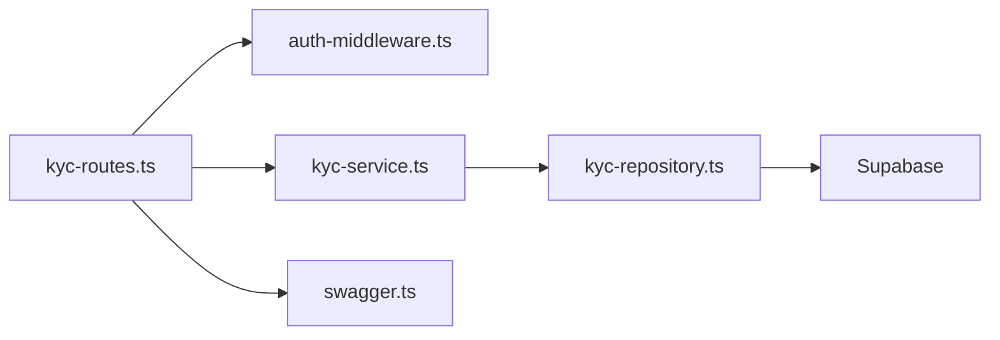
```mermaid
graph LR
Routes["kyc-routes.ts"] --> Auth["auth-middleware.ts"]
Routes --> Service["kyc-service.ts"]
Service --> Repo["kyc-repository.ts"]
Repo --> DB["Supabase"]
Routes --> Swagger["swagger.ts"]
```

**Diagram sources**
- [kyc-routes.ts](file://src/routes/kyc-routes.ts#L767-L820)
- [auth-middleware.ts](file://src/middleware/auth-middleware.ts#L25-L100)
- [kyc-service.ts](file://src/services/kyc-service.ts#L409-L415)
- [kyc-repository.ts](file://src/repositories/kyc-repository.ts#L119-L175)
- [swagger.ts](file://src/config/swagger.ts#L1-L233)

**Section sources**
- [kyc-routes.ts](file://src/routes/kyc-routes.ts#L767-L820)
- [auth-middleware.ts](file://src/middleware/auth-middleware.ts#L25-L100)
- [kyc-service.ts](file://src/services/kyc-service.ts#L409-L415)
- [kyc-repository.ts](file://src/repositories/kyc-repository.ts#L119-L175)
- [swagger.ts](file://src/config/swagger.ts#L1-L233)

## Performance Considerations
- Pagination: The repository limits results to a default small number (e.g., 50) to prevent large payloads. Admin dashboards should implement pagination or filtering to manage load.
- Sorting: Requests are sorted by submittedAt to prioritize recent submissions.
- Token validation: authMiddleware performs a single token validation per request; keep JWT short-lived and rotate tokens regularly.

[No sources needed since this section provides general guidance]

## Troubleshooting Guide
Common issues and resolutions:
- 401 Unauthorized
  - Cause: Missing Authorization header or invalid/missing Bearer token.
  - Resolution: Ensure Authorization: Bearer <valid_jwt> is sent.
- 403 Forbidden
  - Cause: User authenticated but lacks admin role.
  - Resolution: Authenticate with an admin account or escalate privileges.
- 400 Bad Request (status filter)
  - Cause: status path parameter not one of the allowed values.
  - Resolution: Use one of pending, submitted, under_review, approved, rejected.
- 404 Not Found (other endpoints)
  - Cause: Resource not found in other KYC endpoints.
  - Resolution: Verify resource IDs and statuses.

Error response format:
- All errors include error.code, error.message, optional details, timestamp, and requestId.

**Section sources**
- [auth-middleware.ts](file://src/middleware/auth-middleware.ts#L25-L100)
- [kyc-routes.ts](file://src/routes/kyc-routes.ts#L785-L820)
- [API-DOCUMENTATION.md](file://docs/API-DOCUMENTATION.md#L611-L642)

## Conclusion
The KYC administration endpoints provide secure, role-gated access to KYC review data. Admin users can fetch pending verifications and filter by status using JWT authentication and admin role enforcement. The response schema is defined by the KycVerification model, and the implementation follows a clean separation of concerns across routing, service, and repository layers.

---

# KYC Data Retrieval API

<cite>
**Referenced Files in This Document**
- [kyc-routes.ts](file://src/routes/kyc-routes.ts)
- [kyc-service.ts](file://src/services/kyc-service.ts)
- [kyc-models.ts](file://src/models/kyc.ts)
- [kyc-repository.ts](file://src/repositories/kyc-repository.ts)
- [swagger.ts](file://src/config/swagger.ts)
- [auth-middleware.ts](file://src/middleware/auth-middleware.ts)
- [supabase.ts](file://src/config/supabase.ts)
- [KYCVerification.sol](file://contracts/KYCVerification.sol)
</cite>

## Table of Contents
1. [Introduction](#introduction)
2. [Project Structure](#project-structure)
3. [Core Components](#core-components)
4. [Architecture Overview](#architecture-overview)
5. [Detailed Component Analysis](#detailed-component-analysis)
6. [Dependency Analysis](#dependency-analysis)
7. [Performance Considerations](#performance-considerations)
8. [Troubleshooting Guide](#troubleshooting-guide)
9. [Conclusion](#conclusion)
10. [Appendices](#appendices)

## Introduction
This document specifies the KYC data retrieval API for the FreelanceXchain system. It covers:
- GET /api/kyc/status: Returns the current user’s complete KYC verification record, including personal information, document details, liveness check results, and verification status.
- GET /api/kyc/countries: Retrieves all supported countries for KYC.
- GET /api/kyc/countries/{countryCode}: Retrieves KYC requirements for a specific country.

It defines HTTP methods, authentication requirements (JWT for status endpoint), response schemas, and error handling. It also explains the KycVerification response schema lifecycle (pending, submitted, under_review, approved, rejected) and tier levels (basic, standard, enhanced). Guidance is included for building dynamic KYC forms based on country requirements.

## Project Structure
The KYC endpoints are implemented in the routing layer, backed by service logic, typed models, and a repository that persists to Supabase. Swagger definitions are centralized for OpenAPI documentation.

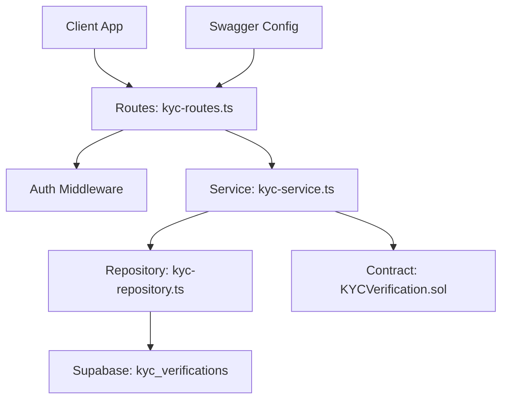
```mermaid
graph TB
Client["Client App"] --> Routes["Routes: kyc-routes.ts"]
Routes --> Auth["Auth Middleware"]
Routes --> Service["Service: kyc-service.ts"]
Service --> Repo["Repository: kyc-repository.ts"]
Repo --> DB["Supabase: kyc_verifications"]
Service --> Contract["Contract: KYCVerification.sol"]
Swagger["Swagger Config"] --> Routes
```

**Diagram sources**
- [kyc-routes.ts](file://src/routes/kyc-routes.ts#L1-L120)
- [kyc-service.ts](file://src/services/kyc-service.ts#L1-L120)
- [kyc-repository.ts](file://src/repositories/kyc-repository.ts#L1-L60)
- [swagger.ts](file://src/config/swagger.ts#L1-L60)
- [supabase.ts](file://src/config/supabase.ts#L1-L25)
- [KYCVerification.sol](file://contracts/KYCVerification.sol#L1-L40)

**Section sources**
- [kyc-routes.ts](file://src/routes/kyc-routes.ts#L1-L120)
- [swagger.ts](file://src/config/swagger.ts#L1-L60)
- [supabase.ts](file://src/config/supabase.ts#L1-L25)

## Core Components
- Routes define endpoints, request validation, and response formatting.
- Service encapsulates business logic, country requirement checks, and integration with the repository and blockchain contract.
- Models define the KycVerification schema and related types.
- Repository maps domain models to Supabase entities and performs persistence.
- Swagger centralizes OpenAPI definitions for interactive docs and schema references.

**Section sources**
- [kyc-routes.ts](file://src/routes/kyc-routes.ts#L240-L365)
- [kyc-service.ts](file://src/services/kyc-service.ts#L45-L120)
- [kyc-models.ts](file://src/models/kyc.ts#L84-L120)
- [kyc-repository.ts](file://src/repositories/kyc-repository.ts#L43-L80)
- [swagger.ts](file://src/config/swagger.ts#L20-L60)

## Architecture Overview
The KYC retrieval flow is a straightforward request-response pipeline with JWT authentication for the status endpoint.

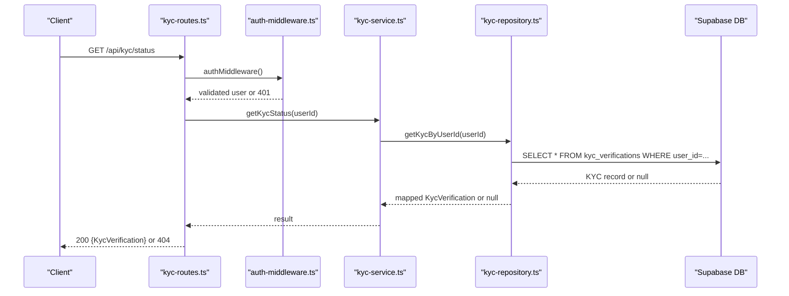
```mermaid
sequenceDiagram
participant C as "Client"
participant R as "kyc-routes.ts"
participant A as "auth-middleware.ts"
participant S as "kyc-service.ts"
participant P as "kyc-repository.ts"
participant D as "Supabase DB"
C->>R : GET /api/kyc/status
R->>A : authMiddleware()
A-->>R : validated user or 401
R->>S : getKycStatus(userId)
S->>P : getKycByUserId(userId)
P->>D : SELECT * FROM kyc_verifications WHERE user_id=...
D-->>P : KYC record or null
P-->>S : mapped KycVerification or null
S-->>R : result
R-->>C : 200 {KycVerification} or 404
```

**Diagram sources**
- [kyc-routes.ts](file://src/routes/kyc-routes.ts#L312-L365)
- [auth-middleware.ts](file://src/middleware/auth-middleware.ts#L25-L70)
- [kyc-service.ts](file://src/services/kyc-service.ts#L86-L90)
- [kyc-repository.ts](file://src/repositories/kyc-repository.ts#L136-L151)
- [supabase.ts](file://src/config/supabase.ts#L1-L25)

## Detailed Component Analysis

### Endpoint: GET /api/kyc/status
- Method: GET
- Path: /api/kyc/status
- Authentication: JWT Bearer token required
- Purpose: Retrieve the current user’s complete KYC verification record.
- Response:
  - 200 OK: KycVerification object
  - 401 Unauthorized: Missing or invalid token
  - 404 Not Found: No KYC verification found for the user
  - 400 Bad Request: Service-level error (e.g., validation failures)
- Notes:
  - Uses auth middleware to extract user identity from the token.
  - Calls service to fetch the latest KYC record by user ID.
  - Returns the mapped domain model to the client.

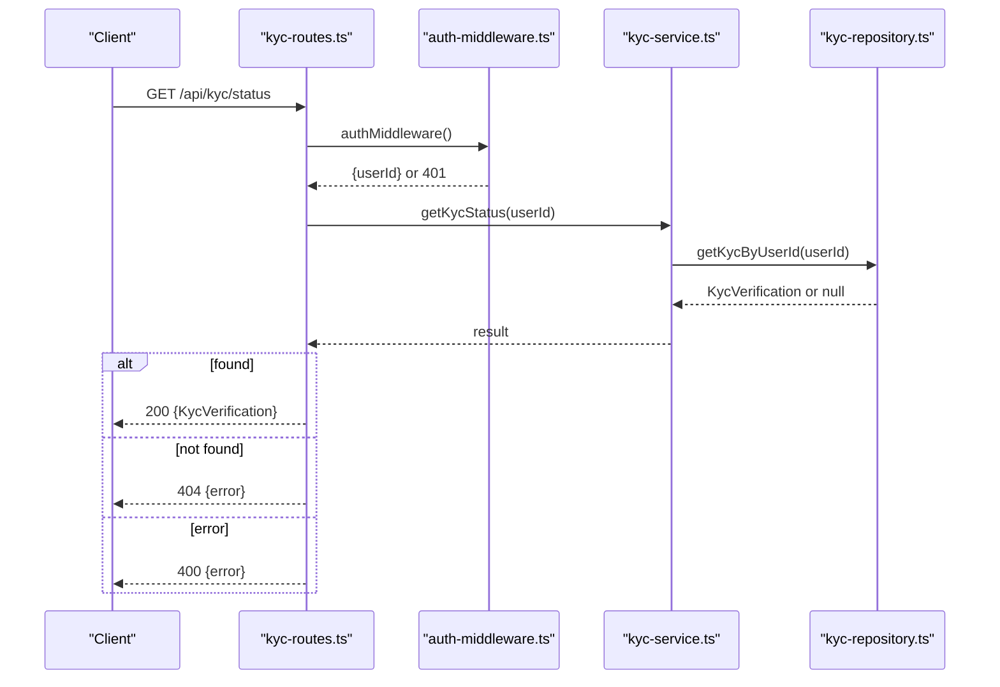
```mermaid
sequenceDiagram
participant C as "Client"
participant R as "kyc-routes.ts"
participant A as "auth-middleware.ts"
participant S as "kyc-service.ts"
participant P as "kyc-repository.ts"
C->>R : GET /api/kyc/status
R->>A : authMiddleware()
A-->>R : {userId} or 401
R->>S : getKycStatus(userId)
S->>P : getKycByUserId(userId)
P-->>S : KycVerification or null
S-->>R : result
alt found
R-->>C : 200 {KycVerification}
else not found
R-->>C : 404 {error}
else error
R-->>C : 400 {error}
end
```

**Diagram sources**
- [kyc-routes.ts](file://src/routes/kyc-routes.ts#L312-L365)
- [auth-middleware.ts](file://src/middleware/auth-middleware.ts#L25-L70)
- [kyc-service.ts](file://src/services/kyc-service.ts#L86-L90)
- [kyc-repository.ts](file://src/repositories/kyc-repository.ts#L136-L151)

**Section sources**
- [kyc-routes.ts](file://src/routes/kyc-routes.ts#L312-L365)
- [auth-middleware.ts](file://src/middleware/auth-middleware.ts#L25-L70)
- [kyc-service.ts](file://src/services/kyc-service.ts#L86-L90)
- [kyc-repository.ts](file://src/repositories/kyc-repository.ts#L136-L151)

### Endpoint: GET /api/kyc/countries
- Method: GET
- Path: /api/kyc/countries
- Authentication: Not required
- Purpose: Retrieve all supported countries and their KYC requirements.
- Response:
  - 200 OK: Array of SupportedCountry objects

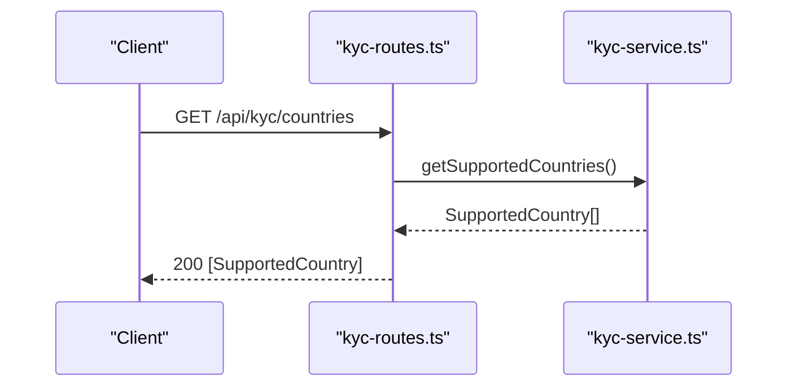
```mermaid
sequenceDiagram
participant C as "Client"
participant R as "kyc-routes.ts"
participant S as "kyc-service.ts"
C->>R : GET /api/kyc/countries
R->>S : getSupportedCountries()
S-->>R : SupportedCountry[]
R-->>C : 200 [SupportedCountry]
```

**Diagram sources**
- [kyc-routes.ts](file://src/routes/kyc-routes.ts#L240-L261)
- [kyc-service.ts](file://src/services/kyc-service.ts#L69-L75)

**Section sources**
- [kyc-routes.ts](file://src/routes/kyc-routes.ts#L240-L261)
- [kyc-service.ts](file://src/services/kyc-service.ts#L69-L75)

### Endpoint: GET /api/kyc/countries/{countryCode}
- Method: GET
- Path: /api/kyc/countries/{countryCode}
- Authentication: Not required
- Purpose: Retrieve KYC requirements for a specific country.
- Parameters:
  - countryCode: ISO 3166-1 alpha-2 country code (required)
- Response:
  - 200 OK: SupportedCountry object
  - 400 Bad Request: Invalid country code
  - 404 Not Found: Country not supported

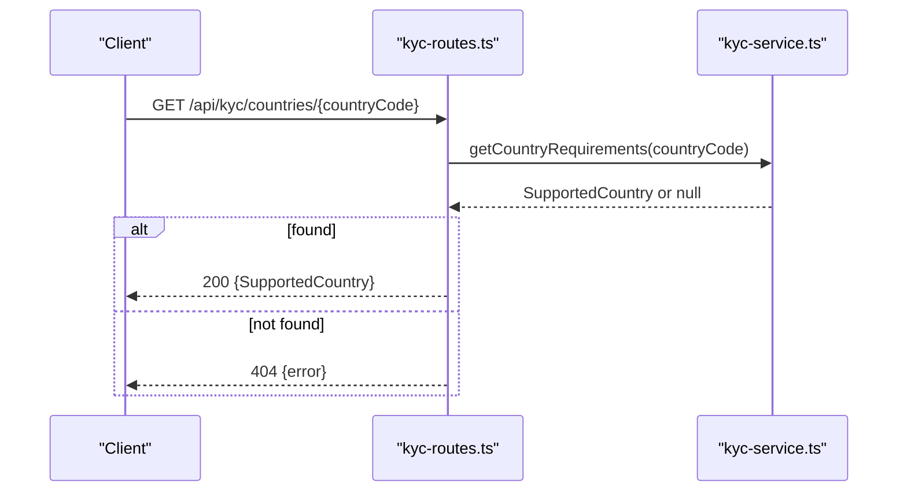
```mermaid
sequenceDiagram
participant C as "Client"
participant R as "kyc-routes.ts"
participant S as "kyc-service.ts"
C->>R : GET /api/kyc/countries/{countryCode}
R->>S : getCountryRequirements(countryCode)
S-->>R : SupportedCountry or null
alt found
R-->>C : 200 {SupportedCountry}
else not found
R-->>C : 404 {error}
end
```

**Diagram sources**
- [kyc-routes.ts](file://src/routes/kyc-routes.ts#L262-L311)
- [kyc-service.ts](file://src/services/kyc-service.ts#L73-L75)

**Section sources**
- [kyc-routes.ts](file://src/routes/kyc-routes.ts#L262-L311)
- [kyc-service.ts](file://src/services/kyc-service.ts#L73-L75)

### KycVerification Response Schema
The KycVerification object includes:
- Identity and demographic fields
- Address object with ISO country code
- Documents array with verification metadata
- LivenessCheck object (optional)
- Face match score and status (optional)
- AML screening status and risk indicators (optional)
- Lifecycle status and tier level
- Timestamps for creation/update/submission/review/expiry

Status lifecycle:
- pending
- submitted
- under_review
- approved
- rejected

Tier levels:
- basic
- standard
- enhanced

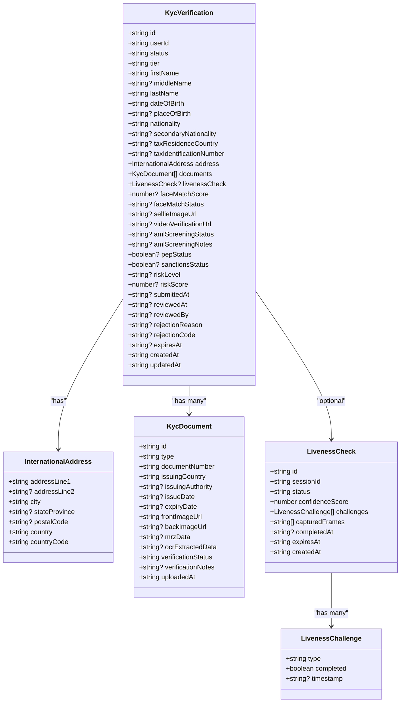
```mermaid
classDiagram
class KycVerification {
+string id
+string userId
+string status
+string tier
+string firstName
+string? middleName
+string lastName
+string dateOfBirth
+string? placeOfBirth
+string nationality
+string? secondaryNationality
+string? taxResidenceCountry
+string? taxIdentificationNumber
+InternationalAddress address
+KycDocument[] documents
+LivenessCheck? livenessCheck
+number? faceMatchScore
+string? faceMatchStatus
+string? selfieImageUrl
+string? videoVerificationUrl
+string? amlScreeningStatus
+string? amlScreeningNotes
+boolean? pepStatus
+boolean? sanctionsStatus
+string? riskLevel
+number? riskScore
+string? submittedAt
+string? reviewedAt
+string? reviewedBy
+string? rejectionReason
+string? rejectionCode
+string? expiresAt
+string createdAt
+string updatedAt
}
class InternationalAddress {
+string addressLine1
+string? addressLine2
+string city
+string? stateProvince
+string? postalCode
+string country
+string countryCode
}
class KycDocument {
+string id
+string type
+string documentNumber
+string issuingCountry
+string? issuingAuthority
+string? issueDate
+string? expiryDate
+string frontImageUrl
+string? backImageUrl
+string? mrzData
+string? ocrExtractedData
+string verificationStatus
+string? verificationNotes
+string uploadedAt
}
class LivenessCheck {
+string id
+string sessionId
+string status
+number confidenceScore
+LivenessChallenge[] challenges
+string[] capturedFrames
+string? completedAt
+string expiresAt
+string createdAt
}
class LivenessChallenge {
+string type
+boolean completed
+string? timestamp
}
KycVerification --> InternationalAddress : "has"
KycVerification --> KycDocument : "has many"
KycVerification --> LivenessCheck : "optional"
LivenessCheck --> LivenessChallenge : "has many"
```

**Diagram sources**
- [kyc-models.ts](file://src/models/kyc.ts#L84-L120)
- [kyc-models.ts](file://src/models/kyc.ts#L74-L83)
- [kyc-models.ts](file://src/models/kyc.ts#L15-L27)
- [kyc-models.ts](file://src/models/kyc.ts#L29-L33)

**Section sources**
- [kyc-models.ts](file://src/models/kyc.ts#L1-L120)

### SupportedCountry Schema
- code: ISO 3166-1 alpha-2 country code
- name: Full country name
- supportedDocuments: Array of document types allowed for that country
- requiresLiveness: Boolean indicating if liveness check is required
- requiresAddressProof: Boolean indicating if address proof is required
- tier: KYC tier recommendation for the country

**Section sources**
- [kyc-models.ts](file://src/models/kyc.ts#L198-L206)
- [kyc-service.ts](file://src/services/kyc-service.ts#L45-L64)

### Country Requirements Data Usage
Clients should:
- Fetch supported countries to populate a dropdown or region selector.
- On selecting a country, call GET /api/kyc/countries/{countryCode} to retrieve requirements.
- Dynamically render form fields based on supportedDocuments, requiresLiveness, requiresAddressProof, and tier.
- Enforce validation rules (e.g., required document types) before submission.

**Section sources**
- [kyc-routes.ts](file://src/routes/kyc-routes.ts#L240-L311)
- [kyc-service.ts](file://src/services/kyc-service.ts#L45-L84)

## Dependency Analysis
- Route dependencies:
  - kyc-routes.ts depends on auth-middleware.ts for JWT validation.
  - kyc-routes.ts depends on kyc-service.ts for business logic.
- Service dependencies:
  - kyc-service.ts depends on kyc-repository.ts for persistence and on KYCVerification.sol for blockchain integration.
- Repository dependencies:
  - kyc-repository.ts depends on supabase.ts for table names and DB client.
- Swagger dependencies:
  - swagger.ts defines OpenAPI components and security schemes used by the routes.

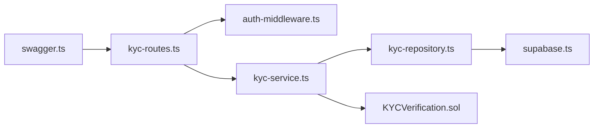
```mermaid
graph LR
Routes["kyc-routes.ts"] --> Auth["auth-middleware.ts"]
Routes --> Service["kyc-service.ts"]
Service --> Repo["kyc-repository.ts"]
Repo --> Supabase["supabase.ts"]
Service --> Contract["KYCVerification.sol"]
Swagger["swagger.ts"] --> Routes
```

**Diagram sources**
- [kyc-routes.ts](file://src/routes/kyc-routes.ts#L1-L40)
- [auth-middleware.ts](file://src/middleware/auth-middleware.ts#L1-L40)
- [kyc-service.ts](file://src/services/kyc-service.ts#L1-L30)
- [kyc-repository.ts](file://src/repositories/kyc-repository.ts#L1-L25)
- [supabase.ts](file://src/config/supabase.ts#L1-L25)
- [swagger.ts](file://src/config/swagger.ts#L20-L40)

**Section sources**
- [kyc-routes.ts](file://src/routes/kyc-routes.ts#L1-L40)
- [kyc-service.ts](file://src/services/kyc-service.ts#L1-L30)
- [kyc-repository.ts](file://src/repositories/kyc-repository.ts#L1-L25)
- [swagger.ts](file://src/config/swagger.ts#L20-L40)

## Performance Considerations
- The status endpoint performs a single DB query by user ID with ordering and limit to fetch the latest record.
- Country endpoints return static lists from memory; caching at the application layer can reduce repeated computation.
- Liveness and face match endpoints involve additional processing; consider rate limiting and session expiration handling.

[No sources needed since this section provides general guidance]

## Troubleshooting Guide
Common error scenarios and responses:
- 401 Unauthorized:
  - Missing Authorization header or invalid Bearer token format.
  - Auth middleware returns standardized error payload.
- 404 Not Found:
  - GET /api/kyc/status returns 404 when no KYC record exists for the user.
  - GET /api/kyc/countries/{countryCode} returns 404 when the country is not supported.
- 400 Bad Request:
  - Validation errors or service-level errors (e.g., invalid request data).
- 409 Conflict:
  - Submitting KYC when already approved or pending (not covered in this document but relevant for completeness).

Standardized error shape:
- error: { code, message, details (optional) }
- timestamp: ISO date-time
- requestId: UUID or unknown

**Section sources**
- [auth-middleware.ts](file://src/middleware/auth-middleware.ts#L25-L70)
- [kyc-routes.ts](file://src/routes/kyc-routes.ts#L312-L365)
- [swagger.ts](file://src/config/swagger.ts#L30-L54)

## Conclusion
The KYC data retrieval API provides a clear, secure, and extensible way to fetch user KYC records and country requirements. The status endpoint enforces JWT authentication, while country endpoints are publicly accessible for form-building. The response schemas and lifecycle/tier semantics enable robust client-side rendering and validation.

[No sources needed since this section summarizes without analyzing specific files]

## Appendices

### API Definitions and Schemas

- GET /api/kyc/status
  - Authentication: Bearer JWT
  - Response: 200 KycVerification, 401 Unauthorized, 404 Not Found, 400 Bad Request
  - Schema reference: KycVerification

- GET /api/kyc/countries
  - Authentication: None
  - Response: 200 [SupportedCountry]

- GET /api/kyc/countries/{countryCode}
  - Authentication: None
  - Response: 200 SupportedCountry, 400 Bad Request, 404 Not Found
  - Schema reference: SupportedCountry

- Security Scheme (OpenAPI):
  - bearerAuth: HTTP Bearer JWT

- Error Response Schema (OpenAPI):
  - error: { code, message, details[] }
  - timestamp: date-time
  - requestId: string

**Section sources**
- [kyc-routes.ts](file://src/routes/kyc-routes.ts#L240-L365)
- [swagger.ts](file://src/config/swagger.ts#L20-L60)
- [swagger.ts](file://src/config/swagger.ts#L30-L54)

### Example Responses

- Successful retrieval of KycVerification (200 OK)
  - Fields include identity, address, documents, optional liveness and face match, AML/risk fields, status, tier, timestamps.

- Country list (200 OK)
  - Array of SupportedCountry entries.

- Country requirements (200 OK)
  - Single SupportedCountry entry with code, name, supportedDocuments, requiresLiveness, requiresAddressProof, tier.

- Error response (404 Not Found)
  - Example: { error: { code: "KYC_NOT_FOUND", message: "No KYC verification found" }, timestamp: "...", requestId: "..." }

- Error response (400 Bad Request)
  - Example: { error: { code: "INVALID_COUNTRY_CODE", message: "Country code is required" }, timestamp: "...", requestId: "..." }

**Section sources**
- [kyc-routes.ts](file://src/routes/kyc-routes.ts#L240-L311)
- [swagger.ts](file://src/config/swagger.ts#L30-L54)

### Blockchain Integration Notes
- The system maintains a separate on-chain KYC contract for immutable verification status and tier. Off-chain KYC records can be augmented with on-chain verification details via service helpers.

**Section sources**
- [KYCVerification.sol](file://contracts/KYCVerification.sol#L1-L40)
- [kyc-service.ts](file://src/services/kyc-service.ts#L484-L500)

---

# KYC Liveness Verification API

<cite>
**Referenced Files in This Document**
- [kyc-routes.ts](file://src/routes/kyc-routes.ts)
- [kyc-service.ts](file://src/services/kyc-service.ts)
- [kyc.ts](file://src/models/kyc.ts)
- [auth-middleware.ts](file://src/middleware/auth-middleware.ts)
- [swagger.ts](file://src/config/swagger.ts)
- [test-kyc-flow.cjs](file://scripts/test-kyc-flow.cjs)
</cite>

## Table of Contents
1. [Introduction](#introduction)
2. [Project Structure](#project-structure)
3. [Core Components](#core-components)
4. [Architecture Overview](#architecture-overview)
5. [Detailed Component Analysis](#detailed-component-analysis)
6. [Dependency Analysis](#dependency-analysis)
7. [Performance Considerations](#performance-considerations)
8. [Troubleshooting Guide](#troubleshooting-guide)
9. [Conclusion](#conclusion)

## Introduction
This document describes the face liveness verification endpoints used in the KYC module of the FreelanceXchain system. It covers:
- Creating a new liveness session
- Retrieving the current session
- Submitting verification results

It specifies HTTP methods, URL patterns, request/response schemas, authentication requirements (JWT), liveness challenge types, how challenges are randomized, required request parameters for verification, example flows, response schema and status values, and error handling guidance.

## Project Structure
The liveness verification endpoints are implemented in the KYC routes, backed by service logic and typed models. Authentication is enforced via a JWT bearer token.

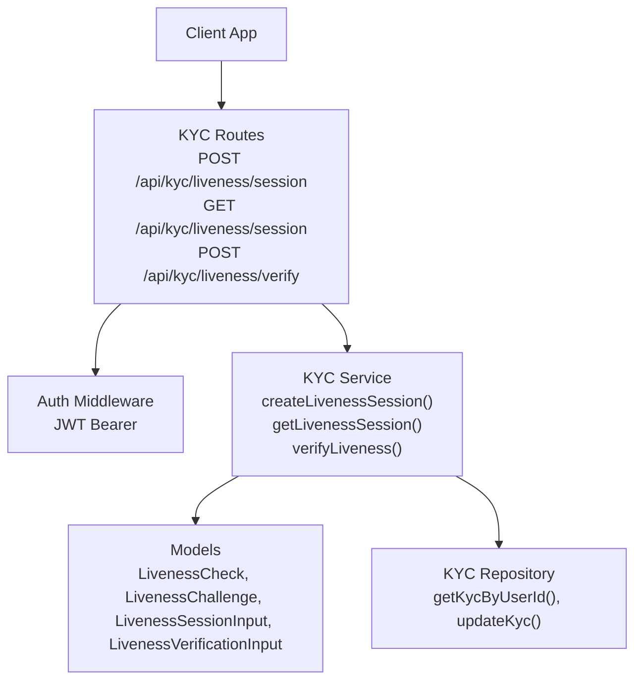
```mermaid
graph TB
Client["Client App"] --> Routes["KYC Routes<br/>POST /api/kyc/liveness/session<br/>GET /api/kyc/liveness/session<br/>POST /api/kyc/liveness/verify"]
Routes --> Auth["Auth Middleware<br/>JWT Bearer"]
Routes --> Service["KYC Service<br/>createLivenessSession()<br/>getLivenessSession()<br/>verifyLiveness()"]
Service --> Models["Models<br/>LivenessCheck, LivenessChallenge, LivenessSessionInput, LivenessVerificationInput"]
Service --> Repo["KYC Repository<br/>getKycByUserId(), updateKyc()"]
```

**Diagram sources**
- [kyc-routes.ts](file://src/routes/kyc-routes.ts#L430-L624)
- [auth-middleware.ts](file://src/middleware/auth-middleware.ts#L25-L70)
- [kyc-service.ts](file://src/services/kyc-service.ts#L193-L293)
- [kyc.ts](file://src/models/kyc.ts#L17-L181)

**Section sources**
- [kyc-routes.ts](file://src/routes/kyc-routes.ts#L430-L624)
- [auth-middleware.ts](file://src/middleware/auth-middleware.ts#L25-L70)
- [swagger.ts](file://src/config/swagger.ts#L22-L28)

## Core Components
- LivenessCheck: The session and result object containing status, confidence score, challenges, timestamps, and expiration.
- LivenessChallenge: Individual challenge entries with type, completion flag, and optional timestamp.
- LivenessSessionInput: Optional input to customize challenges during session creation.
- LivenessVerificationInput: Request payload for submitting verification results.

Key behaviors:
- Session creation sets a default set of challenges and an expiration time.
- Verification updates challenge completion and computes a confidence score; determines pass/fail/expired states.
- Sessions expire after a fixed duration.

**Section sources**
- [kyc.ts](file://src/models/kyc.ts#L17-L33)
- [kyc.ts](file://src/models/kyc.ts#L169-L181)
- [kyc-service.ts](file://src/services/kyc-service.ts#L65-L67)
- [kyc-service.ts](file://src/services/kyc-service.ts#L206-L222)
- [kyc-service.ts](file://src/services/kyc-service.ts#L237-L293)

## Architecture Overview
The liveness verification flow spans route handlers, authentication middleware, service logic, and persistence.

```mermaid
sequenceDiagram
participant C as "Client"
participant R as "KYC Routes"
participant A as "Auth Middleware"
participant S as "KYC Service"
participant P as "Persistence (Repo)"
C->>R : POST /api/kyc/liveness/session
R->>A : Validate JWT
A-->>R : Authorized user
R->>S : createLivenessSession(userId, input)
S->>P : updateKyc(kycId, { livenessCheck })
P-->>S : Updated KYC
S-->>R : LivenessCheck
R-->>C : 201 LivenessCheck
C->>R : GET /api/kyc/liveness/session
R->>A : Validate JWT
A-->>R : Authorized user
R->>S : getLivenessSession(userId)
S->>P : getKycByUserId(userId)
P-->>S : KYC with livenessCheck
S-->>R : LivenessCheck or null
R-->>C : 200 LivenessCheck or 404
C->>R : POST /api/kyc/liveness/verify
R->>A : Validate JWT
A-->>R : Authorized user
R->>S : verifyLiveness(userId, payload)
S->>P : getKycByUserId(userId)
S->>S : Validate sessionId, expiration, update challenges
S->>P : updateKyc(kycId, { livenessCheck })
S-->>R : LivenessCheck
R-->>C : 200 LivenessCheck
```

**Diagram sources**
- [kyc-routes.ts](file://src/routes/kyc-routes.ts#L430-L624)
- [auth-middleware.ts](file://src/middleware/auth-middleware.ts#L25-L70)
- [kyc-service.ts](file://src/services/kyc-service.ts#L193-L293)
- [kyc.ts](file://src/models/kyc.ts#L17-L33)

## Detailed Component Analysis

### Endpoint: POST /api/kyc/liveness/session
- Method: POST
- URL: /api/kyc/liveness/session
- Authentication: JWT Bearer
- Purpose: Create a new liveness verification session for the authenticated user.
- Request body:
  - challenges: optional array of challenge types to include in the session. Defaults to blink, turn_left, turn_right, smile if omitted.
- Response:
  - LivenessCheck object with status pending, empty challenges (completed=false), confidenceScore 0, and expiresAt set to a future timestamp.
- Notes:
  - The session is stored on the user’s KYC record.
  - Challenges are randomized by order in the input; defaults are used when not provided.

**Section sources**
- [kyc-routes.ts](file://src/routes/kyc-routes.ts#L430-L486)
- [kyc-service.ts](file://src/services/kyc-service.ts#L193-L235)
- [kyc.ts](file://src/models/kyc.ts#L169-L171)

### Endpoint: GET /api/kyc/liveness/session
- Method: GET
- URL: /api/kyc/liveness/session
- Authentication: JWT Bearer
- Purpose: Retrieve the current liveness session for the authenticated user.
- Response:
  - LivenessCheck if present; otherwise 404 with “No active liveness session”.
- Notes:
  - If no session exists, clients should create one first.

**Section sources**
- [kyc-routes.ts](file://src/routes/kyc-routes.ts#L488-L539)
- [kyc-service.ts](file://src/services/kyc-service.ts#L320-L326)

### Endpoint: POST /api/kyc/liveness/verify
- Method: POST
- URL: /api/kyc/liveness/verify
- Authentication: JWT Bearer
- Purpose: Submit verification results for the current session.
- Request body (required):
  - sessionId: string, must match the active session
  - capturedFrames: array of base64-encoded image strings
  - challengeResults: array of objects with:
    - type: one of blink, smile, turn_left, turn_right, nod, open_mouth
    - completed: boolean
    - timestamp: ISO date-time string
- Response:
  - LivenessCheck reflecting updated challenges, confidenceScore, and computed status (pending, passed, failed, expired).
- Notes:
  - If sessionId mismatches, invalid session error is returned.
  - If session expired, status is set to expired and saved.
  - Status determination considers whether all challenges were completed and a confidence threshold.

**Section sources**
- [kyc-routes.ts](file://src/routes/kyc-routes.ts#L541-L624)
- [kyc-service.ts](file://src/services/kyc-service.ts#L237-L293)
- [kyc.ts](file://src/models/kyc.ts#L173-L181)

### Liveness Challenge Types and Randomization
- Supported challenge types: blink, smile, turn_left, turn_right, nod, open_mouth.
- Default challenge set used when none are provided: blink, turn_left, turn_right, smile.
- Randomization:
  - The service constructs challenges from the provided input array. If omitted, defaults are used.
  - The order of challenges in the input defines the sequence presented to the user.

**Section sources**
- [kyc.ts](file://src/models/kyc.ts#L29-L33)
- [kyc-service.ts](file://src/services/kyc-service.ts#L206-L208)

### LivenessCheck Response Schema and Status Values
- Schema fields:
  - id: string
  - sessionId: string
  - status: pending, passed, failed, expired
  - confidenceScore: number
  - challenges: array of LivenessChallenge
  - capturedFrames: array of base64 image strings
  - completedAt: optional timestamp
  - expiresAt: ISO date-time
  - createdAt: ISO date-time
- Status semantics:
  - pending: session created or challenges not yet completed
  - passed: all challenges completed and confidence meets threshold
  - failed: all challenges completed but confidence below threshold
  - expired: session timed out

**Section sources**
- [kyc.ts](file://src/models/kyc.ts#L17-L33)
- [kyc-service.ts](file://src/services/kyc-service.ts#L65-L67)
- [kyc-service.ts](file://src/services/kyc-service.ts#L267-L276)

### Example Client Flow
Below is a typical end-to-end flow a client should orchestrate:

```mermaid
sequenceDiagram
participant Client as "Client App"
participant API as "KYC Routes"
participant Service as "KYC Service"
Client->>API : POST /api/kyc/liveness/session
API->>Service : createLivenessSession(userId, input)
Service-->>API : LivenessCheck (status=pending)
API-->>Client : 201 LivenessCheck
loop Present challenges to user
Client->>Client : Capture frames for each challenge
end
Client->>API : POST /api/kyc/liveness/verify
API->>Service : verifyLiveness(userId, payload)
Service-->>API : LivenessCheck (status=passed/failed/expired)
API-->>Client : 200 LivenessCheck
```

**Diagram sources**
- [kyc-routes.ts](file://src/routes/kyc-routes.ts#L430-L624)
- [kyc-service.ts](file://src/services/kyc-service.ts#L193-L293)
- [test-kyc-flow.cjs](file://scripts/test-kyc-flow.cjs#L137-L167)

**Section sources**
- [test-kyc-flow.cjs](file://scripts/test-kyc-flow.cjs#L137-L167)

## Dependency Analysis
The liveness endpoints depend on:
- Route handlers for routing and request validation
- Auth middleware for JWT enforcement
- Service layer for business logic and session management
- Models for type safety and schema definitions
- Persistence layer for reading/writing KYC records

```mermaid
graph LR
Routes["kyc-routes.ts"] --> Auth["auth-middleware.ts"]
Routes --> Service["kyc-service.ts"]
Service --> Models["kyc.ts"]
Service --> Repo["kyc-repository.ts"]
```

**Diagram sources**
- [kyc-routes.ts](file://src/routes/kyc-routes.ts#L430-L624)
- [auth-middleware.ts](file://src/middleware/auth-middleware.ts#L25-L70)
- [kyc-service.ts](file://src/services/kyc-service.ts#L193-L293)
- [kyc.ts](file://src/models/kyc.ts#L17-L33)

**Section sources**
- [kyc-routes.ts](file://src/routes/kyc-routes.ts#L430-L624)
- [auth-middleware.ts](file://src/middleware/auth-middleware.ts#L25-L70)
- [kyc-service.ts](file://src/services/kyc-service.ts#L193-L293)
- [kyc.ts](file://src/models/kyc.ts#L17-L33)

## Performance Considerations
- Session expiration: Sessions expire after a fixed duration; clients should complete verification promptly.
- Confidence scoring: The service simulates confidence scoring; production deployments should integrate a robust ML model.
- Payload sizes: Base64-encoded frames can be large; consider compression or streaming where feasible.
- Rate limiting: Apply rate limits at the API gateway to protect sensitive endpoints.

[No sources needed since this section provides general guidance]

## Troubleshooting Guide
Common issues and resolutions:
- Missing or invalid JWT:
  - Symptom: 401 Unauthorized
  - Resolution: Ensure Authorization header is present and formatted as Bearer <token>.
- No active liveness session:
  - Symptom: 404 Not Found with “No active liveness session”
  - Resolution: Call POST /api/kyc/liveness/session to create a session first.
- Invalid session ID:
  - Symptom: 400 Bad Request with “Invalid liveness session ID”
  - Resolution: Use the sessionId returned by the session creation endpoint.
- Session expired:
  - Symptom: 400 Bad Request with “Liveness session has expired”
  - Resolution: Create a new session and restart the verification.
- Validation errors:
  - Symptom: 400 Bad Request with “sessionId, capturedFrames, and challengeResults are required”
  - Resolution: Ensure all required fields are present in the verification request.

**Section sources**
- [auth-middleware.ts](file://src/middleware/auth-middleware.ts#L25-L70)
- [kyc-routes.ts](file://src/routes/kyc-routes.ts#L488-L539)
- [kyc-routes.ts](file://src/routes/kyc-routes.ts#L541-L624)
- [kyc-service.ts](file://src/services/kyc-service.ts#L237-L293)

## Conclusion
The KYC liveness verification endpoints provide a structured flow for creating sessions, retrieving current sessions, and submitting verification results. They enforce JWT authentication, manage session lifecycle, and compute outcomes based on challenge completion and confidence thresholds. Clients should follow the documented request/response schemas and handle error conditions appropriately to ensure a smooth user experience.

---

# KYC Submission API

<cite>
**Referenced Files in This Document**
- [kyc-routes.ts](file://src/routes/kyc-routes.ts)
- [kyc-service.ts](file://src/services/kyc-service.ts)
- [kyc-models.ts](file://src/models/kyc.ts)
- [kyc-repository.ts](file://src/repositories/kyc-repository.ts)
- [auth-middleware.ts](file://src/middleware/auth-middleware.ts)
- [swagger.ts](file://src/config/swagger.ts)
- [schema.sql](file://supabase/schema.sql)
</cite>

## Table of Contents
1. [Introduction](#introduction)
2. [Project Structure](#project-structure)
3. [Core Components](#core-components)
4. [Architecture Overview](#architecture-overview)
5. [Detailed Component Analysis](#detailed-component-analysis)
6. [Dependency Analysis](#dependency-analysis)
7. [Performance Considerations](#performance-considerations)
8. [Troubleshooting Guide](#troubleshooting-guide)
9. [Conclusion](#conclusion)
10. [Appendices](#appendices)

## Introduction
This document provides comprehensive API documentation for the KYC submission endpoint in the FreelanceXchain system. It focuses on the POST /api/kyc/submit endpoint, detailing the HTTP method, URL pattern, request body schema (KycSubmissionInput), authentication requirements (JWT Bearer), validation rules, response codes, and practical examples. It also covers privacy considerations and data handling practices for transmitting sensitive personal information.

## Project Structure
The KYC submission flow spans routing, middleware, service, repository, and data model layers, with Swagger OpenAPI definitions embedded in the routes for interactive documentation.

```mermaid
graph TB
Client["Client"] --> Routes["Routes: kyc-routes.ts"]
Routes --> AuthMW["Auth Middleware: auth-middleware.ts"]
Routes --> Service["Service: kyc-service.ts"]
Service --> Repo["Repository: kyc-repository.ts"]
Repo --> DB["Database: kyc_verifications (schema.sql)"]
Routes --> Swagger["Swagger Config: swagger.ts"]
```

**Diagram sources**
- [kyc-routes.ts](file://src/routes/kyc-routes.ts#L1-L120)
- [auth-middleware.ts](file://src/middleware/auth-middleware.ts#L1-L70)
- [kyc-service.ts](file://src/services/kyc-service.ts#L1-L120)
- [kyc-repository.ts](file://src/repositories/kyc-repository.ts#L1-L60)
- [schema.sql](file://supabase/schema.sql#L135-L159)
- [swagger.ts](file://src/config/swagger.ts#L20-L30)

**Section sources**
- [kyc-routes.ts](file://src/routes/kyc-routes.ts#L1-L120)
- [swagger.ts](file://src/config/swagger.ts#L20-L30)
- [schema.sql](file://supabase/schema.sql#L135-L159)

## Core Components
- Endpoint: POST /api/kyc/submit
- Authentication: JWT Bearer token via Authorization header
- Request Body: KycSubmissionInput (international KYC schema)
- Response Codes:
  - 201 Created: KYC submitted successfully
  - 400 Bad Request: Validation error or invalid request data
  - 409 Conflict: KYC already pending or approved
  - 401 Unauthorized: Missing or invalid Authorization header
- Validation: Built-in validator checks required fields and formats; service-level country/document support checks

**Section sources**
- [kyc-routes.ts](file://src/routes/kyc-routes.ts#L367-L428)
- [auth-middleware.ts](file://src/middleware/auth-middleware.ts#L25-L70)
- [kyc-service.ts](file://src/services/kyc-service.ts#L90-L120)

## Architecture Overview
The KYC submission request follows this flow:
1. Client sends a POST request with a valid JWT Bearer token.
2. Auth middleware validates the token and attaches user context.
3. Route handler validates the request payload using a dedicated validator.
4. Service layer performs business validations (country/document support, existing KYC state).
5. Repository persists the KYC verification record to the database.
6. Optional blockchain submission occurs if the user has a wallet address.

```mermaid
sequenceDiagram
participant C as "Client"
participant R as "Routes : kyc-routes.ts"
participant A as "Auth Middleware"
participant S as "Service : kyc-service.ts"
participant P as "Repository : kyc-repository.ts"
participant D as "Database : kyc_verifications"
C->>R : POST /api/kyc/submit (JWT Bearer)
R->>A : authMiddleware()
A-->>R : validated user context
R->>R : validateKycSubmission()
alt validation fails
R-->>C : 400 Validation Error
else validation passes
R->>S : submitKyc(userId, input)
S->>S : validate country/document support<br/>check existing KYC state
alt conflict (already approved/pending)
S-->>R : error result
R-->>C : 409 Conflict
else success
S->>P : create/update KYC
P->>D : insert/update record
S-->>R : created KYC
R-->>C : 201 Created
end
end
```

**Diagram sources**
- [kyc-routes.ts](file://src/routes/kyc-routes.ts#L367-L428)
- [auth-middleware.ts](file://src/middleware/auth-middleware.ts#L25-L70)
- [kyc-service.ts](file://src/services/kyc-service.ts#L90-L120)
- [kyc-repository.ts](file://src/repositories/kyc-repository.ts#L124-L157)
- [schema.sql](file://supabase/schema.sql#L135-L159)

## Detailed Component Analysis

### Endpoint Definition: POST /api/kyc/submit
- Method: POST
- URL Pattern: /api/kyc/submit
- Authentication: Requires Authorization: Bearer <JWT>
- Request Body: KycSubmissionInput (see schema below)
- Responses:
  - 201 Created: KYC verification created/updated
  - 400 Bad Request: Validation error or invalid request data
  - 409 Conflict: KYC already approved or pending
  - 401 Unauthorized: Missing/invalid Authorization header

**Section sources**
- [kyc-routes.ts](file://src/routes/kyc-routes.ts#L367-L428)
- [swagger.ts](file://src/config/swagger.ts#L20-L30)

### Request Body Schema: KycSubmissionInput
The request body must conform to the KycSubmissionInput schema. Required fields include:
- Personal Information
  - firstName (string)
  - lastName (string)
  - dateOfBirth (string, format: date)
  - nationality (string)
  - Optional: middleName, placeOfBirth, secondaryNationality, taxResidenceCountry, taxIdentificationNumber
- Address (InternationalAddress)
  - addressLine1 (string)
  - city (string)
  - country (string)
  - countryCode (string)
  - Optional: addressLine2, stateProvince, postalCode
- Identity Document (KycDocument)
  - type (enum: passport, national_id, drivers_license, residence_permit, voter_id, tax_id, social_security, birth_certificate, utility_bill, bank_statement)
  - documentNumber (string)
  - issuingCountry (string)
  - Optional: issuingAuthority, issueDate (date), expiryDate (date), frontImageUrl (string), backImageUrl (string)
- Optional Fields
  - selfieImageUrl (string)
  - tier (enum: basic, standard, enhanced)

Validation Rules:
- All required fields must be present and non-empty.
- dateOfBirth must be a valid date string (YYYY-MM-DD).
- countryCode must match supported countries.
- document.type must be one of the supported document types for the given country.
- address must include required address fields.
- Authorization header must be present and formatted as Bearer <token>.

**Section sources**
- [kyc-routes.ts](file://src/routes/kyc-routes.ts#L107-L145)
- [kyc-routes.ts](file://src/routes/kyc-routes.ts#L205-L237)
- [kyc-models.ts](file://src/models/kyc.ts#L136-L167)
- [kyc-models.ts](file://src/models/kyc.ts#L74-L82)
- [kyc-models.ts](file://src/models/kyc.ts#L35-L50)

### Validation Logic
- Route-level validation:
  - Ensures required fields exist and meet basic type/format requirements.
  - Validates address and document sub-schemas.
- Service-level validation:
  - Confirms the user exists.
  - Checks if the country is supported and the document type is supported for that country.
  - Prevents duplicate submissions if KYC is already approved or pending.

```mermaid
flowchart TD
Start(["Submit Request"]) --> CheckAuth["Check Authorization Header"]
CheckAuth --> |Missing/Invalid| Return401["Return 401 Unauthorized"]
CheckAuth --> |Valid| ValidateBody["Validate KycSubmissionInput"]
ValidateBody --> |Invalid| Return400V["Return 400 Validation Error"]
ValidateBody --> |Valid| CheckCountry["Check Country Support"]
CheckCountry --> |Unsupported| Return400C["Return 400 Country Not Supported"]
CheckCountry --> CheckDocType["Check Document Type Support"]
CheckDocType --> |Unsupported| Return400D["Return 400 Document Type Not Supported"]
CheckDocType --> CheckExisting["Check Existing KYC Status"]
CheckExisting --> |Already Approved| Return409A["Return 409 KYC Already Approved"]
CheckExisting --> |Already Pending| Return409P["Return 409 KYC Pending"]
CheckExisting --> Persist["Persist KYC Verification"]
Persist --> Return201["Return 201 Created"]
```

**Diagram sources**
- [kyc-routes.ts](file://src/routes/kyc-routes.ts#L391-L428)
- [kyc-service.ts](file://src/services/kyc-service.ts#L90-L120)

**Section sources**
- [kyc-routes.ts](file://src/routes/kyc-routes.ts#L205-L237)
- [kyc-service.ts](file://src/services/kyc-service.ts#L90-L120)

### Response Codes and Conditions
- 201 Created: KYC verification created or updated successfully.
- 400 Bad Request:
  - Validation error: missing or invalid fields.
  - Country not supported.
  - Document type not supported for the selected country.
- 409 Conflict:
  - KYC already approved.
  - KYC already pending review.
- 401 Unauthorized:
  - Missing Authorization header.
  - Invalid Bearer token format.
  - Token validation failure.

**Section sources**
- [kyc-routes.ts](file://src/routes/kyc-routes.ts#L391-L428)
- [auth-middleware.ts](file://src/middleware/auth-middleware.ts#L25-L70)
- [kyc-service.ts](file://src/services/kyc-service.ts#L90-L120)

### Practical Examples

#### Example Request Payload (International KYC)
- Headers:
  - Authorization: Bearer <your-jwt-token>
  - Content-Type: application/json
- Body:
  - firstName: "John"
  - lastName: "Doe"
  - dateOfBirth: "1990-01-01"
  - nationality: "US"
  - address:
    - addressLine1: "123 Main St"
    - addressLine2: "Apt 4B"
    - city: "New York"
    - stateProvince: "NY"
    - postalCode: "10001"
    - country: "United States"
    - countryCode: "US"
  - document:
    - type: "passport"
    - documentNumber: "P12345678"
    - issuingCountry: "US"
    - frontImageUrl: "https://example.com/passport-front.jpg"
    - backImageUrl: "https://example.com/passport-back.jpg"
  - selfieImageUrl: "https://example.com/selfie.jpg"
  - tier: "enhanced"

#### Example Successful Response (201 Created)
- Status: 201 Created
- Body: KycVerification object reflecting the submitted KYC (with status set to submitted).

#### Example Validation Error Response (400)
- Status: 400 Bad Request
- Body:
  - error:
    - code: "VALIDATION_ERROR"
    - message: "Invalid request data"
    - details: ["firstName is required", "address.addressLine1 is required"]

#### Example Conflict Response (409)
- Status: 409 Conflict
- Body:
  - error:
    - code: "KYC_PENDING"
    - message: "KYC verification already pending review"

**Section sources**
- [kyc-routes.ts](file://src/routes/kyc-routes.ts#L367-L428)
- [kyc-models.ts](file://src/models/kyc.ts#L84-L119)

### Privacy Considerations and Data Handling
- Sensitive Data Transmission:
  - The endpoint accepts images (front/back of documents, selfie) via URLs. Ensure HTTPS endpoints are used to protect data in transit.
- Data Storage:
  - KYC records are stored in the kyc_verifications table with JSONB fields for address, documents, and optional liveness check data. The table includes timestamps and status tracking.
- Access Control:
  - Row Level Security (RLS) is enabled on the kyc_verifications table to restrict access. Service role policies grant full access for backend operations.
- Best Practices:
  - Avoid storing raw personal data unnecessarily; rely on secure image storage and metadata.
  - Implement rate limiting and input sanitization at the gateway level.
  - Consider tokenizing or hashing identifiers where feasible.

**Section sources**
- [schema.sql](file://supabase/schema.sql#L135-L159)
- [schema.sql](file://supabase/schema.sql#L225-L261)

## Dependency Analysis
The KYC submission endpoint depends on:
- Routing and Swagger definitions for endpoint exposure and schema documentation.
- Authentication middleware for JWT validation.
- Service layer for business logic and external integrations (e.g., blockchain).
- Repository layer for persistence.
- Database schema for storage.

```mermaid
graph LR
Routes["kyc-routes.ts"] --> Auth["auth-middleware.ts"]
Routes --> Service["kyc-service.ts"]
Service --> Repo["kyc-repository.ts"]
Repo --> DB["schema.sql (kyc_verifications)"]
Routes --> Swagger["swagger.ts"]
```

**Diagram sources**
- [kyc-routes.ts](file://src/routes/kyc-routes.ts#L1-L120)
- [auth-middleware.ts](file://src/middleware/auth-middleware.ts#L25-L70)
- [kyc-service.ts](file://src/services/kyc-service.ts#L1-L60)
- [kyc-repository.ts](file://src/repositories/kyc-repository.ts#L1-L60)
- [schema.sql](file://supabase/schema.sql#L135-L159)
- [swagger.ts](file://src/config/swagger.ts#L20-L30)

**Section sources**
- [kyc-routes.ts](file://src/routes/kyc-routes.ts#L1-L120)
- [kyc-service.ts](file://src/services/kyc-service.ts#L1-L60)
- [kyc-repository.ts](file://src/repositories/kyc-repository.ts#L1-L60)
- [schema.sql](file://supabase/schema.sql#L135-L159)
- [swagger.ts](file://src/config/swagger.ts#L20-L30)

## Performance Considerations
- Validation Early Exit: The route-level validator short-circuits on missing required fields to reduce unnecessary processing.
- Minimal Database Writes: Updates only occur when KYC already exists; otherwise, a single insert is performed.
- Asynchronous Blockchain Submission: Blockchain submission is attempted asynchronously and does not block the primary response path.

[No sources needed since this section provides general guidance]

## Troubleshooting Guide
Common Issues and Resolutions:
- 401 Unauthorized
  - Cause: Missing or malformed Authorization header.
  - Resolution: Ensure Authorization: Bearer <valid-jwt> is present.
- 400 Validation Error
  - Cause: Missing required fields or invalid formats (e.g., date format).
  - Resolution: Provide all required fields with correct types and formats.
- 400 Country Not Supported
  - Cause: countryCode not in supported countries list.
  - Resolution: Use a supported country code.
- 400 Document Type Not Supported
  - Cause: Document type not supported for the selected country.
  - Resolution: Choose a supported document type for the given country.
- 409 Conflict (KYC Already Approved/Pending)
  - Cause: Attempting to submit when KYC is already approved or pending review.
  - Resolution: Wait until the current KYC completes or check status endpoint.

**Section sources**
- [auth-middleware.ts](file://src/middleware/auth-middleware.ts#L25-L70)
- [kyc-routes.ts](file://src/routes/kyc-routes.ts#L391-L428)
- [kyc-service.ts](file://src/services/kyc-service.ts#L90-L120)

## Conclusion
The POST /api/kyc/submit endpoint provides a robust, standards-aligned international KYC submission flow with strong validation, clear error handling, and secure data handling practices. By adhering to the documented schema and authentication requirements, clients can reliably submit KYC applications while maintaining compliance with privacy and data protection principles.

## Appendices

### Appendix A: InternationalAddress Schema
- addressLine1 (string, required)
- addressLine2 (string, optional)
- city (string, required)
- stateProvince (string, optional)
- postalCode (string, optional)
- country (string, required)
- countryCode (string, required)

**Section sources**
- [kyc-models.ts](file://src/models/kyc.ts#L74-L82)

### Appendix B: KycDocument Schema
- type (enum, required)
- documentNumber (string, required)
- issuingCountry (string, required)
- issuingAuthority (string, optional)
- issueDate (string, date, optional)
- expiryDate (string, date, optional)
- frontImageUrl (string, required)
- backImageUrl (string, optional)

**Section sources**
- [kyc-models.ts](file://src/models/kyc.ts#L35-L50)

### Appendix C: Supported Countries and Document Types
- Supported countries include US, GB, CA, AU, DE, FR, JP, SG, AE, IN, PH, BR, MX, NG, KE, ZA with varying requirements and tiers.
- Document types include passport, national_id, drivers_license, residence_permit, voter_id, tax_id, social_security, birth_certificate, utility_bill, bank_statement.

**Section sources**
- [kyc-service.ts](file://src/services/kyc-service.ts#L46-L63)
- [kyc-service.ts](file://src/services/kyc-service.ts#L81-L84)