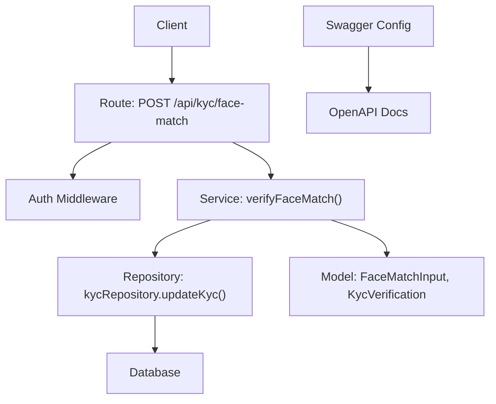
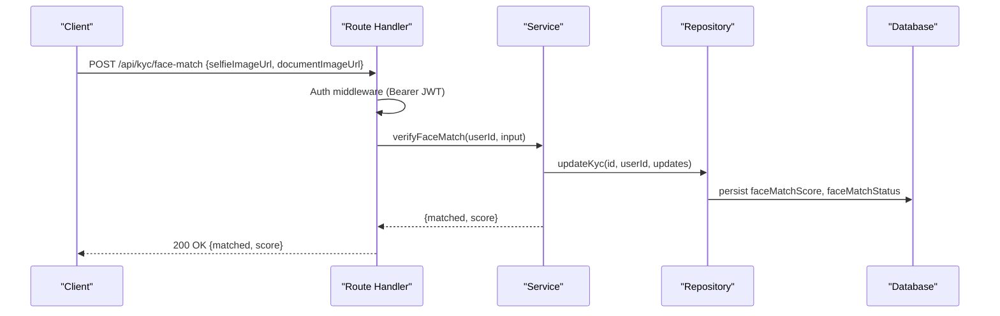
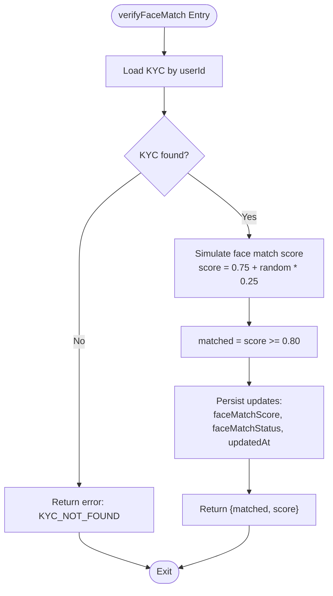
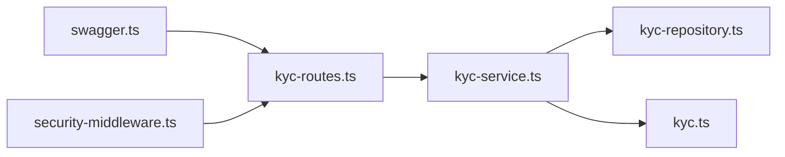

# Face Match Verification API

<cite>
**Referenced Files in This Document**
- [kyc-routes.ts](file://src/routes/kyc-routes.ts)
- [kyc-service.ts](file://src/services/kyc-service.ts)
- [kyc.ts](file://src/models/kyc.ts)
- [kyc-repository.ts](file://src/repositories/kyc-repository.ts)
- [swagger.ts](file://src/config/swagger.ts)
- [API-DOCUMENTATION.md](file://docs/API-DOCUMENTATION.md)
- [security-middleware.ts](file://src/middleware/security-middleware.ts)
- [validation-middleware.ts](file://src/middleware/validation-middleware.ts)
- [test-kyc-flow.cjs](file://scripts/test-kyc-flow.cjs)
</cite>

## Table of Contents
1. [Introduction](#introduction)
2. [Project Structure](#project-structure)
3. [Core Components](#core-components)
4. [Architecture Overview](#architecture-overview)
5. [Detailed Component Analysis](#detailed-component-analysis)
6. [Dependency Analysis](#dependency-analysis)
7. [Performance Considerations](#performance-considerations)
8. [Troubleshooting Guide](#troubleshooting-guide)
9. [Conclusion](#conclusion)
10. [Appendices](#appendices)

## Introduction
This document describes the POST /api/kyc/face-match endpoint used to compare a user’s selfie with their identity document photo. It specifies the HTTP method, URL pattern, request body schema, authentication requirements, response schema, and the underlying confidence scoring and matching logic. It also provides guidance on image quality requirements and outlines privacy considerations for processing biometric data.

## Project Structure
The face match verification endpoint is implemented as part of the KYC module:
- Route handler: defines the endpoint, authentication, and request validation
- Service: performs the matching logic and updates KYC state
- Model: defines the request/response shapes and thresholds
- Repository: persists KYC updates to the database
- Swagger/OpenAPI: documents the endpoint and security scheme
- Test script: demonstrates usage in a real flow

**Diagram sources**
- [kyc-routes.ts](file://src/routes/kyc-routes.ts#L626-L698)
- [kyc-service.ts](file://src/services/kyc-service.ts#L295-L318)
- [kyc-repository.ts](file://src/repositories/kyc-repository.ts#L153-L157)
- [swagger.ts](file://src/config/swagger.ts#L22-L28)

**Section sources**
- [kyc-routes.ts](file://src/routes/kyc-routes.ts#L626-L698)
- [swagger.ts](file://src/config/swagger.ts#L22-L28)

## Core Components
- Endpoint: POST /api/kyc/face-match
- Authentication: Bearer JWT via Authorization header
- Request body: selfieImageUrl and documentImageUrl
- Response: matched (boolean) and score (number)
- Threshold: matched is true when score >= 0.80

Implementation highlights:
- Route enforces JWT and validates presence of selfieImageUrl and documentImageUrl
- Service simulates face matching and sets faceMatchStatus and faceMatchScore
- Repository persists updates to the KYC record

**Section sources**
- [kyc-routes.ts](file://src/routes/kyc-routes.ts#L626-L698)
- [kyc-service.ts](file://src/services/kyc-service.ts#L295-L318)
- [kyc.ts](file://src/models/kyc.ts#L183-L186)

## Architecture Overview
The endpoint follows a layered architecture:
- Presentation layer: Express route
- Application layer: Service orchestrating business logic
- Persistence layer: Repository mapping to database
- Data model: Strong typing for inputs and outputs

**Diagram sources**
- [kyc-routes.ts](file://src/routes/kyc-routes.ts#L662-L698)
- [kyc-service.ts](file://src/services/kyc-service.ts#L295-L318)
- [kyc-repository.ts](file://src/repositories/kyc-repository.ts#L153-L157)

## Detailed Component Analysis

### Endpoint Definition
- Method: POST
- URL: /api/kyc/face-match
- Authentication: Bearer JWT (Authorization: Bearer <token>)
- Request body schema:
  - selfieImageUrl: string (required)
  - documentImageUrl: string (required)
- Response schema:
  - matched: boolean
  - score: number

Behavior:
- On success: returns 200 OK with matched and score
- On validation failure: returns 400 with error details
- On unauthorized: returns 401

**Section sources**
- [kyc-routes.ts](file://src/routes/kyc-routes.ts#L626-L698)
- [swagger.ts](file://src/config/swagger.ts#L22-L28)
- [API-DOCUMENTATION.md](file://docs/API-DOCUMENTATION.md#L7-L13)

### Matching Logic and Confidence Scoring
- Threshold: matched = true if score >= 0.80
- Current implementation simulates matching with a random score in [0.75, 1.00]
- In production, replace the simulation with a real face recognition API

**Diagram sources**
- [kyc-service.ts](file://src/services/kyc-service.ts#L295-L318)

**Section sources**
- [kyc-service.ts](file://src/services/kyc-service.ts#L63-L68)
- [kyc-service.ts](file://src/services/kyc-service.ts#L295-L318)

### Request Validation and Error Handling
- Route-level validation ensures selfieImageUrl and documentImageUrl are present
- Unauthorized requests return 401
- Validation failures return 400 with structured error payload

Validation patterns used across the codebase:
- URI format validation for URLs
- Presence checks for required fields

**Section sources**
- [kyc-routes.ts](file://src/routes/kyc-routes.ts#L675-L684)
- [validation-middleware.ts](file://src/middleware/validation-middleware.ts#L241-L277)

### Response Schema
- matched: boolean
- score: number

These fields are persisted to the KYC record and returned to the client.

**Section sources**
- [kyc-service.ts](file://src/services/kyc-service.ts#L295-L318)
- [kyc.ts](file://src/models/kyc.ts#L183-L186)

### Example Requests and Responses
- Successful match (example):
  - Request: POST /api/kyc/face-match with selfieImageUrl and documentImageUrl
  - Response: { matched: true, score: 0.85 }
- Non-match (example):
  - Request: Same as above
  - Response: { matched: false, score: 0.76 }

Note: The score is simulated in the current implementation.

**Section sources**
- [test-kyc-flow.cjs](file://scripts/test-kyc-flow.cjs#L171-L186)

## Dependency Analysis
- Route depends on auth middleware and service
- Service depends on repository and models
- Repository depends on Supabase client and entity mapping
- Swagger config defines the bearerAuth security scheme

**Diagram sources**
- [kyc-routes.ts](file://src/routes/kyc-routes.ts#L626-L698)
- [kyc-service.ts](file://src/services/kyc-service.ts#L1-L40)
- [kyc-repository.ts](file://src/repositories/kyc-repository.ts#L1-L41)
- [swagger.ts](file://src/config/swagger.ts#L22-L28)

**Section sources**
- [kyc-routes.ts](file://src/routes/kyc-routes.ts#L626-L698)
- [kyc-service.ts](file://src/services/kyc-service.ts#L1-L40)
- [swagger.ts](file://src/config/swagger.ts#L22-L28)

## Performance Considerations
- Image resolution and compression: Higher resolution images generally improve matching accuracy but increase processing time and bandwidth usage
- Network latency: Fetching images from remote URLs adds latency; consider caching or pre-uploading images to reduce round trips
- Batch processing: If integrating with other KYC steps, coordinate timing to minimize redundant image fetches

[No sources needed since this section provides general guidance]

## Troubleshooting Guide
Common issues and resolutions:
- 401 Unauthorized: Ensure Authorization header includes a valid Bearer token
- 400 Validation Error: Confirm selfieImageUrl and documentImageUrl are present and valid URIs
- 404 Not Found: The KYC record may not exist for the authenticated user; submit KYC first
- Unexpected non-match: Lower scores can occur due to lighting, pose, or image quality; retry with improved images

**Section sources**
- [kyc-routes.ts](file://src/routes/kyc-routes.ts#L666-L698)
- [kyc-service.ts](file://src/services/kyc-service.ts#L295-L318)

## Conclusion
The POST /api/kyc/face-match endpoint enables biometric verification by comparing a selfie with an identity document photo. It uses a configurable threshold to determine a match and returns a numeric confidence score. While the current implementation simulates matching, integrating a robust face recognition API will enable production-grade accuracy. Proper image quality and secure handling of biometric data are essential for reliable verification.

[No sources needed since this section summarizes without analyzing specific files]

## Appendices

### Implementation Guidance: Image Quality Requirements
- Lighting: Even, well-lit conditions; avoid backlighting or shadows
- Pose: Front-facing, centered face with eyes open and mouth closed
- Resolution: Minimum recommended resolution to ensure facial feature clarity
- Background: Plain, non-distracting background
- Document: Clear front-facing photo with no glare or folds
- Cropping: Ensure the face occupies approximately 60–80% of the image width

[No sources needed since this section provides general guidance]

### Privacy Considerations
- Data minimization: Only transmit images necessary for verification
- Secure transport: Use HTTPS to prevent interception
- Storage: Store images securely and apply encryption at rest
- Retention: Define and enforce retention policies; delete images after verification completes
- Consent: Obtain explicit consent for biometric processing and explain purpose and duration
- Compliance: Adhere to applicable regulations (e.g., GDPR, CCPA) for sensitive biometric data

[No sources needed since this section provides general guidance]