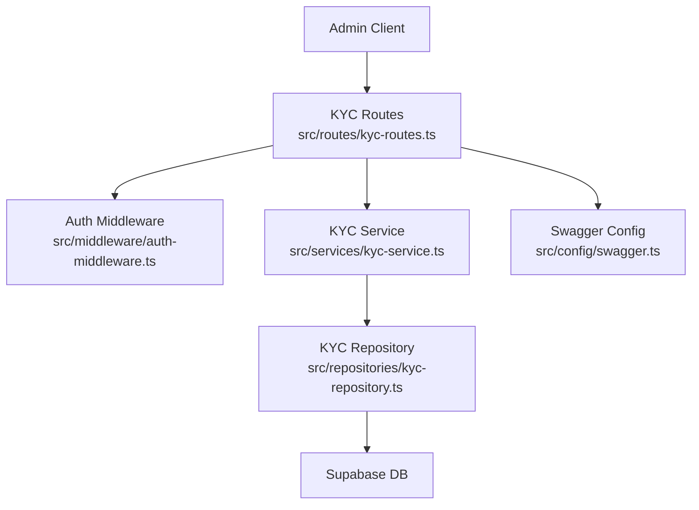
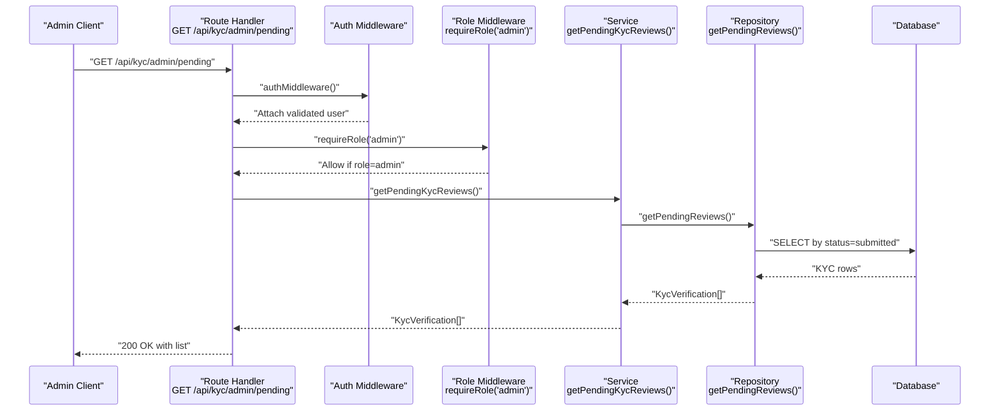
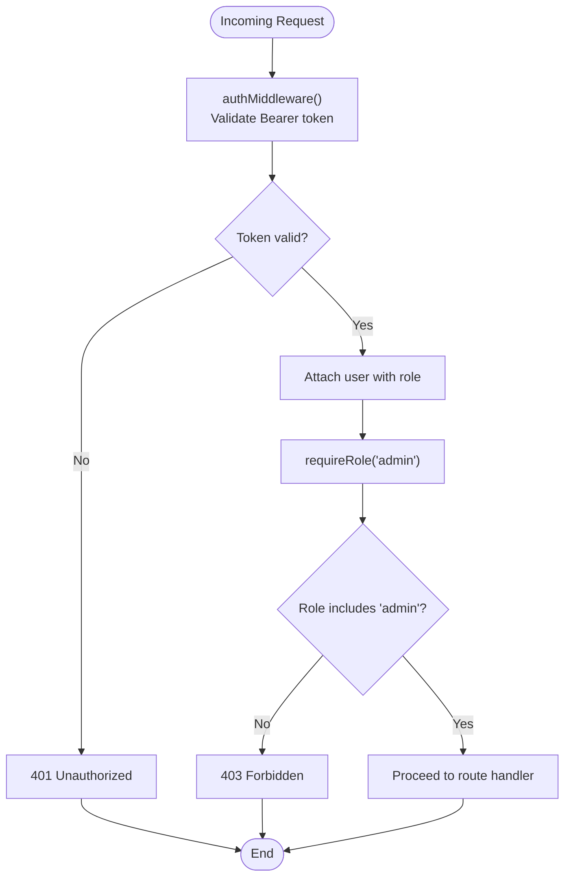
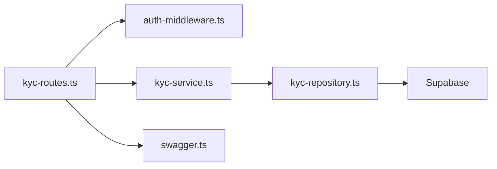

# KYC Administration API

<cite>
**Referenced Files in This Document**
- [kyc-routes.ts](file://src/routes/kyc-routes.ts)
- [auth-middleware.ts](file://src/middleware/auth-middleware.ts)
- [kyc-service.ts](file://src/services/kyc-service.ts)
- [kyc-repository.ts](file://src/repositories/kyc-repository.ts)
- [kyc-model.ts](file://src/models/kyc.ts)
- [user-model.ts](file://src/models/user.ts)
- [swagger.ts](file://src/config/swagger.ts)
- [API-DOCUMENTATION.md](file://docs/API-DOCUMENTATION.md)
</cite>

## Table of Contents
1. [Introduction](#introduction)
2. [Project Structure](#project-structure)
3. [Core Components](#core-components)
4. [Architecture Overview](#architecture-overview)
5. [Detailed Component Analysis](#detailed-component-analysis)
6. [Dependency Analysis](#dependency-analysis)
7. [Performance Considerations](#performance-considerations)
8. [Troubleshooting Guide](#troubleshooting-guide)
9. [Conclusion](#conclusion)

## Introduction
This document describes the KYC administration endpoints that are accessible only to admin users. It covers:
- GET /api/kyc/admin/pending: Retrieve all KYC verifications awaiting review.
- GET /api/kyc/admin/status/{status}: Filter KYC records by status (pending, submitted, under_review, approved, rejected).

It specifies HTTP methods, URL patterns, authentication requirements (JWT with admin role), response schemas, and error responses. It also explains the authorization flow using the requireRole('admin') middleware and how role-based access control prevents unauthorized access. Example responses and usage examples for admin dashboards are included.

## Project Structure
The KYC administration endpoints are implemented in the routing layer and backed by service and repository layers. The Swagger configuration defines the OpenAPI schema for the endpoints.

**Diagram sources**
- [kyc-routes.ts](file://src/routes/kyc-routes.ts#L767-L820)
- [auth-middleware.ts](file://src/middleware/auth-middleware.ts#L25-L100)
- [kyc-service.ts](file://src/services/kyc-service.ts#L409-L415)
- [kyc-repository.ts](file://src/repositories/kyc-repository.ts#L119-L175)
- [swagger.ts](file://src/config/swagger.ts#L1-L233)

**Section sources**
- [kyc-routes.ts](file://src/routes/kyc-routes.ts#L767-L820)
- [swagger.ts](file://src/config/swagger.ts#L1-L233)

## Core Components
- Route handlers for admin endpoints:
  - GET /api/kyc/admin/pending
  - GET /api/kyc/admin/status/{status}
- Middleware:
  - authMiddleware: validates JWT Bearer token
  - requireRole('admin'): enforces admin role
- Service functions:
  - getPendingKycReviews()
  - getAllKycByStatus(status)
- Repository:
  - getPendingReviews()
  - getKycByStatus(status)
- Data model:
  - KycVerification and KycStatus

Key implementation references:
- Admin endpoints and validation: [kyc-routes.ts](file://src/routes/kyc-routes.ts#L767-L820)
- Role enforcement: [auth-middleware.ts](file://src/middleware/auth-middleware.ts#L72-L100)
- Service functions: [kyc-service.ts](file://src/services/kyc-service.ts#L409-L415)
- Repository functions: [kyc-repository.ts](file://src/repositories/kyc-repository.ts#L119-L175)
- Data model: [kyc-model.ts](file://src/models/kyc.ts#L1-L120), [user-model.ts](file://src/models/user.ts#L1-L4)

**Section sources**
- [kyc-routes.ts](file://src/routes/kyc-routes.ts#L767-L820)
- [auth-middleware.ts](file://src/middleware/auth-middleware.ts#L25-L100)
- [kyc-service.ts](file://src/services/kyc-service.ts#L409-L415)
- [kyc-repository.ts](file://src/repositories/kyc-repository.ts#L119-L175)
- [kyc-model.ts](file://src/models/kyc.ts#L1-L120)
- [user-model.ts](file://src/models/user.ts#L1-L4)

## Architecture Overview
The admin endpoints follow a layered architecture:
- Router layer validates path parameters and applies auth and role middleware.
- Service layer orchestrates repository calls and returns typed results.
- Repository layer maps models to database entities and executes queries.
- Swagger defines the OpenAPI schema for the endpoints.

**Diagram sources**
- [kyc-routes.ts](file://src/routes/kyc-routes.ts#L767-L783)
- [auth-middleware.ts](file://src/middleware/auth-middleware.ts#L25-L100)
- [kyc-service.ts](file://src/services/kyc-service.ts#L409-L411)
- [kyc-repository.ts](file://src/repositories/kyc-repository.ts#L172-L175)

## Detailed Component Analysis

### Endpoint: GET /api/kyc/admin/pending
- Purpose: Retrieve all KYC verifications awaiting review (status submitted).
- Authentication: JWT Bearer token required.
- Authorization: Admin role required.
- Response: Array of KycVerification objects.

Implementation highlights:
- Route handler: [kyc-routes.ts](file://src/routes/kyc-routes.ts#L767-L783)
- Service function: [kyc-service.ts](file://src/services/kyc-service.ts#L409-L411)
- Repository function: [kyc-repository.ts](file://src/repositories/kyc-repository.ts#L172-L175)
- Data model: [kyc-model.ts](file://src/models/kyc.ts#L84-L119)

Response schema (OpenAPI):
- Type: array of KycVerification
- KycVerification fields include identifiers, personal info, address, documents, livenessCheck, faceMatch fields, AML screening fields, risk fields, timestamps, and status.

Swagger references:
- Schema definitions: [swagger.ts](file://src/config/swagger.ts#L1-L233)
- Endpoint documentation: [kyc-routes.ts](file://src/routes/kyc-routes.ts#L767-L783)

Example response (conceptual):
- An array of KycVerification entries with fields such as id, userId, status, tier, name, nationality, address, documents, livenessCheck, faceMatchScore/status, amlScreeningStatus, riskLevel, timestamps, and optional blockchain fields.

Authorization flow:
- authMiddleware validates token and attaches user to request.
- requireRole('admin') checks user role and rejects non-admins with 403.

Error responses:
- 401 Unauthorized: missing or invalid token.
- 403 Forbidden: insufficient permissions (non-admin).

**Section sources**
- [kyc-routes.ts](file://src/routes/kyc-routes.ts#L767-L783)
- [auth-middleware.ts](file://src/middleware/auth-middleware.ts#L25-L100)
- [kyc-service.ts](file://src/services/kyc-service.ts#L409-L411)
- [kyc-repository.ts](file://src/repositories/kyc-repository.ts#L172-L175)
- [swagger.ts](file://src/config/swagger.ts#L1-L233)
- [kyc-model.ts](file://src/models/kyc.ts#L84-L119)

### Endpoint: GET /api/kyc/admin/status/{status}
- Purpose: Filter KYC verifications by status.
- Path parameter: status must be one of pending, submitted, under_review, approved, rejected.
- Authentication: JWT Bearer token required.
- Authorization: Admin role required.
- Response: Array of KycVerification objects.

Implementation highlights:
- Route handler validates status and calls service/repository: [kyc-routes.ts](file://src/routes/kyc-routes.ts#L785-L820)
- Service function: [kyc-service.ts](file://src/services/kyc-service.ts#L413-L415)
- Repository function: [kyc-repository.ts](file://src/repositories/kyc-repository.ts#L159-L170)
- Data model: [kyc-model.ts](file://src/models/kyc.ts#L1-L120)

Response schema (OpenAPI):
- Same as pending endpoint: array of KycVerification.

Validation and error handling:
- Invalid status returns 400 with INVALID_STATUS.
- Successful requests return 200 with filtered list.

Authorization flow:
- Same as pending endpoint.

Error responses:
- 400 Bad Request: invalid status value.
- 401 Unauthorized: missing or invalid token.
- 403 Forbidden: insufficient permissions (non-admin).

**Section sources**
- [kyc-routes.ts](file://src/routes/kyc-routes.ts#L785-L820)
- [kyc-service.ts](file://src/services/kyc-service.ts#L413-L415)
- [kyc-repository.ts](file://src/repositories/kyc-repository.ts#L159-L170)
- [kyc-model.ts](file://src/models/kyc.ts#L1-L120)

### Authorization Flow and Role-Based Access Control
The admin endpoints apply two middleware layers:
- authMiddleware: verifies Authorization header format and validates JWT. On success, attaches user with role to request.
- requireRole('admin'): ensures the user role includes 'admin'. Non-admin users receive 403.

**Diagram sources**
- [auth-middleware.ts](file://src/middleware/auth-middleware.ts#L25-L100)

**Section sources**
- [auth-middleware.ts](file://src/middleware/auth-middleware.ts#L25-L100)
- [user-model.ts](file://src/models/user.ts#L1-L4)

### Data Model: KycVerification
The response schema for both endpoints is an array of KycVerification. Key fields include:
- Identity: id, userId, firstName, middleName, lastName, dateOfBirth, placeOfBirth, nationality, secondaryNationality, taxResidenceCountry, taxIdentificationNumber
- Address: InternationalAddress with addressLine1, addressLine2, city, stateProvince, postalCode, country, countryCode
- Documents: array of KycDocument with type, documentNumber, issuingCountry, issuingAuthority, issueDate, expiryDate, front/back image URLs, verification metadata
- Verification: selfieImageUrl, livenessCheck, faceMatchScore, faceMatchStatus, amlScreeningStatus, amlScreeningNotes, pepStatus, sanctionsStatus, riskLevel, riskScore
- Lifecycle: status, tier, submittedAt, reviewedAt, reviewedBy, rejectionReason, rejectionCode, expiresAt, createdAt, updatedAt

Swagger schema references:
- KycVerification and related schemas: [swagger.ts](file://src/config/swagger.ts#L1-L233)
- Model definitions: [kyc-model.ts](file://src/models/kyc.ts#L1-L120)

**Section sources**
- [swagger.ts](file://src/config/swagger.ts#L1-L233)
- [kyc-model.ts](file://src/models/kyc.ts#L1-L120)

### Usage Examples for Admin Dashboard
- Fetch pending KYCs to display in a review queue:
  - Call GET /api/kyc/admin/pending with Authorization: Bearer <admin_token>
  - Render the returned array of KycVerification entries in a table/grid
- Filter by status to build status dashboards:
  - Call GET /api/kyc/admin/status/submitted with Authorization: Bearer <admin_token>
  - Paginate or sort by submittedAt as needed
- Integrate with admin UI:
  - Use the same JWT for subsequent admin actions (e.g., approve/reject)
  - Display riskLevel, amlScreeningStatus, and documents for review decisions

[No sources needed since this section provides general guidance]

## Dependency Analysis
The admin endpoints depend on the following chain:
- Router -> Auth Middleware -> Role Middleware -> Service -> Repository -> Database

**Diagram sources**
- [kyc-routes.ts](file://src/routes/kyc-routes.ts#L767-L820)
- [auth-middleware.ts](file://src/middleware/auth-middleware.ts#L25-L100)
- [kyc-service.ts](file://src/services/kyc-service.ts#L409-L415)
- [kyc-repository.ts](file://src/repositories/kyc-repository.ts#L119-L175)
- [swagger.ts](file://src/config/swagger.ts#L1-L233)

**Section sources**
- [kyc-routes.ts](file://src/routes/kyc-routes.ts#L767-L820)
- [auth-middleware.ts](file://src/middleware/auth-middleware.ts#L25-L100)
- [kyc-service.ts](file://src/services/kyc-service.ts#L409-L415)
- [kyc-repository.ts](file://src/repositories/kyc-repository.ts#L119-L175)
- [swagger.ts](file://src/config/swagger.ts#L1-L233)

## Performance Considerations
- Pagination: The repository limits results to a default small number (e.g., 50) to prevent large payloads. Admin dashboards should implement pagination or filtering to manage load.
- Sorting: Requests are sorted by submittedAt to prioritize recent submissions.
- Token validation: authMiddleware performs a single token validation per request; keep JWT short-lived and rotate tokens regularly.

[No sources needed since this section provides general guidance]

## Troubleshooting Guide
Common issues and resolutions:
- 401 Unauthorized
  - Cause: Missing Authorization header or invalid/missing Bearer token.
  - Resolution: Ensure Authorization: Bearer <valid_jwt> is sent.
- 403 Forbidden
  - Cause: User authenticated but lacks admin role.
  - Resolution: Authenticate with an admin account or escalate privileges.
- 400 Bad Request (status filter)
  - Cause: status path parameter not one of the allowed values.
  - Resolution: Use one of pending, submitted, under_review, approved, rejected.
- 404 Not Found (other endpoints)
  - Cause: Resource not found in other KYC endpoints.
  - Resolution: Verify resource IDs and statuses.

Error response format:
- All errors include error.code, error.message, optional details, timestamp, and requestId.

**Section sources**
- [auth-middleware.ts](file://src/middleware/auth-middleware.ts#L25-L100)
- [kyc-routes.ts](file://src/routes/kyc-routes.ts#L785-L820)
- [API-DOCUMENTATION.md](file://docs/API-DOCUMENTATION.md#L611-L642)

## Conclusion
The KYC administration endpoints provide secure, role-gated access to KYC review data. Admin users can fetch pending verifications and filter by status using JWT authentication and admin role enforcement. The response schema is defined by the KycVerification model, and the implementation follows a clean separation of concerns across routing, service, and repository layers.