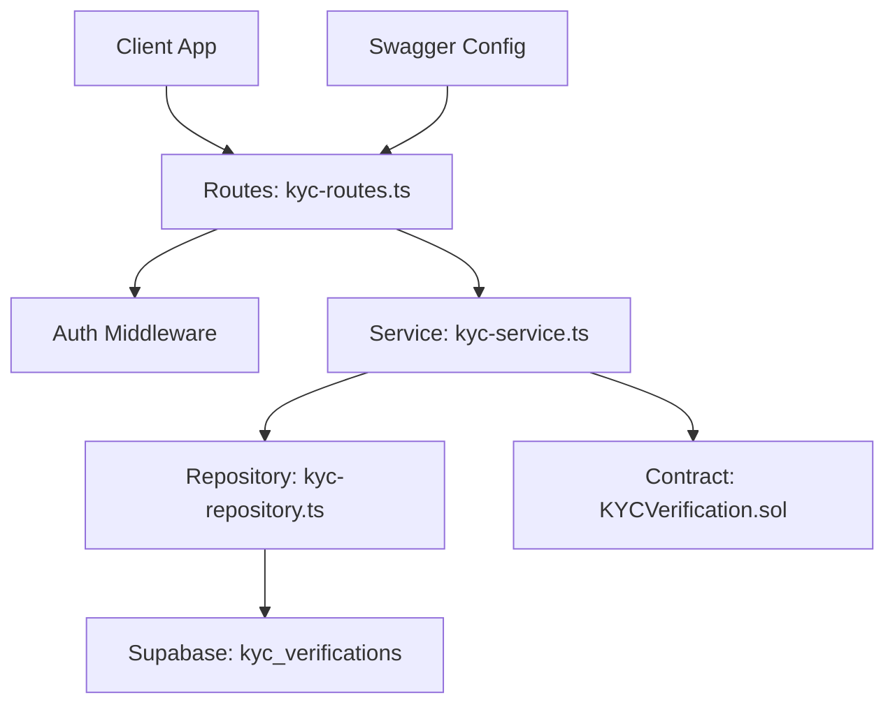
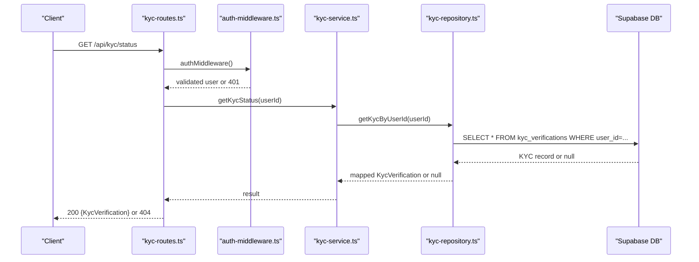
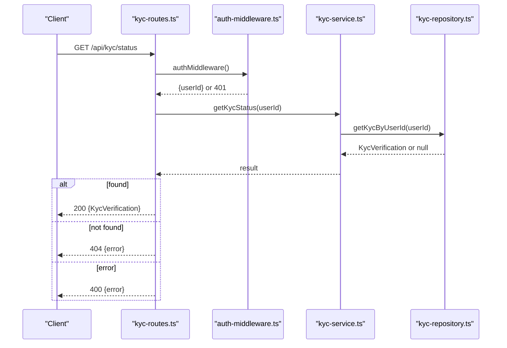
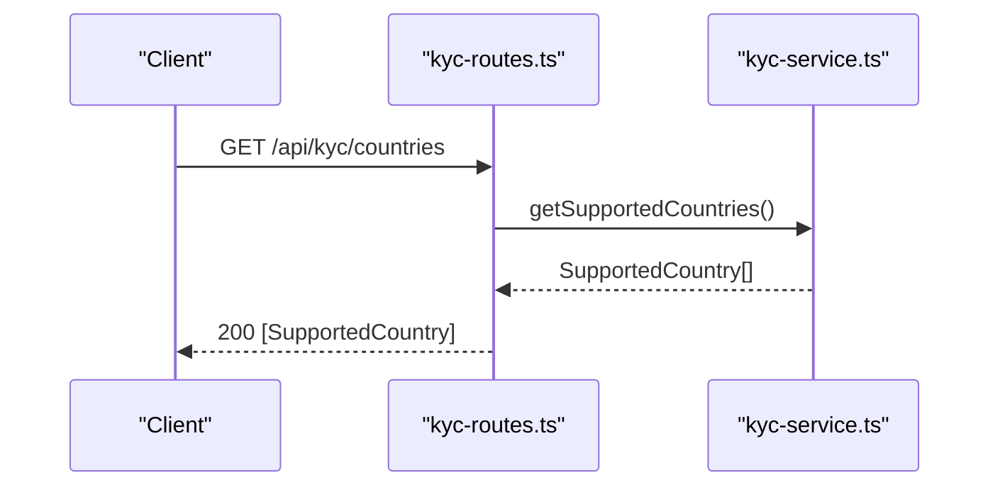
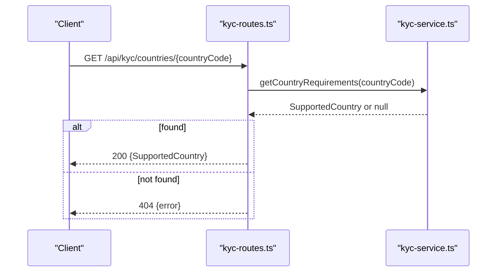
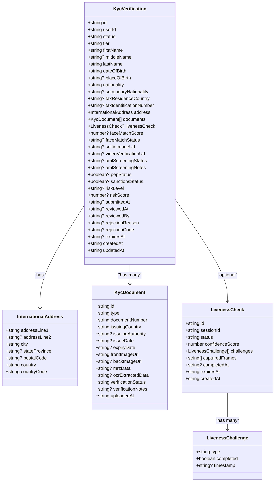
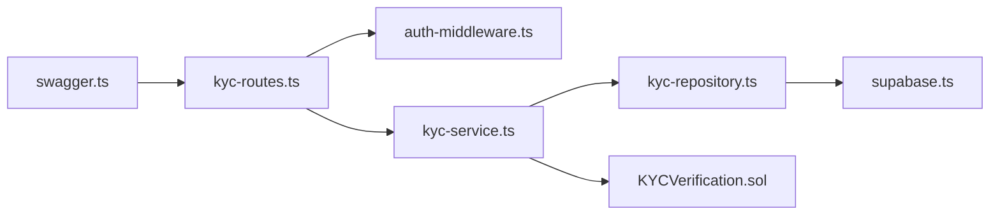

# KYC Data Retrieval API

<cite>
**Referenced Files in This Document**
- [kyc-routes.ts](file://src/routes/kyc-routes.ts)
- [kyc-service.ts](file://src/services/kyc-service.ts)
- [kyc-models.ts](file://src/models/kyc.ts)
- [kyc-repository.ts](file://src/repositories/kyc-repository.ts)
- [swagger.ts](file://src/config/swagger.ts)
- [auth-middleware.ts](file://src/middleware/auth-middleware.ts)
- [supabase.ts](file://src/config/supabase.ts)
- [KYCVerification.sol](file://contracts/KYCVerification.sol)
</cite>

## Table of Contents
1. [Introduction](#introduction)
2. [Project Structure](#project-structure)
3. [Core Components](#core-components)
4. [Architecture Overview](#architecture-overview)
5. [Detailed Component Analysis](#detailed-component-analysis)
6. [Dependency Analysis](#dependency-analysis)
7. [Performance Considerations](#performance-considerations)
8. [Troubleshooting Guide](#troubleshooting-guide)
9. [Conclusion](#conclusion)
10. [Appendices](#appendices)

## Introduction
This document specifies the KYC data retrieval API for the FreelanceXchain system. It covers:
- GET /api/kyc/status: Returns the current user’s complete KYC verification record, including personal information, document details, liveness check results, and verification status.
- GET /api/kyc/countries: Retrieves all supported countries for KYC.
- GET /api/kyc/countries/{countryCode}: Retrieves KYC requirements for a specific country.

It defines HTTP methods, authentication requirements (JWT for status endpoint), response schemas, and error handling. It also explains the KycVerification response schema lifecycle (pending, submitted, under_review, approved, rejected) and tier levels (basic, standard, enhanced). Guidance is included for building dynamic KYC forms based on country requirements.

## Project Structure
The KYC endpoints are implemented in the routing layer, backed by service logic, typed models, and a repository that persists to Supabase. Swagger definitions are centralized for OpenAPI documentation.

**Diagram sources**
- [kyc-routes.ts](file://src/routes/kyc-routes.ts#L1-L120)
- [kyc-service.ts](file://src/services/kyc-service.ts#L1-L120)
- [kyc-repository.ts](file://src/repositories/kyc-repository.ts#L1-L60)
- [swagger.ts](file://src/config/swagger.ts#L1-L60)
- [supabase.ts](file://src/config/supabase.ts#L1-L25)
- [KYCVerification.sol](file://contracts/KYCVerification.sol#L1-L40)

**Section sources**
- [kyc-routes.ts](file://src/routes/kyc-routes.ts#L1-L120)
- [swagger.ts](file://src/config/swagger.ts#L1-L60)
- [supabase.ts](file://src/config/supabase.ts#L1-L25)

## Core Components
- Routes define endpoints, request validation, and response formatting.
- Service encapsulates business logic, country requirement checks, and integration with the repository and blockchain contract.
- Models define the KycVerification schema and related types.
- Repository maps domain models to Supabase entities and performs persistence.
- Swagger centralizes OpenAPI definitions for interactive docs and schema references.

**Section sources**
- [kyc-routes.ts](file://src/routes/kyc-routes.ts#L240-L365)
- [kyc-service.ts](file://src/services/kyc-service.ts#L45-L120)
- [kyc-models.ts](file://src/models/kyc.ts#L84-L120)
- [kyc-repository.ts](file://src/repositories/kyc-repository.ts#L43-L80)
- [swagger.ts](file://src/config/swagger.ts#L20-L60)

## Architecture Overview
The KYC retrieval flow is a straightforward request-response pipeline with JWT authentication for the status endpoint.

**Diagram sources**
- [kyc-routes.ts](file://src/routes/kyc-routes.ts#L312-L365)
- [auth-middleware.ts](file://src/middleware/auth-middleware.ts#L25-L70)
- [kyc-service.ts](file://src/services/kyc-service.ts#L86-L90)
- [kyc-repository.ts](file://src/repositories/kyc-repository.ts#L136-L151)
- [supabase.ts](file://src/config/supabase.ts#L1-L25)

## Detailed Component Analysis

### Endpoint: GET /api/kyc/status
- Method: GET
- Path: /api/kyc/status
- Authentication: JWT Bearer token required
- Purpose: Retrieve the current user’s complete KYC verification record.
- Response:
  - 200 OK: KycVerification object
  - 401 Unauthorized: Missing or invalid token
  - 404 Not Found: No KYC verification found for the user
  - 400 Bad Request: Service-level error (e.g., validation failures)
- Notes:
  - Uses auth middleware to extract user identity from the token.
  - Calls service to fetch the latest KYC record by user ID.
  - Returns the mapped domain model to the client.

**Diagram sources**
- [kyc-routes.ts](file://src/routes/kyc-routes.ts#L312-L365)
- [auth-middleware.ts](file://src/middleware/auth-middleware.ts#L25-L70)
- [kyc-service.ts](file://src/services/kyc-service.ts#L86-L90)
- [kyc-repository.ts](file://src/repositories/kyc-repository.ts#L136-L151)

**Section sources**
- [kyc-routes.ts](file://src/routes/kyc-routes.ts#L312-L365)
- [auth-middleware.ts](file://src/middleware/auth-middleware.ts#L25-L70)
- [kyc-service.ts](file://src/services/kyc-service.ts#L86-L90)
- [kyc-repository.ts](file://src/repositories/kyc-repository.ts#L136-L151)

### Endpoint: GET /api/kyc/countries
- Method: GET
- Path: /api/kyc/countries
- Authentication: Not required
- Purpose: Retrieve all supported countries and their KYC requirements.
- Response:
  - 200 OK: Array of SupportedCountry objects

**Diagram sources**
- [kyc-routes.ts](file://src/routes/kyc-routes.ts#L240-L261)
- [kyc-service.ts](file://src/services/kyc-service.ts#L69-L75)

**Section sources**
- [kyc-routes.ts](file://src/routes/kyc-routes.ts#L240-L261)
- [kyc-service.ts](file://src/services/kyc-service.ts#L69-L75)

### Endpoint: GET /api/kyc/countries/{countryCode}
- Method: GET
- Path: /api/kyc/countries/{countryCode}
- Authentication: Not required
- Purpose: Retrieve KYC requirements for a specific country.
- Parameters:
  - countryCode: ISO 3166-1 alpha-2 country code (required)
- Response:
  - 200 OK: SupportedCountry object
  - 400 Bad Request: Invalid country code
  - 404 Not Found: Country not supported

**Diagram sources**
- [kyc-routes.ts](file://src/routes/kyc-routes.ts#L262-L311)
- [kyc-service.ts](file://src/services/kyc-service.ts#L73-L75)

**Section sources**
- [kyc-routes.ts](file://src/routes/kyc-routes.ts#L262-L311)
- [kyc-service.ts](file://src/services/kyc-service.ts#L73-L75)

### KycVerification Response Schema
The KycVerification object includes:
- Identity and demographic fields
- Address object with ISO country code
- Documents array with verification metadata
- LivenessCheck object (optional)
- Face match score and status (optional)
- AML screening status and risk indicators (optional)
- Lifecycle status and tier level
- Timestamps for creation/update/submission/review/expiry

Status lifecycle:
- pending
- submitted
- under_review
- approved
- rejected

Tier levels:
- basic
- standard
- enhanced

**Diagram sources**
- [kyc-models.ts](file://src/models/kyc.ts#L84-L120)
- [kyc-models.ts](file://src/models/kyc.ts#L74-L83)
- [kyc-models.ts](file://src/models/kyc.ts#L15-L27)
- [kyc-models.ts](file://src/models/kyc.ts#L29-L33)

**Section sources**
- [kyc-models.ts](file://src/models/kyc.ts#L1-L120)

### SupportedCountry Schema
- code: ISO 3166-1 alpha-2 country code
- name: Full country name
- supportedDocuments: Array of document types allowed for that country
- requiresLiveness: Boolean indicating if liveness check is required
- requiresAddressProof: Boolean indicating if address proof is required
- tier: KYC tier recommendation for the country

**Section sources**
- [kyc-models.ts](file://src/models/kyc.ts#L198-L206)
- [kyc-service.ts](file://src/services/kyc-service.ts#L45-L64)

### Country Requirements Data Usage
Clients should:
- Fetch supported countries to populate a dropdown or region selector.
- On selecting a country, call GET /api/kyc/countries/{countryCode} to retrieve requirements.
- Dynamically render form fields based on supportedDocuments, requiresLiveness, requiresAddressProof, and tier.
- Enforce validation rules (e.g., required document types) before submission.

**Section sources**
- [kyc-routes.ts](file://src/routes/kyc-routes.ts#L240-L311)
- [kyc-service.ts](file://src/services/kyc-service.ts#L45-L84)

## Dependency Analysis
- Route dependencies:
  - kyc-routes.ts depends on auth-middleware.ts for JWT validation.
  - kyc-routes.ts depends on kyc-service.ts for business logic.
- Service dependencies:
  - kyc-service.ts depends on kyc-repository.ts for persistence and on KYCVerification.sol for blockchain integration.
- Repository dependencies:
  - kyc-repository.ts depends on supabase.ts for table names and DB client.
- Swagger dependencies:
  - swagger.ts defines OpenAPI components and security schemes used by the routes.

**Diagram sources**
- [kyc-routes.ts](file://src/routes/kyc-routes.ts#L1-L40)
- [auth-middleware.ts](file://src/middleware/auth-middleware.ts#L1-L40)
- [kyc-service.ts](file://src/services/kyc-service.ts#L1-L30)
- [kyc-repository.ts](file://src/repositories/kyc-repository.ts#L1-L25)
- [supabase.ts](file://src/config/supabase.ts#L1-L25)
- [swagger.ts](file://src/config/swagger.ts#L20-L40)

**Section sources**
- [kyc-routes.ts](file://src/routes/kyc-routes.ts#L1-L40)
- [kyc-service.ts](file://src/services/kyc-service.ts#L1-L30)
- [kyc-repository.ts](file://src/repositories/kyc-repository.ts#L1-L25)
- [swagger.ts](file://src/config/swagger.ts#L20-L40)

## Performance Considerations
- The status endpoint performs a single DB query by user ID with ordering and limit to fetch the latest record.
- Country endpoints return static lists from memory; caching at the application layer can reduce repeated computation.
- Liveness and face match endpoints involve additional processing; consider rate limiting and session expiration handling.

[No sources needed since this section provides general guidance]

## Troubleshooting Guide
Common error scenarios and responses:
- 401 Unauthorized:
  - Missing Authorization header or invalid Bearer token format.
  - Auth middleware returns standardized error payload.
- 404 Not Found:
  - GET /api/kyc/status returns 404 when no KYC record exists for the user.
  - GET /api/kyc/countries/{countryCode} returns 404 when the country is not supported.
- 400 Bad Request:
  - Validation errors or service-level errors (e.g., invalid request data).
- 409 Conflict:
  - Submitting KYC when already approved or pending (not covered in this document but relevant for completeness).

Standardized error shape:
- error: { code, message, details (optional) }
- timestamp: ISO date-time
- requestId: UUID or unknown

**Section sources**
- [auth-middleware.ts](file://src/middleware/auth-middleware.ts#L25-L70)
- [kyc-routes.ts](file://src/routes/kyc-routes.ts#L312-L365)
- [swagger.ts](file://src/config/swagger.ts#L30-L54)

## Conclusion
The KYC data retrieval API provides a clear, secure, and extensible way to fetch user KYC records and country requirements. The status endpoint enforces JWT authentication, while country endpoints are publicly accessible for form-building. The response schemas and lifecycle/tier semantics enable robust client-side rendering and validation.

[No sources needed since this section summarizes without analyzing specific files]

## Appendices

### API Definitions and Schemas

- GET /api/kyc/status
  - Authentication: Bearer JWT
  - Response: 200 KycVerification, 401 Unauthorized, 404 Not Found, 400 Bad Request
  - Schema reference: KycVerification

- GET /api/kyc/countries
  - Authentication: None
  - Response: 200 [SupportedCountry]

- GET /api/kyc/countries/{countryCode}
  - Authentication: None
  - Response: 200 SupportedCountry, 400 Bad Request, 404 Not Found
  - Schema reference: SupportedCountry

- Security Scheme (OpenAPI):
  - bearerAuth: HTTP Bearer JWT

- Error Response Schema (OpenAPI):
  - error: { code, message, details[] }
  - timestamp: date-time
  - requestId: string

**Section sources**
- [kyc-routes.ts](file://src/routes/kyc-routes.ts#L240-L365)
- [swagger.ts](file://src/config/swagger.ts#L20-L60)
- [swagger.ts](file://src/config/swagger.ts#L30-L54)

### Example Responses

- Successful retrieval of KycVerification (200 OK)
  - Fields include identity, address, documents, optional liveness and face match, AML/risk fields, status, tier, timestamps.

- Country list (200 OK)
  - Array of SupportedCountry entries.

- Country requirements (200 OK)
  - Single SupportedCountry entry with code, name, supportedDocuments, requiresLiveness, requiresAddressProof, tier.

- Error response (404 Not Found)
  - Example: { error: { code: "KYC_NOT_FOUND", message: "No KYC verification found" }, timestamp: "...", requestId: "..." }

- Error response (400 Bad Request)
  - Example: { error: { code: "INVALID_COUNTRY_CODE", message: "Country code is required" }, timestamp: "...", requestId: "..." }

**Section sources**
- [kyc-routes.ts](file://src/routes/kyc-routes.ts#L240-L311)
- [swagger.ts](file://src/config/swagger.ts#L30-L54)

### Blockchain Integration Notes
- The system maintains a separate on-chain KYC contract for immutable verification status and tier. Off-chain KYC records can be augmented with on-chain verification details via service helpers.

**Section sources**
- [KYCVerification.sol](file://contracts/KYCVerification.sol#L1-L40)
- [kyc-service.ts](file://src/services/kyc-service.ts#L484-L500)