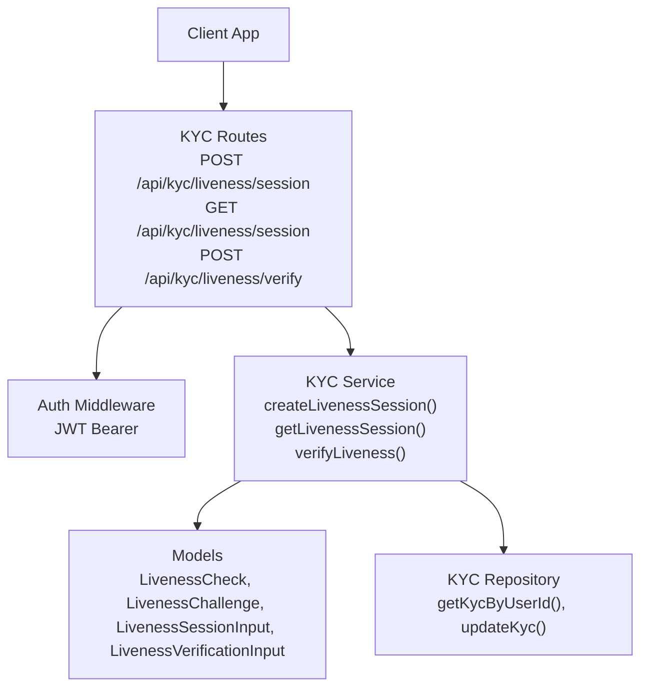
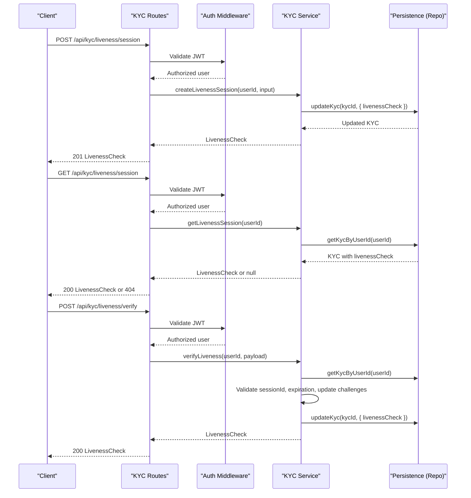
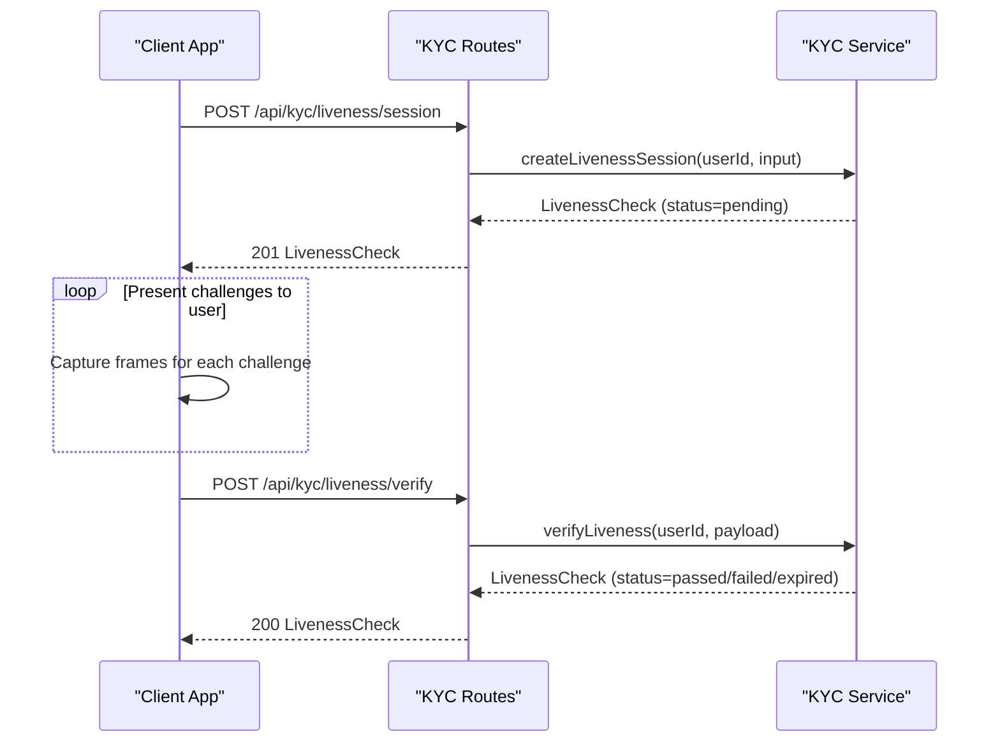
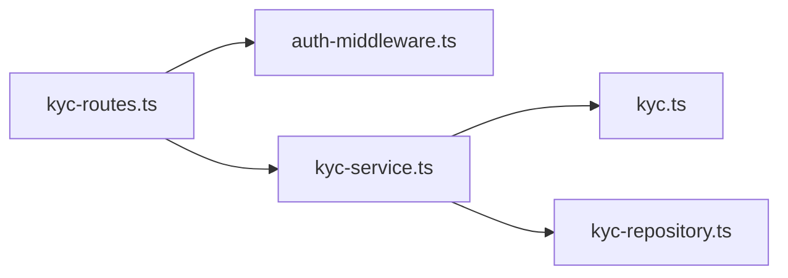

# KYC Liveness Verification API

<cite>
**Referenced Files in This Document**
- [kyc-routes.ts](file://src/routes/kyc-routes.ts)
- [kyc-service.ts](file://src/services/kyc-service.ts)
- [kyc.ts](file://src/models/kyc.ts)
- [auth-middleware.ts](file://src/middleware/auth-middleware.ts)
- [swagger.ts](file://src/config/swagger.ts)
- [test-kyc-flow.cjs](file://scripts/test-kyc-flow.cjs)
</cite>

## Table of Contents
1. [Introduction](#introduction)
2. [Project Structure](#project-structure)
3. [Core Components](#core-components)
4. [Architecture Overview](#architecture-overview)
5. [Detailed Component Analysis](#detailed-component-analysis)
6. [Dependency Analysis](#dependency-analysis)
7. [Performance Considerations](#performance-considerations)
8. [Troubleshooting Guide](#troubleshooting-guide)
9. [Conclusion](#conclusion)

## Introduction
This document describes the face liveness verification endpoints used in the KYC module of the FreelanceXchain system. It covers:
- Creating a new liveness session
- Retrieving the current session
- Submitting verification results

It specifies HTTP methods, URL patterns, request/response schemas, authentication requirements (JWT), liveness challenge types, how challenges are randomized, required request parameters for verification, example flows, response schema and status values, and error handling guidance.

## Project Structure
The liveness verification endpoints are implemented in the KYC routes, backed by service logic and typed models. Authentication is enforced via a JWT bearer token.

**Diagram sources**
- [kyc-routes.ts](file://src/routes/kyc-routes.ts#L430-L624)
- [auth-middleware.ts](file://src/middleware/auth-middleware.ts#L25-L70)
- [kyc-service.ts](file://src/services/kyc-service.ts#L193-L293)
- [kyc.ts](file://src/models/kyc.ts#L17-L181)

**Section sources**
- [kyc-routes.ts](file://src/routes/kyc-routes.ts#L430-L624)
- [auth-middleware.ts](file://src/middleware/auth-middleware.ts#L25-L70)
- [swagger.ts](file://src/config/swagger.ts#L22-L28)

## Core Components
- LivenessCheck: The session and result object containing status, confidence score, challenges, timestamps, and expiration.
- LivenessChallenge: Individual challenge entries with type, completion flag, and optional timestamp.
- LivenessSessionInput: Optional input to customize challenges during session creation.
- LivenessVerificationInput: Request payload for submitting verification results.

Key behaviors:
- Session creation sets a default set of challenges and an expiration time.
- Verification updates challenge completion and computes a confidence score; determines pass/fail/expired states.
- Sessions expire after a fixed duration.

**Section sources**
- [kyc.ts](file://src/models/kyc.ts#L17-L33)
- [kyc.ts](file://src/models/kyc.ts#L169-L181)
- [kyc-service.ts](file://src/services/kyc-service.ts#L65-L67)
- [kyc-service.ts](file://src/services/kyc-service.ts#L206-L222)
- [kyc-service.ts](file://src/services/kyc-service.ts#L237-L293)

## Architecture Overview
The liveness verification flow spans route handlers, authentication middleware, service logic, and persistence.

**Diagram sources**
- [kyc-routes.ts](file://src/routes/kyc-routes.ts#L430-L624)
- [auth-middleware.ts](file://src/middleware/auth-middleware.ts#L25-L70)
- [kyc-service.ts](file://src/services/kyc-service.ts#L193-L293)
- [kyc.ts](file://src/models/kyc.ts#L17-L33)

## Detailed Component Analysis

### Endpoint: POST /api/kyc/liveness/session
- Method: POST
- URL: /api/kyc/liveness/session
- Authentication: JWT Bearer
- Purpose: Create a new liveness verification session for the authenticated user.
- Request body:
  - challenges: optional array of challenge types to include in the session. Defaults to blink, turn_left, turn_right, smile if omitted.
- Response:
  - LivenessCheck object with status pending, empty challenges (completed=false), confidenceScore 0, and expiresAt set to a future timestamp.
- Notes:
  - The session is stored on the user’s KYC record.
  - Challenges are randomized by order in the input; defaults are used when not provided.

**Section sources**
- [kyc-routes.ts](file://src/routes/kyc-routes.ts#L430-L486)
- [kyc-service.ts](file://src/services/kyc-service.ts#L193-L235)
- [kyc.ts](file://src/models/kyc.ts#L169-L171)

### Endpoint: GET /api/kyc/liveness/session
- Method: GET
- URL: /api/kyc/liveness/session
- Authentication: JWT Bearer
- Purpose: Retrieve the current liveness session for the authenticated user.
- Response:
  - LivenessCheck if present; otherwise 404 with “No active liveness session”.
- Notes:
  - If no session exists, clients should create one first.

**Section sources**
- [kyc-routes.ts](file://src/routes/kyc-routes.ts#L488-L539)
- [kyc-service.ts](file://src/services/kyc-service.ts#L320-L326)

### Endpoint: POST /api/kyc/liveness/verify
- Method: POST
- URL: /api/kyc/liveness/verify
- Authentication: JWT Bearer
- Purpose: Submit verification results for the current session.
- Request body (required):
  - sessionId: string, must match the active session
  - capturedFrames: array of base64-encoded image strings
  - challengeResults: array of objects with:
    - type: one of blink, smile, turn_left, turn_right, nod, open_mouth
    - completed: boolean
    - timestamp: ISO date-time string
- Response:
  - LivenessCheck reflecting updated challenges, confidenceScore, and computed status (pending, passed, failed, expired).
- Notes:
  - If sessionId mismatches, invalid session error is returned.
  - If session expired, status is set to expired and saved.
  - Status determination considers whether all challenges were completed and a confidence threshold.

**Section sources**
- [kyc-routes.ts](file://src/routes/kyc-routes.ts#L541-L624)
- [kyc-service.ts](file://src/services/kyc-service.ts#L237-L293)
- [kyc.ts](file://src/models/kyc.ts#L173-L181)

### Liveness Challenge Types and Randomization
- Supported challenge types: blink, smile, turn_left, turn_right, nod, open_mouth.
- Default challenge set used when none are provided: blink, turn_left, turn_right, smile.
- Randomization:
  - The service constructs challenges from the provided input array. If omitted, defaults are used.
  - The order of challenges in the input defines the sequence presented to the user.

**Section sources**
- [kyc.ts](file://src/models/kyc.ts#L29-L33)
- [kyc-service.ts](file://src/services/kyc-service.ts#L206-L208)

### LivenessCheck Response Schema and Status Values
- Schema fields:
  - id: string
  - sessionId: string
  - status: pending, passed, failed, expired
  - confidenceScore: number
  - challenges: array of LivenessChallenge
  - capturedFrames: array of base64 image strings
  - completedAt: optional timestamp
  - expiresAt: ISO date-time
  - createdAt: ISO date-time
- Status semantics:
  - pending: session created or challenges not yet completed
  - passed: all challenges completed and confidence meets threshold
  - failed: all challenges completed but confidence below threshold
  - expired: session timed out

**Section sources**
- [kyc.ts](file://src/models/kyc.ts#L17-L33)
- [kyc-service.ts](file://src/services/kyc-service.ts#L65-L67)
- [kyc-service.ts](file://src/services/kyc-service.ts#L267-L276)

### Example Client Flow
Below is a typical end-to-end flow a client should orchestrate:

**Diagram sources**
- [kyc-routes.ts](file://src/routes/kyc-routes.ts#L430-L624)
- [kyc-service.ts](file://src/services/kyc-service.ts#L193-L293)
- [test-kyc-flow.cjs](file://scripts/test-kyc-flow.cjs#L137-L167)

**Section sources**
- [test-kyc-flow.cjs](file://scripts/test-kyc-flow.cjs#L137-L167)

## Dependency Analysis
The liveness endpoints depend on:
- Route handlers for routing and request validation
- Auth middleware for JWT enforcement
- Service layer for business logic and session management
- Models for type safety and schema definitions
- Persistence layer for reading/writing KYC records

**Diagram sources**
- [kyc-routes.ts](file://src/routes/kyc-routes.ts#L430-L624)
- [auth-middleware.ts](file://src/middleware/auth-middleware.ts#L25-L70)
- [kyc-service.ts](file://src/services/kyc-service.ts#L193-L293)
- [kyc.ts](file://src/models/kyc.ts#L17-L33)

**Section sources**
- [kyc-routes.ts](file://src/routes/kyc-routes.ts#L430-L624)
- [auth-middleware.ts](file://src/middleware/auth-middleware.ts#L25-L70)
- [kyc-service.ts](file://src/services/kyc-service.ts#L193-L293)
- [kyc.ts](file://src/models/kyc.ts#L17-L33)

## Performance Considerations
- Session expiration: Sessions expire after a fixed duration; clients should complete verification promptly.
- Confidence scoring: The service simulates confidence scoring; production deployments should integrate a robust ML model.
- Payload sizes: Base64-encoded frames can be large; consider compression or streaming where feasible.
- Rate limiting: Apply rate limits at the API gateway to protect sensitive endpoints.

[No sources needed since this section provides general guidance]

## Troubleshooting Guide
Common issues and resolutions:
- Missing or invalid JWT:
  - Symptom: 401 Unauthorized
  - Resolution: Ensure Authorization header is present and formatted as Bearer <token>.
- No active liveness session:
  - Symptom: 404 Not Found with “No active liveness session”
  - Resolution: Call POST /api/kyc/liveness/session to create a session first.
- Invalid session ID:
  - Symptom: 400 Bad Request with “Invalid liveness session ID”
  - Resolution: Use the sessionId returned by the session creation endpoint.
- Session expired:
  - Symptom: 400 Bad Request with “Liveness session has expired”
  - Resolution: Create a new session and restart the verification.
- Validation errors:
  - Symptom: 400 Bad Request with “sessionId, capturedFrames, and challengeResults are required”
  - Resolution: Ensure all required fields are present in the verification request.

**Section sources**
- [auth-middleware.ts](file://src/middleware/auth-middleware.ts#L25-L70)
- [kyc-routes.ts](file://src/routes/kyc-routes.ts#L488-L539)
- [kyc-routes.ts](file://src/routes/kyc-routes.ts#L541-L624)
- [kyc-service.ts](file://src/services/kyc-service.ts#L237-L293)

## Conclusion
The KYC liveness verification endpoints provide a structured flow for creating sessions, retrieving current sessions, and submitting verification results. They enforce JWT authentication, manage session lifecycle, and compute outcomes based on challenge completion and confidence thresholds. Clients should follow the documented request/response schemas and handle error conditions appropriately to ensure a smooth user experience.