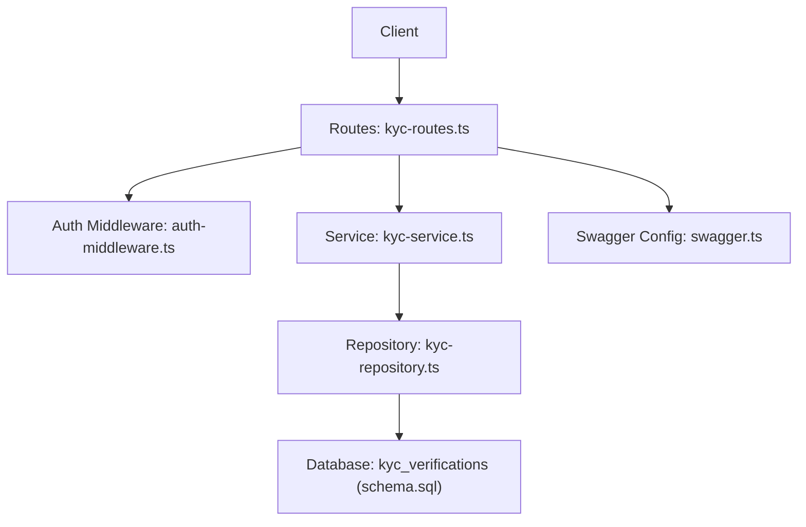
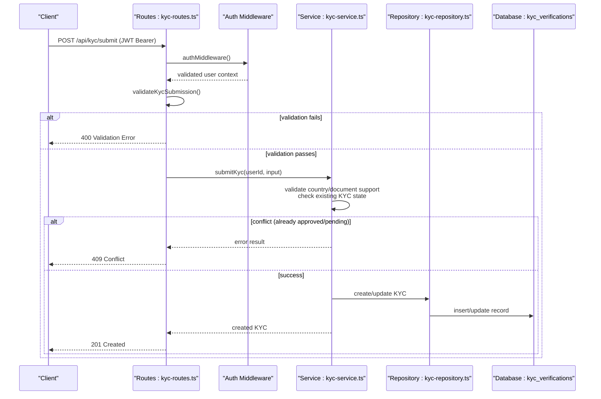
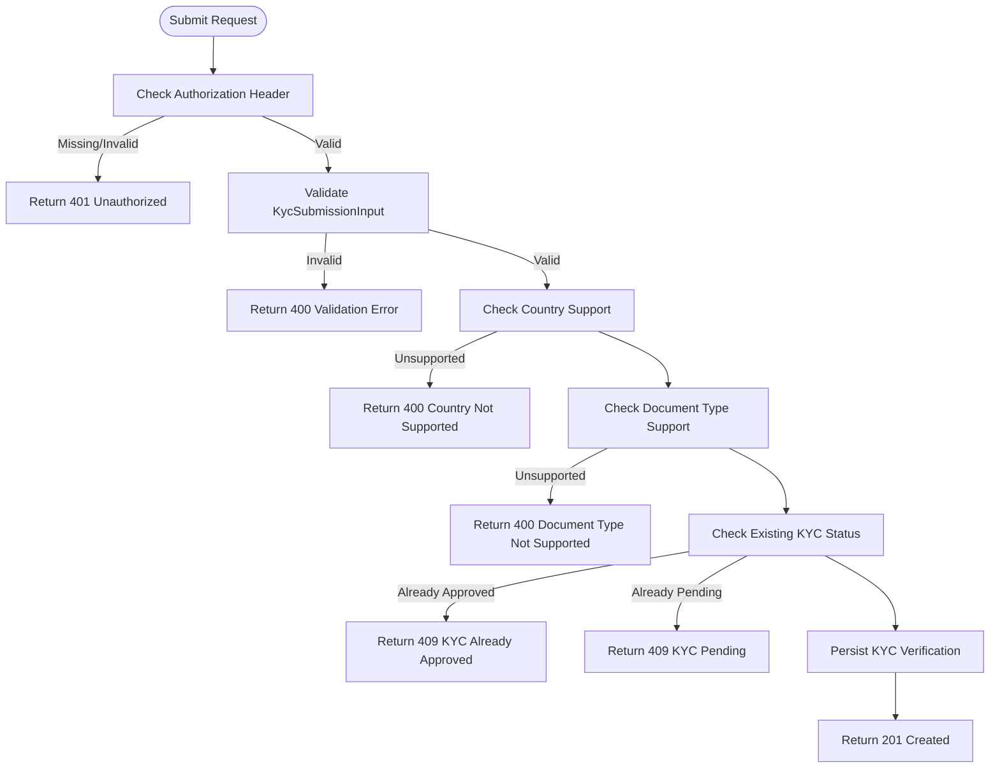
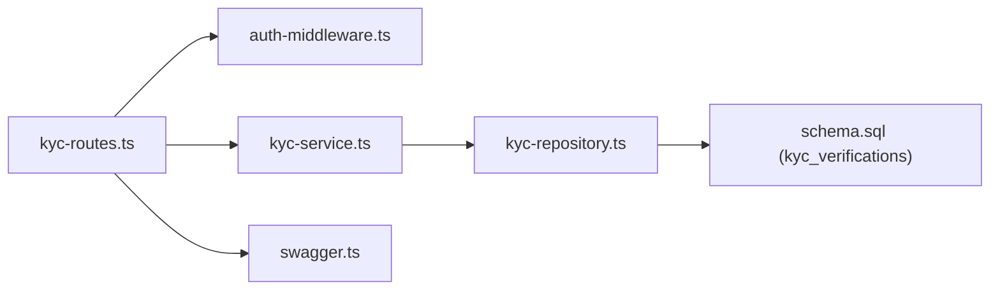

# KYC Submission API

<cite>
**Referenced Files in This Document**
- [kyc-routes.ts](file://src/routes/kyc-routes.ts)
- [kyc-service.ts](file://src/services/kyc-service.ts)
- [kyc-models.ts](file://src/models/kyc.ts)
- [kyc-repository.ts](file://src/repositories/kyc-repository.ts)
- [auth-middleware.ts](file://src/middleware/auth-middleware.ts)
- [swagger.ts](file://src/config/swagger.ts)
- [schema.sql](file://supabase/schema.sql)
</cite>

## Table of Contents
1. [Introduction](#introduction)
2. [Project Structure](#project-structure)
3. [Core Components](#core-components)
4. [Architecture Overview](#architecture-overview)
5. [Detailed Component Analysis](#detailed-component-analysis)
6. [Dependency Analysis](#dependency-analysis)
7. [Performance Considerations](#performance-considerations)
8. [Troubleshooting Guide](#troubleshooting-guide)
9. [Conclusion](#conclusion)
10. [Appendices](#appendices)

## Introduction
This document provides comprehensive API documentation for the KYC submission endpoint in the FreelanceXchain system. It focuses on the POST /api/kyc/submit endpoint, detailing the HTTP method, URL pattern, request body schema (KycSubmissionInput), authentication requirements (JWT Bearer), validation rules, response codes, and practical examples. It also covers privacy considerations and data handling practices for transmitting sensitive personal information.

## Project Structure
The KYC submission flow spans routing, middleware, service, repository, and data model layers, with Swagger OpenAPI definitions embedded in the routes for interactive documentation.

**Diagram sources**
- [kyc-routes.ts](file://src/routes/kyc-routes.ts#L1-L120)
- [auth-middleware.ts](file://src/middleware/auth-middleware.ts#L1-L70)
- [kyc-service.ts](file://src/services/kyc-service.ts#L1-L120)
- [kyc-repository.ts](file://src/repositories/kyc-repository.ts#L1-L60)
- [schema.sql](file://supabase/schema.sql#L135-L159)
- [swagger.ts](file://src/config/swagger.ts#L20-L30)

**Section sources**
- [kyc-routes.ts](file://src/routes/kyc-routes.ts#L1-L120)
- [swagger.ts](file://src/config/swagger.ts#L20-L30)
- [schema.sql](file://supabase/schema.sql#L135-L159)

## Core Components
- Endpoint: POST /api/kyc/submit
- Authentication: JWT Bearer token via Authorization header
- Request Body: KycSubmissionInput (international KYC schema)
- Response Codes:
  - 201 Created: KYC submitted successfully
  - 400 Bad Request: Validation error or invalid request data
  - 409 Conflict: KYC already pending or approved
  - 401 Unauthorized: Missing or invalid Authorization header
- Validation: Built-in validator checks required fields and formats; service-level country/document support checks

**Section sources**
- [kyc-routes.ts](file://src/routes/kyc-routes.ts#L367-L428)
- [auth-middleware.ts](file://src/middleware/auth-middleware.ts#L25-L70)
- [kyc-service.ts](file://src/services/kyc-service.ts#L90-L120)

## Architecture Overview
The KYC submission request follows this flow:
1. Client sends a POST request with a valid JWT Bearer token.
2. Auth middleware validates the token and attaches user context.
3. Route handler validates the request payload using a dedicated validator.
4. Service layer performs business validations (country/document support, existing KYC state).
5. Repository persists the KYC verification record to the database.
6. Optional blockchain submission occurs if the user has a wallet address.

**Diagram sources**
- [kyc-routes.ts](file://src/routes/kyc-routes.ts#L367-L428)
- [auth-middleware.ts](file://src/middleware/auth-middleware.ts#L25-L70)
- [kyc-service.ts](file://src/services/kyc-service.ts#L90-L120)
- [kyc-repository.ts](file://src/repositories/kyc-repository.ts#L124-L157)
- [schema.sql](file://supabase/schema.sql#L135-L159)

## Detailed Component Analysis

### Endpoint Definition: POST /api/kyc/submit
- Method: POST
- URL Pattern: /api/kyc/submit
- Authentication: Requires Authorization: Bearer <JWT>
- Request Body: KycSubmissionInput (see schema below)
- Responses:
  - 201 Created: KYC verification created/updated
  - 400 Bad Request: Validation error or invalid request data
  - 409 Conflict: KYC already approved or pending
  - 401 Unauthorized: Missing/invalid Authorization header

**Section sources**
- [kyc-routes.ts](file://src/routes/kyc-routes.ts#L367-L428)
- [swagger.ts](file://src/config/swagger.ts#L20-L30)

### Request Body Schema: KycSubmissionInput
The request body must conform to the KycSubmissionInput schema. Required fields include:
- Personal Information
  - firstName (string)
  - lastName (string)
  - dateOfBirth (string, format: date)
  - nationality (string)
  - Optional: middleName, placeOfBirth, secondaryNationality, taxResidenceCountry, taxIdentificationNumber
- Address (InternationalAddress)
  - addressLine1 (string)
  - city (string)
  - country (string)
  - countryCode (string)
  - Optional: addressLine2, stateProvince, postalCode
- Identity Document (KycDocument)
  - type (enum: passport, national_id, drivers_license, residence_permit, voter_id, tax_id, social_security, birth_certificate, utility_bill, bank_statement)
  - documentNumber (string)
  - issuingCountry (string)
  - Optional: issuingAuthority, issueDate (date), expiryDate (date), frontImageUrl (string), backImageUrl (string)
- Optional Fields
  - selfieImageUrl (string)
  - tier (enum: basic, standard, enhanced)

Validation Rules:
- All required fields must be present and non-empty.
- dateOfBirth must be a valid date string (YYYY-MM-DD).
- countryCode must match supported countries.
- document.type must be one of the supported document types for the given country.
- address must include required address fields.
- Authorization header must be present and formatted as Bearer <token>.

**Section sources**
- [kyc-routes.ts](file://src/routes/kyc-routes.ts#L107-L145)
- [kyc-routes.ts](file://src/routes/kyc-routes.ts#L205-L237)
- [kyc-models.ts](file://src/models/kyc.ts#L136-L167)
- [kyc-models.ts](file://src/models/kyc.ts#L74-L82)
- [kyc-models.ts](file://src/models/kyc.ts#L35-L50)

### Validation Logic
- Route-level validation:
  - Ensures required fields exist and meet basic type/format requirements.
  - Validates address and document sub-schemas.
- Service-level validation:
  - Confirms the user exists.
  - Checks if the country is supported and the document type is supported for that country.
  - Prevents duplicate submissions if KYC is already approved or pending.

**Diagram sources**
- [kyc-routes.ts](file://src/routes/kyc-routes.ts#L391-L428)
- [kyc-service.ts](file://src/services/kyc-service.ts#L90-L120)

**Section sources**
- [kyc-routes.ts](file://src/routes/kyc-routes.ts#L205-L237)
- [kyc-service.ts](file://src/services/kyc-service.ts#L90-L120)

### Response Codes and Conditions
- 201 Created: KYC verification created or updated successfully.
- 400 Bad Request:
  - Validation error: missing or invalid fields.
  - Country not supported.
  - Document type not supported for the selected country.
- 409 Conflict:
  - KYC already approved.
  - KYC already pending review.
- 401 Unauthorized:
  - Missing Authorization header.
  - Invalid Bearer token format.
  - Token validation failure.

**Section sources**
- [kyc-routes.ts](file://src/routes/kyc-routes.ts#L391-L428)
- [auth-middleware.ts](file://src/middleware/auth-middleware.ts#L25-L70)
- [kyc-service.ts](file://src/services/kyc-service.ts#L90-L120)

### Practical Examples

#### Example Request Payload (International KYC)
- Headers:
  - Authorization: Bearer <your-jwt-token>
  - Content-Type: application/json
- Body:
  - firstName: "John"
  - lastName: "Doe"
  - dateOfBirth: "1990-01-01"
  - nationality: "US"
  - address:
    - addressLine1: "123 Main St"
    - addressLine2: "Apt 4B"
    - city: "New York"
    - stateProvince: "NY"
    - postalCode: "10001"
    - country: "United States"
    - countryCode: "US"
  - document:
    - type: "passport"
    - documentNumber: "P12345678"
    - issuingCountry: "US"
    - frontImageUrl: "https://example.com/passport-front.jpg"
    - backImageUrl: "https://example.com/passport-back.jpg"
  - selfieImageUrl: "https://example.com/selfie.jpg"
  - tier: "enhanced"

#### Example Successful Response (201 Created)
- Status: 201 Created
- Body: KycVerification object reflecting the submitted KYC (with status set to submitted).

#### Example Validation Error Response (400)
- Status: 400 Bad Request
- Body:
  - error:
    - code: "VALIDATION_ERROR"
    - message: "Invalid request data"
    - details: ["firstName is required", "address.addressLine1 is required"]

#### Example Conflict Response (409)
- Status: 409 Conflict
- Body:
  - error:
    - code: "KYC_PENDING"
    - message: "KYC verification already pending review"

**Section sources**
- [kyc-routes.ts](file://src/routes/kyc-routes.ts#L367-L428)
- [kyc-models.ts](file://src/models/kyc.ts#L84-L119)

### Privacy Considerations and Data Handling
- Sensitive Data Transmission:
  - The endpoint accepts images (front/back of documents, selfie) via URLs. Ensure HTTPS endpoints are used to protect data in transit.
- Data Storage:
  - KYC records are stored in the kyc_verifications table with JSONB fields for address, documents, and optional liveness check data. The table includes timestamps and status tracking.
- Access Control:
  - Row Level Security (RLS) is enabled on the kyc_verifications table to restrict access. Service role policies grant full access for backend operations.
- Best Practices:
  - Avoid storing raw personal data unnecessarily; rely on secure image storage and metadata.
  - Implement rate limiting and input sanitization at the gateway level.
  - Consider tokenizing or hashing identifiers where feasible.

**Section sources**
- [schema.sql](file://supabase/schema.sql#L135-L159)
- [schema.sql](file://supabase/schema.sql#L225-L261)

## Dependency Analysis
The KYC submission endpoint depends on:
- Routing and Swagger definitions for endpoint exposure and schema documentation.
- Authentication middleware for JWT validation.
- Service layer for business logic and external integrations (e.g., blockchain).
- Repository layer for persistence.
- Database schema for storage.

**Diagram sources**
- [kyc-routes.ts](file://src/routes/kyc-routes.ts#L1-L120)
- [auth-middleware.ts](file://src/middleware/auth-middleware.ts#L25-L70)
- [kyc-service.ts](file://src/services/kyc-service.ts#L1-L60)
- [kyc-repository.ts](file://src/repositories/kyc-repository.ts#L1-L60)
- [schema.sql](file://supabase/schema.sql#L135-L159)
- [swagger.ts](file://src/config/swagger.ts#L20-L30)

**Section sources**
- [kyc-routes.ts](file://src/routes/kyc-routes.ts#L1-L120)
- [kyc-service.ts](file://src/services/kyc-service.ts#L1-L60)
- [kyc-repository.ts](file://src/repositories/kyc-repository.ts#L1-L60)
- [schema.sql](file://supabase/schema.sql#L135-L159)
- [swagger.ts](file://src/config/swagger.ts#L20-L30)

## Performance Considerations
- Validation Early Exit: The route-level validator short-circuits on missing required fields to reduce unnecessary processing.
- Minimal Database Writes: Updates only occur when KYC already exists; otherwise, a single insert is performed.
- Asynchronous Blockchain Submission: Blockchain submission is attempted asynchronously and does not block the primary response path.

[No sources needed since this section provides general guidance]

## Troubleshooting Guide
Common Issues and Resolutions:
- 401 Unauthorized
  - Cause: Missing or malformed Authorization header.
  - Resolution: Ensure Authorization: Bearer <valid-jwt> is present.
- 400 Validation Error
  - Cause: Missing required fields or invalid formats (e.g., date format).
  - Resolution: Provide all required fields with correct types and formats.
- 400 Country Not Supported
  - Cause: countryCode not in supported countries list.
  - Resolution: Use a supported country code.
- 400 Document Type Not Supported
  - Cause: Document type not supported for the selected country.
  - Resolution: Choose a supported document type for the given country.
- 409 Conflict (KYC Already Approved/Pending)
  - Cause: Attempting to submit when KYC is already approved or pending review.
  - Resolution: Wait until the current KYC completes or check status endpoint.

**Section sources**
- [auth-middleware.ts](file://src/middleware/auth-middleware.ts#L25-L70)
- [kyc-routes.ts](file://src/routes/kyc-routes.ts#L391-L428)
- [kyc-service.ts](file://src/services/kyc-service.ts#L90-L120)

## Conclusion
The POST /api/kyc/submit endpoint provides a robust, standards-aligned international KYC submission flow with strong validation, clear error handling, and secure data handling practices. By adhering to the documented schema and authentication requirements, clients can reliably submit KYC applications while maintaining compliance with privacy and data protection principles.

## Appendices

### Appendix A: InternationalAddress Schema
- addressLine1 (string, required)
- addressLine2 (string, optional)
- city (string, required)
- stateProvince (string, optional)
- postalCode (string, optional)
- country (string, required)
- countryCode (string, required)

**Section sources**
- [kyc-models.ts](file://src/models/kyc.ts#L74-L82)

### Appendix B: KycDocument Schema
- type (enum, required)
- documentNumber (string, required)
- issuingCountry (string, required)
- issuingAuthority (string, optional)
- issueDate (string, date, optional)
- expiryDate (string, date, optional)
- frontImageUrl (string, required)
- backImageUrl (string, optional)

**Section sources**
- [kyc-models.ts](file://src/models/kyc.ts#L35-L50)

### Appendix C: Supported Countries and Document Types
- Supported countries include US, GB, CA, AU, DE, FR, JP, SG, AE, IN, PH, BR, MX, NG, KE, ZA with varying requirements and tiers.
- Document types include passport, national_id, drivers_license, residence_permit, voter_id, tax_id, social_security, birth_certificate, utility_bill, bank_statement.

**Section sources**
- [kyc-service.ts](file://src/services/kyc-service.ts#L46-L63)
- [kyc-service.ts](file://src/services/kyc-service.ts#L81-L84)