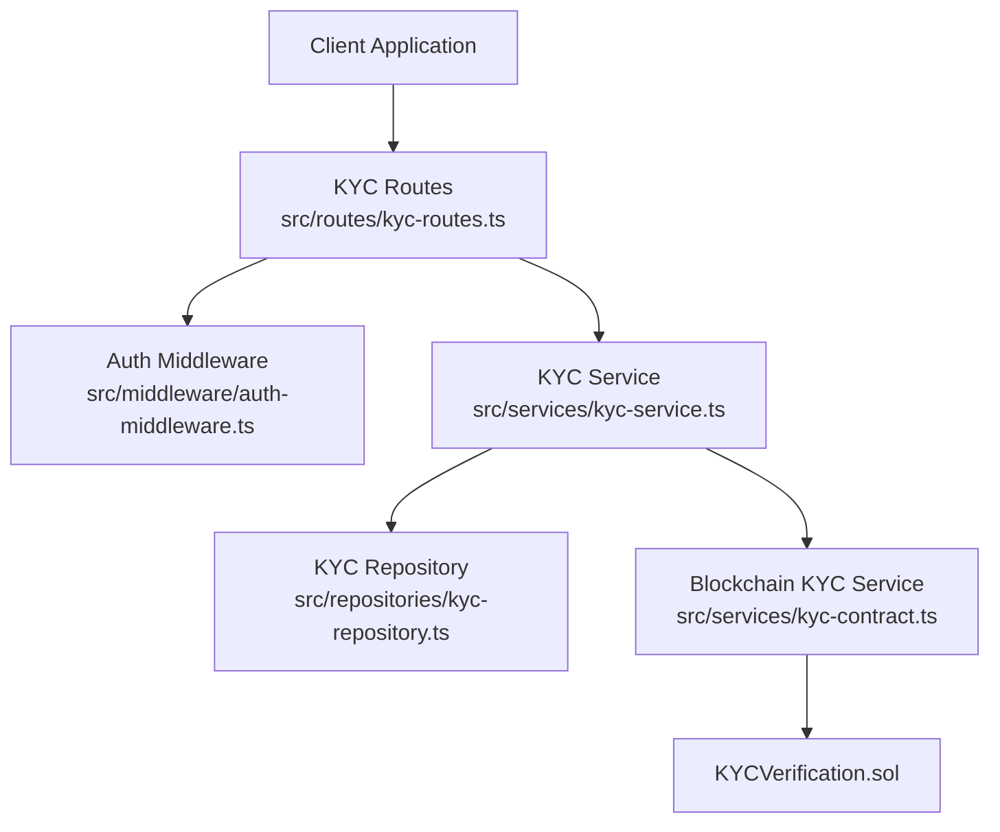
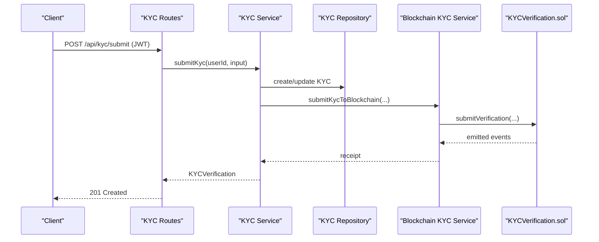
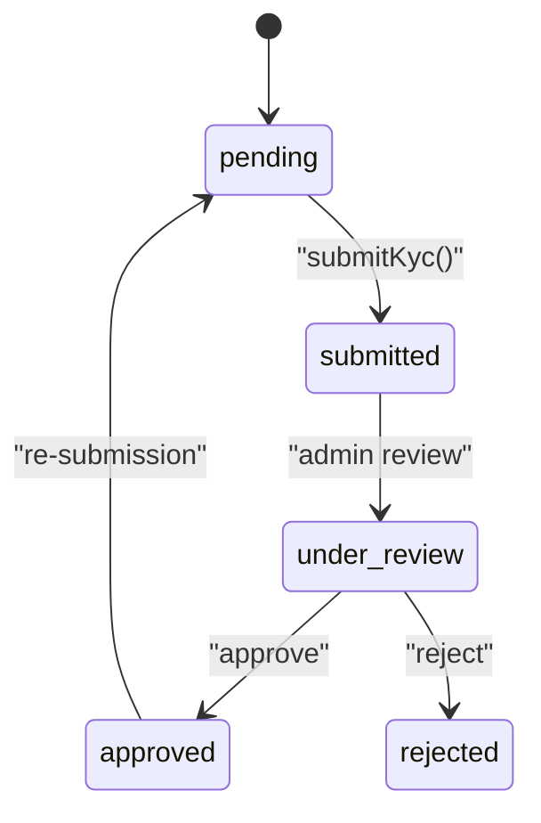
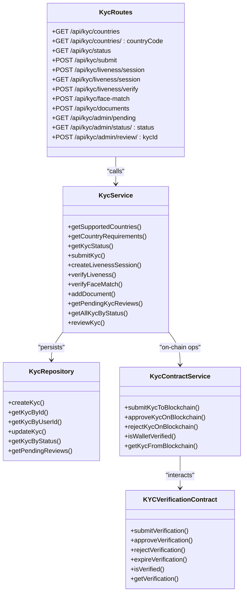

# KYC Verification API

<cite>
**Referenced Files in This Document**
- [kyc-routes.ts](file://src/routes/kyc-routes.ts)
- [kyc-service.ts](file://src/services/kyc-service.ts)
- [kyc-models.ts](file://src/models/kyc.ts)
- [kyc-repository.ts](file://src/repositories/kyc-repository.ts)
- [kyc-contract.ts](file://src/services/kyc-contract.ts)
- [KYCVerification.sol](file://contracts/KYCVerification.sol)
- [auth-middleware.ts](file://src/middleware/auth-middleware.ts)
- [API-DOCUMENTATION.md](file://docs/API-DOCUMENTATION.md)
</cite>

## Table of Contents
1. [Introduction](#introduction)
2. [Project Structure](#project-structure)
3. [Core Components](#core-components)
4. [Architecture Overview](#architecture-overview)
5. [Detailed Component Analysis](#detailed-component-analysis)
6. [Dependency Analysis](#dependency-analysis)
7. [Performance Considerations](#performance-considerations)
8. [Troubleshooting Guide](#troubleshooting-guide)
9. [Conclusion](#conclusion)
10. [Appendices](#appendices)

## Introduction
This document provides comprehensive API documentation for the KYC verification system in the FreelanceXchain platform. It covers all KYC endpoints for submitting international identity and address information, managing verification documents, creating and completing liveness sessions, verifying face match, retrieving KYC status, and administrative review workflows. It also explains the KYC status lifecycle, required fields for international KYC, privacy considerations, and integration with the on-chain KYC verification smart contract.

## Project Structure
The KYC API is implemented as Express routes backed by service-layer logic, repository persistence, and blockchain integration. Swagger schemas define request/response structures. Authentication is enforced via a JWT Bearer token middleware.

**Diagram sources**
- [kyc-routes.ts](file://src/routes/kyc-routes.ts#L1-L917)
- [auth-middleware.ts](file://src/middleware/auth-middleware.ts#L1-L101)
- [kyc-service.ts](file://src/services/kyc-service.ts#L1-L547)
- [kyc-repository.ts](file://src/repositories/kyc-repository.ts#L1-L178)
- [kyc-contract.ts](file://src/services/kyc-contract.ts#L1-L366)
- [KYCVerification.sol](file://contracts/KYCVerification.sol#L1-L211)

**Section sources**
- [kyc-routes.ts](file://src/routes/kyc-routes.ts#L1-L917)
- [auth-middleware.ts](file://src/middleware/auth-middleware.ts#L1-L101)
- [kyc-service.ts](file://src/services/kyc-service.ts#L1-L547)
- [kyc-repository.ts](file://src/repositories/kyc-repository.ts#L1-L178)
- [kyc-contract.ts](file://src/services/kyc-contract.ts#L1-L366)
- [KYCVerification.sol](file://contracts/KYCVerification.sol#L1-L211)

## Core Components
- Routes: Define endpoints, request/response schemas, and security requirements.
- Service: Orchestrates validation, business rules, repository updates, and blockchain submissions.
- Repository: Persists KYC records to Supabase and maps entities to models.
- Models: Strongly typed request/response schemas and enums.
- Blockchain Service: Submits KYC to the smart contract and manages approvals/rejections.
- Smart Contract: Stores on-chain verification status and metadata.

**Section sources**
- [kyc-routes.ts](file://src/routes/kyc-routes.ts#L1-L917)
- [kyc-service.ts](file://src/services/kyc-service.ts#L1-L547)
- [kyc-repository.ts](file://src/repositories/kyc-repository.ts#L1-L178)
- [kyc-models.ts](file://src/models/kyc.ts#L1-L206)
- [kyc-contract.ts](file://src/services/kyc-contract.ts#L1-L366)
- [KYCVerification.sol](file://contracts/KYCVerification.sol#L1-L211)

## Architecture Overview
The KYC API follows a layered architecture:
- Presentation Layer: Express routes expose REST endpoints.
- Application Layer: Services encapsulate business logic and integrate with repositories and blockchain.
- Persistence Layer: Repository maps models to Supabase entities and performs CRUD.
- Integration Layer: Blockchain service interacts with the KYC smart contract.

**Diagram sources**
- [kyc-routes.ts](file://src/routes/kyc-routes.ts#L367-L428)
- [kyc-service.ts](file://src/services/kyc-service.ts#L90-L190)
- [kyc-repository.ts](file://src/repositories/kyc-repository.ts#L124-L157)
- [kyc-contract.ts](file://src/services/kyc-contract.ts#L93-L156)
- [KYCVerification.sol](file://contracts/KYCVerification.sol#L61-L87)

## Detailed Component Analysis

### Authentication and Security
- All protected KYC endpoints require a Bearer token in the Authorization header.
- The auth middleware validates the token and attaches user info to the request.
- Administrative endpoints additionally require the admin role.

**Section sources**
- [API-DOCUMENTATION.md](file://docs/API-DOCUMENTATION.md#L7-L14)
- [auth-middleware.ts](file://src/middleware/auth-middleware.ts#L1-L101)
- [kyc-routes.ts](file://src/routes/kyc-routes.ts#L313-L365)

### KYC Status Lifecycle
- pending: Initial state when a user registers or initiates KYC.
- submitted: After successful submission of personal and document information.
- under_review: Admin review phase (managed by admin endpoints).
- approved: Verified and approved; may have expiration.
- rejected: Verification denied with a rejection reason/code.

**Diagram sources**
- [kyc-models.ts](file://src/models/kyc.ts#L1-L206)
- [kyc-service.ts](file://src/services/kyc-service.ts#L328-L407)

**Section sources**
- [kyc-models.ts](file://src/models/kyc.ts#L1-L206)
- [kyc-service.ts](file://src/services/kyc-service.ts#L328-L407)

### International KYC Requirements
- Address: addressLine1, city, country, countryCode are required.
- Document: type, documentNumber, issuingCountry, frontImageUrl are required; backImageUrl is optional.
- Selfie: selfieImageUrl is optional but recommended for face match.
- Tier: basic, standard, enhanced; defaults to country tier if not provided.

**Section sources**
- [kyc-routes.ts](file://src/routes/kyc-routes.ts#L205-L237)
- [kyc-models.ts](file://src/models/kyc.ts#L74-L119)

### Endpoint Reference

#### GET /api/kyc/countries
- Purpose: Retrieve supported countries and their KYC requirements.
- Response: Array of SupportedCountry entries.

**Section sources**
- [kyc-routes.ts](file://src/routes/kyc-routes.ts#L240-L260)
- [kyc-service.ts](file://src/services/kyc-service.ts#L45-L71)

#### GET /api/kyc/countries/{countryCode}
- Purpose: Retrieve KYC requirements for a specific country.
- Path Parameters: countryCode (ISO 3166-1 alpha-2).
- Response: SupportedCountry.

**Section sources**
- [kyc-routes.ts](file://src/routes/kyc-routes.ts#L262-L309)
- [kyc-service.ts](file://src/services/kyc-service.ts#L73-L85)

#### GET /api/kyc/status
- Purpose: Retrieve current user’s KYC status.
- Response: KycVerification.

**Section sources**
- [kyc-routes.ts](file://src/routes/kyc-routes.ts#L312-L365)
- [kyc-service.ts](file://src/services/kyc-service.ts#L86-L90)

#### POST /api/kyc/submit
- Purpose: Submit international KYC with personal info and identity documents.
- Request Body: KycSubmissionInput.
- Responses:
  - 201: KYC created/submitted.
  - 400: Validation error.
  - 409: KYC already pending or approved.

**Section sources**
- [kyc-routes.ts](file://src/routes/kyc-routes.ts#L367-L428)
- [kyc-service.ts](file://src/services/kyc-service.ts#L90-L190)

#### POST /api/kyc/liveness/session
- Purpose: Create a liveness verification session with randomized challenges.
- Request Body: LivenessSessionInput (optional challenges).
- Response: LivenessCheck.

**Section sources**
- [kyc-routes.ts](file://src/routes/kyc-routes.ts#L430-L486)
- [kyc-service.ts](file://src/services/kyc-service.ts#L193-L235)

#### GET /api/kyc/liveness/session
- Purpose: Retrieve current liveness session.
- Response: LivenessCheck or 404 if none.

**Section sources**
- [kyc-routes.ts](file://src/routes/kyc-routes.ts#L488-L539)
- [kyc-service.ts](file://src/services/kyc-service.ts#L320-L326)

#### POST /api/kyc/liveness/verify
- Purpose: Submit captured frames and challenge results to finalize liveness.
- Request Body: LivenessVerificationInput (sessionId, capturedFrames, challengeResults).
- Response: LivenessCheck.

**Section sources**
- [kyc-routes.ts](file://src/routes/kyc-routes.ts#L541-L624)
- [kyc-service.ts](file://src/services/kyc-service.ts#L237-L293)

#### POST /api/kyc/face-match
- Purpose: Verify face match between selfie and document.
- Request Body: FaceMatchInput (selfieImageUrl, documentImageUrl).
- Response: { matched: boolean, score: number }.

**Section sources**
- [kyc-routes.ts](file://src/routes/kyc-routes.ts#L626-L698)
- [kyc-service.ts](file://src/services/kyc-service.ts#L295-L318)

#### POST /api/kyc/documents
- Purpose: Add an additional document to an existing KYC.
- Request Body: KycDocument.
- Response: Updated KycVerification.

**Section sources**
- [kyc-routes.ts](file://src/routes/kyc-routes.ts#L700-L764)
- [kyc-service.ts](file://src/services/kyc-service.ts#L417-L454)

#### GET /api/kyc/admin/pending
- Purpose: Get pending KYC reviews (Admin only).
- Response: Array of KycVerification.

**Section sources**
- [kyc-routes.ts](file://src/routes/kyc-routes.ts#L766-L783)
- [kyc-service.ts](file://src/services/kyc-service.ts#L409-L411)

#### GET /api/kyc/admin/status/{status}
- Purpose: Get KYC verifications by status (Admin only).
- Path Parameters: status (pending, submitted, under_review, approved, rejected).
- Response: Array of KycVerification.

**Section sources**
- [kyc-routes.ts](file://src/routes/kyc-routes.ts#L785-L820)
- [kyc-service.ts](file://src/services/kyc-service.ts#L413-L415)

#### POST /api/kyc/admin/review/{kycId}
- Purpose: Approve or reject a KYC verification with AML screening results.
- Path Parameters: kycId (UUID).
- Request Body: KycReviewInput (status, rejectionReason, rejectionCode, riskLevel, riskScore, amlScreeningStatus, amlScreeningNotes).
- Response: Updated KycVerification.

**Section sources**
- [kyc-routes.ts](file://src/routes/kyc-routes.ts#L822-L914)
- [kyc-service.ts](file://src/services/kyc-service.ts#L328-L407)

### Request/Response Schemas

#### InternationalAddress
- Required fields: addressLine1, city, country, countryCode.

**Section sources**
- [kyc-routes.ts](file://src/routes/kyc-routes.ts#L27-L50)
- [kyc-models.ts](file://src/models/kyc.ts#L74-L82)

#### KycDocument
- Required fields: type, documentNumber, issuingCountry, frontImageUrl.
- Optional fields: backImageUrl, issuingAuthority, issueDate, expiryDate.

**Section sources**
- [kyc-routes.ts](file://src/routes/kyc-routes.ts#L51-L77)
- [kyc-models.ts](file://src/models/kyc.ts#L35-L49)

#### LivenessChallenge
- Enumerations: blink, smile, turn_left, turn_right, nod, open_mouth.
- Fields: type, completed, timestamp.

**Section sources**
- [kyc-routes.ts](file://src/routes/kyc-routes.ts#L78-L104)
- [kyc-models.ts](file://src/models/kyc.ts#L29-L33)

#### LivenessCheck
- Fields: id, sessionId, status (pending, passed, failed, expired), confidenceScore, challenges, capturedFrames, completedAt, expiresAt, createdAt.

**Section sources**
- [kyc-routes.ts](file://src/routes/kyc-routes.ts#L89-L107)
- [kyc-models.ts](file://src/models/kyc.ts#L17-L27)

#### KycSubmissionInput
- Required fields: firstName, lastName, dateOfBirth, nationality, address, document.
- Optional fields: middleName, placeOfBirth, secondaryNationality, taxResidenceCountry, taxIdentificationNumber, selfieImageUrl, tier.

**Section sources**
- [kyc-routes.ts](file://src/routes/kyc-routes.ts#L108-L145)
- [kyc-models.ts](file://src/models/kyc.ts#L136-L167)

#### KycVerification
- Fields: id, userId, status, tier, personal info, address, documents, livenessCheck, faceMatchScore, faceMatchStatus, selfieImageUrl, amlScreeningStatus, riskLevel, riskScore, timestamps.

**Section sources**
- [kyc-routes.ts](file://src/routes/kyc-routes.ts#L146-L177)
- [kyc-models.ts](file://src/models/kyc.ts#L84-L119)

#### SupportedCountry
- Fields: code, name, supportedDocuments, requiresLiveness, requiresAddressProof, tier.

**Section sources**
- [kyc-routes.ts](file://src/routes/kyc-routes.ts#L183-L200)
- [kyc-service.ts](file://src/services/kyc-service.ts#L45-L63)

### Client Implementation Examples

#### Example: Submitting Personal Information and Identity Documents
- Steps:
  - Authenticate and obtain a JWT.
  - Call POST /api/kyc/submit with a payload containing personal info, address, and document details.
  - Handle 201 on success, 400 for validation errors, 409 if KYC already pending/approved.

**Section sources**
- [kyc-routes.ts](file://src/routes/kyc-routes.ts#L367-L428)
- [kyc-service.ts](file://src/services/kyc-service.ts#L90-L190)

#### Example: Creating a Liveness Session and Completing Challenges
- Steps:
  - Call POST /api/kyc/liveness/session to create a session with optional challenges.
  - Poll or retrieve the session via GET /api/kyc/liveness/session.
  - Complete challenges and call POST /api/kyc/liveness/verify with captured frames and challenge results.
  - Handle 200 with updated LivenessCheck.

**Section sources**
- [kyc-routes.ts](file://src/routes/kyc-routes.ts#L430-L539)
- [kyc-service.ts](file://src/services/kyc-service.ts#L193-L293)

#### Example: Verifying Face Match
- Steps:
  - Call POST /api/kyc/face-match with selfieImageUrl and documentImageUrl.
  - Receive matched boolean and score; update local KYC accordingly.

**Section sources**
- [kyc-routes.ts](file://src/routes/kyc-routes.ts#L626-L698)
- [kyc-service.ts](file://src/services/kyc-service.ts#L295-L318)

#### Example: Retrieving KYC Status
- Steps:
  - Call GET /api/kyc/status with Authorization: Bearer <token>.
  - Receive KycVerification or 404 if not found.

**Section sources**
- [kyc-routes.ts](file://src/routes/kyc-routes.ts#L312-L365)
- [kyc-service.ts](file://src/services/kyc-service.ts#L86-L90)

### Administrative Workflows
- Retrieve pending reviews: GET /api/kyc/admin/pending.
- Filter by status: GET /api/kyc/admin/status/{status}.
- Review and approve/reject: POST /api/kyc/admin/review/{kycId} with KycReviewInput.

**Section sources**
- [kyc-routes.ts](file://src/routes/kyc-routes.ts#L766-L914)
- [kyc-service.ts](file://src/services/kyc-service.ts#L328-L407)

## Dependency Analysis

**Diagram sources**
- [kyc-routes.ts](file://src/routes/kyc-routes.ts#L1-L917)
- [kyc-service.ts](file://src/services/kyc-service.ts#L1-L547)
- [kyc-repository.ts](file://src/repositories/kyc-repository.ts#L1-L178)
- [kyc-contract.ts](file://src/services/kyc-contract.ts#L1-L366)
- [KYCVerification.sol](file://contracts/KYCVerification.sol#L1-L211)

**Section sources**
- [kyc-routes.ts](file://src/routes/kyc-routes.ts#L1-L917)
- [kyc-service.ts](file://src/services/kyc-service.ts#L1-L547)
- [kyc-repository.ts](file://src/repositories/kyc-repository.ts#L1-L178)
- [kyc-contract.ts](file://src/services/kyc-contract.ts#L1-L366)
- [KYCVerification.sol](file://contracts/KYCVerification.sol#L1-L211)

## Performance Considerations
- Liveness verification simulates confidence scoring; in production, use a dedicated ML model to compute scores efficiently.
- Face match uses simulated scoring; integrate a robust face recognition API for accuracy and latency.
- Batch administrative queries (pending and status filters) are paginated; tune limits for optimal response times.
- On-chain operations are asynchronous; use transaction polling or callbacks to avoid blocking requests.

[No sources needed since this section provides general guidance]

## Troubleshooting Guide
Common issues and resolutions:
- Unauthorized: Ensure Authorization header includes a valid Bearer token.
- Invalid token: Token missing, malformed, or expired; re-authenticate.
- KYC not found: User has no KYC record; submit KYC first.
- Session expired: Liveness session timed out; recreate a new session.
- Validation errors: Missing required fields in submission or document upload; refer to schema requirements.
- KYC already pending/approved: Cannot resubmit until resolution; wait for admin review or re-submission window.

**Section sources**
- [auth-middleware.ts](file://src/middleware/auth-middleware.ts#L25-L70)
- [kyc-routes.ts](file://src/routes/kyc-routes.ts#L312-L428)
- [kyc-service.ts](file://src/services/kyc-service.ts#L193-L318)

## Conclusion
The KYC API provides a comprehensive, secure, and extensible framework for international identity verification. It enforces strict validation, supports liveness checks, integrates with on-chain verification, and offers administrative controls. Clients should implement robust error handling, respect privacy constraints, and leverage the provided endpoints to deliver a seamless user experience.

[No sources needed since this section summarizes without analyzing specific files]

## Appendices

### Privacy Considerations
- Off-chain: Store only hashed identifiers and minimal data; keep personal details behind access-controlled APIs.
- On-chain: The smart contract stores status, tier, and dataHash, not personal data, aligning with privacy regulations.
- Face match and document images: Handle securely; avoid storing raw images on server; use signed URLs and short-lived access tokens.

**Section sources**
- [KYCVerification.sol](file://contracts/KYCVerification.sol#L1-L211)
- [kyc-contract.ts](file://src/services/kyc-contract.ts#L66-L87)

### Integration with Third-Party Identity Verification Services
- The current implementation simulates liveness and face matching; integrate with external services by replacing the simulation logic in the service layer.
- Ensure compliance with GDPR and local privacy laws; use hashing and encryption for sensitive data.

**Section sources**
- [kyc-service.ts](file://src/services/kyc-service.ts#L237-L318)
- [kyc-contract.ts](file://src/services/kyc-contract.ts#L90-L156)