# Notification API

<cite>
**Referenced Files in This Document**
- [notification-routes.ts](file://src/routes/notification-routes.ts)
- [notification-service.ts](file://src/services/notification-service.ts)
- [notification-repository.ts](file://src/repositories/notification-repository.ts)
- [auth-middleware.ts](file://src/middleware/auth-middleware.ts)
- [swagger.ts](file://src/config/swagger.ts)
- [schema.sql](file://supabase/schema.sql)
- [API-DOCUMENTATION.md](file://docs/API-DOCUMENTATION.md)
</cite>

## Table of Contents
1. [Introduction](#introduction)
2. [Project Structure](#project-structure)
3. [Core Components](#core-components)
4. [Architecture Overview](#architecture-overview)
5. [Detailed Component Analysis](#detailed-component-analysis)
6. [Dependency Analysis](#dependency-analysis)
7. [Performance Considerations](#performance-considerations)
8. [Troubleshooting Guide](#troubleshooting-guide)
9. [Conclusion](#conclusion)
10. [Appendices](#appendices)

## Introduction
This document provides comprehensive API documentation for the notification system endpoints in the FreelanceXchain platform. It covers HTTP methods, URL patterns, request/response schemas, authentication requirements (JWT Bearer), and pagination mechanisms. It also documents notification types, payload structures, and client implementation guidance for building a notification center with real-time updates. The goal is to enable developers to integrate notification retrieval, marking as read, and unread counts into their applications reliably and efficiently.

## Project Structure
The notification API is implemented as part of the Express route layer, backed by a service layer and a repository that interacts with the Supabase database. Authentication is enforced via a JWT Bearer middleware. The OpenAPI/Swagger specification defines response schemas and security schemes.

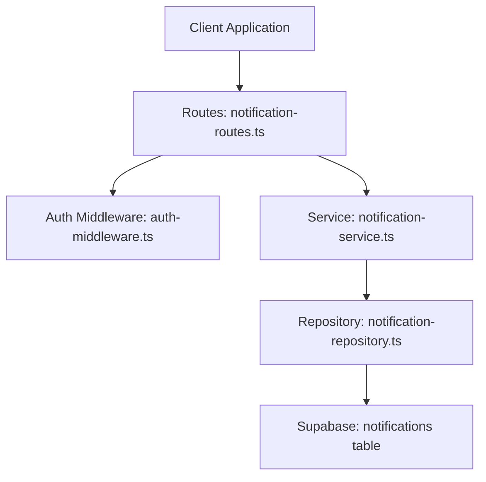

**Diagram sources**
- [notification-routes.ts](file://src/routes/notification-routes.ts#L1-L289)
- [auth-middleware.ts](file://src/middleware/auth-middleware.ts#L1-L101)
- [notification-service.ts](file://src/services/notification-service.ts#L1-L316)
- [notification-repository.ts](file://src/repositories/notification-repository.ts#L1-L118)
- [schema.sql](file://supabase/schema.sql#L122-L133)

**Section sources**
- [notification-routes.ts](file://src/routes/notification-routes.ts#L1-L289)
- [auth-middleware.ts](file://src/middleware/auth-middleware.ts#L1-L101)
- [swagger.ts](file://src/config/swagger.ts#L1-L233)
- [schema.sql](file://supabase/schema.sql#L122-L133)

## Core Components
- Routes: Define endpoints for listing notifications, marking a notification as read, marking all as read, and retrieving unread counts. All endpoints require JWT Bearer authentication.
- Service: Orchestrates business logic for creating, retrieving, and updating notifications, and exposes helper functions for specific notification types.
- Repository: Implements database operations using Supabase client, including paginated queries, unread counts, and bulk updates.
- Auth Middleware: Validates Authorization header format and verifies JWT tokens.
- Swagger: Defines the Notification schema, error schema, and security scheme for Bearer JWT.

Key responsibilities:
- Enforce authentication and user identity on protected endpoints.
- Apply pagination and ordering for notification lists.
- Enforce ownership checks when marking notifications as read.
- Provide unread counts and bulk read operations.

**Section sources**
- [notification-routes.ts](file://src/routes/notification-routes.ts#L1-L289)
- [notification-service.ts](file://src/services/notification-service.ts#L1-L316)
- [notification-repository.ts](file://src/repositories/notification-repository.ts#L1-L118)
- [auth-middleware.ts](file://src/middleware/auth-middleware.ts#L1-L101)
- [swagger.ts](file://src/config/swagger.ts#L1-L233)

## Architecture Overview
The notification API follows a layered architecture:
- Route handlers accept requests, enforce authentication, and delegate to the service.
- Services translate request options into repository calls and map entities to API models.
- Repositories encapsulate Supabase queries and handle pagination metadata.
- Swagger documents schemas and security for clients.

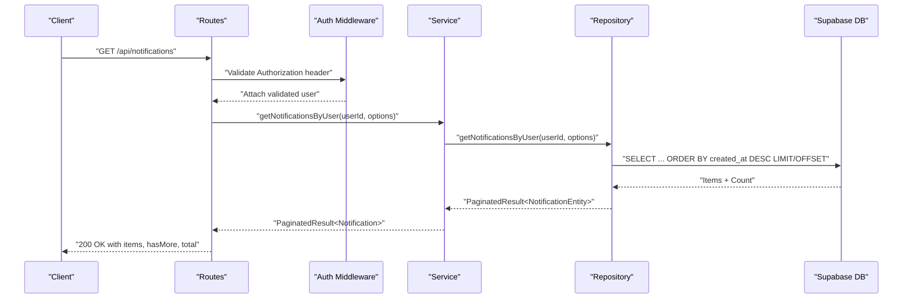

**Diagram sources**
- [notification-routes.ts](file://src/routes/notification-routes.ts#L83-L118)
- [notification-service.ts](file://src/services/notification-service.ts#L80-L94)
- [notification-repository.ts](file://src/repositories/notification-repository.ts#L41-L60)
- [swagger.ts](file://src/config/swagger.ts#L189-L214)

## Detailed Component Analysis

### Authentication and Security
- All notification endpoints require a Bearer token in the Authorization header.
- The auth middleware validates the header format and verifies the token, attaching user identity to the request.
- Unauthorized responses include standardized error structure with code and message.

Security requirements:
- Header: Authorization: Bearer <JWT>
- Scope: User-bound access token

**Section sources**
- [notification-routes.ts](file://src/routes/notification-routes.ts#L41-L82)
- [auth-middleware.ts](file://src/middleware/auth-middleware.ts#L25-L70)
- [swagger.ts](file://src/config/swagger.ts#L22-L28)

### Endpoints Reference

#### GET /api/notifications
- Purpose: Retrieve notifications for the authenticated user, sorted newest first.
- Authentication: Required (Bearer JWT).
- Query parameters:
  - maxItemCount (integer, min 1, max 100): Limit number of items returned.
  - continuationToken (string): Pagination token (used internally by repository).
- Response:
  - 200 OK: items (array of Notification), hasMore (boolean), total (optional number).
  - 401 Unauthorized: Missing or invalid token.

Notification schema (selected fields):
- id: string (UUID)
- userId: string (UUID)
- type: enum [proposal_received, proposal_accepted, proposal_rejected, milestone_submitted, milestone_approved, payment_released, dispute_created, dispute_resolved, rating_received, message]
- title: string
- message: string
- data: object (additional properties)
- isRead: boolean
- createdAt: string (ISO 8601)

Pagination:
- Uses Supabase range queries with ORDER BY created_at DESC.
- hasMore indicates whether more records exist beyond the current page.
- total may be included depending on count mode.

**Section sources**
- [notification-routes.ts](file://src/routes/notification-routes.ts#L41-L82)
- [notification-service.ts](file://src/services/notification-service.ts#L80-L94)
- [notification-repository.ts](file://src/repositories/notification-repository.ts#L41-L60)
- [swagger.ts](file://src/config/swagger.ts#L189-L214)

#### GET /api/notifications/unread-count
- Purpose: Get the count of unread notifications for the authenticated user.
- Authentication: Required (Bearer JWT).
- Response:
  - 200 OK: { count: number }
  - 401 Unauthorized: Missing or invalid token.

**Section sources**
- [notification-routes.ts](file://src/routes/notification-routes.ts#L121-L169)
- [notification-service.ts](file://src/services/notification-service.ts#L153-L159)
- [notification-repository.ts](file://src/repositories/notification-repository.ts#L104-L114)

#### PATCH /api/notifications/:id/read
- Purpose: Mark a specific notification as read.
- Authentication: Required (Bearer JWT).
- Path parameters:
  - id: string (UUID)
- Response:
  - 200 OK: Notification object.
  - 400 Bad Request: Invalid UUID format.
  - 401 Unauthorized: Missing or invalid token.
  - 403 Forbidden: Not authorized to update (notification belongs to another user).
  - 404 Not Found: Notification not found.

Ownership enforcement:
- The service fetches the notification and verifies that user_id matches the authenticated user before marking as read.

**Section sources**
- [notification-routes.ts](file://src/routes/notification-routes.ts#L172-L235)
- [notification-service.ts](file://src/services/notification-service.ts#L113-L143)
- [notification-repository.ts](file://src/repositories/notification-repository.ts#L37-L40)

#### PATCH /api/notifications/read-all
- Purpose: Mark all notifications for the authenticated user as read.
- Authentication: Required (Bearer JWT).
- Response:
  - 200 OK: { count: number } (number of notifications marked as read).
  - 401 Unauthorized: Missing or invalid token.

Bulk update:
- Repository performs an UPDATE with conditions to mark only unread notifications as read and returns the affected count.

**Section sources**
- [notification-routes.ts](file://src/routes/notification-routes.ts#L236-L286)
- [notification-service.ts](file://src/services/notification-service.ts#L145-L151)
- [notification-repository.ts](file://src/repositories/notification-repository.ts#L91-L102)

### Notification Types
Supported notification types:
- proposal_received
- proposal_accepted
- proposal_rejected
- milestone_submitted
- milestone_approved
- payment_released
- dispute_created
- dispute_resolved
- rating_received
- message

These types are defined in the repository and mapped to the API model. Additional helper functions exist in the service to create notifications for specific workflow events.

**Section sources**
- [notification-repository.ts](file://src/repositories/notification-repository.ts#L4-L14)
- [swagger.ts](file://src/config/swagger.ts#L189-L206)
- [notification-service.ts](file://src/services/notification-service.ts#L162-L316)

### Pagination Mechanism
- The repository uses Supabase range queries with ORDER BY created_at DESC.
- QueryOptions supports limit/offset semantics; the route handler forwards maxItemCount and continuationToken to the service, which maps them to repository options.
- Response includes hasMore and total to guide client-side pagination.

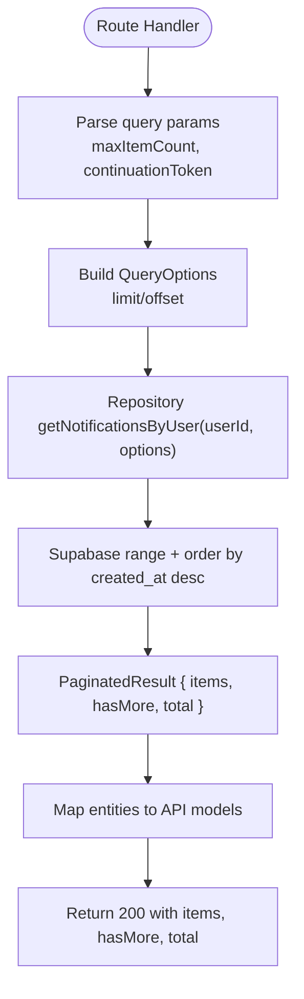

**Diagram sources**
- [notification-routes.ts](file://src/routes/notification-routes.ts#L83-L118)
- [notification-service.ts](file://src/services/notification-service.ts#L80-L94)
- [notification-repository.ts](file://src/repositories/notification-repository.ts#L41-L60)

**Section sources**
- [notification-routes.ts](file://src/routes/notification-routes.ts#L83-L118)
- [notification-service.ts](file://src/services/notification-service.ts#L80-L94)
- [notification-repository.ts](file://src/repositories/notification-repository.ts#L41-L60)

### Request/Response Schemas

#### Notification Object
- id: string (UUID)
- userId: string (UUID)
- type: enum of supported notification types
- title: string
- message: string
- data: object (arbitrary JSON)
- isRead: boolean
- createdAt: string (ISO 8601)

#### List Response
- items: array of Notification
- hasMore: boolean
- total: number (optional)

#### Unread Count Response
- count: number

#### Error Response
- error: { code: string, message: string, details?: array }
- timestamp: string (ISO 8601)
- requestId: string (UUID)

**Section sources**
- [swagger.ts](file://src/config/swagger.ts#L189-L214)
- [swagger.ts](file://src/config/swagger.ts#L30-L53)
- [API-DOCUMENTATION.md](file://docs/API-DOCUMENTATION.md#L591-L608)

### Client Implementation Examples

#### Fetching a User’s Notification List
- Endpoint: GET /api/notifications
- Headers: Authorization: Bearer <JWT>
- Query parameters:
  - maxItemCount: integer (1–100)
  - continuationToken: string (pagination token)
- Response handling:
  - Store items in a local list.
  - Use hasMore to determine if more pages exist.
  - Persist total for progress indicators.

#### Marking a Notification as Read
- Endpoint: PATCH /api/notifications/:id/read
- Headers: Authorization: Bearer <JWT>
- Path parameter: id (UUID)
- On success:
  - Update the corresponding item in the client cache to isRead=true.
  - Decrement the unread count displayed in the UI.

#### Retrieving the Unread Notification Count
- Endpoint: GET /api/notifications/unread-count
- Headers: Authorization: Bearer <JWT>
- On success:
  - Update the badge or indicator showing unread count.

#### Building a Real-Time Notification Center
- Polling strategy:
  - Initial load: GET /api/notifications with maxItemCount and continuationToken.
  - Periodic polling: Every 15–30 seconds for unread count and/or recent notifications.
  - Debounce: Coalesce rapid updates to reduce network overhead.
- Real-time enhancements:
  - WebSocket or Server-Sent Events (if available) to push updates.
  - Merge incoming events with cached items and deduplicate by id.
- UX patterns:
  - Badge for unread count.
  - Timestamps and grouped by date.
  - Mark as read on click or after viewing.

[No sources needed since this section provides general guidance]

## Dependency Analysis
The notification API stack exhibits clear separation of concerns with low coupling between layers.

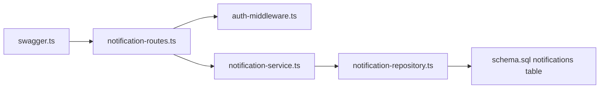

**Diagram sources**
- [notification-routes.ts](file://src/routes/notification-routes.ts#L1-L289)
- [auth-middleware.ts](file://src/middleware/auth-middleware.ts#L1-L101)
- [notification-service.ts](file://src/services/notification-service.ts#L1-L316)
- [notification-repository.ts](file://src/repositories/notification-repository.ts#L1-L118)
- [schema.sql](file://supabase/schema.sql#L122-L133)
- [swagger.ts](file://src/config/swagger.ts#L1-L233)

**Section sources**
- [notification-routes.ts](file://src/routes/notification-routes.ts#L1-L289)
- [notification-service.ts](file://src/services/notification-service.ts#L1-L316)
- [notification-repository.ts](file://src/repositories/notification-repository.ts#L1-L118)
- [schema.sql](file://supabase/schema.sql#L122-L133)

## Performance Considerations
- Pagination:
  - Use maxItemCount to cap page sizes (1–100) and continuationToken for subsequent pages.
  - Sort by created_at DESC to leverage database indexes.
- Indexes:
  - notifications(user_id) and notifications(is_read) improve filtering and counting performance.
- Bulk operations:
  - read-all endpoint updates only unread notifications, minimizing unnecessary writes.
- Polling cadence:
  - Avoid excessive polling intervals; 15–30 seconds is often sufficient for near-real-time updates.
  - Cache results locally and invalidate only changed items.
- Network efficiency:
  - Prefer incremental updates (unread count + recent items) over full reloads.
  - Debounce UI updates to prevent flickering.

**Section sources**
- [schema.sql](file://supabase/schema.sql#L202-L224)
- [notification-repository.ts](file://src/repositories/notification-repository.ts#L41-L60)
- [notification-routes.ts](file://src/routes/notification-routes.ts#L83-L118)

## Troubleshooting Guide
Common issues and resolutions:
- 401 Unauthorized:
  - Ensure Authorization header is present and formatted as Bearer <JWT>.
  - Verify token validity and expiration.
- 403 Forbidden (mark as read):
  - Occurs when attempting to update a notification that does not belong to the authenticated user.
  - Confirm the notification id belongs to the current user.
- 404 Not Found (mark as read):
  - The notification id may not exist or was deleted.
- 400 Bad Request (invalid UUID):
  - Validate the id parameter format as a UUID.
- Excessive polling:
  - Reduce polling interval or switch to event-driven updates.
- Pagination confusion:
  - Use hasMore and total to manage client-side pagination state.

**Section sources**
- [auth-middleware.ts](file://src/middleware/auth-middleware.ts#L25-L70)
- [notification-service.ts](file://src/services/notification-service.ts#L113-L143)
- [notification-routes.ts](file://src/routes/notification-routes.ts#L172-L235)

## Conclusion
The notification API provides a robust, authenticated set of endpoints for retrieving, marking as read, and counting unread notifications. It supports efficient pagination and adheres to a clean layered architecture. By following the documented schemas, authentication requirements, and performance recommendations, clients can build reliable notification centers with real-time capabilities.

[No sources needed since this section summarizes without analyzing specific files]

## Appendices

### Appendix A: Notification Type Details
- proposal_received: Triggered when a freelancer submits a proposal for an employer’s project.
- proposal_accepted: Triggered when an employer accepts a freelancer’s proposal.
- proposal_rejected: Triggered when an employer rejects a freelancer’s proposal.
- milestone_submitted: Triggered when a freelancer submits a milestone for review.
- milestone_approved: Triggered when an employer approves a milestone.
- payment_released: Triggered when payment for a milestone is released.
- dispute_created: Triggered when a dispute is opened for a milestone.
- dispute_resolved: Triggered when a dispute is resolved.
- rating_received: Triggered when a user receives a rating.
- message: General message notifications.

**Section sources**
- [notification-service.ts](file://src/services/notification-service.ts#L162-L316)
- [notification-repository.ts](file://src/repositories/notification-repository.ts#L4-L14)

### Appendix B: Example Requests and Responses
- Fetch notifications:
  - GET /api/notifications?maxItemCount=20
  - Response: { items: [...], hasMore: true, total: 120 }
- Mark as read:
  - PATCH /api/notifications/:id/read
  - Response: { id, userId, type, title, message, data, isRead: true, createdAt }
- Unread count:
  - GET /api/notifications/unread-count
  - Response: { count: 5 }

**Section sources**
- [notification-routes.ts](file://src/routes/notification-routes.ts#L41-L82)
- [notification-routes.ts](file://src/routes/notification-routes.ts#L121-L169)
- [notification-routes.ts](file://src/routes/notification-routes.ts#L172-L235)
- [swagger.ts](file://src/config/swagger.ts#L189-L214)

---

# Get Unread Notification Count

<cite>
**Referenced Files in This Document**
- [notification-routes.ts](file://src/routes/notification-routes.ts)
- [notification-service.ts](file://src/services/notification-service.ts)
- [notification-repository.ts](file://src/repositories/notification-repository.ts)
- [auth-middleware.ts](file://src/middleware/auth-middleware.ts)
- [supabase.ts](file://src/config/supabase.ts)
- [schema.sql](file://supabase/schema.sql)
- [API-DOCUMENTATION.md](file://docs/API-DOCUMENTATION.md)
</cite>

## Table of Contents
1. [Introduction](#introduction)
2. [Project Structure](#project-structure)
3. [Core Components](#core-components)
4. [Architecture Overview](#architecture-overview)
5. [Detailed Component Analysis](#detailed-component-analysis)
6. [Dependency Analysis](#dependency-analysis)
7. [Performance Considerations](#performance-considerations)
8. [Troubleshooting Guide](#troubleshooting-guide)
9. [Conclusion](#conclusion)

## Introduction
This document provides API documentation for the GET /api/notifications/unread-count endpoint. It returns the number of unread notifications for the authenticated user. The endpoint is lightweight, requiring no request parameters, and responds with a simple JSON payload containing a count field. This design enables efficient real-time badge updates in the UI without transferring full notification payloads.

## Project Structure
The endpoint is implemented using a layered architecture:
- Route handler validates authentication and delegates to the service layer.
- Service layer orchestrates repository operations.
- Repository executes a database query optimized for counting unread notifications.
- Supabase client and table constants define the data access layer.

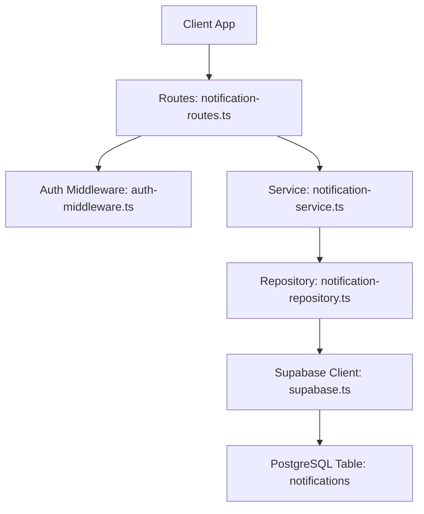

**Diagram sources**
- [notification-routes.ts](file://src/routes/notification-routes.ts#L121-L169)
- [auth-middleware.ts](file://src/middleware/auth-middleware.ts#L25-L70)
- [notification-service.ts](file://src/services/notification-service.ts#L153-L159)
- [notification-repository.ts](file://src/repositories/notification-repository.ts#L104-L114)
- [supabase.ts](file://src/config/supabase.ts#L1-L22)
- [schema.sql](file://supabase/schema.sql#L122-L133)

**Section sources**
- [notification-routes.ts](file://src/routes/notification-routes.ts#L121-L169)
- [API-DOCUMENTATION.md](file://docs/API-DOCUMENTATION.md#L591-L609)

## Core Components
- Endpoint: GET /api/notifications/unread-count
- Authentication: Bearer token required via Authorization header
- Request: No query parameters
- Response: JSON object with a count field representing unread notifications
- Example response: {"count": 3}

Implementation highlights:
- Lightweight response avoids transferring full notification payloads
- Optimized database query uses COUNT aggregation with user ID and is_read filters
- Real-time badge updates are enabled by frequent polling or push alternatives

**Section sources**
- [API-DOCUMENTATION.md](file://docs/API-DOCUMENTATION.md#L591-L609)
- [notification-routes.ts](file://src/routes/notification-routes.ts#L121-L169)
- [notification-service.ts](file://src/services/notification-service.ts#L153-L159)
- [notification-repository.ts](file://src/repositories/notification-repository.ts#L104-L114)

## Architecture Overview
The endpoint follows a clean separation of concerns:
- Route layer: Validates authentication and constructs the response
- Service layer: Provides business logic and error handling wrapper
- Repository layer: Performs database operations with Supabase client
- Data model: Uses the notifications table with indexes for performance

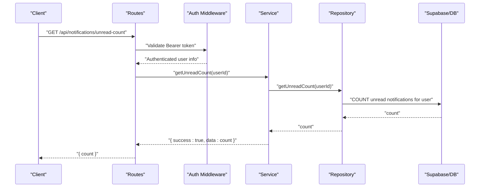

**Diagram sources**
- [notification-routes.ts](file://src/routes/notification-routes.ts#L144-L169)
- [auth-middleware.ts](file://src/middleware/auth-middleware.ts#L25-L70)
- [notification-service.ts](file://src/services/notification-service.ts#L153-L159)
- [notification-repository.ts](file://src/repositories/notification-repository.ts#L104-L114)

## Detailed Component Analysis

### Endpoint Definition and Behavior
- HTTP Method: GET
- Path: /api/notifications/unread-count
- Authentication: Required (Bearer token)
- Request body: Not applicable
- Query parameters: None
- Response: JSON with a single count field

Behavior:
- Returns the number of unread notifications for the authenticated user
- Uses user ID from the validated token to filter records
- Responds with a 200 status and a simple JSON object

**Section sources**
- [API-DOCUMENTATION.md](file://docs/API-DOCUMENTATION.md#L591-L609)
- [notification-routes.ts](file://src/routes/notification-routes.ts#L121-L169)

### Authentication Flow
The route enforces authentication using a Bearer token. The middleware validates the Authorization header format and verifies the token, attaching user information to the request object.

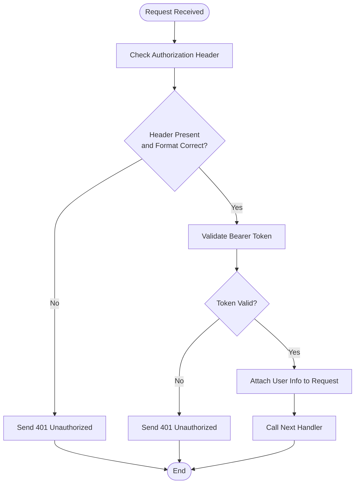

**Diagram sources**
- [auth-middleware.ts](file://src/middleware/auth-middleware.ts#L25-L70)

**Section sources**
- [auth-middleware.ts](file://src/middleware/auth-middleware.ts#L25-L70)
- [notification-routes.ts](file://src/routes/notification-routes.ts#L144-L169)

### Service Layer Implementation
The service layer wraps repository calls and returns a standardized result structure. For unread count, it simply delegates to the repository.

Responsibilities:
- Standardized success/error result pattern
- Delegation to repository for database operations
- Returning primitive counts for lightweight responses

**Section sources**
- [notification-service.ts](file://src/services/notification-service.ts#L153-L159)

### Repository and Database Query
The repository performs an optimized COUNT query:
- Filters by user_id
- Filters by is_read = false
- Uses head: true and count: 'exact' to return only the count
- Returns a numeric count

Database schema and indexes:
- Table: notifications
- Columns: id, user_id, type, title, message, data, is_read, created_at, updated_at
- Indexes: user_id, is_read

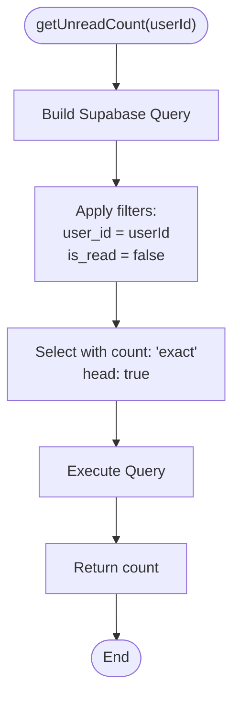

**Diagram sources**
- [notification-repository.ts](file://src/repositories/notification-repository.ts#L104-L114)
- [schema.sql](file://supabase/schema.sql#L122-L133)
- [supabase.ts](file://src/config/supabase.ts#L1-L22)

**Section sources**
- [notification-repository.ts](file://src/repositories/notification-repository.ts#L104-L114)
- [schema.sql](file://supabase/schema.sql#L122-L133)

### Real-Time Badge Updates
Why this endpoint is ideal for badges:
- Minimal payload: only a count integer
- Fast network transfer
- Low CPU/memory overhead on client
- Efficient server-side COUNT aggregation

How to integrate:
- Poll the endpoint at short intervals to keep the badge fresh
- Update the UI immediately upon receiving a new count
- Reset or hide the badge when count reaches zero

**Section sources**
- [API-DOCUMENTATION.md](file://docs/API-DOCUMENTATION.md#L591-L609)
- [notification-routes.ts](file://src/routes/notification-routes.ts#L121-L169)

## Dependency Analysis
The endpoint’s dependencies form a straightforward chain from route to database.

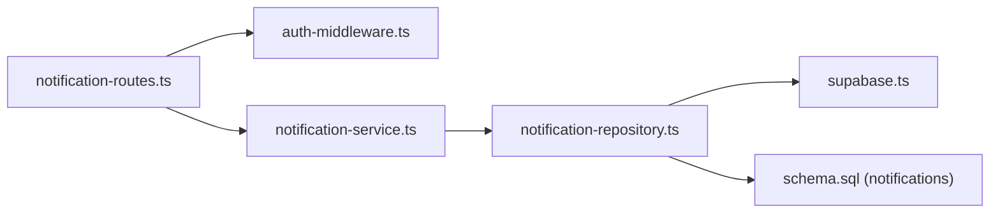

**Diagram sources**
- [notification-routes.ts](file://src/routes/notification-routes.ts#L121-L169)
- [auth-middleware.ts](file://src/middleware/auth-middleware.ts#L25-L70)
- [notification-service.ts](file://src/services/notification-service.ts#L153-L159)
- [notification-repository.ts](file://src/repositories/notification-repository.ts#L104-L114)
- [supabase.ts](file://src/config/supabase.ts#L1-L22)
- [schema.sql](file://supabase/schema.sql#L122-L133)

**Section sources**
- [notification-routes.ts](file://src/routes/notification-routes.ts#L121-L169)
- [notification-service.ts](file://src/services/notification-service.ts#L153-L159)
- [notification-repository.ts](file://src/repositories/notification-repository.ts#L104-L114)
- [supabase.ts](file://src/config/supabase.ts#L1-L22)
- [schema.sql](file://supabase/schema.sql#L122-L133)

## Performance Considerations
- Why COUNT is efficient:
  - Head-only query with count: 'exact'
  - Minimal data transfer compared to fetching rows
  - Database can leverage indexes on user_id and is_read
- Indexes:
  - notifications(user_id) and notifications(is_read) are created in schema
- Comparison to client-side counting:
  - Fetching all unread notifications and counting on the client increases payload size and processing time
  - Server-side COUNT reduces bandwidth and CPU usage
- Caching strategies:
  - Short-lived cache (e.g., Redis or in-memory) keyed by user_id
  - TTL aligned with polling interval to balance freshness and load
  - Invalidate cache on mark-as-read operations
- Rate limiting:
  - Apply per-user rate limits to prevent abuse
  - Consider exponential backoff for clients that poll aggressively

[No sources needed since this section provides general guidance]

## Troubleshooting Guide
Common issues and resolutions:
- 401 Unauthorized:
  - Missing or malformed Authorization header
  - Invalid or expired Bearer token
  - Resolution: Ensure Authorization: Bearer <token> is present and valid
- 400 Bad Request:
  - Service-level error from getUnreadCount
  - Resolution: Retry after a short delay; check server logs
- Database errors:
  - Supabase client errors during COUNT query
  - Resolution: Verify database connectivity and indexes; check Supabase logs

Operational checks:
- Confirm auth middleware attaches user info to the request
- Verify repository query executes with correct filters
- Ensure notifications table exists and indexes are present

**Section sources**
- [auth-middleware.ts](file://src/middleware/auth-middleware.ts#L25-L70)
- [notification-routes.ts](file://src/routes/notification-routes.ts#L144-L169)
- [notification-repository.ts](file://src/repositories/notification-repository.ts#L104-L114)
- [schema.sql](file://supabase/schema.sql#L122-L133)

## Conclusion
The GET /api/notifications/unread-count endpoint delivers a lightweight, efficient mechanism for real-time badge updates. By leveraging a server-side COUNT query filtered by user ID and unread status, it minimizes payload size and database load. Combined with appropriate polling intervals or push technologies, it provides responsive UI feedback while maintaining scalability.

---

# Mark Notification as Read

<cite>
**Referenced Files in This Document**
- [notification-routes.ts](file://src/routes/notification-routes.ts)
- [notification-service.ts](file://src/services/notification-service.ts)
- [notification-repository.ts](file://src/repositories/notification-repository.ts)
- [auth-middleware.ts](file://src/middleware/auth-middleware.ts)
- [validation-middleware.ts](file://src/middleware/validation-middleware.ts)
- [entity-mapper.ts](file://src/utils/entity-mapper.ts)
- [API-DOCUMENTATION.md](file://docs/API-DOCUMENTATION.md)
</cite>

## Table of Contents
1. [Introduction](#introduction)
2. [Project Structure](#project-structure)
3. [Core Components](#core-components)
4. [Architecture Overview](#architecture-overview)
5. [Detailed Component Analysis](#detailed-component-analysis)
6. [Dependency Analysis](#dependency-analysis)
7. [Performance Considerations](#performance-considerations)
8. [Troubleshooting Guide](#troubleshooting-guide)
9. [Conclusion](#conclusion)
10. [Appendices](#appendices)

## Introduction
This document provides API documentation for the PATCH /api/notifications/:id/read endpoint that marks a specific notification as read. It covers the HTTP method, path parameter, request body, success and error responses, and the backend flow from route to service to repository and database. It also explains JWT-based ownership verification via auth-middleware, idempotency considerations, race conditions in high-frequency scenarios, and best practices for client-side state synchronization.

## Project Structure
The notification read endpoint is implemented as part of the notifications module:
- Route handler: defines the endpoint, applies middleware, and returns responses
- Service layer: orchestrates business logic and ownership checks
- Repository layer: performs database updates
- Middleware: JWT validation and UUID parameter validation
- Entity mapper: converts database rows to API models

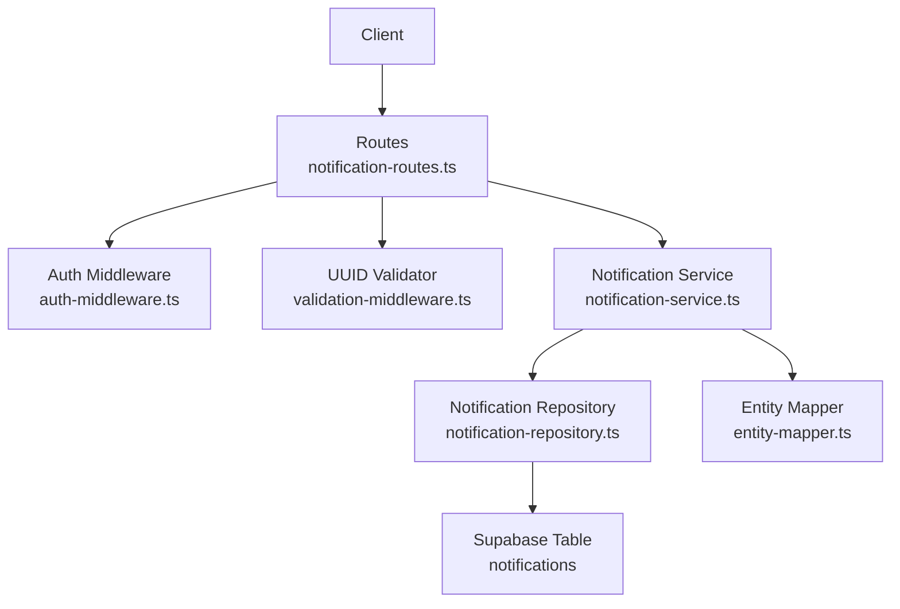

**Diagram sources**
- [notification-routes.ts](file://src/routes/notification-routes.ts#L172-L234)
- [auth-middleware.ts](file://src/middleware/auth-middleware.ts#L1-L70)
- [validation-middleware.ts](file://src/middleware/validation-middleware.ts#L778-L814)
- [notification-service.ts](file://src/services/notification-service.ts#L113-L143)
- [notification-repository.ts](file://src/repositories/notification-repository.ts#L87-L90)
- [entity-mapper.ts](file://src/utils/entity-mapper.ts#L373-L412)

**Section sources**
- [notification-routes.ts](file://src/routes/notification-routes.ts#L172-L234)
- [API-DOCUMENTATION.md](file://docs/API-DOCUMENTATION.md#L591-L609)

## Core Components
- Endpoint: PATCH /api/notifications/:id/read
- Path parameter: id (UUID)
- Request body: empty
- Authentication: Bearer token required
- Ownership verification: JWT subject must match notification’s user_id
- Success response: 200 with the updated notification model
- Error responses:
  - 400: Invalid UUID format
  - 401: Unauthorized (missing/invalid/expired token)
  - 403: Forbidden (not authorized to update)
  - 404: Not found (notification does not exist)
  - 500: Internal server error (unexpected failure)

**Section sources**
- [notification-routes.ts](file://src/routes/notification-routes.ts#L172-L234)
- [auth-middleware.ts](file://src/middleware/auth-middleware.ts#L1-L70)
- [validation-middleware.ts](file://src/middleware/validation-middleware.ts#L778-L814)
- [notification-service.ts](file://src/services/notification-service.ts#L113-L143)
- [notification-repository.ts](file://src/repositories/notification-repository.ts#L87-L90)
- [API-DOCUMENTATION.md](file://docs/API-DOCUMENTATION.md#L591-L609)

## Architecture Overview
The PATCH /api/notifications/:id/read flow:
1. Route handler validates JWT and UUID
2. Service retrieves notification and verifies ownership
3. Repository updates is_read flag
4. Mapper transforms to API model
5. Route handler returns 200 with updated notification

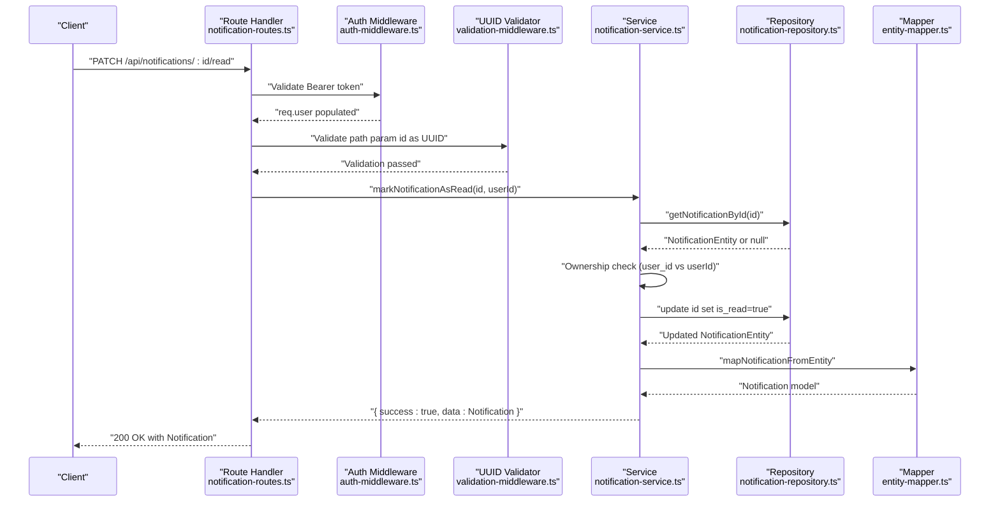

**Diagram sources**
- [notification-routes.ts](file://src/routes/notification-routes.ts#L204-L233)
- [auth-middleware.ts](file://src/middleware/auth-middleware.ts#L25-L70)
- [validation-middleware.ts](file://src/middleware/validation-middleware.ts#L782-L814)
- [notification-service.ts](file://src/services/notification-service.ts#L113-L143)
- [notification-repository.ts](file://src/repositories/notification-repository.ts#L37-L39)
- [entity-mapper.ts](file://src/utils/entity-mapper.ts#L373-L412)

## Detailed Component Analysis

### Endpoint Definition and Behavior
- Method: PATCH
- Path: /api/notifications/:id/read
- Path parameter: id (UUID)
- Request body: empty
- Authentication: Bearer token required
- Ownership verification: The authenticated user’s ID must match the notification’s user_id
- Success: 200 with the updated notification model
- Errors:
  - 400: Invalid UUID format
  - 401: Unauthorized (missing/invalid/expired token)
  - 403: Forbidden (not authorized to update)
  - 404: Not found (notification does not exist)
  - 500: Internal server error (unexpected failure)

**Section sources**
- [notification-routes.ts](file://src/routes/notification-routes.ts#L172-L234)
- [API-DOCUMENTATION.md](file://docs/API-DOCUMENTATION.md#L591-L609)

### Route Handler
- Applies authMiddleware to enforce JWT presence and validity
- Applies validateUUID to ensure id is a valid UUID
- Calls markNotificationAsRead(service) with notificationId and authenticated userId
- Maps service error codes to HTTP status codes (404 for NOT_FOUND, 403 for UNAUTHORIZED)
- Returns 200 with the updated notification model on success

**Section sources**
- [notification-routes.ts](file://src/routes/notification-routes.ts#L204-L233)

### Auth Middleware
- Extracts Authorization header and ensures format "Bearer <token>"
- Validates token via service and populates req.user with decoded claims
- Returns 401 for missing header, invalid format, expired, or invalid token

**Section sources**
- [auth-middleware.ts](file://src/middleware/auth-middleware.ts#L1-L70)

### UUID Validation Middleware
- Validates that path parameter id matches UUID v4 format
- Returns 400 with VALIDATION_ERROR when invalid

**Section sources**
- [validation-middleware.ts](file://src/middleware/validation-middleware.ts#L778-L814)

### Service Layer
- Retrieves notification by id
- Checks ownership: notification.user_id must equal authenticated userId
- Updates is_read to true via repository
- Maps entity to API model and returns success
- Returns error codes: NOT_FOUND, UNAUTHORIZED, UPDATE_FAILED

**Section sources**
- [notification-service.ts](file://src/services/notification-service.ts#L113-L143)

### Repository Layer
- getNotificationById(id) returns entity or null
- markAsRead(id) updates is_read to true and returns updated entity or null
- Throws on database errors

**Section sources**
- [notification-repository.ts](file://src/repositories/notification-repository.ts#L37-L39)
- [notification-repository.ts](file://src/repositories/notification-repository.ts#L87-L90)

### Entity Mapper
- mapNotificationFromEntity converts NotificationEntity to Notification model (id, userId, type, title, message, data, isRead, createdAt)

**Section sources**
- [entity-mapper.ts](file://src/utils/entity-mapper.ts#L373-L412)

### Practical Example: Proposal Acceptance Notification
Scenario: After viewing a proposal acceptance notification, the client calls PATCH /api/notifications/:id/read to mark it as read.

Steps:
1. Client obtains a valid Bearer token
2. Client sends PATCH with empty body to /api/notifications/{proposalAcceptedId}/read
3. Server validates token and UUID
4. Service loads the notification and verifies ownership
5. Repository sets is_read=true
6. Mapper returns the updated notification model
7. Client receives 200 with the updated notification

Best practices:
- Store the returned notification in local state to reflect the change immediately
- Update unread counters and lists accordingly
- Handle 404 gracefully (e.g., notification already read or deleted)

**Section sources**
- [notification-routes.ts](file://src/routes/notification-routes.ts#L204-L233)
- [notification-service.ts](file://src/services/notification-service.ts#L113-L143)
- [notification-repository.ts](file://src/repositories/notification-repository.ts#L87-L90)
- [entity-mapper.ts](file://src/utils/entity-mapper.ts#L373-L412)

## Dependency Analysis
Key dependencies and interactions:
- Routes depend on auth-middleware and validation-middleware
- Routes call notification-service
- Service depends on notification-repository and entity-mapper
- Repository interacts with Supabase notifications table

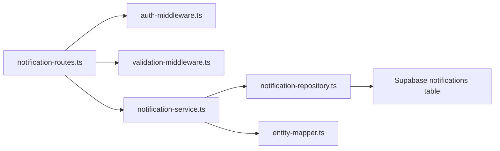

**Diagram sources**
- [notification-routes.ts](file://src/routes/notification-routes.ts#L172-L234)
- [auth-middleware.ts](file://src/middleware/auth-middleware.ts#L1-L70)
- [validation-middleware.ts](file://src/middleware/validation-middleware.ts#L778-L814)
- [notification-service.ts](file://src/services/notification-service.ts#L113-L143)
- [notification-repository.ts](file://src/repositories/notification-repository.ts#L1-L118)
- [entity-mapper.ts](file://src/utils/entity-mapper.ts#L373-L412)

**Section sources**
- [notification-routes.ts](file://src/routes/notification-routes.ts#L172-L234)
- [notification-service.ts](file://src/services/notification-service.ts#L113-L143)
- [notification-repository.ts](file://src/repositories/notification-repository.ts#L1-L118)

## Performance Considerations
- Idempotency: The endpoint is idempotent. Repeatedly marking the same notification as read will return the same updated model without causing duplicates or extra writes.
- Race conditions: In high-frequency scenarios, multiple clients may attempt to mark the same notification as read concurrently. The repository update is a single-row write; the service enforces ownership before updating. While the database update itself is atomic, concurrent reads may briefly show is_read=false until the write completes. This is acceptable for UI state updates.
- Best practices:
  - Client-side optimistic updates: Immediately mark the notification as read locally upon receiving a successful response
  - Debounce rapid clicks to avoid redundant requests
  - Use a single source of truth for unread counts and lists

[No sources needed since this section provides general guidance]

## Troubleshooting Guide
Common issues and resolutions:
- 400 Invalid UUID format: Ensure the path parameter id is a valid UUID v4
- 401 Unauthorized: Verify the Authorization header is present and formatted as "Bearer <token>". Confirm the token is valid and not expired
- 403 Forbidden: The notification exists but does not belong to the authenticated user
- 404 Not found: The notification ID does not exist or has been deleted
- 500 Internal server error: Unexpected failure during database update; retry after a short delay

**Section sources**
- [notification-routes.ts](file://src/routes/notification-routes.ts#L204-L233)
- [auth-middleware.ts](file://src/middleware/auth-middleware.ts#L1-L70)
- [validation-middleware.ts](file://src/middleware/validation-middleware.ts#L778-L814)
- [notification-service.ts](file://src/services/notification-service.ts#L113-L143)
- [notification-repository.ts](file://src/repositories/notification-repository.ts#L87-L90)

## Conclusion
The PATCH /api/notifications/:id/read endpoint provides a straightforward mechanism to mark a notification as read. It enforces JWT-based ownership verification, validates the UUID path parameter, and returns the updated notification model on success. The flow is idempotent and designed to handle typical client-side state synchronization patterns. For robust applications, apply optimistic UI updates and handle error responses gracefully.

[No sources needed since this section summarizes without analyzing specific files]

## Appendices

### API Definition Summary
- Method: PATCH
- Path: /api/notifications/:id/read
- Path parameters:
  - id: string (UUID)
- Request body: empty
- Authentication: Bearer token
- Success: 200 with Notification model
- Errors: 400 (invalid UUID), 401 (unauthorized), 403 (forbidden), 404 (not found), 500 (internal error)

**Section sources**
- [notification-routes.ts](file://src/routes/notification-routes.ts#L172-L234)
- [API-DOCUMENTATION.md](file://docs/API-DOCUMENTATION.md#L591-L609)

### Backend Flow Diagram (Code-Level)
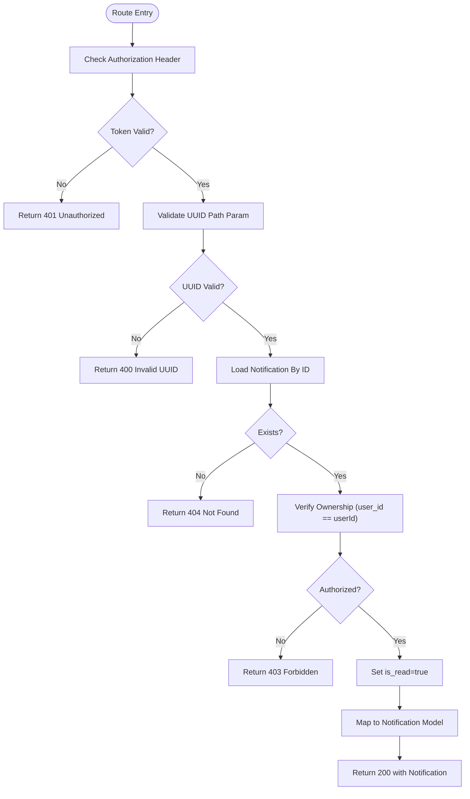

**Diagram sources**
- [notification-routes.ts](file://src/routes/notification-routes.ts#L204-L233)
- [auth-middleware.ts](file://src/middleware/auth-middleware.ts#L25-L70)
- [validation-middleware.ts](file://src/middleware/validation-middleware.ts#L782-L814)
- [notification-service.ts](file://src/services/notification-service.ts#L113-L143)
- [notification-repository.ts](file://src/repositories/notification-repository.ts#L87-L90)
- [entity-mapper.ts](file://src/utils/entity-mapper.ts#L373-L412)

---

# Retrieve Notifications

<cite>
**Referenced Files in This Document**
- [notification-routes.ts](file://src/routes/notification-routes.ts)
- [notification-service.ts](file://src/services/notification-service.ts)
- [notification-repository.ts](file://src/repositories/notification-repository.ts)
- [base-repository.ts](file://src/repositories/base-repository.ts)
- [entity-mapper.ts](file://src/utils/entity-mapper.ts)
- [auth-middleware.ts](file://src/middleware/auth-middleware.ts)
- [supabase.ts](file://src/config/supabase.ts)
- [API-DOCUMENTATION.md](file://docs/API-DOCUMENTATION.md)
</cite>

## Table of Contents
1. [Introduction](#introduction)
2. [Project Structure](#project-structure)
3. [Core Components](#core-components)
4. [Architecture Overview](#architecture-overview)
5. [Detailed Component Analysis](#detailed-component-analysis)
6. [Dependency Analysis](#dependency-analysis)
7. [Performance Considerations](#performance-considerations)
8. [Troubleshooting Guide](#troubleshooting-guide)
9. [Conclusion](#conclusion)
10. [Appendices](#appendices)

## Introduction
This document provides API documentation for retrieving a user’s notifications via the GET /api/notifications endpoint. It covers the HTTP method, query parameters for pagination, response format, and the integration between the route handler, service layer, and database layer. It also explains how continuation tokens enable efficient cursor-based pagination for large datasets, and offers guidance for client-side implementation and error handling.

## Project Structure
The notifications feature is implemented across several layers:
- Route handler: defines the endpoint, validates JWT, parses query parameters, and returns paginated results.
- Service layer: orchestrates business logic and delegates database operations.
- Repository layer: encapsulates database queries using Supabase client.
- Entity mapping: converts database entities to API models.
- Middleware: enforces JWT authentication.
- Configuration: exposes table names and Supabase client.

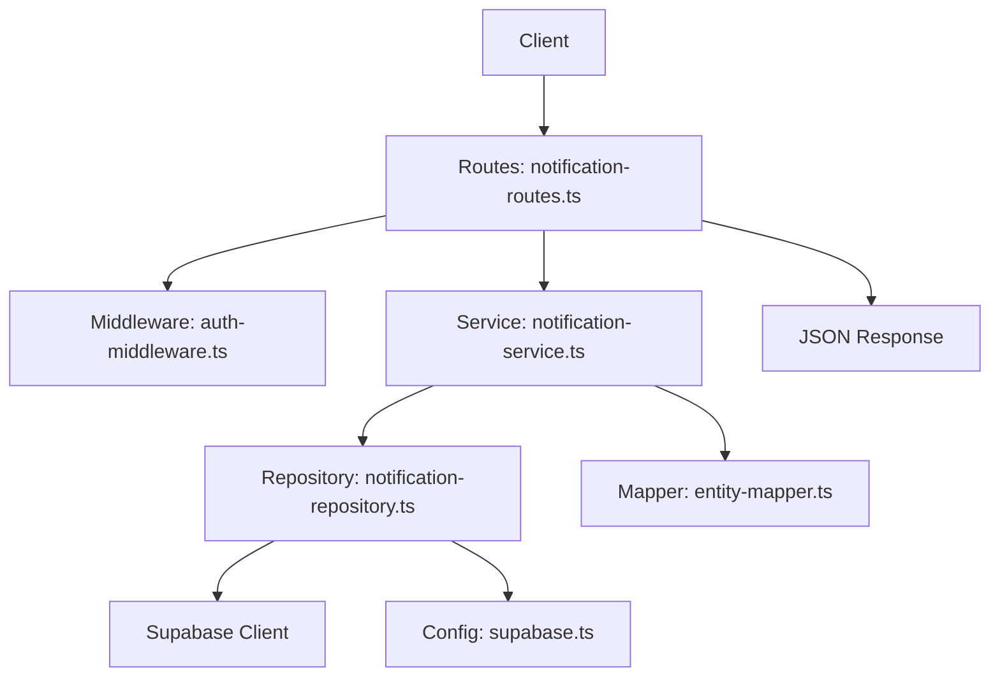

**Diagram sources**
- [notification-routes.ts](file://src/routes/notification-routes.ts#L83-L118)
- [auth-middleware.ts](file://src/middleware/auth-middleware.ts#L25-L70)
- [notification-service.ts](file://src/services/notification-service.ts#L80-L94)
- [notification-repository.ts](file://src/repositories/notification-repository.ts#L41-L60)
- [supabase.ts](file://src/config/supabase.ts#L1-L45)
- [entity-mapper.ts](file://src/utils/entity-mapper.ts#L373-L409)

**Section sources**
- [notification-routes.ts](file://src/routes/notification-routes.ts#L83-L118)
- [notification-service.ts](file://src/services/notification-service.ts#L80-L94)
- [notification-repository.ts](file://src/repositories/notification-repository.ts#L41-L60)
- [auth-middleware.ts](file://src/middleware/auth-middleware.ts#L25-L70)
- [supabase.ts](file://src/config/supabase.ts#L1-L45)
- [entity-mapper.ts](file://src/utils/entity-mapper.ts#L373-L409)

## Core Components
- Endpoint: GET /api/notifications
- Authentication: Bearer token required via Authorization header
- Query parameters:
  - maxItemCount (integer, min 1, max 100): controls the number of items returned
  - continuationToken (string): cursor token for pagination
- Response format:
  - items: array of notifications
  - hasMore: boolean indicating if more pages exist
  - total: optional total count when supported by the underlying query

Each notification includes:
- id: string
- userId: string
- type: enum of supported notification types
- title: string
- message: string
- data: object with relevant metadata
- isRead: boolean
- createdAt: ISO timestamp

Supported notification types include proposal_received, proposal_accepted, proposal_rejected, milestone_submitted, milestone_approved, payment_released, dispute_created, dispute_resolved, rating_received, and message.

**Section sources**
- [notification-routes.ts](file://src/routes/notification-routes.ts#L41-L83)
- [notification-service.ts](file://src/services/notification-service.ts#L80-L94)
- [notification-repository.ts](file://src/repositories/notification-repository.ts#L41-L60)
- [entity-mapper.ts](file://src/utils/entity-mapper.ts#L373-L409)
- [API-DOCUMENTATION.md](file://docs/API-DOCUMENTATION.md#L591-L609)

## Architecture Overview
The GET /api/notifications flow integrates the route handler, authentication middleware, service, repository, and Supabase client.

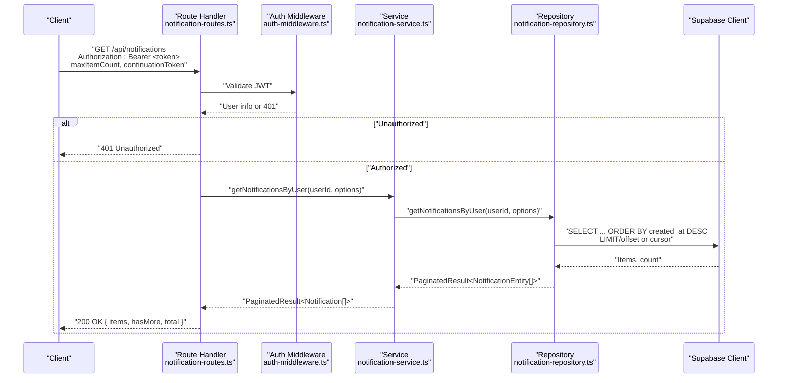

**Diagram sources**
- [notification-routes.ts](file://src/routes/notification-routes.ts#L83-L118)
- [auth-middleware.ts](file://src/middleware/auth-middleware.ts#L25-L70)
- [notification-service.ts](file://src/services/notification-service.ts#L80-L94)
- [notification-repository.ts](file://src/repositories/notification-repository.ts#L41-L60)

## Detailed Component Analysis

### Route Handler: GET /api/notifications
- Validates JWT via auth middleware and extracts user identity.
- Parses query parameters maxItemCount and continuationToken.
- Calls service function getNotificationsByUser with userId and options.
- Returns JSON response with items, hasMore, and total.

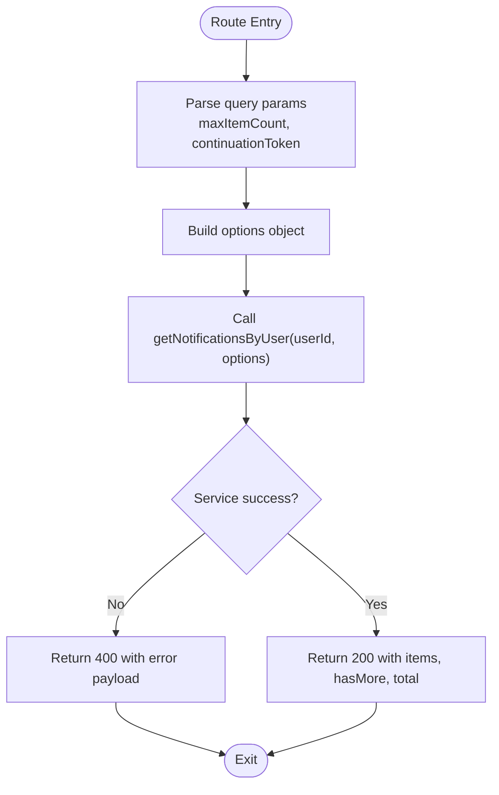

**Diagram sources**
- [notification-routes.ts](file://src/routes/notification-routes.ts#L83-L118)
- [notification-service.ts](file://src/services/notification-service.ts#L80-L94)

**Section sources**
- [notification-routes.ts](file://src/routes/notification-routes.ts#L83-L118)

### Service Layer: NotificationService
- getNotificationsByUser(userId, options):
  - Delegates to repository getNotificationsByUser.
  - Maps NotificationEntity[] to Notification[] using entity-mapper.
  - Wraps result in PaginatedResult with hasMore and total.

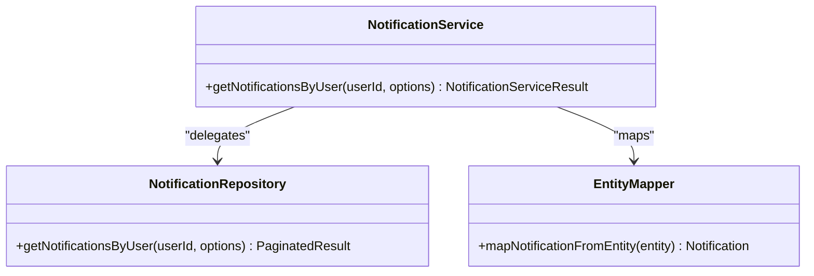

**Diagram sources**
- [notification-service.ts](file://src/services/notification-service.ts#L80-L94)
- [notification-repository.ts](file://src/repositories/notification-repository.ts#L41-L60)
- [entity-mapper.ts](file://src/utils/entity-mapper.ts#L373-L409)

**Section sources**
- [notification-service.ts](file://src/services/notification-service.ts#L80-L94)

### Repository Layer: NotificationRepository
- getNotificationsByUser(userId, options):
  - Uses Supabase client to select notifications for the given user.
  - Orders by created_at descending.
  - Applies LIMIT and OFFSET derived from options.
  - Computes hasMore and total count.

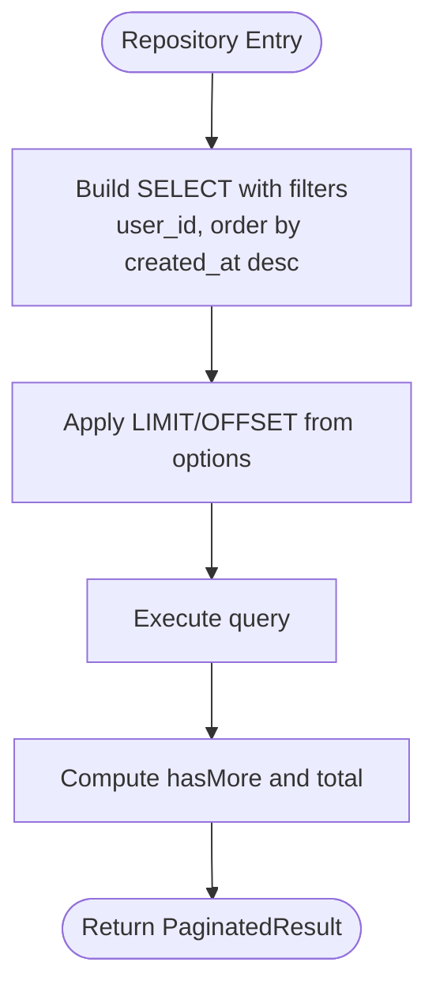

**Diagram sources**
- [notification-repository.ts](file://src/repositories/notification-repository.ts#L41-L60)
- [base-repository.ts](file://src/repositories/base-repository.ts#L129-L147)

**Section sources**
- [notification-repository.ts](file://src/repositories/notification-repository.ts#L41-L60)
- [base-repository.ts](file://src/repositories/base-repository.ts#L129-L147)

### Authentication Middleware
- Ensures Authorization header is present and formatted as Bearer <token>.
- Validates token and attaches user info to request.
- Returns 401 for missing/invalid/expired tokens.

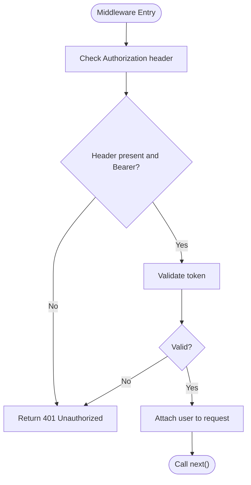

**Diagram sources**
- [auth-middleware.ts](file://src/middleware/auth-middleware.ts#L25-L70)

**Section sources**
- [auth-middleware.ts](file://src/middleware/auth-middleware.ts#L25-L70)

### Response Format and Example
- Response shape:
  - items: array of notifications
  - hasMore: boolean
  - total: number (optional)
- Example request:
  - Method: GET
  - Path: /api/notifications
  - Headers: Authorization: Bearer <JWT>
  - Query: maxItemCount=50
- Example paginated response:
  - items: [
    { id, userId, type, title, message, data, isRead, createdAt },
    ...
  ]
  - hasMore: true
  - total: 1200

Note: The repository currently uses LIMIT/OFFSET semantics. The route handler documents continuationToken for pagination. For cursor-based pagination, the repository would need to be adapted to accept a cursor token and translate it into a LIMIT/OFFSET or equivalent query.

**Section sources**
- [notification-routes.ts](file://src/routes/notification-routes.ts#L41-L83)
- [notification-service.ts](file://src/services/notification-service.ts#L80-L94)
- [notification-repository.ts](file://src/repositories/notification-repository.ts#L41-L60)
- [API-DOCUMENTATION.md](file://docs/API-DOCUMENTATION.md#L591-L609)

## Dependency Analysis
- Route handler depends on:
  - auth-middleware for JWT validation
  - notification-service for business logic
- Service depends on:
  - notification-repository for data access
  - entity-mapper for model conversion
- Repository depends on:
  - Supabase client from configuration
  - TABLES constant for table name

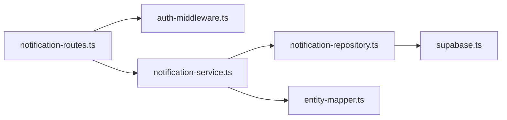

**Diagram sources**
- [notification-routes.ts](file://src/routes/notification-routes.ts#L83-L118)
- [auth-middleware.ts](file://src/middleware/auth-middleware.ts#L25-L70)
- [notification-service.ts](file://src/services/notification-service.ts#L80-L94)
- [notification-repository.ts](file://src/repositories/notification-repository.ts#L41-L60)
- [supabase.ts](file://src/config/supabase.ts#L1-L45)
- [entity-mapper.ts](file://src/utils/entity-mapper.ts#L373-L409)

**Section sources**
- [notification-routes.ts](file://src/routes/notification-routes.ts#L83-L118)
- [notification-service.ts](file://src/services/notification-service.ts#L80-L94)
- [notification-repository.ts](file://src/repositories/notification-repository.ts#L41-L60)
- [auth-middleware.ts](file://src/middleware/auth-middleware.ts#L25-L70)
- [supabase.ts](file://src/config/supabase.ts#L1-L45)
- [entity-mapper.ts](file://src/utils/entity-mapper.ts#L373-L409)

## Performance Considerations
- Cursor-based pagination:
  - The route handler documents continuationToken, but the repository currently uses LIMIT/OFFSET. For very large datasets, cursor-based pagination (using a cursor derived from the last item’s created_at and id) can reduce scanning overhead compared to OFFSET.
- Sorting and indexing:
  - Queries sort by created_at DESC. Ensure database indexes exist on user_id and created_at for optimal performance.
- Batch size:
  - maxItemCount controls batch size. Keep reasonable limits (e.g., 50–100) to balance latency and round-trips.
- Total count:
  - Exact count queries can be expensive. Consider returning total only when needed or caching counts.

[No sources needed since this section provides general guidance]

## Troubleshooting Guide
Common issues and resolutions:
- 401 Unauthorized:
  - Missing or invalid Authorization header. Ensure Bearer <token> is sent.
  - Expired token: client should refresh or re-authenticate.
- 400 Bad Request:
  - Validation errors from service or repository. Check query parameters and retry.
- 500 Internal Server Error:
  - Database connectivity or query failures. Verify Supabase configuration and network.

Client-side guidance:
- Infinite scroll:
  - On initial load, call GET /api/notifications with maxItemCount.
  - On subsequent loads, pass continuationToken to fetch next page.
  - Stop when hasMore is false.
- Error handling:
  - 401: prompt user to log in again or refresh token.
  - 403: inform user lacks permission.
  - 404: handle missing resource scenarios gracefully.
  - 400: display validation messages and allow retry.

**Section sources**
- [auth-middleware.ts](file://src/middleware/auth-middleware.ts#L25-L70)
- [notification-service.ts](file://src/services/notification-service.ts#L114-L151)
- [notification-repository.ts](file://src/repositories/notification-repository.ts#L41-L60)
- [API-DOCUMENTATION.md](file://docs/API-DOCUMENTATION.md#L611-L642)

## Conclusion
The GET /api/notifications endpoint provides paginated access to a user’s notifications with JWT authentication. While the route handler documents continuationToken, the current repository implementation uses LIMIT/OFFSET. For large-scale deployments, adopting cursor-based pagination in the repository would improve performance. Clients should implement infinite scroll with maxItemCount and continuationToken, and handle 401/403/404/400 responses appropriately.

[No sources needed since this section summarizes without analyzing specific files]

## Appendices

### API Definition: GET /api/notifications
- Method: GET
- Path: /api/notifications
- Authentication: Bearer <token>
- Query Parameters:
  - maxItemCount (integer, min 1, max 100)
  - continuationToken (string)
- Response:
  - 200 OK: { items: Notification[], hasMore: boolean, total?: number }
  - 400 Bad Request: error payload
  - 401 Unauthorized: error payload
- Example request:
  - Authorization: Bearer <JWT>
  - maxItemCount: 50
- Example response:
  - items: Array of notifications
  - hasMore: true/false
  - total: optional

**Section sources**
- [notification-routes.ts](file://src/routes/notification-routes.ts#L41-L83)
- [API-DOCUMENTATION.md](file://docs/API-DOCUMENTATION.md#L591-L609)