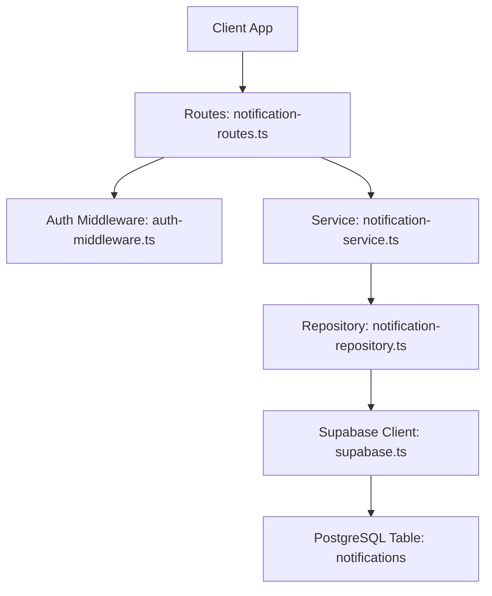
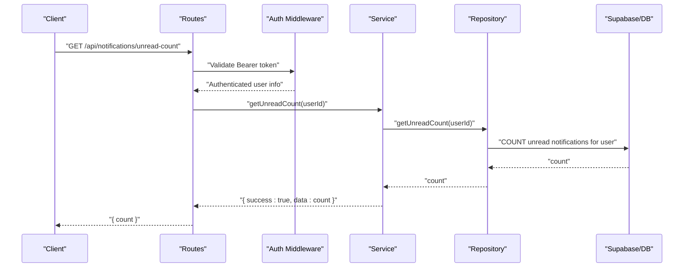
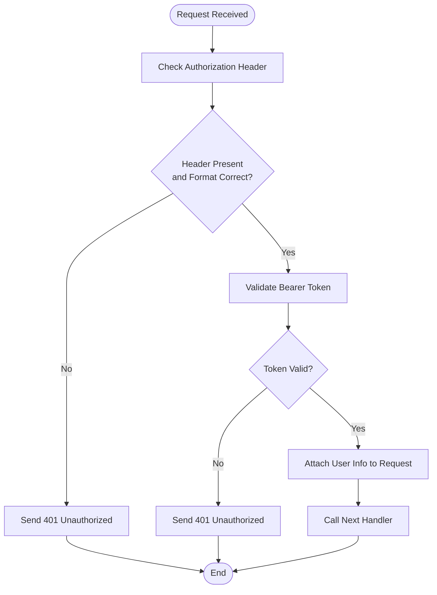
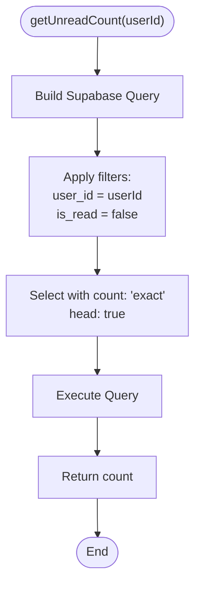
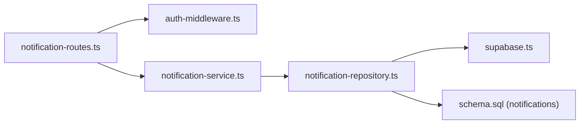

# Get Unread Notification Count

<cite>
**Referenced Files in This Document**
- [notification-routes.ts](file://src/routes/notification-routes.ts)
- [notification-service.ts](file://src/services/notification-service.ts)
- [notification-repository.ts](file://src/repositories/notification-repository.ts)
- [auth-middleware.ts](file://src/middleware/auth-middleware.ts)
- [supabase.ts](file://src/config/supabase.ts)
- [schema.sql](file://supabase/schema.sql)
- [API-DOCUMENTATION.md](file://docs/API-DOCUMENTATION.md)
</cite>

## Table of Contents
1. [Introduction](#introduction)
2. [Project Structure](#project-structure)
3. [Core Components](#core-components)
4. [Architecture Overview](#architecture-overview)
5. [Detailed Component Analysis](#detailed-component-analysis)
6. [Dependency Analysis](#dependency-analysis)
7. [Performance Considerations](#performance-considerations)
8. [Troubleshooting Guide](#troubleshooting-guide)
9. [Conclusion](#conclusion)

## Introduction
This document provides API documentation for the GET /api/notifications/unread-count endpoint. It returns the number of unread notifications for the authenticated user. The endpoint is lightweight, requiring no request parameters, and responds with a simple JSON payload containing a count field. This design enables efficient real-time badge updates in the UI without transferring full notification payloads.

## Project Structure
The endpoint is implemented using a layered architecture:
- Route handler validates authentication and delegates to the service layer.
- Service layer orchestrates repository operations.
- Repository executes a database query optimized for counting unread notifications.
- Supabase client and table constants define the data access layer.

**Diagram sources**
- [notification-routes.ts](file://src/routes/notification-routes.ts#L121-L169)
- [auth-middleware.ts](file://src/middleware/auth-middleware.ts#L25-L70)
- [notification-service.ts](file://src/services/notification-service.ts#L153-L159)
- [notification-repository.ts](file://src/repositories/notification-repository.ts#L104-L114)
- [supabase.ts](file://src/config/supabase.ts#L1-L22)
- [schema.sql](file://supabase/schema.sql#L122-L133)

**Section sources**
- [notification-routes.ts](file://src/routes/notification-routes.ts#L121-L169)
- [API-DOCUMENTATION.md](file://docs/API-DOCUMENTATION.md#L591-L609)

## Core Components
- Endpoint: GET /api/notifications/unread-count
- Authentication: Bearer token required via Authorization header
- Request: No query parameters
- Response: JSON object with a count field representing unread notifications
- Example response: {"count": 3}

Implementation highlights:
- Lightweight response avoids transferring full notification payloads
- Optimized database query uses COUNT aggregation with user ID and is_read filters
- Real-time badge updates are enabled by frequent polling or push alternatives

**Section sources**
- [API-DOCUMENTATION.md](file://docs/API-DOCUMENTATION.md#L591-L609)
- [notification-routes.ts](file://src/routes/notification-routes.ts#L121-L169)
- [notification-service.ts](file://src/services/notification-service.ts#L153-L159)
- [notification-repository.ts](file://src/repositories/notification-repository.ts#L104-L114)

## Architecture Overview
The endpoint follows a clean separation of concerns:
- Route layer: Validates authentication and constructs the response
- Service layer: Provides business logic and error handling wrapper
- Repository layer: Performs database operations with Supabase client
- Data model: Uses the notifications table with indexes for performance

**Diagram sources**
- [notification-routes.ts](file://src/routes/notification-routes.ts#L144-L169)
- [auth-middleware.ts](file://src/middleware/auth-middleware.ts#L25-L70)
- [notification-service.ts](file://src/services/notification-service.ts#L153-L159)
- [notification-repository.ts](file://src/repositories/notification-repository.ts#L104-L114)

## Detailed Component Analysis

### Endpoint Definition and Behavior
- HTTP Method: GET
- Path: /api/notifications/unread-count
- Authentication: Required (Bearer token)
- Request body: Not applicable
- Query parameters: None
- Response: JSON with a single count field

Behavior:
- Returns the number of unread notifications for the authenticated user
- Uses user ID from the validated token to filter records
- Responds with a 200 status and a simple JSON object

**Section sources**
- [API-DOCUMENTATION.md](file://docs/API-DOCUMENTATION.md#L591-L609)
- [notification-routes.ts](file://src/routes/notification-routes.ts#L121-L169)

### Authentication Flow
The route enforces authentication using a Bearer token. The middleware validates the Authorization header format and verifies the token, attaching user information to the request object.

**Diagram sources**
- [auth-middleware.ts](file://src/middleware/auth-middleware.ts#L25-L70)

**Section sources**
- [auth-middleware.ts](file://src/middleware/auth-middleware.ts#L25-L70)
- [notification-routes.ts](file://src/routes/notification-routes.ts#L144-L169)

### Service Layer Implementation
The service layer wraps repository calls and returns a standardized result structure. For unread count, it simply delegates to the repository.

Responsibilities:
- Standardized success/error result pattern
- Delegation to repository for database operations
- Returning primitive counts for lightweight responses

**Section sources**
- [notification-service.ts](file://src/services/notification-service.ts#L153-L159)

### Repository and Database Query
The repository performs an optimized COUNT query:
- Filters by user_id
- Filters by is_read = false
- Uses head: true and count: 'exact' to return only the count
- Returns a numeric count

Database schema and indexes:
- Table: notifications
- Columns: id, user_id, type, title, message, data, is_read, created_at, updated_at
- Indexes: user_id, is_read

**Diagram sources**
- [notification-repository.ts](file://src/repositories/notification-repository.ts#L104-L114)
- [schema.sql](file://supabase/schema.sql#L122-L133)
- [supabase.ts](file://src/config/supabase.ts#L1-L22)

**Section sources**
- [notification-repository.ts](file://src/repositories/notification-repository.ts#L104-L114)
- [schema.sql](file://supabase/schema.sql#L122-L133)

### Real-Time Badge Updates
Why this endpoint is ideal for badges:
- Minimal payload: only a count integer
- Fast network transfer
- Low CPU/memory overhead on client
- Efficient server-side COUNT aggregation

How to integrate:
- Poll the endpoint at short intervals to keep the badge fresh
- Update the UI immediately upon receiving a new count
- Reset or hide the badge when count reaches zero

**Section sources**
- [API-DOCUMENTATION.md](file://docs/API-DOCUMENTATION.md#L591-L609)
- [notification-routes.ts](file://src/routes/notification-routes.ts#L121-L169)

## Dependency Analysis
The endpoint’s dependencies form a straightforward chain from route to database.

**Diagram sources**
- [notification-routes.ts](file://src/routes/notification-routes.ts#L121-L169)
- [auth-middleware.ts](file://src/middleware/auth-middleware.ts#L25-L70)
- [notification-service.ts](file://src/services/notification-service.ts#L153-L159)
- [notification-repository.ts](file://src/repositories/notification-repository.ts#L104-L114)
- [supabase.ts](file://src/config/supabase.ts#L1-L22)
- [schema.sql](file://supabase/schema.sql#L122-L133)

**Section sources**
- [notification-routes.ts](file://src/routes/notification-routes.ts#L121-L169)
- [notification-service.ts](file://src/services/notification-service.ts#L153-L159)
- [notification-repository.ts](file://src/repositories/notification-repository.ts#L104-L114)
- [supabase.ts](file://src/config/supabase.ts#L1-L22)
- [schema.sql](file://supabase/schema.sql#L122-L133)

## Performance Considerations
- Why COUNT is efficient:
  - Head-only query with count: 'exact'
  - Minimal data transfer compared to fetching rows
  - Database can leverage indexes on user_id and is_read
- Indexes:
  - notifications(user_id) and notifications(is_read) are created in schema
- Comparison to client-side counting:
  - Fetching all unread notifications and counting on the client increases payload size and processing time
  - Server-side COUNT reduces bandwidth and CPU usage
- Caching strategies:
  - Short-lived cache (e.g., Redis or in-memory) keyed by user_id
  - TTL aligned with polling interval to balance freshness and load
  - Invalidate cache on mark-as-read operations
- Rate limiting:
  - Apply per-user rate limits to prevent abuse
  - Consider exponential backoff for clients that poll aggressively

[No sources needed since this section provides general guidance]

## Troubleshooting Guide
Common issues and resolutions:
- 401 Unauthorized:
  - Missing or malformed Authorization header
  - Invalid or expired Bearer token
  - Resolution: Ensure Authorization: Bearer <token> is present and valid
- 400 Bad Request:
  - Service-level error from getUnreadCount
  - Resolution: Retry after a short delay; check server logs
- Database errors:
  - Supabase client errors during COUNT query
  - Resolution: Verify database connectivity and indexes; check Supabase logs

Operational checks:
- Confirm auth middleware attaches user info to the request
- Verify repository query executes with correct filters
- Ensure notifications table exists and indexes are present

**Section sources**
- [auth-middleware.ts](file://src/middleware/auth-middleware.ts#L25-L70)
- [notification-routes.ts](file://src/routes/notification-routes.ts#L144-L169)
- [notification-repository.ts](file://src/repositories/notification-repository.ts#L104-L114)
- [schema.sql](file://supabase/schema.sql#L122-L133)

## Conclusion
The GET /api/notifications/unread-count endpoint delivers a lightweight, efficient mechanism for real-time badge updates. By leveraging a server-side COUNT query filtered by user ID and unread status, it minimizes payload size and database load. Combined with appropriate polling intervals or push technologies, it provides responsive UI feedback while maintaining scalability.