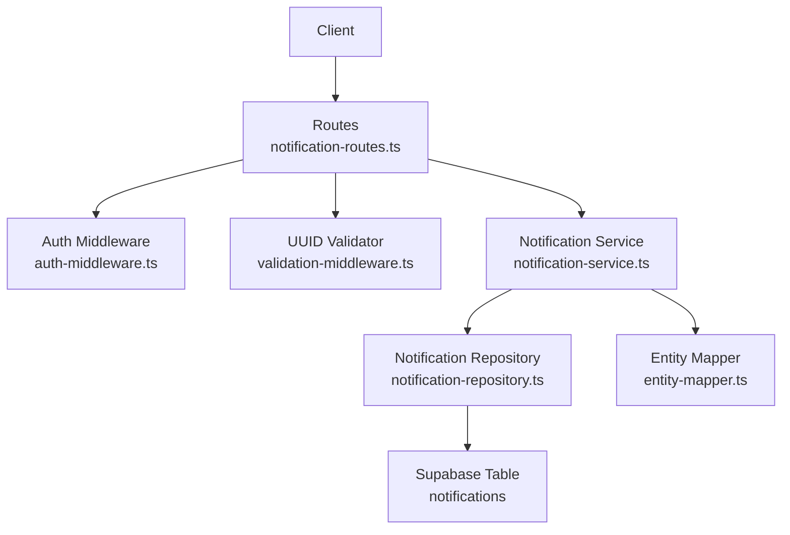
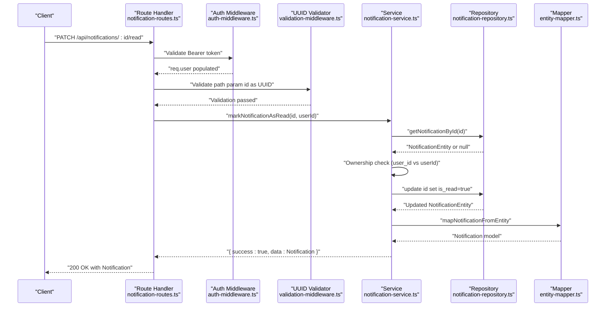
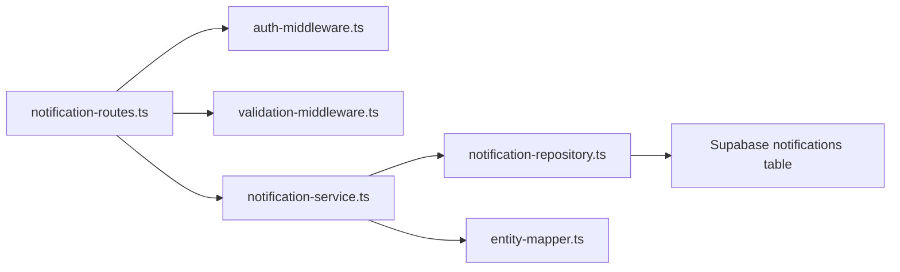
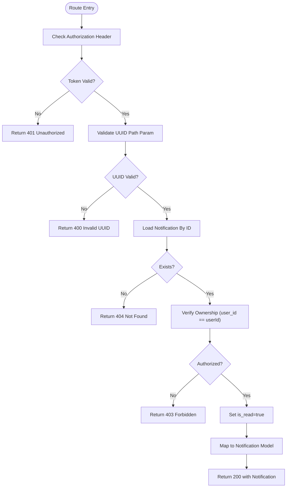

# Mark Notification as Read

<cite>
**Referenced Files in This Document**
- [notification-routes.ts](file://src/routes/notification-routes.ts)
- [notification-service.ts](file://src/services/notification-service.ts)
- [notification-repository.ts](file://src/repositories/notification-repository.ts)
- [auth-middleware.ts](file://src/middleware/auth-middleware.ts)
- [validation-middleware.ts](file://src/middleware/validation-middleware.ts)
- [entity-mapper.ts](file://src/utils/entity-mapper.ts)
- [API-DOCUMENTATION.md](file://docs/API-DOCUMENTATION.md)
</cite>

## Table of Contents
1. [Introduction](#introduction)
2. [Project Structure](#project-structure)
3. [Core Components](#core-components)
4. [Architecture Overview](#architecture-overview)
5. [Detailed Component Analysis](#detailed-component-analysis)
6. [Dependency Analysis](#dependency-analysis)
7. [Performance Considerations](#performance-considerations)
8. [Troubleshooting Guide](#troubleshooting-guide)
9. [Conclusion](#conclusion)
10. [Appendices](#appendices)

## Introduction
This document provides API documentation for the PATCH /api/notifications/:id/read endpoint that marks a specific notification as read. It covers the HTTP method, path parameter, request body, success and error responses, and the backend flow from route to service to repository and database. It also explains JWT-based ownership verification via auth-middleware, idempotency considerations, race conditions in high-frequency scenarios, and best practices for client-side state synchronization.

## Project Structure
The notification read endpoint is implemented as part of the notifications module:
- Route handler: defines the endpoint, applies middleware, and returns responses
- Service layer: orchestrates business logic and ownership checks
- Repository layer: performs database updates
- Middleware: JWT validation and UUID parameter validation
- Entity mapper: converts database rows to API models

**Diagram sources**
- [notification-routes.ts](file://src/routes/notification-routes.ts#L172-L234)
- [auth-middleware.ts](file://src/middleware/auth-middleware.ts#L1-L70)
- [validation-middleware.ts](file://src/middleware/validation-middleware.ts#L778-L814)
- [notification-service.ts](file://src/services/notification-service.ts#L113-L143)
- [notification-repository.ts](file://src/repositories/notification-repository.ts#L87-L90)
- [entity-mapper.ts](file://src/utils/entity-mapper.ts#L373-L412)

**Section sources**
- [notification-routes.ts](file://src/routes/notification-routes.ts#L172-L234)
- [API-DOCUMENTATION.md](file://docs/API-DOCUMENTATION.md#L591-L609)

## Core Components
- Endpoint: PATCH /api/notifications/:id/read
- Path parameter: id (UUID)
- Request body: empty
- Authentication: Bearer token required
- Ownership verification: JWT subject must match notification’s user_id
- Success response: 200 with the updated notification model
- Error responses:
  - 400: Invalid UUID format
  - 401: Unauthorized (missing/invalid/expired token)
  - 403: Forbidden (not authorized to update)
  - 404: Not found (notification does not exist)
  - 500: Internal server error (unexpected failure)

**Section sources**
- [notification-routes.ts](file://src/routes/notification-routes.ts#L172-L234)
- [auth-middleware.ts](file://src/middleware/auth-middleware.ts#L1-L70)
- [validation-middleware.ts](file://src/middleware/validation-middleware.ts#L778-L814)
- [notification-service.ts](file://src/services/notification-service.ts#L113-L143)
- [notification-repository.ts](file://src/repositories/notification-repository.ts#L87-L90)
- [API-DOCUMENTATION.md](file://docs/API-DOCUMENTATION.md#L591-L609)

## Architecture Overview
The PATCH /api/notifications/:id/read flow:
1. Route handler validates JWT and UUID
2. Service retrieves notification and verifies ownership
3. Repository updates is_read flag
4. Mapper transforms to API model
5. Route handler returns 200 with updated notification

**Diagram sources**
- [notification-routes.ts](file://src/routes/notification-routes.ts#L204-L233)
- [auth-middleware.ts](file://src/middleware/auth-middleware.ts#L25-L70)
- [validation-middleware.ts](file://src/middleware/validation-middleware.ts#L782-L814)
- [notification-service.ts](file://src/services/notification-service.ts#L113-L143)
- [notification-repository.ts](file://src/repositories/notification-repository.ts#L37-L39)
- [entity-mapper.ts](file://src/utils/entity-mapper.ts#L373-L412)

## Detailed Component Analysis

### Endpoint Definition and Behavior
- Method: PATCH
- Path: /api/notifications/:id/read
- Path parameter: id (UUID)
- Request body: empty
- Authentication: Bearer token required
- Ownership verification: The authenticated user’s ID must match the notification’s user_id
- Success: 200 with the updated notification model
- Errors:
  - 400: Invalid UUID format
  - 401: Unauthorized (missing/invalid/expired token)
  - 403: Forbidden (not authorized to update)
  - 404: Not found (notification does not exist)
  - 500: Internal server error (unexpected failure)

**Section sources**
- [notification-routes.ts](file://src/routes/notification-routes.ts#L172-L234)
- [API-DOCUMENTATION.md](file://docs/API-DOCUMENTATION.md#L591-L609)

### Route Handler
- Applies authMiddleware to enforce JWT presence and validity
- Applies validateUUID to ensure id is a valid UUID
- Calls markNotificationAsRead(service) with notificationId and authenticated userId
- Maps service error codes to HTTP status codes (404 for NOT_FOUND, 403 for UNAUTHORIZED)
- Returns 200 with the updated notification model on success

**Section sources**
- [notification-routes.ts](file://src/routes/notification-routes.ts#L204-L233)

### Auth Middleware
- Extracts Authorization header and ensures format "Bearer <token>"
- Validates token via service and populates req.user with decoded claims
- Returns 401 for missing header, invalid format, expired, or invalid token

**Section sources**
- [auth-middleware.ts](file://src/middleware/auth-middleware.ts#L1-L70)

### UUID Validation Middleware
- Validates that path parameter id matches UUID v4 format
- Returns 400 with VALIDATION_ERROR when invalid

**Section sources**
- [validation-middleware.ts](file://src/middleware/validation-middleware.ts#L778-L814)

### Service Layer
- Retrieves notification by id
- Checks ownership: notification.user_id must equal authenticated userId
- Updates is_read to true via repository
- Maps entity to API model and returns success
- Returns error codes: NOT_FOUND, UNAUTHORIZED, UPDATE_FAILED

**Section sources**
- [notification-service.ts](file://src/services/notification-service.ts#L113-L143)

### Repository Layer
- getNotificationById(id) returns entity or null
- markAsRead(id) updates is_read to true and returns updated entity or null
- Throws on database errors

**Section sources**
- [notification-repository.ts](file://src/repositories/notification-repository.ts#L37-L39)
- [notification-repository.ts](file://src/repositories/notification-repository.ts#L87-L90)

### Entity Mapper
- mapNotificationFromEntity converts NotificationEntity to Notification model (id, userId, type, title, message, data, isRead, createdAt)

**Section sources**
- [entity-mapper.ts](file://src/utils/entity-mapper.ts#L373-L412)

### Practical Example: Proposal Acceptance Notification
Scenario: After viewing a proposal acceptance notification, the client calls PATCH /api/notifications/:id/read to mark it as read.

Steps:
1. Client obtains a valid Bearer token
2. Client sends PATCH with empty body to /api/notifications/{proposalAcceptedId}/read
3. Server validates token and UUID
4. Service loads the notification and verifies ownership
5. Repository sets is_read=true
6. Mapper returns the updated notification model
7. Client receives 200 with the updated notification

Best practices:
- Store the returned notification in local state to reflect the change immediately
- Update unread counters and lists accordingly
- Handle 404 gracefully (e.g., notification already read or deleted)

**Section sources**
- [notification-routes.ts](file://src/routes/notification-routes.ts#L204-L233)
- [notification-service.ts](file://src/services/notification-service.ts#L113-L143)
- [notification-repository.ts](file://src/repositories/notification-repository.ts#L87-L90)
- [entity-mapper.ts](file://src/utils/entity-mapper.ts#L373-L412)

## Dependency Analysis
Key dependencies and interactions:
- Routes depend on auth-middleware and validation-middleware
- Routes call notification-service
- Service depends on notification-repository and entity-mapper
- Repository interacts with Supabase notifications table

**Diagram sources**
- [notification-routes.ts](file://src/routes/notification-routes.ts#L172-L234)
- [auth-middleware.ts](file://src/middleware/auth-middleware.ts#L1-L70)
- [validation-middleware.ts](file://src/middleware/validation-middleware.ts#L778-L814)
- [notification-service.ts](file://src/services/notification-service.ts#L113-L143)
- [notification-repository.ts](file://src/repositories/notification-repository.ts#L1-L118)
- [entity-mapper.ts](file://src/utils/entity-mapper.ts#L373-L412)

**Section sources**
- [notification-routes.ts](file://src/routes/notification-routes.ts#L172-L234)
- [notification-service.ts](file://src/services/notification-service.ts#L113-L143)
- [notification-repository.ts](file://src/repositories/notification-repository.ts#L1-L118)

## Performance Considerations
- Idempotency: The endpoint is idempotent. Repeatedly marking the same notification as read will return the same updated model without causing duplicates or extra writes.
- Race conditions: In high-frequency scenarios, multiple clients may attempt to mark the same notification as read concurrently. The repository update is a single-row write; the service enforces ownership before updating. While the database update itself is atomic, concurrent reads may briefly show is_read=false until the write completes. This is acceptable for UI state updates.
- Best practices:
  - Client-side optimistic updates: Immediately mark the notification as read locally upon receiving a successful response
  - Debounce rapid clicks to avoid redundant requests
  - Use a single source of truth for unread counts and lists

[No sources needed since this section provides general guidance]

## Troubleshooting Guide
Common issues and resolutions:
- 400 Invalid UUID format: Ensure the path parameter id is a valid UUID v4
- 401 Unauthorized: Verify the Authorization header is present and formatted as "Bearer <token>". Confirm the token is valid and not expired
- 403 Forbidden: The notification exists but does not belong to the authenticated user
- 404 Not found: The notification ID does not exist or has been deleted
- 500 Internal server error: Unexpected failure during database update; retry after a short delay

**Section sources**
- [notification-routes.ts](file://src/routes/notification-routes.ts#L204-L233)
- [auth-middleware.ts](file://src/middleware/auth-middleware.ts#L1-L70)
- [validation-middleware.ts](file://src/middleware/validation-middleware.ts#L778-L814)
- [notification-service.ts](file://src/services/notification-service.ts#L113-L143)
- [notification-repository.ts](file://src/repositories/notification-repository.ts#L87-L90)

## Conclusion
The PATCH /api/notifications/:id/read endpoint provides a straightforward mechanism to mark a notification as read. It enforces JWT-based ownership verification, validates the UUID path parameter, and returns the updated notification model on success. The flow is idempotent and designed to handle typical client-side state synchronization patterns. For robust applications, apply optimistic UI updates and handle error responses gracefully.

[No sources needed since this section summarizes without analyzing specific files]

## Appendices

### API Definition Summary
- Method: PATCH
- Path: /api/notifications/:id/read
- Path parameters:
  - id: string (UUID)
- Request body: empty
- Authentication: Bearer token
- Success: 200 with Notification model
- Errors: 400 (invalid UUID), 401 (unauthorized), 403 (forbidden), 404 (not found), 500 (internal error)

**Section sources**
- [notification-routes.ts](file://src/routes/notification-routes.ts#L172-L234)
- [API-DOCUMENTATION.md](file://docs/API-DOCUMENTATION.md#L591-L609)

### Backend Flow Diagram (Code-Level)

**Diagram sources**
- [notification-routes.ts](file://src/routes/notification-routes.ts#L204-L233)
- [auth-middleware.ts](file://src/middleware/auth-middleware.ts#L25-L70)
- [validation-middleware.ts](file://src/middleware/validation-middleware.ts#L782-L814)
- [notification-service.ts](file://src/services/notification-service.ts#L113-L143)
- [notification-repository.ts](file://src/repositories/notification-repository.ts#L87-L90)
- [entity-mapper.ts](file://src/utils/entity-mapper.ts#L373-L412)