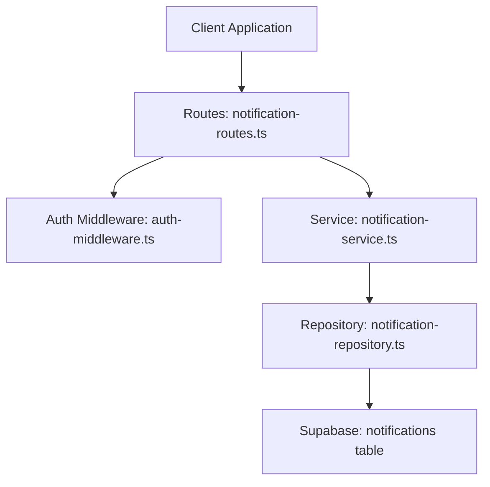
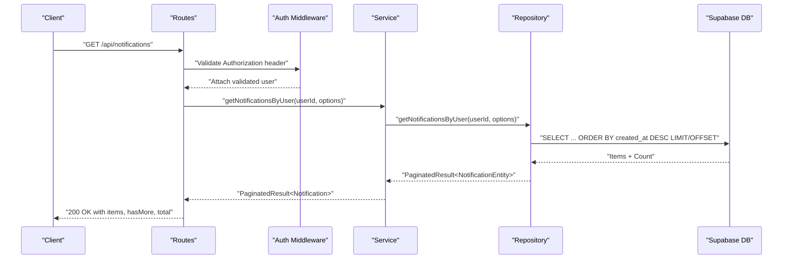
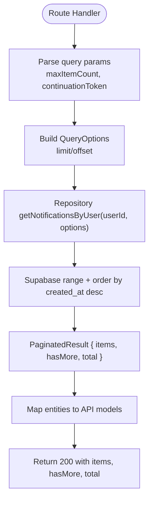
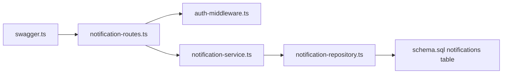

# Notification API

<cite>
**Referenced Files in This Document**
- [notification-routes.ts](file://src/routes/notification-routes.ts)
- [notification-service.ts](file://src/services/notification-service.ts)
- [notification-repository.ts](file://src/repositories/notification-repository.ts)
- [auth-middleware.ts](file://src/middleware/auth-middleware.ts)
- [swagger.ts](file://src/config/swagger.ts)
- [schema.sql](file://supabase/schema.sql)
- [API-DOCUMENTATION.md](file://docs/API-DOCUMENTATION.md)
</cite>

## Table of Contents
1. [Introduction](#introduction)
2. [Project Structure](#project-structure)
3. [Core Components](#core-components)
4. [Architecture Overview](#architecture-overview)
5. [Detailed Component Analysis](#detailed-component-analysis)
6. [Dependency Analysis](#dependency-analysis)
7. [Performance Considerations](#performance-considerations)
8. [Troubleshooting Guide](#troubleshooting-guide)
9. [Conclusion](#conclusion)
10. [Appendices](#appendices)

## Introduction
This document provides comprehensive API documentation for the notification system endpoints in the FreelanceXchain platform. It covers HTTP methods, URL patterns, request/response schemas, authentication requirements (JWT Bearer), and pagination mechanisms. It also documents notification types, payload structures, and client implementation guidance for building a notification center with real-time updates. The goal is to enable developers to integrate notification retrieval, marking as read, and unread counts into their applications reliably and efficiently.

## Project Structure
The notification API is implemented as part of the Express route layer, backed by a service layer and a repository that interacts with the Supabase database. Authentication is enforced via a JWT Bearer middleware. The OpenAPI/Swagger specification defines response schemas and security schemes.

**Diagram sources**
- [notification-routes.ts](file://src/routes/notification-routes.ts#L1-L289)
- [auth-middleware.ts](file://src/middleware/auth-middleware.ts#L1-L101)
- [notification-service.ts](file://src/services/notification-service.ts#L1-L316)
- [notification-repository.ts](file://src/repositories/notification-repository.ts#L1-L118)
- [schema.sql](file://supabase/schema.sql#L122-L133)

**Section sources**
- [notification-routes.ts](file://src/routes/notification-routes.ts#L1-L289)
- [auth-middleware.ts](file://src/middleware/auth-middleware.ts#L1-L101)
- [swagger.ts](file://src/config/swagger.ts#L1-L233)
- [schema.sql](file://supabase/schema.sql#L122-L133)

## Core Components
- Routes: Define endpoints for listing notifications, marking a notification as read, marking all as read, and retrieving unread counts. All endpoints require JWT Bearer authentication.
- Service: Orchestrates business logic for creating, retrieving, and updating notifications, and exposes helper functions for specific notification types.
- Repository: Implements database operations using Supabase client, including paginated queries, unread counts, and bulk updates.
- Auth Middleware: Validates Authorization header format and verifies JWT tokens.
- Swagger: Defines the Notification schema, error schema, and security scheme for Bearer JWT.

Key responsibilities:
- Enforce authentication and user identity on protected endpoints.
- Apply pagination and ordering for notification lists.
- Enforce ownership checks when marking notifications as read.
- Provide unread counts and bulk read operations.

**Section sources**
- [notification-routes.ts](file://src/routes/notification-routes.ts#L1-L289)
- [notification-service.ts](file://src/services/notification-service.ts#L1-L316)
- [notification-repository.ts](file://src/repositories/notification-repository.ts#L1-L118)
- [auth-middleware.ts](file://src/middleware/auth-middleware.ts#L1-L101)
- [swagger.ts](file://src/config/swagger.ts#L1-L233)

## Architecture Overview
The notification API follows a layered architecture:
- Route handlers accept requests, enforce authentication, and delegate to the service.
- Services translate request options into repository calls and map entities to API models.
- Repositories encapsulate Supabase queries and handle pagination metadata.
- Swagger documents schemas and security for clients.

**Diagram sources**
- [notification-routes.ts](file://src/routes/notification-routes.ts#L83-L118)
- [notification-service.ts](file://src/services/notification-service.ts#L80-L94)
- [notification-repository.ts](file://src/repositories/notification-repository.ts#L41-L60)
- [swagger.ts](file://src/config/swagger.ts#L189-L214)

## Detailed Component Analysis

### Authentication and Security
- All notification endpoints require a Bearer token in the Authorization header.
- The auth middleware validates the header format and verifies the token, attaching user identity to the request.
- Unauthorized responses include standardized error structure with code and message.

Security requirements:
- Header: Authorization: Bearer <JWT>
- Scope: User-bound access token

**Section sources**
- [notification-routes.ts](file://src/routes/notification-routes.ts#L41-L82)
- [auth-middleware.ts](file://src/middleware/auth-middleware.ts#L25-L70)
- [swagger.ts](file://src/config/swagger.ts#L22-L28)

### Endpoints Reference

#### GET /api/notifications
- Purpose: Retrieve notifications for the authenticated user, sorted newest first.
- Authentication: Required (Bearer JWT).
- Query parameters:
  - maxItemCount (integer, min 1, max 100): Limit number of items returned.
  - continuationToken (string): Pagination token (used internally by repository).
- Response:
  - 200 OK: items (array of Notification), hasMore (boolean), total (optional number).
  - 401 Unauthorized: Missing or invalid token.

Notification schema (selected fields):
- id: string (UUID)
- userId: string (UUID)
- type: enum [proposal_received, proposal_accepted, proposal_rejected, milestone_submitted, milestone_approved, payment_released, dispute_created, dispute_resolved, rating_received, message]
- title: string
- message: string
- data: object (additional properties)
- isRead: boolean
- createdAt: string (ISO 8601)

Pagination:
- Uses Supabase range queries with ORDER BY created_at DESC.
- hasMore indicates whether more records exist beyond the current page.
- total may be included depending on count mode.

**Section sources**
- [notification-routes.ts](file://src/routes/notification-routes.ts#L41-L82)
- [notification-service.ts](file://src/services/notification-service.ts#L80-L94)
- [notification-repository.ts](file://src/repositories/notification-repository.ts#L41-L60)
- [swagger.ts](file://src/config/swagger.ts#L189-L214)

#### GET /api/notifications/unread-count
- Purpose: Get the count of unread notifications for the authenticated user.
- Authentication: Required (Bearer JWT).
- Response:
  - 200 OK: { count: number }
  - 401 Unauthorized: Missing or invalid token.

**Section sources**
- [notification-routes.ts](file://src/routes/notification-routes.ts#L121-L169)
- [notification-service.ts](file://src/services/notification-service.ts#L153-L159)
- [notification-repository.ts](file://src/repositories/notification-repository.ts#L104-L114)

#### PATCH /api/notifications/:id/read
- Purpose: Mark a specific notification as read.
- Authentication: Required (Bearer JWT).
- Path parameters:
  - id: string (UUID)
- Response:
  - 200 OK: Notification object.
  - 400 Bad Request: Invalid UUID format.
  - 401 Unauthorized: Missing or invalid token.
  - 403 Forbidden: Not authorized to update (notification belongs to another user).
  - 404 Not Found: Notification not found.

Ownership enforcement:
- The service fetches the notification and verifies that user_id matches the authenticated user before marking as read.

**Section sources**
- [notification-routes.ts](file://src/routes/notification-routes.ts#L172-L235)
- [notification-service.ts](file://src/services/notification-service.ts#L113-L143)
- [notification-repository.ts](file://src/repositories/notification-repository.ts#L37-L40)

#### PATCH /api/notifications/read-all
- Purpose: Mark all notifications for the authenticated user as read.
- Authentication: Required (Bearer JWT).
- Response:
  - 200 OK: { count: number } (number of notifications marked as read).
  - 401 Unauthorized: Missing or invalid token.

Bulk update:
- Repository performs an UPDATE with conditions to mark only unread notifications as read and returns the affected count.

**Section sources**
- [notification-routes.ts](file://src/routes/notification-routes.ts#L236-L286)
- [notification-service.ts](file://src/services/notification-service.ts#L145-L151)
- [notification-repository.ts](file://src/repositories/notification-repository.ts#L91-L102)

### Notification Types
Supported notification types:
- proposal_received
- proposal_accepted
- proposal_rejected
- milestone_submitted
- milestone_approved
- payment_released
- dispute_created
- dispute_resolved
- rating_received
- message

These types are defined in the repository and mapped to the API model. Additional helper functions exist in the service to create notifications for specific workflow events.

**Section sources**
- [notification-repository.ts](file://src/repositories/notification-repository.ts#L4-L14)
- [swagger.ts](file://src/config/swagger.ts#L189-L206)
- [notification-service.ts](file://src/services/notification-service.ts#L162-L316)

### Pagination Mechanism
- The repository uses Supabase range queries with ORDER BY created_at DESC.
- QueryOptions supports limit/offset semantics; the route handler forwards maxItemCount and continuationToken to the service, which maps them to repository options.
- Response includes hasMore and total to guide client-side pagination.

**Diagram sources**
- [notification-routes.ts](file://src/routes/notification-routes.ts#L83-L118)
- [notification-service.ts](file://src/services/notification-service.ts#L80-L94)
- [notification-repository.ts](file://src/repositories/notification-repository.ts#L41-L60)

**Section sources**
- [notification-routes.ts](file://src/routes/notification-routes.ts#L83-L118)
- [notification-service.ts](file://src/services/notification-service.ts#L80-L94)
- [notification-repository.ts](file://src/repositories/notification-repository.ts#L41-L60)

### Request/Response Schemas

#### Notification Object
- id: string (UUID)
- userId: string (UUID)
- type: enum of supported notification types
- title: string
- message: string
- data: object (arbitrary JSON)
- isRead: boolean
- createdAt: string (ISO 8601)

#### List Response
- items: array of Notification
- hasMore: boolean
- total: number (optional)

#### Unread Count Response
- count: number

#### Error Response
- error: { code: string, message: string, details?: array }
- timestamp: string (ISO 8601)
- requestId: string (UUID)

**Section sources**
- [swagger.ts](file://src/config/swagger.ts#L189-L214)
- [swagger.ts](file://src/config/swagger.ts#L30-L53)
- [API-DOCUMENTATION.md](file://docs/API-DOCUMENTATION.md#L591-L608)

### Client Implementation Examples

#### Fetching a User’s Notification List
- Endpoint: GET /api/notifications
- Headers: Authorization: Bearer <JWT>
- Query parameters:
  - maxItemCount: integer (1–100)
  - continuationToken: string (pagination token)
- Response handling:
  - Store items in a local list.
  - Use hasMore to determine if more pages exist.
  - Persist total for progress indicators.

#### Marking a Notification as Read
- Endpoint: PATCH /api/notifications/:id/read
- Headers: Authorization: Bearer <JWT>
- Path parameter: id (UUID)
- On success:
  - Update the corresponding item in the client cache to isRead=true.
  - Decrement the unread count displayed in the UI.

#### Retrieving the Unread Notification Count
- Endpoint: GET /api/notifications/unread-count
- Headers: Authorization: Bearer <JWT>
- On success:
  - Update the badge or indicator showing unread count.

#### Building a Real-Time Notification Center
- Polling strategy:
  - Initial load: GET /api/notifications with maxItemCount and continuationToken.
  - Periodic polling: Every 15–30 seconds for unread count and/or recent notifications.
  - Debounce: Coalesce rapid updates to reduce network overhead.
- Real-time enhancements:
  - WebSocket or Server-Sent Events (if available) to push updates.
  - Merge incoming events with cached items and deduplicate by id.
- UX patterns:
  - Badge for unread count.
  - Timestamps and grouped by date.
  - Mark as read on click or after viewing.

[No sources needed since this section provides general guidance]

## Dependency Analysis
The notification API stack exhibits clear separation of concerns with low coupling between layers.

**Diagram sources**
- [notification-routes.ts](file://src/routes/notification-routes.ts#L1-L289)
- [auth-middleware.ts](file://src/middleware/auth-middleware.ts#L1-L101)
- [notification-service.ts](file://src/services/notification-service.ts#L1-L316)
- [notification-repository.ts](file://src/repositories/notification-repository.ts#L1-L118)
- [schema.sql](file://supabase/schema.sql#L122-L133)
- [swagger.ts](file://src/config/swagger.ts#L1-L233)

**Section sources**
- [notification-routes.ts](file://src/routes/notification-routes.ts#L1-L289)
- [notification-service.ts](file://src/services/notification-service.ts#L1-L316)
- [notification-repository.ts](file://src/repositories/notification-repository.ts#L1-L118)
- [schema.sql](file://supabase/schema.sql#L122-L133)

## Performance Considerations
- Pagination:
  - Use maxItemCount to cap page sizes (1–100) and continuationToken for subsequent pages.
  - Sort by created_at DESC to leverage database indexes.
- Indexes:
  - notifications(user_id) and notifications(is_read) improve filtering and counting performance.
- Bulk operations:
  - read-all endpoint updates only unread notifications, minimizing unnecessary writes.
- Polling cadence:
  - Avoid excessive polling intervals; 15–30 seconds is often sufficient for near-real-time updates.
  - Cache results locally and invalidate only changed items.
- Network efficiency:
  - Prefer incremental updates (unread count + recent items) over full reloads.
  - Debounce UI updates to prevent flickering.

**Section sources**
- [schema.sql](file://supabase/schema.sql#L202-L224)
- [notification-repository.ts](file://src/repositories/notification-repository.ts#L41-L60)
- [notification-routes.ts](file://src/routes/notification-routes.ts#L83-L118)

## Troubleshooting Guide
Common issues and resolutions:
- 401 Unauthorized:
  - Ensure Authorization header is present and formatted as Bearer <JWT>.
  - Verify token validity and expiration.
- 403 Forbidden (mark as read):
  - Occurs when attempting to update a notification that does not belong to the authenticated user.
  - Confirm the notification id belongs to the current user.
- 404 Not Found (mark as read):
  - The notification id may not exist or was deleted.
- 400 Bad Request (invalid UUID):
  - Validate the id parameter format as a UUID.
- Excessive polling:
  - Reduce polling interval or switch to event-driven updates.
- Pagination confusion:
  - Use hasMore and total to manage client-side pagination state.

**Section sources**
- [auth-middleware.ts](file://src/middleware/auth-middleware.ts#L25-L70)
- [notification-service.ts](file://src/services/notification-service.ts#L113-L143)
- [notification-routes.ts](file://src/routes/notification-routes.ts#L172-L235)

## Conclusion
The notification API provides a robust, authenticated set of endpoints for retrieving, marking as read, and counting unread notifications. It supports efficient pagination and adheres to a clean layered architecture. By following the documented schemas, authentication requirements, and performance recommendations, clients can build reliable notification centers with real-time capabilities.

[No sources needed since this section summarizes without analyzing specific files]

## Appendices

### Appendix A: Notification Type Details
- proposal_received: Triggered when a freelancer submits a proposal for an employer’s project.
- proposal_accepted: Triggered when an employer accepts a freelancer’s proposal.
- proposal_rejected: Triggered when an employer rejects a freelancer’s proposal.
- milestone_submitted: Triggered when a freelancer submits a milestone for review.
- milestone_approved: Triggered when an employer approves a milestone.
- payment_released: Triggered when payment for a milestone is released.
- dispute_created: Triggered when a dispute is opened for a milestone.
- dispute_resolved: Triggered when a dispute is resolved.
- rating_received: Triggered when a user receives a rating.
- message: General message notifications.

**Section sources**
- [notification-service.ts](file://src/services/notification-service.ts#L162-L316)
- [notification-repository.ts](file://src/repositories/notification-repository.ts#L4-L14)

### Appendix B: Example Requests and Responses
- Fetch notifications:
  - GET /api/notifications?maxItemCount=20
  - Response: { items: [...], hasMore: true, total: 120 }
- Mark as read:
  - PATCH /api/notifications/:id/read
  - Response: { id, userId, type, title, message, data, isRead: true, createdAt }
- Unread count:
  - GET /api/notifications/unread-count
  - Response: { count: 5 }

**Section sources**
- [notification-routes.ts](file://src/routes/notification-routes.ts#L41-L82)
- [notification-routes.ts](file://src/routes/notification-routes.ts#L121-L169)
- [notification-routes.ts](file://src/routes/notification-routes.ts#L172-L235)
- [swagger.ts](file://src/config/swagger.ts#L189-L214)