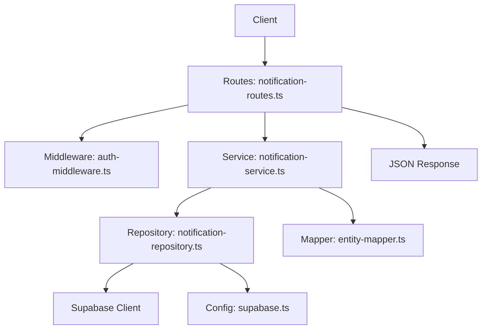
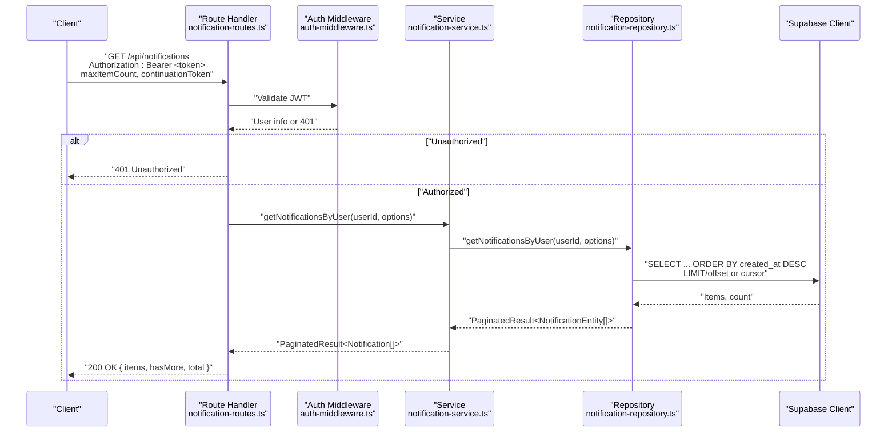
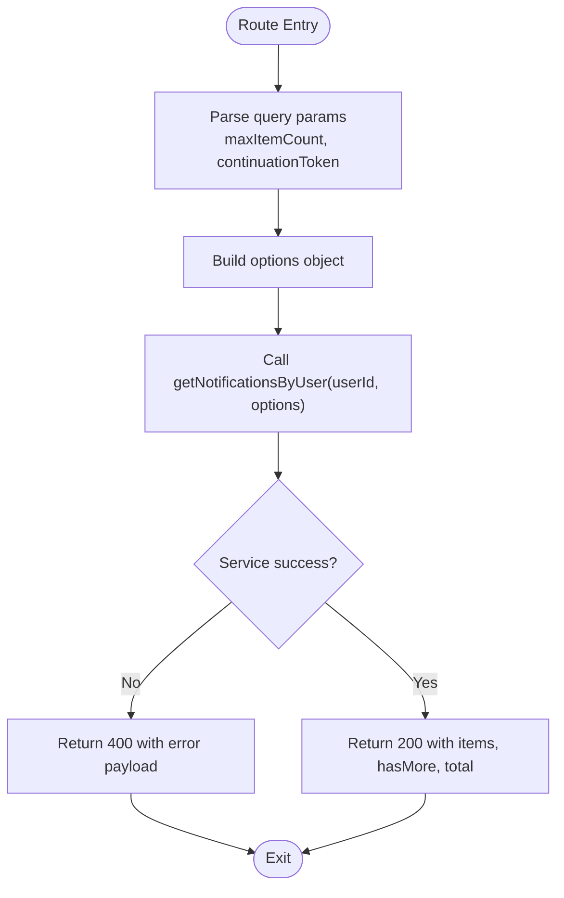
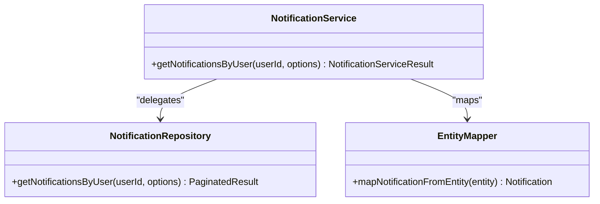
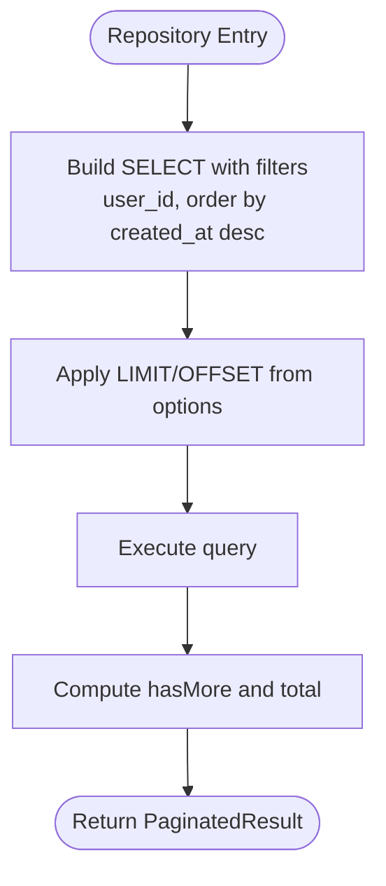
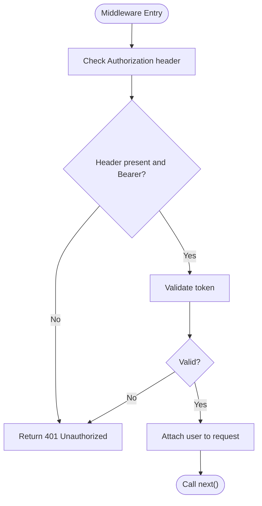
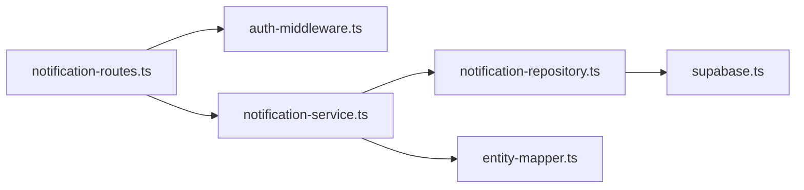

# Retrieve Notifications

<cite>
**Referenced Files in This Document**
- [notification-routes.ts](file://src/routes/notification-routes.ts)
- [notification-service.ts](file://src/services/notification-service.ts)
- [notification-repository.ts](file://src/repositories/notification-repository.ts)
- [base-repository.ts](file://src/repositories/base-repository.ts)
- [entity-mapper.ts](file://src/utils/entity-mapper.ts)
- [auth-middleware.ts](file://src/middleware/auth-middleware.ts)
- [supabase.ts](file://src/config/supabase.ts)
- [API-DOCUMENTATION.md](file://docs/API-DOCUMENTATION.md)
</cite>

## Table of Contents
1. [Introduction](#introduction)
2. [Project Structure](#project-structure)
3. [Core Components](#core-components)
4. [Architecture Overview](#architecture-overview)
5. [Detailed Component Analysis](#detailed-component-analysis)
6. [Dependency Analysis](#dependency-analysis)
7. [Performance Considerations](#performance-considerations)
8. [Troubleshooting Guide](#troubleshooting-guide)
9. [Conclusion](#conclusion)
10. [Appendices](#appendices)

## Introduction
This document provides API documentation for retrieving a user’s notifications via the GET /api/notifications endpoint. It covers the HTTP method, query parameters for pagination, response format, and the integration between the route handler, service layer, and database layer. It also explains how continuation tokens enable efficient cursor-based pagination for large datasets, and offers guidance for client-side implementation and error handling.

## Project Structure
The notifications feature is implemented across several layers:
- Route handler: defines the endpoint, validates JWT, parses query parameters, and returns paginated results.
- Service layer: orchestrates business logic and delegates database operations.
- Repository layer: encapsulates database queries using Supabase client.
- Entity mapping: converts database entities to API models.
- Middleware: enforces JWT authentication.
- Configuration: exposes table names and Supabase client.

**Diagram sources**
- [notification-routes.ts](file://src/routes/notification-routes.ts#L83-L118)
- [auth-middleware.ts](file://src/middleware/auth-middleware.ts#L25-L70)
- [notification-service.ts](file://src/services/notification-service.ts#L80-L94)
- [notification-repository.ts](file://src/repositories/notification-repository.ts#L41-L60)
- [supabase.ts](file://src/config/supabase.ts#L1-L45)
- [entity-mapper.ts](file://src/utils/entity-mapper.ts#L373-L409)

**Section sources**
- [notification-routes.ts](file://src/routes/notification-routes.ts#L83-L118)
- [notification-service.ts](file://src/services/notification-service.ts#L80-L94)
- [notification-repository.ts](file://src/repositories/notification-repository.ts#L41-L60)
- [auth-middleware.ts](file://src/middleware/auth-middleware.ts#L25-L70)
- [supabase.ts](file://src/config/supabase.ts#L1-L45)
- [entity-mapper.ts](file://src/utils/entity-mapper.ts#L373-L409)

## Core Components
- Endpoint: GET /api/notifications
- Authentication: Bearer token required via Authorization header
- Query parameters:
  - maxItemCount (integer, min 1, max 100): controls the number of items returned
  - continuationToken (string): cursor token for pagination
- Response format:
  - items: array of notifications
  - hasMore: boolean indicating if more pages exist
  - total: optional total count when supported by the underlying query

Each notification includes:
- id: string
- userId: string
- type: enum of supported notification types
- title: string
- message: string
- data: object with relevant metadata
- isRead: boolean
- createdAt: ISO timestamp

Supported notification types include proposal_received, proposal_accepted, proposal_rejected, milestone_submitted, milestone_approved, payment_released, dispute_created, dispute_resolved, rating_received, and message.

**Section sources**
- [notification-routes.ts](file://src/routes/notification-routes.ts#L41-L83)
- [notification-service.ts](file://src/services/notification-service.ts#L80-L94)
- [notification-repository.ts](file://src/repositories/notification-repository.ts#L41-L60)
- [entity-mapper.ts](file://src/utils/entity-mapper.ts#L373-L409)
- [API-DOCUMENTATION.md](file://docs/API-DOCUMENTATION.md#L591-L609)

## Architecture Overview
The GET /api/notifications flow integrates the route handler, authentication middleware, service, repository, and Supabase client.

**Diagram sources**
- [notification-routes.ts](file://src/routes/notification-routes.ts#L83-L118)
- [auth-middleware.ts](file://src/middleware/auth-middleware.ts#L25-L70)
- [notification-service.ts](file://src/services/notification-service.ts#L80-L94)
- [notification-repository.ts](file://src/repositories/notification-repository.ts#L41-L60)

## Detailed Component Analysis

### Route Handler: GET /api/notifications
- Validates JWT via auth middleware and extracts user identity.
- Parses query parameters maxItemCount and continuationToken.
- Calls service function getNotificationsByUser with userId and options.
- Returns JSON response with items, hasMore, and total.

**Diagram sources**
- [notification-routes.ts](file://src/routes/notification-routes.ts#L83-L118)
- [notification-service.ts](file://src/services/notification-service.ts#L80-L94)

**Section sources**
- [notification-routes.ts](file://src/routes/notification-routes.ts#L83-L118)

### Service Layer: NotificationService
- getNotificationsByUser(userId, options):
  - Delegates to repository getNotificationsByUser.
  - Maps NotificationEntity[] to Notification[] using entity-mapper.
  - Wraps result in PaginatedResult with hasMore and total.

**Diagram sources**
- [notification-service.ts](file://src/services/notification-service.ts#L80-L94)
- [notification-repository.ts](file://src/repositories/notification-repository.ts#L41-L60)
- [entity-mapper.ts](file://src/utils/entity-mapper.ts#L373-L409)

**Section sources**
- [notification-service.ts](file://src/services/notification-service.ts#L80-L94)

### Repository Layer: NotificationRepository
- getNotificationsByUser(userId, options):
  - Uses Supabase client to select notifications for the given user.
  - Orders by created_at descending.
  - Applies LIMIT and OFFSET derived from options.
  - Computes hasMore and total count.

**Diagram sources**
- [notification-repository.ts](file://src/repositories/notification-repository.ts#L41-L60)
- [base-repository.ts](file://src/repositories/base-repository.ts#L129-L147)

**Section sources**
- [notification-repository.ts](file://src/repositories/notification-repository.ts#L41-L60)
- [base-repository.ts](file://src/repositories/base-repository.ts#L129-L147)

### Authentication Middleware
- Ensures Authorization header is present and formatted as Bearer <token>.
- Validates token and attaches user info to request.
- Returns 401 for missing/invalid/expired tokens.

**Diagram sources**
- [auth-middleware.ts](file://src/middleware/auth-middleware.ts#L25-L70)

**Section sources**
- [auth-middleware.ts](file://src/middleware/auth-middleware.ts#L25-L70)

### Response Format and Example
- Response shape:
  - items: array of notifications
  - hasMore: boolean
  - total: number (optional)
- Example request:
  - Method: GET
  - Path: /api/notifications
  - Headers: Authorization: Bearer <JWT>
  - Query: maxItemCount=50
- Example paginated response:
  - items: [
    { id, userId, type, title, message, data, isRead, createdAt },
    ...
  ]
  - hasMore: true
  - total: 1200

Note: The repository currently uses LIMIT/OFFSET semantics. The route handler documents continuationToken for pagination. For cursor-based pagination, the repository would need to be adapted to accept a cursor token and translate it into a LIMIT/OFFSET or equivalent query.

**Section sources**
- [notification-routes.ts](file://src/routes/notification-routes.ts#L41-L83)
- [notification-service.ts](file://src/services/notification-service.ts#L80-L94)
- [notification-repository.ts](file://src/repositories/notification-repository.ts#L41-L60)
- [API-DOCUMENTATION.md](file://docs/API-DOCUMENTATION.md#L591-L609)

## Dependency Analysis
- Route handler depends on:
  - auth-middleware for JWT validation
  - notification-service for business logic
- Service depends on:
  - notification-repository for data access
  - entity-mapper for model conversion
- Repository depends on:
  - Supabase client from configuration
  - TABLES constant for table name

**Diagram sources**
- [notification-routes.ts](file://src/routes/notification-routes.ts#L83-L118)
- [auth-middleware.ts](file://src/middleware/auth-middleware.ts#L25-L70)
- [notification-service.ts](file://src/services/notification-service.ts#L80-L94)
- [notification-repository.ts](file://src/repositories/notification-repository.ts#L41-L60)
- [supabase.ts](file://src/config/supabase.ts#L1-L45)
- [entity-mapper.ts](file://src/utils/entity-mapper.ts#L373-L409)

**Section sources**
- [notification-routes.ts](file://src/routes/notification-routes.ts#L83-L118)
- [notification-service.ts](file://src/services/notification-service.ts#L80-L94)
- [notification-repository.ts](file://src/repositories/notification-repository.ts#L41-L60)
- [auth-middleware.ts](file://src/middleware/auth-middleware.ts#L25-L70)
- [supabase.ts](file://src/config/supabase.ts#L1-L45)
- [entity-mapper.ts](file://src/utils/entity-mapper.ts#L373-L409)

## Performance Considerations
- Cursor-based pagination:
  - The route handler documents continuationToken, but the repository currently uses LIMIT/OFFSET. For very large datasets, cursor-based pagination (using a cursor derived from the last item’s created_at and id) can reduce scanning overhead compared to OFFSET.
- Sorting and indexing:
  - Queries sort by created_at DESC. Ensure database indexes exist on user_id and created_at for optimal performance.
- Batch size:
  - maxItemCount controls batch size. Keep reasonable limits (e.g., 50–100) to balance latency and round-trips.
- Total count:
  - Exact count queries can be expensive. Consider returning total only when needed or caching counts.

[No sources needed since this section provides general guidance]

## Troubleshooting Guide
Common issues and resolutions:
- 401 Unauthorized:
  - Missing or invalid Authorization header. Ensure Bearer <token> is sent.
  - Expired token: client should refresh or re-authenticate.
- 400 Bad Request:
  - Validation errors from service or repository. Check query parameters and retry.
- 500 Internal Server Error:
  - Database connectivity or query failures. Verify Supabase configuration and network.

Client-side guidance:
- Infinite scroll:
  - On initial load, call GET /api/notifications with maxItemCount.
  - On subsequent loads, pass continuationToken to fetch next page.
  - Stop when hasMore is false.
- Error handling:
  - 401: prompt user to log in again or refresh token.
  - 403: inform user lacks permission.
  - 404: handle missing resource scenarios gracefully.
  - 400: display validation messages and allow retry.

**Section sources**
- [auth-middleware.ts](file://src/middleware/auth-middleware.ts#L25-L70)
- [notification-service.ts](file://src/services/notification-service.ts#L114-L151)
- [notification-repository.ts](file://src/repositories/notification-repository.ts#L41-L60)
- [API-DOCUMENTATION.md](file://docs/API-DOCUMENTATION.md#L611-L642)

## Conclusion
The GET /api/notifications endpoint provides paginated access to a user’s notifications with JWT authentication. While the route handler documents continuationToken, the current repository implementation uses LIMIT/OFFSET. For large-scale deployments, adopting cursor-based pagination in the repository would improve performance. Clients should implement infinite scroll with maxItemCount and continuationToken, and handle 401/403/404/400 responses appropriately.

[No sources needed since this section summarizes without analyzing specific files]

## Appendices

### API Definition: GET /api/notifications
- Method: GET
- Path: /api/notifications
- Authentication: Bearer <token>
- Query Parameters:
  - maxItemCount (integer, min 1, max 100)
  - continuationToken (string)
- Response:
  - 200 OK: { items: Notification[], hasMore: boolean, total?: number }
  - 400 Bad Request: error payload
  - 401 Unauthorized: error payload
- Example request:
  - Authorization: Bearer <JWT>
  - maxItemCount: 50
- Example response:
  - items: Array of notifications
  - hasMore: true/false
  - total: optional

**Section sources**
- [notification-routes.ts](file://src/routes/notification-routes.ts#L41-L83)
- [API-DOCUMENTATION.md](file://docs/API-DOCUMENTATION.md#L591-L609)