# API Endpoints Reference

<cite>
**Referenced Files in This Document**   
- [swagger.ts](file://src/config/swagger.ts)
- [auth-routes.ts](file://src/routes/auth-routes.ts)
- [project-routes.ts](file://src/routes/project-routes.ts)
- [proposal-routes.ts](file://src/routes/proposal-routes.ts)
- [contract-routes.ts](file://src/routes/contract-routes.ts)
- [payment-routes.ts](file://src/routes/payment-routes.ts)
- [dispute-routes.ts](file://src/routes/dispute-routes.ts)
- [notification-routes.ts](file://src/routes/notification-routes.ts)
- [kyc-routes.ts](file://src/routes/kyc-routes.ts)
- [matching-routes.ts](file://src/routes/matching-routes.ts)
- [search-routes.ts](file://src/routes/search-routes.ts)
- [rate-limiter.ts](file://src/middleware/rate-limiter.ts)
- [auth-middleware.ts](file://src/middleware/auth-middleware.ts)
</cite>

## Table of Contents
1. [Introduction](#introduction)
2. [Authentication Endpoints](#authentication-endpoints)
3. [Projects Endpoints](#projects-endpoints)
4. [Proposals Endpoints](#proposals-endpoints)
5. [Contracts Endpoints](#contracts-endpoints)
6. [Payments Endpoints](#payments-endpoints)
7. [Disputes Endpoints](#disputes-endpoints)
8. [Notifications Endpoints](#notifications-endpoints)
9. [KYC Endpoints](#kyc-endpoints)
10. [Matching Endpoints](#matching-endpoints)
11. [Search Endpoints](#search-endpoints)
12. [Error Handling](#error-handling)
13. [Rate Limiting Policies](#rate-limiting-policies)
14. [Client Implementation Examples](#client-implementation-examples)
15. [Versioning Strategy](#versioning-strategy)

## Introduction
This document provides comprehensive API documentation for the FreelanceXchain system, a decentralized freelance marketplace with AI skill matching and blockchain payments. The API follows RESTful principles and uses JWT for authentication. All endpoints are versioned through the base URL path `/api` and return JSON responses.

The API is organized into logical groups based on functionality:
- **Authentication**: User registration, login, and token management
- **Projects**: Project creation, management, and discovery
- **Proposals**: Freelancer submissions for projects
- **Contracts**: Agreement management between parties
- **Payments**: Milestone-based payment processing
- **Disputes**: Conflict resolution for payment issues
- **Notifications**: Real-time communication between users
- **KYC**: Identity verification and compliance
- **Matching**: AI-powered skill and project recommendations
- **Search**: Filtering and discovery of projects and freelancers

All endpoints require authentication via JWT bearer tokens, except for public endpoints like health checks and OAuth initiation. The API uses consistent error response formats and implements rate limiting to prevent abuse.

**Section sources**
- [swagger.ts](file://src/config/swagger.ts#L1-L233)
- [app.ts](file://src/app.ts#L1-L87)

## Authentication Endpoints

The authentication system provides standard user registration and login functionality with JWT token management. It also supports OAuth integration with external providers (Google, GitHub, Azure, LinkedIn) through Supabase.

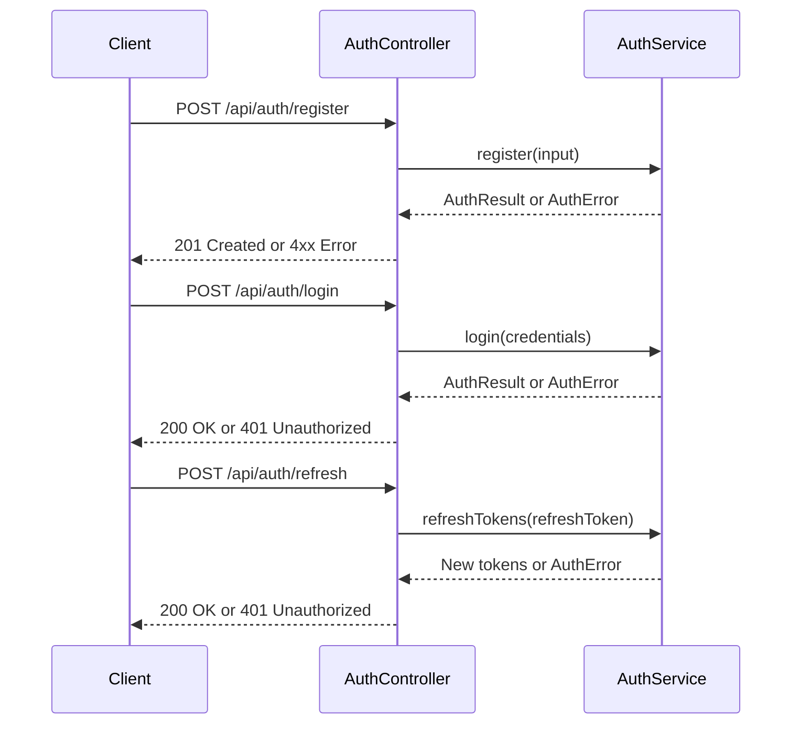

**Diagram sources**
- [auth-routes.ts](file://src/routes/auth-routes.ts#L1-L800)
- [auth-middleware.ts](file://src/middleware/auth-middleware.ts#L1-L101)

### User Registration
Registers a new user account and returns authentication tokens.

**HTTP Method**: `POST`  
**URL Pattern**: `/api/auth/register`  
**Authentication Required**: No  
**Rate Limit**: 10 attempts per 15 minutes

**Request Body**:
```json
{
  "email": "user@example.com",
  "password": "securePassword123",
  "role": "freelancer",
  "name": "John Doe",
  "walletAddress": "0x742d35Cc6634C0532925a3b8D4C0cD1111111111"
}
```

**Response (201 Created)**:
```json
{
  "user": {
    "id": "uuid",
    "email": "user@example.com",
    "role": "freelancer",
    "walletAddress": "0x742d35Cc6634C0532925a3b8D4C0cD1111111111",
    "createdAt": "2023-01-01T00:00:00Z",
    "updatedAt": "2023-01-01T00:00:00Z"
  },
  "accessToken": "jwt-token",
  "refreshToken": "refresh-token"
}
```

**Error Codes**:
- `400`: Validation error (invalid email, weak password, etc.)
- `409`: Email already registered

### User Login
Authenticates a user and returns JWT tokens.

**HTTP Method**: `POST`  
**URL Pattern**: `/api/auth/login`  
**Authentication Required**: No  
**Rate Limit**: 10 attempts per 15 minutes

**Request Body**:
```json
{
  "email": "user@example.com",
  "password": "securePassword123"
}
```

**Response (200 OK)**:
```json
{
  "user": {
    "id": "uuid",
    "email": "user@example.com",
    "role": "freelancer",
    "walletAddress": "0x742d35Cc6634C0532925a3b8D4C0cD1111111111",
    "createdAt": "2023-01-01T00:00:00Z",
    "updatedAt": "2023-01-01T00:00:00Z"
  },
  "accessToken": "jwt-token",
  "refreshToken": "refresh-token"
}
```

**Error Codes**:
- `400`: Validation error
- `401`: Invalid credentials

### Token Refresh
Uses a refresh token to obtain new access and refresh tokens.

**HTTP Method**: `POST`  
**URL Pattern**: `/api/auth/refresh`  
**Authentication Required**: No  
**Rate Limit**: 10 attempts per 15 minutes

**Request Body**:
```json
{
  "refreshToken": "refresh-token"
}
```

**Response (200 OK)**:
```json
{
  "user": {
    "id": "uuid",
    "email": "user@example.com",
    "role": "freelancer",
    "walletAddress": "0x742d35Cc6634C0532925a3b8D4C0cD1111111111",
    "createdAt": "2023-01-01T00:00:00Z",
    "updatedAt": "2023-01-01T00:00:00Z"
  },
  "accessToken": "new-jwt-token",
  "refreshToken": "new-refresh-token"
}
```

**Error Codes**:
- `400`: Validation error
- `401`: Invalid or expired refresh token

### OAuth Integration
Supports OAuth login with external providers. The flow involves redirecting to the provider, handling the callback, and exchanging the authorization code for tokens.

**HTTP Method**: `GET`  
**URL Pattern**: `/api/auth/oauth/:provider`  
**Authentication Required**: No  
**Supported Providers**: `google`, `github`, `azure`, `linkedin`

**Response**: 302 redirect to the OAuth provider

**Section sources**
- [auth-routes.ts](file://src/routes/auth-routes.ts#L1-L800)
- [auth-middleware.ts](file://src/middleware/auth-middleware.ts#L1-L101)

## Projects Endpoints

The projects endpoints allow employers to create, manage, and discover projects. Projects represent work opportunities that freelancers can apply to with proposals.

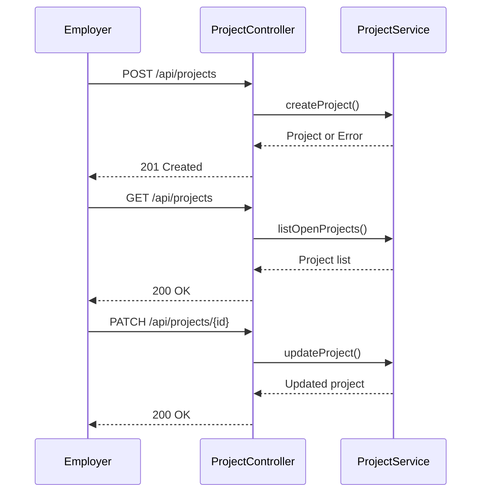

**Diagram sources**
- [project-routes.ts](file://src/routes/project-routes.ts#L1-L684)
- [project-service.ts](file://src/services/project-service.ts#L1-L100)

### Create Project
Creates a new project (employer only).

**HTTP Method**: `POST`  
**URL Pattern**: `/api/projects`  
**Authentication Required**: Yes (Bearer JWT)  
**Required Role**: `employer`  
**Rate Limit**: 100 requests per minute

**Request Body**:
```json
{
  "title": "Web Development Project",
  "description": "Need a full-stack developer for a React and Node.js application",
  "requiredSkills": [
    {
      "skillId": "uuid",
      "yearsOfExperience": 3
    }
  ],
  "budget": 5000,
  "deadline": "2023-12-31T00:00:00Z"
}
```

**Response (201 Created)**:
```json
{
  "id": "uuid",
  "employerId": "uuid",
  "title": "Web Development Project",
  "description": "Need a full-stack developer for a React and Node.js application",
  "requiredSkills": [
    {
      "skillId": "uuid",
      "skillName": "React",
      "categoryId": "uuid",
      "yearsOfExperience": 3
    }
  ],
  "budget": 5000,
  "deadline": "2023-12-31T00:00:00Z",
  "status": "draft",
  "milestones": [],
  "createdAt": "2023-01-01T00:00:00Z",
  "updatedAt": "2023-01-01T00:00:00Z"
}
```

**Error Codes**:
- `400`: Validation error
- `401`: Unauthorized
- `409`: Project locked (has accepted proposals)

### Get Project Details
Retrieves details of a specific project.

**HTTP Method**: `GET`  
**URL Pattern**: `/api/projects/{id}`  
**Authentication Required**: No  
**Rate Limit**: 100 requests per minute

**Response (200 OK)**:
```json
{
  "id": "uuid",
  "employerId": "uuid",
  "title": "Web Development Project",
  "description": "Need a full-stack developer for a React and Node.js application",
  "requiredSkills": [
    {
      "skillId": "uuid",
      "skillName": "React",
      "categoryId": "uuid",
      "yearsOfExperience": 3
    }
  ],
  "budget": 5000,
  "deadline": "2023-12-31T00:00:00Z",
  "status": "open",
  "milestones": [
    {
      "id": "uuid",
      "title": "Initial Design",
      "description": "Create wireframes and UI design",
      "amount": 1000,
      "dueDate": "2023-06-30T00:00:00Z",
      "status": "pending"
    }
  ],
  "createdAt": "2023-01-01T00:00:00Z",
  "updatedAt": "2023-01-01T00:00:00Z"
}
```

**Error Codes**:
- `400`: Invalid UUID format
- `404`: Project not found

### Update Project
Updates an existing project (employer only, project must not have accepted proposals).

**HTTP Method**: `PATCH`  
**URL Pattern**: `/api/projects/{id}`  
**Authentication Required**: Yes (Bearer JWT)  
**Required Role**: `employer`  
**Rate Limit**: 100 requests per minute

**Request Body**:
```json
{
  "title": "Updated Project Title",
  "description": "Updated project description",
  "budget": 6000,
  "status": "open"
}
```

**Response (200 OK)**:
Returns the updated project object in the same format as GET.

**Error Codes**:
- `400`: Validation error
- `401`: Unauthorized
- `404`: Project not found
- `409`: Project locked (has accepted proposals)

### List Projects with Filters
Retrieves a list of open projects with optional filters.

**HTTP Method**: `GET`  
**URL Pattern**: `/api/projects`  
**Authentication Required**: No  
**Rate Limit**: 100 requests per minute

**Query Parameters**:
- `keyword`: Search keyword for title/description
- `skills`: Comma-separated skill IDs
- `minBudget`: Minimum budget filter
- `maxBudget`: Maximum budget filter
- `limit`: Number of results per page (default: 20)
- `continuationToken`: Token for pagination

**Response (200 OK)**:
```json
{
  "items": [
    {
      "id": "uuid",
      "employerId": "uuid",
      "title": "Web Development Project",
      "description": "Need a full-stack developer for a React and Node.js application",
      "requiredSkills": [
        {
          "skillId": "uuid",
          "skillName": "React",
          "categoryId": "uuid",
          "yearsOfExperience": 3
        }
      ],
      "budget": 5000,
      "deadline": "2023-12-31T00:00:00Z",
      "status": "open",
      "milestones": [],
      "createdAt": "2023-01-01T00:00:00Z",
      "updatedAt": "2023-01-01T00:00:00Z"
    }
  ],
  "hasMore": true,
  "continuationToken": "next-page-token"
}
```

### Add Milestones to Project
Sets milestones for a project (employer only, milestone amounts must sum to budget).

**HTTP Method**: `POST`  
**URL Pattern**: `/api/projects/{id}/milestones`  
**Authentication Required**: Yes (Bearer JWT)  
**Required Role**: `employer`  
**Rate Limit**: 100 requests per minute

**Request Body**:
```json
{
  "milestones": [
    {
      "title": "Initial Design",
      "description": "Create wireframes and UI design",
      "amount": 1000,
      "dueDate": "2023-06-30T00:00:00Z"
    },
    {
      "title": "Frontend Development",
      "description": "Implement React components",
      "amount": 2000,
      "dueDate": "2023-07-31T00:00:00Z"
    }
  ]
}
```

**Response (200 OK)**:
Returns the updated project object with milestones.

**Error Codes**:
- `400`: Validation error, milestone sum mismatch
- `401`: Unauthorized
- `404`: Project not found
- `409`: Project locked (has accepted proposals)

### List Proposals for Project
Retrieves all proposals for a specific project (employer only).

**HTTP Method**: `GET`  
**URL Pattern**: `/api/projects/{id}/proposals`  
**Authentication Required**: Yes (Bearer JWT)  
**Required Role**: `employer`  
**Rate Limit**: 100 requests per minute

**Query Parameters**:
- `limit`: Number of results per page (default: 20)
- `continuationToken`: Token for pagination

**Response (200 OK)**:
```json
{
  "items": [
    {
      "id": "uuid",
      "projectId": "uuid",
      "freelancerId": "uuid",
      "coverLetter": "I'm excited to work on this project...",
      "proposedRate": 50,
      "estimatedDuration": 30,
      "status": "pending",
      "createdAt": "2023-01-01T00:00:00Z",
      "updatedAt": "2023-01-01T00:00:00Z"
    }
  ],
  "hasMore": false,
  "continuationToken": null
}
```

**Error Codes**:
- `400`: Invalid UUID format
- `401`: Unauthorized
- `404`: Project not found
- `403`: Forbidden (not project owner)

**Section sources**
- [project-routes.ts](file://src/routes/project-routes.ts#L1-L684)
- [project-service.ts](file://src/services/project-service.ts#L1-L100)

## Proposals Endpoints

The proposals endpoints allow freelancers to submit proposals for projects and employers to manage them. Proposals represent a freelancer's application to work on a project.

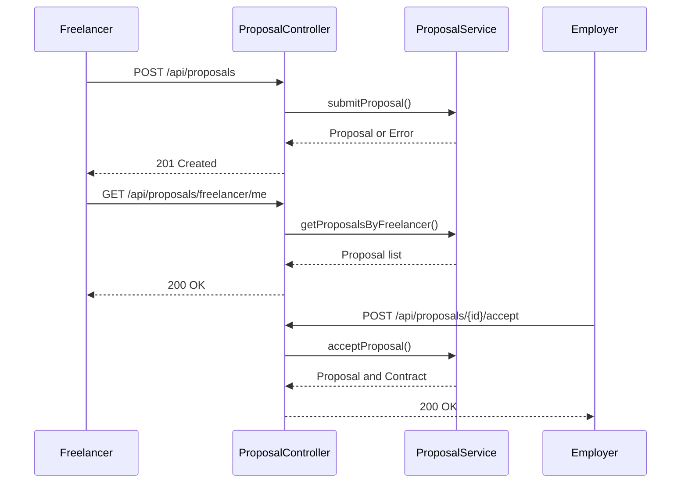

**Diagram sources**
- [proposal-routes.ts](file://src/routes/proposal-routes.ts#L1-L458)
- [proposal-service.ts](file://src/services/proposal-service.ts#L1-L100)

### Submit Proposal
Submit a proposal for a project (freelancer only).

**HTTP Method**: `POST`  
**URL Pattern**: `/api/proposals`  
**Authentication Required**: Yes (Bearer JWT)  
**Required Role**: `freelancer`  
**Rate Limit**: 100 requests per minute

**Request Body**:
```json
{
  "projectId": "uuid",
  "coverLetter": "I'm excited to work on this project because...",
  "proposedRate": 50,
  "estimatedDuration": 30
}
```

**Response (201 Created)**:
```json
{
  "id": "uuid",
  "projectId": "uuid",
  "freelancerId": "uuid",
  "coverLetter": "I'm excited to work on this project because...",
  "proposedRate": 50,
  "estimatedDuration": 30,
  "status": "pending",
  "createdAt": "2023-01-01T00:00:00Z",
  "updatedAt": "2023-01-01T00:00:00Z"
}
```

**Error Codes**:
- `400`: Validation error
- `401`: Unauthorized
- `404`: Project not found
- `409`: Duplicate proposal

### Get Proposal Details
Retrieves details of a specific proposal.

**HTTP Method**: `GET`  
**URL Pattern**: `/api/proposals/{id}`  
**Authentication Required**: Yes (Bearer JWT)  
**Rate Limit**: 100 requests per minute

**Response (200 OK)**:
Returns the proposal object in the same format as POST.

**Error Codes**:
- `400`: Invalid UUID format
- `401`: Unauthorized
- `404`: Proposal not found

### Get My Proposals
Retrieves all proposals submitted by the authenticated freelancer.

**HTTP Method**: `GET`  
**URL Pattern**: `/api/proposals/freelancer/me`  
**Authentication Required**: Yes (Bearer JWT)  
**Required Role**: `freelancer`  
**Rate Limit**: 100 requests per minute

**Response (200 OK)**:
```json
[
  {
    "id": "uuid",
    "projectId": "uuid",
    "freelancerId": "uuid",
    "coverLetter": "I'm excited to work on this project because...",
    "proposedRate": 50,
    "estimatedDuration": 30,
    "status": "pending",
    "createdAt": "2023-01-01T00:00:00Z",
    "updatedAt": "2023-01-01T00:00:00Z"
  }
]
```

**Error Codes**:
- `401`: Unauthorized

### Accept Proposal
Accept a proposal and create a contract (employer only).

**HTTP Method**: `POST`  
**URL Pattern**: `/api/proposals/{id}/accept`  
**Authentication Required**: Yes (Bearer JWT)  
**Required Role**: `employer`  
**Rate Limit**: 100 requests per minute

**Response (200 OK)**:
```json
{
  "proposal": {
    "id": "uuid",
    "projectId": "uuid",
    "freelancerId": "uuid",
    "coverLetter": "I'm excited to work on this project because...",
    "proposedRate": 50,
    "estimatedDuration": 30,
    "status": "accepted",
    "createdAt": "2023-01-01T00:00:00Z",
    "updatedAt": "2023-01-01T00:00:00Z"
  },
  "contract": {
    "id": "uuid",
    "projectId": "uuid",
    "proposalId": "uuid",
    "freelancerId": "uuid",
    "employerId": "uuid",
    "escrowAddress": "0x742d35Cc6634C0532925a3b8D4C0cD1111111111",
    "totalAmount": 1500,
    "status": "active",
    "createdAt": "2023-01-01T00:00:00Z",
    "updatedAt": "2023-01-01T00:00:00Z"
  }
}
```

**Error Codes**:
- `400`: Invalid proposal status
- `401`: Unauthorized
- `404`: Proposal not found
- `403`: Forbidden (not project owner)

### Reject Proposal
Reject a proposal (employer only).

**HTTP Method**: `POST`  
**URL Pattern**: `/api/proposals/{id}/reject`  
**Authentication Required**: Yes (Bearer JWT)  
**Required Role**: `employer`  
**Rate Limit**: 100 requests per minute

**Response (200 OK)**:
Returns the rejected proposal object.

**Error Codes**:
- `400`: Invalid proposal status
- `401`: Unauthorized
- `404`: Proposal not found
- `403`: Forbidden (not project owner)

### Withdraw Proposal
Withdraw a pending proposal (freelancer only).

**HTTP Method**: `POST`  
**URL Pattern**: `/api/proposals/{id}/withdraw`  
**Authentication Required**: Yes (Bearer JWT)  
**Required Role**: `freelancer`  
**Rate Limit**: 100 requests per minute

**Response (200 OK)**:
Returns the withdrawn proposal object.

**Error Codes**:
- `400`: Invalid proposal status
- `401`: Unauthorized
- `404`: Proposal not found
- `403`: Forbidden (not proposal owner)

**Section sources**
- [proposal-routes.ts](file://src/routes/proposal-routes.ts#L1-L458)
- [proposal-service.ts](file://src/services/proposal-service.ts#L1-L100)

## Contracts Endpoints

The contracts endpoints allow users to retrieve contract information. Contracts represent formal agreements between employers and freelancers for project work.

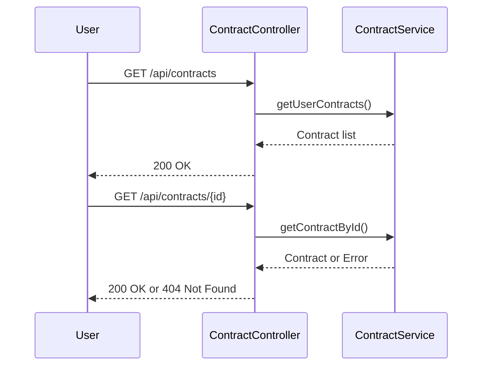

**Diagram sources**
- [contract-routes.ts](file://src/routes/contract-routes.ts#L1-L170)
- [contract-service.ts](file://src/services/contract-service.ts#L1-L100)

### List User's Contracts
Retrieves all contracts for the authenticated user (as freelancer or employer).

**HTTP Method**: `GET`  
**URL Pattern**: `/api/contracts`  
**Authentication Required**: Yes (Bearer JWT)  
**Rate Limit**: 100 requests per minute

**Query Parameters**:
- `limit`: Number of results per page (default: 20)
- `continuationToken`: Token for pagination

**Response (200 OK)**:
```json
{
  "items": [
    {
      "id": "uuid",
      "projectId": "uuid",
      "proposalId": "uuid",
      "freelancerId": "uuid",
      "employerId": "uuid",
      "escrowAddress": "0x742d35Cc6634C0532925a3b8D4C0cD1111111111",
      "totalAmount": 1500,
      "status": "active",
      "createdAt": "2023-01-01T00:00:00Z",
      "updatedAt": "2023-01-01T00:00:00Z"
    }
  ],
  "hasMore": false,
  "continuationToken": null
}
```

**Error Codes**:
- `401`: Unauthorized

### Get Contract Details
Retrieves details of a specific contract.

**HTTP Method**: `GET`  
**URL Pattern**: `/api/contracts/{id}`  
**Authentication Required**: Yes (Bearer JWT)  
**Rate Limit**: 100 requests per minute

**Response (200 OK)**:
Returns the contract object in the same format as above.

**Error Codes**:
- `400`: Invalid UUID format
- `401`: Unauthorized
- `404`: Contract not found

**Section sources**
- [contract-routes.ts](file://src/routes/contract-routes.ts#L1-L170)
- [contract-service.ts](file://src/services/contract-service.ts#L1-L100)

## Payments Endpoints

The payments endpoints handle milestone-based payment processing, including completion requests, approvals, disputes, and status checks.

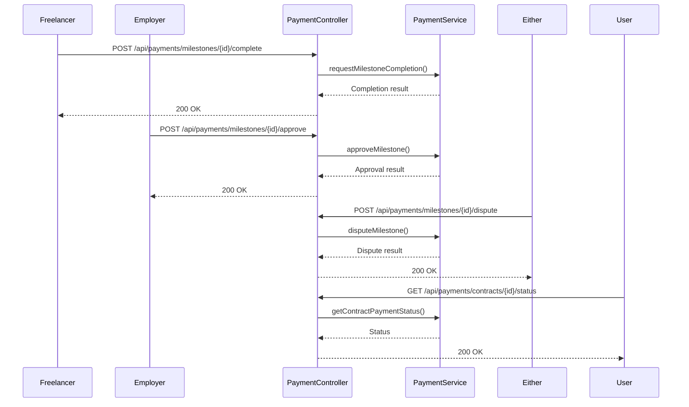

**Diagram sources**
- [payment-routes.ts](file://src/routes/payment-routes.ts#L1-L426)
- [payment-service.ts](file://src/services/payment-service.ts#L1-L100)

### Mark Milestone as Complete
Freelancer marks a milestone as complete, triggering employer notification.

**HTTP Method**: `POST`  
**URL Pattern**: `/api/payments/milestones/{milestoneId}/complete`  
**Authentication Required**: Yes (Bearer JWT)  
**Rate Limit**: 100 requests per minute

**Query Parameters**:
- `contractId`: The contract ID (UUID)

**Response (200 OK)**:
```json
{
  "milestoneId": "uuid",
  "status": "submitted",
  "notificationSent": true
}
```

**Error Codes**:
- `400`: Invalid request
- `401`: Unauthorized
- `404`: Contract or milestone not found
- `403`: Forbidden (not freelancer on contract)

### Approve Milestone Completion
Employer approves milestone completion, triggering payment release.

**HTTP Method**: `POST`  
**URL Pattern**: `/api/payments/milestones/{milestoneId}/approve`  
**Authentication Required**: Yes (Bearer JWT)  
**Rate Limit**: 100 requests per minute

**Query Parameters**:
- `contractId`: The contract ID (UUID)

**Response (200 OK)**:
```json
{
  "milestoneId": "uuid",
  "status": "approved",
  "paymentReleased": true,
  "transactionHash": "0xabc123...",
  "contractCompleted": false
}
```

**Error Codes**:
- `400`: Invalid request
- `401`: Unauthorized
- `404`: Contract or milestone not found
- `403`: Forbidden (not employer on contract)

### Dispute Milestone
Either party disputes a milestone, locking funds and creating a dispute record.

**HTTP Method**: `POST`  
**URL Pattern**: `/api/payments/milestones/{milestoneId}/dispute`  
**Authentication Required**: Yes (Bearer JWT)  
**Rate Limit**: 100 requests per minute

**Query Parameters**:
- `contractId`: The contract ID (UUID)

**Request Body**:
```json
{
  "reason": "The work delivered does not meet the requirements specified in the milestone."
}
```

**Response (200 OK)**:
```json
{
  "milestoneId": "uuid",
  "status": "disputed",
  "disputeId": "uuid",
  "disputeCreated": true
}
```

**Error Codes**:
- `400`: Invalid request
- `401`: Unauthorized
- `404`: Contract or milestone not found

### Get Contract Payment Status
Get detailed payment status for a contract including milestone statuses.

**HTTP Method**: `GET`  
**URL Pattern**: `/api/payments/contracts/{contractId}/status`  
**Authentication Required**: Yes (Bearer JWT)  
**Rate Limit**: 100 requests per minute

**Response (200 OK)**:
```json
{
  "contractId": "uuid",
  "escrowAddress": "0x742d35Cc6634C0532925a3b8D4C0cD1111111111",
  "totalAmount": 1500,
  "releasedAmount": 500,
  "pendingAmount": 1000,
  "milestones": [
    {
      "id": "uuid",
      "title": "Initial Design",
      "amount": 500,
      "status": "approved"
    },
    {
      "id": "uuid",
      "title": "Frontend Development",
      "amount": 1000,
      "status": "submitted"
    }
  ],
  "contractStatus": "in_progress"
}
```

**Error Codes**:
- `400`: Invalid UUID format
- `401`: Unauthorized
- `404`: Contract not found

**Section sources**
- [payment-routes.ts](file://src/routes/payment-routes.ts#L1-L426)
- [payment-service.ts](file://src/services/payment-service.ts#L1-L100)

## Disputes Endpoints

The disputes endpoints handle conflict resolution for payment issues, including dispute creation, evidence submission, and resolution by administrators.

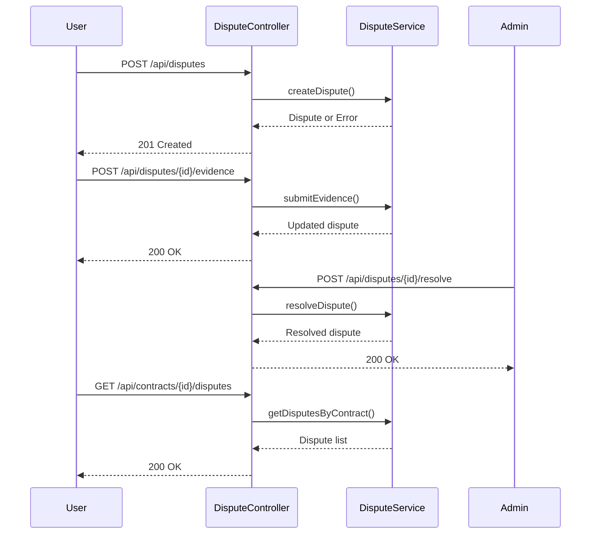

**Diagram sources**
- [dispute-routes.ts](file://src/routes/dispute-routes.ts#L1-L558)
- [dispute-service.ts](file://src/services/dispute-service.ts#L1-L100)

### Create Dispute
Create a dispute for a milestone, locking associated funds.

**HTTP Method**: `POST`  
**URL Pattern**: `/api/disputes`  
**Authentication Required**: Yes (Bearer JWT)  
**Rate Limit**: 100 requests per minute

**Request Body**:
```json
{
  "contractId": "uuid",
  "milestoneId": "uuid",
  "reason": "The work delivered does not meet the requirements specified in the milestone."
}
```

**Response (201 Created)**:
```json
{
  "id": "uuid",
  "contractId": "uuid",
  "milestoneId": "uuid",
  "initiatorId": "uuid",
  "reason": "The work delivered does not meet the requirements specified in the milestone.",
  "evidence": [],
  "status": "open",
  "createdAt": "2023-01-01T00:00:00Z",
  "updatedAt": "2023-01-01T00:00:00Z"
}
```

**Error Codes**:
- `400`: Validation error
- `401`: Unauthorized
- `403`: User not authorized to create dispute
- `404`: Contract or milestone not found
- `409`: Milestone already disputed

### Get Dispute Details
Get details of a specific dispute.

**HTTP Method**: `GET`  
**URL Pattern**: `/api/disputes/{disputeId}`  
**Authentication Required**: Yes (Bearer JWT)  
**Rate Limit**: 100 requests per minute

**Response (200 OK)**:
Returns the dispute object in the same format as POST.

**Error Codes**:
- `400`: Invalid UUID format
- `401`: Unauthorized
- `404`: Dispute not found

### Submit Evidence for Dispute
Submit evidence to support a dispute case.

**HTTP Method**: `POST`  
**URL Pattern**: `/api/disputes/{disputeId}/evidence`  
**Authentication Required**: Yes (Bearer JWT)  
**Rate Limit**: 100 requests per minute

**Request Body**:
```json
{
  "type": "text",
  "content": "The delivered code does not compile and fails to meet the requirements outlined in the milestone description."
}
```

**Response (200 OK)**:
Returns the updated dispute object with the new evidence.

**Error Codes**:
- `400`: Validation error
- `401`: Unauthorized
- `403`: User not authorized to submit evidence
- `404`: Dispute not found

### Resolve Dispute
Admin resolves a dispute, triggering payment based on decision.

**HTTP Method**: `POST`  
**URL Pattern**: `/api/disputes/{disputeId}/resolve`  
**Authentication Required**: Yes (Bearer JWT)  
**Required Role**: `admin`  
**Rate Limit**: 100 requests per minute

**Request Body**:
```json
{
  "decision": "freelancer_favor",
  "reasoning": "After reviewing the evidence, the freelancer has completed the work as specified in the milestone requirements."
}
```

**Response (200 OK)**:
Returns the resolved dispute object with resolution details.

**Error Codes**:
- `400`: Validation error
- `401`: Unauthorized
- `403`: Only administrators can resolve disputes
- `404`: Dispute not found

### List Disputes for Contract
Get all disputes associated with a contract.

**HTTP Method**: `GET`  
**URL Pattern**: `/api/contracts/{contractId}/disputes`  
**Authentication Required**: Yes (Bearer JWT)  
**Rate Limit**: 100 requests per minute

**Response (200 OK)**:
```json
[
  {
    "id": "uuid",
    "contractId": "uuid",
    "milestoneId": "uuid",
    "initiatorId": "uuid",
    "reason": "The work delivered does not meet the requirements specified in the milestone.",
    "evidence": [],
    "status": "resolved",
    "resolution": {
      "decision": "freelancer_favor",
      "reasoning": "After reviewing the evidence, the freelancer has completed the work as specified in the milestone requirements.",
      "resolvedBy": "uuid",
      "resolvedAt": "2023-01-02T00:00:00Z"
    },
    "createdAt": "2023-01-01T00:00:00Z",
    "updatedAt": "2023-01-02T00:00:00Z"
  }
]
```

**Error Codes**:
- `400`: Invalid UUID format
- `401`: Unauthorized
- `403`: User not authorized to view disputes
- `404`: Contract not found

**Section sources**
- [dispute-routes.ts](file://src/routes/dispute-routes.ts#L1-L558)
- [dispute-service.ts](file://src/services/dispute-service.ts#L1-L100)

## Notifications Endpoints

The notifications endpoints allow users to manage their notifications, including retrieving, marking as read, and getting unread counts.

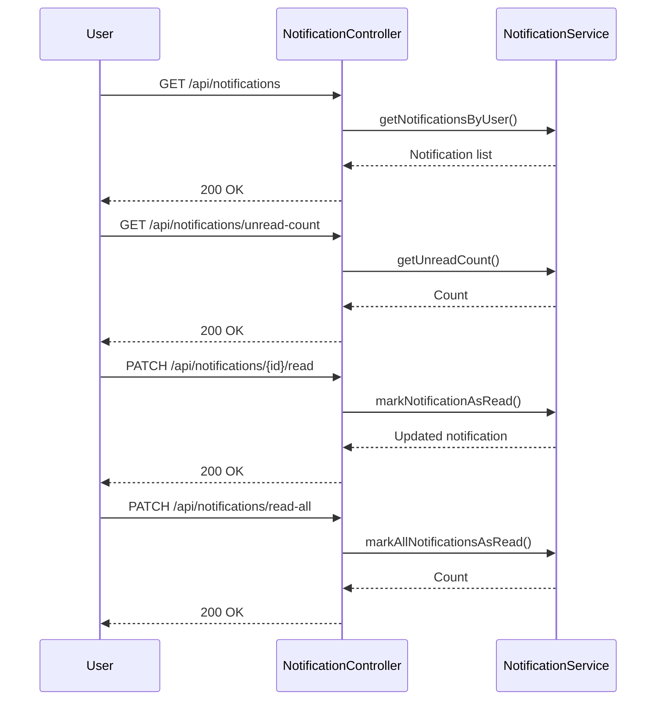

**Diagram sources**
- [notification-routes.ts](file://src/routes/notification-routes.ts#L1-L289)
- [notification-service.ts](file://src/services/notification-service.ts#L1-L100)

### Get User Notifications
Retrieves all notifications for the authenticated user, sorted by creation time (newest first).

**HTTP Method**: `GET`  
**URL Pattern**: `/api/notifications`  
**Authentication Required**: Yes (Bearer JWT)  
**Rate Limit**: 100 requests per minute

**Query Parameters**:
- `maxItemCount`: Maximum number of notifications to return (1-100)
- `continuationToken`: Token for pagination

**Response (200 OK)**:
```json
{
  "items": [
    {
      "id": "uuid",
      "userId": "uuid",
      "type": "proposal_received",
      "title": "New Proposal Received",
      "message": "You have received a new proposal for your project 'Web Development Project'.",
      "data": {
        "projectId": "uuid",
        "proposalId": "uuid",
        "freelancerId": "uuid"
      },
      "isRead": false,
      "createdAt": "2023-01-01T00:00:00Z"
    }
  ],
  "continuationToken": "next-page-token",
  "hasMore": true
}
```

**Error Codes**:
- `401`: Unauthorized

### Get Unread Notification Count
Returns the count of unread notifications for the authenticated user.

**HTTP Method**: `GET`  
**URL Pattern**: `/api/notifications/unread-count`  
**Authentication Required**: Yes (Bearer JWT)  
**Rate Limit**: 100 requests per minute

**Response (200 OK)**:
```json
{
  "count": 5
}
```

**Error Codes**:
- `401`: Unauthorized

### Mark Notification as Read
Marks a specific notification as read.

**HTTP Method**: `PATCH`  
**URL Pattern**: `/api/notifications/{id}/read`  
**Authentication Required**: Yes (Bearer JWT)  
**Rate Limit**: 100 requests per minute

**Response (200 OK)**:
Returns the updated notification object with `isRead: true`.

**Error Codes**:
- `400`: Invalid UUID format
- `401`: Unauthorized
- `404`: Notification not found
- `403`: Forbidden (not notification owner)

### Mark All Notifications as Read
Marks all notifications for the authenticated user as read.

**HTTP Method**: `PATCH`  
**URL Pattern**: `/api/notifications/read-all`  
**Authentication Required**: Yes (Bearer JWT)  
**Rate Limit**: 100 requests per minute

**Response (200 OK)**:
```json
{
  "count": 5
}
```

**Error Codes**:
- `401`: Unauthorized

**Section sources**
- [notification-routes.ts](file://src/routes/notification-routes.ts#L1-L289)
- [notification-service.ts](file://src/services/notification-service.ts#L1-L100)

## KYC Endpoints

The KYC endpoints handle identity verification and compliance, including submission, review, and status checking.

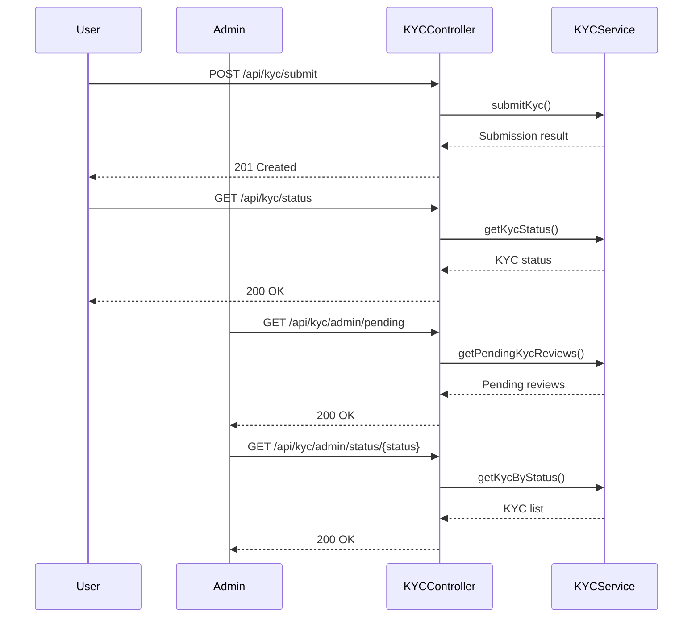

**Diagram sources**
- [kyc-routes.ts](file://src/routes/kyc-routes.ts#L1-L917)
- [kyc-service.ts](file://src/services/kyc-service.ts#L1-L100)

### Get Supported Countries for KYC
Returns list of countries with their KYC requirements.

**HTTP Method**: `GET`  
**URL Pattern**: `/api/kyc/countries`  
**Authentication Required**: No  
**Rate Limit**: 100 requests per minute

**Response (200 OK)**:
```json
[
  {
    "code": "US",
    "name": "United States",
    "supportedDocuments": ["passport", "national_id", "drivers_license"],
    "requiresLiveness": true,
    "requiresAddressProof": true,
    "tier": "standard"
  }
]
```

### Get KYC Requirements for Country
Get KYC requirements for a specific country.

**HTTP Method**: `GET`  
**URL Pattern**: `/api/kyc/countries/{countryCode}`  
**Authentication Required**: No  
**Rate Limit**: 100 requests per minute

**Response (200 OK)**:
Returns the country requirements object in the same format as above.

**Error Codes**:
- `404`: Country not supported

### Get Current User's KYC Status
Get the current user's KYC verification status.

**HTTP Method**: `GET`  
**URL Pattern**: `/api/kyc/status`  
**Authentication Required**: Yes (Bearer JWT)  
**Rate Limit**: 100 requests per minute

**Response (200 OK)**:
```json
{
  "id": "uuid",
  "userId": "uuid",
  "status": "approved",
  "tier": "standard",
  "firstName": "John",
  "lastName": "Doe",
  "nationality": "US",
  "address": {
    "addressLine1": "123 Main St",
    "city": "New York",
    "country": "United States",
    "countryCode": "US"
  },
  "documents": [
    {
      "type": "passport",
      "documentNumber": "P12345678",
      "issuingCountry": "US",
      "frontImageUrl": "https://example.com/passport.jpg"
    }
  ],
  "livenessCheck": {
    "id": "uuid",
    "sessionId": "uuid",
    "status": "passed",
    "confidenceScore": 0.95,
    "challenges": [
      {
        "type": "blink",
        "completed": true,
        "timestamp": "2023-01-01T00:00:00Z"
      }
    ],
    "expiresAt": "2023-01-02T00:00:00Z"
  },
  "faceMatchScore": 0.92,
  "faceMatchStatus": "matched",
  "amlScreeningStatus": "clear",
  "riskLevel": "low"
}
```

**Error Codes**:
- `401`: Unauthorized
- `404`: No KYC verification found

### Submit KYC Verification
Submit identity documents and personal information for international KYC verification.

**HTTP Method**: `POST`  
**URL Pattern**: `/api/kyc/submit`  
**Authentication Required**: Yes (Bearer JWT)  
**Rate Limit**: 100 requests per minute

**Request Body**:
```json
{
  "firstName": "John",
  "lastName": "Doe",
  "dateOfBirth": "1980-01-01",
  "nationality": "US",
  "address": {
    "addressLine1": "123 Main St",
    "city": "New York",
    "country": "United States",
    "countryCode": "US"
  },
  "document": {
    "type": "passport",
    "documentNumber": "P12345678",
    "issuingCountry": "US",
    "frontImageUrl": "https://example.com/passport.jpg"
  },
  "selfieImageUrl": "https://example.com/selfie.jpg",
  "tier": "standard"
}
```

**Response (201 Created)**:
Returns the created KYC verification object.

**Error Codes**:
- `400`: Validation error
- `409`: KYC already pending or approved

### Create Face Liveness Session
Initiates a liveness check session with random challenges.

**HTTP Method**: `POST`  
**URL Pattern**: `/api/kyc/liveness/session`  
**Authentication Required**: Yes (Bearer JWT)  
**Rate Limit**: 100 requests per minute

**Request Body**:
```json
{
  "challenges": ["blink", "smile", "turn_left"]
}
```

**Response (201 Created)**:
```json
{
  "id": "uuid",
  "sessionId": "uuid",
  "status": "pending",
  "challenges": [
    {
      "type": "blink",
      "completed": false,
      "timestamp": null
    }
  ],
  "expiresAt": "2023-01-02T00:00:00Z"
}
```

**Error Codes**:
- `400`: KYC not found or already approved

### Get Current Liveness Session
Get the current liveness session.

**HTTP Method**: `GET`  
**URL Pattern**: `/api/kyc/liveness/session`  
**Authentication Required**: Yes (Bearer JWT)  
**Rate Limit**: 100 requests per minute

**Response (200 OK)**:
Returns the current liveness session object.

**Error Codes**:
- `401`: Unauthorized
- `404`: No active liveness session

### Submit Liveness Verification Results
Submit captured frames and challenge results for liveness verification.

**HTTP Method**: `POST`  
**URL Pattern**: `/api/kyc/liveness/verify`  
**Authentication Required**: Yes (Bearer JWT)  
**Rate Limit**: 100 requests per minute

**Request Body**:
```json
{
  "sessionId": "uuid",
  "capturedFrames": ["base64-image-1", "base64-image-2"],
  "challengeResults": [
    {
      "type": "blink",
      "completed": true,
      "timestamp": "2023-01-01T00:00:00Z"
    }
  ]
}
```

**Response (200 OK)**:
Returns the updated liveness check object.

**Error Codes**:
- `400`: Validation error

### Verify Face Match
Verify face match between selfie and document.

**HTTP Method**: `POST`  
**URL Pattern**: `/api/kyc/face-match`  
**Authentication Required**: Yes (Bearer JWT)  
**Rate Limit**: 100 requests per minute

**Request Body**:
```json
{
  "selfieImageUrl": "https://example.com/selfie.jpg",
  "documentImageUrl": "https://example.com/passport.jpg"
}
```

**Response (200 OK)**:
```json
{
  "matched": true,
  "score": 0.92
}
```

**Error Codes**:
- `400`: Validation error

### Add Additional Document
Add an additional document to KYC verification.

**HTTP Method**: `POST`  
**URL Pattern**: `/api/kyc/documents`  
**Authentication Required**: Yes (Bearer JWT)  
**Rate Limit**: 100 requests per minute

**Request Body**:
```json
{
  "type": "utility_bill",
  "documentNumber": "UB123456",
  "issuingCountry": "US",
  "frontImageUrl": "https://example.com/bill.jpg"
}
```

**Response (200 OK)**:
Returns the updated KYC verification object.

**Error Codes**:
- `400`: Validation error

### Get Pending KYC Reviews
Get pending KYC reviews (Admin only).

**HTTP Method**: `GET`  
**URL Pattern**: `/api/kyc/admin/pending`  
**Authentication Required**: Yes (Bearer JWT)  
**Required Role**: `admin`  
**Rate Limit**: 100 requests per minute

**Response (200 OK)**:
```json
[
  {
    "id": "uuid",
    "userId": "uuid",
    "status": "submitted",
    "firstName": "John",
    "lastName": "Doe",
    "nationality": "US"
  }
]
```

### Get KYC Verifications by Status
Get KYC verifications by status (Admin only).

**HTTP Method**: `GET`  
**URL Pattern**: `/api/kyc/admin/status/{status}`  
**Authentication Required**: Yes (Bearer JWT)  
**Required Role**: `admin`  
**Rate Limit**: 100 requests per minute

**Response (200 OK)**:
Returns a list of KYC verifications with the specified status.

**Error Codes**:
- `400`: Invalid status

**Section sources**
- [kyc-routes.ts](file://src/routes/kyc-routes.ts#L1-L917)
- [kyc-service.ts](file://src/services/kyc-service.ts#L1-L100)

## Matching Endpoints

The matching endpoints provide AI-powered recommendations for projects and freelancers, as well as skill extraction and gap analysis.

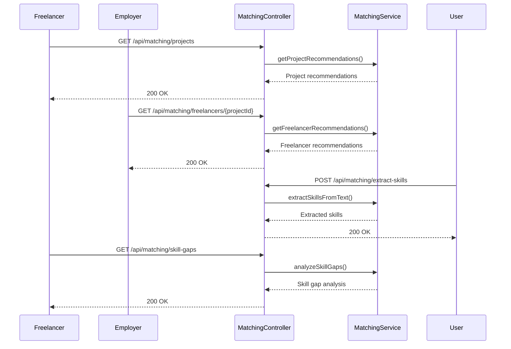

**Diagram sources**
- [matching-routes.ts](file://src/routes/matching-routes.ts#L1-L370)
- [matching-service.ts](file://src/services/matching-service.ts#L1-L100)

### Get Project Recommendations
Returns AI-powered project recommendations for a freelancer, ranked by match score.

**HTTP Method**: `GET`  
**URL Pattern**: `/api/matching/projects`  
**Authentication Required**: Yes (Bearer JWT)  
**Rate Limit**: 100 requests per minute

**Query Parameters**:
- `limit`: Maximum number of recommendations to return (default: 10, max: 50)

**Response (200 OK)**:
```json
[
  {
    "projectId": "uuid",
    "matchScore": 95,
    "matchedSkills": ["React", "Node.js", "TypeScript"],
    "missingSkills": ["GraphQL"],
    "reasoning": "You have strong experience in React and Node.js which are required for this project. Consider learning GraphQL to improve your match score."
  }
]
```

**Error Codes**:
- `401`: Unauthorized
- `404`: Freelancer profile not found

### Get Freelancer Recommendations
Returns AI-powered freelancer recommendations for a project, ranked by combined skill and reputation score.

**HTTP Method**: `GET`  
**URL Pattern**: `/api/matching/freelancers/{projectId}`  
**Authentication Required**: Yes (Bearer JWT)  
**Rate Limit**: 100 requests per minute

**Query Parameters**:
- `limit`: Maximum number of recommendations to return (default: 10, max: 50)

**Response (200 OK)**:
```json
[
  {
    "freelancerId": "uuid",
    "matchScore": 90,
    "reputationScore": 4.8,
    "combinedScore": 92,
    "matchedSkills": ["React", "Node.js", "TypeScript"],
    "reasoning": "This freelancer has excellent skills in React and Node.js with a strong reputation score. They have completed similar projects successfully."
  }
]
```

**Error Codes**:
- `400`: Invalid UUID format
- `401`: Unauthorized
- `404`: Project not found

### Extract Skills from Text
Uses AI to extract and map skills from text to the platform taxonomy.

**HTTP Method**: `POST`  
**URL Pattern**: `/api/matching/extract-skills`  
**Authentication Required**: Yes (Bearer JWT)  
**Rate Limit**: 100 requests per minute

**Request Body**:
```json
{
  "text": "I have 5 years of experience with React, Node.js, and MongoDB. I'm also familiar with Docker and Kubernetes."
}
```

**Response (200 OK)**:
```json
[
  {
    "skillId": "uuid",
    "skillName": "React",
    "confidence": 0.98
  },
  {
    "skillId": "uuid",
    "skillName": "Node.js",
    "confidence": 0.97
  },
  {
    "skillId": "uuid",
    "skillName": "MongoDB",
    "confidence": 0.95
  }
]
```

**Error Codes**:
- `400`: Validation error
- `401`: Unauthorized

### Analyze Skill Gaps
Uses AI to analyze a freelancer's skills and suggest improvements based on market demand.

**HTTP Method**: `GET`  
**URL Pattern**: `/api/matching/skill-gaps`  
**Authentication Required**: Yes (Bearer JWT)  
**Rate Limit**: 100 requests per minute

**Response (200 OK)**:
```json
{
  "currentSkills": ["React", "Node.js", "JavaScript"],
  "recommendedSkills": ["TypeScript", "GraphQL", "Next.js"],
  "marketDemand": [
    {
      "skillName": "TypeScript",
      "demandLevel": "high"
    },
    {
      "skillName": "GraphQL",
      "demandLevel": "medium"
    }
  ],
  "reasoning": "Your skills in React and Node.js are strong, but adding TypeScript would make you more competitive as it's in high demand. GraphQL is also valuable for modern API development."
}
```

**Error Codes**:
- `401`: Unauthorized
- `404`: Freelancer profile not found

**Section sources**
- [matching-routes.ts](file://src/routes/matching-routes.ts#L1-L370)
- [matching-service.ts](file://src/services/matching-service.ts#L1-L100)

## Search Endpoints

The search endpoints provide filtering and discovery capabilities for projects and freelancers.

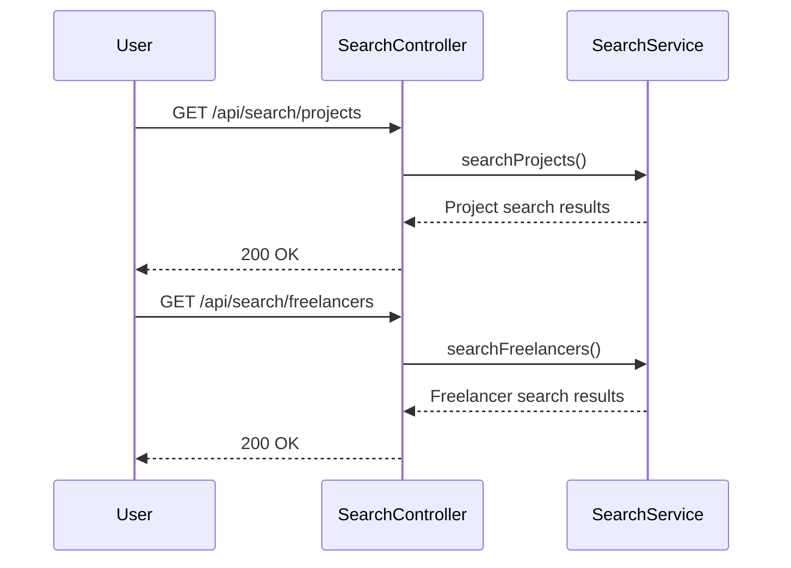

**Diagram sources**
- [search-routes.ts](file://src/routes/search-routes.ts#L1-L267)
- [search-service.ts](file://src/services/search-service.ts#L1-L100)

### Search Projects
Search for projects with keyword, skill, and budget filters.

**HTTP Method**: `GET`  
**URL Pattern**: `/api/search/projects`  
**Authentication Required**: No  
**Rate Limit**: 100 requests per minute

**Query Parameters**:
- `keyword`: Search keyword for title/description
- `skills`: Comma-separated skill IDs to filter by
- `minBudget`: Minimum budget filter
- `maxBudget`: Maximum budget filter
- `pageSize`: Number of results per page (default: 20, max: 100)
- `continuationToken`: Token for pagination

**Response (200 OK)**:
```json
{
  "items": [
    {
      "id": "uuid",
      "employerId": "uuid",
      "title": "Web Development Project",
      "description": "Need a full-stack developer for a React and Node.js application",
      "requiredSkills": [
        {
          "skillId": "uuid",
          "skillName": "React",
          "categoryId": "uuid",
          "yearsOfExperience": 3
        }
      ],
      "budget": 5000,
      "deadline": "2023-12-31T00:00:00Z",
      "status": "open",
      "milestones": [],
      "createdAt": "2023-01-01T00:00:00Z",
      "updatedAt": "2023-01-01T00:00:00Z"
    }
  ],
  "metadata": {
    "pageSize": 20,
    "hasMore": true,
    "continuationToken": "next-page-token"
  }
}
```

**Error Codes**:
- `400`: Invalid request parameters

### Search Freelancers
Search for freelancers with keyword and skill filters.

**HTTP Method**: `GET`  
**URL Pattern**: `/api/search/freelancers`  
**Authentication Required**: No  
**Rate Limit**: 100 requests per minute

**Query Parameters**:
- `keyword`: Search keyword for bio
- `skills`: Comma-separated skill IDs to filter by
- `pageSize`: Number of results per page (default: 20, max: 100)
- `continuationToken`: Token for pagination

**Response (200 OK)**:
```json
{
  "items": [
    {
      "id": "uuid",
      "userId": "uuid",
      "bio": "Full-stack developer with 5 years of experience in React and Node.js",
      "hourlyRate": 50,
      "skills": [
        {
          "skillId": "uuid",
          "skillName": "React",
          "categoryId": "uuid",
          "yearsOfExperience": 5
        }
      ],
      "experience": [
        {
          "id": "uuid",
          "title": "Senior Developer",
          "company": "Tech Company",
          "description": "Led development of web applications",
          "startDate": "2018-01-01",
          "endDate": null
        }
      ],
      "availability": "available",
      "createdAt": "2023-01-01T00:00:00Z",
      "updatedAt": "2023-01-01T00:00:00Z"
    }
  ],
  "metadata": {
    "pageSize": 20,
    "hasMore": true,
    "continuationToken": "next-page-token"
  }
}
```

**Error Codes**:
- `400`: Invalid request parameters

**Section sources**
- [search-routes.ts](file://src/routes/search-routes.ts#L1-L267)
- [search-service.ts](file://src/services/search-service.ts#L1-L100)

## Error Handling

The API uses a consistent error response format across all endpoints. Error responses include a standardized structure with error code, message, timestamp, and request ID for debugging.

**Error Response Format**:
```json
{
  "error": {
    "code": "string",
    "message": "string",
    "details": [
      {
        "field": "string",
        "message": "string",
        "value": {}
      }
    ]
  },
  "timestamp": "2023-01-01T00:00:00Z",
  "requestId": "uuid"
}
```

### Common Error Codes

| Error Code | HTTP Status | Description |
|------------|-------------|-------------|
| `VALIDATION_ERROR` | 400 | Request data failed validation |
| `AUTH_MISSING_TOKEN` | 401 | Authorization header is required |
| `AUTH_INVALID_FORMAT` | 401 | Authorization header must be in format: Bearer <token> |
| `AUTH_TOKEN_EXPIRED` | 401 | JWT token has expired |
| `AUTH_INVALID_TOKEN` | 401 | Invalid JWT token |
| `AUTH_UNAUTHORIZED` | 401 | Authentication required |
| `AUTH_FORBIDDEN` | 403 | Insufficient permissions |
| `NOT_FOUND` | 404 | Resource not found |
| `RATE_LIMIT_EXCEEDED` | 429 | Too many requests, please try again later |

### Error Response Examples

**Validation Error**:
```json
{
  "error": {
    "code": "VALIDATION_ERROR",
    "message": "Invalid request data",
    "details": [
      {
        "field": "email",
        "message": "Valid email is required"
      },
      {
        "field": "password",
        "message": "Password must contain at least 8 characters"
      }
    ]
  },
  "timestamp": "2023-01-01T00:00:00Z",
  "requestId": "uuid"
}
```

**Authentication Error**:
```json
{
  "error": {
    "code": "AUTH_INVALID_CREDENTIALS",
    "message": "Invalid email or password"
  },
  "timestamp": "2023-01-01T00:00:00Z",
  "requestId": "uuid"
}
```

**Not Found Error**:
```json
{
  "error": {
    "code": "NOT_FOUND",
    "message": "Project not found"
  },
  "timestamp": "2023-01-01T00:00:00Z",
  "requestId": "uuid"
}
```

**Rate Limit Exceeded**:
```json
{
  "error": {
    "code": "RATE_LIMIT_EXCEEDED",
    "message": "Too many requests, please try again later"
  },
  "retryAfter": 45,
  "timestamp": "2023-01-01T00:00:00Z",
  "requestId": "uuid"
}
```

**Section sources**
- [swagger.ts](file://src/config/swagger.ts#L1-L233)
- [error-handler.ts](file://src/middleware/error-handler.ts#L1-L50)

## Rate Limiting Policies

The API implements rate limiting to prevent abuse and ensure fair usage. Different endpoints have different rate limits based on their sensitivity and usage patterns.

### Rate Limiter Configuration

The rate limiting is implemented through the `rate-limiter.ts` middleware with three preset configurations:

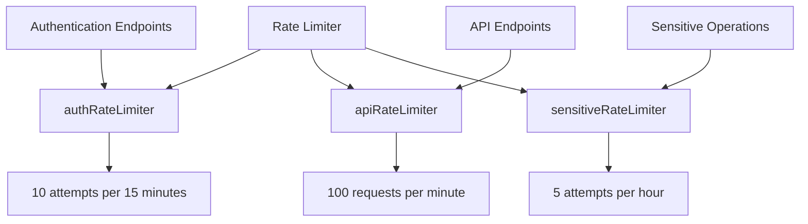

**Diagram sources**
- [rate-limiter.ts](file://src/middleware/rate-limiter.ts#L1-L81)

### Rate Limiting Rules

| Endpoint Group | Rate Limit | Window | Description |
|----------------|------------|--------|-------------|
| Authentication | 10 attempts | 15 minutes | Applies to login, registration, and token refresh |
| API Endpoints | 100 requests | 1 minute | Applies to all authenticated API endpoints |
| Sensitive Operations | 5 attempts | 1 hour | Applies to sensitive operations like KYC submission |

### Rate Limit Headers

When a rate limit is exceeded, the API returns a `429 Too Many Requests` response with the following headers:

- `Retry-After`: Number of seconds to wait before making another request
- `X-RateLimit-Limit`: The maximum number of requests in the rate limit window
- `X-RateLimit-Remaining`: The number of requests remaining in the current window
- `X-RateLimit-Reset`: The time at which the current rate limit window resets

### Rate Limit Response

When the rate limit is exceeded, the API returns:

**HTTP Status**: `429 Too Many Requests`  
**Response Body**:
```json
{
  "error": {
    "code": "RATE_LIMIT_EXCEEDED",
    "message": "Too many requests, please try again later"
  },
  "retryAfter": 45,
  "timestamp": "2023-01-01T00:00:00Z",
  "requestId": "uuid"
}
```

**Section sources**
- [rate-limiter.ts](file://src/middleware/rate-limiter.ts#L1-L81)
- [auth-routes.ts](file://src/routes/auth-routes.ts#L1-L800)

## Client Implementation Examples

This section provides examples of how to implement client-side code for common operations using JavaScript/TypeScript.

### User Login Example

```typescript
async function login(email: string, password: string): Promise<AuthResult> {
  const response = await fetch('/api/auth/login', {
    method: 'POST',
    headers: {
      'Content-Type': 'application/json',
    },
    body: JSON.stringify({ email, password }),
  });

  if (!response.ok) {
    const error = await response.json();
    throw new Error(error.error.message);
  }

  return response.json();
}

// Usage
try {
  const authResult = await login('user@example.com', 'password123');
  // Store tokens for future requests
  localStorage.setItem('accessToken', authResult.accessToken);
  localStorage.setItem('refreshToken', authResult.refreshToken);
} catch (error) {
  console.error('Login failed:', error.message);
}
```

### Project Creation Example

```typescript
async function createProject(projectData: ProjectInput): Promise<Project> {
  const accessToken = localStorage.getItem('accessToken');
  
  const response = await fetch('/api/projects', {
    method: 'POST',
    headers: {
      'Content-Type': 'application/json',
      'Authorization': `Bearer ${accessToken}`,
    },
    body: JSON.stringify(projectData),
  });

  if (!response.ok) {
    const error = await response.json();
    throw new Error(error.error.message);
  }

  return response.json();
}

// Usage
try {
  const newProject = await createProject({
    title: 'Web Development Project',
    description: 'Need a full-stack developer for a React and Node.js application',
    requiredSkills: [{ skillId: 'uuid', yearsOfExperience: 3 }],
    budget: 5000,
    deadline: '2023-12-31T00:00:00Z',
  });
  console.log('Project created:', newProject);
} catch (error) {
  console.error('Project creation failed:', error.message);
}
```

### Proposal Submission Example

```typescript
async function submitProposal(proposalData: ProposalInput): Promise<Proposal> {
  const accessToken = localStorage.getItem('accessToken');
  
  const response = await fetch('/api/proposals', {
    method: 'POST',
    headers: {
      'Content-Type': 'application/json',
      'Authorization': `Bearer ${accessToken}`,
    },
    body: JSON.stringify(proposalData),
  });

  if (!response.ok) {
    const error = await response.json();
    throw new Error(error.error.message);
  }

  return response.json();
}

// Usage
try {
  const proposal = await submitProposal({
    projectId: 'uuid',
    coverLetter: 'I have extensive experience with React and Node.js...',
    proposedRate: 50,
    estimatedDuration: 30,
  });
  console.log('Proposal submitted:', proposal);
} catch (error) {
  console.error('Proposal submission failed:', error.message);
}
```

### Contract Initiation Example

```typescript
async function acceptProposal(proposalId: string): Promise<ContractResult> {
  const accessToken = localStorage.getItem('accessToken');
  
  const response = await fetch(`/api/proposals/${proposalId}/accept`, {
    method: 'POST',
    headers: {
      'Authorization': `Bearer ${accessToken}`,
    },
  });

  if (!response.ok) {
    const error = await response.json();
    throw new Error(error.error.message);
  }

  return response.json();
}

// Usage
try {
  const result = await acceptProposal('proposal-uuid');
  console.log('Contract created:', result.contract);
  console.log('Proposal accepted:', result.proposal);
} catch (error) {
  console.error('Contract initiation failed:', error.message);
}
```

### Payment Release Example

```typescript
async function approveMilestone(milestoneId: string, contractId: string): Promise<MilestoneApprovalResult> {
  const accessToken = localStorage.getItem('accessToken');
  
  const response = await fetch(`/api/payments/milestones/${milestoneId}/approve?contractId=${contractId}`, {
    method: 'POST',
    headers: {
      'Authorization': `Bearer ${accessToken}`,
    },
  });

  if (!response.ok) {
    const error = await response.json();
    throw new Error(error.error.message);
  }

  return response.json();
}

// Usage
try {
  const result = await approveMilestone('milestone-uuid', 'contract-uuid');
  console.log('Payment released:', result.paymentReleased);
  console.log('Transaction hash:', result.transactionHash);
} catch (error) {
  console.error('Payment release failed:', error.message);
}
```

### Handling Authentication Headers

```typescript
// Function to create authenticated API requests
async function apiRequest<T>(url: string, options: RequestInit = {}): Promise<T> {
  // Get access token from storage
  const accessToken = localStorage.getItem('accessToken');
  
  // Add authorization header
  const headers = {
    'Content-Type': 'application/json',
    'Authorization': `Bearer ${accessToken}`,
    ...options.headers,
  };

  const config: RequestInit = {
    ...options,
    headers,
  };

  const response = await fetch(url, config);

  // Handle token expiration
  if (response.status === 401) {
    const error = await response.json();
    if (error.error.code === 'AUTH_TOKEN_EXPIRED') {
      // Try to refresh token
      const refreshed = await refreshTokens();
      if (refreshed) {
        // Retry request with new token
        return apiRequest<T>(url, options);
      } else {
        // Redirect to login
        window.location.href = '/login';
        throw new Error('Authentication required');
      }
    }
  }

  if (!response.ok) {
    const error = await response.json();
    throw new Error(error.error.message);
  }

  return response.json();
}

// Usage
try {
  const projects = await apiRequest<Project[]>('/api/projects');
  console.log('Projects:', projects);
} catch (error) {
  console.error('API request failed:', error.message);
}
```

### Parsing Responses

```typescript
// Generic function to handle API responses
function handleApiResponse<T>(response: Response): Promise<T> {
  return response.json().then(data => {
    // Check for error structure
    if (data.error && data.error.code) {
      throw new Error(data.error.message);
    }
    return data as T;
  });
}

// Usage with fetch
fetch('/api/projects')
  .then(handleApiResponse<Project[]>)
  .then(projects => {
    console.log('Projects:', projects);
  })
  .catch(error => {
    console.error('Failed to fetch projects:', error.message);
  });
```

**Section sources**
- [auth-routes.ts](file://src/routes/auth-routes.ts#L1-L800)
- [project-routes.ts](file://src/routes/project-routes.ts#L1-L684)
- [proposal-routes.ts](file://src/routes/proposal-routes.ts#L1-L458)
- [contract-routes.ts](file://src/routes/contract-routes.ts#L1-L170)
- [payment-routes.ts](file://src/routes/payment-routes.ts#L1-L426)

## Versioning Strategy

The FreelanceXchain API implements a versioning strategy to ensure backward compatibility and smooth transitions between API versions.

### Base URL Versioning

The API uses base URL versioning with the `/api` prefix. This approach provides a clear and consistent way to identify the API version:

```
https://api.freelancexchain.com/api/v1/projects
https://api.freelancexchain.com/api/v1/proposals
```

Currently, the system uses a single version (`/api`) which serves as version 1. Future versions will be implemented as `/api/v2`, `/api/v3`, etc.

### Backward Compatibility

The API maintains backward compatibility through the following practices:

1. **No Breaking Changes in Minor Versions**: Minor version updates (e.g., 1.1, 1.2) only add new features and endpoints without modifying existing ones.

2. **Deprecation Policy**: When an endpoint or field needs to be removed, it is first marked as deprecated with a warning in the response headers:
   ```
   Deprecation: true
   Sunset: Wed, 31 Dec 2023 23:59:59 GMT
   ```

3. **Field Addition**: New optional fields can be added to response objects without breaking existing clients.

4. **Query Parameter Evolution**: New query parameters can be added to existing endpoints without affecting clients that don't use them.

### Migration Path

When a new major version is released, the following migration path is provided:

1. **Parallel Operation**: Both versions operate simultaneously for a minimum of 6 months.

2. **Documentation**: Comprehensive migration guides are provided in the API documentation.

3. **Monitoring**: Usage of deprecated endpoints is monitored to identify clients that need to migrate.

4. **Notification**: Registered developers receive email notifications about upcoming deprecations.

### Example Version Transition

**Version 1 (Current)**:
```
GET /api/projects
Response: { id, title, description, budget, status }
```

**Version 2 (Future)**:
```
GET /api/v2/projects
Response: { id, title, description, budget, status, createdAt, updatedAt }
```

During the transition period:
- `/api/projects` continues to work (v1)
- `/api/v2/projects` is available (v2)
- Both endpoints are documented

**Section sources**
- [app.ts](file://src/app.ts#L1-L87)
- [routes/index.ts](file://src/routes/index.ts#L1-L91)