# Payment API

<cite>
**Referenced Files in This Document**
- [payment-routes.ts](file://src/routes/payment-routes.ts)
- [payment-service.ts](file://src/services/payment-service.ts)
- [escrow-contract.ts](file://src/services/escrow-contract.ts)
- [milestone-registry.ts](file://src/services/milestone-registry.ts)
- [notification-service.ts](file://src/services/notification-service.ts)
- [auth-middleware.ts](file://src/middleware/auth-middleware.ts)
- [validation-middleware.ts](file://src/middleware/validation-middleware.ts)
- [payment-repository.ts](file://src/repositories/payment-repository.ts)
- [API-DOCUMENTATION.md](file://docs/API-DOCUMENTATION.md)
</cite>

## Table of Contents
1. [Introduction](#introduction)
2. [Project Structure](#project-structure)
3. [Core Components](#core-components)
4. [Architecture Overview](#architecture-overview)
5. [Detailed Component Analysis](#detailed-component-analysis)
6. [Dependency Analysis](#dependency-analysis)
7. [Performance Considerations](#performance-considerations)
8. [Troubleshooting Guide](#troubleshooting-guide)
9. [Conclusion](#conclusion)
10. [Appendices](#appendices)

## Introduction
This document provides comprehensive API documentation for payment processing endpoints in the FreelanceXchain system. It covers milestone completion, approval, dispute creation, and contract payment status retrieval. It explains authentication requirements (JWT Bearer), request/response schemas, query parameters, and the end-to-end payment flow from milestone completion to approval and potential dispute resolution. It also outlines how the API integrates with blockchain transactions for payment release and milestone registry updates.

## Project Structure
The payment API is implemented as Express routes backed by a service layer that orchestrates database updates, notifications, and blockchain interactions. The key files are:
- Route handlers define endpoints, authentication, and parameter validation.
- Service layer enforces business rules, updates domain models, and triggers blockchain operations.
- Blockchain service simulates transactions and maintains in-memory state for escrow and milestone registry.
- Notification service emits system notifications upon state changes.
- Validation and authentication middleware enforce JWT and parameter correctness.

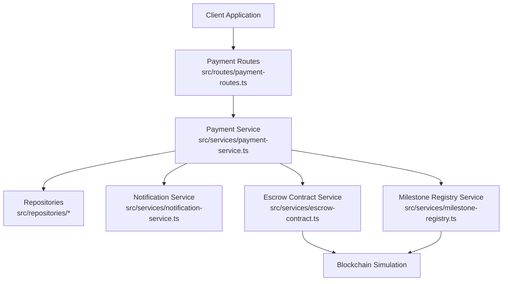

**Diagram sources**
- [payment-routes.ts](file://src/routes/payment-routes.ts#L1-L426)
- [payment-service.ts](file://src/services/payment-service.ts#L1-L643)
- [escrow-contract.ts](file://src/services/escrow-contract.ts#L1-L327)
- [milestone-registry.ts](file://src/services/milestone-registry.ts#L1-L276)
- [notification-service.ts](file://src/services/notification-service.ts#L1-L316)

**Section sources**
- [payment-routes.ts](file://src/routes/payment-routes.ts#L1-L426)
- [payment-service.ts](file://src/services/payment-service.ts#L1-L643)

## Core Components
- Payment Routes: Expose endpoints for completing milestones, approving milestones, disputing milestones, and retrieving contract payment status. All endpoints require JWT Bearer authentication.
- Payment Service: Implements business logic for milestone lifecycle, contract completion checks, and blockchain integration points.
- Escrow Contract Service: Simulates deployment, funding, milestone release, and refund operations with blockchain receipts.
- Milestone Registry Service: Records milestone submissions and approvals on-chain for verifiable work history.
- Notification Service: Sends notifications to parties upon milestone submission, approval, payment release, and dispute creation.
- Validation and Auth Middleware: Enforce JWT Bearer format, UUID parameter validation, and user authorization.

**Section sources**
- [payment-routes.ts](file://src/routes/payment-routes.ts#L1-L426)
- [payment-service.ts](file://src/services/payment-service.ts#L1-L643)
- [escrow-contract.ts](file://src/services/escrow-contract.ts#L1-L327)
- [milestone-registry.ts](file://src/services/milestone-registry.ts#L1-L276)
- [notification-service.ts](file://src/services/notification-service.ts#L1-L316)
- [auth-middleware.ts](file://src/middleware/auth-middleware.ts#L1-L101)
- [validation-middleware.ts](file://src/middleware/validation-middleware.ts#L782-L815)

## Architecture Overview
The payment flow integrates REST endpoints with internal services and blockchain simulation:
- Freelancer completes a milestone via a POST endpoint; the service updates the project’s milestone status, submits to the milestone registry, and notifies the employer.
- Employer approves the milestone via another POST endpoint; the service releases funds via the escrow contract, updates statuses, and notifies the freelancer. If all milestones are approved, the contract and project are marked completed and the agreement is finalized on-chain.
- Either party can dispute a milestone via a POST endpoint; the service creates a dispute record, updates statuses, and notifies both parties.
- Contract payment status is retrieved via a GET endpoint that computes totals and milestone statuses.

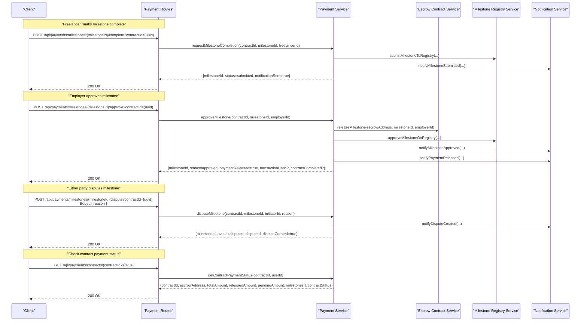

**Diagram sources**
- [payment-routes.ts](file://src/routes/payment-routes.ts#L100-L423)
- [payment-service.ts](file://src/services/payment-service.ts#L86-L543)
- [escrow-contract.ts](file://src/services/escrow-contract.ts#L138-L199)
- [milestone-registry.ts](file://src/services/milestone-registry.ts#L63-L186)
- [notification-service.ts](file://src/services/notification-service.ts#L212-L301)

## Detailed Component Analysis

### Endpoint Definitions and Schemas

#### Authentication
- All protected endpoints require a Bearer token in the Authorization header.
- Token validation is performed by the authentication middleware.

**Section sources**
- [API-DOCUMENTATION.md](file://docs/API-DOCUMENTATION.md#L7-L14)
- [auth-middleware.ts](file://src/middleware/auth-middleware.ts#L1-L101)

#### POST /api/payments/milestones/{milestoneId}/complete
- Purpose: Freelancer marks a milestone as complete.
- Path parameters:
  - milestoneId: UUID (required)
- Query parameters:
  - contractId: UUID (required)
- Authentication: Bearer JWT
- Request body: None
- Responses:
  - 200: MilestoneCompletionResult
  - 400: Validation error (invalid UUID or missing contractId)
  - 401: Unauthorized
  - 404: Contract or milestone not found

Response schema (MilestoneCompletionResult):
- milestoneId: string
- status: "submitted"
- notificationSent: boolean

Notes:
- Validates UUID in path and presence of contractId query parameter.
- Only the freelancer associated with the contract can request completion.
- Updates project milestone status to submitted and notifies the employer.

**Section sources**
- [payment-routes.ts](file://src/routes/payment-routes.ts#L100-L178)
- [payment-service.ts](file://src/services/payment-service.ts#L86-L193)
- [validation-middleware.ts](file://src/middleware/validation-middleware.ts#L782-L815)

#### POST /api/payments/milestones/{milestoneId}/approve
- Purpose: Employer approves milestone completion and releases payment.
- Path parameters:
  - milestoneId: UUID (required)
- Query parameters:
  - contractId: UUID (required)
- Authentication: Bearer JWT
- Request body: None
- Responses:
  - 200: MilestoneApprovalResult
  - 400: Validation error
  - 401: Unauthorized
  - 404: Contract or milestone not found

Response schema (MilestoneApprovalResult):
- milestoneId: string
- status: "approved"
- paymentReleased: boolean
- transactionHash: string (optional)
- contractCompleted: boolean

Notes:
- Only the employer associated with the contract can approve.
- Releases funds via the escrow contract and updates milestone status.
- If all milestones are approved, marks the contract and project as completed and finalizes the agreement on-chain.

**Section sources**
- [payment-routes.ts](file://src/routes/payment-routes.ts#L183-L261)
- [payment-service.ts](file://src/services/payment-service.ts#L201-L352)
- [escrow-contract.ts](file://src/services/escrow-contract.ts#L138-L199)

#### POST /api/payments/milestones/{milestoneId}/dispute
- Purpose: Either party disputes a milestone, locking funds and creating a dispute record.
- Path parameters:
  - milestoneId: UUID (required)
- Query parameters:
  - contractId: UUID (required)
- Authentication: Bearer JWT
- Request body:
  - reason: string (required)
- Responses:
  - 200: MilestoneDisputeResult
  - 400: Validation error (missing reason or invalid UUID)
  - 401: Unauthorized
  - 404: Contract or milestone not found

Response schema (MilestoneDisputeResult):
- milestoneId: string
- status: "disputed"
- disputeId: string
- disputeCreated: boolean

Notes:
- Initiator must be a party to the contract.
- Creates an in-memory dispute record and updates statuses.
- Marks the contract as disputed and notifies both parties.

**Section sources**
- [payment-routes.ts](file://src/routes/payment-routes.ts#L266-L359)
- [payment-service.ts](file://src/services/payment-service.ts#L355-L480)
- [validation-middleware.ts](file://src/middleware/validation-middleware.ts#L782-L815)

#### GET /api/payments/contracts/{contractId}/status
- Purpose: Retrieve detailed payment status for a contract including milestone statuses.
- Path parameters:
  - contractId: UUID (required)
- Authentication: Bearer JWT
- Request body: None
- Responses:
  - 200: ContractPaymentStatus
  - 400: Validation error
  - 401: Unauthorized
  - 404: Contract not found

Response schema (ContractPaymentStatus):
- contractId: string
- escrowAddress: string
- totalAmount: number
- releasedAmount: number
- pendingAmount: number
- milestones: array of:
  - id: string
  - title: string
  - amount: number
  - status: enum("pending","in_progress","submitted","approved","disputed")
- contractStatus: string

Notes:
- Only parties to the contract can view the status.
- Computes totals from project milestone statuses.

**Section sources**
- [payment-routes.ts](file://src/routes/payment-routes.ts#L364-L423)
- [payment-service.ts](file://src/services/payment-service.ts#L483-L543)

### Payment Flow and Conditions

#### From Completion to Approval
- Freelancer completes a milestone; the system updates the milestone status to submitted and records the event on-chain via the milestone registry.
- Employer approves the milestone; the system releases funds via the escrow contract, updates statuses, and notifies both parties. If all milestones are approved, the contract and project are marked completed and the agreement is finalized on-chain.

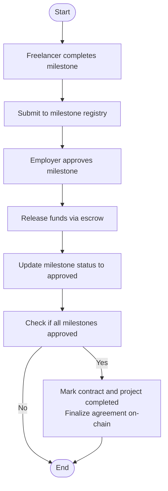

**Diagram sources**
- [payment-service.ts](file://src/services/payment-service.ts#L201-L352)
- [escrow-contract.ts](file://src/services/escrow-contract.ts#L138-L199)
- [milestone-registry.ts](file://src/services/milestone-registry.ts#L138-L186)

#### Dispute Conditions
- A milestone cannot be disputed if it is already approved or already under dispute.
- Only parties to the contract (freelancer or employer) can initiate a dispute.
- On dispute, the system creates a dispute record, updates milestone and contract statuses, and notifies both parties.

**Section sources**
- [payment-service.ts](file://src/services/payment-service.ts#L355-L480)

### Blockchain Integration Details
- Escrow deployment and funding:
  - The service deploys an escrow contract and funds it with the project budget.
  - The escrow stores balances and milestone statuses.
- Milestone release:
  - Only the employer can release a milestone; the service submits a transaction and confirms it, updating the escrow state.
- Milestone registry:
  - Submissions and approvals are recorded on-chain with hashes derived from milestone and contract identifiers.
- Notifications:
  - The system sends notifications for milestone submission, approval, payment release, and dispute creation.

**Section sources**
- [payment-service.ts](file://src/services/payment-service.ts#L591-L642)
- [escrow-contract.ts](file://src/services/escrow-contract.ts#L38-L199)
- [milestone-registry.ts](file://src/services/milestone-registry.ts#L63-L186)
- [notification-service.ts](file://src/services/notification-service.ts#L212-L301)

### Client Implementation Examples

#### Example: Complete a Milestone
- Endpoint: POST /api/payments/milestones/{milestoneId}/complete?contractId={uuid}
- Headers: Authorization: Bearer <access_token>
- Body: empty
- Expected response: 200 with MilestoneCompletionResult

**Section sources**
- [payment-routes.ts](file://src/routes/payment-routes.ts#L100-L178)

#### Example: Check Contract Payment Status
- Endpoint: GET /api/payments/contracts/{contractId}/status
- Headers: Authorization: Bearer <access_token>
- Query: contractId (UUID)
- Expected response: 200 with ContractPaymentStatus

**Section sources**
- [payment-routes.ts](file://src/routes/payment-routes.ts#L364-L423)

## Dependency Analysis

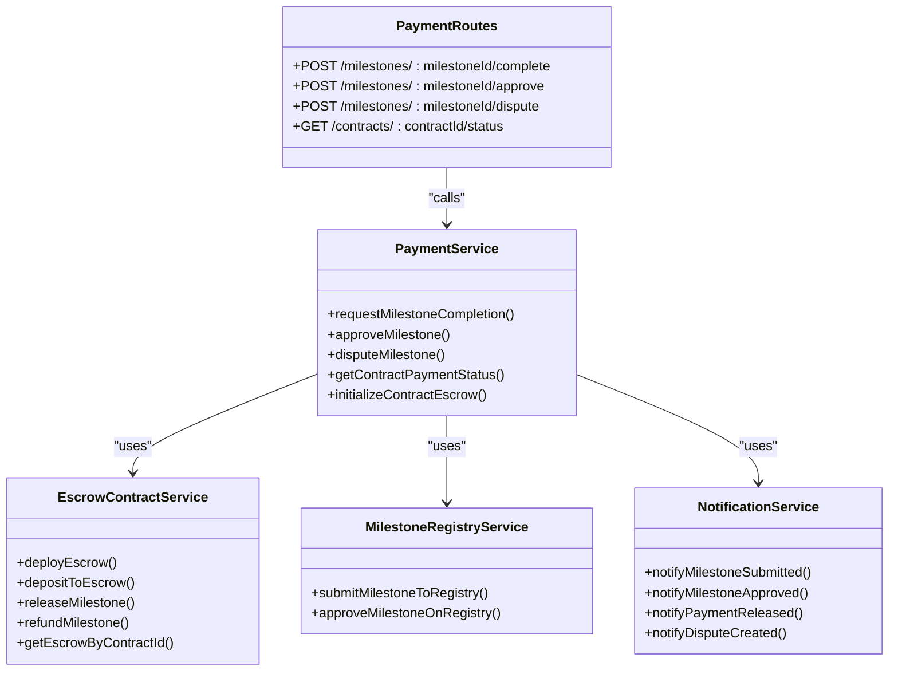

**Diagram sources**
- [payment-routes.ts](file://src/routes/payment-routes.ts#L1-L426)
- [payment-service.ts](file://src/services/payment-service.ts#L1-L643)
- [escrow-contract.ts](file://src/services/escrow-contract.ts#L1-L327)
- [milestone-registry.ts](file://src/services/milestone-registry.ts#L1-L276)
- [notification-service.ts](file://src/services/notification-service.ts#L1-L316)

**Section sources**
- [payment-routes.ts](file://src/routes/payment-routes.ts#L1-L426)
- [payment-service.ts](file://src/services/payment-service.ts#L1-L643)

## Performance Considerations
- Transaction simulation: The blockchain interactions are simulated in-memory. In production, replace with real RPC calls and handle asynchronous confirmation.
- Notification throughput: Batch notifications if many users are notified concurrently.
- Escrow state caching: Cache frequently accessed escrow states to reduce repeated computation.
- Pagination: The payment repository supports paginated queries for payment history; use it for efficient retrieval.

[No sources needed since this section provides general guidance]

## Troubleshooting Guide
Common issues and resolutions:
- Missing or invalid Authorization header: Ensure Bearer token is present and valid.
- Invalid UUID format: Verify milestoneId and contractId are valid UUIDs.
- Unauthorized actions: Only the freelancer (for completion) or employer (for approval/dispute) can perform respective actions.
- Not found resources: Ensure the contract and milestone exist and belong to the requesting user.
- Dispute preconditions: Cannot dispute an already approved or already disputed milestone.

**Section sources**
- [auth-middleware.ts](file://src/middleware/auth-middleware.ts#L1-L101)
- [validation-middleware.ts](file://src/middleware/validation-middleware.ts#L782-L815)
- [payment-service.ts](file://src/services/payment-service.ts#L86-L193)
- [payment-service.ts](file://src/services/payment-service.ts#L201-L352)
- [payment-service.ts](file://src/services/payment-service.ts#L355-L480)

## Conclusion
The FreelanceXchain payment API provides a clear, secure, and auditable flow for milestone completion, approval, and dispute resolution. It integrates with blockchain simulations for fund management and milestone registry, while maintaining robust authentication, validation, and notification mechanisms. Clients should follow the documented endpoints, parameter requirements, and response schemas to implement reliable payment workflows.

[No sources needed since this section summarizes without analyzing specific files]

## Appendices

### API Reference Summary
- Base URL: http://localhost:7860/api
- Interactive docs: http://localhost:7860/api-docs
- Authentication: Bearer JWT in Authorization header

Endpoints:
- POST /api/payments/milestones/{milestoneId}/complete?contractId={uuid}
- POST /api/payments/milestones/{milestoneId}/approve?contractId={uuid}
- POST /api/payments/milestones/{milestoneId}/dispute?contractId={uuid}
- GET /api/payments/contracts/{contractId}/status

**Section sources**
- [API-DOCUMENTATION.md](file://docs/API-DOCUMENTATION.md#L1-L14)
- [payment-routes.ts](file://src/routes/payment-routes.ts#L100-L423)

---

# Milestone Approval

<cite>
**Referenced Files in This Document**
- [payment-routes.ts](file://src/routes/payment-routes.ts)
- [payment-service.ts](file://src/services/payment-service.ts)
- [escrow-contract.ts](file://src/services/escrow-contract.ts)
- [auth-middleware.ts](file://src/middleware/auth-middleware.ts)
- [validation-middleware.ts](file://src/middleware/validation-middleware.ts)
- [blockchain-client.ts](file://src/services/blockchain-client.ts)
- [milestone-registry.ts](file://src/services/milestone-registry.ts)
- [entity-mapper.ts](file://src/utils/entity-mapper.ts)
- [contract-repository.ts](file://src/repositories/contract-repository.ts)
- [notification-service.ts](file://src/services/notification-service.ts)
</cite>

## Table of Contents
1. [Introduction](#introduction)
2. [Project Structure](#project-structure)
3. [Core Components](#core-components)
4. [Architecture Overview](#architecture-overview)
5. [Detailed Component Analysis](#detailed-component-analysis)
6. [Dependency Analysis](#dependency-analysis)
7. [Performance Considerations](#performance-considerations)
8. [Troubleshooting Guide](#troubleshooting-guide)
9. [Conclusion](#conclusion)

## Introduction
This document describes the POST /api/payments/milestones/{milestoneId}/approve endpoint used by employers to approve a completed milestone. Upon approval, the system triggers a payment release from the blockchain escrow and updates internal state accordingly. It covers authentication, request validation, service invocation, blockchain integration, and response handling.

## Project Structure
The milestone approval flow spans routing, middleware, service orchestration, blockchain client, and auxiliary repositories and services.

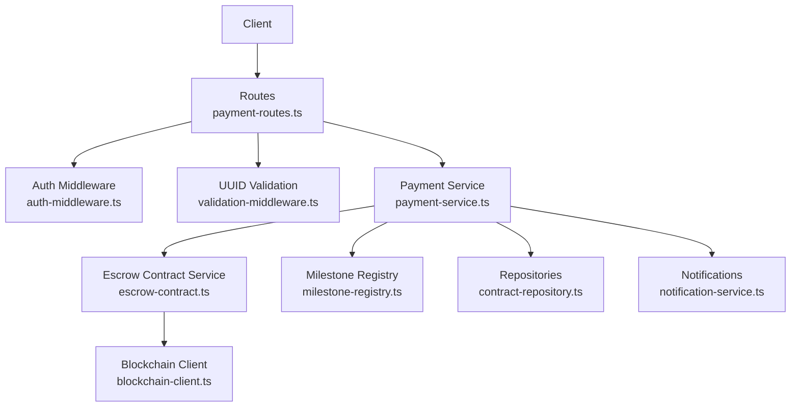

**Diagram sources**
- [payment-routes.ts](file://src/routes/payment-routes.ts#L180-L261)
- [auth-middleware.ts](file://src/middleware/auth-middleware.ts#L25-L70)
- [validation-middleware.ts](file://src/middleware/validation-middleware.ts#L782-L800)
- [payment-service.ts](file://src/services/payment-service.ts#L196-L352)
- [escrow-contract.ts](file://src/services/escrow-contract.ts#L134-L199)
- [milestone-registry.ts](file://src/services/milestone-registry.ts#L138-L186)
- [contract-repository.ts](file://src/repositories/contract-repository.ts#L1-L39)
- [notification-service.ts](file://src/services/notification-service.ts#L212-L262)
- [blockchain-client.ts](file://src/services/blockchain-client.ts#L131-L206)

**Section sources**
- [payment-routes.ts](file://src/routes/payment-routes.ts#L180-L261)
- [payment-service.ts](file://src/services/payment-service.ts#L196-L352)

## Core Components
- Route handler enforces JWT authentication and UUID validation for milestoneId, requires contractId query parameter, and invokes approveMilestone.
- Payment service validates ownership and milestone status, executes blockchain release via escrow contract, updates project and contract state, and notifies participants.
- Escrow contract service simulates blockchain transactions and updates in-memory state.
- Blockchain client simulates transaction submission, confirmation, and receipts.
- Milestone registry updates blockchain records for milestone approval.
- Repositories persist contract and project updates.
- Notifications inform freelancers and employers of approval and payment release.

**Section sources**
- [payment-routes.ts](file://src/routes/payment-routes.ts#L180-L261)
- [payment-service.ts](file://src/services/payment-service.ts#L196-L352)
- [escrow-contract.ts](file://src/services/escrow-contract.ts#L134-L199)
- [blockchain-client.ts](file://src/services/blockchain-client.ts#L131-L206)
- [milestone-registry.ts](file://src/services/milestone-registry.ts#L138-L186)
- [contract-repository.ts](file://src/repositories/contract-repository.ts#L1-L39)
- [notification-service.ts](file://src/services/notification-service.ts#L212-L262)

## Architecture Overview
The approval flow integrates REST routing, middleware validation, service orchestration, blockchain execution, and state updates.

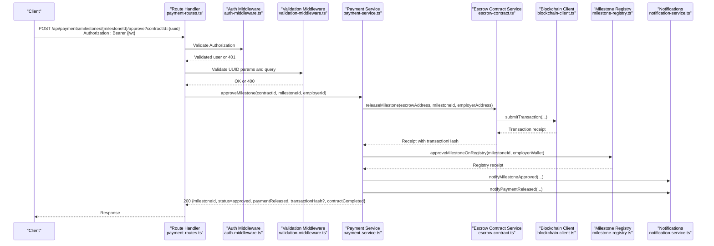

**Diagram sources**
- [payment-routes.ts](file://src/routes/payment-routes.ts#L180-L261)
- [auth-middleware.ts](file://src/middleware/auth-middleware.ts#L25-L70)
- [validation-middleware.ts](file://src/middleware/validation-middleware.ts#L782-L800)
- [payment-service.ts](file://src/services/payment-service.ts#L196-L352)
- [escrow-contract.ts](file://src/services/escrow-contract.ts#L134-L199)
- [blockchain-client.ts](file://src/services/blockchain-client.ts#L131-L206)
- [milestone-registry.ts](file://src/services/milestone-registry.ts#L138-L186)
- [notification-service.ts](file://src/services/notification-service.ts#L212-L262)

## Detailed Component Analysis

### Endpoint Definition
- Method: POST
- URL Pattern: /api/payments/milestones/{milestoneId}/approve
- Path Parameter:
  - milestoneId: UUID (validated by middleware)
- Required Query Parameter:
  - contractId: UUID (validated by route handler)
- Authentication:
  - Bearer JWT token required; validated by auth middleware
- Purpose:
  - Approve a completed milestone and trigger payment release from escrow

**Section sources**
- [payment-routes.ts](file://src/routes/payment-routes.ts#L180-L261)

### Request Flow
1. Authentication
   - Route uses auth middleware to extract and validate JWT.
   - On missing/invalid token, responds with 401.
2. Validation
   - UUID validation ensures milestoneId is a valid UUID.
   - contractId query parameter is required; otherwise 400.
3. Service Invocation
   - Calls approveMilestone with contractId, milestoneId, and employerId.
4. Response Handling
   - Returns 200 with MilestoneApprovalResult on success.
   - Maps service error codes to 404 (not found), 403 (unauthorized), or 400 (validation/invalid status).

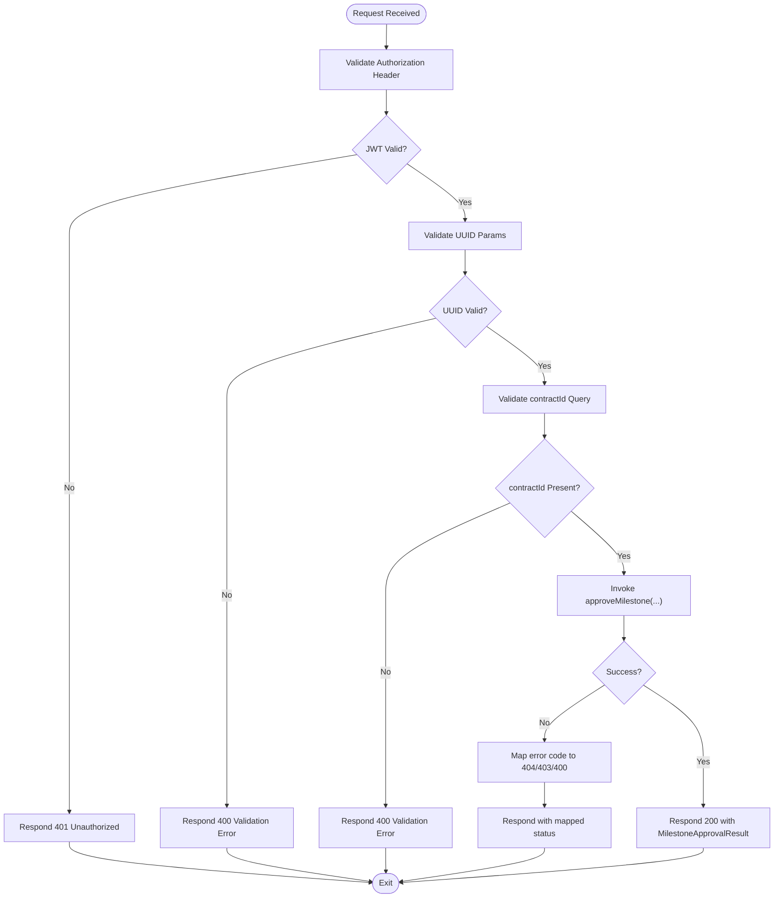

**Diagram sources**
- [payment-routes.ts](file://src/routes/payment-routes.ts#L219-L261)
- [auth-middleware.ts](file://src/middleware/auth-middleware.ts#L25-L70)
- [validation-middleware.ts](file://src/middleware/validation-middleware.ts#L782-L800)

**Section sources**
- [payment-routes.ts](file://src/routes/payment-routes.ts#L219-L261)

### Service Layer: approveMilestone
Responsibilities:
- Validate contract existence and employer ownership.
- Validate project and milestone existence and status (must not be approved or disputed).
- Execute blockchain release via escrow contract service.
- Update project milestone status to approved.
- Optionally complete contract and project if all milestones approved.
- Update blockchain milestone registry to approved.
- Send notifications to freelancer and employer.

Key behaviors:
- Escrow release returns a transaction receipt containing transactionHash.
- If blockchain release fails, the service logs and continues (best-effort simulation).
- After updating local state, it attempts to approve the milestone on the blockchain registry.
- If all milestones approved, updates contract and project to completed and completes the agreement on-chain.

**Section sources**
- [payment-service.ts](file://src/services/payment-service.ts#L196-L352)

### Blockchain Integration: Escrow Release
- Uses getEscrowByContractId to locate escrow.
- Calls releaseMilestone with escrow address, milestoneId, and approver address.
- Submits transaction and confirms it; captures receipt with transactionHash.
- Updates in-memory escrow state (balance, milestone status).

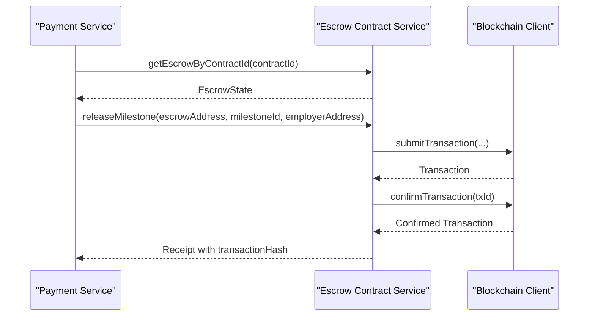

**Diagram sources**
- [payment-service.ts](file://src/services/payment-service.ts#L259-L274)
- [escrow-contract.ts](file://src/services/escrow-contract.ts#L134-L199)
- [blockchain-client.ts](file://src/services/blockchain-client.ts#L131-L206)

**Section sources**
- [escrow-contract.ts](file://src/services/escrow-contract.ts#L134-L199)
- [blockchain-client.ts](file://src/services/blockchain-client.ts#L131-L206)

### Blockchain Integration: Milestone Registry
- After local approval, the service calls approveMilestoneOnRegistry to update the blockchain record.
- The registry stores a record keyed by a hash of milestoneId and updates status to approved upon successful transaction confirmation.

**Section sources**
- [payment-service.ts](file://src/services/payment-service.ts#L287-L295)
- [milestone-registry.ts](file://src/services/milestone-registry.ts#L138-L186)

### Notifications
- On approval: notifyMilestoneApproved to freelancer.
- On payment release: notifyPaymentReleased to freelancer.
- Notifications are persisted and delivered to users.

**Section sources**
- [notification-service.ts](file://src/services/notification-service.ts#L212-L262)
- [payment-service.ts](file://src/services/payment-service.ts#L322-L341)

### Response Schema: 200 Success
MilestoneApprovalResult:
- milestoneId: string (UUID)
- status: "approved"
- paymentReleased: boolean (always true after successful release)
- transactionHash: string (optional; present if blockchain release succeeded)
- contractCompleted: boolean (true if all milestones approved and contract/project updated)

**Section sources**
- [payment-service.ts](file://src/services/payment-service.ts#L47-L61)
- [payment-service.ts](file://src/services/payment-service.ts#L342-L351)

### Error Responses
- 400 Bad Request
  - Missing or invalid contractId query parameter.
  - Invalid UUID format for milestoneId.
- 401 Unauthorized
  - Missing or invalid Authorization header.
  - Token validation failure.
- 403 Forbidden
  - Only the contract employer can approve milestones.
- 404 Not Found
  - Contract or milestone not found.

Mapping logic:
- Service returns error codes; route handler maps:
  - NOT_FOUND -> 404
  - UNAUTHORIZED -> 403
  - Otherwise -> 400

**Section sources**
- [payment-routes.ts](file://src/routes/payment-routes.ts#L249-L254)
- [payment-service.ts](file://src/services/payment-service.ts#L206-L241)
- [auth-middleware.ts](file://src/middleware/auth-middleware.ts#L25-L70)
- [validation-middleware.ts](file://src/middleware/validation-middleware.ts#L782-L800)

### Practical Example
- Employer calls POST /api/payments/milestones/{milestoneId}/approve?contractId={contractId} with a valid Bearer token.
- Backend validates JWT, UUID, and contractId.
- Service locates the escrow, submits a release transaction, receives a receipt with transactionHash, updates project and contract state, and notifies both parties.
- Response includes status=approved, paymentReleased=true, transactionHash, and contractCompleted if applicable.

**Section sources**
- [payment-routes.ts](file://src/routes/payment-routes.ts#L219-L261)
- [payment-service.ts](file://src/services/payment-service.ts#L259-L351)

## Dependency Analysis
- Route depends on auth middleware and validation middleware.
- Payment service depends on repositories, blockchain client, milestone registry, and notification service.
- Escrow contract service depends on blockchain client.
- Milestone registry depends on blockchain client.
- Entity mapper defines shared types used across services.

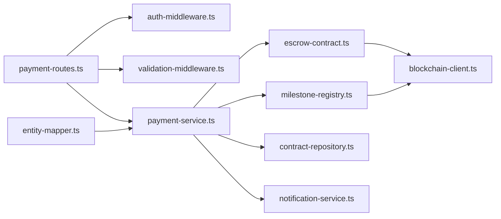

**Diagram sources**
- [payment-routes.ts](file://src/routes/payment-routes.ts#L180-L261)
- [auth-middleware.ts](file://src/middleware/auth-middleware.ts#L25-L70)
- [validation-middleware.ts](file://src/middleware/validation-middleware.ts#L782-L800)
- [payment-service.ts](file://src/services/payment-service.ts#L196-L352)
- [escrow-contract.ts](file://src/services/escrow-contract.ts#L134-L199)
- [milestone-registry.ts](file://src/services/milestone-registry.ts#L138-L186)
- [contract-repository.ts](file://src/repositories/contract-repository.ts#L1-L39)
- [notification-service.ts](file://src/services/notification-service.ts#L212-L262)
- [entity-mapper.ts](file://src/utils/entity-mapper.ts#L199-L250)

**Section sources**
- [payment-service.ts](file://src/services/payment-service.ts#L196-L352)
- [escrow-contract.ts](file://src/services/escrow-contract.ts#L134-L199)
- [milestone-registry.ts](file://src/services/milestone-registry.ts#L138-L186)
- [blockchain-client.ts](file://src/services/blockchain-client.ts#L131-L206)
- [entity-mapper.ts](file://src/utils/entity-mapper.ts#L199-L250)

## Performance Considerations
- Transaction confirmation is simulated and immediate in this environment; in production, confirmation waits could increase latency.
- Best-effort blockchain release: failures are logged and do not block response; consider retry policies and idempotency for production.
- Notification sends are synchronous; consider queuing for high throughput.

## Troubleshooting Guide
Common issues and resolutions:
- 401 Unauthorized
  - Ensure Authorization header is present and formatted as Bearer {token}.
  - Verify token is unexpired and valid.
- 400 Validation Error
  - Provide contractId query parameter as a UUID.
  - Ensure milestoneId is a valid UUID.
- 403 Forbidden
  - Only the contract employer can approve milestones; verify user ownership.
- 404 Not Found
  - Contract or milestone does not exist; verify identifiers.
- Blockchain Release Failure
  - Escrow release may fail due to insufficient balance or invalid state; check escrow balance and milestone status.

**Section sources**
- [auth-middleware.ts](file://src/middleware/auth-middleware.ts#L25-L70)
- [validation-middleware.ts](file://src/middleware/validation-middleware.ts#L782-L800)
- [payment-service.ts](file://src/services/payment-service.ts#L206-L241)
- [escrow-contract.ts](file://src/services/escrow-contract.ts#L134-L199)

## Conclusion
The milestone approval endpoint securely approves completed milestones, releases funds from the blockchain escrow, updates internal state, and notifies stakeholders. It enforces strict authentication and validation, integrates with blockchain services for immutability, and provides a clear success response schema with optional transaction details.

---

# Milestone Completion

<cite>
**Referenced Files in This Document**
- [payment-routes.ts](file://src/routes/payment-routes.ts)
- [payment-service.ts](file://src/services/payment-service.ts)
- [validation-middleware.ts](file://src/middleware/validation-middleware.ts)
- [auth-middleware.ts](file://src/middleware/auth-middleware.ts)
- [notification-service.ts](file://src/services/notification-service.ts)
- [project-repository.ts](file://src/repositories/project-repository.ts)
- [contract-repository.ts](file://src/repositories/contract-repository.ts)
- [user-repository.ts](file://src/repositories/user-repository.ts)
- [entity-mapper.ts](file://src/utils/entity-mapper.ts)
- [milestone-registry.ts](file://src/services/milestone-registry.ts)
- [escrow-contract.ts](file://src/services/escrow-contract.ts)
- [agreement-contract.ts](file://src/services/agreement-contract.ts)
</cite>

## Table of Contents
1. [Introduction](#introduction)
2. [Project Structure](#project-structure)
3. [Core Components](#core-components)
4. [Architecture Overview](#architecture-overview)
5. [Detailed Component Analysis](#detailed-component-analysis)
6. [Dependency Analysis](#dependency-analysis)
7. [Performance Considerations](#performance-considerations)
8. [Troubleshooting Guide](#troubleshooting-guide)
9. [Conclusion](#conclusion)

## Introduction
This document describes the POST /api/payments/milestones/{milestoneId}/complete endpoint used by freelancers to mark a milestone as complete. Upon successful submission, the system updates the milestone status, notifies the employer, and records the action on the blockchain registry. The endpoint requires JWT authentication and UUID validation for both path and query parameters.

## Project Structure
The endpoint is defined in the payment routes module and implemented by the payment service. It integrates with repositories for contracts and projects, user repository for identity, notification service for employer alerts, and blockchain services for registry updates.

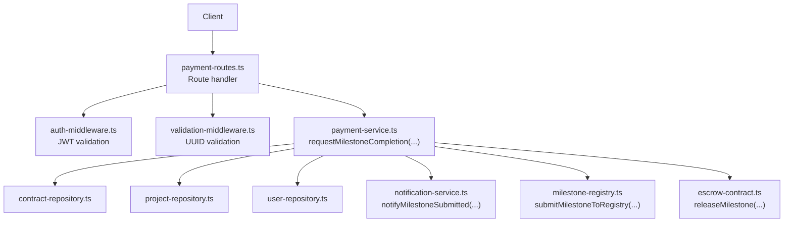

**Diagram sources**
- [payment-routes.ts](file://src/routes/payment-routes.ts#L136-L178)
- [auth-middleware.ts](file://src/middleware/auth-middleware.ts#L25-L70)
- [validation-middleware.ts](file://src/middleware/validation-middleware.ts#L782-L800)
- [payment-service.ts](file://src/services/payment-service.ts#L86-L193)
- [contract-repository.ts](file://src/repositories/contract-repository.ts)
- [project-repository.ts](file://src/repositories/project-repository.ts#L1-L191)
- [user-repository.ts](file://src/repositories/user-repository.ts)
- [notification-service.ts](file://src/services/notification-service.ts#L212-L227)
- [milestone-registry.ts](file://src/services/milestone-registry.ts#L120-L135)
- [escrow-contract.ts](file://src/services/escrow-contract.ts)

**Section sources**
- [payment-routes.ts](file://src/routes/payment-routes.ts#L136-L178)
- [payment-service.ts](file://src/services/payment-service.ts#L86-L193)

## Core Components
- Route handler: Validates JWT, validates UUID path parameter, checks presence of contractId query parameter, and invokes the service.
- Service: Validates ownership, finds the project and milestone, updates status to submitted, submits to blockchain registry, and sends a notification to the employer.
- Repositories: Access contract and project entities to validate and update milestone status.
- Notification service: Sends an employer notification upon milestone submission.
- Blockchain integration: Submits milestone metadata to the registry for transparency.

**Section sources**
- [payment-routes.ts](file://src/routes/payment-routes.ts#L136-L178)
- [payment-service.ts](file://src/services/payment-service.ts#L86-L193)
- [notification-service.ts](file://src/services/notification-service.ts#L212-L227)
- [project-repository.ts](file://src/repositories/project-repository.ts#L1-L191)
- [contract-repository.ts](file://src/repositories/contract-repository.ts)
- [user-repository.ts](file://src/repositories/user-repository.ts)
- [milestone-registry.ts](file://src/services/milestone-registry.ts#L120-L135)

## Architecture Overview
The endpoint follows a layered architecture:
- Presentation layer: Express route handler
- Application layer: Payment service orchestrating business logic
- Domain layer: Repositories for persistence
- Integration layer: Notifications and blockchain registry

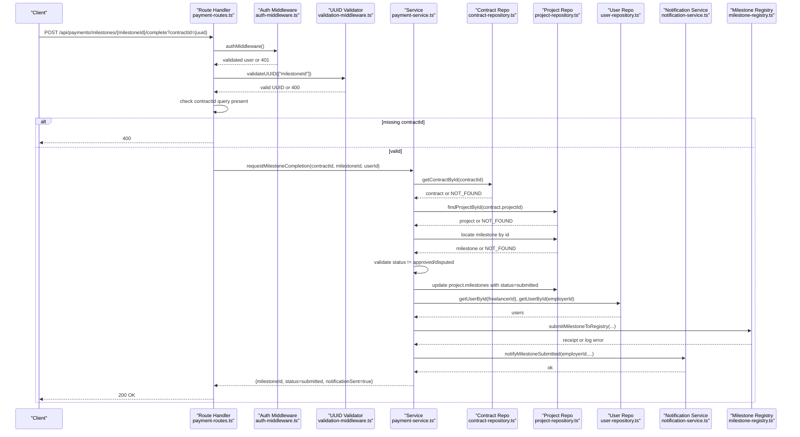

**Diagram sources**
- [payment-routes.ts](file://src/routes/payment-routes.ts#L136-L178)
- [auth-middleware.ts](file://src/middleware/auth-middleware.ts#L25-L70)
- [validation-middleware.ts](file://src/middleware/validation-middleware.ts#L782-L800)
- [payment-service.ts](file://src/services/payment-service.ts#L86-L193)
- [contract-repository.ts](file://src/repositories/contract-repository.ts)
- [project-repository.ts](file://src/repositories/project-repository.ts#L1-L191)
- [user-repository.ts](file://src/repositories/user-repository.ts)
- [notification-service.ts](file://src/services/notification-service.ts#L212-L227)
- [milestone-registry.ts](file://src/services/milestone-registry.ts#L120-L135)

## Detailed Component Analysis

### Endpoint Definition
- Method: POST
- URL Pattern: /api/payments/milestones/{milestoneId}/complete
- Path Parameters:
  - milestoneId: UUID (validated by validateUUID)
- Query Parameters:
  - contractId: UUID (required)
- Authentication: JWT via authMiddleware
- Response: 200 with MilestoneCompletionResult

**Section sources**
- [payment-routes.ts](file://src/routes/payment-routes.ts#L100-L135)
- [payment-routes.ts](file://src/routes/payment-routes.ts#L136-L178)

### Request Flow
1. Authentication
   - authMiddleware extracts Bearer token from Authorization header and validates it. Returns 401 if missing or invalid.
2. UUID Validation
   - validateUUID ensures milestoneId is a valid UUID; returns 400 otherwise.
3. Query Parameter Validation
   - contractId query parameter is required; returns 400 if missing.
4. Service Invocation
   - requestMilestoneCompletion is invoked with contractId, milestoneId, and authenticated userId.
5. Response Handling
   - On success, returns 200 with MilestoneCompletionResult.
   - On failure, maps service error codes to 404/403/400.

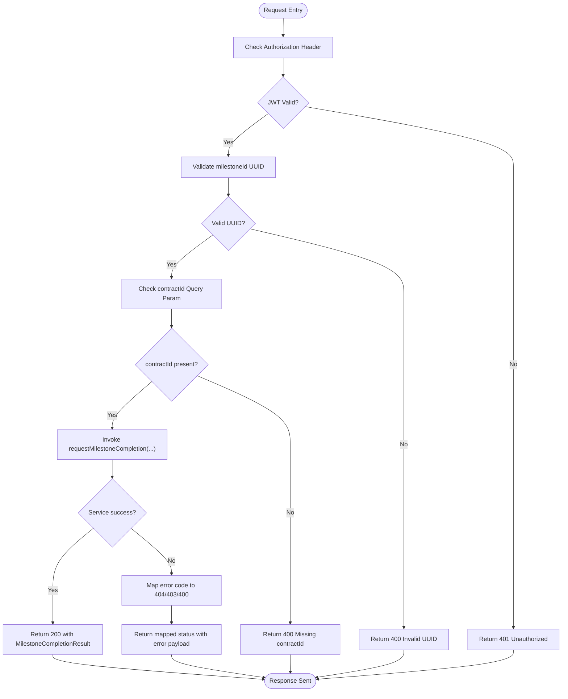

**Diagram sources**
- [payment-routes.ts](file://src/routes/payment-routes.ts#L136-L178)
- [auth-middleware.ts](file://src/middleware/auth-middleware.ts#L25-L70)
- [validation-middleware.ts](file://src/middleware/validation-middleware.ts#L782-L800)
- [payment-service.ts](file://src/services/payment-service.ts#L86-L193)

**Section sources**
- [payment-routes.ts](file://src/routes/payment-routes.ts#L136-L178)
- [auth-middleware.ts](file://src/middleware/auth-middleware.ts#L25-L70)
- [validation-middleware.ts](file://src/middleware/validation-middleware.ts#L782-L800)

### Service Implementation Details
- Ownership Verification
  - Ensures the authenticated user is the freelancer associated with the contract.
- Project and Milestone Lookup
  - Loads the project by contract’s projectId and locates the milestone by id.
- Status Validation
  - Prevents submission if milestone is already approved or under dispute.
- Persistence
  - Updates the milestone status to submitted in the project entity and persists the change.
- Blockchain Registry
  - Attempts to submit milestone metadata to the registry; logs failures but continues.
- Notification
  - Sends a notification to the employer indicating the milestone is submitted.

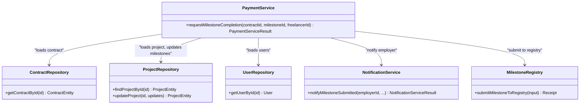

**Diagram sources**
- [payment-service.ts](file://src/services/payment-service.ts#L86-L193)
- [contract-repository.ts](file://src/repositories/contract-repository.ts)
- [project-repository.ts](file://src/repositories/project-repository.ts#L1-L191)
- [user-repository.ts](file://src/repositories/user-repository.ts)
- [notification-service.ts](file://src/services/notification-service.ts#L212-L227)
- [milestone-registry.ts](file://src/services/milestone-registry.ts#L120-L135)

**Section sources**
- [payment-service.ts](file://src/services/payment-service.ts#L86-L193)

### Response Schema
- 200 Success: MilestoneCompletionResult
  - milestoneId: string (UUID)
  - status: string (enum: submitted)
  - notificationSent: boolean

**Section sources**
- [payment-routes.ts](file://src/routes/payment-routes.ts#L23-L33)
- [payment-service.ts](file://src/services/payment-service.ts#L41-L45)

### Error Responses
- 400 Bad Request
  - Missing contractId query parameter
  - Invalid UUID format for milestoneId
- 401 Unauthorized
  - Missing or invalid Authorization header
- 403 Forbidden
  - Non-freelancer attempts to submit milestone completion
- 404 Not Found
  - Contract not found
  - Project not found
  - Milestone not found

**Section sources**
- [payment-routes.ts](file://src/routes/payment-routes.ts#L136-L178)
- [auth-middleware.ts](file://src/middleware/auth-middleware.ts#L25-L70)
- [validation-middleware.ts](file://src/middleware/validation-middleware.ts#L782-L800)
- [payment-service.ts](file://src/services/payment-service.ts#L92-L142)

### Practical Example
A freelancer completes a milestone and calls:
- Method: POST
- URL: /api/payments/milestones/{milestoneId}/complete?contractId={contractId}
- Headers: Authorization: Bearer <JWT>
- Body: None (no body required)

The system verifies the JWT, validates UUIDs, ensures the user is the contract’s freelancer, updates the milestone status to submitted, and sends a notification to the employer.

**Section sources**
- [payment-routes.ts](file://src/routes/payment-routes.ts#L136-L178)
- [payment-service.ts](file://src/services/payment-service.ts#L86-L193)

### Integration with Payment Service and Repository
- Payment Service updates the project’s milestone status and persists the change via ProjectRepository.
- The endpoint does not directly call a payment-repository; payment releases occur in the approve endpoint.

**Section sources**
- [payment-service.ts](file://src/services/payment-service.ts#L144-L153)
- [project-repository.ts](file://src/repositories/project-repository.ts#L43-L45)

## Dependency Analysis
- Route depends on:
  - authMiddleware for JWT
  - validateUUID for UUID validation
  - payment-service for business logic
- Payment service depends on:
  - contract-repository, project-repository, user-repository
  - notification-service
  - milestone-registry
  - escrow-contract (used by other endpoints; not directly here)

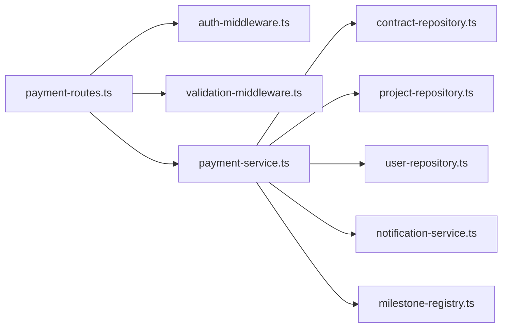

**Diagram sources**
- [payment-routes.ts](file://src/routes/payment-routes.ts#L136-L178)
- [auth-middleware.ts](file://src/middleware/auth-middleware.ts#L25-L70)
- [validation-middleware.ts](file://src/middleware/validation-middleware.ts#L782-L800)
- [payment-service.ts](file://src/services/payment-service.ts#L86-L193)

**Section sources**
- [payment-routes.ts](file://src/routes/payment-routes.ts#L136-L178)
- [payment-service.ts](file://src/services/payment-service.ts#L86-L193)

## Performance Considerations
- The endpoint performs a small number of synchronous repository reads and writes plus a best-effort blockchain submission. Typical latency is dominated by repository operations and network calls to the notification service and registry.
- Consider caching frequently accessed contracts/projects if traffic increases.

## Troubleshooting Guide
- 401 Unauthorized
  - Ensure Authorization header is present and formatted as Bearer <token>.
  - Verify the token is unexpired and valid.
- 400 Invalid UUID
  - Confirm milestoneId is a valid UUID v4.
  - Confirm contractId is a valid UUID v4 and passed as a query parameter.
- 403 Forbidden
  - Only the freelancer associated with the contract can submit milestone completion.
- 404 Not Found
  - Contract, project, or milestone may not exist, or the milestone id does not belong to the project.

**Section sources**
- [auth-middleware.ts](file://src/middleware/auth-middleware.ts#L25-L70)
- [validation-middleware.ts](file://src/middleware/validation-middleware.ts#L782-L800)
- [payment-service.ts](file://src/services/payment-service.ts#L92-L142)
- [payment-routes.ts](file://src/routes/payment-routes.ts#L136-L178)

## Conclusion
The POST /api/payments/milestones/{milestoneId}/complete endpoint enables freelancers to submit milestone completion safely and transparently. It enforces authentication and UUID validation, updates the milestone status, notifies the employer, and records the event on the blockchain registry. The design cleanly separates concerns across route handlers, middleware, services, and repositories.

---

# Milestone Dispute

<cite>
**Referenced Files in This Document**
- [payment-routes.ts](file://src/routes/payment-routes.ts)
- [payment-service.ts](file://src/services/payment-service.ts)
- [auth-middleware.ts](file://src/middleware/auth-middleware.ts)
- [validation-middleware.ts](file://src/middleware/validation-middleware.ts)
- [dispute-service.ts](file://src/services/dispute-service.ts)
- [dispute-repository.ts](file://src/repositories/dispute-repository.ts)
- [escrow-contract.ts](file://src/services/escrow-contract.ts)
- [dispute-registry.ts](file://src/services/dispute-registry.ts)
- [entity-mapper.ts](file://src/utils/entity-mapper.ts)
</cite>

## Table of Contents
1. [Introduction](#introduction)
2. [Project Structure](#project-structure)
3. [Core Components](#core-components)
4. [Architecture Overview](#architecture-overview)
5. [Detailed Component Analysis](#detailed-component-analysis)
6. [Dependency Analysis](#dependency-analysis)
7. [Performance Considerations](#performance-considerations)
8. [Troubleshooting Guide](#troubleshooting-guide)
9. [Conclusion](#conclusion)
10. [Appendices](#appendices)

## Introduction
This document describes the POST /api/payments/milestones/{milestoneId}/dispute endpoint for the FreelanceXchain system. It covers the HTTP method, URL pattern, path parameter, required query parameter, and request body. It explains that either party (freelancer or employer) can dispute a milestone, which locks the funds and creates a dispute record for resolution. Authentication uses JWT with UUID validation. The request flow includes user authentication, contractId validation, reason validation, service invocation via disputeMilestone, and response handling. The 200 success response schema (MilestoneDisputeResult) is documented, along with error responses for 400, 401, 403, and 404. A practical example demonstrates a freelancer disputing a milestone due to unsatisfactory requirements. Finally, it explains how this endpoint integrates with the dispute resolution system and locks associated escrow funds.

## Project Structure
The milestone dispute endpoint is implemented in the payment routes and payment service, with support from authentication and validation middleware. Disputes are persisted and integrated with blockchain registries and escrow contracts.

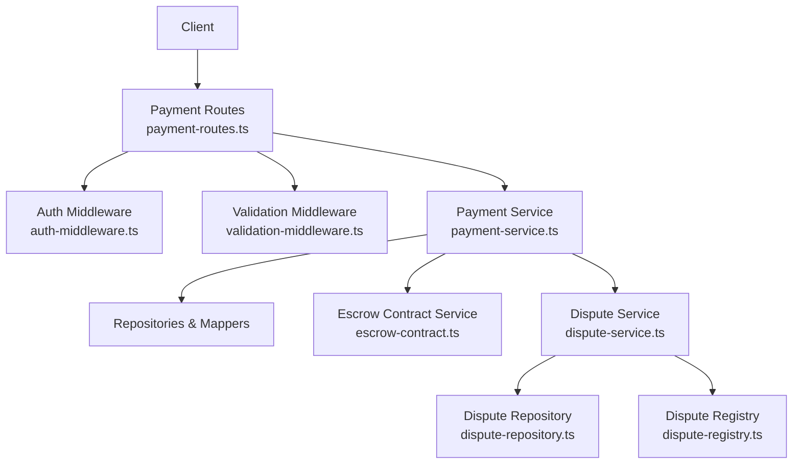

**Diagram sources**
- [payment-routes.ts](file://src/routes/payment-routes.ts#L308-L359)
- [auth-middleware.ts](file://src/middleware/auth-middleware.ts#L25-L70)
- [validation-middleware.ts](file://src/middleware/validation-middleware.ts#L782-L815)
- [payment-service.ts](file://src/services/payment-service.ts#L355-L480)
- [dispute-service.ts](file://src/services/dispute-service.ts#L63-L206)
- [dispute-repository.ts](file://src/repositories/dispute-repository.ts#L1-L136)
- [escrow-contract.ts](file://src/services/escrow-contract.ts#L1-L200)
- [dispute-registry.ts](file://src/services/dispute-registry.ts#L90-L137)

**Section sources**
- [payment-routes.ts](file://src/routes/payment-routes.ts#L264-L359)
- [auth-middleware.ts](file://src/middleware/auth-middleware.ts#L25-L70)
- [validation-middleware.ts](file://src/middleware/validation-middleware.ts#L782-L815)

## Core Components
- Endpoint definition and Swagger schema for the dispute route.
- Route handler that enforces JWT authentication, validates UUID parameters, checks for required contractId query parameter, validates reason in request body, and invokes disputeMilestone.
- Payment service disputeMilestone function that validates contract and milestone ownership, checks milestone status, creates a dispute record, updates milestone and contract statuses, and sends notifications.
- Dispute service that persists disputes, records on blockchain, updates milestone and contract statuses, and integrates with escrow for resolution outcomes.
- Validation middleware that ensures UUID format for path parameters and provides standardized error responses.

**Section sources**
- [payment-routes.ts](file://src/routes/payment-routes.ts#L264-L359)
- [payment-service.ts](file://src/services/payment-service.ts#L355-L480)
- [dispute-service.ts](file://src/services/dispute-service.ts#L63-L206)
- [validation-middleware.ts](file://src/middleware/validation-middleware.ts#L782-L815)

## Architecture Overview
The endpoint follows a layered architecture:
- HTTP layer: route handler validates inputs and delegates to service layer.
- Service layer: orchestrates repository and external integrations (notifications, blockchain, escrow).
- Persistence: dispute repository stores dispute records.
- External systems: blockchain dispute registry and escrow contract service.

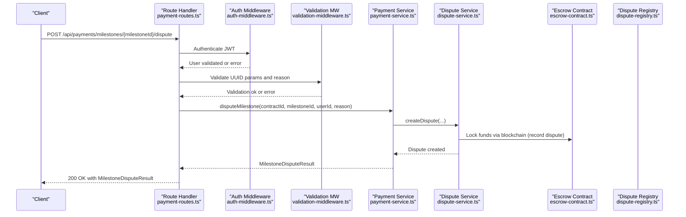

**Diagram sources**
- [payment-routes.ts](file://src/routes/payment-routes.ts#L308-L359)
- [auth-middleware.ts](file://src/middleware/auth-middleware.ts#L25-L70)
- [validation-middleware.ts](file://src/middleware/validation-middleware.ts#L782-L815)
- [payment-service.ts](file://src/services/payment-service.ts#L355-L480)
- [dispute-service.ts](file://src/services/dispute-service.ts#L63-L206)
- [escrow-contract.ts](file://src/services/escrow-contract.ts#L1-L200)
- [dispute-registry.ts](file://src/services/dispute-registry.ts#L90-L137)

## Detailed Component Analysis

### Endpoint Definition and Request Flow
- Method: POST
- URL pattern: /api/payments/milestones/{milestoneId}/dispute
- Path parameter:
  - milestoneId (UUID)
- Required query parameter:
  - contractId (UUID)
- Request body:
  - reason (string, required)
- Authentication:
  - Bearer JWT token in Authorization header
- Validation:
  - UUID validation for milestoneId
  - Presence and type validation for reason
  - Presence of contractId query parameter

The route handler performs:
- JWT authentication via authMiddleware
- UUID validation for milestoneId via validateUUID
- ContractId presence check
- Reason presence/type check
- Invocation of disputeMilestone
- Error mapping to 400/401/403/404 based on service error codes
- Success response with MilestoneDisputeResult

**Section sources**
- [payment-routes.ts](file://src/routes/payment-routes.ts#L264-L359)
- [auth-middleware.ts](file://src/middleware/auth-middleware.ts#L25-L70)
- [validation-middleware.ts](file://src/middleware/validation-middleware.ts#L782-L815)

### Payment Service: disputeMilestone
Responsibilities:
- Validate contract existence and that the initiator is a party to the contract.
- Validate project and milestone existence and status (not approved, not already disputed).
- Create a dispute record (in-memory store in simulation).
- Update milestone status to disputed and contract status to disputed.
- Notify both parties.
- Return MilestoneDisputeResult with milestoneId, status=disputed, disputeId, and disputeCreated=true.

Integration points:
- Repository access for contract and project data.
- Notification service for dispute created notifications.
- Blockchain integration via dispute-registry and escrow-contract services (see Dispute Service for blockchain actions).

**Section sources**
- [payment-service.ts](file://src/services/payment-service.ts#L355-L480)

### Dispute Service: createDispute and Blockchain Integration
Responsibilities:
- Validate contract and project existence.
- Verify initiator is a party to the contract.
- Validate milestone exists and is not already disputed or approved.
- Create dispute entity with status=open.
- Persist dispute via disputeRepository.
- Record dispute on blockchain registry with wallets and amount.
- Update milestone status to disputed and contract status to disputed.
- Notify both parties.
- Return created dispute.

Blockchain and Escrow Integration:
- Dispute registry records dispute metadata and tracks user stats.
- Agreement contract is marked as disputed.
- Escrow contract status reflects dispute lifecycle during resolution.

**Section sources**
- [dispute-service.ts](file://src/services/dispute-service.ts#L63-L206)
- [dispute-repository.ts](file://src/repositories/dispute-repository.ts#L1-L136)
- [dispute-registry.ts](file://src/services/dispute-registry.ts#L90-L137)
- [escrow-contract.ts](file://src/services/escrow-contract.ts#L1-L200)

### Response Schema: MilestoneDisputeResult
- milestoneId: string (UUID)
- status: "disputed"
- disputeId: string (UUID)
- disputeCreated: boolean

This schema is defined in the route’s Swagger documentation and returned by the service upon successful dispute creation.

**Section sources**
- [payment-routes.ts](file://src/routes/payment-routes.ts#L47-L59)

### Error Responses
- 400 Bad Request:
  - Missing or invalid reason in request body.
  - Missing or invalid contractId query parameter.
  - Invalid UUID format for milestoneId.
- 401 Unauthorized:
  - Missing or invalid Authorization header.
  - Invalid/expired JWT token.
- 403 Forbidden:
  - Only contract parties (freelancer or employer) can dispute a milestone.
- 404 Not Found:
  - Contract or milestone not found.

The route handler maps service error codes to appropriate HTTP status codes.

**Section sources**
- [payment-routes.ts](file://src/routes/payment-routes.ts#L308-L359)
- [auth-middleware.ts](file://src/middleware/auth-middleware.ts#L25-L70)
- [validation-middleware.ts](file://src/middleware/validation-middleware.ts#L782-L815)
- [payment-service.ts](file://src/services/payment-service.ts#L355-L480)
- [dispute-service.ts](file://src/services/dispute-service.ts#L63-L206)

### Practical Example: Freelancer Disputes a Milestone
Scenario:
- A freelancer initiates a dispute for milestoneId X due to unsatisfactory requirements.
- The freelancer calls POST /api/payments/milestones/X/dispute with:
  - Authorization: Bearer <JWT>
  - Query: contractId=Y (UUID)
  - Body: { reason: "Requirements were not met as specified" }
- The system validates JWT, UUIDs, reason, and contract/milestone existence/status.
- It creates a dispute record, sets milestone and contract status to disputed, and notifies both parties.
- The response returns MilestoneDisputeResult indicating status=disputed and disputeCreated=true.

Outcome:
- Funds remain locked in the escrow until the dispute is resolved.
- The dispute enters the resolution workflow managed by the dispute service.

**Section sources**
- [payment-routes.ts](file://src/routes/payment-routes.ts#L264-L359)
- [payment-service.ts](file://src/services/payment-service.ts#L355-L480)
- [dispute-service.ts](file://src/services/dispute-service.ts#L63-L206)

### Integration with Dispute Resolution and Escrow Lock
- Dispute Creation:
  - Payment service creates a dispute record and updates statuses.
  - Dispute service persists the record and records the dispute on the blockchain registry.
- Escrow Lock:
  - The blockchain registry tracks dispute records and user statistics.
  - During resolution, depending on the decision, funds are released to the freelancer, refunded to the employer, or handled according to split decisions.
- Contract Status:
  - Contract status transitions to disputed while any milestone is under dispute and reverts to active when all disputes are resolved.

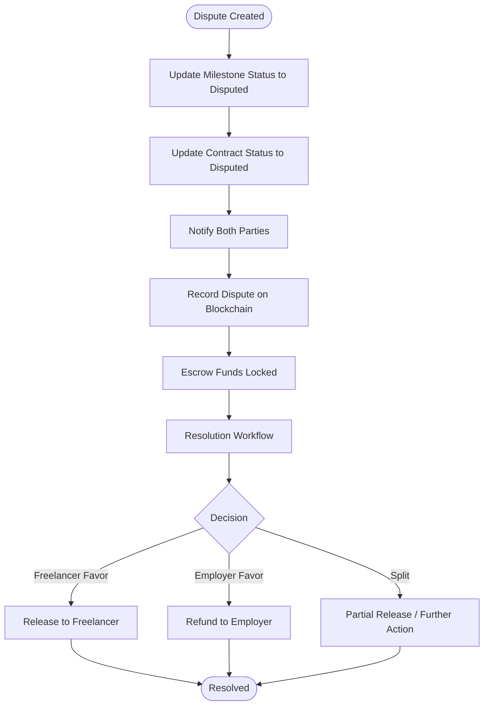

**Diagram sources**
- [payment-service.ts](file://src/services/payment-service.ts#L436-L449)
- [dispute-service.ts](file://src/services/dispute-service.ts#L175-L206)
- [dispute-registry.ts](file://src/services/dispute-registry.ts#L90-L137)
- [escrow-contract.ts](file://src/services/escrow-contract.ts#L138-L199)

## Dependency Analysis
Key dependencies and relationships:
- Route depends on auth-middleware and validation-middleware for security and input validation.
- Route delegates to payment-service.disputeMilestone.
- Payment service coordinates with repositories and notification services.
- Dispute service manages persistence and blockchain interactions.
- Escrow contract service participates in fund locking and resolution outcomes.

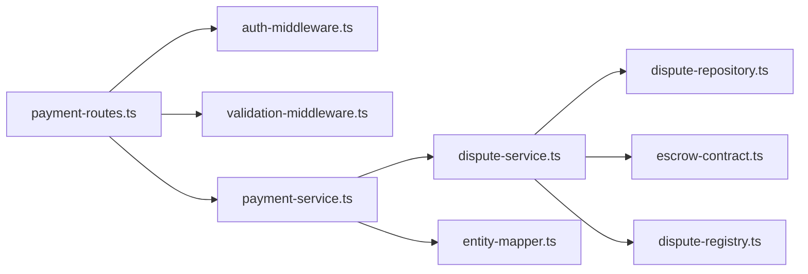

**Diagram sources**
- [payment-routes.ts](file://src/routes/payment-routes.ts#L308-L359)
- [auth-middleware.ts](file://src/middleware/auth-middleware.ts#L25-L70)
- [validation-middleware.ts](file://src/middleware/validation-middleware.ts#L782-L815)
- [payment-service.ts](file://src/services/payment-service.ts#L355-L480)
- [dispute-service.ts](file://src/services/dispute-service.ts#L63-L206)
- [dispute-repository.ts](file://src/repositories/dispute-repository.ts#L1-L136)
- [escrow-contract.ts](file://src/services/escrow-contract.ts#L1-L200)
- [dispute-registry.ts](file://src/services/dispute-registry.ts#L90-L137)
- [entity-mapper.ts](file://src/utils/entity-mapper.ts#L198-L200)

**Section sources**
- [payment-routes.ts](file://src/routes/payment-routes.ts#L308-L359)
- [payment-service.ts](file://src/services/payment-service.ts#L355-L480)
- [dispute-service.ts](file://src/services/dispute-service.ts#L63-L206)

## Performance Considerations
- Input validation occurs before heavy operations, reducing unnecessary service calls.
- Dispute creation is lightweight; blockchain recording is asynchronous and logged for failures.
- Notifications are sent after status updates to ensure clients receive accurate state.
- Consider caching frequently accessed contract and project data if scalability becomes a concern.

[No sources needed since this section provides general guidance]

## Troubleshooting Guide
Common issues and resolutions:
- 401 Unauthorized:
  - Ensure Authorization header is present and formatted as Bearer <token>.
  - Verify the token is valid and not expired.
- 400 Bad Request:
  - Missing reason in request body or invalid type.
  - Missing contractId query parameter.
  - Invalid UUID format for milestoneId.
- 403 Forbidden:
  - Only the freelancer or employer associated with the contract can dispute a milestone.
- 404 Not Found:
  - Contract or milestone not found; verify contractId and milestoneId.
- Duplicate or Invalid Status:
  - Cannot dispute an approved milestone or a milestone already under dispute.

**Section sources**
- [auth-middleware.ts](file://src/middleware/auth-middleware.ts#L25-L70)
- [validation-middleware.ts](file://src/middleware/validation-middleware.ts#L782-L815)
- [payment-service.ts](file://src/services/payment-service.ts#L355-L480)
- [dispute-service.ts](file://src/services/dispute-service.ts#L63-L206)

## Conclusion
The POST /api/payments/milestones/{milestoneId}/dispute endpoint enables either party to initiate a dispute, which locks funds and creates a dispute record. The implementation enforces JWT authentication, validates UUIDs and request parameters, and integrates with the dispute resolution system and escrow contracts. The response schema provides clear confirmation of the dispute creation and current status.

[No sources needed since this section summarizes without analyzing specific files]

## Appendices

### API Definition Summary
- Method: POST
- URL: /api/payments/milestones/{milestoneId}/dispute
- Path parameters:
  - milestoneId (UUID)
- Query parameters:
  - contractId (UUID, required)
- Request body:
  - reason (string, required)
- Authentication:
  - Bearer JWT
- Success response:
  - 200 OK with MilestoneDisputeResult
- Error responses:
  - 400 Bad Request (validation errors)
  - 401 Unauthorized (missing/invalid token)
  - 403 Forbidden (unauthorized party)
  - 404 Not Found (contract or milestone not found)

**Section sources**
- [payment-routes.ts](file://src/routes/payment-routes.ts#L264-L359)
- [payment-service.ts](file://src/services/payment-service.ts#L355-L480)

---

# Payment Status

<cite>
**Referenced Files in This Document**
- [payment-routes.ts](file://src/routes/payment-routes.ts)
- [payment-service.ts](file://src/services/payment-service.ts)
- [auth-middleware.ts](file://src/middleware/auth-middleware.ts)
- [validation-middleware.ts](file://src/middleware/validation-middleware.ts)
- [contract-repository.ts](file://src/repositories/contract-repository.ts)
- [project-repository.ts](file://src/repositories/project-repository.ts)
- [API-DOCUMENTATION.md](file://docs/API-DOCUMENTATION.md)
- [entity-mapper.ts](file://src/utils/entity-mapper.ts)
</cite>

## Table of Contents
1. [Introduction](#introduction)
2. [Project Structure](#project-structure)
3. [Core Components](#core-components)
4. [Architecture Overview](#architecture-overview)
5. [Detailed Component Analysis](#detailed-component-analysis)
6. [Dependency Analysis](#dependency-analysis)
7. [Performance Considerations](#performance-considerations)
8. [Troubleshooting Guide](#troubleshooting-guide)
9. [Conclusion](#conclusion)
10. [Appendices](#appendices)

## Introduction
This document describes the GET /api/payments/contracts/{contractId}/status endpoint in the FreelanceXchain system. It explains the endpoint’s purpose, authentication and validation requirements, request flow, response schema, and error handling. It also clarifies how the endpoint aggregates data from on-chain and off-chain sources to present a comprehensive payment overview for a given contract.

## Project Structure
The endpoint is implemented as part of the Payments module:
- Route handler: defines the HTTP method, URL pattern, path parameter, middleware, and response handling
- Service: computes the payment status by combining off-chain data (project and contract entities) and on-chain data (escrow address)
- Middleware: enforces JWT authentication and validates UUID parameters
- Repositories: provide access to contract and project entities
- Swagger/OpenAPI: documents the endpoint and response schema

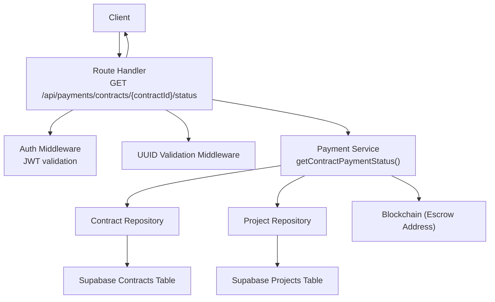

**Diagram sources**
- [payment-routes.ts](file://src/routes/payment-routes.ts#L362-L423)
- [auth-middleware.ts](file://src/middleware/auth-middleware.ts#L25-L70)
- [validation-middleware.ts](file://src/middleware/validation-middleware.ts#L782-L800)
- [payment-service.ts](file://src/services/payment-service.ts#L483-L543)
- [contract-repository.ts](file://src/repositories/contract-repository.ts#L24-L34)
- [project-repository.ts](file://src/repositories/project-repository.ts#L39-L54)

**Section sources**
- [payment-routes.ts](file://src/routes/payment-routes.ts#L362-L423)
- [API-DOCUMENTATION.md](file://docs/API-DOCUMENTATION.md#L347-L392)

## Core Components
- Endpoint definition and request flow:
  - HTTP method: GET
  - URL pattern: /api/payments/contracts/{contractId}/status
  - Path parameter: contractId (UUID)
  - Authentication: Bearer JWT token required
  - Validation: contractId must be a valid UUID
- Service function:
  - getContractPaymentStatus(contractId, userId) returns ContractPaymentStatus
  - Enforces that only a party to the contract (employer or freelancer) can access the status
  - Aggregates off-chain data (project budget, milestones, statuses) and on-chain data (escrow address)
- Response schema:
  - ContractPaymentStatus includes contractId, escrowAddress, totalAmount, releasedAmount, pendingAmount, milestones array, and contractStatus

**Section sources**
- [payment-routes.ts](file://src/routes/payment-routes.ts#L362-L423)
- [payment-service.ts](file://src/services/payment-service.ts#L483-L543)
- [validation-middleware.ts](file://src/middleware/validation-middleware.ts#L782-L800)
- [auth-middleware.ts](file://src/middleware/auth-middleware.ts#L25-L70)

## Architecture Overview
The endpoint follows a layered architecture:
- Presentation layer: Express route handler
- Application layer: Payment service orchestrating repositories and blockchain data
- Data layer: Supabase repositories for contracts and projects
- Security layer: JWT auth middleware and UUID validation middleware

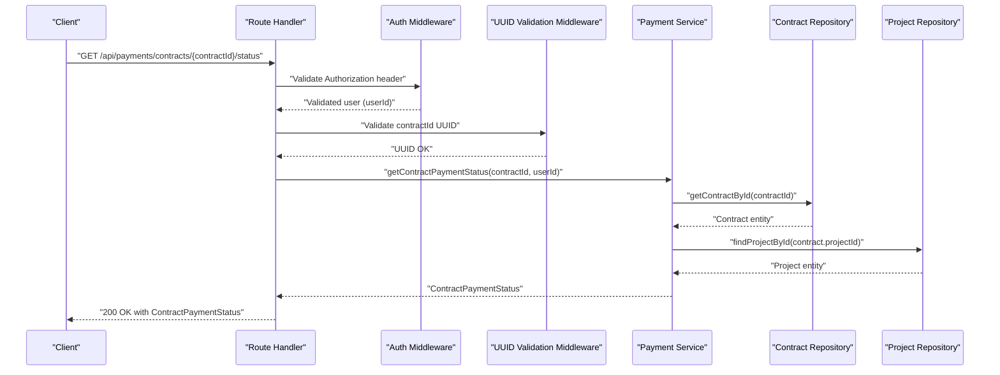

**Diagram sources**
- [payment-routes.ts](file://src/routes/payment-routes.ts#L393-L422)
- [auth-middleware.ts](file://src/middleware/auth-middleware.ts#L25-L70)
- [validation-middleware.ts](file://src/middleware/validation-middleware.ts#L782-L800)
- [payment-service.ts](file://src/services/payment-service.ts#L483-L543)
- [contract-repository.ts](file://src/repositories/contract-repository.ts#L24-L34)
- [project-repository.ts](file://src/repositories/project-repository.ts#L39-L54)

## Detailed Component Analysis

### Endpoint Definition and Behavior
- Purpose: Retrieve detailed payment status for a contract, including escrow details, total/pending/released amounts, and individual milestone statuses.
- Authentication: Requires a Bearer token; unauthorized responses are returned if missing or invalid.
- Validation: Validates that contractId is a UUID; invalid UUID returns a 400 error.
- Access control: Only the contract employer or freelancer can access the status; otherwise returns 403.

**Section sources**
- [payment-routes.ts](file://src/routes/payment-routes.ts#L362-L423)
- [auth-middleware.ts](file://src/middleware/auth-middleware.ts#L25-L70)
- [validation-middleware.ts](file://src/middleware/validation-middleware.ts#L782-L800)

### Request Flow
- Route handler:
  - Extracts userId from validated JWT and contractId from path
  - Calls getContractPaymentStatus(contractId, userId)
  - Maps service result to HTTP status and JSON payload
- Service function:
  - Loads contract and project entities
  - Verifies the requesting user is a party to the contract
  - Computes totals from project milestones
  - Returns ContractPaymentStatus with aggregated data

```mermaid
flowchart TD
Start(["Request Received"]) --> CheckAuth["Check Authorization Header"]
CheckAuth --> AuthOK{"JWT Valid?"}
AuthOK --> |No| Return401["Return 401 Unauthorized"]
AuthOK --> |Yes| CheckUUID["Validate contractId UUID"]
CheckUUID --> UUIDOK{"UUID Valid?"}
UUIDOK --> |No| Return400["Return 400 Invalid UUID"]
UUIDOK --> |Yes| LoadContract["Load Contract by ID"]
LoadContract --> Found{"Contract Found?"}
Found --> |No| Return404["Return 404 Not Found"]
Found --> |Yes| CheckParty["Verify User is Contract Party"]
CheckParty --> IsParty{"Is Employer or Freelancer?"}
IsParty --> |No| Return403["Return 403 Forbidden"]
IsParty --> |Yes| LoadProject["Load Project by Contract.projectId"]
LoadProject --> Compute["Compute totals from milestones"]
Compute --> BuildResp["Build ContractPaymentStatus"]
BuildResp --> Return200["Return 200 OK"]
```

**Diagram sources**
- [payment-routes.ts](file://src/routes/payment-routes.ts#L393-L422)
- [payment-service.ts](file://src/services/payment-service.ts#L483-L543)

**Section sources**
- [payment-routes.ts](file://src/routes/payment-routes.ts#L393-L422)
- [payment-service.ts](file://src/services/payment-service.ts#L483-L543)

### Response Schema: ContractPaymentStatus
The endpoint returns a structured JSON object containing:
- contractId: string (UUID)
- escrowAddress: string (on-chain escrow address)
- totalAmount: number (project budget)
- releasedAmount: number (sum of approved milestone amounts)
- pendingAmount: number (totalAmount - releasedAmount)
- milestones: array of objects with:
  - id: string (UUID)
  - title: string
  - amount: number
  - status: string (one of pending, in_progress, submitted, approved, disputed)
- contractStatus: string (active, completed, disputed, cancelled)

Swagger/OpenAPI documentation for this schema is embedded in the route file.

**Section sources**
- [payment-routes.ts](file://src/routes/payment-routes.ts#L48-L87)
- [payment-service.ts](file://src/services/payment-service.ts#L62-L75)
- [project-repository.ts](file://src/repositories/project-repository.ts#L7-L15)
- [contract-repository.ts](file://src/repositories/contract-repository.ts#L1-L18)

### Authentication and UUID Validation
- JWT authentication:
  - Route handler applies authMiddleware
  - authMiddleware validates Authorization header format and token validity
  - On failure, returns 401 with standardized error structure
- UUID validation:
  - Route handler applies validateUUID(['contractId'])
  - validateUUID checks path parameter format and returns 400 on mismatch

**Section sources**
- [auth-middleware.ts](file://src/middleware/auth-middleware.ts#L25-L70)
- [validation-middleware.ts](file://src/middleware/validation-middleware.ts#L782-L800)
- [payment-routes.ts](file://src/routes/payment-routes.ts#L393-L422)

### Error Responses
- 400 Bad Request:
  - Invalid UUID format for contractId
- 401 Unauthorized:
  - Missing or invalid Authorization header/token
- 403 Forbidden:
  - User is not a party to the contract
- 404 Not Found:
  - Contract or project not found

These mappings are handled in the route handler by inspecting the service result code and returning the appropriate HTTP status.

**Section sources**
- [payment-routes.ts](file://src/routes/payment-routes.ts#L409-L418)
- [payment-service.ts](file://src/services/payment-service.ts#L491-L507)

### Practical Example: Checking Contract Payment Progress
- Scenario: A freelancer wants to check the payment progress of a contract they are working on.
- Steps:
  1. Obtain a valid JWT access token from the authentication flow.
  2. Call GET /api/payments/contracts/{contractId}/status with the Authorization: Bearer <token> header.
  3. The server validates the token and UUID, loads the contract and project, computes totals, and returns the ContractPaymentStatus object.
- Outcome:
  - The response shows totalAmount, releasedAmount, pendingAmount, and a list of milestones with their current status, enabling the user to track progress.

**Section sources**
- [API-DOCUMENTATION.md](file://docs/API-DOCUMENTATION.md#L347-L392)
- [payment-routes.ts](file://src/routes/payment-routes.ts#L362-L423)

### Aggregation of On-chain and Off-chain Data
- Off-chain data:
  - Contract entity (including escrowAddress and contract status)
  - Project entity (including budget and milestone list with amounts and statuses)
- On-chain data:
  - Escrow address is included in the response; while the route itself does not query blockchain balances, the service returns the escrow address for transparency and potential future integration.
- The service computes releasedAmount by summing approved milestone amounts and pendingAmount as the difference between totalAmount and releasedAmount.

**Section sources**
- [payment-service.ts](file://src/services/payment-service.ts#L483-L543)
- [contract-repository.ts](file://src/repositories/contract-repository.ts#L1-L18)
- [project-repository.ts](file://src/repositories/project-repository.ts#L16-L28)

## Dependency Analysis
The endpoint depends on:
- Route handler for routing and middleware application
- Auth middleware for JWT validation
- UUID validation middleware for parameter validation
- Payment service for business logic and aggregation
- Repositories for data access
- Swagger/OpenAPI for documentation

```mermaid
graph LR
Routes["payment-routes.ts"] --> Auth["auth-middleware.ts"]
Routes --> UUID["validation-middleware.ts"]
Routes --> Service["payment-service.ts"]
Service --> ContractRepo["contract-repository.ts"]
Service --> ProjectRepo["project-repository.ts"]
Routes --> Docs["API-DOCUMENTATION.md"]
```

**Diagram sources**
- [payment-routes.ts](file://src/routes/payment-routes.ts#L362-L423)
- [auth-middleware.ts](file://src/middleware/auth-middleware.ts#L25-L70)
- [validation-middleware.ts](file://src/middleware/validation-middleware.ts#L782-L800)
- [payment-service.ts](file://src/services/payment-service.ts#L483-L543)
- [contract-repository.ts](file://src/repositories/contract-repository.ts#L24-L34)
- [project-repository.ts](file://src/repositories/project-repository.ts#L39-L54)
- [API-DOCUMENTATION.md](file://docs/API-DOCUMENTATION.md#L347-L392)

**Section sources**
- [payment-routes.ts](file://src/routes/payment-routes.ts#L362-L423)
- [payment-service.ts](file://src/services/payment-service.ts#L483-L543)
- [contract-repository.ts](file://src/repositories/contract-repository.ts#L24-L34)
- [project-repository.ts](file://src/repositories/project-repository.ts#L39-L54)
- [API-DOCUMENTATION.md](file://docs/API-DOCUMENTATION.md#L347-L392)

## Performance Considerations
- The endpoint performs two database reads (contract and project) and a constant-time aggregation over milestones. Complexity is O(n) in the number of milestones.
- No blockchain queries are executed in the route handler; the escrow address is returned from the contract entity.
- Recommendations:
  - Ensure indexes on contract and project tables for efficient lookups by ID.
  - Keep milestone arrays reasonably sized to minimize aggregation overhead.
  - Consider caching frequently accessed contract/project data if latency becomes a concern.

[No sources needed since this section provides general guidance]

## Troubleshooting Guide
Common issues and resolutions:
- 401 Unauthorized:
  - Cause: Missing or invalid Authorization header
  - Resolution: Include a valid Bearer token in the Authorization header
- 400 Bad Request (UUID):
  - Cause: contractId is not a valid UUID
  - Resolution: Ensure contractId follows UUID v4 format
- 403 Forbidden:
  - Cause: User is not the employer or freelancer associated with the contract
  - Resolution: Authenticate as a valid contract party
- 404 Not Found:
  - Cause: Contract or project not found
  - Resolution: Verify contractId and ensure the contract links to a valid project

**Section sources**
- [auth-middleware.ts](file://src/middleware/auth-middleware.ts#L25-L70)
- [validation-middleware.ts](file://src/middleware/validation-middleware.ts#L782-L800)
- [payment-routes.ts](file://src/routes/payment-routes.ts#L409-L418)
- [payment-service.ts](file://src/services/payment-service.ts#L491-L507)

## Conclusion
The GET /api/payments/contracts/{contractId}/status endpoint provides a comprehensive view of a contract’s payment status by combining off-chain data (project budget and milestone statuses) with on-chain metadata (escrow address). It enforces strict authentication and validation, returns a well-defined response schema, and maps service errors to appropriate HTTP statuses for predictable client handling.

[No sources needed since this section summarizes without analyzing specific files]

## Appendices

### Endpoint Reference
- Method: GET
- URL: /api/payments/contracts/{contractId}/status
- Path parameters:
  - contractId: string (UUID)
- Query parameters: None
- Headers:
  - Authorization: Bearer <token>
- Success response: 200 OK with ContractPaymentStatus
- Error responses: 400 (invalid UUID), 401 (unauthenticated), 403 (unauthorized), 404 (not found)

**Section sources**
- [payment-routes.ts](file://src/routes/payment-routes.ts#L362-L423)
- [API-DOCUMENTATION.md](file://docs/API-DOCUMENTATION.md#L347-L392)

### Response Schema Details
- contractId: string (UUID)
- escrowAddress: string
- totalAmount: number
- releasedAmount: number
- pendingAmount: number
- milestones: array of objects with id, title, amount, status
- contractStatus: string

**Section sources**
- [payment-routes.ts](file://src/routes/payment-routes.ts#L48-L87)
- [payment-service.ts](file://src/services/payment-service.ts#L62-L75)