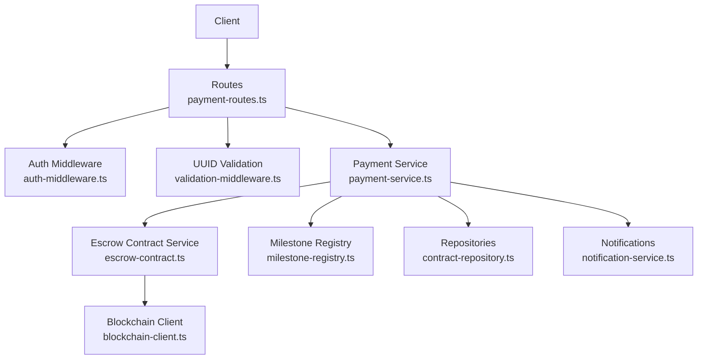
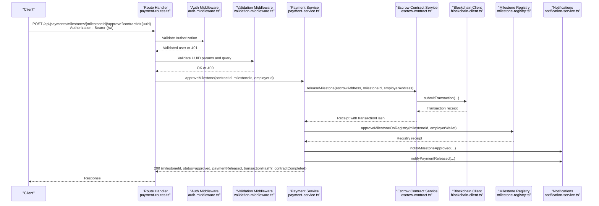
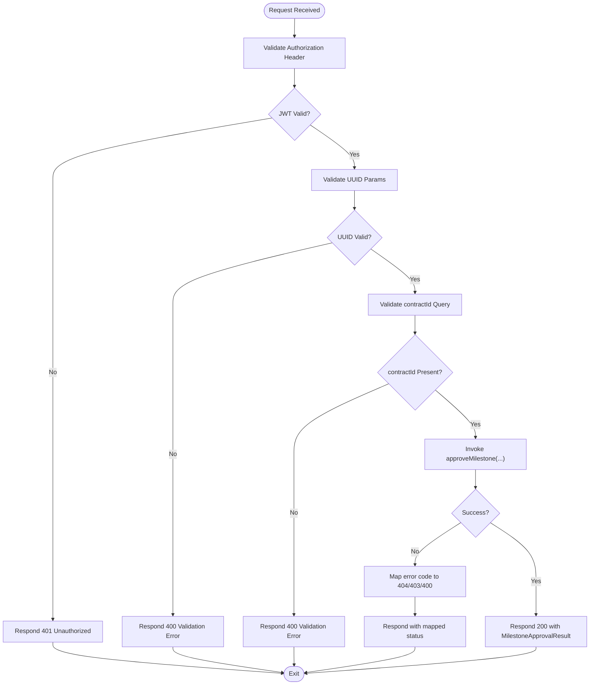
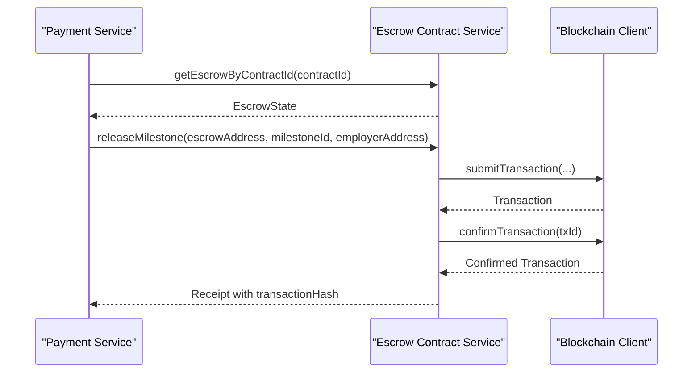
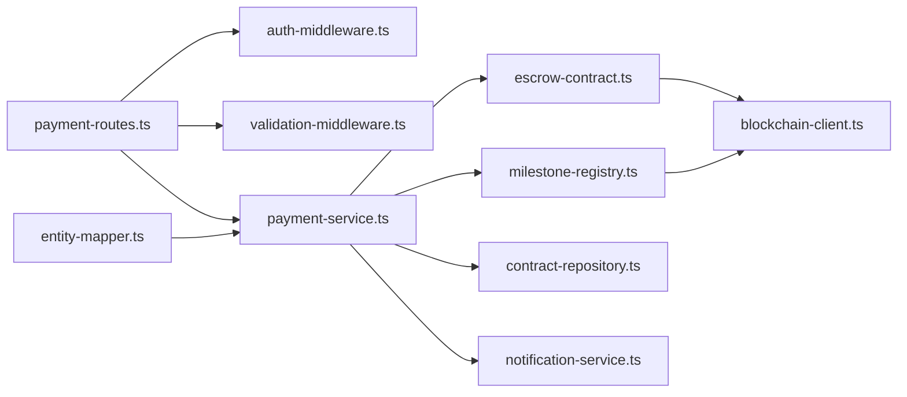

# Milestone Approval

<cite>
**Referenced Files in This Document**
- [payment-routes.ts](file://src/routes/payment-routes.ts)
- [payment-service.ts](file://src/services/payment-service.ts)
- [escrow-contract.ts](file://src/services/escrow-contract.ts)
- [auth-middleware.ts](file://src/middleware/auth-middleware.ts)
- [validation-middleware.ts](file://src/middleware/validation-middleware.ts)
- [blockchain-client.ts](file://src/services/blockchain-client.ts)
- [milestone-registry.ts](file://src/services/milestone-registry.ts)
- [entity-mapper.ts](file://src/utils/entity-mapper.ts)
- [contract-repository.ts](file://src/repositories/contract-repository.ts)
- [notification-service.ts](file://src/services/notification-service.ts)
</cite>

## Table of Contents
1. [Introduction](#introduction)
2. [Project Structure](#project-structure)
3. [Core Components](#core-components)
4. [Architecture Overview](#architecture-overview)
5. [Detailed Component Analysis](#detailed-component-analysis)
6. [Dependency Analysis](#dependency-analysis)
7. [Performance Considerations](#performance-considerations)
8. [Troubleshooting Guide](#troubleshooting-guide)
9. [Conclusion](#conclusion)

## Introduction
This document describes the POST /api/payments/milestones/{milestoneId}/approve endpoint used by employers to approve a completed milestone. Upon approval, the system triggers a payment release from the blockchain escrow and updates internal state accordingly. It covers authentication, request validation, service invocation, blockchain integration, and response handling.

## Project Structure
The milestone approval flow spans routing, middleware, service orchestration, blockchain client, and auxiliary repositories and services.

**Diagram sources**
- [payment-routes.ts](file://src/routes/payment-routes.ts#L180-L261)
- [auth-middleware.ts](file://src/middleware/auth-middleware.ts#L25-L70)
- [validation-middleware.ts](file://src/middleware/validation-middleware.ts#L782-L800)
- [payment-service.ts](file://src/services/payment-service.ts#L196-L352)
- [escrow-contract.ts](file://src/services/escrow-contract.ts#L134-L199)
- [milestone-registry.ts](file://src/services/milestone-registry.ts#L138-L186)
- [contract-repository.ts](file://src/repositories/contract-repository.ts#L1-L39)
- [notification-service.ts](file://src/services/notification-service.ts#L212-L262)
- [blockchain-client.ts](file://src/services/blockchain-client.ts#L131-L206)

**Section sources**
- [payment-routes.ts](file://src/routes/payment-routes.ts#L180-L261)
- [payment-service.ts](file://src/services/payment-service.ts#L196-L352)

## Core Components
- Route handler enforces JWT authentication and UUID validation for milestoneId, requires contractId query parameter, and invokes approveMilestone.
- Payment service validates ownership and milestone status, executes blockchain release via escrow contract, updates project and contract state, and notifies participants.
- Escrow contract service simulates blockchain transactions and updates in-memory state.
- Blockchain client simulates transaction submission, confirmation, and receipts.
- Milestone registry updates blockchain records for milestone approval.
- Repositories persist contract and project updates.
- Notifications inform freelancers and employers of approval and payment release.

**Section sources**
- [payment-routes.ts](file://src/routes/payment-routes.ts#L180-L261)
- [payment-service.ts](file://src/services/payment-service.ts#L196-L352)
- [escrow-contract.ts](file://src/services/escrow-contract.ts#L134-L199)
- [blockchain-client.ts](file://src/services/blockchain-client.ts#L131-L206)
- [milestone-registry.ts](file://src/services/milestone-registry.ts#L138-L186)
- [contract-repository.ts](file://src/repositories/contract-repository.ts#L1-L39)
- [notification-service.ts](file://src/services/notification-service.ts#L212-L262)

## Architecture Overview
The approval flow integrates REST routing, middleware validation, service orchestration, blockchain execution, and state updates.

**Diagram sources**
- [payment-routes.ts](file://src/routes/payment-routes.ts#L180-L261)
- [auth-middleware.ts](file://src/middleware/auth-middleware.ts#L25-L70)
- [validation-middleware.ts](file://src/middleware/validation-middleware.ts#L782-L800)
- [payment-service.ts](file://src/services/payment-service.ts#L196-L352)
- [escrow-contract.ts](file://src/services/escrow-contract.ts#L134-L199)
- [blockchain-client.ts](file://src/services/blockchain-client.ts#L131-L206)
- [milestone-registry.ts](file://src/services/milestone-registry.ts#L138-L186)
- [notification-service.ts](file://src/services/notification-service.ts#L212-L262)

## Detailed Component Analysis

### Endpoint Definition
- Method: POST
- URL Pattern: /api/payments/milestones/{milestoneId}/approve
- Path Parameter:
  - milestoneId: UUID (validated by middleware)
- Required Query Parameter:
  - contractId: UUID (validated by route handler)
- Authentication:
  - Bearer JWT token required; validated by auth middleware
- Purpose:
  - Approve a completed milestone and trigger payment release from escrow

**Section sources**
- [payment-routes.ts](file://src/routes/payment-routes.ts#L180-L261)

### Request Flow
1. Authentication
   - Route uses auth middleware to extract and validate JWT.
   - On missing/invalid token, responds with 401.
2. Validation
   - UUID validation ensures milestoneId is a valid UUID.
   - contractId query parameter is required; otherwise 400.
3. Service Invocation
   - Calls approveMilestone with contractId, milestoneId, and employerId.
4. Response Handling
   - Returns 200 with MilestoneApprovalResult on success.
   - Maps service error codes to 404 (not found), 403 (unauthorized), or 400 (validation/invalid status).

**Diagram sources**
- [payment-routes.ts](file://src/routes/payment-routes.ts#L219-L261)
- [auth-middleware.ts](file://src/middleware/auth-middleware.ts#L25-L70)
- [validation-middleware.ts](file://src/middleware/validation-middleware.ts#L782-L800)

**Section sources**
- [payment-routes.ts](file://src/routes/payment-routes.ts#L219-L261)

### Service Layer: approveMilestone
Responsibilities:
- Validate contract existence and employer ownership.
- Validate project and milestone existence and status (must not be approved or disputed).
- Execute blockchain release via escrow contract service.
- Update project milestone status to approved.
- Optionally complete contract and project if all milestones approved.
- Update blockchain milestone registry to approved.
- Send notifications to freelancer and employer.

Key behaviors:
- Escrow release returns a transaction receipt containing transactionHash.
- If blockchain release fails, the service logs and continues (best-effort simulation).
- After updating local state, it attempts to approve the milestone on the blockchain registry.
- If all milestones approved, updates contract and project to completed and completes the agreement on-chain.

**Section sources**
- [payment-service.ts](file://src/services/payment-service.ts#L196-L352)

### Blockchain Integration: Escrow Release
- Uses getEscrowByContractId to locate escrow.
- Calls releaseMilestone with escrow address, milestoneId, and approver address.
- Submits transaction and confirms it; captures receipt with transactionHash.
- Updates in-memory escrow state (balance, milestone status).

**Diagram sources**
- [payment-service.ts](file://src/services/payment-service.ts#L259-L274)
- [escrow-contract.ts](file://src/services/escrow-contract.ts#L134-L199)
- [blockchain-client.ts](file://src/services/blockchain-client.ts#L131-L206)

**Section sources**
- [escrow-contract.ts](file://src/services/escrow-contract.ts#L134-L199)
- [blockchain-client.ts](file://src/services/blockchain-client.ts#L131-L206)

### Blockchain Integration: Milestone Registry
- After local approval, the service calls approveMilestoneOnRegistry to update the blockchain record.
- The registry stores a record keyed by a hash of milestoneId and updates status to approved upon successful transaction confirmation.

**Section sources**
- [payment-service.ts](file://src/services/payment-service.ts#L287-L295)
- [milestone-registry.ts](file://src/services/milestone-registry.ts#L138-L186)

### Notifications
- On approval: notifyMilestoneApproved to freelancer.
- On payment release: notifyPaymentReleased to freelancer.
- Notifications are persisted and delivered to users.

**Section sources**
- [notification-service.ts](file://src/services/notification-service.ts#L212-L262)
- [payment-service.ts](file://src/services/payment-service.ts#L322-L341)

### Response Schema: 200 Success
MilestoneApprovalResult:
- milestoneId: string (UUID)
- status: "approved"
- paymentReleased: boolean (always true after successful release)
- transactionHash: string (optional; present if blockchain release succeeded)
- contractCompleted: boolean (true if all milestones approved and contract/project updated)

**Section sources**
- [payment-service.ts](file://src/services/payment-service.ts#L47-L61)
- [payment-service.ts](file://src/services/payment-service.ts#L342-L351)

### Error Responses
- 400 Bad Request
  - Missing or invalid contractId query parameter.
  - Invalid UUID format for milestoneId.
- 401 Unauthorized
  - Missing or invalid Authorization header.
  - Token validation failure.
- 403 Forbidden
  - Only the contract employer can approve milestones.
- 404 Not Found
  - Contract or milestone not found.

Mapping logic:
- Service returns error codes; route handler maps:
  - NOT_FOUND -> 404
  - UNAUTHORIZED -> 403
  - Otherwise -> 400

**Section sources**
- [payment-routes.ts](file://src/routes/payment-routes.ts#L249-L254)
- [payment-service.ts](file://src/services/payment-service.ts#L206-L241)
- [auth-middleware.ts](file://src/middleware/auth-middleware.ts#L25-L70)
- [validation-middleware.ts](file://src/middleware/validation-middleware.ts#L782-L800)

### Practical Example
- Employer calls POST /api/payments/milestones/{milestoneId}/approve?contractId={contractId} with a valid Bearer token.
- Backend validates JWT, UUID, and contractId.
- Service locates the escrow, submits a release transaction, receives a receipt with transactionHash, updates project and contract state, and notifies both parties.
- Response includes status=approved, paymentReleased=true, transactionHash, and contractCompleted if applicable.

**Section sources**
- [payment-routes.ts](file://src/routes/payment-routes.ts#L219-L261)
- [payment-service.ts](file://src/services/payment-service.ts#L259-L351)

## Dependency Analysis
- Route depends on auth middleware and validation middleware.
- Payment service depends on repositories, blockchain client, milestone registry, and notification service.
- Escrow contract service depends on blockchain client.
- Milestone registry depends on blockchain client.
- Entity mapper defines shared types used across services.

**Diagram sources**
- [payment-routes.ts](file://src/routes/payment-routes.ts#L180-L261)
- [auth-middleware.ts](file://src/middleware/auth-middleware.ts#L25-L70)
- [validation-middleware.ts](file://src/middleware/validation-middleware.ts#L782-L800)
- [payment-service.ts](file://src/services/payment-service.ts#L196-L352)
- [escrow-contract.ts](file://src/services/escrow-contract.ts#L134-L199)
- [milestone-registry.ts](file://src/services/milestone-registry.ts#L138-L186)
- [contract-repository.ts](file://src/repositories/contract-repository.ts#L1-L39)
- [notification-service.ts](file://src/services/notification-service.ts#L212-L262)
- [entity-mapper.ts](file://src/utils/entity-mapper.ts#L199-L250)

**Section sources**
- [payment-service.ts](file://src/services/payment-service.ts#L196-L352)
- [escrow-contract.ts](file://src/services/escrow-contract.ts#L134-L199)
- [milestone-registry.ts](file://src/services/milestone-registry.ts#L138-L186)
- [blockchain-client.ts](file://src/services/blockchain-client.ts#L131-L206)
- [entity-mapper.ts](file://src/utils/entity-mapper.ts#L199-L250)

## Performance Considerations
- Transaction confirmation is simulated and immediate in this environment; in production, confirmation waits could increase latency.
- Best-effort blockchain release: failures are logged and do not block response; consider retry policies and idempotency for production.
- Notification sends are synchronous; consider queuing for high throughput.

## Troubleshooting Guide
Common issues and resolutions:
- 401 Unauthorized
  - Ensure Authorization header is present and formatted as Bearer {token}.
  - Verify token is unexpired and valid.
- 400 Validation Error
  - Provide contractId query parameter as a UUID.
  - Ensure milestoneId is a valid UUID.
- 403 Forbidden
  - Only the contract employer can approve milestones; verify user ownership.
- 404 Not Found
  - Contract or milestone does not exist; verify identifiers.
- Blockchain Release Failure
  - Escrow release may fail due to insufficient balance or invalid state; check escrow balance and milestone status.

**Section sources**
- [auth-middleware.ts](file://src/middleware/auth-middleware.ts#L25-L70)
- [validation-middleware.ts](file://src/middleware/validation-middleware.ts#L782-L800)
- [payment-service.ts](file://src/services/payment-service.ts#L206-L241)
- [escrow-contract.ts](file://src/services/escrow-contract.ts#L134-L199)

## Conclusion
The milestone approval endpoint securely approves completed milestones, releases funds from the blockchain escrow, updates internal state, and notifies stakeholders. It enforces strict authentication and validation, integrates with blockchain services for immutability, and provides a clear success response schema with optional transaction details.