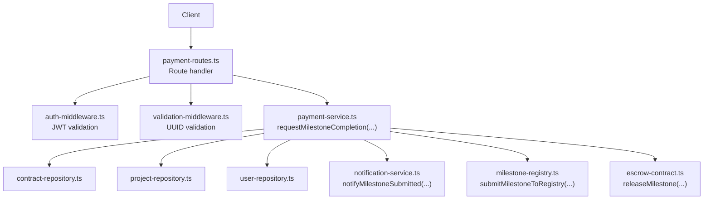
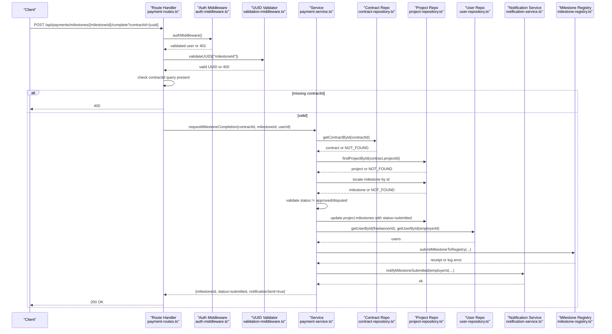
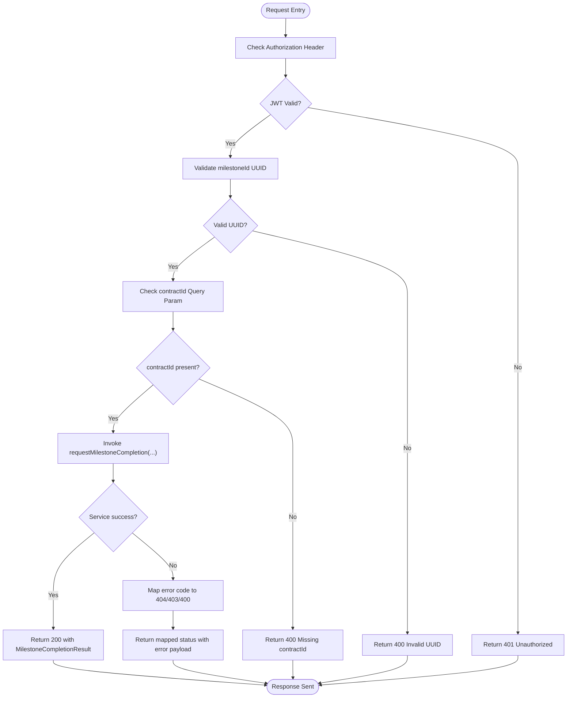
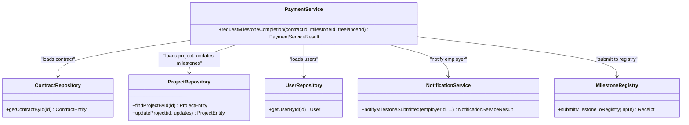
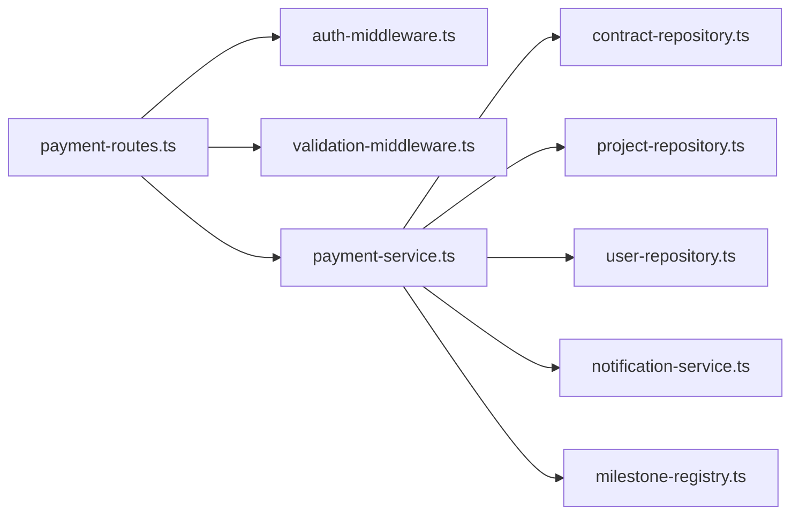

# Milestone Completion

<cite>
**Referenced Files in This Document**
- [payment-routes.ts](file://src/routes/payment-routes.ts)
- [payment-service.ts](file://src/services/payment-service.ts)
- [validation-middleware.ts](file://src/middleware/validation-middleware.ts)
- [auth-middleware.ts](file://src/middleware/auth-middleware.ts)
- [notification-service.ts](file://src/services/notification-service.ts)
- [project-repository.ts](file://src/repositories/project-repository.ts)
- [contract-repository.ts](file://src/repositories/contract-repository.ts)
- [user-repository.ts](file://src/repositories/user-repository.ts)
- [entity-mapper.ts](file://src/utils/entity-mapper.ts)
- [milestone-registry.ts](file://src/services/milestone-registry.ts)
- [escrow-contract.ts](file://src/services/escrow-contract.ts)
- [agreement-contract.ts](file://src/services/agreement-contract.ts)
</cite>

## Table of Contents
1. [Introduction](#introduction)
2. [Project Structure](#project-structure)
3. [Core Components](#core-components)
4. [Architecture Overview](#architecture-overview)
5. [Detailed Component Analysis](#detailed-component-analysis)
6. [Dependency Analysis](#dependency-analysis)
7. [Performance Considerations](#performance-considerations)
8. [Troubleshooting Guide](#troubleshooting-guide)
9. [Conclusion](#conclusion)

## Introduction
This document describes the POST /api/payments/milestones/{milestoneId}/complete endpoint used by freelancers to mark a milestone as complete. Upon successful submission, the system updates the milestone status, notifies the employer, and records the action on the blockchain registry. The endpoint requires JWT authentication and UUID validation for both path and query parameters.

## Project Structure
The endpoint is defined in the payment routes module and implemented by the payment service. It integrates with repositories for contracts and projects, user repository for identity, notification service for employer alerts, and blockchain services for registry updates.

**Diagram sources**
- [payment-routes.ts](file://src/routes/payment-routes.ts#L136-L178)
- [auth-middleware.ts](file://src/middleware/auth-middleware.ts#L25-L70)
- [validation-middleware.ts](file://src/middleware/validation-middleware.ts#L782-L800)
- [payment-service.ts](file://src/services/payment-service.ts#L86-L193)
- [contract-repository.ts](file://src/repositories/contract-repository.ts)
- [project-repository.ts](file://src/repositories/project-repository.ts#L1-L191)
- [user-repository.ts](file://src/repositories/user-repository.ts)
- [notification-service.ts](file://src/services/notification-service.ts#L212-L227)
- [milestone-registry.ts](file://src/services/milestone-registry.ts#L120-L135)
- [escrow-contract.ts](file://src/services/escrow-contract.ts)

**Section sources**
- [payment-routes.ts](file://src/routes/payment-routes.ts#L136-L178)
- [payment-service.ts](file://src/services/payment-service.ts#L86-L193)

## Core Components
- Route handler: Validates JWT, validates UUID path parameter, checks presence of contractId query parameter, and invokes the service.
- Service: Validates ownership, finds the project and milestone, updates status to submitted, submits to blockchain registry, and sends a notification to the employer.
- Repositories: Access contract and project entities to validate and update milestone status.
- Notification service: Sends an employer notification upon milestone submission.
- Blockchain integration: Submits milestone metadata to the registry for transparency.

**Section sources**
- [payment-routes.ts](file://src/routes/payment-routes.ts#L136-L178)
- [payment-service.ts](file://src/services/payment-service.ts#L86-L193)
- [notification-service.ts](file://src/services/notification-service.ts#L212-L227)
- [project-repository.ts](file://src/repositories/project-repository.ts#L1-L191)
- [contract-repository.ts](file://src/repositories/contract-repository.ts)
- [user-repository.ts](file://src/repositories/user-repository.ts)
- [milestone-registry.ts](file://src/services/milestone-registry.ts#L120-L135)

## Architecture Overview
The endpoint follows a layered architecture:
- Presentation layer: Express route handler
- Application layer: Payment service orchestrating business logic
- Domain layer: Repositories for persistence
- Integration layer: Notifications and blockchain registry

**Diagram sources**
- [payment-routes.ts](file://src/routes/payment-routes.ts#L136-L178)
- [auth-middleware.ts](file://src/middleware/auth-middleware.ts#L25-L70)
- [validation-middleware.ts](file://src/middleware/validation-middleware.ts#L782-L800)
- [payment-service.ts](file://src/services/payment-service.ts#L86-L193)
- [contract-repository.ts](file://src/repositories/contract-repository.ts)
- [project-repository.ts](file://src/repositories/project-repository.ts#L1-L191)
- [user-repository.ts](file://src/repositories/user-repository.ts)
- [notification-service.ts](file://src/services/notification-service.ts#L212-L227)
- [milestone-registry.ts](file://src/services/milestone-registry.ts#L120-L135)

## Detailed Component Analysis

### Endpoint Definition
- Method: POST
- URL Pattern: /api/payments/milestones/{milestoneId}/complete
- Path Parameters:
  - milestoneId: UUID (validated by validateUUID)
- Query Parameters:
  - contractId: UUID (required)
- Authentication: JWT via authMiddleware
- Response: 200 with MilestoneCompletionResult

**Section sources**
- [payment-routes.ts](file://src/routes/payment-routes.ts#L100-L135)
- [payment-routes.ts](file://src/routes/payment-routes.ts#L136-L178)

### Request Flow
1. Authentication
   - authMiddleware extracts Bearer token from Authorization header and validates it. Returns 401 if missing or invalid.
2. UUID Validation
   - validateUUID ensures milestoneId is a valid UUID; returns 400 otherwise.
3. Query Parameter Validation
   - contractId query parameter is required; returns 400 if missing.
4. Service Invocation
   - requestMilestoneCompletion is invoked with contractId, milestoneId, and authenticated userId.
5. Response Handling
   - On success, returns 200 with MilestoneCompletionResult.
   - On failure, maps service error codes to 404/403/400.

**Diagram sources**
- [payment-routes.ts](file://src/routes/payment-routes.ts#L136-L178)
- [auth-middleware.ts](file://src/middleware/auth-middleware.ts#L25-L70)
- [validation-middleware.ts](file://src/middleware/validation-middleware.ts#L782-L800)
- [payment-service.ts](file://src/services/payment-service.ts#L86-L193)

**Section sources**
- [payment-routes.ts](file://src/routes/payment-routes.ts#L136-L178)
- [auth-middleware.ts](file://src/middleware/auth-middleware.ts#L25-L70)
- [validation-middleware.ts](file://src/middleware/validation-middleware.ts#L782-L800)

### Service Implementation Details
- Ownership Verification
  - Ensures the authenticated user is the freelancer associated with the contract.
- Project and Milestone Lookup
  - Loads the project by contract’s projectId and locates the milestone by id.
- Status Validation
  - Prevents submission if milestone is already approved or under dispute.
- Persistence
  - Updates the milestone status to submitted in the project entity and persists the change.
- Blockchain Registry
  - Attempts to submit milestone metadata to the registry; logs failures but continues.
- Notification
  - Sends a notification to the employer indicating the milestone is submitted.

**Diagram sources**
- [payment-service.ts](file://src/services/payment-service.ts#L86-L193)
- [contract-repository.ts](file://src/repositories/contract-repository.ts)
- [project-repository.ts](file://src/repositories/project-repository.ts#L1-L191)
- [user-repository.ts](file://src/repositories/user-repository.ts)
- [notification-service.ts](file://src/services/notification-service.ts#L212-L227)
- [milestone-registry.ts](file://src/services/milestone-registry.ts#L120-L135)

**Section sources**
- [payment-service.ts](file://src/services/payment-service.ts#L86-L193)

### Response Schema
- 200 Success: MilestoneCompletionResult
  - milestoneId: string (UUID)
  - status: string (enum: submitted)
  - notificationSent: boolean

**Section sources**
- [payment-routes.ts](file://src/routes/payment-routes.ts#L23-L33)
- [payment-service.ts](file://src/services/payment-service.ts#L41-L45)

### Error Responses
- 400 Bad Request
  - Missing contractId query parameter
  - Invalid UUID format for milestoneId
- 401 Unauthorized
  - Missing or invalid Authorization header
- 403 Forbidden
  - Non-freelancer attempts to submit milestone completion
- 404 Not Found
  - Contract not found
  - Project not found
  - Milestone not found

**Section sources**
- [payment-routes.ts](file://src/routes/payment-routes.ts#L136-L178)
- [auth-middleware.ts](file://src/middleware/auth-middleware.ts#L25-L70)
- [validation-middleware.ts](file://src/middleware/validation-middleware.ts#L782-L800)
- [payment-service.ts](file://src/services/payment-service.ts#L92-L142)

### Practical Example
A freelancer completes a milestone and calls:
- Method: POST
- URL: /api/payments/milestones/{milestoneId}/complete?contractId={contractId}
- Headers: Authorization: Bearer <JWT>
- Body: None (no body required)

The system verifies the JWT, validates UUIDs, ensures the user is the contract’s freelancer, updates the milestone status to submitted, and sends a notification to the employer.

**Section sources**
- [payment-routes.ts](file://src/routes/payment-routes.ts#L136-L178)
- [payment-service.ts](file://src/services/payment-service.ts#L86-L193)

### Integration with Payment Service and Repository
- Payment Service updates the project’s milestone status and persists the change via ProjectRepository.
- The endpoint does not directly call a payment-repository; payment releases occur in the approve endpoint.

**Section sources**
- [payment-service.ts](file://src/services/payment-service.ts#L144-L153)
- [project-repository.ts](file://src/repositories/project-repository.ts#L43-L45)

## Dependency Analysis
- Route depends on:
  - authMiddleware for JWT
  - validateUUID for UUID validation
  - payment-service for business logic
- Payment service depends on:
  - contract-repository, project-repository, user-repository
  - notification-service
  - milestone-registry
  - escrow-contract (used by other endpoints; not directly here)

**Diagram sources**
- [payment-routes.ts](file://src/routes/payment-routes.ts#L136-L178)
- [auth-middleware.ts](file://src/middleware/auth-middleware.ts#L25-L70)
- [validation-middleware.ts](file://src/middleware/validation-middleware.ts#L782-L800)
- [payment-service.ts](file://src/services/payment-service.ts#L86-L193)

**Section sources**
- [payment-routes.ts](file://src/routes/payment-routes.ts#L136-L178)
- [payment-service.ts](file://src/services/payment-service.ts#L86-L193)

## Performance Considerations
- The endpoint performs a small number of synchronous repository reads and writes plus a best-effort blockchain submission. Typical latency is dominated by repository operations and network calls to the notification service and registry.
- Consider caching frequently accessed contracts/projects if traffic increases.

## Troubleshooting Guide
- 401 Unauthorized
  - Ensure Authorization header is present and formatted as Bearer <token>.
  - Verify the token is unexpired and valid.
- 400 Invalid UUID
  - Confirm milestoneId is a valid UUID v4.
  - Confirm contractId is a valid UUID v4 and passed as a query parameter.
- 403 Forbidden
  - Only the freelancer associated with the contract can submit milestone completion.
- 404 Not Found
  - Contract, project, or milestone may not exist, or the milestone id does not belong to the project.

**Section sources**
- [auth-middleware.ts](file://src/middleware/auth-middleware.ts#L25-L70)
- [validation-middleware.ts](file://src/middleware/validation-middleware.ts#L782-L800)
- [payment-service.ts](file://src/services/payment-service.ts#L92-L142)
- [payment-routes.ts](file://src/routes/payment-routes.ts#L136-L178)

## Conclusion
The POST /api/payments/milestones/{milestoneId}/complete endpoint enables freelancers to submit milestone completion safely and transparently. It enforces authentication and UUID validation, updates the milestone status, notifies the employer, and records the event on the blockchain registry. The design cleanly separates concerns across route handlers, middleware, services, and repositories.